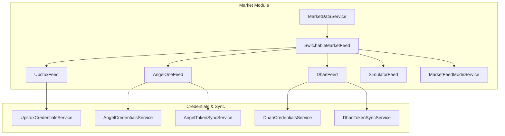
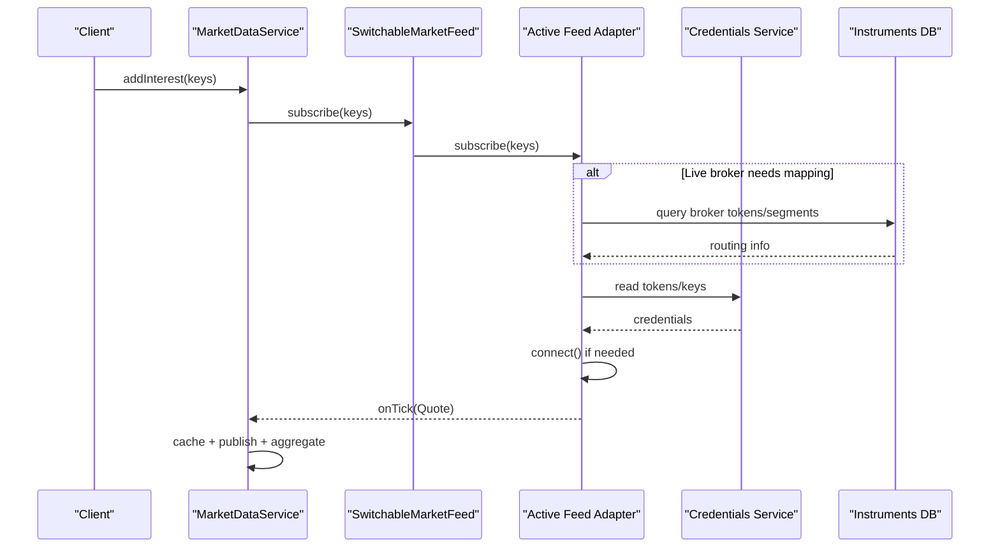
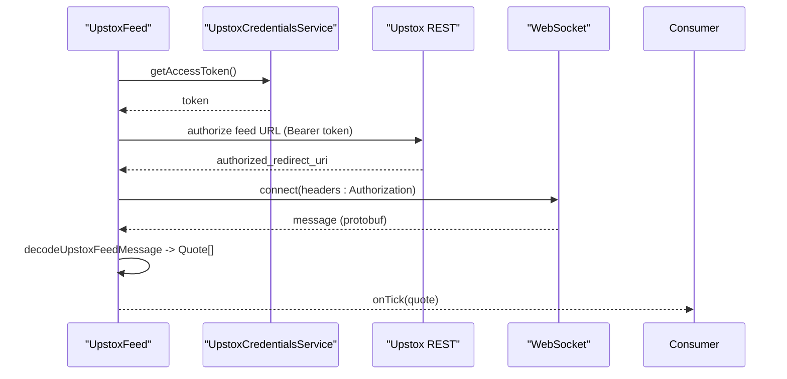
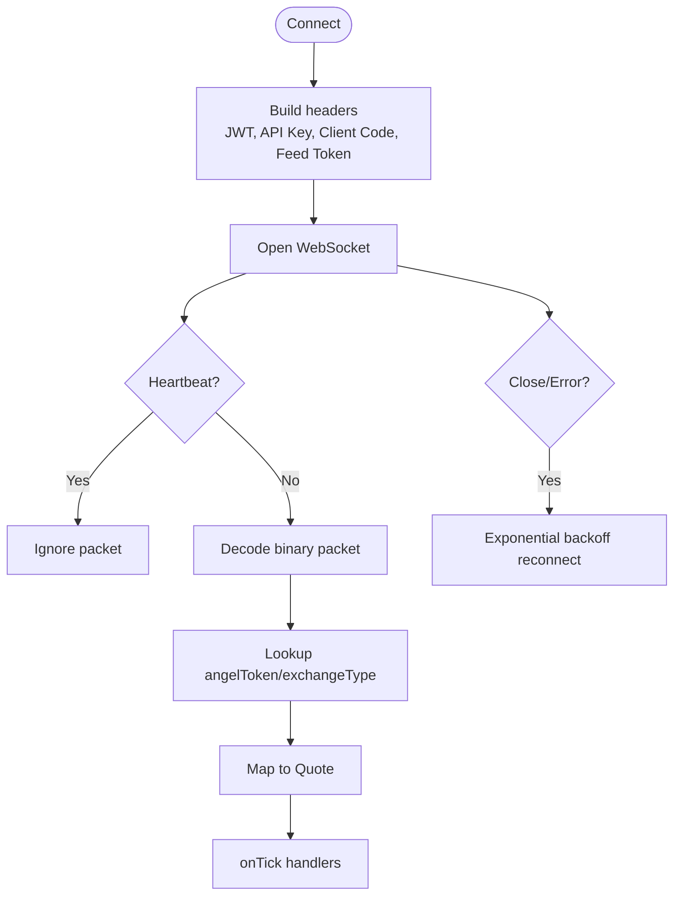
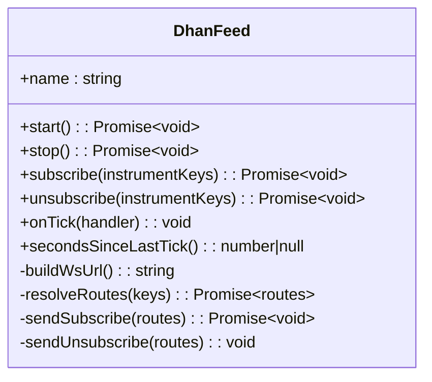
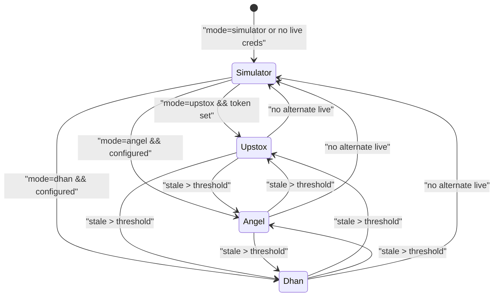
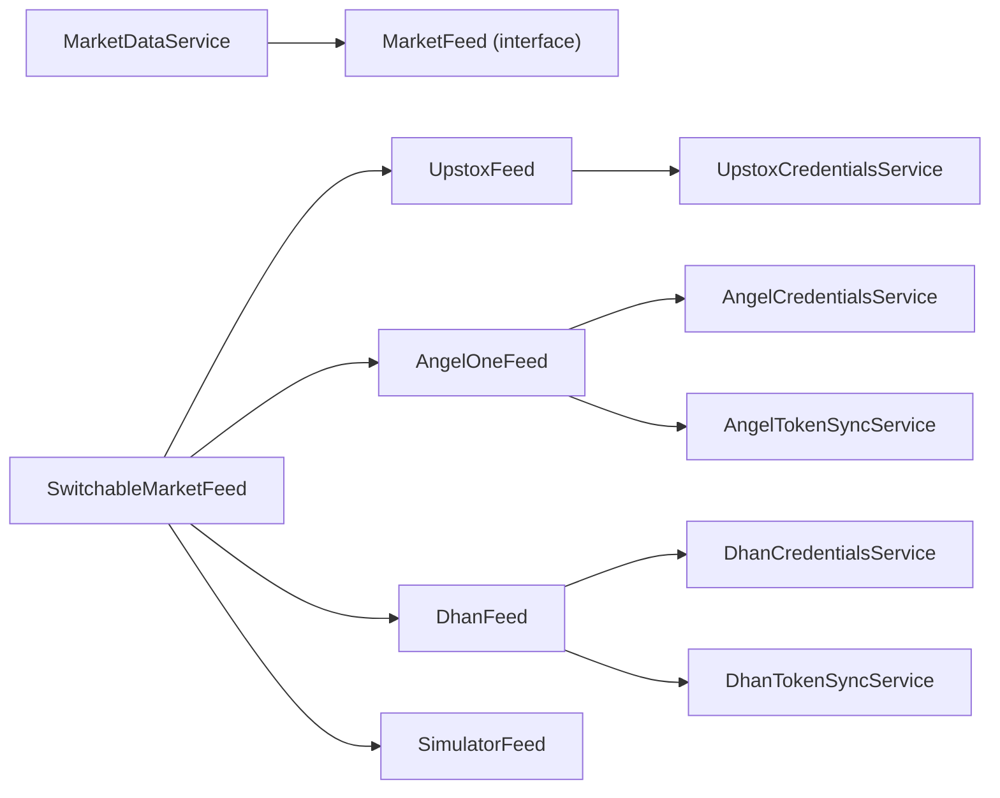

# Broker Integrations

<cite>
**Referenced Files in This Document**
- [market-feed.port.ts](file://backend/apps/api/src/modules/market/infrastructure/feed/market-feed.port.ts)
- [upstox-feed.ts](file://backend/apps/api/src/modules/market/infrastructure/feed/upstox-feed.ts)
- [angel-one-feed.ts](file://backend/apps/api/src/modules/market/infrastructure/feed/angel-one-feed.ts)
- [dhan-feed.ts](file://backend/apps/api/src/modules/market/infrastructure/feed/dhan-feed.ts)
- [switchable-market-feed.ts](file://backend/apps/api/src/modules/market/infrastructure/feed/switchable-market-feed.ts)
- [simulator-feed.ts](file://backend/apps/api/src/modules/market/infrastructure/feed/simulator-feed.ts)
- [market-data.service.ts](file://backend/apps/api/src/modules/market/application/market-data.service.ts)
- [upstox-credentials.service.ts](file://backend/apps/api/src/modules/market/application/upstox-credentials.service.ts)
- [angel-credentials.service.ts](file://backend/apps/api/src/modules/market/application/angel-credentials.service.ts)
- [dhan-credentials.service.ts](file://backend/apps/api/src/modules/market/application/dhan-credentials.service.ts)
- [angel-token-sync.service.ts](file://backend/apps/api/src/modules/market/application/angel-token-sync.service.ts)
- [dhan-token-sync.service.ts](file://backend/apps/api/src/modules/market/application/dhan-token-sync.service.ts)
- [angel-one-decode.ts](file://backend/apps/api/src/modules/market/infrastructure/feed/angel-one-decode.ts)
- [dhan-decode.ts](file://backend/apps/api/src/modules/market/infrastructure/feed/dhan-decode.ts)
- [upstox-protobuf.ts](file://backend/apps/api/src/modules/market/infrastructure/feed/upstox-protobuf.ts)
- [market-feed-mode.service.ts](file://backend/apps/api/src/modules/market/application/market-feed-mode.service.ts)
</cite>

## Table of Contents
1. Introduction
2. Project Structure
3. Core Components
4. Architecture Overview
5. Detailed Component Analysis
6. Dependency Analysis
7. Performance Considerations
8. Troubleshooting Guide
9. Conclusion

## Introduction
This document explains the broker integration layer that unifies market data from Upstox, Angel One, and Dhan behind a single MarketFeedPort interface. It covers how each broker implements the unified feed, credential management, token synchronization, authentication flows, error handling, data formats, rate limiting strategies, connection management, configuration guidance, and best practices for resilience.

## Project Structure
The market module centralizes broker integrations under infrastructure/feed with a shared port (MarketFeed), concrete adapters per broker, and a switchable facade that selects the active provider at runtime. Application services manage credentials, token sync, and the ingestion pipeline.

**Diagram sources**
- [market-data.service.ts:25-52](file://backend/apps/api/src/modules/market/application/market-data.service.ts#L25-L52)
- [switchable-market-feed.ts:24-70](file://backend/apps/api/src/modules/market/infrastructure/feed/switchable-market-feed.ts#L24-L70)
- [upstox-feed.ts:12-40](file://backend/apps/api/src/modules/market/infrastructure/feed/upstox-feed.ts#L12-L40)
- [angel-one-feed.ts:22-62](file://backend/apps/api/src/modules/market/infrastructure/feed/angel-one-feed.ts#L22-L62)
- [dhan-feed.ts:37-77](file://backend/apps/api/src/modules/market/infrastructure/feed/dhan-feed.ts#L37-L77)
- [simulator-feed.ts:25-44](file://backend/apps/api/src/modules/market/infrastructure/feed/simulator-feed.ts#L25-L44)
- [market-feed-mode.service.ts:21-46](file://backend/apps/api/src/modules/market/application/market-feed-mode.service.ts#L21-L46)
- [upstox-credentials.service.ts:44-79](file://backend/apps/api/src/modules/market/application/upstox-credentials.service.ts#L44-L79)
- [angel-credentials.service.ts:54-92](file://backend/apps/api/src/modules/market/application/angel-credentials.service.ts#L54-L92)
- [dhan-credentials.service.ts:57-88](file://backend/apps/api/src/modules/market/application/dhan-credentials.service.ts#L57-L88)
- [angel-token-sync.service.ts:48-62](file://backend/apps/api/src/modules/market/application/angel-token-sync.service.ts#L48-L62)
- [dhan-token-sync.service.ts:32-46](file://backend/apps/api/src/modules/market/application/dhan-token-sync.service.ts#L32-L46)

**Section sources**
- [market-feed.port.ts:7-22](file://backend/apps/api/src/modules/market/infrastructure/feed/market-feed.port.ts#L7-L22)
- [market-data.service.ts:25-52](file://backend/apps/api/src/modules/market/application/market-data.service.ts#L25-L52)
- [switchable-market-feed.ts:24-70](file://backend/apps/api/src/modules/market/infrastructure/feed/switchable-market-feed.ts#L24-L70)

## Core Components
- MarketFeedPort: Defines the unified contract for starting/stopping, subscribing/unsubscribing, tick delivery, and liveness reporting.
- SwitchableMarketFeed: Runtime selector among simulator and live brokers; supports failover on stale ticks.
- Concrete Adapters: UpstoxFeed, AngelOneFeed, DhanFeed implement protocol-specific WebSocket connections, auth, subscribe/unsubscribe payloads, and binary decoding.
- Credentials Services: Encrypted storage, environment fallback, Redis-based hot reload, and optional login/token generation endpoints.
- Token Sync Services: Map canonical instrument keys to broker-specific tokens/security IDs using master catalogs.
- Ingestion Pipeline: MarketDataService fans out quotes to Redis and event bus, aggregates candles, and monitors feed health.

**Section sources**
- [market-feed.port.ts:7-22](file://backend/apps/api/src/modules/market/infrastructure/feed/market-feed.port.ts#L7-L22)
- [switchable-market-feed.ts:24-70](file://backend/apps/api/src/modules/market/infrastructure/feed/switchable-market-feed.ts#L24-L70)
- [market-data.service.ts:25-52](file://backend/apps/api/src/modules/market/application/market-data.service.ts#L25-L52)

## Architecture Overview
The system uses a single MarketFeed instance selected by SwitchableMarketFeed based on configured mode and availability. Each adapter manages its own WebSocket lifecycle, credentials, and reconnection strategy. The ingestion pipeline subscribes only to instruments with active interest and persists quotes and candles.

**Diagram sources**
- [market-data.service.ts:61-96](file://backend/apps/api/src/modules/market/application/market-data.service.ts#L61-L96)
- [switchable-market-feed.ts:86-102](file://backend/apps/api/src/modules/market/infrastructure/feed/switchable-market-feed.ts#L86-L102)
- [angel-one-feed.ts:136-163](file://backend/apps/api/src/modules/market/infrastructure/feed/angel-one-feed.ts#L136-L163)
- [dhan-feed.ts:150-159](file://backend/apps/api/src/modules/market/infrastructure/feed/dhan-feed.ts#L150-L159)
- [upstox-feed.ts:54-79](file://backend/apps/api/src/modules/market/infrastructure/feed/upstox-feed.ts#L54-L79)

## Detailed Component Analysis

### Unified Market Feed Interface (MarketFeedPort)
- Purpose: Standardize start/stop, subscribe/unsubscribe, tick subscription, and secondsSinceLastTick across all providers.
- Consumers: MarketDataService binds once via onTick and delegates upstream subscriptions through the active feed.

**Section sources**
- [market-feed.port.ts:7-22](file://backend/apps/api/src/modules/market/infrastructure/feed/market-feed.port.ts#L7-L22)
- [market-data.service.ts:43-52](file://backend/apps/api/src/modules/market/application/market-data.service.ts#L43-L52)

### Upstox Integration
- Authentication: Uses an access token obtained via admin configuration or environment; feed URL is authorized via a REST endpoint before WebSocket connection.
- Connection: Establishes WSS with Authorization header; reconnects with exponential backoff; restarts when credentials change.
- Data Format: Protobuf (with JSON fallback); decodes into normalized Quote objects.
- Subscriptions: Sends full mode subscription messages; tracks subscribed keys locally.
- Error Handling: Logs errors, closes socket on error/close, reschedules reconnect with capped delay.

**Diagram sources**
- [upstox-feed.ts:48-79](file://backend/apps/api/src/modules/market/infrastructure/feed/upstox-feed.ts#L48-L79)
- [upstox-protobuf.ts:154-183](file://backend/apps/api/src/modules/market/infrastructure/feed/upstox-protobuf.ts#L154-L183)
- [upstox-credentials.service.ts:90-110](file://backend/apps/api/src/modules/market/application/upstox-credentials.service.ts#L90-L110)

**Section sources**
- [upstox-feed.ts:12-136](file://backend/apps/api/src/modules/market/infrastructure/feed/upstox-feed.ts#L12-L136)
- [upstox-protobuf.ts:1-227](file://backend/apps/api/src/modules/market/infrastructure/feed/upstox-protobuf.ts#L1-L227)
- [upstox-credentials.service.ts:44-216](file://backend/apps/api/src/modules/market/application/upstox-credentials.service.ts#L44-L216)

### Angel One Integration
- Authentication: Requires API key, client code, JWT token, and feed token; can obtain JWT/feed token via password+TOTP login flow.
- Connection: WSS with headers for authorization and feed token; heartbeat ping every fixed interval; reconnects on close/error.
- Data Format: Binary packets; decodes exchangeType, token, LTP, prevClose, volume, timestamp; maps to Quote.
- Subscriptions: Maps canonical instrumentKey to angelToken and exchangeType via Instruments DB; sends grouped token lists per exchange type.
- Error Handling: Heartbeat detection skips non-data frames; reconnect with exponential backoff; rebuild routes after reconnect.

**Diagram sources**
- [angel-one-feed.ts:71-107](file://backend/apps/api/src/modules/market/infrastructure/feed/angel-one-feed.ts#L71-L107)
- [angel-one-decode.ts:23-57](file://backend/apps/api/src/modules/market/infrastructure/feed/angel-one-decode.ts#L23-L57)
- [angel-credentials.service.ts:179-219](file://backend/apps/api/src/modules/market/application/angel-credentials.service.ts#L179-L219)

**Section sources**
- [angel-one-feed.ts:22-242](file://backend/apps/api/src/modules/market/infrastructure/feed/angel-one-feed.ts#L22-L242)
- [angel-one-decode.ts:1-62](file://backend/apps/api/src/modules/market/infrastructure/feed/angel-one-decode.ts#L1-L62)
- [angel-credentials.service.ts:54-305](file://backend/apps/api/src/modules/market/application/angel-credentials.service.ts#L54-L305)
- [angel-token-sync.service.ts:48-170](file://backend/apps/api/src/modules/market/application/angel-token-sync.service.ts#L48-L170)

### Dhan Integration
- Authentication: Access token and client ID passed via query parameters in WSS URL; token can be generated via PIN+TOTP flow.
- Connection: WSS with version and authType; handles server disconnect packets explicitly; auto-pong support.
- Data Format: Binary v2 packets; decodes exchange segment, securityId, LTP, prevClose, volume, timestamp; maintains prevClose per route.
- Subscriptions: Resolves dhanSecurityId and dhanExchangeSegment from Instruments DB or parses DHAN|segment|securityId keys; batches subscribe/unsubscribe requests.
- Error Handling: Detects disconnect packets and reconnects; exponential backoff; clears prevClose caches on reconnect.

**Diagram sources**
- [dhan-feed.ts:37-279](file://backend/apps/api/src/modules/market/infrastructure/feed/dhan-feed.ts#L37-L279)
- [dhan-decode.ts:1-77](file://backend/apps/api/src/modules/market/infrastructure/feed/dhan-decode.ts#L1-L77)

**Section sources**
- [dhan-feed.ts:37-279](file://backend/apps/api/src/modules/market/infrastructure/feed/dhan-feed.ts#L37-L279)
- [dhan-decode.ts:1-77](file://backend/apps/api/src/modules/market/infrastructure/feed/dhan-decode.ts#L1-L77)
- [dhan-credentials.service.ts:57-282](file://backend/apps/api/src/modules/market/application/dhan-credentials.service.ts#L57-L282)
- [dhan-token-sync.service.ts:32-179](file://backend/apps/api/src/modules/market/application/dhan-token-sync.service.ts#L32-L179)

### Switchable Feed and Mode Selection
- Mode Service: Stores active feed mode (simulator | upstox | angel | dhan) in DB with Redis pub/sub hot reload; falls back to environment default.
- SwitchableFeed: Picks primary feed based on mode and credentials; fails over to alternate live feed if current feed is stale beyond threshold; otherwise falls back to simulator.
- Rebinding: On mode or credential changes, switches active feed while preserving subscribed keys.

**Diagram sources**
- [market-feed-mode.service.ts:21-99](file://backend/apps/api/src/modules/market/application/market-feed-mode.service.ts#L21-L99)
- [switchable-market-feed.ts:24-186](file://backend/apps/api/src/modules/market/infrastructure/feed/switchable-market-feed.ts#L24-L186)

**Section sources**
- [market-feed-mode.service.ts:21-99](file://backend/apps/api/src/modules/market/application/market-feed-mode.service.ts#L21-L99)
- [switchable-market-feed.ts:24-186](file://backend/apps/api/src/modules/market/infrastructure/feed/switchable-market-feed.ts#L24-L186)

### Ingestion Pipeline and Stale Feed Watchdog
- Interest Management: Tracks per-instrument consumer count; subscribes upstream only when first consumer arrives and unsubscribes when last leaves.
- Persistence: Writes normalized quotes to Redis with TTL; publishes to event bus; aggregates 1-minute candles and flushes to MongoDB.
- Health Check: Periodically checks secondsSinceLastTick during market hours; warns and triggers re-subscribe if stale beyond configured threshold.

**Section sources**
- [market-data.service.ts:25-139](file://backend/apps/api/src/modules/market/application/market-data.service.ts#L25-L139)

## Dependency Analysis
- MarketDataService depends on MarketFeed abstraction and persistence/eventing infrastructure.
- SwitchableMarketFeed composes all concrete feeds and mode service; reacts to credential changes to rebind.
- Each broker feed depends on its credentials service and optionally Instruments DB for routing metadata.
- Token sync services depend on external master catalogs and Instruments DB to populate broker-specific identifiers.

**Diagram sources**
- [market-data.service.ts:25-52](file://backend/apps/api/src/modules/market/application/market-data.service.ts#L25-L52)
- [switchable-market-feed.ts:24-70](file://backend/apps/api/src/modules/market/infrastructure/feed/switchable-market-feed.ts#L24-L70)
- [upstox-feed.ts:12-24](file://backend/apps/api/src/modules/market/infrastructure/feed/upstox-feed.ts#L12-L24)
- [angel-one-feed.ts:22-39](file://backend/apps/api/src/modules/market/infrastructure/feed/angel-one-feed.ts#L22-L39)
- [dhan-feed.ts:37-54](file://backend/apps/api/src/modules/market/infrastructure/feed/dhan-feed.ts#L37-L54)
- [angel-token-sync.service.ts:48-62](file://backend/apps/api/src/modules/market/application/angel-token-sync.service.ts#L48-L62)
- [dhan-token-sync.service.ts:32-46](file://backend/apps/api/src/modules/market/application/dhan-token-sync.service.ts#L32-L46)

**Section sources**
- [market-data.service.ts:25-52](file://backend/apps/api/src/modules/market/application/market-data.service.ts#L25-L52)
- [switchable-market-feed.ts:24-70](file://backend/apps/api/src/modules/market/infrastructure/feed/switchable-market-feed.ts#L24-L70)

## Performance Considerations
- On-demand subscription: Avoids subscribing to the entire instrument catalog; only instruments with active consumers are requested.
- Batched operations: Dhan subscribe/unsubscribe batch requests; Angel groups tokens by exchange type; Angel/Dhan token sync bulk writes in batches.
- Heartbeats and pings: Angel sends periodic pings; Dhan relies on ws library pong behavior; prevents idle disconnections.
- Backoff: All live feeds use exponential backoff with a cap to avoid thundering herds on reconnect.
- Stale watchdog: Re-subscribes tracked keys when feed stalls during market hours to recover quickly.

[No sources needed since this section provides general guidance]

## Troubleshooting Guide

### Common Issues and Remedies
- Missing credentials:
  - Upstox: Ensure access token is set; test via credentials service; feed will warn and wait for setup.
  - Angel: Configure API key, client code, JWT, and feed token; use login-by-password flow to refresh tokens.
  - Dhan: Set client ID and access token; generate token via PIN+TOTP if needed.
- No ticks during market hours:
  - Check secondsSinceLastTick; stale watchdog will log warnings and trigger re-subscription.
  - Verify network connectivity to broker endpoints and firewall rules.
- Frequent reconnects:
  - Inspect logs for error messages; validate tokens; ensure rate limits are not exceeded.
  - For Angel, confirm heartbeat is being sent and accepted.
- Instrument mapping failures:
  - Run token sync for Angel/Dhan to populate broker-specific identifiers; verify symbol matching logic.
  - Confirm allowed segments and exchange mappings.

**Section sources**
- [upstox-credentials.service.ts:147-162](file://backend/apps/api/src/modules/market/application/upstox-credentials.service.ts#L147-L162)
- [angel-credentials.service.ts:179-219](file://backend/apps/api/src/modules/market/application/angel-credentials.service.ts#L179-L219)
- [dhan-credentials.service.ts:154-211](file://backend/apps/api/src/modules/market/application/dhan-credentials.service.ts#L154-L211)
- [market-data.service.ts:128-137](file://backend/apps/api/src/modules/market/application/market-data.service.ts#L128-L137)
- [angel-token-sync.service.ts:55-140](file://backend/apps/api/src/modules/market/application/angel-token-sync.service.ts#L55-L140)
- [dhan-token-sync.service.ts:39-147](file://backend/apps/api/src/modules/market/application/dhan-token-sync.service.ts#L39-L147)

## Configuration Examples

- Environment variables (examples):
  - Upstox: UPSTOX_ACCESS_TOKEN, UPSTOX_API_KEY, UPSTOX_API_SECRET
  - Angel: ANGEL_API_KEY, ANGEL_CLIENT_CODE, ANGEL_JWT_TOKEN, ANGEL_FEED_TOKEN
  - Dhan: DHAN_CLIENT_ID, DHAN_ACCESS_TOKEN
  - Market feed mode: MARKET_FEED (simulator | upstox | angel | dhan)
- Admin UI updates:
  - Use respective admin controllers/services to update encrypted credentials; changes propagate via Redis to running instances.
- Token sync:
  - Run Angel/Dhan token sync jobs to map instruments to broker tokens/security IDs.

[No sources needed since this section provides general guidance]

## Best Practices
- Prefer database-stored credentials with environment fallback; rotate tokens via admin APIs without restarts.
- Keep instrument catalogs synchronized; run token sync regularly to maintain accurate mappings.
- Monitor feed health using secondsSinceLastTick and stale thresholds; alert on prolonged stalls.
- Respect rate limits by batching subscriptions and avoiding unnecessary re-subscriptions.
- Use simulator mode for development and testing; switch to live modes only when credentials are fully configured.

[No sources needed since this section provides general guidance]

## Conclusion
The broker integration layer abstracts Upstox, Angel One, and Dhan behind a consistent MarketFeedPort, enabling seamless switching, robust reconnection, and centralized ingestion. Credential services provide secure, hot-reloadable configuration, while token sync ensures accurate instrument routing. With on-demand subscriptions, batched messaging, heartbeats, and stale watchdogs, the system balances performance and reliability across diverse broker protocols.