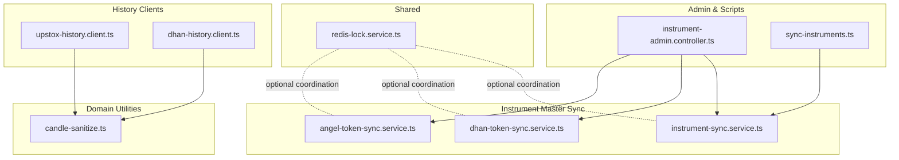
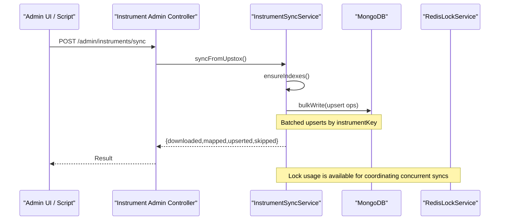
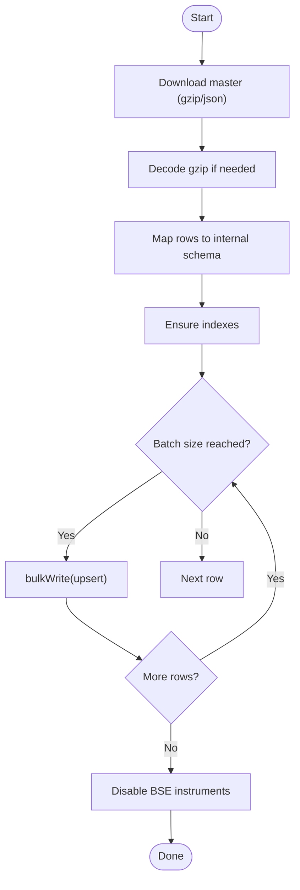
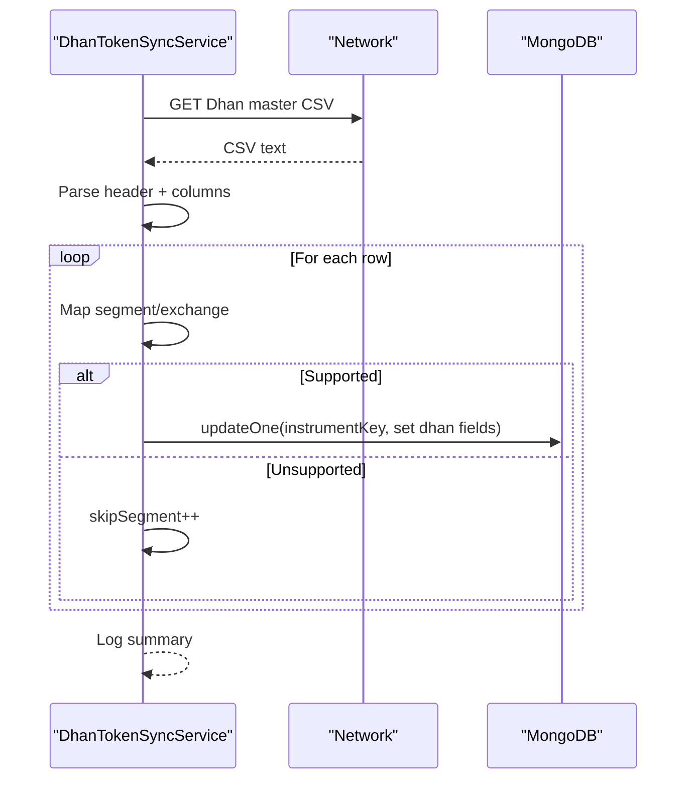
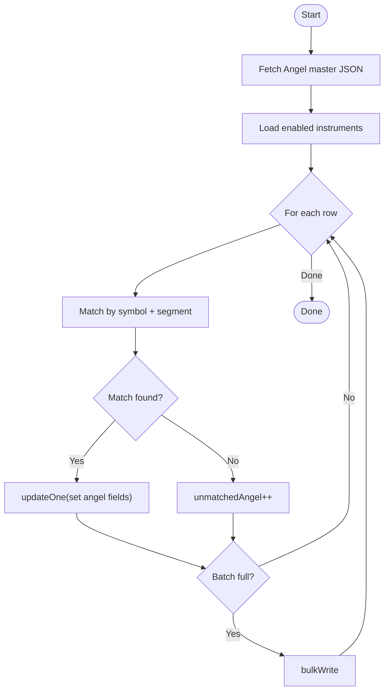
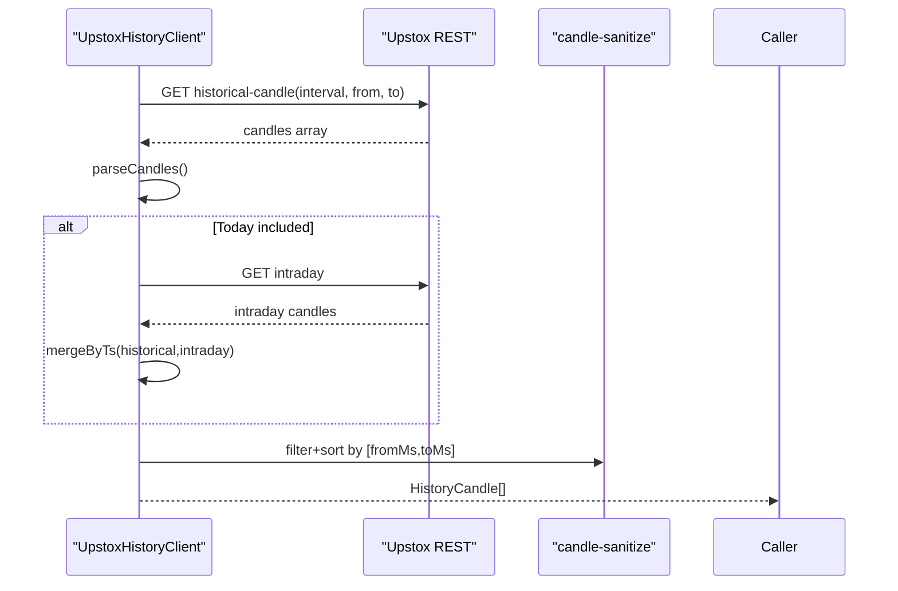
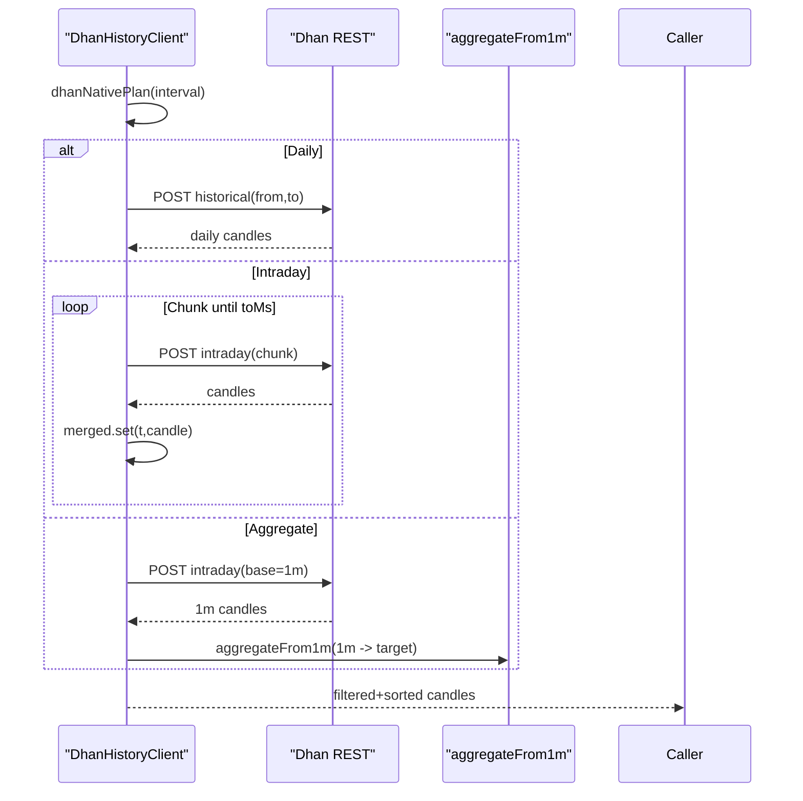
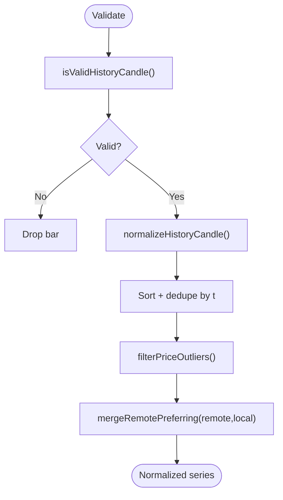
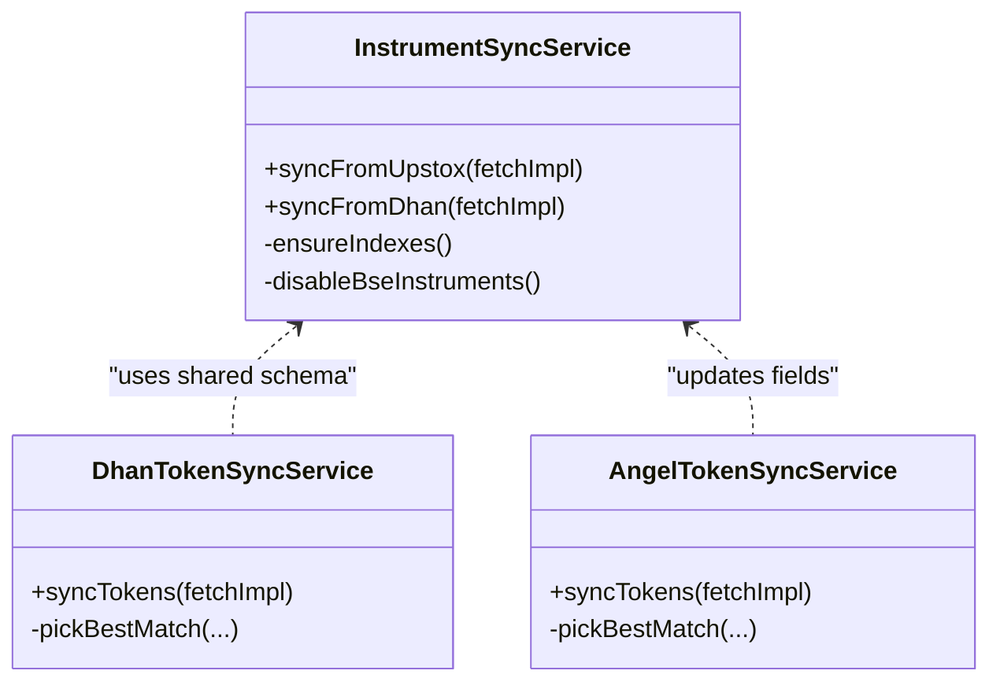
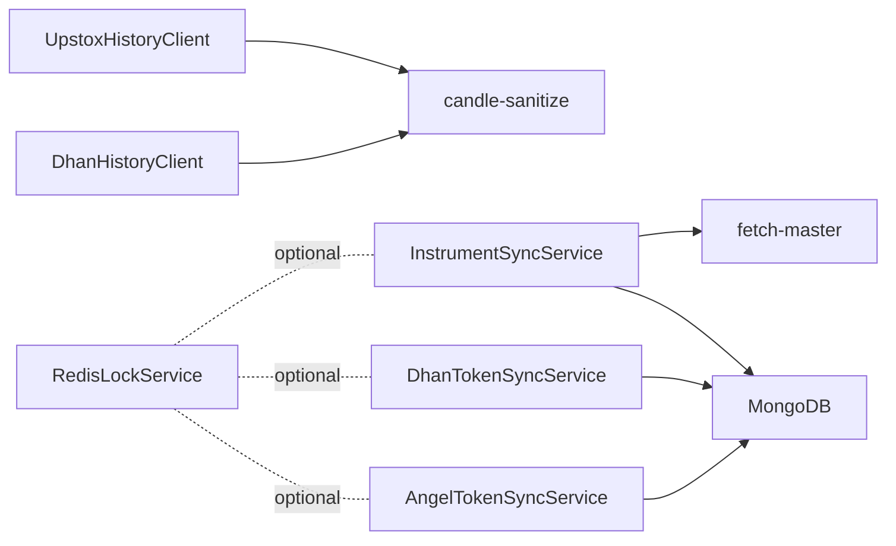

# Historical Data Synchronization

<cite>
**Referenced Files in This Document**
- [instrument-sync.service.ts](file://backend/apps/api/src/modules/market/application/instrument-sync.service.ts)
- [dhan-token-sync.service.ts](file://backend/apps/api/src/modules/market/application/dhan-token-sync.service.ts)
- [angel-token-sync.service.ts](file://backend/apps/api/src/modules/market/application/angel-token-sync.service.ts)
- [upstox-history.client.ts](file://backend/apps/api/src/modules/market/infrastructure/upstox-history.client.ts)
- [dhan-history.client.ts](file://backend/apps/api/src/modules/market/infrastructure/dhan-history.client.ts)
- [candle-sanitize.ts](file://backend/apps/api/src/modules/market/domain/candle-sanitize.ts)
- [fetch-master.ts](file://backend/apps/api/src/modules/market/infrastructure/fetch-master.ts)
- [instrument-admin.controller.ts](file://backend/apps/api/src/modules/market/presentation/instrument-admin.controller.ts)
- [sync-instruments.ts](file://backend/scripts/sync-instruments.ts)
- [redis-lock.service.ts](file://backend/libs/shared/src/redis/redis-lock.service.ts)
</cite>

## Table of Contents
1. Introduction
2. Project Structure
3. Core Components
4. Architecture Overview
5. Detailed Component Analysis
6. Dependency Analysis
7. Performance Considerations
8. Troubleshooting Guide
9. Conclusion

## Introduction
This document explains how historical market data is synchronized across multiple brokers (Upstox and Dhan), normalized, validated, and stored for downstream use. It covers instrument master synchronization, broker-specific history fetching, normalization and aggregation, merge strategies for local vs remote data, batch processing, incremental updates, conflict resolution, error handling and retries, and monitoring/reporting hooks exposed by the system.

## Project Structure
Historical data synchronization spans several modules:
- Instrument master sync services download and map broker catalogs into a unified schema and persist them to MongoDB.
- History clients fetch candles from Upstox and Dhan APIs, parse and normalize them into a common format.
- Domain utilities sanitize, validate, aggregate, and merge candle series.
- Admin controllers and scripts expose endpoints and CLI tools to trigger syncs.
- Shared distributed locking supports safe concurrent operations.

**Diagram sources**
- [instrument-admin.controller.ts:27-59](file://backend/apps/api/src/modules/market/presentation/instrument-admin.controller.ts#L27-L59)
- [sync-instruments.ts:1-22](file://backend/scripts/sync-instruments.ts#L1-L22)
- [instrument-sync.service.ts:37-97](file://backend/apps/api/src/modules/market/application/instrument-sync.service.ts#L37-L97)
- [dhan-token-sync.service.ts:39-147](file://backend/apps/api/src/modules/market/application/dhan-token-sync.service.ts#L39-L147)
- [angel-token-sync.service.ts:55-140](file://backend/apps/api/src/modules/market/application/angel-token-sync.service.ts#L55-L140)
- [upstox-history.client.ts:57-92](file://backend/apps/api/src/modules/market/infrastructure/upstox-history.client.ts#L57-L92)
- [dhan-history.client.ts:41-66](file://backend/apps/api/src/modules/market/infrastructure/dhan-history.client.ts#L41-L66)
- [candle-sanitize.ts:33-53](file://backend/apps/api/src/modules/market/domain/candle-sanitize.ts#L33-L53)
- [redis-lock.service.ts:28-62](file://backend/libs/shared/src/redis/redis-lock.service.ts#L28-L62)

**Section sources**
- [instrument-admin.controller.ts:27-59](file://backend/apps/api/src/modules/market/presentation/instrument-admin.controller.ts#L27-L59)
- [sync-instruments.ts:1-22](file://backend/scripts/sync-instruments.ts#L1-L22)
- [instrument-sync.service.ts:37-97](file://backend/apps/api/src/modules/market/application/instrument-sync.service.ts#L37-L97)
- [dhan-token-sync.service.ts:39-147](file://backend/apps/api/src/modules/market/application/dhan-token-sync.service.ts#L39-L147)
- [angel-token-sync.service.ts:55-140](file://backend/apps/api/src/modules/market/application/angel-token-sync.service.ts#L55-L140)
- [upstox-history.client.ts:57-92](file://backend/apps/api/src/modules/market/infrastructure/upstox-history.client.ts#L57-L92)
- [dhan-history.client.ts:41-66](file://backend/apps/api/src/modules/market/infrastructure/dhan-history.client.ts#L41-L66)
- [candle-sanitize.ts:33-53](file://backend/apps/api/src/modules/market/domain/candle-sanitize.ts#L33-L53)
- [redis-lock.service.ts:28-62](file://backend/libs/shared/src/redis/redis-lock.service.ts#L28-L62)

## Core Components
- Instrument master synchronization:
  - Upstox master download, mapping, and bulk upsert into MongoDB with index management.
  - Dhan master CSV parsing, mapping, and bulk upsert.
  - Angel token sync that maps broker tokens to existing instruments.
- Historical candle fetching:
  - Upstox client fetching historical and intraday candles, merging by timestamp.
  - Dhan client chunked intraday fetching and daily fetching, with native or aggregated intervals.
- Normalization and validation:
  - Candle validation, sanitization, deduplication, outlier filtering, IST-aware bucketing, and aggregation from 1m to higher timeframes.
  - Merge strategy preferring remote broker data over local when conflicts occur.
- Coordination and safety:
  - Distributed lock utility for serializing critical operations if needed.

**Section sources**
- [instrument-sync.service.ts:37-97](file://backend/apps/api/src/modules/market/application/instrument-sync.service.ts#L37-L97)
- [dhan-token-sync.service.ts:39-147](file://backend/apps/api/src/modules/market/application/dhan-token-sync.service.ts#L39-L147)
- [angel-token-sync.service.ts:55-140](file://backend/apps/api/src/modules/market/application/angel-token-sync.service.ts#L55-L140)
- [upstox-history.client.ts:57-92](file://backend/apps/api/src/modules/market/infrastructure/upstox-history.client.ts#L57-L92)
- [dhan-history.client.ts:41-66](file://backend/apps/api/src/modules/market/infrastructure/dhan-history.client.ts#L41-L66)
- [candle-sanitize.ts:33-53](file://backend/apps/api/src/modules/market/domain/candle-sanitize.ts#L33-L53)
- [candle-sanitize.ts:120-147](file://backend/apps/api/src/modules/market/domain/candle-sanitize.ts#L120-L147)
- [redis-lock.service.ts:28-62](file://backend/libs/shared/src/redis/redis-lock.service.ts#L28-L62)

## Architecture Overview
The synchronization pipeline consists of:
- Admin triggers or scripts initiate instrument master syncs.
- Services download broker catalogs, map fields to a unified schema, and bulk upsert into MongoDB.
- History clients fetch candles per instrument and timeframe, parse and normalize into a common structure.
- Domain utilities validate, clean, aggregate, and merge local and remote candles.
- Optional distributed locks can serialize operations to avoid race conditions.

**Diagram sources**
- [instrument-admin.controller.ts:43-59](file://backend/apps/api/src/modules/market/presentation/instrument-admin.controller.ts#L43-L59)
- [instrument-sync.service.ts:37-97](file://backend/apps/api/src/modules/market/application/instrument-sync.service.ts#L37-L97)
- [instrument-sync.service.ts:198-208](file://backend/apps/api/src/modules/market/application/instrument-sync.service.ts#L198-L208)
- [redis-lock.service.ts:28-62](file://backend/libs/shared/src/redis/redis-lock.service.ts#L28-L62)

## Detailed Component Analysis

### Instrument Master Synchronization (Upstox)
- Downloads gzip-compressed JSON master, decodes it, maps rows to internal schema, and bulk upserts by unique key.
- Ensures indexes for performance and searchability.
- Disables legacy BSE instruments post-sync to keep catalog consistent.

**Diagram sources**
- [instrument-sync.service.ts:37-97](file://backend/apps/api/src/modules/market/application/instrument-sync.service.ts#L37-L97)
- [instrument-sync.service.ts:190-225](file://backend/apps/api/src/modules/market/application/instrument-sync.service.ts#L190-L225)

**Section sources**
- [instrument-sync.service.ts:37-97](file://backend/apps/api/src/modules/market/application/instrument-sync.service.ts#L37-L97)
- [instrument-sync.service.ts:190-225](file://backend/apps/api/src/modules/market/application/instrument-sync.service.ts#L190-L225)

### Instrument Master Synchronization (Dhan)
- Parses CSV header to locate required columns, validates presence, then iterates rows.
- Maps exchange/segment to internal enums, filters out unsupported segments, and bulk upserts.
- Reports matched, updated, unmatched, and skipped counts.

**Diagram sources**
- [dhan-token-sync.service.ts:39-147](file://backend/apps/api/src/modules/market/application/dhan-token-sync.service.ts#L39-L147)

**Section sources**
- [dhan-token-sync.service.ts:39-147](file://backend/apps/api/src/modules/market/application/dhan-token-sync.service.ts#L39-L147)

### Angel Token Mapping
- Downloads Angel scrip master JSON, matches tokens to existing enabled instruments by symbol and segment heuristics, and updates fields in batches.

**Diagram sources**
- [angel-token-sync.service.ts:55-140](file://backend/apps/api/src/modules/market/application/angel-token-sync.service.ts#L55-L140)

**Section sources**
- [angel-token-sync.service.ts:55-140](file://backend/apps/api/src/modules/market/application/angel-token-sync.service.ts#L55-L140)

### Historical Data Fetching (Upstox)
- Fetches historical candles for a date range and merges intraday candles for the current day.
- Parses response arrays into normalized candles, handles timestamp units, and filters to requested window.

**Diagram sources**
- [upstox-history.client.ts:57-92](file://backend/apps/api/src/modules/market/infrastructure/upstox-history.client.ts#L57-L92)
- [upstox-history.client.ts:114-149](file://backend/apps/api/src/modules/market/infrastructure/upstox-history.client.ts#L114-L149)

**Section sources**
- [upstox-history.client.ts:57-92](file://backend/apps/api/src/modules/market/infrastructure/upstox-history.client.ts#L57-L92)
- [upstox-history.client.ts:114-149](file://backend/apps/api/src/modules/market/infrastructure/upstox-history.client.ts#L114-L149)

### Historical Data Fetching (Dhan)
- Chooses native plan based on interval; for non-native intervals aggregates from 1m.
- Chunks intraday requests to respect API limits and merges results by timestamp.

**Diagram sources**
- [dhan-history.client.ts:41-66](file://backend/apps/api/src/modules/market/infrastructure/dhan-history.client.ts#L41-L66)
- [dhan-history.client.ts:87-120](file://backend/apps/api/src/modules/market/infrastructure/dhan-history.client.ts#L87-L120)
- [dhan-history.client.ts:234-254](file://backend/apps/api/src/modules/market/infrastructure/dhan-history.client.ts#L234-L254)
- [candle-sanitize.ts:94-112](file://backend/apps/api/src/modules/market/domain/candle-sanitize.ts#L94-L112)

**Section sources**
- [dhan-history.client.ts:41-66](file://backend/apps/api/src/modules/market/infrastructure/dhan-history.client.ts#L41-L66)
- [dhan-history.client.ts:87-120](file://backend/apps/api/src/modules/market/infrastructure/dhan-history.client.ts#L87-L120)
- [dhan-history.client.ts:234-254](file://backend/apps/api/src/modules/market/infrastructure/dhan-history.client.ts#L234-L254)
- [candle-sanitize.ts:94-112](file://backend/apps/api/src/modules/market/domain/candle-sanitize.ts#L94-L112)

### Data Normalization, Validation, and Merging
- Validates OHLC ranges, ensures positive values, normalizes wicks, coerces volume, sorts ascending, deduplicates by timestamp, and clamps to requested windows.
- Filters price outliers using median-based bands to remove polluted bars.
- Merges local and remote candles with remote priority on collisions and keeps live continuation bars after last remote timestamp.

**Diagram sources**
- [candle-sanitize.ts:6-15](file://backend/apps/api/src/modules/market/domain/candle-sanitize.ts#L6-L15)
- [candle-sanitize.ts:17-27](file://backend/apps/api/src/modules/market/domain/candle-sanitize.ts#L17-L27)
- [candle-sanitize.ts:33-53](file://backend/apps/api/src/modules/market/domain/candle-sanitize.ts#L33-L53)
- [candle-sanitize.ts:60-73](file://backend/apps/api/src/modules/market/domain/candle-sanitize.ts#L60-L73)
- [candle-sanitize.ts:120-147](file://backend/apps/api/src/modules/market/domain/candle-sanitize.ts#L120-L147)

**Section sources**
- [candle-sanitize.ts:6-15](file://backend/apps/api/src/modules/market/domain/candle-sanitize.ts#L6-L15)
- [candle-sanitize.ts:17-27](file://backend/apps/api/src/modules/market/domain/candle-sanitize.ts#L17-L27)
- [candle-sanitize.ts:33-53](file://backend/apps/api/src/modules/market/domain/candle-sanitize.ts#L33-L53)
- [candle-sanitize.ts:60-73](file://backend/apps/api/src/modules/market/domain/candle-sanitize.ts#L60-L73)
- [candle-sanitize.ts:120-147](file://backend/apps/api/src/modules/market/domain/candle-sanitize.ts#L120-L147)

### Multi-Broker Instrument Mapping
- Upstox: direct mapping to internal schema during master sync.
- Dhan: maps securityId and exchangeSegment to internal enums and stores them alongside instrumentKey.
- Angel: maps tokens to existing instruments via symbol and segment heuristics.

**Diagram sources**
- [instrument-sync.service.ts:37-97](file://backend/apps/api/src/modules/market/application/instrument-sync.service.ts#L37-L97)
- [dhan-token-sync.service.ts:39-147](file://backend/apps/api/src/modules/market/application/dhan-token-sync.service.ts#L39-L147)
- [angel-token-sync.service.ts:55-140](file://backend/apps/api/src/modules/market/application/angel-token-sync.service.ts#L55-L140)

**Section sources**
- [instrument-sync.service.ts:37-97](file://backend/apps/api/src/modules/market/application/instrument-sync.service.ts#L37-L97)
- [dhan-token-sync.service.ts:39-147](file://backend/apps/api/src/modules/market/application/dhan-token-sync.service.ts#L39-L147)
- [angel-token-sync.service.ts:55-140](file://backend/apps/api/src/modules/market/application/angel-token-sync.service.ts#L55-L140)

### Batch Processing and Incremental Updates
- All sync services accumulate operations in memory and flush in batches of 1000 using ordered=false writes for resilience.
- Upserts by instrumentKey enable idempotent incremental updates without duplicates.
- Dhan intraday fetching uses chunked windows to handle large ranges efficiently.

**Section sources**
- [instrument-sync.service.ts:81-91](file://backend/apps/api/src/modules/market/application/instrument-sync.service.ts#L81-L91)
- [instrument-sync.service.ts:170-180](file://backend/apps/api/src/modules/market/application/instrument-sync.service.ts#L170-L180)
- [dhan-token-sync.service.ts:131-140](file://backend/apps/api/src/modules/market/application/dhan-token-sync.service.ts#L131-L140)
- [angel-token-sync.service.ts:124-134](file://backend/apps/api/src/modules/market/application/angel-token-sync.service.ts#L124-L134)
- [dhan-history.client.ts:87-120](file://backend/apps/api/src/modules/market/infrastructure/dhan-history.client.ts#L87-L120)

### Conflict Resolution Strategy
- When merging local and remote candles, remote broker data wins on timestamp collisions.
- Local-only bars after the last remote timestamp are retained for live continuation.
- Local-only bars within the remote span are kept only if their mid-price is compatible with the remote series.

**Section sources**
- [candle-sanitize.ts:120-147](file://backend/apps/api/src/modules/market/domain/candle-sanitize.ts#L120-L147)

### Error Handling and Retry Mechanisms
- Network errors during master downloads raise explicit errors with status context.
- Dhan intraday chunk failures are logged and skipped to continue partial retrieval.
- Upstox intraday unavailability is warned but does not abort historical retrieval.
- Distributed lock utility provides acquire/retry semantics for serializing critical sections if used around sync operations.

**Section sources**
- [instrument-sync.service.ts:37-45](file://backend/apps/api/src/modules/market/application/instrument-sync.service.ts#L37-L45)
- [dhan-token-sync.service.ts:41-49](file://backend/apps/api/src/modules/market/application/dhan-token-sync.service.ts#L41-L49)
- [angel-token-sync.service.ts:57-65](file://backend/apps/api/src/modules/market/application/angel-token-sync.service.ts#L57-L65)
- [dhan-history.client.ts:107-119](file://backend/apps/api/src/modules/market/infrastructure/dhan-history.client.ts#L107-L119)
- [upstox-history.client.ts:77-87](file://backend/apps/api/src/modules/market/infrastructure/upstox-history.client.ts#L77-L87)
- [redis-lock.service.ts:40-51](file://backend/libs/shared/src/redis/redis-lock.service.ts#L40-L51)

### Monitoring and Reporting
- Sync services log summaries including downloaded, mapped, updated, and skipped counts.
- Admin controller records audit events for instrument sync actions.
- Scripts provide CLI entry points to run syncs and print results.

**Section sources**
- [instrument-sync.service.ts:93-96](file://backend/apps/api/src/modules/market/application/instrument-sync.service.ts#L93-L96)
- [dhan-token-sync.service.ts:143-146](file://backend/apps/api/src/modules/market/application/dhan-token-sync.service.ts#L143-L146)
- [angel-token-sync.service.ts:136-139](file://backend/apps/api/src/modules/market/application/angel-token-sync.service.ts#L136-L139)
- [instrument-admin.controller.ts:43-59](file://backend/apps/api/src/modules/market/presentation/instrument-admin.controller.ts#L43-L59)
- [sync-instruments.ts:11-20](file://backend/scripts/sync-instruments.ts#L11-L20)

## Dependency Analysis
- InstrumentSyncService depends on:
  - fetch-master utility for robust HTTP fetching.
  - mappers for Upstox and Dhan instruments.
  - MongoDB model for bulk writes and index creation.
- DAngelTokenSyncService and DhanTokenSyncService depend on:
  - fetch-master and CSV parsing utilities.
  - Instrument model for matching and updating.
- History clients depend on:
  - Credentials services for authentication.
  - candle-sanitize for normalization and aggregation.
- RedisLockService is available for coordination if wrapped around sync calls.

**Diagram sources**
- [upstox-history.client.ts:57-92](file://backend/apps/api/src/modules/market/infrastructure/upstox-history.client.ts#L57-L92)
- [dhan-history.client.ts:41-66](file://backend/apps/api/src/modules/market/infrastructure/dhan-history.client.ts#L41-L66)
- [instrument-sync.service.ts:37-97](file://backend/apps/api/src/modules/market/application/instrument-sync.service.ts#L37-L97)
- [dhan-token-sync.service.ts:39-147](file://backend/apps/api/src/modules/market/application/dhan-token-sync.service.ts#L39-L147)
- [angel-token-sync.service.ts:55-140](file://backend/apps/api/src/modules/market/application/angel-token-sync.service.ts#L55-L140)
- [redis-lock.service.ts:28-62](file://backend/libs/shared/src/redis/redis-lock.service.ts#L28-L62)

**Section sources**
- [upstox-history.client.ts:57-92](file://backend/apps/api/src/modules/market/infrastructure/upstox-history.client.ts#L57-L92)
- [dhan-history.client.ts:41-66](file://backend/apps/api/src/modules/market/infrastructure/dhan-history.client.ts#L41-L66)
- [instrument-sync.service.ts:37-97](file://backend/apps/api/src/modules/market/application/instrument-sync.service.ts#L37-L97)
- [dhan-token-sync.service.ts:39-147](file://backend/apps/api/src/modules/market/application/dhan-token-sync.service.ts#L39-L147)
- [angel-token-sync.service.ts:55-140](file://backend/apps/api/src/modules/market/application/angel-token-sync.service.ts#L55-L140)
- [redis-lock.service.ts:28-62](file://backend/libs/shared/src/redis/redis-lock.service.ts#L28-L62)

## Performance Considerations
- Use bulkWrite with ordered=false to tolerate partial failures and improve throughput.
- Ensure indexes before bulk operations to speed up upserts and queries.
- Chunk Dhan intraday requests to stay within API limits and reduce memory pressure.
- Prefer aggregating from 1m where native intervals are unavailable to minimize network calls.
- Apply price outlier filtering to reduce noise and improve chart rendering performance.

[No sources needed since this section provides general guidance]

## Troubleshooting Guide
- Instrument master download failures: check network access and status codes returned by broker endpoints.
- Missing CSV columns: verify Dhan master schema changes and adjust column indices accordingly.
- Partial history due to chunk failures: review logs for specific chunks and re-run if necessary.
- Unmapped instruments: confirm symbols and segments match expected values; refine heuristics in pickBestMatch methods.
- Concurrent sync conflicts: consider wrapping sync operations with distributed locks to serialize execution.

**Section sources**
- [instrument-sync.service.ts:37-45](file://backend/apps/api/src/modules/market/application/instrument-sync.service.ts#L37-L45)
- [dhan-token-sync.service.ts:41-49](file://backend/apps/api/src/modules/market/application/dhan-token-sync.service.ts#L41-L49)
- [angel-token-sync.service.ts:57-65](file://backend/apps/api/src/modules/market/application/angel-token-sync.service.ts#L57-L65)
- [dhan-history.client.ts:107-119](file://backend/apps/api/src/modules/market/infrastructure/dhan-history.client.ts#L107-L119)
- [redis-lock.service.ts:40-51](file://backend/libs/shared/src/redis/redis-lock.service.ts#L40-L51)

## Conclusion
The system implements robust multi-broker historical data synchronization through dedicated services and clients for Upstox and Dhan. It normalizes and validates candle data, aggregates timeframes, and merges local and remote series with clear conflict resolution rules. Batched upserts and chunked fetching support efficient processing of large datasets. Error handling is explicit and resilient, while logging and audit hooks provide visibility into sync status and outcomes. Distributed locking is available to coordinate concurrent operations when needed.