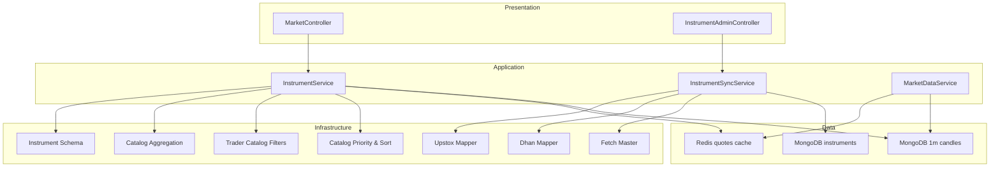
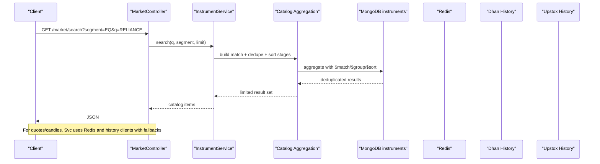
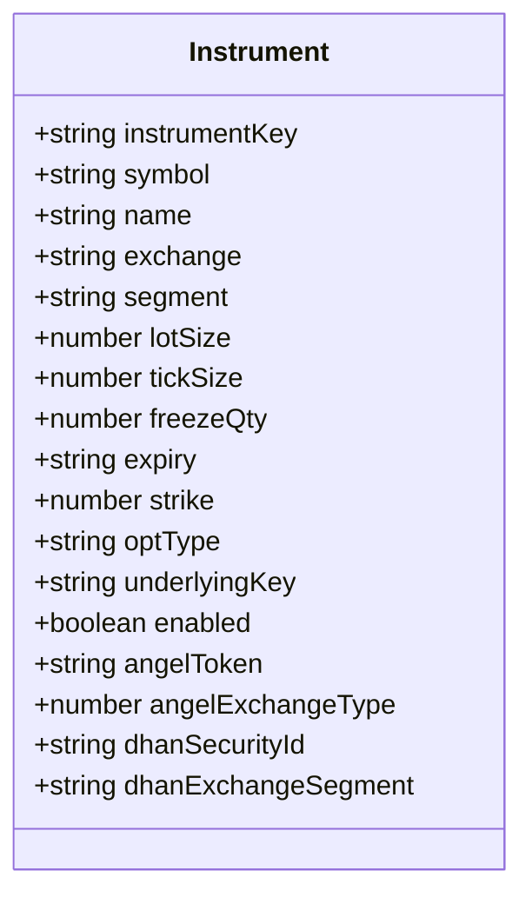
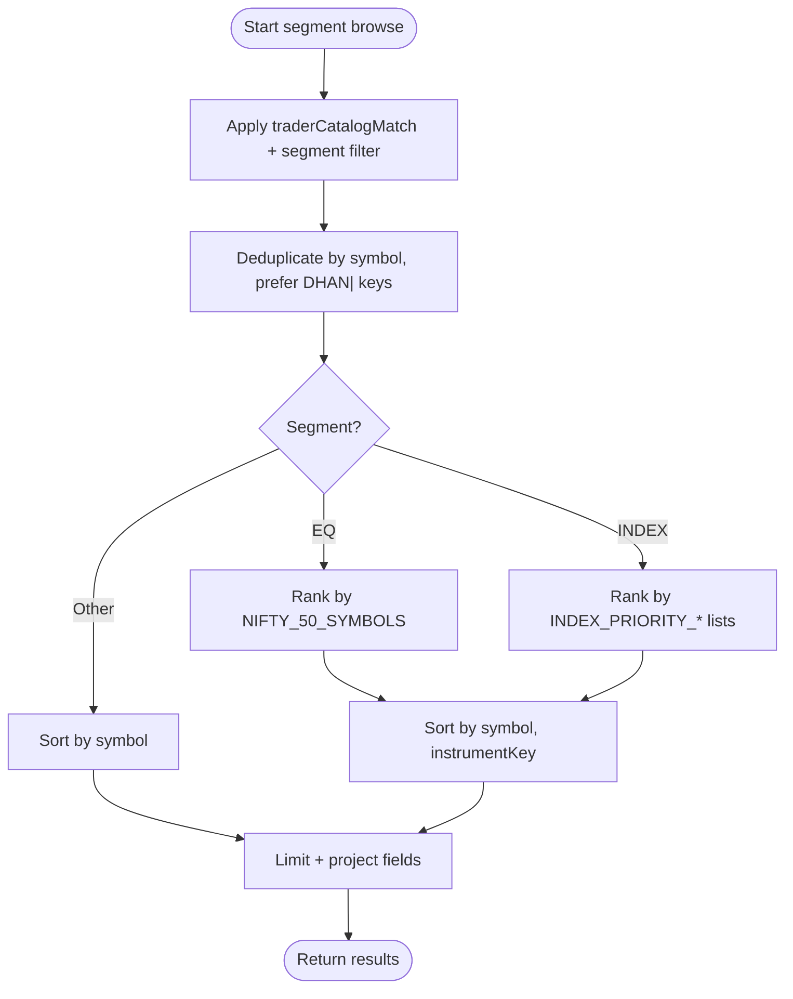
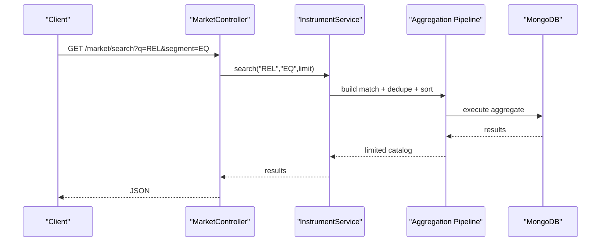
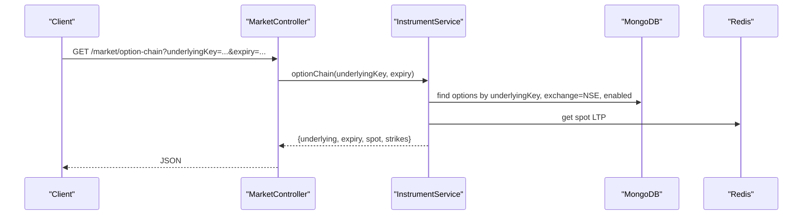
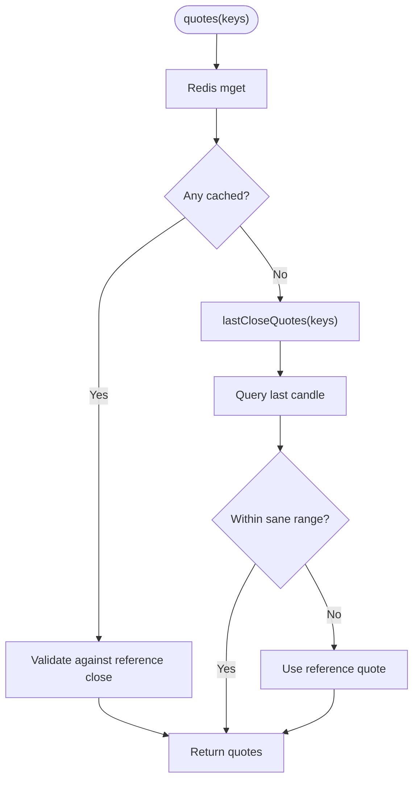
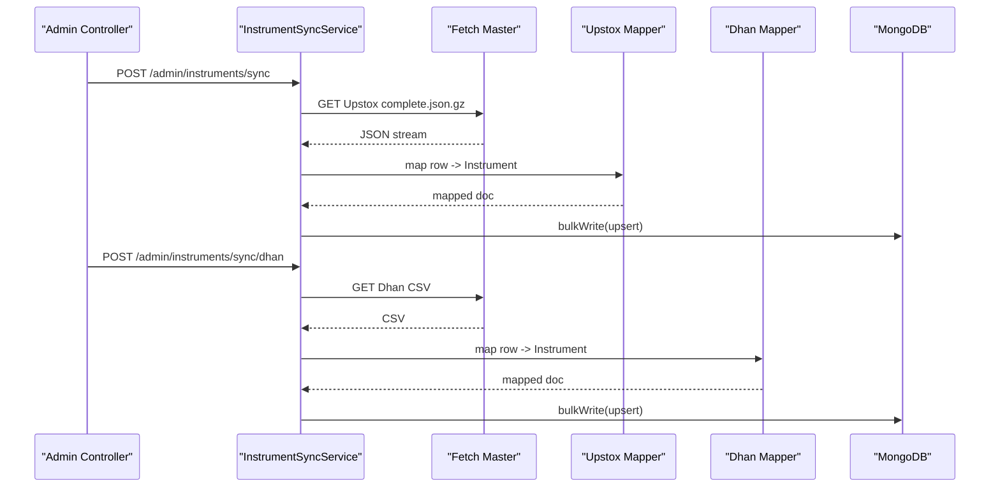
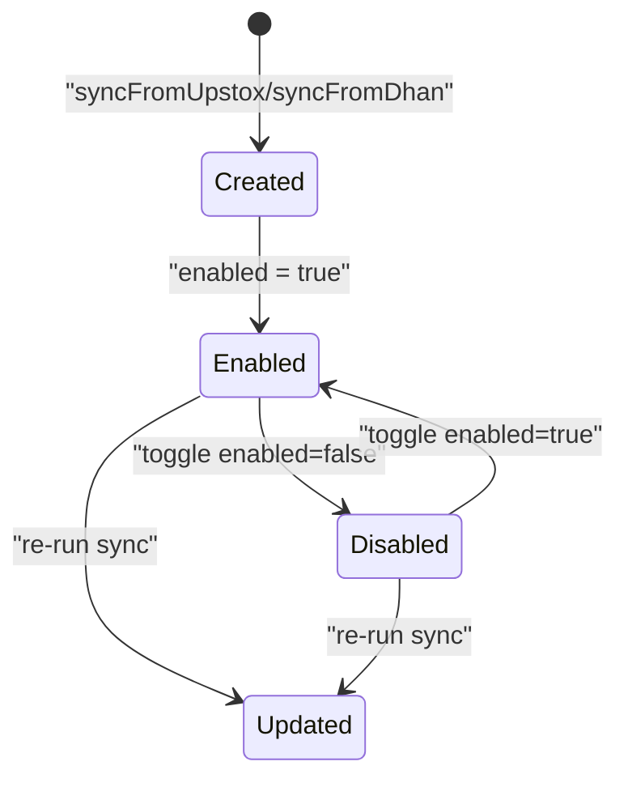
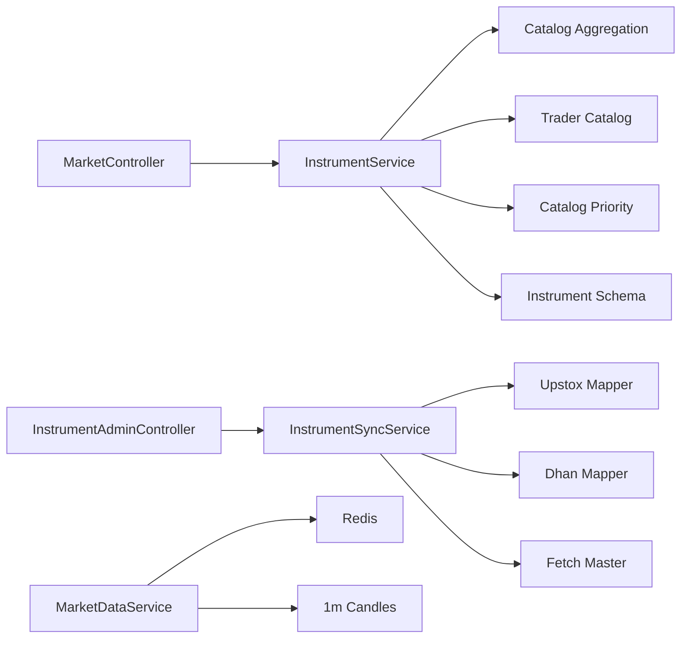

# Instrument Catalog Management

<cite>
**Referenced Files in This Document**
- [instrument.schema.ts](file://backend/apps/api/src/modules/market/infrastructure/schemas/instrument.schema.ts)
- [instrument.service.ts](file://backend/apps/api/src/modules/market/application/instrument.service.ts)
- [trader-catalog.ts](file://backend/apps/api/src/modules/market/infrastructure/trader-catalog.ts)
- [catalog-priority.ts](file://backend/apps/api/src/modules/market/infrastructure/catalog-priority.ts)
- [catalog-aggregation.ts](file://backend/apps/api/src/modules/market/infrastructure/catalog-aggregation.ts)
- [instrument-admin.controller.ts](file://backend/apps/api/src/modules/market/presentation/instrument-admin.controller.ts)
- [market.controller.ts](file://backend/apps/api/src/modules/market/presentation/market.controller.ts)
- [instrument-sync.service.ts](file://backend/apps/api/src/modules/market/application/instrument-sync.service.ts)
- [instrument-mapper.ts](file://backend/apps/api/src/modules/market/infrastructure/instrument-mapper.ts)
- [dhan-instrument-mapper.ts](file://backend/apps/api/src/modules/market/infrastructure/dhan-instrument-mapper.ts)
- [fetch-master.ts](file://backend/apps/api/src/modules/market/infrastructure/fetch-master.ts)
- [sync-instruments.ts](file://backend/apps/api/src/scripts/sync-instruments.ts)
- [seed-instruments.ts](file://backend/apps/api/src/scripts/seed-instruments.ts)
- [market-data.service.ts](file://backend/apps/api/src/modules/market/application/market-data.service.ts)
</cite>

## Table of Contents
1. [Introduction](#introduction)
2. [Project Structure](#project-structure)
3. [Core Components](#core-components)
4. [Architecture Overview](#architecture-overview)
5. [Detailed Component Analysis](#detailed-component-analysis)
6. [Dependency Analysis](#dependency-analysis)
7. [Performance Considerations](#performance-considerations)
8. [Troubleshooting Guide](#troubleshooting-guide)
9. [Conclusion](#conclusion)
10. [Appendices](#appendices)

## Introduction
This document explains the instrument catalog management system used to store, categorize, search, and serve instruments for trading features. It covers:
- Instrument metadata model and validation rules
- Trader-facing catalog filtering and priority-based sorting
- Search and segment browsing with deduplication
- Database schema, indexing strategy, and query optimization
- Lifecycle management (creation via sync, updates, enable/disable)
- Bulk operations and external data source integration (Upstox and Dhan)
- Integration points with market data services for quotes and candles

## Project Structure
The instrument catalog spans infrastructure (schema), application (services), presentation (controllers), and scripts:
- Schema defines the instrument master and indexes
- Services implement sync from external sources, search/browse, option chain, quotes/candles
- Controllers expose admin and trader APIs
- Scripts bootstrap or refresh the instrument master

**Diagram sources**
- [market.controller.ts:21-75](file://backend/apps/api/src/modules/market/presentation/market.controller.ts#L21-L75)
- [instrument-admin.controller.ts:18-96](file://backend/apps/api/src/modules/market/presentation/instrument-admin.controller.ts#L18-L96)
- [instrument.service.ts:40-149](file://backend/apps/api/src/modules/market/application/instrument.service.ts#L40-L149)
- [instrument-sync.service.ts:29-97](file://backend/apps/api/src/modules/market/application/instrument-sync.service.ts#L29-L97)
- [market-data.service.ts:24-52](file://backend/apps/api/src/modules/market/application/market-data.service.ts#L24-L52)
- [instrument.schema.ts:9-75](file://backend/apps/api/src/modules/market/infrastructure/schemas/instrument.schema.ts#L9-L75)
- [trader-catalog.ts:19-29](file://backend/apps/api/src/modules/market/infrastructure/trader-catalog.ts#L19-L29)
- [catalog-priority.ts:106-146](file://backend/apps/api/src/modules/market/infrastructure/catalog-priority.ts#L106-L146)
- [catalog-aggregation.ts:16-78](file://backend/apps/api/src/modules/market/infrastructure/catalog-aggregation.ts#L16-L78)
- [instrument-mapper.ts:93-134](file://backend/apps/api/src/modules/market/infrastructure/instrument-mapper.ts#L93-L134)
- [dhan-instrument-mapper.ts:56-115](file://backend/apps/api/src/modules/market/infrastructure/dhan-instrument-mapper.ts#L56-L115)
- [fetch-master.ts:4-24](file://backend/apps/api/src/modules/market/infrastructure/fetch-master.ts#L4-L24)

**Section sources**
- [market.controller.ts:21-75](file://backend/apps/api/src/modules/market/presentation/market.controller.ts#L21-L75)
- [instrument-admin.controller.ts:18-96](file://backend/apps/api/src/modules/market/presentation/instrument-admin.controller.ts#L18-L96)
- [instrument.service.ts:40-149](file://backend/apps/api/src/modules/market/application/instrument.service.ts#L40-L149)
- [instrument-sync.service.ts:29-97](file://backend/apps/api/src/modules/market/application/instrument-sync.service.ts#L29-L97)
- [market-data.service.ts:24-52](file://backend/apps/api/src/modules/market/application/market-data.service.ts#L24-L52)
- [instrument.schema.ts:9-75](file://backend/apps/api/src/modules/market/infrastructure/schemas/instrument.schema.ts#L9-L75)
- [trader-catalog.ts:19-29](file://backend/apps/api/src/modules/market/infrastructure/trader-catalog.ts#L19-L29)
- [catalog-priority.ts:106-146](file://backend/apps/api/src/modules/market/infrastructure/catalog-priority.ts#L106-L146)
- [catalog-aggregation.ts:16-78](file://backend/apps/api/src/modules/market/infrastructure/catalog-aggregation.ts#L16-L78)
- [instrument-mapper.ts:93-134](file://backend/apps/api/src/modules/market/infrastructure/instrument-mapper.ts#L93-L134)
- [dhan-instrument-mapper.ts:56-115](file://backend/apps/api/src/modules/market/infrastructure/dhan-instrument-mapper.ts#L56-L115)
- [fetch-master.ts:4-24](file://backend/apps/api/src/modules/market/infrastructure/fetch-master.ts#L4-L24)

## Core Components
- Instrument schema: Defines fields, enums, defaults, and MongoDB indexes for efficient queries and text search.
- Instrument service: Implements search, segment listing, counts, quotes, candles, option chain, and expiries using aggregation pipelines and caches.
- Trader catalog filters: Enforce NSE-only visibility and hide BSE rows for traders.
- Catalog priority and sort: Prioritize key indices and large-cap equities; sort consistently server-side and client-side.
- Catalog aggregation: Deduplicate Upstox vs Dhan rows per symbol, preferring Dhan keys where applicable.
- Sync service: Downloads and maps masters from Upstox and Dhan, bulk upserts into MongoDB, ensures indexes, and disables BSE entries.
- Admin controller: Provides endpoints to list, toggle enabled status, and trigger syncs.
- Market controller: Exposes search, resolve by key, segment browse, quotes, candles, option chain, and expiries.
- Market data service: Ingests ticks, writes quotes to Redis, aggregates 1m candles, and persists them.

**Section sources**
- [instrument.schema.ts:9-75](file://backend/apps/api/src/modules/market/infrastructure/schemas/instrument.schema.ts#L9-L75)
- [instrument.service.ts:40-149](file://backend/apps/api/src/modules/market/application/instrument.service.ts#L40-L149)
- [trader-catalog.ts:19-29](file://backend/apps/api/src/modules/market/infrastructure/trader-catalog.ts#L19-L29)
- [catalog-priority.ts:106-146](file://backend/apps/api/src/modules/market/infrastructure/catalog-priority.ts#L106-L146)
- [catalog-aggregation.ts:16-78](file://backend/apps/api/src/modules/market/infrastructure/catalog-aggregation.ts#L16-L78)
- [instrument-sync.service.ts:29-97](file://backend/apps/api/src/modules/market/application/instrument-sync.service.ts#L29-L97)
- [instrument-admin.controller.ts:18-96](file://backend/apps/api/src/modules/market/presentation/instrument-admin.controller.ts#L18-L96)
- [market.controller.ts:21-75](file://backend/apps/api/src/modules/market/presentation/market.controller.ts#L21-L75)
- [market-data.service.ts:24-52](file://backend/apps/api/src/modules/market/application/market-data.service.ts#L24-L52)

## Architecture Overview
The catalog is populated by syncing external masters, filtered for trader visibility, and served through REST APIs. Search and browse use aggregation pipelines with deduplication and priority sorting. Quotes and candles leverage Redis and MongoDB with fallbacks to historical providers.

**Diagram sources**
- [market.controller.ts:29-32](file://backend/apps/api/src/modules/market/presentation/market.controller.ts#L29-L32)
- [instrument.service.ts:57-122](file://backend/apps/api/src/modules/market/application/instrument.service.ts#L57-L122)
- [catalog-aggregation.ts:16-78](file://backend/apps/api/src/modules/market/infrastructure/catalog-aggregation.ts#L16-L78)
- [instrument.schema.ts:71-75](file://backend/apps/api/src/modules/market/infrastructure/schemas/instrument.schema.ts#L71-L75)

## Detailed Component Analysis

### Instrument Data Model and Validation
- Fields include instrumentKey (unique), symbol, name, exchange (NSE/BSE), segment (EQ/FO/CUR/INDEX), lotSize, tickSize, freezeQty, expiry, strike, optType (CE/PE), underlyingKey, enabled, plus provider-specific identifiers (Angel token, Dhan security ID and segment).
- Defaults: enabled=true, lotSize=1, tickSize=0.05.
- Validation: Enum constraints on exchange/segment/optType; required fields enforced by schema.
- Indexes: Unique on instrumentKey; indexes on segment+enabled, underlyingKey+expiry+strike, text index on symbol+name, symbol, and composite exchange+segment+symbol.

**Diagram sources**
- [instrument.schema.ts:9-67](file://backend/apps/api/src/modules/market/infrastructure/schemas/instrument.schema.ts#L9-L67)

**Section sources**
- [instrument.schema.ts:9-75](file://backend/apps/api/src/modules/market/infrastructure/schemas/instrument.schema.ts#L9-L75)

### Trader Catalog Filtering and Priority Sorting
- Trader catalog restricts to NSE and hides BSE-related instrument keys.
- Segment matching applies EQ-only filters to exclude derivatives markers from stocks.
- Priority ranking:
  - Equities: NIFTY 50 constituents ranked first, then alphabetical by symbol.
  - Indices: Key index suffixes and symbols prioritized, then alphabetical.
- Client-side comparator mirrors server-side logic for consistent UI ordering.

**Diagram sources**
- [trader-catalog.ts:19-29](file://backend/apps/api/src/modules/market/infrastructure/trader-catalog.ts#L19-L29)
- [catalog-aggregation.ts:16-78](file://backend/apps/api/src/modules/market/infrastructure/catalog-aggregation.ts#L16-L78)
- [catalog-priority.ts:106-146](file://backend/apps/api/src/modules/market/infrastructure/catalog-priority.ts#L106-L146)

**Section sources**
- [trader-catalog.ts:19-29](file://backend/apps/api/src/modules/market/infrastructure/trader-catalog.ts#L19-L29)
- [catalog-aggregation.ts:16-78](file://backend/apps/api/src/modules/market/infrastructure/catalog-aggregation.ts#L16-L78)
- [catalog-priority.ts:106-146](file://backend/apps/api/src/modules/market/infrastructure/catalog-priority.ts#L106-L146)

### Search Functionality
- Supports prefix matching on symbol/name when query resembles a ticker, falling back to full-text search if available.
- Uses aggregated pipeline with deduplication and capped limits.
- Gracefully handles missing text indexes by reverting to regex fallback.

**Diagram sources**
- [market.controller.ts:29-32](file://backend/apps/api/src/modules/market/presentation/market.controller.ts#L29-L32)
- [instrument.service.ts:57-122](file://backend/apps/api/src/modules/market/application/instrument.service.ts#L57-L122)
- [catalog-aggregation.ts:16-78](file://backend/apps/api/src/modules/market/infrastructure/catalog-aggregation.ts#L16-L78)

**Section sources**
- [instrument.service.ts:57-122](file://backend/apps/api/src/modules/market/application/instrument.service.ts#L57-L122)

### Option Chain and Expiries
- Builds an option chain around ATM for a given underlying and optional expiry.
- Resolves FO underlying key across different key formats (including DHAN|).
- Retrieves spot LTP from Redis for ATM band selection.
- Returns strikes with CE/PE legs and their last traded prices.

**Diagram sources**
- [market.controller.ts:66-69](file://backend/apps/api/src/modules/market/presentation/market.controller.ts#L66-L69)
- [instrument.service.ts:332-388](file://backend/apps/api/src/modules/market/application/instrument.service.ts#L332-L388)

**Section sources**
- [instrument.service.ts:332-388](file://backend/apps/api/src/modules/market/application/instrument.service.ts#L332-L388)

### Quotes and Candles
- Quotes: Batch lookup via Redis with stale simulator quote detection; fallback to last known close from candles or reference prices.
- Candles: Prefer Dhan chart target; fall back to Upstox history; persist 1m bars; merge local and remote; aggregate to requested interval; synthetic flat candles if no data; sanitize outputs.

**Diagram sources**
- [instrument.service.ts:151-183](file://backend/apps/api/src/modules/market/application/instrument.service.ts#L151-L183)
- [instrument.service.ts:496-584](file://backend/apps/api/src/modules/market/application/instrument.service.ts#L496-L584)

**Section sources**
- [instrument.service.ts:151-183](file://backend/apps/api/src/modules/market/application/instrument.service.ts#L151-L183)
- [instrument.service.ts:185-288](file://backend/apps/api/src/modules/market/application/instrument.service.ts#L185-L288)
- [instrument.service.ts:496-584](file://backend/apps/api/src/modules/market/application/instrument.service.ts#L496-L584)

### External Data Integration and Sync
- Upstox master: Download gzip JSON, map allowed segments, normalize tick sizes, infer underlying keys, bulk upsert by instrumentKey, ensure indexes, disable BSE entries.
- Dhan master: Download CSV, parse columns, map segments/exchanges, skip BSE, generate DHAN| keys, bulk upsert, ensure indexes, disable BSE entries.
- Fetch helper enforces timeouts and readable errors.

**Diagram sources**
- [instrument-admin.controller.ts:43-77](file://backend/apps/api/src/modules/market/presentation/instrument-admin.controller.ts#L43-L77)
- [instrument-sync.service.ts:37-97](file://backend/apps/api/src/modules/market/application/instrument-sync.service.ts#L37-L97)
- [instrument-sync.service.ts:99-188](file://backend/apps/api/src/modules/market/application/instrument-sync.service.ts#L99-L188)
- [instrument-mapper.ts:93-134](file://backend/apps/api/src/modules/market/infrastructure/instrument-mapper.ts#L93-L134)
- [dhan-instrument-mapper.ts:56-115](file://backend/apps/api/src/modules/market/infrastructure/dhan-instrument-mapper.ts#L56-L115)
- [fetch-master.ts:4-24](file://backend/apps/api/src/modules/market/infrastructure/fetch-master.ts#L4-L24)

**Section sources**
- [instrument-sync.service.ts:37-97](file://backend/apps/api/src/modules/market/application/instrument-sync.service.ts#L37-L97)
- [instrument-sync.service.ts:99-188](file://backend/apps/api/src/modules/market/application/instrument-sync.service.ts#L99-L188)
- [instrument-mapper.ts:93-134](file://backend/apps/api/src/modules/market/infrastructure/instrument-mapper.ts#L93-L134)
- [dhan-instrument-mapper.ts:56-115](file://backend/apps/api/src/modules/market/infrastructure/dhan-instrument-mapper.ts#L56-L115)
- [fetch-master.ts:4-24](file://backend/apps/api/src/modules/market/infrastructure/fetch-master.ts#L4-L24)

### Lifecycle Management
- Creation: Via sync jobs that download and map masters; seed script provides minimal dataset for local/dev.
- Updates: Re-running sync refreshes fields and adds new instruments; bulk upserts preserve existing records.
- Deactivation: Toggle enabled flag per instrument via admin endpoint; sync also disables BSE entries post-import.

**Diagram sources**
- [instrument-sync.service.ts:37-97](file://backend/apps/api/src/modules/market/application/instrument-sync.service.ts#L37-L97)
- [instrument-sync.service.ts:99-188](file://backend/apps/api/src/modules/market/application/instrument-sync.service.ts#L99-L188)
- [instrument-admin.controller.ts:79-95](file://backend/apps/api/src/modules/market/presentation/instrument-admin.controller.ts#L79-L95)
- [seed-instruments.ts:11-64](file://backend/apps/api/src/scripts/seed-instruments.ts#L11-L64)

**Section sources**
- [instrument-admin.controller.ts:79-95](file://backend/apps/api/src/modules/market/presentation/instrument-admin.controller.ts#L79-L95)
- [instrument-sync.service.ts:37-97](file://backend/apps/api/src/modules/market/application/instrument-sync.service.ts#L37-L97)
- [instrument-sync.service.ts:99-188](file://backend/apps/api/src/modules/market/application/instrument-sync.service.ts#L99-L188)
- [seed-instruments.ts:11-64](file://backend/apps/api/src/scripts/seed-instruments.ts#L11-L64)

### Bulk Operations
- Bulk upserts during sync in batches of 1000 to efficiently update the instrument master.
- Bulk write for 1m candles ingestion from live feed with ordered=false for throughput.

**Section sources**
- [instrument-sync.service.ts:52-91](file://backend/apps/api/src/modules/market/application/instrument-sync.service.ts#L52-L91)
- [instrument-sync.service.ts:140-180](file://backend/apps/api/src/modules/market/application/instrument-sync.service.ts#L140-L180)
- [market-data.service.ts:110-126](file://backend/apps/api/src/modules/market/application/market-data.service.ts#L110-L126)

## Dependency Analysis
- Presentation depends on Application services for business logic.
- Application services depend on Infrastructure for schema, mappers, filters, and aggregation utilities.
- Sync service depends on fetch helper and mappers to transform external data into canonical schema.
- Market data service depends on feed abstraction, Redis, and MongoDB for real-time processing.

**Diagram sources**
- [market.controller.ts:21-75](file://backend/apps/api/src/modules/market/presentation/market.controller.ts#L21-L75)
- [instrument-admin.controller.ts:18-96](file://backend/apps/api/src/modules/market/presentation/instrument-admin.controller.ts#L18-L96)
- [instrument.service.ts:40-149](file://backend/apps/api/src/modules/market/application/instrument.service.ts#L40-L149)
- [instrument-sync.service.ts:29-97](file://backend/apps/api/src/modules/market/application/instrument-sync.service.ts#L29-L97)
- [market-data.service.ts:24-52](file://backend/apps/api/src/modules/market/application/market-data.service.ts#L24-L52)

**Section sources**
- [market.controller.ts:21-75](file://backend/apps/api/src/modules/market/presentation/market.controller.ts#L21-L75)
- [instrument-admin.controller.ts:18-96](file://backend/apps/api/src/modules/market/presentation/instrument-admin.controller.ts#L18-L96)
- [instrument.service.ts:40-149](file://backend/apps/api/src/modules/market/application/instrument.service.ts#L40-L149)
- [instrument-sync.service.ts:29-97](file://backend/apps/api/src/modules/market/application/instrument-sync.service.ts#L29-L97)
- [market-data.service.ts:24-52](file://backend/apps/api/src/modules/market/application/market-data.service.ts#L24-L52)

## Performance Considerations
- Aggregation pipelines:
  - Use allowDiskUse for large segment browses to avoid memory pressure.
  - Deduplication via $top avoids full-segment sorting.
  - Count stage avoids global sort for compatibility with constrained environments.
- Indexing:
  - Text index on symbol+name accelerates search.
  - Composite indexes support common filters and option chain queries.
- Caching:
  - Redis stores quotes with TTL; batch lookups reduce DB load.
  - Stale simulator quotes are detected and discarded using reference prices.
- History retrieval:
  - Prefer native intervals from Dhan to minimize re-aggregation.
  - Merge remote and local 1m bars ensuring broker history wins to prevent pollution.

[No sources needed since this section provides general guidance]

## Troubleshooting Guide
- Missing text index: Search falls back to regex; ensure indexes are created during sync.
- Timeout on master downloads: Fetch helper throws descriptive errors; retry with stable connection.
- No quotes or candles: Check Redis availability, feed health, and history tokens; synthetic candles may be returned.
- Wrong prices: Reference close checks discard outliers; verify upstream feeds and reference data.

**Section sources**
- [instrument.service.ts:94-110](file://backend/apps/api/src/modules/market/application/instrument.service.ts#L94-L110)
- [instrument-sync.service.ts:198-208](file://backend/apps/api/src/modules/market/application/instrument-sync.service.ts#L198-L208)
- [fetch-master.ts:4-24](file://backend/apps/api/src/modules/market/infrastructure/fetch-master.ts#L4-L24)
- [instrument.service.ts:591-601](file://backend/apps/api/src/modules/market/application/instrument.service.ts#L591-L601)

## Conclusion
The instrument catalog system provides a robust foundation for managing tradable instruments across multiple brokers. It combines strict schema validation, flexible filtering, priority-aware sorting, and efficient search/browsing pipelines. External integrations keep the catalog current, while caching and aggregation deliver responsive APIs for quotes and charts.

[No sources needed since this section summarizes without analyzing specific files]

## Appendices

### API Endpoints Summary
- Search instruments: GET /market/search
- Resolve instrument: GET /market/instruments/:instrumentKey
- List by segment: GET /market/segment/:segment
- Get quotes: GET /market/quotes
- Get candles: GET /market/candles
- Option chain: GET /market/option-chain
- Expiries: GET /market/expiries/:underlyingKey
- Admin list instruments: GET /admin/instruments
- Trigger Upstox sync: POST /admin/instruments/sync
- Trigger Dhan sync: POST /admin/instruments/sync/dhan
- Toggle enabled: PUT /admin/instruments/:instrumentKey/enabled

**Section sources**
- [market.controller.ts:29-74](file://backend/apps/api/src/modules/market/presentation/market.controller.ts#L29-L74)
- [instrument-admin.controller.ts:27-95](file://backend/apps/api/src/modules/market/presentation/instrument-admin.controller.ts#L27-L95)

### Scripts
- Seed starter instruments: npm run seed:instruments
- Sync full Upstox master: npm run sync:instruments

**Section sources**
- [seed-instruments.ts:11-64](file://backend/apps/api/src/scripts/seed-instruments.ts#L11-L64)
- [sync-instruments.ts:11-20](file://backend/apps/api/src/scripts/sync-instruments.ts#L11-L20)