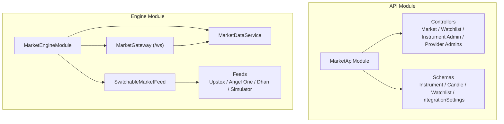
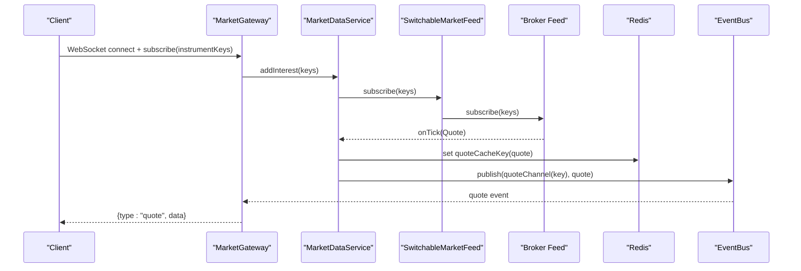
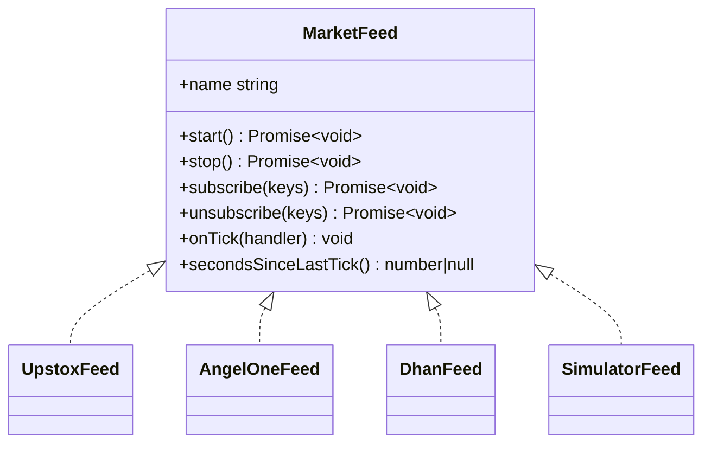
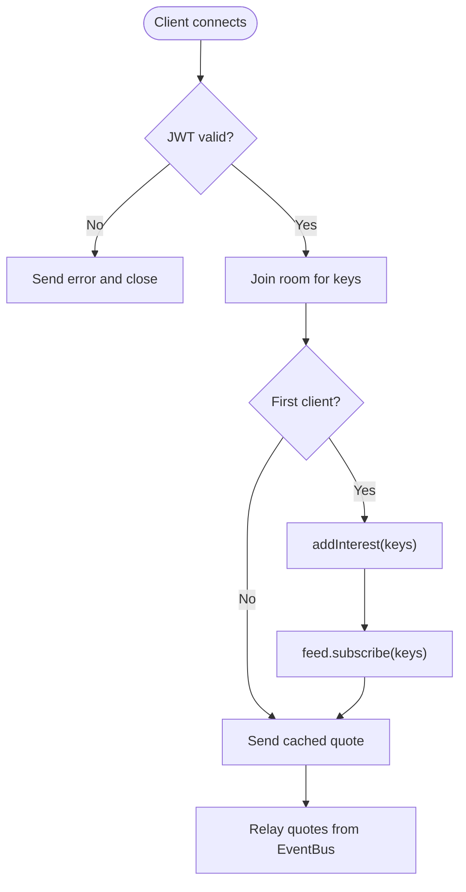
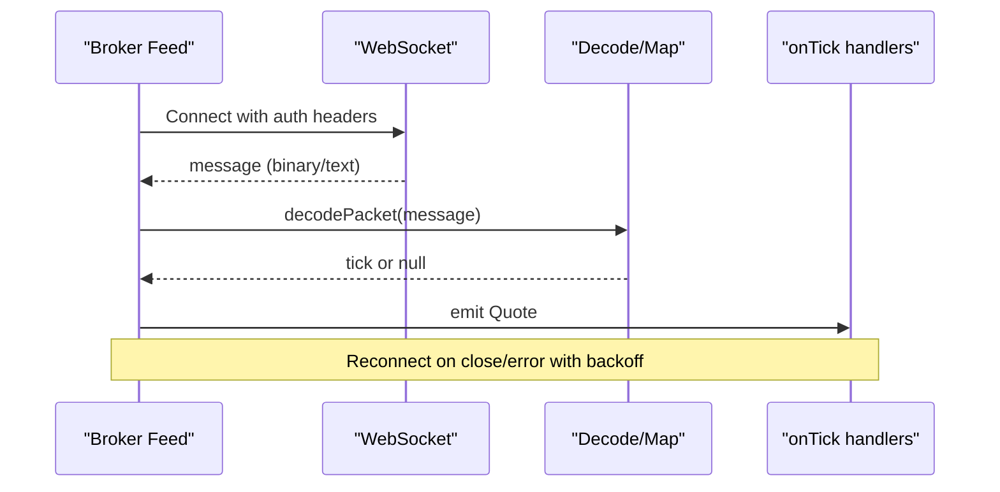
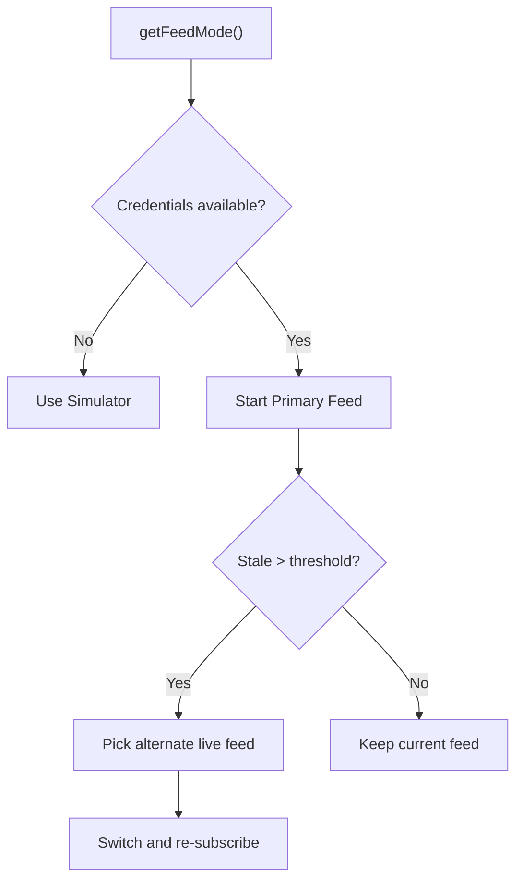
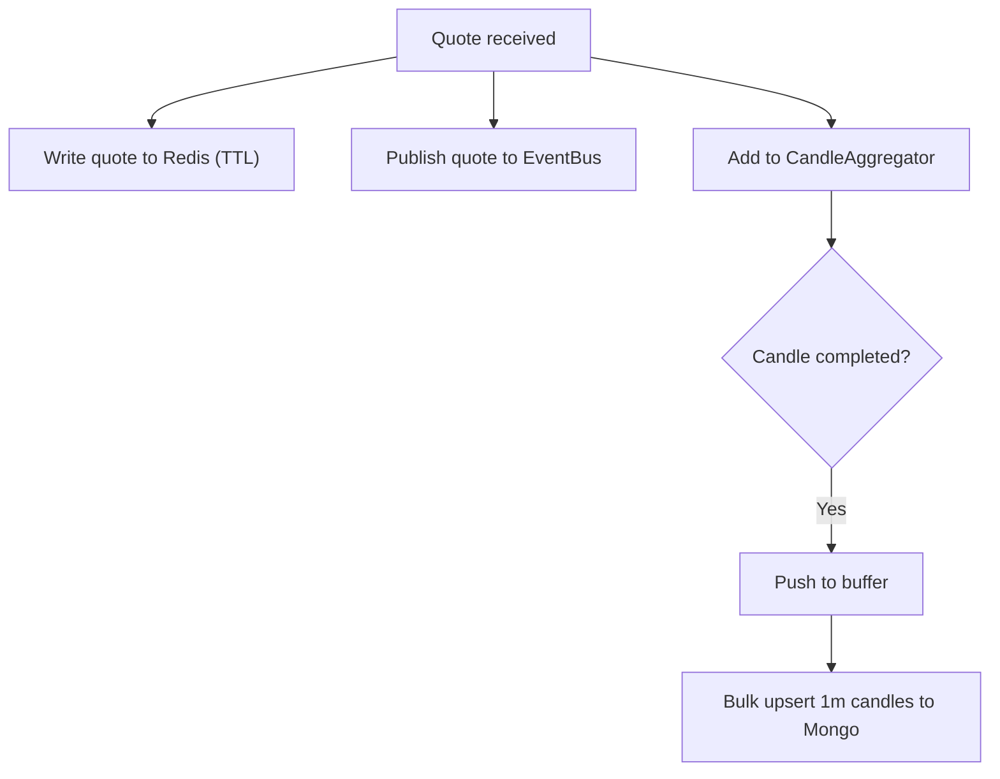
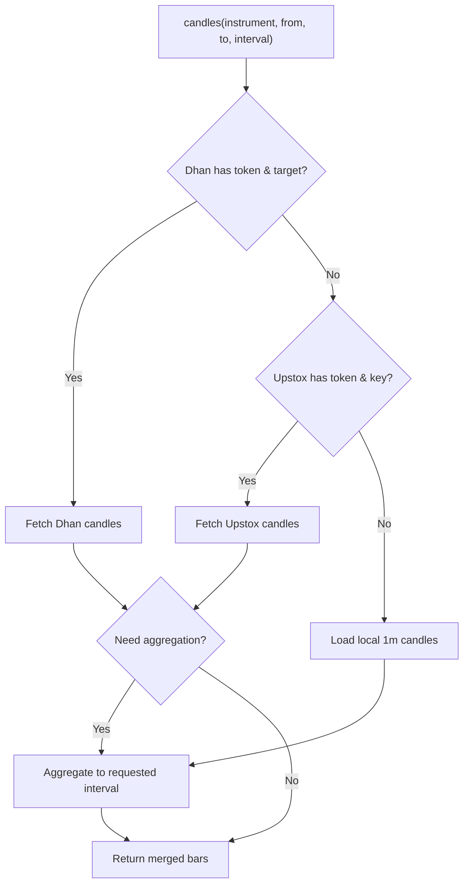
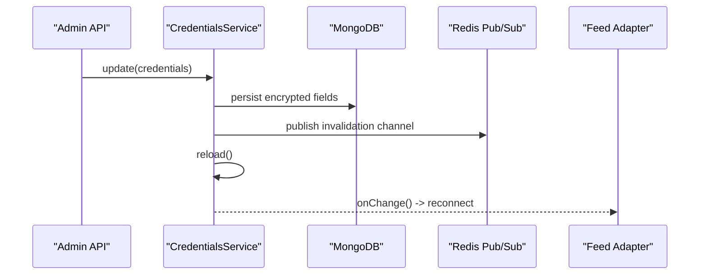
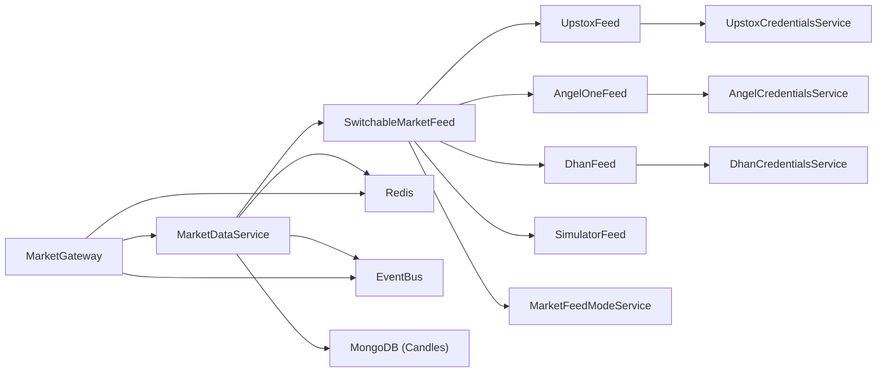

# Market Data Management

<cite>
**Referenced Files in This Document**
- [market-api.module.ts](file://backend/apps/api/src/modules/market/market-api.module.ts)
- [market-engine.module.ts](file://backend/apps/api/src/modules/market/market-engine.module.ts)
- [market-data.service.ts](file://backend/apps/api/src/modules/market/application/market-data.service.ts)
- [market-feed.port.ts](file://backend/apps/api/src/modules/market/infrastructure/feed/market-feed.port.ts)
- [switchable-market-feed.ts](file://backend/apps/api/src/modules/market/infrastructure/feed/switchable-market-feed.ts)
- [upstox-feed.ts](file://backend/apps/api/src/modules/market/infrastructure/feed/upstox-feed.ts)
- [angel-one-feed.ts](file://backend/apps/api/src/modules/market/infrastructure/feed/angel-one-feed.ts)
- [dhan-feed.ts](file://backend/apps/api/src/modules/market/infrastructure/feed/dhan-feed.ts)
- [simulator-feed.ts](file://backend/apps/api/src/modules/market/infrastructure/feed/simulator-feed.ts)
- [upstox-credentials.service.ts](file://backend/apps/api/src/modules/market/application/upstox-credentials.service.ts)
- [angel-credentials.service.ts](file://backend/apps/api/src/modules/market/application/angel-credentials.service.ts)
- [dhan-credentials.service.ts](file://backend/apps/api/src/modules/market/application/dhan-credentials.service.ts)
- [instrument.service.ts](file://backend/apps/api/src/modules/market/application/instrument.service.ts)
- [watchlist.service.ts](file://backend/apps/api/src/modules/market/application/watchlist.service.ts)
- [market-feed-mode.service.ts](file://backend/apps/api/src/modules/market/application/market-feed-mode.service.ts)
- [market.gateway.ts](file://backend/apps/api/src/modules/market/presentation/market.gateway.ts)
</cite>

## Table of Contents
1. Introduction
2. Project Structure
3. Core Components
4. Architecture Overview
5. Detailed Component Analysis
6. Dependency Analysis
7. Performance Considerations
8. Troubleshooting Guide
9. Conclusion

## Introduction
This document explains the Market Data Management module that provides multi-broker integration for Upstox, Angel One, and Dhan. It covers real-time market data streaming, historical data synchronization, instrument catalog management, watchlists, feed abstraction, data aggregation, candlestick generation, credential and token management, error handling, configuration for feed modes, rate limiting considerations, caching strategies, and WebSocket subscription management.

## Project Structure
The module is split into two NestJS modules:
- API module: exposes HTTP controllers and persistence for instruments, candles, watchlists, and integration settings.
- Engine module: owns the live feed pipeline, WebSocket gateway, and background processing (aggregation, caching, health checks).

**Diagram sources**
- [market-api.module.ts:27-60](file://backend/apps/api/src/modules/market/market-api.module.ts#L27-L60)
- [market-engine.module.ts:21-44](file://backend/apps/api/src/modules/market/market-engine.module.ts#L21-L44)

**Section sources**
- [market-api.module.ts:27-60](file://backend/apps/api/src/modules/market/market-api.module.ts#L27-L60)
- [market-engine.module.ts:21-44](file://backend/apps/api/src/modules/market/market-engine.module.ts#L21-L44)

## Core Components
- Feed abstraction: a single interface used by all broker adapters to publish normalized quotes.
- Switchable feed: runtime selection among simulator, Upstox, Angel One, and Dhan with automatic failover on stale ticks.
- Market data service: central ingestion pipeline that writes quotes to Redis, publishes events, aggregates 1-minute candles, and manages upstream subscriptions per instrument.
- WebSocket gateway: client-facing pub/sub over rooms per instrument; first subscriber triggers upstream subscription via the feed.
- Credential services: encrypted storage and hot reload of provider credentials with connection testing.
- Instrument service: catalog search/browse, quote cache fallback, and multi-source historical candles with local aggregation.
- Watchlist service: user tabs, built-in segments, add/remove/reorder, and counts from the instrument catalog.

**Section sources**
- [market-feed.port.ts:1-23](file://backend/apps/api/src/modules/market/infrastructure/feed/market-feed.port.ts#L1-L23)
- [switchable-market-feed.ts:19-55](file://backend/apps/api/src/modules/market/infrastructure/feed/switchable-market-feed.ts#L19-L55)
- [market-data.service.ts:15-52](file://backend/apps/api/src/modules/market/application/market-data.service.ts#L15-L52)
- [market.gateway.ts:19-35](file://backend/apps/api/src/modules/market/presentation/market.gateway.ts#L19-L35)
- [upstox-credentials.service.ts:39-68](file://backend/apps/api/src/modules/market/application/upstox-credentials.service.ts#L39-L68)
- [angel-credentials.service.ts:49-81](file://backend/apps/api/src/modules/market/application/angel-credentials.service.ts#L49-L81)
- [dhan-credentials.service.ts:52-78](file://backend/apps/api/src/modules/market/application/dhan-credentials.service.ts#L52-L78)
- [instrument.service.ts:151-288](file://backend/apps/api/src/modules/market/application/instrument.service.ts#L151-L288)
- [watchlist.service.ts:24-51](file://backend/apps/api/src/modules/market/application/watchlist.service.ts#L24-L51)

## Architecture Overview
The engine runs one active feed at a time. Quotes flow through a single handler that caches last quotes in Redis, publishes them on an event bus, and aggregates 1-minute candles. The WebSocket gateway fans out quotes to clients subscribed to specific instruments.

**Diagram sources**
- [market.gateway.ts:71-113](file://backend/apps/api/src/modules/market/presentation/market.gateway.ts#L71-L113)
- [market-data.service.ts:43-52](file://backend/apps/api/src/modules/market/application/market-data.service.ts#L43-L52)
- [market-data.service.ts:61-108](file://backend/apps/api/src/modules/market/application/market-data.service.ts#L61-L108)
- [switchable-market-feed.ts:86-102](file://backend/apps/api/src/modules/market/infrastructure/feed/switchable-market-feed.ts#L86-L102)

## Detailed Component Analysis

### Feed Abstraction Layer
- Interface defines start/stop, subscribe/unsubscribe, onTick, and secondsSinceLastTick.
- All broker feeds implement this interface, enabling runtime switching and unified behavior.

**Diagram sources**
- [market-feed.port.ts:7-22](file://backend/apps/api/src/modules/market/infrastructure/feed/market-feed.port.ts#L7-L22)
- [upstox-feed.ts:12-24](file://backend/apps/api/src/modules/market/infrastructure/feed/upstox-feed.ts#L12-L24)
- [angel-one-feed.ts:22-39](file://backend/apps/api/src/modules/market/infrastructure/feed/angel-one-feed.ts#L22-L39)
- [dhan-feed.ts:37-54](file://backend/apps/api/src/modules/market/infrastructure/feed/dhan-feed.ts#L37-L54)
- [simulator-feed.ts:25-38](file://backend/apps/api/src/modules/market/infrastructure/feed/simulator-feed.ts#L25-L38)

**Section sources**
- [market-feed.port.ts:1-23](file://backend/apps/api/src/modules/market/infrastructure/feed/market-feed.port.ts#L1-L23)

### Real-Time Streaming and Subscription Management
- Gateway authenticates clients via JWT query parameter, creates per-instrument rooms, and subscribes to the event bus once per key.
- First client in a room triggers upstream subscription via MarketDataService interest tracking; last client leaves triggers unsubscribe.
- On join, the gateway sends the cached last quote from Redis before live ticks.

**Diagram sources**
- [market.gateway.ts:48-113](file://backend/apps/api/src/modules/market/presentation/market.gateway.ts#L48-L113)
- [market-data.service.ts:61-96](file://backend/apps/api/src/modules/market/application/market-data.service.ts#L61-L96)

**Section sources**
- [market.gateway.ts:48-134](file://backend/apps/api/src/modules/market/presentation/market.gateway.ts#L48-L134)
- [market-data.service.ts:61-108](file://backend/apps/api/src/modules/market/application/market-data.service.ts#L61-L108)

### Broker Feeds: Upstox, Angel One, Dhan, Simulator
- UpstoxFeed: WSS with Bearer token obtained from credentials; binary protobuf messages decoded to quotes; reconnect with exponential backoff; re-subscribes after reconnect.
- AngelOneFeed: WSS with JWT, API key, client code, feed token; heartbeat ping; maps exchangeType+token to canonical instrumentKey; resubscribes after reconnect.
- DhanFeed: WSS with access token and clientId; parses DHAN| keys or DB fields; batches subscribe/unsubscribe; handles disconnect packets; maintains prevClose per route.
- SimulatorFeed: deterministic synthetic quotes using mean-reverting random walk; base price from reference closes, last candle, or segment-aware fallback; supports pushTick for replay tests.

**Diagram sources**
- [upstox-feed.ts:54-89](file://backend/apps/api/src/modules/market/infrastructure/feed/upstox-feed.ts#L54-L89)
- [angel-one-feed.ts:71-126](file://backend/apps/api/src/modules/market/infrastructure/feed/angel-one-feed.ts#L71-L126)
- [dhan-feed.ts:91-140](file://backend/apps/api/src/modules/market/infrastructure/feed/dhan-feed.ts#L91-L140)
- [simulator-feed.ts:40-75](file://backend/apps/api/src/modules/market/infrastructure/feed/simulator-feed.ts#L40-L75)

**Section sources**
- [upstox-feed.ts:12-136](file://backend/apps/api/src/modules/market/infrastructure/feed/upstox-feed.ts#L12-L136)
- [angel-one-feed.ts:22-242](file://backend/apps/api/src/modules/market/infrastructure/feed/angel-one-feed.ts#L22-L242)
- [dhan-feed.ts:37-279](file://backend/apps/api/src/modules/market/infrastructure/feed/dhan-feed.ts#L37-L279)
- [simulator-feed.ts:25-145](file://backend/apps/api/src/modules/market/infrastructure/feed/simulator-feed.ts#L25-L145)

### Switchable Feed and Failover
- Chooses primary feed based on configured mode and credential availability; falls back to alternate live providers if the primary is stale; finally falls back to simulator when no live feed is viable.
- Tracks currently subscribed keys and re-applies them after a switch.

**Diagram sources**
- [switchable-market-feed.ts:111-184](file://backend/apps/api/src/modules/market/infrastructure/feed/switchable-market-feed.ts#L111-L184)
- [market-feed-mode.service.ts:57-74](file://backend/apps/api/src/modules/market/application/market-feed-mode.service.ts#L57-L74)

**Section sources**
- [switchable-market-feed.ts:19-186](file://backend/apps/api/src/modules/market/infrastructure/feed/switchable-market-feed.ts#L19-L186)
- [market-feed-mode.service.ts:16-99](file://backend/apps/api/src/modules/market/application/market-feed-mode.service.ts#L16-L99)

### Ingestion Pipeline, Aggregation, and Persistence
- Each tick is written to Redis with a TTL and published to the event bus.
- 1-minute candles are aggregated in-memory and flushed to MongoDB in batches every few seconds.
- A watchdog monitors feed staleness during market hours and triggers re-subscription.

**Diagram sources**
- [market-data.service.ts:103-126](file://backend/apps/api/src/modules/market/application/market-data.service.ts#L103-L126)
- [market-data.service.ts:128-137](file://backend/apps/api/src/modules/market/application/market-data.service.ts#L128-L137)

**Section sources**
- [market-data.service.ts:15-52](file://backend/apps/api/src/modules/market/application/market-data.service.ts#L15-L52)
- [market-data.service.ts:103-137](file://backend/apps/api/src/modules/market/application/market-data.service.ts#L103-L137)

### Historical Data Synchronization and Candlestick Generation
- Prioritizes Dhan chart API when available; falls back to Upstox historical API; merges with local 1-minute candles stored in MongoDB.
- For non-1-minute intervals, aggregates local 1-minute bars when needed; sanitizes results and enforces limits.
- If no remote history exists, loads local 1-minute bars or generates synthetic flat candles based on reference prices.

**Diagram sources**
- [instrument.service.ts:190-288](file://backend/apps/api/src/modules/market/application/instrument.service.ts#L190-L288)
- [instrument.service.ts:459-494](file://backend/apps/api/src/modules/market/application/instrument.service.ts#L459-L494)

**Section sources**
- [instrument.service.ts:190-288](file://backend/apps/api/src/modules/market/application/instrument.service.ts#L190-L288)
- [instrument.service.ts:459-494](file://backend/apps/api/src/modules/market/application/instrument.service.ts#L459-L494)

### Instrument Catalog Management
- Supports search by symbol/name with prefix matching and text index fallback; paginated browse by segment with deduplication and sorting.
- Counts per segment and list endpoints enable UI tabs and navigation.

**Section sources**
- [instrument.service.ts:57-149](file://backend/apps/api/src/modules/market/application/instrument.service.ts#L57-L149)

### Watchlist Functionality
- Built-in tabs map to segments (STOCKS/EQ, INDICES/INDEX, OPTIONS/FO, CURRENCY/CUR).
- Custom tabs limited to 20; max symbols per tab enforced via configuration.
- CRUD operations: create, rename, get, add, remove, reorder; enriches items with catalog metadata.

**Section sources**
- [watchlist.service.ts:24-149](file://backend/apps/api/src/modules/market/application/watchlist.service.ts#L24-L149)

### Credential Management and Token Synchronization
- Each provider’s credentials are stored encrypted in the database with environment variable fallback.
- Changes are persisted, broadcast via Redis channels, and hot-reloaded without restart.
- Connection test endpoints validate tokens against provider APIs.
- Angel One supports login-by-password to obtain JWT and feed tokens; Dhan supports token generation via PIN/TOTP.

**Diagram sources**
- [upstox-credentials.service.ts:112-145](file://backend/apps/api/src/modules/market/application/upstox-credentials.service.ts#L112-L145)
- [angel-credentials.service.ts:139-177](file://backend/apps/api/src/modules/market/application/angel-credentials.service.ts#L139-L177)
- [dhan-credentials.service.ts:124-152](file://backend/apps/api/src/modules/market/application/dhan-credentials.service.ts#L124-L152)

**Section sources**
- [upstox-credentials.service.ts:39-216](file://backend/apps/api/src/modules/market/application/upstox-credentials.service.ts#L39-L216)
- [angel-credentials.service.ts:49-305](file://backend/apps/api/src/modules/market/application/angel-credentials.service.ts#L49-L305)
- [dhan-credentials.service.ts:52-282](file://backend/apps/api/src/modules/market/application/dhan-credentials.service.ts#L52-L282)

### Configuration for Feed Modes
- Feed mode can be set to simulator, upstox, angel, or dhan; defaults to environment variable if not present.
- Changes are persisted and broadcast to both API and engine processes for immediate effect.

**Section sources**
- [market-feed-mode.service.ts:16-99](file://backend/apps/api/src/modules/market/application/market-feed-mode.service.ts#L16-L99)

### Rate Limiting and Data Caching Strategies
- Real-time quotes are cached in Redis with a 24-hour TTL; gateway serves cached quotes on subscribe.
- Batched bulk writes for 1-minute candles reduce database overhead.
- Subscriptions are batched per broker (e.g., Dhan batches of 100) to respect provider limits.
- Heartbeats and reconnect backoffs protect connections and manage server load.

[No sources needed since this section provides general guidance]

## Dependency Analysis

**Diagram sources**
- [market-engine.module.ts:30-44](file://backend/apps/api/src/modules/market/market-engine.module.ts#L30-L44)
- [market-api.module.ts:47-59](file://backend/apps/api/src/modules/market/market-api.module.ts#L47-L59)

**Section sources**
- [market-engine.module.ts:21-44](file://backend/apps/api/src/modules/market/market-engine.module.ts#L21-L44)
- [market-api.module.ts:27-60](file://backend/apps/api/src/modules/market/market-api.module.ts#L27-L60)

## Performance Considerations
- On-demand upstream subscriptions minimize bandwidth and rate-limit pressure by tracking per-instrument interest.
- Redis caching reduces repeated lookups and enables instant quote delivery to new subscribers.
- Batched MongoDB upserts for 1-minute candles improve write throughput.
- Broker-specific batching (e.g., Dhan subscribe batches) reduces request volume.
- Exponential backoff and heartbeats stabilize connections under transient failures.

[No sources needed since this section provides general guidance]

## Troubleshooting Guide
- No quotes received: verify feed mode and credentials; check logs for “no access token” or “waiting for admin setup”; confirm market hours and that at least one client has joined a room.
- Stale feed warnings: the engine will attempt re-subscription or failover to another live feed; ensure at least one provider is configured and reachable.
- WebSocket authentication errors: ensure a valid JWT token is passed in the query string; check gateway logs for verification failures.
- Missing instrument mappings: for Angel One and Dhan, ensure instruments have required mapping fields (exchange type/token or securityId/segment); otherwise subscribe calls skip those keys.
- History gaps: if both Dhan and Upstox history fail, local 1-minute candles or synthetic flat candles may be returned; verify catalog keys and token configurations.

**Section sources**
- [upstox-feed.ts:35-39](file://backend/apps/api/src/modules/market/infrastructure/feed/upstox-feed.ts#L35-L39)
- [angel-one-feed.ts:57-61](file://backend/apps/api/src/modules/market/infrastructure/feed/angel-one-feed.ts#L57-L61)
- [dhan-feed.ts:72-76](file://backend/apps/api/src/modules/market/infrastructure/feed/dhan-feed.ts#L72-L76)
- [switchable-market-feed.ts:158-184](file://backend/apps/api/src/modules/market/infrastructure/feed/switchable-market-feed.ts#L158-L184)
- [market.gateway.ts:48-60](file://backend/apps/api/src/modules/market/presentation/market.gateway.ts#L48-L60)
- [dhan-feed.ts:217-223](file://backend/apps/api/src/modules/market/infrastructure/feed/dhan-feed.ts#L217-L223)

## Conclusion
The Market Data Management module provides a robust, multi-broker architecture with a clean feed abstraction, resilient real-time streaming, efficient aggregation and persistence, and flexible configuration. Credential hot reloads, failover logic, and careful subscription management ensure reliable operation across Upstox, Angel One, and Dhan while maintaining performance and scalability.