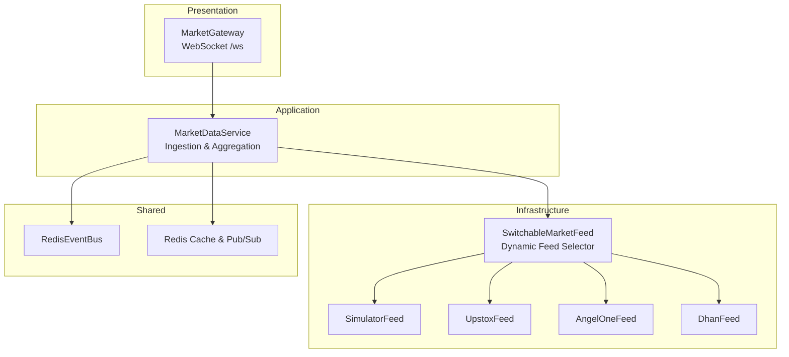
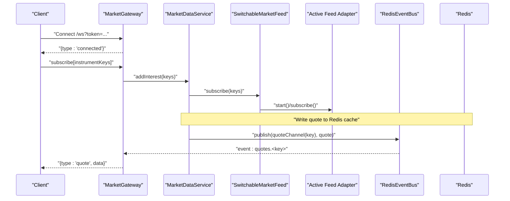
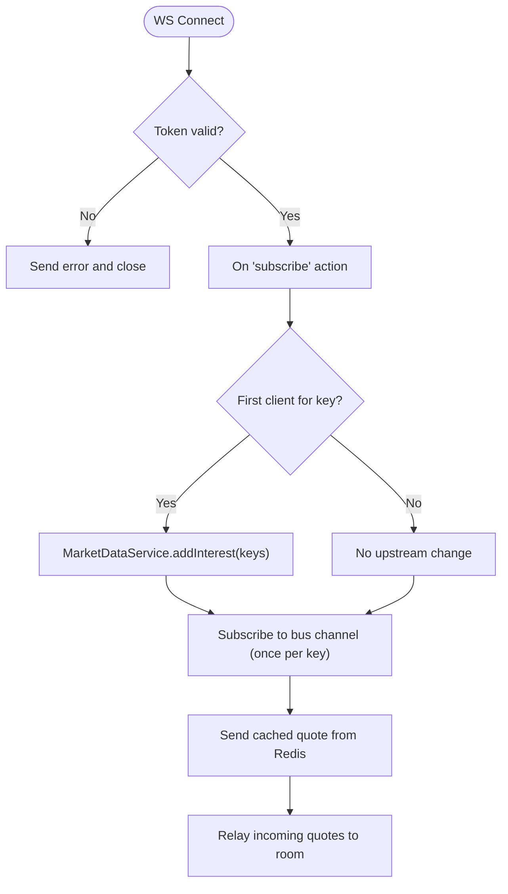
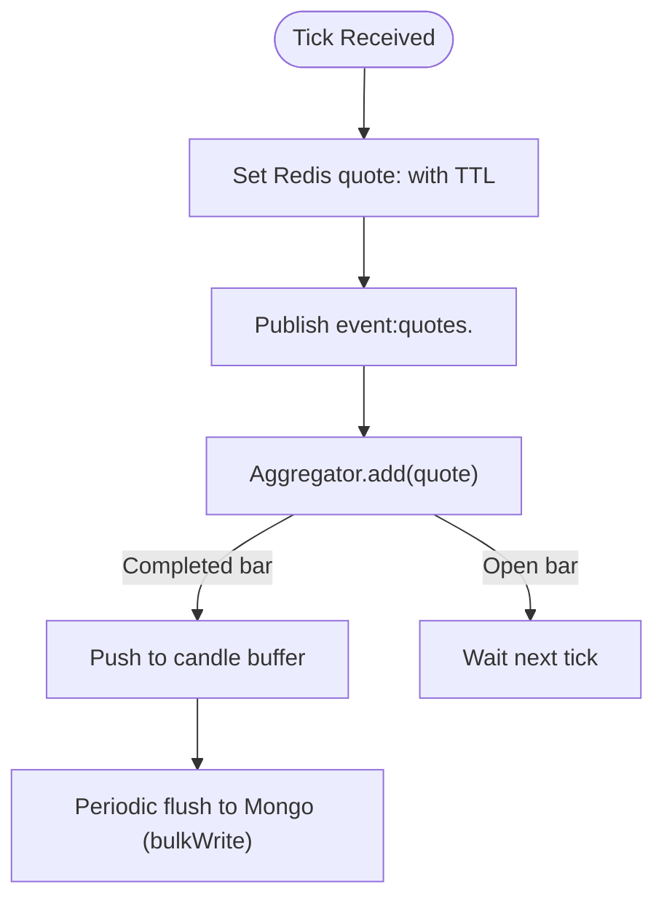
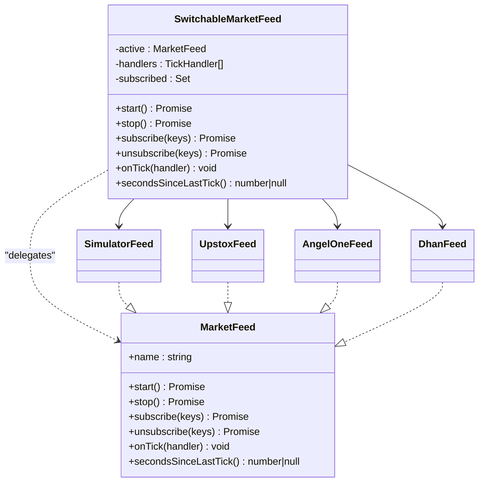
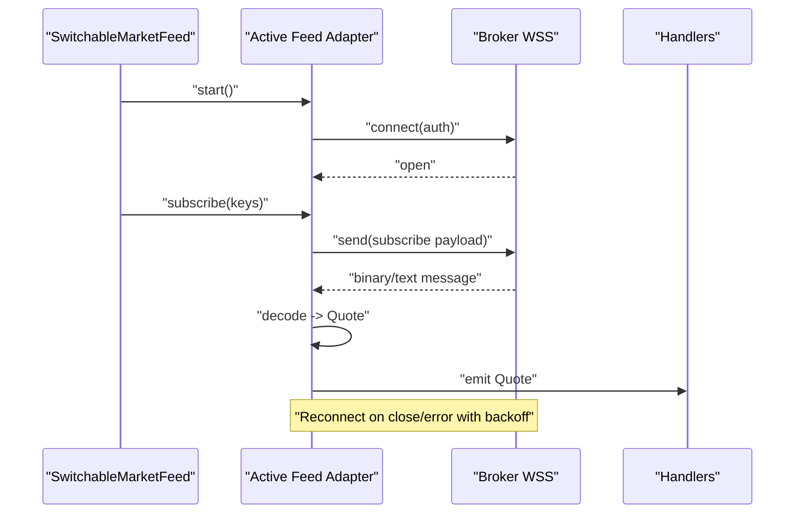
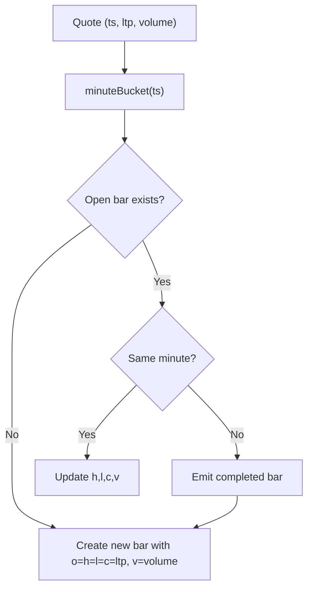
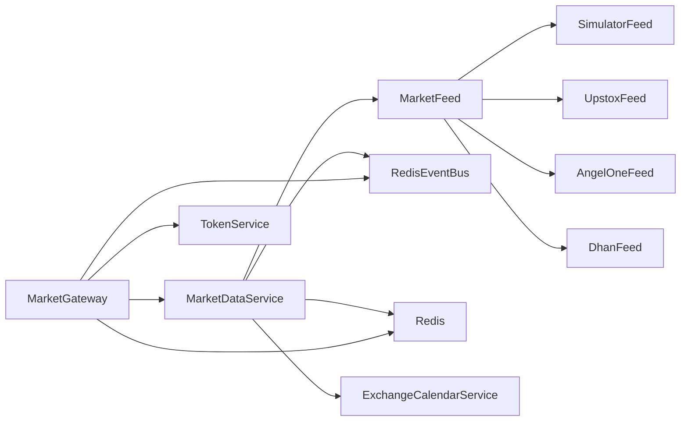

# Real-time Market Data Streaming

<cite>
**Referenced Files in This Document**
- [market.gateway.ts](file://backend/apps/api/src/modules/market/presentation/market.gateway.ts)
- [market-data.service.ts](file://backend/apps/api/src/modules/market/application/market-data.service.ts)
- [switchable-market-feed.ts](file://backend/apps/api/src/modules/market/infrastructure/feed/switchable-market-feed.ts)
- [market-feed.port.ts](file://backend/apps/api/src/modules/market/infrastructure/feed/market-feed.port.ts)
- [simulator-feed.ts](file://backend/apps/api/src/modules/market/infrastructure/feed/simulator-feed.ts)
- [upstox-feed.ts](file://backend/apps/api/src/modules/market/infrastructure/feed/upstox-feed.ts)
- [angel-one-feed.ts](file://backend/apps/api/src/modules/market/infrastructure/feed/angel-one-feed.ts)
- [dhan-feed.ts](file://backend/apps/api/src/modules/market/infrastructure/feed/dhan-feed.ts)
- [candle-aggregator.ts](file://backend/apps/api/src/modules/market/domain/candle-aggregator.ts)
- [market.types.ts](file://backend/libs/shared/src/market/market.types.ts)
- [redis-event-bus.ts](file://backend/libs/shared/src/redis/redis-event-bus.ts)
</cite>

## Table of Contents
1. [Introduction](#introduction)
2. [Project Structure](#project-structure)
3. [Core Components](#core-components)
4. [Architecture Overview](#architecture-overview)
5. [Detailed Component Analysis](#detailed-component-analysis)
6. [Dependency Analysis](#dependency-analysis)
7. [Performance Considerations](#performance-considerations)
8. [Troubleshooting Guide](#troubleshooting-guide)
9. [Conclusion](#conclusion)

## Introduction
This document explains the real-time market data streaming system that ingests live quotes from multiple broker feeds, normalizes them into a unified Quote model, and fans them out to clients via WebSocket rooms. It covers:
- WebSocket connection management and subscription patterns
- Message broadcasting per instrument
- Switchable market feed architecture with dynamic switching between Upstox, Angel One, Dhan, and a Simulator
- Candlestick aggregation from tick data
- Real-time price updates and order book fields (bid/ask)
- Client-side connection handling and reconnection logic
- Performance optimization for high-frequency data and memory management

## Project Structure
The streaming pipeline spans three layers:
- Presentation layer: WebSocket gateway that authenticates clients, manages per-instrument rooms, and relays quotes
- Application layer: Ingestion service that owns the single feed instance, handles on-demand upstream subscriptions, persists last quotes to Redis, publishes events, aggregates candles, and monitors feed health
- Infrastructure layer: Feed adapters implementing a common MarketFeed interface (Simulator, Upstox, Angel One, Dhan), plus a switchable facade that selects and hot-swaps active feed based on configuration and credentials

**Diagram sources**
- [market.gateway.ts:26-133](file://backend/apps/api/src/modules/market/presentation/market.gateway.ts#L26-L133)
- [market-data.service.ts:24-139](file://backend/apps/api/src/modules/market/application/market-data.service.ts#L24-L139)
- [switchable-market-feed.ts:23-185](file://backend/apps/api/src/modules/market/infrastructure/feed/switchable-market-feed.ts#L23-L185)
- [simulator-feed.ts:25-145](file://backend/apps/api/src/modules/market/infrastructure/feed/simulator-feed.ts#L25-L145)
- [upstox-feed.ts:12-136](file://backend/apps/api/src/modules/market/infrastructure/feed/upstox-feed.ts#L12-L136)
- [angel-one-feed.ts:22-242](file://backend/apps/api/src/modules/market/infrastructure/feed/angel-one-feed.ts#L22-L242)
- [dhan-feed.ts:37-279](file://backend/apps/api/src/modules/market/infrastructure/feed/dhan-feed.ts#L37-L279)
- [redis-event-bus.ts:15-65](file://backend/libs/shared/src/redis/redis-event-bus.ts#L15-L65)

**Section sources**
- [market.gateway.ts:26-133](file://backend/apps/api/src/modules/market/presentation/market.gateway.ts#L26-L133)
- [market-data.service.ts:24-139](file://backend/apps/api/src/modules/market/application/market-data.service.ts#L24-L139)
- [switchable-market-feed.ts:23-185](file://backend/apps/api/src/modules/market/infrastructure/feed/switchable-market-feed.ts#L23-L185)

## Core Components
- MarketGateway: Authenticates WebSocket connections, maintains per-instrument rooms, subscribes/unsubscribes to the event bus, sends cached quotes on join, and relives live quotes to room members.
- MarketDataService: Owns the single MarketFeed instance; implements on-demand upstream subscribe/unsubscribe by tracking client interest; writes normalized ticks to Redis cache; publishes events on the shared bus; aggregates 1-minute candles; runs a stale-feed watchdog.
- SwitchableMarketFeed: Hot-swaps active feed among simulator, Upstox, Angel One, and Dhan based on configured mode and credential availability; supports failover when the current feed becomes stale.
- Feed Adapters: Each implements MarketFeed, managing WSS lifecycle, authentication, subscribe/unsubscribe payloads, reconnect backoff, and mapping broker-specific messages to the canonical Quote type.
- Shared Types and Bus: Quote/Candle contracts and a Redis-backed EventBus used for decoupled fan-out.

**Section sources**
- [market.gateway.ts:26-133](file://backend/apps/api/src/modules/market/presentation/market.gateway.ts#L26-L133)
- [market-data.service.ts:24-139](file://backend/apps/api/src/modules/market/application/market-data.service.ts#L24-L139)
- [switchable-market-feed.ts:23-185](file://backend/apps/api/src/modules/market/infrastructure/feed/switchable-market-feed.ts#L23-L185)
- [market-feed.port.ts:1-23](file://backend/apps/api/src/modules/market/infrastructure/feed/market-feed.port.ts#L1-L23)
- [market.types.ts:1-39](file://backend/libs/shared/src/market/market.types.ts#L1-L39)
- [redis-event-bus.ts:15-65](file://backend/libs/shared/src/redis/redis-event-bus.ts#L15-L65)

## Architecture Overview
The system uses an on-demand subscription pattern to avoid subscribing to the entire instrument catalog. The gateway only bumps upstream interest when at least one client joins a room. Quotes are written to Redis for caching and published to the event bus for fan-out. A switchable facade ensures continuity by failing over to alternate feeds or simulator if the active feed stalls.

**Diagram sources**
- [market.gateway.ts:48-133](file://backend/apps/api/src/modules/market/presentation/market.gateway.ts#L48-L133)
- [market-data.service.ts:43-108](file://backend/apps/api/src/modules/market/application/market-data.service.ts#L43-L108)
- [switchable-market-feed.ts:57-155](file://backend/apps/api/src/modules/market/infrastructure/feed/switchable-market-feed.ts#L57-L155)
- [redis-event-bus.ts:26-65](file://backend/libs/shared/src/redis/redis-event-bus.ts#L26-L65)

## Detailed Component Analysis

### WebSocket Gateway: Connection, Rooms, and Broadcasting
- Authentication: Extracts JWT token from query string, verifies access, and associates userId with the socket.
- Room model: Maintains per-instrument sets of sockets; first client triggers upstream interest; last client drops it.
- Subscription flow: On join, subscribes to the Redis event bus channel for the instrument once per key, sends the cached last quote from Redis, then relays live quotes.
- Unsubscription: Removes socket from room and cleans up interest when empty.

**Diagram sources**
- [market.gateway.ts:48-133](file://backend/apps/api/src/modules/market/presentation/market.gateway.ts#L48-L133)

**Section sources**
- [market.gateway.ts:48-133](file://backend/apps/api/src/modules/market/presentation/market.gateway.ts#L48-L133)

### Market Data Service: Ingestion, Aggregation, and Health
- On-module init: Registers tick handler on the feed, starts timers for candle flush and feed health checks.
- On-demand subscribe: Tracks client interest per instrument; calls feed.subscribe when count transitions 0→1; unsubscribes when 0.
- Tick handling: Writes normalized Quote to Redis cache with TTL; publishes to event bus; passes through aggregator for 1-minute candles; batches and upserts completed candles.
- Stale feed watchdog: During market hours, if no ticks received for tracked keys beyond threshold, logs warning and resubscribes to refresh state.

**Diagram sources**
- [market-data.service.ts:43-139](file://backend/apps/api/src/modules/market/application/market-data.service.ts#L43-L139)
- [candle-aggregator.ts:13-52](file://backend/apps/api/src/modules/market/domain/candle-aggregator.ts#L13-L52)

**Section sources**
- [market-data.service.ts:43-139](file://backend/apps/api/src/modules/market/application/market-data.service.ts#L43-L139)
- [candle-aggregator.ts:13-52](file://backend/apps/api/src/modules/market/domain/candle-aggregator.ts#L13-L52)

### Switchable Market Feed: Dynamic Feed Selection and Failover
- Mode-driven selection: Chooses primary feed based on configured mode and credential availability; falls back to other live providers; finally simulator if none available.
- Live failover: Periodically checks secondsSinceLastTick; if stale beyond threshold, switches to alternate live feed or simulator.
- Rebind on config changes: Subscribes to feed mode and credential change events to trigger seamless rebind without losing subscriptions.
- Subscription persistence: Tracks subscribed keys and reapplies them after switch.

**Diagram sources**
- [market-feed.port.ts:1-23](file://backend/apps/api/src/modules/market/infrastructure/feed/market-feed.port.ts#L1-L23)
- [switchable-market-feed.ts:23-185](file://backend/apps/api/src/modules/market/infrastructure/feed/switchable-market-feed.ts#L23-L185)
- [simulator-feed.ts:25-145](file://backend/apps/api/src/modules/market/infrastructure/feed/simulator-feed.ts#L25-L145)
- [upstox-feed.ts:12-136](file://backend/apps/api/src/modules/market/infrastructure/feed/upstox-feed.ts#L12-L136)
- [angel-one-feed.ts:22-242](file://backend/apps/api/src/modules/market/infrastructure/feed/angel-one-feed.ts#L22-L242)
- [dhan-feed.ts:37-279](file://backend/apps/api/src/modules/market/infrastructure/feed/dhan-feed.ts#L37-L279)

**Section sources**
- [switchable-market-feed.ts:57-185](file://backend/apps/api/src/modules/market/infrastructure/feed/switchable-market-feed.ts#L57-L185)

### Feed Adapters: Broker-Specific Implementations
- UpstoxFeed: Authorizes feed URL via REST, connects with Bearer token, decodes protobuf messages, re-subscribes on reconnect, exponential backoff.
- AngelOneFeed: Connects with JWT and API headers, sends periodic ping heartbeat, maps tokens to instruments, re-subscribes on reconnect.
- DhanFeed: Connects with token and clientId, parses binary packets, tracks prevClose per route, batches subscribe/unsubscribe requests, reconnects with backoff.
- SimulatorFeed: Generates deterministic synthetic quotes using mean-reverting random walk, seeded RNG for replay tests, resolves base prices from reference closes or last bars.

**Diagram sources**
- [upstox-feed.ts:54-126](file://backend/apps/api/src/modules/market/infrastructure/feed/upstox-feed.ts#L54-L126)
- [angel-one-feed.ts:71-163](file://backend/apps/api/src/modules/market/infrastructure/feed/angel-one-feed.ts#L71-L163)
- [dhan-feed.ts:91-159](file://backend/apps/api/src/modules/market/infrastructure/feed/dhan-feed.ts#L91-L159)
- [simulator-feed.ts:40-98](file://backend/apps/api/src/modules/market/infrastructure/feed/simulator-feed.ts#L40-L98)

**Section sources**
- [upstox-feed.ts:54-136](file://backend/apps/api/src/modules/market/infrastructure/feed/upstox-feed.ts#L54-L136)
- [angel-one-feed.ts:71-242](file://backend/apps/api/src/modules/market/infrastructure/feed/angel-one-feed.ts#L71-L242)
- [dhan-feed.ts:91-279](file://backend/apps/api/src/modules/market/infrastructure/feed/dhan-feed.ts#L91-L279)
- [simulator-feed.ts:40-145](file://backend/apps/api/src/modules/market/infrastructure/feed/simulator-feed.ts#L40-L145)

### Candlestick Aggregation from Tick Data
- Pure 1-minute OHLCV aggregator aligned to minute boundaries.
- Emits completed candles when a tick crosses into a new minute for an instrument.
- Supports flushing open bars at session end/shutdown.

**Diagram sources**
- [candle-aggregator.ts:13-52](file://backend/apps/api/src/modules/market/domain/candle-aggregator.ts#L13-L52)

**Section sources**
- [candle-aggregator.ts:13-52](file://backend/apps/api/src/modules/market/domain/candle-aggregator.ts#L13-L52)

### Real-Time Price Updates and Order Book Fields
- Quote includes LTP, bid, ask, change, changePct, volume, prevClose, and timestamp.
- Each adapter maps broker-specific fields to this canonical structure, enabling consistent downstream processing and UI rendering.

**Section sources**
- [market.types.ts:5-16](file://backend/libs/shared/src/market/market.types.ts#L5-L16)
- [upstox-feed.ts:81-89](file://backend/apps/api/src/modules/market/infrastructure/feed/upstox-feed.ts#L81-L89)
- [angel-one-feed.ts:109-126](file://backend/apps/api/src/modules/market/infrastructure/feed/angel-one-feed.ts#L109-L126)
- [dhan-feed.ts:113-140](file://backend/apps/api/src/modules/market/infrastructure/feed/dhan-feed.ts#L113-L140)
- [simulator-feed.ts:77-98](file://backend/apps/api/src/modules/market/infrastructure/feed/simulator-feed.ts#L77-L98)

### Client-Side Connection Handling and Reconnection Logic
- Server-side:
  - Gateway validates JWT on connect and sends a connected acknowledgment.
  - Clients can send subscribe/unsubscribe actions with instrument keys (bounded to a safe limit).
  - First client per instrument triggers upstream subscription; last client leaves drops it.
- Feed-level reconnection:
  - All live adapters implement exponential backoff reconnection on close/error.
  - Credentials change events trigger immediate reconnect to refresh tokens.
  - Switchable feed monitors staleness and fails over to alternate feed or simulator.

**Section sources**
- [market.gateway.ts:48-133](file://backend/apps/api/src/modules/market/presentation/market.gateway.ts#L48-L133)
- [upstox-feed.ts:91-126](file://backend/apps/api/src/modules/market/infrastructure/feed/upstox-feed.ts#L91-L126)
- [angel-one-feed.ts:128-163](file://backend/apps/api/src/modules/market/infrastructure/feed/angel-one-feed.ts#L128-L163)
- [dhan-feed.ts:142-196](file://backend/apps/api/src/modules/market/infrastructure/feed/dhan-feed.ts#L142-L196)
- [switchable-market-feed.ts:158-185](file://backend/apps/api/src/modules/market/infrastructure/feed/switchable-market-feed.ts#L158-L185)

## Dependency Analysis
- MarketDataService depends on:
  - MarketFeed (injected via symbol) for tick ingestion
  - Redis for caching and pub/sub
  - EventBus for decoupled fan-out
  - ExchangeCalendarService for market-open checks
- MarketGateway depends on:
  - TokenService for JWT verification
  - Redis for last quote retrieval
  - EventBus to subscribe to per-instrument channels
  - MarketDataService for interest management
- Feed adapters depend on:
  - Credential services for tokens/keys
  - Instrument models for mapping canonical keys to broker routes
  - ws library for WebSocket transport

**Diagram sources**
- [market-data.service.ts:34-41](file://backend/apps/api/src/modules/market/application/market-data.service.ts#L34-L41)
- [market.gateway.ts:37-42](file://backend/apps/api/src/modules/market/presentation/market.gateway.ts#L37-L42)
- [switchable-market-feed.ts:36-51](file://backend/apps/api/src/modules/market/infrastructure/feed/switchable-market-feed.ts#L36-L51)

**Section sources**
- [market-data.service.ts:34-41](file://backend/apps/api/src/modules/market/application/market-data.service.ts#L34-L41)
- [market.gateway.ts:37-42](file://backend/apps/api/src/modules/market/presentation/market.gateway.ts#L37-L42)
- [switchable-market-feed.ts:36-51](file://backend/apps/api/src/modules/market/infrastructure/feed/switchable-market-feed.ts#L36-L51)

## Performance Considerations
- On-demand upstream subscriptions: Avoids subscribing to the full instrument catalog; only instruments with active client rooms are pushed to brokers.
- Batched operations:
  - Candle buffering and bulkWrite reduce database write overhead.
  - Feed adapters batch subscribe/unsubscribe payloads where supported (e.g., Dhan).
- Efficient caching: Last quote stored in Redis with TTL to minimize latency for new subscribers.
- Event bus decoupling: Redis-based EventBus provides fire-and-forget fan-out without blocking tick processing.
- Memory management:
  - Per-room sets and per-key subscriptions bounded by client limits and instrument caps.
  - Aggregator keeps only open bars per instrument; flushes completed bars promptly.
- Backoff and resilience: Exponential backoff prevents thundering herds during reconnect storms; stale feed detection avoids long silent periods.

[No sources needed since this section provides general guidance]

## Troubleshooting Guide
- Missing token on WebSocket connect: Gateway rejects and closes connection; ensure client attaches a valid JWT query parameter.
- No quotes after subscribe:
  - Verify at least one client joined the room to bump upstream interest.
  - Check Redis for cached quotes; absence indicates no prior ticks.
  - Confirm feed is not stale; check logs for STALE FEED warnings and ensure market hours alignment.
- Stale feed behavior:
  - Watchdog logs warnings and attempts resubscription; if all live feeds are unavailable, switchable feed may fall back to simulator.
- Credential issues:
  - Feeds log warnings when started without required credentials; update via admin flows to refresh tokens and trigger reconnect.
- High CPU or memory usage:
  - Reduce number of subscribed instruments per client.
  - Ensure clients unsubscribe promptly when leaving rooms.
  - Monitor Redis memory usage for large numbers of cached quotes.

**Section sources**
- [market.gateway.ts:48-61](file://backend/apps/api/src/modules/market/presentation/market.gateway.ts#L48-L61)
- [market-data.service.ts:128-139](file://backend/apps/api/src/modules/market/application/market-data.service.ts#L128-L139)
- [switchable-market-feed.ts:158-185](file://backend/apps/api/src/modules/market/infrastructure/feed/switchable-market-feed.ts#L158-L185)
- [upstox-feed.ts:31-40](file://backend/apps/api/src/modules/market/infrastructure/feed/upstox-feed.ts#L31-L40)
- [angel-one-feed.ts:45-62](file://backend/apps/api/src/modules/market/infrastructure/feed/angel-one-feed.ts#L45-L62)
- [dhan-feed.ts:60-77](file://backend/apps/api/src/modules/market/infrastructure/feed/dhan-feed.ts#L60-L77)

## Conclusion
The streaming system provides robust, scalable real-time market data delivery by combining on-demand upstream subscriptions, a unified Quote model, Redis-backed caching and event bus, and a switchable feed architecture that ensures continuity across broker integrations. Candle aggregation and health monitoring further enhance reliability and usability for downstream consumers.

[No sources needed since this section summarizes without analyzing specific files]