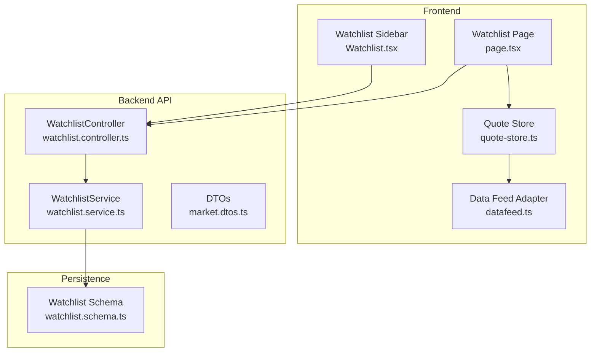
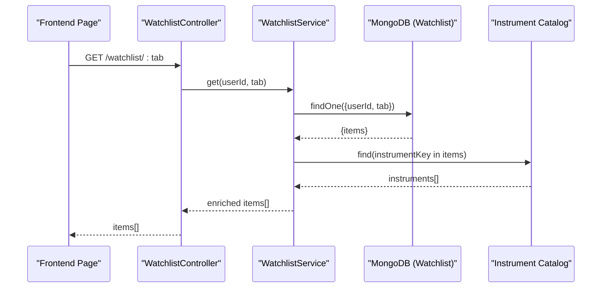
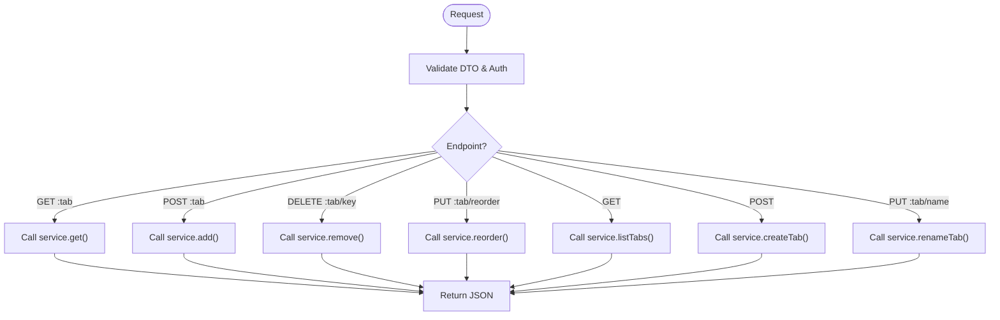
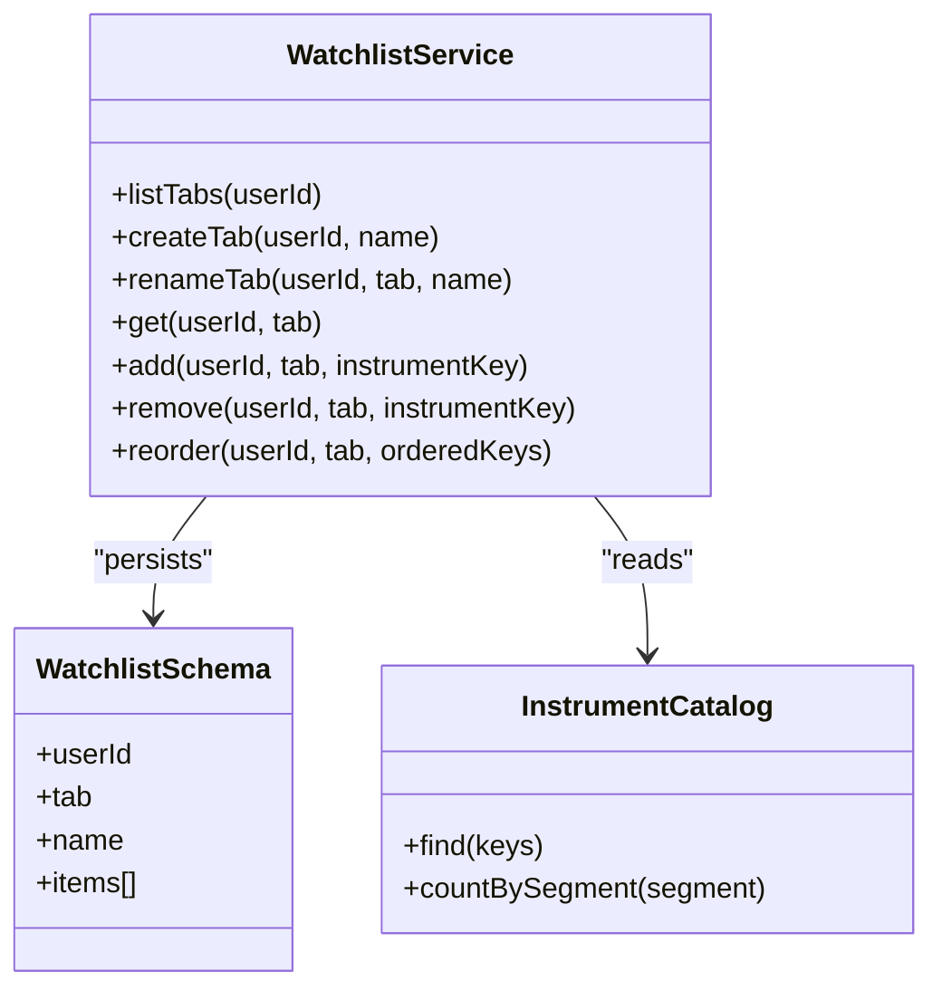
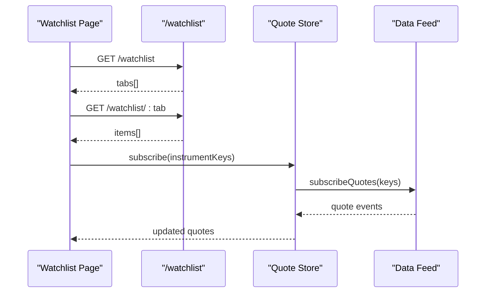
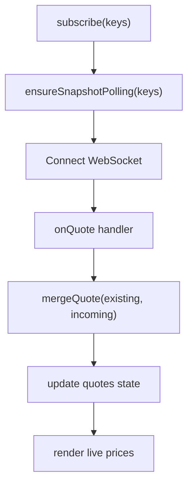
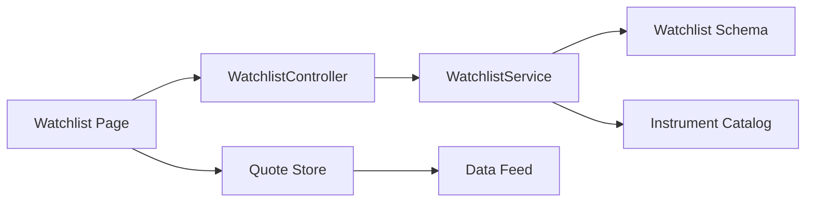

# Watchlist Management

<cite>
**Referenced Files in This Document**
- [watchlist.service.ts](file://backend/apps/api/src/modules/market/application/watchlist.service.ts)
- [watchlist.controller.ts](file://backend/apps/api/src/modules/market/presentation/watchlist.controller.ts)
- [market.dtos.ts](file://backend/apps/api/src/modules/market/presentation/dto/market.dtos.ts)
- [watchlist.schema.ts](file://backend/apps/api/src/modules/market/infrastructure/schemas/watchlist.schema.ts)
- [Watchlist.tsx](file://frontend/trader/src/components/Watchlist.tsx)
- [page.tsx](file://frontend/trader/src/app/watchlist/page.tsx)
- [quote-store.ts](file://frontend/trader/src/lib/quote-store.ts)
- [datafeed.ts](file://frontend/trader/src/lib/market/datafeed.ts)
</cite>

## Table of Contents
1. [Introduction](#introduction)
2. [Project Structure](#project-structure)
3. [Core Components](#core-components)
4. [Architecture Overview](#architecture-overview)
5. [Detailed Component Analysis](#detailed-component-analysis)
6. [Dependency Analysis](#dependency-analysis)
7. [Performance Considerations](#performance-considerations)
8. [Troubleshooting Guide](#troubleshooting-guide)
9. [Conclusion](#conclusion)

## Introduction
This document explains the watchlist management system that enables users to create, organize, and manage personal watchlists alongside built-in catalog tabs (Stocks, Indices, Options, Currency). It covers CRUD operations, persistence, search and organization features, real-time market data integration for live price updates, and performance strategies for large lists and frequent updates.

## Project Structure
The watchlist feature spans backend API endpoints and services, a database schema, and frontend components that render lists, handle user interactions, and integrate with real-time quotes.

**Diagram sources**
- [page.tsx:206-285](file://frontend/trader/src/app/watchlist/page.tsx#L206-L285)
- [Watchlist.tsx:70-81](file://frontend/trader/src/components/Watchlist.tsx#L70-L81)
- [quote-store.ts:96-151](file://frontend/trader/src/lib/quote-store.ts#L96-L151)
- [datafeed.ts:204-467](file://frontend/trader/src/lib/market/datafeed.ts#L204-L467)
- [watchlist.controller.ts:32-75](file://backend/apps/api/src/modules/market/presentation/watchlist.controller.ts#L32-L75)
- [watchlist.service.ts:24-148](file://backend/apps/api/src/modules/market/application/watchlist.service.ts#L24-L148)
- [watchlist.schema.ts:11-30](file://backend/apps/api/src/modules/market/infrastructure/schemas/watchlist.schema.ts#L11-L30)

**Section sources**
- [watchlist.controller.ts:32-75](file://backend/apps/api/src/modules/market/presentation/watchlist.controller.ts#L32-L75)
- [watchlist.service.ts:24-148](file://backend/apps/api/src/modules/market/application/watchlist.service.ts#L24-L148)
- [watchlist.schema.ts:11-30](file://backend/apps/api/src/modules/market/infrastructure/schemas/watchlist.schema.ts#L11-L30)
- [page.tsx:206-285](file://frontend/trader/src/app/watchlist/page.tsx#L206-L285)
- [Watchlist.tsx:70-81](file://frontend/trader/src/components/Watchlist.tsx#L70-L81)
- [quote-store.ts:96-151](file://frontend/trader/src/lib/quote-store.ts#L96-L151)
- [datafeed.ts:204-467](file://frontend/trader/src/lib/market/datafeed.ts#L204-L467)

## Core Components
- Backend controller exposes REST endpoints for listing tabs, creating/rename tabs, adding/removing instruments, and reordering items.
- Service enforces business rules: user scoping, limits, deduplication, sorting, and instrument validation against the catalog.
- Schema defines per-user watchlist documents with unique indexes on userId + tab, storing ordered items via a sort field.
- Frontend page manages tabs, search, browsing, local fallback, and integrates with real-time quotes.
- Sidebar component provides a compact watchlist view with add/remove actions and live prices.
- Quote store coordinates WebSocket subscriptions and REST snapshot polling for live updates.

**Section sources**
- [watchlist.controller.ts:32-75](file://backend/apps/api/src/modules/market/presentation/watchlist.controller.ts#L32-L75)
- [watchlist.service.ts:24-148](file://backend/apps/api/src/modules/market/application/watchlist.service.ts#L24-L148)
- [watchlist.schema.ts:11-30](file://backend/apps/api/src/modules/market/infrastructure/schemas/watchlist.schema.ts#L11-L30)
- [page.tsx:206-285](file://frontend/trader/src/app/watchlist/page.tsx#L206-L285)
- [Watchlist.tsx:70-81](file://frontend/trader/src/components/Watchlist.tsx#L70-L81)
- [quote-store.ts:96-151](file://frontend/trader/src/lib/quote-store.ts#L96-L151)

## Architecture Overview
The watchlist architecture separates concerns across layers:
- Presentation layer (controller) validates inputs and maps domain results to HTTP responses.
- Application layer (service) implements use cases: list tabs, create/rename tabs, add/remove/reorder items, and fetch enriched items with instrument details.
- Infrastructure layer (schema) persists watchlists in MongoDB with unique constraints and timestamps.
- Frontend integrates with the API and uses a quote store backed by a WebSocket data feed for live prices.

**Diagram sources**
- [watchlist.controller.ts:56-59](file://backend/apps/api/src/modules/market/presentation/watchlist.controller.ts#L56-L59)
- [watchlist.service.ts:89-102](file://backend/apps/api/src/modules/market/application/watchlist.service.ts#L89-L102)
- [watchlist.schema.ts:11-30](file://backend/apps/api/src/modules/market/infrastructure/schemas/watchlist.schema.ts#L11-L30)

## Detailed Component Analysis

### Backend: Watchlist Controller
- Exposes endpoints:
  - GET /watchlist: list all tabs (built-in counts + custom lists)
  - POST /watchlist: create a new custom tab (WL1..WL20)
  - PUT /watchlist/:tab/name: rename a custom tab
  - GET /watchlist/:tab: get items for a tab with instrument details
  - POST /watchlist/:tab: add an instrument to a tab
  - DELETE /watchlist/:tab/:instrumentKey: remove an instrument
  - PUT /watchlist/:tab/reorder: reorder items by ordered keys
- Validates input using DTOs and guards authentication.
- Maps domain errors to appropriate HTTP status codes.

**Diagram sources**
- [watchlist.controller.ts:32-75](file://backend/apps/api/src/modules/market/presentation/watchlist.controller.ts#L32-L75)
- [market.dtos.ts:42-56](file://backend/apps/api/src/modules/market/presentation/dto/market.dtos.ts#L42-L56)

**Section sources**
- [watchlist.controller.ts:32-75](file://backend/apps/api/src/modules/market/presentation/watchlist.controller.ts#L32-L75)
- [market.dtos.ts:42-56](file://backend/apps/api/src/modules/market/presentation/dto/market.dtos.ts#L42-L56)

### Backend: Watchlist Service
- User-scoped operations: ensures valid userId and scopes queries to the current user.
- Built-in tabs: STOCKS, INDICES, OPTIONS, CURRENCY; custom tabs WL1..WL20.
- Limits: configurable max symbols per tab; enforced on add.
- Deduplication: prevents duplicate entries when adding.
- Sorting: maintains order via sort field; supports reorder endpoint.
- Enrichment: joins items with instrument catalog to return full instrument metadata.

**Diagram sources**
- [watchlist.service.ts:24-148](file://backend/apps/api/src/modules/market/application/watchlist.service.ts#L24-L148)
- [watchlist.schema.ts:11-30](file://backend/apps/api/src/modules/market/infrastructure/schemas/watchlist.schema.ts#L11-L30)

**Section sources**
- [watchlist.service.ts:24-148](file://backend/apps/api/src/modules/market/application/watchlist.service.ts#L24-L148)
- [watchlist.schema.ts:11-30](file://backend/apps/api/src/modules/market/infrastructure/schemas/watchlist.schema.ts#L11-L30)

### Database Schema
- Collection: watchlists
- Fields:
  - userId: ObjectId, indexed
  - tab: string (built-in or WL1..WL20)
  - name: optional display name for custom lists
  - items: array of { instrumentKey, sort }
- Unique index on (userId, tab) ensures one list per tab per user.

**Section sources**
- [watchlist.schema.ts:11-30](file://backend/apps/api/src/modules/market/infrastructure/schemas/watchlist.schema.ts#L11-L30)

### Frontend: Watchlist Page
- Loads tabs from API; creates default “My Watchlist” if none exist.
- Supports personal tabs and catalog tabs (STOCKS, INDICES, OPTIONS, CURRENCY).
- Search: debounced query to /market/search with segment filter.
- Browse: paginated loading of instruments per segment with infinite scroll.
- Local fallback: if API is unavailable, uses localStorage to persist lists and star state.
- Real-time integration: subscribes to quotes for displayed instruments.

**Diagram sources**
- [page.tsx:206-285](file://frontend/trader/src/app/watchlist/page.tsx#L206-L285)
- [quote-store.ts:96-151](file://frontend/trader/src/lib/quote-store.ts#L96-L151)
- [datafeed.ts:342-351](file://frontend/trader/src/lib/market/datafeed.ts#L342-L351)

**Section sources**
- [page.tsx:206-285](file://frontend/trader/src/app/watchlist/page.tsx#L206-L285)
- [page.tsx:287-350](file://frontend/trader/src/app/watchlist/page.tsx#L287-L350)

### Frontend: Watchlist Sidebar Component
- Compact view for quick access to instruments.
- Loads catalog segments and watchlist items based on active tab.
- Adds instruments to the current tab via POST /watchlist/:tab.
- Displays live changes and last traded price via quote store.

**Section sources**
- [Watchlist.tsx:70-81](file://frontend/trader/src/components/Watchlist.tsx#L70-L81)
- [Watchlist.tsx:122-132](file://frontend/trader/src/components/Watchlist.tsx#L122-L132)

### Real-Time Market Data Integration
- Quote store manages subscriptions and merges incoming quotes with existing state.
- Uses WebSocket data feed for live ticks and REST snapshots when market is closed.
- Polls market status and refreshes snapshots at intervals to keep prices current.
- Integrates with charts and option chains through shared quote state.

**Diagram sources**
- [quote-store.ts:96-151](file://frontend/trader/src/lib/quote-store.ts#L96-L151)
- [datafeed.ts:367-413](file://frontend/trader/src/lib/market/datafeed.ts#L367-L413)

**Section sources**
- [quote-store.ts:96-151](file://frontend/trader/src/lib/quote-store.ts#L96-L151)
- [datafeed.ts:367-413](file://frontend/trader/src/lib/market/datafeed.ts#L367-L413)

## Dependency Analysis
- Controller depends on service for business logic and DTOs for validation.
- Service depends on Mongoose models for persistence and instrument catalog for enrichment.
- Frontend page depends on API for tabs/items and quote store for live data.
- Quote store depends on data feed for WebSocket connectivity and REST for snapshots.

**Diagram sources**
- [watchlist.controller.ts:32-75](file://backend/apps/api/src/modules/market/presentation/watchlist.controller.ts#L32-L75)
- [watchlist.service.ts:24-148](file://backend/apps/api/src/modules/market/application/watchlist.service.ts#L24-L148)
- [watchlist.schema.ts:11-30](file://backend/apps/api/src/modules/market/infrastructure/schemas/watchlist.schema.ts#L11-L30)
- [page.tsx:206-285](file://frontend/trader/src/app/watchlist/page.tsx#L206-L285)
- [quote-store.ts:96-151](file://frontend/trader/src/lib/quote-store.ts#L96-L151)
- [datafeed.ts:204-467](file://frontend/trader/src/lib/market/datafeed.ts#L204-L467)

**Section sources**
- [watchlist.controller.ts:32-75](file://backend/apps/api/src/modules/market/presentation/watchlist.controller.ts#L32-L75)
- [watchlist.service.ts:24-148](file://backend/apps/api/src/modules/market/application/watchlist.service.ts#L24-L148)
- [page.tsx:206-285](file://frontend/trader/src/app/watchlist/page.tsx#L206-L285)
- [quote-store.ts:96-151](file://frontend/trader/src/lib/quote-store.ts#L96-L151)
- [datafeed.ts:204-467](file://frontend/trader/src/lib/market/datafeed.ts#L204-L467)

## Performance Considerations
- Pagination and infinite scroll:
  - Catalog browsing loads PAGE_SIZE/BROWSE_PAGE items and appends on scroll to reduce initial payload.
- Debounced search:
  - Input changes trigger delayed queries to avoid excessive network calls.
- Efficient item retrieval:
  - Service fetches instruments by keys in a single query and builds a map for O(1) lookup during enrichment.
- Sort-based ordering:
  - Items are sorted by a numeric sort field; reorder updates preserve relative order efficiently.
- Live updates:
  - Quote store merges incoming quotes intelligently, preferring snapshots when market is closed and live ticks when open.
  - Snapshot polling frequency adapts to market status to balance freshness and load.
- Limits:
  - Configurable max symbols per tab prevents unbounded growth and keeps operations fast.

[No sources needed since this section provides general guidance]

## Troubleshooting Guide
- Authentication failures:
  - Controller returns UNAUTHORIZED when userId is invalid; ensure JWT guard is applied and token is present.
- Not found errors:
  - Renaming or reordering non-existent tabs returns NOT_FOUND; verify tab exists before mutation.
- Capacity exceeded:
  - Adding beyond configured limit returns WATCHLIST_FULL; adjust configuration or remove items first.
- API unavailability:
  - Frontend falls back to localStorage for watchlists and displays hints; check backend health and instrument sync.
- WebSocket connection issues:
  - Quote store logs errors and sets error status; ensure engine is running and environment variables are correct.

**Section sources**
- [watchlist.controller.ts:12-22](file://backend/apps/api/src/modules/market/presentation/watchlist.controller.ts#L12-L22)
- [watchlist.service.ts:53-87](file://backend/apps/api/src/modules/market/application/watchlist.service.ts#L53-L87)
- [watchlist.service.ts:104-147](file://backend/apps/api/src/modules/market/application/watchlist.service.ts#L104-L147)
- [page.tsx:235-245](file://frontend/trader/src/app/watchlist/page.tsx#L235-L245)
- [quote-store.ts:119-149](file://frontend/trader/src/lib/quote-store.ts#L119-L149)

## Conclusion
The watchlist system provides robust user-specific management with built-in catalog tabs, flexible customization, and seamless integration with real-time market data. It balances usability with performance through pagination, debounced search, efficient enrichment, and adaptive live updates. The design supports future enhancements such as sharing and collaboration by extending the schema and service with multi-user permissions and synchronization mechanisms.

[No sources needed since this section summarizes without analyzing specific files]