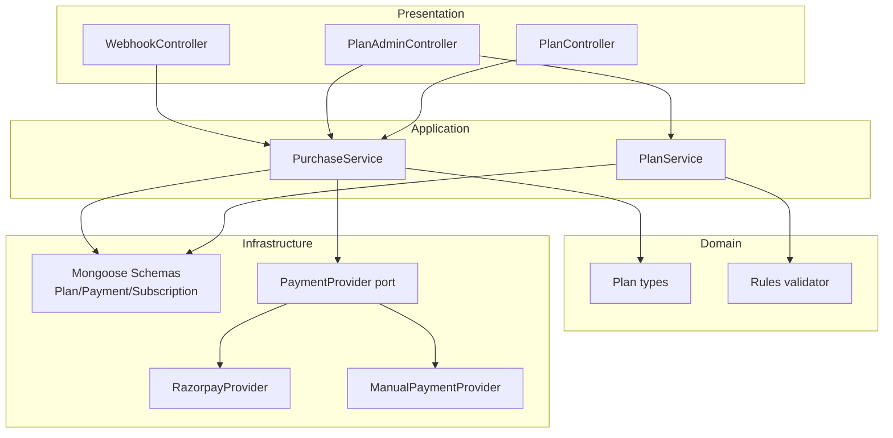
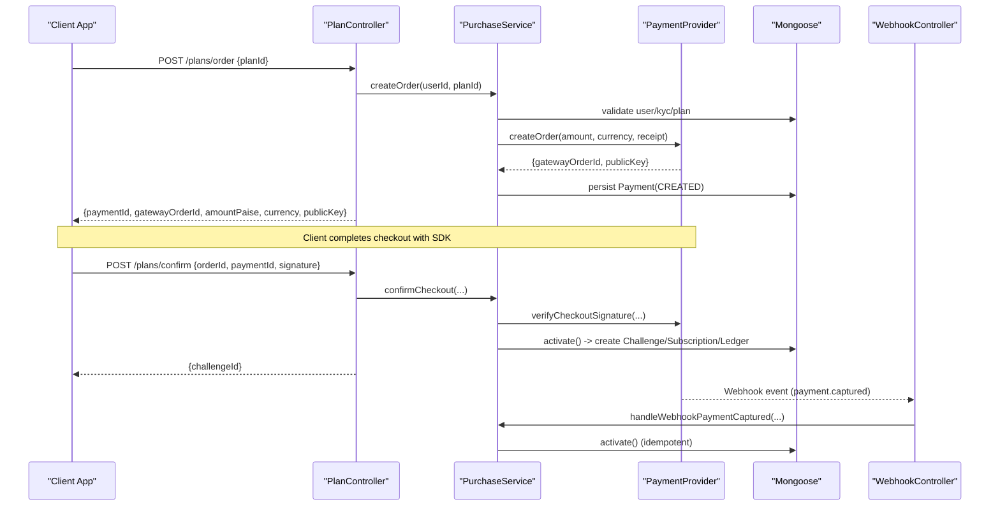
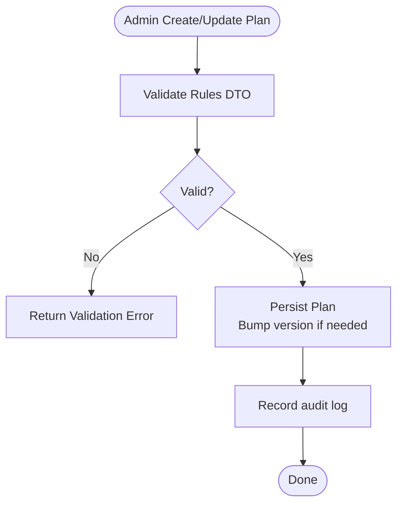
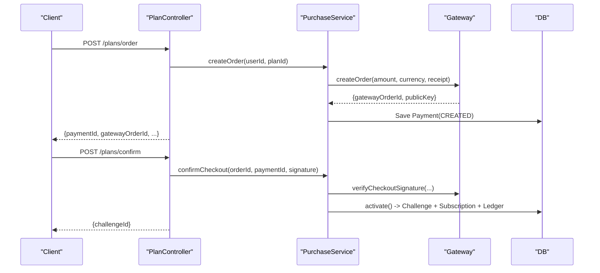
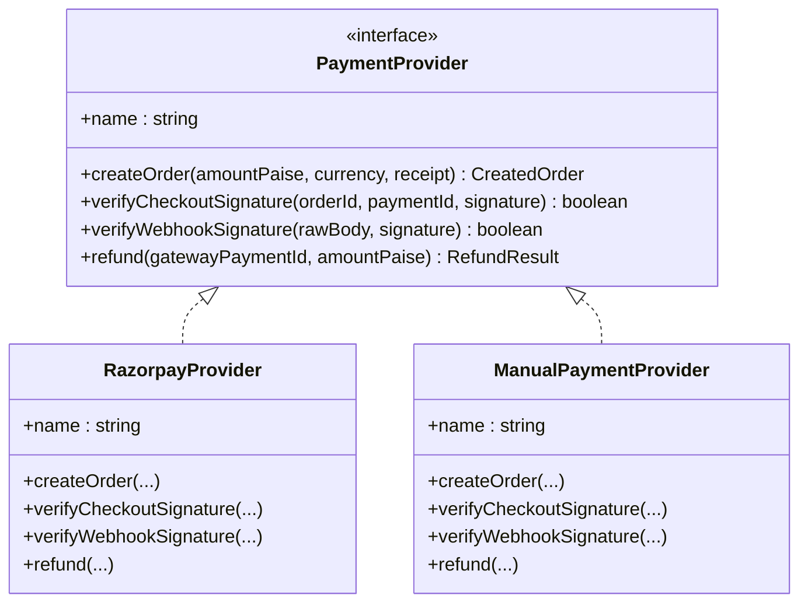
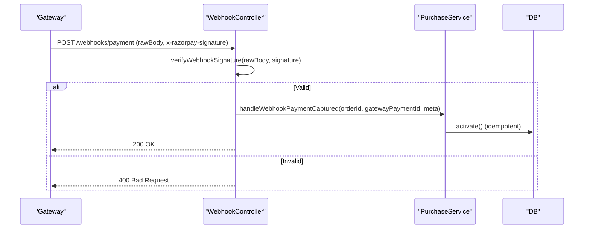
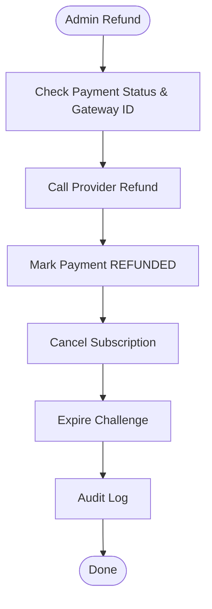
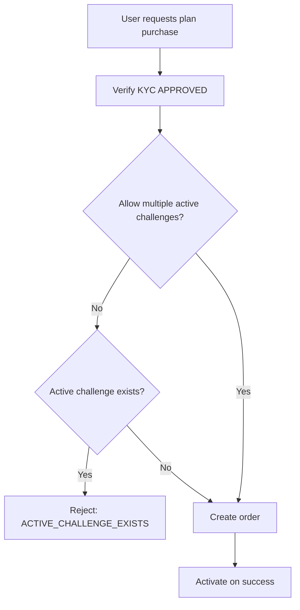
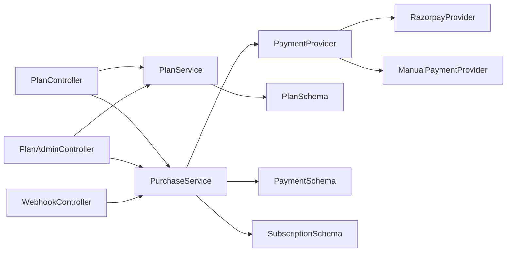

# Plans & Payments

<cite>
**Referenced Files in This Document**
- [plans.module.ts](file://backend/apps/api/src/modules/plans/plans.module.ts)
- [plan.service.ts](file://backend/apps/api/src/modules/plans/application/plan.service.ts)
- [purchase.service.ts](file://backend/apps/api/src/modules/plans/application/purchase.service.ts)
- [plan.types.ts](file://backend/apps/api/src/modules/plans/domain/plan.types.ts)
- [plan-rules.vo.ts](file://backend/apps/api/src/modules/plans/domain/plan-rules.vo.ts)
- [payment.port.ts](file://backend/apps/api/src/modules/plans/infrastructure/payment/payment.port.ts)
- [razorpay.provider.ts](file://backend/apps/api/src/modules/plans/infrastructure/payment/razorpay.provider.ts)
- [manual.provider.ts](file://backend/apps/api/src/modules/plans/infrastructure/payment/manual.provider.ts)
- [webhook.controller.ts](file://backend/apps/api/src/modules/plans/presentation/webhook.controller.ts)
- [plan.controller.ts](file://backend/apps/api/src/modules/plans/presentation/plan.controller.ts)
- [plan-admin.controller.ts](file://backend/apps/api/src/modules/plans/presentation/plan-admin.controller.ts)
- [plan.dtos.ts](file://backend/apps/api/src/modules/plans/presentation/dto/plan.dtos.ts)
- [plan.schema.ts](file://backend/apps/api/src/modules/plans/infrastructure/schemas/plan.schema.ts)
- [payment.schema.ts](file://backend/apps/api/src/modules/plans/infrastructure/schemas/payment.schema.ts)
- [subscription.schema.ts](file://backend/apps/api/src/modules/plans/infrastructure/schemas/subscription.schema.ts)
</cite>

## Table of Contents
1. Introduction
2. Project Structure
3. Core Components
4. Architecture Overview
5. Detailed Component Analysis
6. Dependency Analysis
7. Performance Considerations
8. Troubleshooting Guide
9. Conclusion
10. Appendices

## Introduction
This document explains the Plans & Payments module that powers subscription management, payment processing with Razorpay integration, manual payment approval workflow, and webhook handling. It covers plan rules validation, purchase lifecycle, subscription activation, payment provider abstraction, signature verification, transaction reconciliation, configuration for different payment methods, refund handling, billing cycles, integration with user plans, feature gating based on subscriptions, and revenue reporting surfaces.

## Project Structure
The module is organized by domain-driven layers:
- Presentation: REST controllers for users, admins, and webhooks
- Application: Services orchestrating purchases, plan management, and activation
- Domain: Types and value objects (rules validation)
- Infrastructure: Mongoose schemas and payment gateway adapters
- Module wiring: Dependency injection and provider selection

**Diagram sources**
- [plans.module.ts:21-44](file://backend/apps/api/src/modules/plans/plans.module.ts#L21-L44)
- [plan.controller.ts:25-63](file://backend/apps/api/src/modules/plans/presentation/plan.controller.ts#L25-L63)
- [plan-admin.controller.ts:25-65](file://backend/apps/api/src/modules/plans/presentation/plan-admin.controller.ts#L25-L65)
- [webhook.controller.ts:13-46](file://backend/apps/api/src/modules/plans/presentation/webhook.controller.ts#L13-L46)
- [plan.service.ts:37-143](file://backend/apps/api/src/modules/plans/application/plan.service.ts#L37-L143)
- [purchase.service.ts:18-248](file://backend/apps/api/src/modules/plans/application/purchase.service.ts#L18-L248)
- [payment.port.ts:20-32](file://backend/apps/api/src/modules/plans/infrastructure/payment/payment.port.ts#L20-L32)
- [razorpay.provider.ts:11-52](file://backend/apps/api/src/modules/plans/infrastructure/payment/razorpay.provider.ts#L11-L52)
- [manual.provider.ts:10-31](file://backend/apps/api/src/modules/plans/infrastructure/payment/manual.provider.ts#L10-L31)

**Section sources**
- [plans.module.ts:21-44](file://backend/apps/api/src/modules/plans/plans.module.ts#L21-L44)

## Core Components
- PlanService: Admin-facing plan CRUD, public catalog listing, status changes, and rule validation during create/update.
- PurchaseService: End-to-end purchase flow: order creation, checkout confirmation, webhook handling, idempotent activation, subscription creation, ledger crediting, refunds, and queries.
- Payment Provider Abstraction: Pluggable providers (Razorpay or Manual) via a port interface; selected at runtime from configuration.
- WebhookController: Verifies incoming webhook signatures and delegates to PurchaseService for captured payments.
- Data Models: Plan, Payment, Subscription schemas define persistence structures and indexes.

Key responsibilities:
- Plan rules validation ensures safe, bounded challenge parameters.
- Purchase lifecycle enforces KYC, active plan checks, and single active challenge policy.
- Activation creates a Challenge, Subscription, and Ledger entry atomically under a lock.
- Refunds reverse financial state and cancel related subscription/challenge.

**Section sources**
- [plan.service.ts:43-143](file://backend/apps/api/src/modules/plans/application/plan.service.ts#L43-L143)
- [purchase.service.ts:36-248](file://backend/apps/api/src/modules/plans/application/purchase.service.ts#L36-L248)
- [payment.port.ts:20-32](file://backend/apps/api/src/modules/plans/infrastructure/payment/payment.port.ts#L20-L32)
- [webhook.controller.ts:22-46](file://backend/apps/api/src/modules/plans/presentation/webhook.controller.ts#L22-L46)
- [plan.schema.ts:18-49](file://backend/apps/api/src/modules/plans/infrastructure/schemas/plan.schema.ts#L18-L49)
- [payment.schema.ts:5-56](file://backend/apps/api/src/modules/plans/infrastructure/schemas/payment.schema.ts#L5-L56)
- [subscription.schema.ts:5-27](file://backend/apps/api/src/modules/plans/infrastructure/schemas/subscription.schema.ts#L5-L27)

## Architecture Overview
The system uses a layered architecture with a clear separation between presentation, application logic, domain rules, and infrastructure integrations. The payment provider is abstracted behind an interface so switching gateways requires only adapter changes.

**Diagram sources**
- [plan.controller.ts:39-50](file://backend/apps/api/src/modules/plans/presentation/plan.controller.ts#L39-L50)
- [purchase.service.ts:36-183](file://backend/apps/api/src/modules/plans/application/purchase.service.ts#L36-L183)
- [razorpay.provider.ts:27-40](file://backend/apps/api/src/modules/plans/infrastructure/payment/razorpay.provider.ts#L27-L40)
- [webhook.controller.ts:22-46](file://backend/apps/api/src/modules/plans/presentation/webhook.controller.ts#L22-L46)

## Detailed Component Analysis

### Plan Management
- Public catalog lists only active plans sorted by display order.
- Admin endpoints allow creating, updating, and setting plan status.
- Rule validation enforces numeric bounds, consistency (e.g., daily drawdown ≤ max drawdown), allowed segments, and integer ranges for days.
- Versioning bumps when economics or rules change; existing challenges remain unaffected due to snapshotting.

**Diagram sources**
- [plan.service.ts:60-129](file://backend/apps/api/src/modules/plans/application/plan.service.ts#L60-L129)
- [plan-rules.vo.ts:5-59](file://backend/apps/api/src/modules/plans/domain/plan-rules.vo.ts#L5-L59)
- [plan.dtos.ts:6-38](file://backend/apps/api/src/modules/plans/presentation/dto/plan.dtos.ts#L6-L38)

**Section sources**
- [plan.service.ts:43-143](file://backend/apps/api/src/modules/plans/application/plan.service.ts#L43-L143)
- [plan-rules.vo.ts:5-59](file://backend/apps/api/src/modules/plans/domain/plan-rules.vo.ts#L5-L59)
- [plan.dtos.ts:6-38](file://backend/apps/api/src/modules/plans/presentation/dto/plan.dtos.ts#L6-L38)

### Purchase Lifecycle and Subscription Activation
- Order creation validates KYC, plan availability, and optional single-active-challenge policy.
- Creates a gateway order via the configured provider and persists a Payment intent.
- Checkout confirmation verifies client-side signature and activates.
- Webhook path verifies server-side signature and activates.
- Activation is idempotent using Redis locks and unique idempotency keys; it creates a Challenge (with snapshotted rules), a Subscription, and credits virtual capital via a Ledger entry.

**Diagram sources**
- [plan.controller.ts:39-50](file://backend/apps/api/src/modules/plans/presentation/plan.controller.ts#L39-L50)
- [purchase.service.ts:36-183](file://backend/apps/api/src/modules/plans/application/purchase.service.ts#L36-L183)
- [razorpay.provider.ts:27-35](file://backend/apps/api/src/modules/plans/infrastructure/payment/razorpay.provider.ts#L27-L35)

**Section sources**
- [purchase.service.ts:36-183](file://backend/apps/api/src/modules/plans/application/purchase.service.ts#L36-L183)

### Payment Provider Abstraction and Signature Verification
- PaymentProvider defines createOrder, verifyCheckoutSignature, verifyWebhookSignature, and refund.
- RazorpayProvider implements HMAC-SHA256 verification for both checkout callbacks and webhooks using secrets from configuration.
- ManualPaymentProvider provides a dev/test mode where signatures always pass and synthetic IDs are used.
- Provider selection is injected via configuration at module bootstrap.

**Diagram sources**
- [payment.port.ts:20-32](file://backend/apps/api/src/modules/plans/infrastructure/payment/payment.port.ts#L20-L32)
- [razorpay.provider.ts:11-52](file://backend/apps/api/src/modules/plans/infrastructure/payment/razorpay.provider.ts#L11-L52)
- [manual.provider.ts:10-31](file://backend/apps/api/src/modules/plans/infrastructure/payment/manual.provider.ts#L10-L31)
- [plans.module.ts:35-43](file://backend/apps/api/src/modules/plans/plans.module.ts#L35-L43)

**Section sources**
- [payment.port.ts:20-32](file://backend/apps/api/src/modules/plans/infrastructure/payment/payment.port.ts#L20-L32)
- [razorpay.provider.ts:20-52](file://backend/apps/api/src/modules/plans/infrastructure/payment/razorpay.provider.ts#L20-L52)
- [manual.provider.ts:10-31](file://backend/apps/api/src/modules/plans/infrastructure/payment/manual.provider.ts#L10-L31)
- [plans.module.ts:35-43](file://backend/apps/api/src/modules/plans/plans.module.ts#L35-L43)

### Webhook Handling and Reconciliation
- WebhookController reads raw body and signature header, verifies via provider, and dispatches to PurchaseService for captured events.
- PurchaseService.activate is idempotent; concurrent webhooks or polling will not double-credit.
- Payment records store gateway identifiers and last webhook metadata for reconciliation.

**Diagram sources**
- [webhook.controller.ts:22-46](file://backend/apps/api/src/modules/plans/presentation/webhook.controller.ts#L22-L46)
- [purchase.service.ts:92-183](file://backend/apps/api/src/modules/plans/application/purchase.service.ts#L92-L183)
- [razorpay.provider.ts:37-40](file://backend/apps/api/src/modules/plans/infrastructure/payment/razorpay.provider.ts#L37-L40)

**Section sources**
- [webhook.controller.ts:22-46](file://backend/apps/api/src/modules/plans/presentation/webhook.controller.ts#L22-L46)
- [purchase.service.ts:92-183](file://backend/apps/api/src/modules/plans/application/purchase.service.ts#L92-L183)

### Refund Handling and Billing Cycles
- Refund endpoint validates payment state, calls provider refund, marks payment REFUNDED, cancels subscription, and expires challenge.
- Billing cycle is derived from plan rules.expiryDays at activation time; subscription.expiresAt is set accordingly.

**Diagram sources**
- [purchase.service.ts:212-246](file://backend/apps/api/src/modules/plans/application/purchase.service.ts#L212-L246)
- [plan.schema.ts:37-45](file://backend/apps/api/src/modules/plans/infrastructure/schemas/plan.schema.ts#L37-L45)
- [subscription.schema.ts:19-26](file://backend/apps/api/src/modules/plans/infrastructure/schemas/subscription.schema.ts#L19-L26)

**Section sources**
- [purchase.service.ts:212-246](file://backend/apps/api/src/modules/plans/application/purchase.service.ts#L212-L246)

### Integration with User Plans and Feature Gating
- Purchase flow enforces KYC approval before allowing plan purchase.
- Optional configuration prevents multiple active challenges per user.
- Active subscription and challenge data are exposed for clients to gate features (e.g., access to trading terminals).

**Diagram sources**
- [purchase.service.ts:40-59](file://backend/apps/api/src/modules/plans/application/purchase.service.ts#L40-L59)

**Section sources**
- [purchase.service.ts:40-59](file://backend/apps/api/src/modules/plans/application/purchase.service.ts#L40-L59)

### Revenue Reporting Surfaces
- Admin can list payments with optional status filter and pagination.
- Payment records include amount, currency, status, provider, and timestamps for reporting.

**Section sources**
- [purchase.service.ts:203-210](file://backend/apps/api/src/modules/plans/application/purchase.service.ts#L203-L210)
- [plan-admin.controller.ts:54-58](file://backend/apps/api/src/modules/plans/presentation/plan-admin.controller.ts#L54-L58)
- [payment.schema.ts:5-56](file://backend/apps/api/src/modules/plans/infrastructure/schemas/payment.schema.ts#L5-L56)

## Dependency Analysis
- Controllers depend on services; services depend on domain validators and infrastructure.
- PaymentProvider is injected via a symbol and resolved at runtime based on configuration.
- Schemas define persistence contracts; services use Mongoose models directly.

**Diagram sources**
- [plans.module.ts:21-44](file://backend/apps/api/src/modules/plans/plans.module.ts#L21-L44)
- [plan.controller.ts:25-63](file://backend/apps/api/src/modules/plans/presentation/plan.controller.ts#L25-L63)
- [plan-admin.controller.ts:25-65](file://backend/apps/api/src/modules/plans/presentation/plan-admin.controller.ts#L25-L65)
- [webhook.controller.ts:13-46](file://backend/apps/api/src/modules/plans/presentation/webhook.controller.ts#L13-L46)
- [purchase.service.ts:18-34](file://backend/apps/api/src/modules/plans/application/purchase.service.ts#L18-L34)
- [payment.port.ts:20-32](file://backend/apps/api/src/modules/plans/infrastructure/payment/payment.port.ts#L20-L32)

**Section sources**
- [plans.module.ts:21-44](file://backend/apps/api/src/modules/plans/plans.module.ts#L21-L44)

## Performance Considerations
- Idempotent activation protected by Redis locks avoids duplicate credits under concurrency.
- Unique idempotency key on Payment ensures exactly-once semantics even with retries.
- Efficient queries with lean operations and appropriate indexes on Payment and Subscription improve admin listing performance.
- Throttling on order creation protects against abuse.

[No sources needed since this section provides general guidance]

## Troubleshooting Guide
Common issues and resolutions:
- Invalid webhook signature: Ensure raw body is preserved and signature header matches provider secret.
- Duplicate activation: Verify idempotency key uniqueness and Redis lock usage; check for concurrent webhook/poller calls.
- KYC required: Confirm user KYC status before attempting purchase.
- Active challenge conflict: If multiple active challenges are disallowed, ensure no pending/active challenge exists.
- Non-refundable payment: Only CAPTURED or ACTIVATED payments can be refunded; ensure gateway payment ID exists.

**Section sources**
- [webhook.controller.ts:28-32](file://backend/apps/api/src/modules/plans/presentation/webhook.controller.ts#L28-L32)
- [purchase.service.ts:110-119](file://backend/apps/api/src/modules/plans/application/purchase.service.ts#L110-L119)
- [purchase.service.ts:40-59](file://backend/apps/api/src/modules/plans/application/purchase.service.ts#L40-L59)
- [purchase.service.ts:212-221](file://backend/apps/api/src/modules/plans/application/purchase.service.ts#L212-L221)

## Conclusion
The Plans & Payments module provides a robust, extensible foundation for subscription-based offerings. It separates concerns across layers, abstracts payment providers, enforces strict validation and idempotency, and exposes administrative controls for plan management, refunds, and reporting. With clear activation flows, secure webhook handling, and comprehensive schemas, it supports reliable billing cycles and feature gating tied to active subscriptions.

[No sources needed since this section summarizes without analyzing specific files]

## Appendices

### API Reference Summary
- GET /plans: List public active plans
- GET /plans/:id: Get plan detail
- POST /plans/order: Create payment order (authenticated)
- POST /plans/confirm: Confirm checkout and activate (authenticated)
- GET /plans/me/subscription: Current subscription info (authenticated)
- GET /plans/me/payments: User payment history (authenticated)
- GET /admin/plans: List all plans (admin)
- POST /admin/plans: Create plan (admin)
- PATCH /admin/plans/:id: Update plan (admin)
- PUT /admin/plans/:id/status: Set plan status (admin)
- GET /admin/payments: List payments with filters (admin)
- POST /admin/payments/:id/refund: Refund payment (admin)
- POST /webhooks/payment: Gateway webhook endpoint

**Section sources**
- [plan.controller.ts:29-61](file://backend/apps/api/src/modules/plans/presentation/plan.controller.ts#L29-L61)
- [plan-admin.controller.ts:30-64](file://backend/apps/api/src/modules/plans/presentation/plan-admin.controller.ts#L30-L64)
- [webhook.controller.ts:22-46](file://backend/apps/api/src/modules/plans/presentation/webhook.controller.ts#L22-L46)

### Configuration Notes
- PAYMENT_PROVIDER selects between Razorpay and Manual providers.
- Razorpay requires RAZORPAY_KEY_ID, RAZORPAY_KEY_SECRET, and RAZORPAY_WEBHOOK_SECRET.
- plan.allowMultipleActiveChallenge toggles whether users can hold multiple active challenges simultaneously.

**Section sources**
- [plans.module.ts:38-43](file://backend/apps/api/src/modules/plans/plans.module.ts#L38-L43)
- [razorpay.provider.ts:20-24](file://backend/apps/api/src/modules/plans/infrastructure/payment/razorpay.provider.ts#L20-L24)
- [purchase.service.ts:51-59](file://backend/apps/api/src/modules/plans/application/purchase.service.ts#L51-L59)