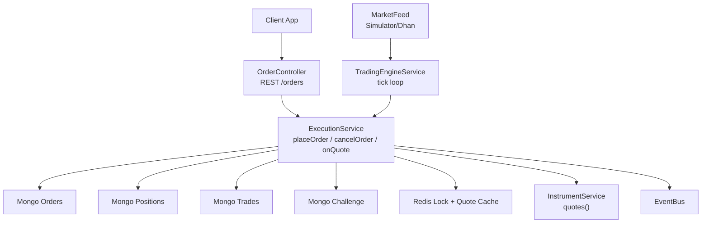
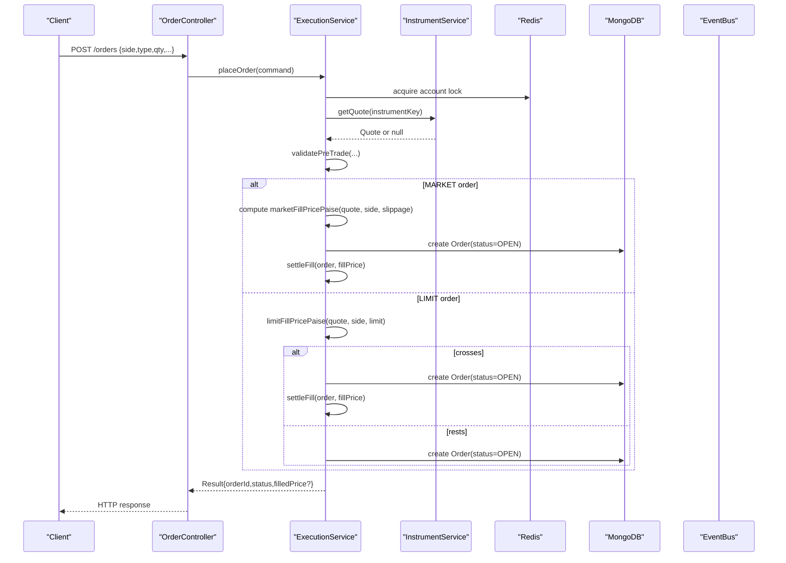
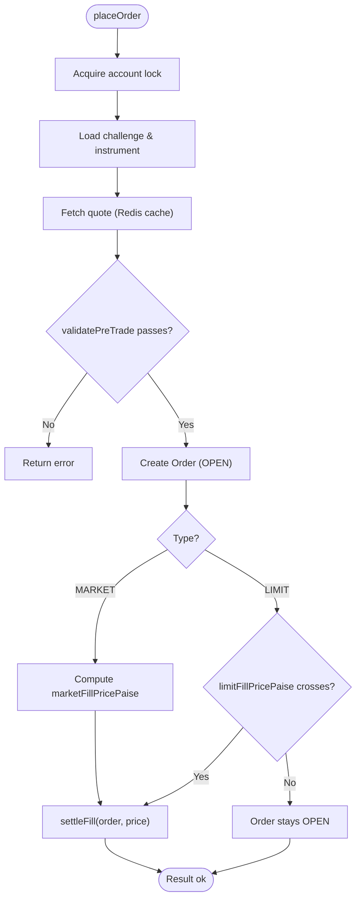
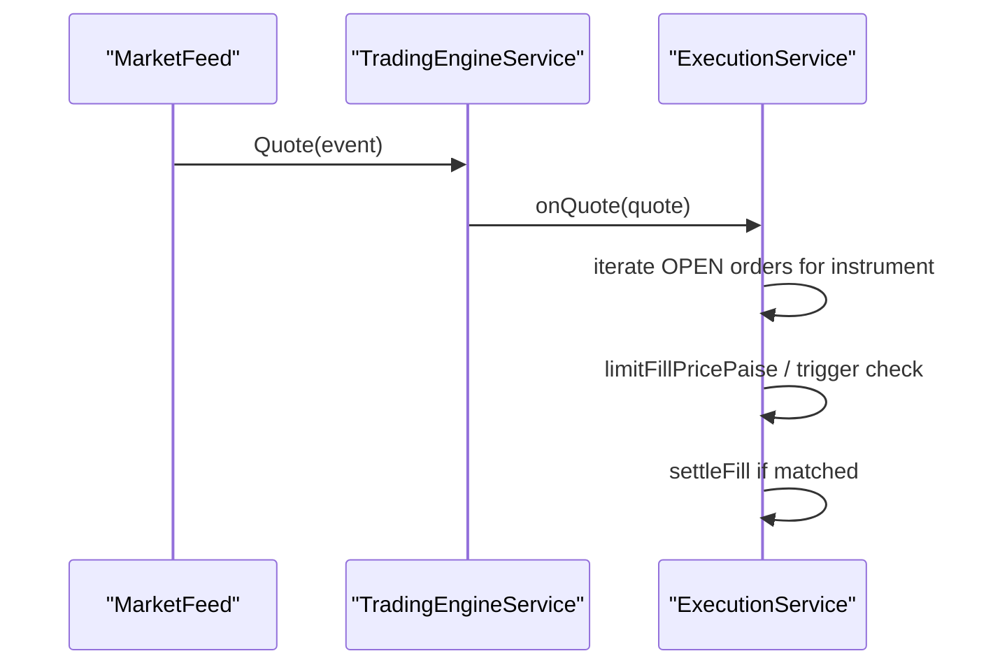
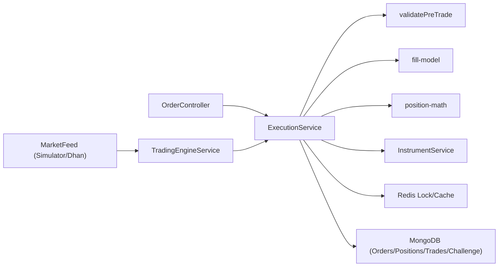

# Order Execution Engine

<cite>
**Referenced Files in This Document**
- [execution.service.ts](file://backend/apps/api/src/modules/trading/application/execution.service.ts)
- [trading-engine.service.ts](file://backend/apps/api/src/modules/trading/application/trading-engine.service.ts)
- [order.types.ts](file://backend/apps/api/src/modules/trading/domain/order.types.ts)
- [pre-trade.ts](file://backend/apps/api/src/modules/trading/domain/pre-trade.ts)
- [fill-model.ts](file://backend/apps/api/src/modules/trading/domain/fill-model.ts)
- [position-math.ts](file://backend/apps/api/src/modules/trading/domain/position-math.ts)
- [order.controller.ts](file://backend/apps/api/src/modules/trading/presentation/order.controller.ts)
- [order.schema.ts](file://backend/apps/api/src/modules/trading/infrastructure/schemas/order.schema.ts)
- [portfolio.service.ts](file://backend/apps/api/src/modules/trading/application/portfolio.service.ts)
- [instrument.service.ts](file://backend/apps/api/src/modules/market/application/instrument.service.ts)
- [simulator-feed.ts](file://backend/apps/api/src/modules/market/infrastructure/feed/simulator-feed.ts)
- [dhan-feed.ts](file://backend/apps/api/src/modules/market/infrastructure/feed/dhan-feed.ts)
</cite>

## Table of Contents
1. Introduction
2. Project Structure
3. Core Components
4. Architecture Overview
5. Detailed Component Analysis
6. Dependency Analysis
7. Performance Considerations
8. Troubleshooting Guide
9. Conclusion

## Introduction
This document explains the Order Execution Engine that powers order placement, validation, routing, execution simulation, and lifecycle management from placement to fill. It covers supported order types (market and limit), stop-loss/target triggers, order states, order book management, pre-trade checks, risk validations, matching logic, partial fills, cancellation, and integration with market data feeds for live trading scenarios.

## Project Structure
The engine is implemented as a NestJS module split across domain, application, infrastructure, and presentation layers:
- Presentation: REST endpoints for placing/canceling orders and reading the order book.
- Application: ExecutionService orchestrates placement, matching, settlement, and square-off; TradingEngineService drives the tick loop and subscriptions.
- Domain: Pure models for order types, pre-trade rules, fill pricing, and position math.
- Infrastructure: Mongoose schemas for orders, positions, holdings, trades; market feed implementations for simulator and broker WebSocket feeds.

**Diagram sources**
- [order.controller.ts:23-46](file://backend/apps/api/src/modules/trading/presentation/order.controller.ts#L23-L46)
- [execution.service.ts:66-177](file://backend/apps/api/src/modules/trading/application/execution.service.ts#L66-L177)
- [trading-engine.service.ts:30-65](file://backend/apps/api/src/modules/trading/application/trading-engine.service.ts#L30-L65)
- [instrument.service.ts:151-183](file://backend/apps/api/src/modules/market/application/instrument.service.ts#L151-L183)
- [simulator-feed.ts:40-98](file://backend/apps/api/src/modules/market/infrastructure/feed/simulator-feed.ts#L40-L98)
- [dhan-feed.ts:60-140](file://backend/apps/api/src/modules/market/infrastructure/feed/dhan-feed.ts#L60-L140)

**Section sources**
- [order.controller.ts:23-46](file://backend/apps/api/src/modules/trading/presentation/order.controller.ts#L23-L46)
- [execution.service.ts:66-177](file://backend/apps/api/src/modules/trading/application/execution.service.ts#L66-L177)
- [trading-engine.service.ts:30-65](file://backend/apps/api/src/modules/trading/application/trading-engine.service.ts#L30-L65)

## Core Components
- ExecutionService: Central coordinator for order placement, immediate fills, limit resting, trigger firing, settlement, equity updates, and square-off.
- TradingEngineService: Subscribes to quote channels for instruments with open orders and invokes ExecutionService.onQuote per tick; schedules intraday square-off.
- Pre-trade validation: Enforces challenge state, market hours, instrument availability, segment permissions, lot size, freeze quantity, limit price validity, trigger price sanity, and capital sufficiency.
- Fill model: Computes simulated fill prices for market orders with slippage and determines if limit orders cross to fill.
- Position math: Applies fills to signed positions using weighted-average cost and computes realized/unrealized P&L.
- Market data: InstrumentService provides quotes via Redis cache and broker history fallbacks; feeds provide live ticks.

**Section sources**
- [execution.service.ts:66-177](file://backend/apps/api/src/modules/trading/application/execution.service.ts#L66-L177)
- [trading-engine.service.ts:30-65](file://backend/apps/api/src/modules/trading/application/trading-engine.service.ts#L30-L65)
- [pre-trade.ts:29-78](file://backend/apps/api/src/modules/trading/domain/pre-trade.ts#L29-L78)
- [fill-model.ts:9-40](file://backend/apps/api/src/modules/trading/domain/fill-model.ts#L9-L40)
- [position-math.ts:22-72](file://backend/apps/api/src/modules/trading/domain/position-math.ts#L22-L72)
- [instrument.service.ts:151-183](file://backend/apps/api/src/modules/market/application/instrument.service.ts#L151-L183)

## Architecture Overview
The engine uses a virtual execution engine (VEE) pattern: all mutations run under per-account Redis locks to ensure race-free equity and drawdown calculations. The REST layer accepts orders, validates them, and either immediately settles or rests them. A background engine subscribes to quote events and processes open orders each tick.

**Diagram sources**
- [order.controller.ts:28-36](file://backend/apps/api/src/modules/trading/presentation/order.controller.ts#L28-L36)
- [execution.service.ts:68-129](file://backend/apps/api/src/modules/trading/application/execution.service.ts#L68-L129)
- [instrument.service.ts:151-183](file://backend/apps/api/src/modules/market/application/instrument.service.ts#L151-L183)

## Detailed Component Analysis

### Order Lifecycle: Placement to Fill
- Placement:
  - REST endpoint receives PlaceOrderDto and maps to PlaceOrderCommand.
  - ExecutionService acquires an account-level Redis lock.
  - Loads challenge and instrument; fetches current quote via InstrumentService (Redis cached).
  - Runs validatePreTrade to enforce business rules and risk limits.
  - Creates Order document with status OPEN.
  - For MARKET orders: computes fill price with slippage and settles immediately.
  - For LIMIT orders: attempts immediate fill; if not crossed, order remains OPEN.
- Tick-driven matching:
  - TradingEngineService refreshes subscriptions to quote channels for instruments with OPEN orders.
  - On each quote, ExecutionService.onQuote iterates OPEN orders for that instrument:
    - LIMIT: attempt limitFillPricePaise; if true, settle.
    - Stop-loss/Target: check trigger conditions against LTP; if fired, settle as MARKET with slippage.
- Settlement:
  - Updates positions (weighted average cost), holdings (for carry-forward), and creates Trade records.
  - Marks order FILLED, records filled price and charges.
  - Updates challenge equity, peak equity, trading days, and publishes equity update event.

**Diagram sources**
- [execution.service.ts:68-129](file://backend/apps/api/src/modules/trading/application/execution.service.ts#L68-L129)
- [execution.service.ts:181-262](file://backend/apps/api/src/modules/trading/application/execution.service.ts#L181-L262)

**Section sources**
- [order.controller.ts:28-41](file://backend/apps/api/src/modules/trading/presentation/order.controller.ts#L28-L41)
- [execution.service.ts:68-177](file://backend/apps/api/src/modules/trading/application/execution.service.ts#L68-L177)
- [execution.service.ts:181-262](file://backend/apps/api/src/modules/trading/application/execution.service.ts#L181-L262)

### Supported Order Types and Triggers
- Order types:
  - MARKET: Immediate fill at simulated market price with configurable slippage.
  - LIMIT: Resting order that fills when bid/ask crosses the limit price.
- Product types:
  - INTRADAY: Flattened at segment cutoff by scheduler.
  - CARRY_FORWARD: Mirrored into holdings for overnight display.
- Triggers:
  - STOP_LOSS: Fires when LTP breaches trigger threshold based on side.
  - TARGET: Fires when LTP reaches target threshold based on side.
- Order states:
  - OPEN, FILLED, CANCELLED, REJECTED.

**Section sources**
- [order.types.ts:1-31](file://backend/apps/api/src/modules/trading/domain/order.types.ts#L1-L31)
- [execution.service.ts:107-177](file://backend/apps/api/src/modules/trading/application/execution.service.ts#L107-L177)

### Pre-Trade Checks and Risk Validations
Checks enforced before order acceptance:
- Challenge must be tradable (PENDING/ACTIVE).
- Market must be open for the instrument’s segment.
- Instrument must be enabled and allowed by plan segments.
- Quantity must be a multiple of lot size and within freeze limits.
- LIMIT orders require a positive limit price.
- Trigger price must be positive.
- Estimated cost must not exceed available equity (capital sufficiency).

These checks are pure and deterministic, enabling robust unit testing and consistent rejection reasons.

**Section sources**
- [pre-trade.ts:29-78](file://backend/apps/api/src/modules/trading/domain/pre-trade.ts#L29-L78)

### Matching Algorithms and Partial Fills
- Market fill price:
  - BUY: ask + slippage; SELL: bid - slippage. Slippage is configured in basis points.
- Limit fill condition:
  - BUY fills when ask ≤ limit; SELL fills when bid ≥ limit. Fill price equals the limit price (no price improvement modeled).
- Partial fills:
  - Not explicitly modeled in this implementation; orders are created with full qty and settled fully upon crossing. If needed, extend order schema and matching to support partial quantities.

**Section sources**
- [fill-model.ts:9-40](file://backend/apps/api/src/modules/trading/domain/fill-model.ts#L9-L40)
- [execution.service.ts:107-129](file://backend/apps/api/src/modules/trading/application/execution.service.ts#L107-L129)

### Order Cancellation Logic
- Only OPEN orders can be cancelled.
- Cancellation runs under the same account lock to avoid races with fills.
- Status transitions to CANCELLED and persists immediately.

**Section sources**
- [execution.service.ts:132-144](file://backend/apps/api/src/modules/trading/application/execution.service.ts#L132-L144)

### Order Book Management
- Open orders: retrieved sorted by most recent placement time.
- Executed/cancelled/rejected orders: fetched with a limit for recent history.
- Portfolio view includes positions with mark-to-market and unrealized P&L, plus equity metrics.

**Section sources**
- [portfolio.service.ts:34-67](file://backend/apps/api/src/modules/trading/application/portfolio.service.ts#L34-L67)
- [order.schema.ts:67-71](file://backend/apps/api/src/modules/trading/infrastructure/schemas/order.schema.ts#L67-L71)

### Square-Off and Force Flatten
- Intraday square-off:
  - Scheduled per minute; flattens all INTRADAY positions at segment cutoff using MARKET orders with slippage.
- Force flatten:
  - Used by challenge evaluator on FAIL/PASS to close all net positions at market price.

**Section sources**
- [execution.service.ts:269-307](file://backend/apps/api/src/modules/trading/application/execution.service.ts#L269-L307)
- [trading-engine.service.ts:49-65](file://backend/apps/api/src/modules/trading/application/trading-engine.service.ts#L49-L65)

### Integration with Market Data Feeds
- InstrumentService.quotes:
  - Returns quotes from Redis cache; falls back to last known close or historical data if stale/missing.
- Feeds:
  - SimulatorFeed: deterministic synthetic quotes for dev/testing; supports pushTick for replay tests.
  - DhanFeed: WebSocket-based live feed with reconnect/backoff; maps canonical instrument keys to exchange segment and security ID; emits Quote events.
- Engine subscription:
  - TradingEngineService subscribes to quote channels for instruments with OPEN orders and routes ticks to ExecutionService.onQuote.

**Diagram sources**
- [trading-engine.service.ts:39-46](file://backend/apps/api/src/modules/trading/application/trading-engine.service.ts#L39-L46)
- [execution.service.ts:148-177](file://backend/apps/api/src/modules/trading/application/execution.service.ts#L148-L177)
- [simulator-feed.ts:40-98](file://backend/apps/api/src/modules/market/infrastructure/feed/simulator-feed.ts#L40-L98)
- [dhan-feed.ts:60-140](file://backend/apps/api/src/modules/market/infrastructure/feed/dhan-feed.ts#L60-L140)

**Section sources**
- [instrument.service.ts:151-183](file://backend/apps/api/src/modules/market/application/instrument.service.ts#L151-L183)
- [simulator-feed.ts:40-98](file://backend/apps/api/src/modules/market/infrastructure/feed/simulator-feed.ts#L40-L98)
- [dhan-feed.ts:60-140](file://backend/apps/api/src/modules/market/infrastructure/feed/dhan-feed.ts#L60-L140)
- [trading-engine.service.ts:39-46](file://backend/apps/api/src/modules/trading/application/trading-engine.service.ts#L39-L46)

### Position Accounting and P&L
- applyFill:
  - Handles opening, adding to, reducing, closing, and flipping positions using weighted-average cost.
  - Computes realized P&L delta on closed quantities.
- Unrealized P&L:
  - Computed from mark price vs. average price times net quantity.

**Section sources**
- [position-math.ts:22-72](file://backend/apps/api/src/modules/trading/domain/position-math.ts#L22-L72)
- [portfolio.service.ts:43-67](file://backend/apps/api/src/modules/trading/application/portfolio.service.ts#L43-L67)

## Dependency Analysis

**Diagram sources**
- [order.controller.ts:23-46](file://backend/apps/api/src/modules/trading/presentation/order.controller.ts#L23-L46)
- [execution.service.ts:66-177](file://backend/apps/api/src/modules/trading/application/execution.service.ts#L66-L177)
- [pre-trade.ts:29-78](file://backend/apps/api/src/modules/trading/domain/pre-trade.ts#L29-L78)
- [fill-model.ts:9-40](file://backend/apps/api/src/modules/trading/domain/fill-model.ts#L9-L40)
- [position-math.ts:22-72](file://backend/apps/api/src/modules/trading/domain/position-math.ts#L22-L72)
- [instrument.service.ts:151-183](file://backend/apps/api/src/modules/market/application/instrument.service.ts#L151-L183)
- [trading-engine.service.ts:30-65](file://backend/apps/api/src/modules/trading/application/trading-engine.service.ts#L30-L65)
- [simulator-feed.ts:40-98](file://backend/apps/api/src/modules/market/infrastructure/feed/simulator-feed.ts#L40-L98)
- [dhan-feed.ts:60-140](file://backend/apps/api/src/modules/market/infrastructure/feed/dhan-feed.ts#L60-L140)

**Section sources**
- [execution.service.ts:66-177](file://backend/apps/api/src/modules/trading/application/execution.service.ts#L66-L177)
- [trading-engine.service.ts:30-65](file://backend/apps/api/src/modules/trading/application/trading-engine.service.ts#L30-L65)

## Performance Considerations
- Per-account locking ensures correctness but serializes mutations per challenge; keep critical sections minimal.
- Quote caching via Redis reduces database load; stale quote detection prevents bad fills.
- Batch operations where possible (e.g., square-off loops) and handle errors gracefully to avoid blocking the engine.
- Avoid unnecessary reads inside tight loops; prefer lean queries and selective projections.

[No sources needed since this section provides general guidance]

## Troubleshooting Guide
Common issues and resolutions:
- NO_MARKET_DATA:
  - Occurs when placing a MARKET order without a live quote. Ensure feed is running and quotes are being published to Redis.
- CHALLENGE_NOT_TRADABLE / MARKET_CLOSED / INSTRUMENT_DISABLED / SEGMENT_NOT_ALLOWED:
  - Pre-trade validation rejects orders outside allowed states/hours/instruments/segments. Verify challenge status, market calendar, instrument flags, and plan rules.
- INSUFFICIENT_CAPITAL:
  - Estimated cost exceeds available equity. Reduce order size or increase equity.
- FREEZE_QTY_EXCEEDED:
  - Order quantity exceeds instrument freeze limit. Adjust quantity to meet constraints.
- NOT_CANCELLABLE:
  - Attempted to cancel a non-OPEN order. Only OPEN orders can be cancelled.
- Reconnection issues with Dhan feed:
  - Check credentials and network; feed implements exponential backoff and re-subscription on reconnect.

**Section sources**
- [execution.service.ts:107-129](file://backend/apps/api/src/modules/trading/application/execution.service.ts#L107-L129)
- [pre-trade.ts:29-78](file://backend/apps/api/src/modules/trading/domain/pre-trade.ts#L29-L78)
- [execution.service.ts:132-144](file://backend/apps/api/src/modules/trading/application/execution.service.ts#L132-L144)
- [dhan-feed.ts:91-148](file://backend/apps/api/src/modules/market/infrastructure/feed/dhan-feed.ts#L91-L148)

## Conclusion
The Order Execution Engine provides a robust, testable, and scalable virtual execution environment for simulating order placement, validation, matching, and settlement. It integrates seamlessly with market data feeds, enforces strict pre-trade and risk rules, and maintains accurate position and equity accounting under concurrent access. The modular design allows easy extension for additional order types, partial fills, and advanced matching strategies while preserving determinism and performance.

[No sources needed since this section summarizes without analyzing specific files]