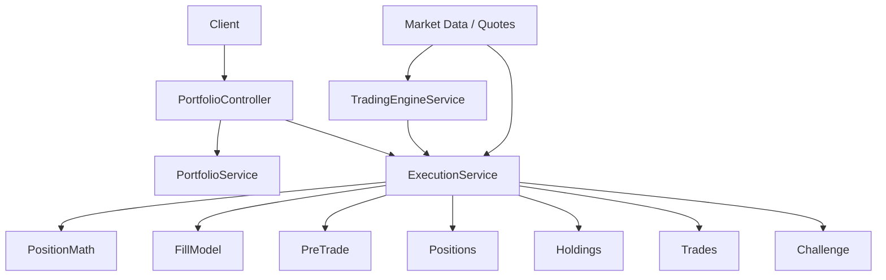
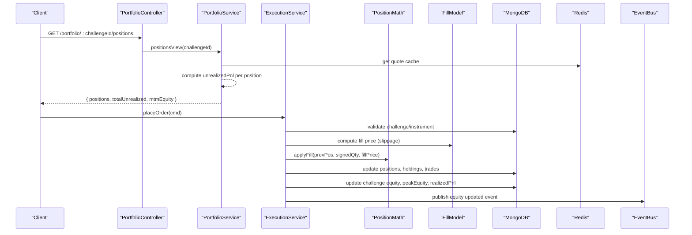
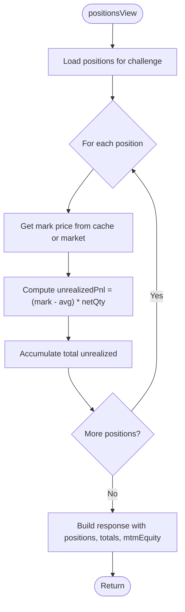
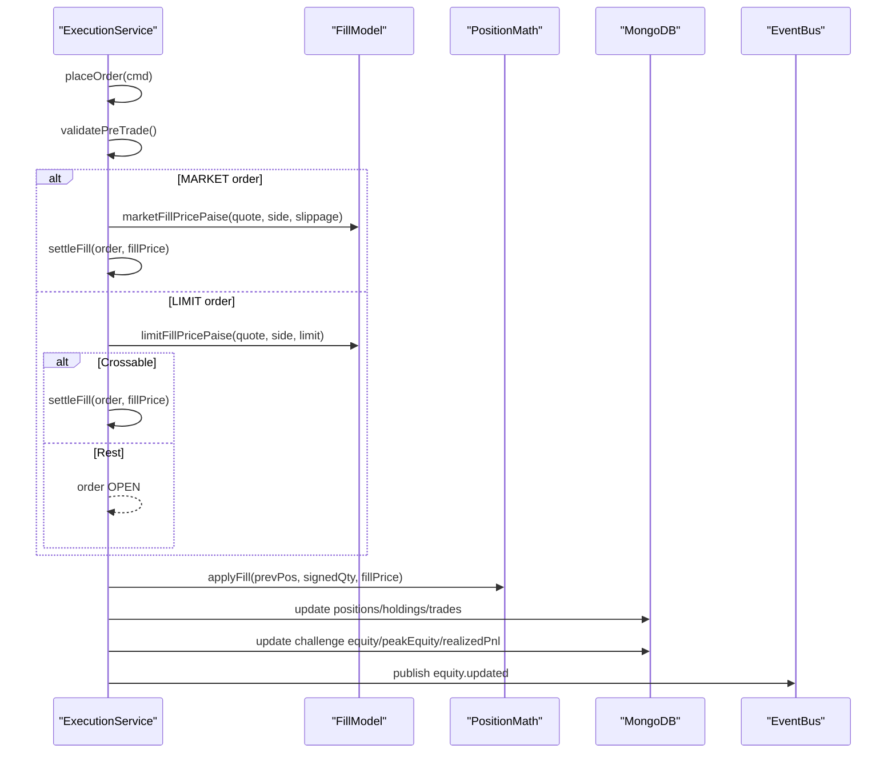
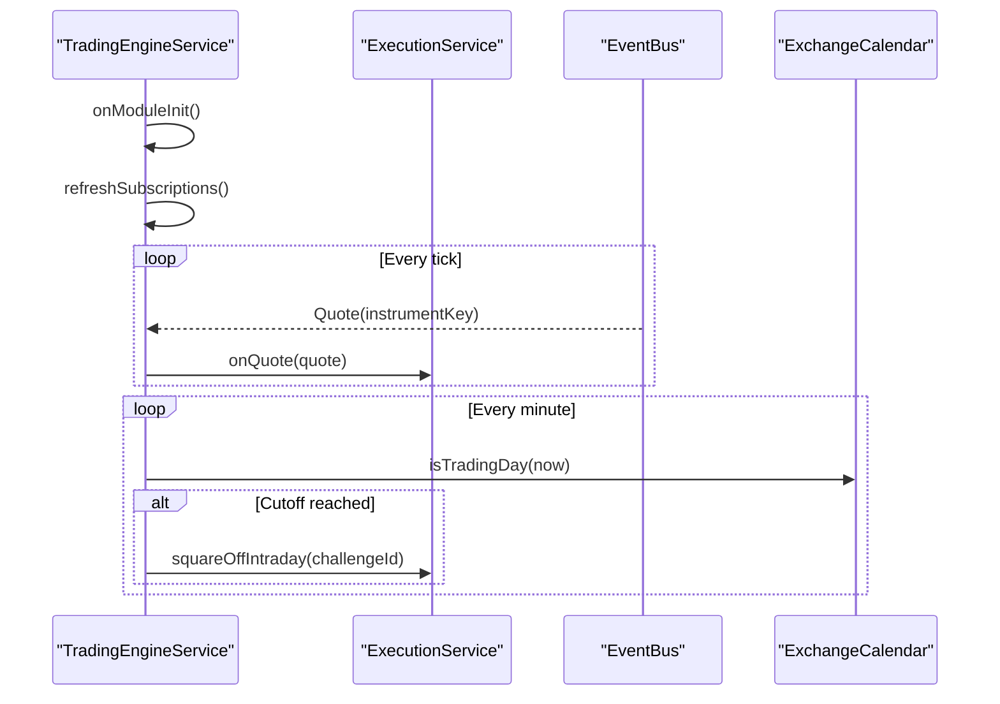
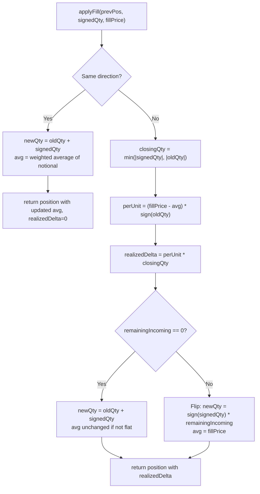
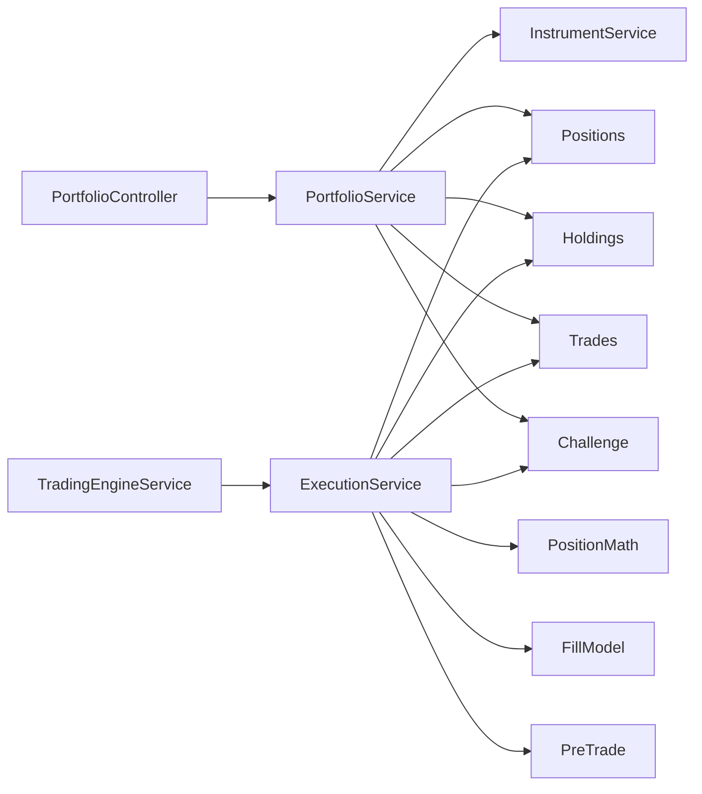

# Portfolio Management System

<cite>
**Referenced Files in This Document**
- [portfolio.service.ts](file://backend/apps/api/src/modules/trading/application/portfolio.service.ts)
- [position-math.ts](file://backend/apps/api/src/modules/trading/domain/position-math.ts)
- [portfolio.controller.ts](file://backend/apps/api/src/modules/trading/presentation/portfolio.controller.ts)
- [execution.service.ts](file://backend/apps/api/src/modules/trading/application/execution.service.ts)
- [fill-model.ts](file://backend/apps/api/src/modules/trading/domain/fill-model.ts)
- [pre-trade.ts](file://backend/apps/api/src/modules/trading/domain/pre-trade.ts)
- [order.types.ts](file://backend/apps/api/src/modules/trading/domain/order.types.ts)
- [holding.schema.ts](file://backend/apps/api/src/modules/trading/infrastructure/schemas/holding.schema.ts)
- [position.schema.ts](file://backend/apps/api/src/modules/trading/infrastructure/schemas/position.schema.ts)
- [trade.schema.ts](file://backend/apps/api/src/modules/trading/infrastructure/schemas/trade.schema.ts)
- [challenge.schema.ts](file://backend/apps/api/src/modules/plans/infrastructure/schemas/challenge.schema.ts)
- [trading-engine.service.ts](file://backend/apps/api/src/modules/trading/application/trading-engine.service.ts)
</cite>

## Table of Contents
1. Introduction
2. Project Structure
3. Core Components
4. Architecture Overview
5. Detailed Component Analysis
6. Dependency Analysis
7. Performance Considerations
8. Troubleshooting Guide
9. Conclusion
10. Appendices

## Introduction
This document explains the Portfolio Management System’s portfolio valuation, P&L tracking, and performance analytics. It covers position aggregation, cost basis calculations, unrealized vs realized gains, rebalancing via square-off, allocation strategies through product types, risk metrics from challenge rules, dividend/corporate action handling (not implemented), tax lot accounting (FIFO not modeled; weighted-average used), reporting endpoints, export capabilities, and integration points with market data and event bus. It also provides examples of portfolio queries, performance attribution, and risk analysis workflows.

## Project Structure
The system is organized by domain modules under a NestJS application:
- Presentation layer exposes REST endpoints for portfolio views.
- Application services orchestrate order execution, position updates, and equity ledgering.
- Domain logic encapsulates pure math for fills, P&L, and pre-trade validation.
- Infrastructure schemas persist positions, holdings, trades, orders, and challenge state.
- A background engine subscribes to live quotes and enforces intraday square-off.

**Diagram sources**
- [portfolio.controller.ts:1-25](file://backend/apps/api/src/modules/trading/presentation/portfolio.controller.ts#L1-L25)
- [portfolio.service.ts:1-90](file://backend/apps/api/src/modules/trading/application/portfolio.service.ts#L1-L90)
- [execution.service.ts:1-309](file://backend/apps/api/src/modules/trading/application/execution.service.ts#L1-L309)
- [position-math.ts:1-73](file://backend/apps/api/src/modules/trading/domain/position-math.ts#L1-L73)
- [fill-model.ts:1-41](file://backend/apps/api/src/modules/trading/domain/fill-model.ts#L1-L41)
- [pre-trade.ts:1-79](file://backend/apps/api/src/modules/trading/domain/pre-trade.ts#L1-L79)
- [trading-engine.service.ts:1-67](file://backend/apps/api/src/modules/trading/application/trading-engine.service.ts#L1-L67)

**Section sources**
- [portfolio.controller.ts:1-25](file://backend/apps/api/src/modules/trading/presentation/portfolio.controller.ts#L1-L25)
- [execution.service.ts:1-309](file://backend/apps/api/src/modules/trading/application/execution.service.ts#L1-L309)
- [trading-engine.service.ts:1-67](file://backend/apps/api/src/modules/trading/application/trading-engine.service.ts#L1-L67)

## Core Components
- PortfolioService: Aggregates positions and holdings with mark prices and computes unrealized P&L and MTM equity.
- ExecutionService: Virtual execution engine that places orders, matches limits, applies fills, updates positions/equity, records trades, and enforces square-off.
- PositionMath: Pure functions for applying fills with weighted-average cost and computing unrealized P&L.
- FillModel: Computes fill prices with slippage and simulated charges.
- PreTrade: Validates orders against instrument and challenge constraints.
- Schemas: Persist positions, holdings, trades, orders, and challenge state including equity, peak equity, realized P&L, and trading days.

Key responsibilities:
- Valuation: Mark-to-market using cached quotes; compute invested/current values and P&L for holdings; compute unrealized P&L for open positions.
- P&L Tracking: Realized P&L per fill; cumulative realized P&L on challenge; charges deducted from equity; append-only ledger entries.
- Risk Metrics: Challenge rules include profit target, max drawdown, daily drawdown, minimum trading days, expiry; enforced during evaluation and tracked via equity and peak equity.

**Section sources**
- [portfolio.service.ts:1-90](file://backend/apps/api/src/modules/trading/application/portfolio.service.ts#L1-L90)
- [execution.service.ts:1-309](file://backend/apps/api/src/modules/trading/application/execution.service.ts#L1-L309)
- [position-math.ts:1-73](file://backend/apps/api/src/modules/trading/domain/position-math.ts#L1-L73)
- [fill-model.ts:1-41](file://backend/apps/api/src/modules/trading/domain/fill-model.ts#L1-L41)
- [pre-trade.ts:1-79](file://backend/apps/api/src/modules/trading/domain/pre-trade.ts#L1-L79)
- [challenge.schema.ts:1-76](file://backend/apps/api/src/modules/plans/infrastructure/schemas/challenge.schema.ts#L1-L76)

## Architecture Overview
The system uses a virtual execution engine with Redis locks to ensure race-free updates to positions and equity. Orders are validated, placed, and either immediately filled (market or crossable limit) or rested. The engine subscribes to quote channels to match resting limits and trigger stop-loss/target exits. At market close, intraday positions are auto-flattened. Portfolio views aggregate live positions and holdings with mark prices to present MTM equity and P&L.

**Diagram sources**
- [portfolio.controller.ts:1-25](file://backend/apps/api/src/modules/trading/presentation/portfolio.controller.ts#L1-L25)
- [portfolio.service.ts:1-90](file://backend/apps/api/src/modules/trading/application/portfolio.service.ts#L1-L90)
- [execution.service.ts:1-309](file://backend/apps/api/src/modules/trading/application/execution.service.ts#L1-L309)
- [position-math.ts:1-73](file://backend/apps/api/src/modules/trading/domain/position-math.ts#L1-L73)
- [fill-model.ts:1-41](file://backend/apps/api/src/modules/trading/domain/fill-model.ts#L1-L41)

## Detailed Component Analysis

### Portfolio Service and Views
- Positions view: Retrieves non-zero net positions, fetches mark prices from Redis cache or instrument service, computes unrealized P&L per position, aggregates total unrealized, and returns MTM equity combining base equity and unrealized P&L.
- Holdings view: Retrieves non-zero holdings, computes invested value (avg price × qty), current value (mark × qty), and P&L (current − invested).
- Recent trades: Returns recent executed trades sorted by time.

**Diagram sources**
- [portfolio.service.ts:43-67](file://backend/apps/api/src/modules/trading/application/portfolio.service.ts#L43-L67)
- [position-math.ts:68-73](file://backend/apps/api/src/modules/trading/domain/position-math.ts#L68-L73)

**Section sources**
- [portfolio.service.ts:26-88](file://backend/apps/api/src/modules/trading/application/portfolio.service.ts#L26-L88)

### Execution Service and Fill Processing
- Order placement: Validates challenge/instrument/market status, computes estimated cost, persists order, and either fills immediately (market or crossable limit) or rests.
- Tick-driven matching: Subscribes to quote channels, checks open orders for each instrument, fills crossing limits, and triggers SL/Target when breached.
- Settlement: Applies fill to position using weighted-average cost, records charges, updates holdings for carry-forward products, creates trade record, updates challenge equity and peak equity, appends ledger entries, and publishes events.
- Square-off: Auto-flattens intraday positions at market cutoff.

**Diagram sources**
- [execution.service.ts:68-130](file://backend/apps/api/src/modules/trading/application/execution.service.ts#L68-L130)
- [execution.service.ts:148-177](file://backend/apps/api/src/modules/trading/application/execution.service.ts#L148-L177)
- [execution.service.ts:181-262](file://backend/apps/api/src/modules/trading/application/execution.service.ts#L181-L262)
- [fill-model.ts:9-41](file://backend/apps/api/src/modules/trading/domain/fill-model.ts#L9-L41)
- [position-math.ts:22-66](file://backend/apps/api/src/modules/trading/domain/position-math.ts#L22-L66)

**Section sources**
- [execution.service.ts:1-309](file://backend/apps/api/src/modules/trading/application/execution.service.ts#L1-L309)

### Trading Engine Service
- Subscribes to quote channels for instruments with open orders.
- Periodically refreshes subscriptions and runs square-off checks at market cutoff for active challenges.

**Diagram sources**
- [trading-engine.service.ts:17-65](file://backend/apps/api/src/modules/trading/application/trading-engine.service.ts#L17-L65)
- [execution.service.ts:148-177](file://backend/apps/api/src/modules/trading/application/execution.service.ts#L148-L177)
- [execution.service.ts:289-307](file://backend/apps/api/src/modules/trading/application/execution.service.ts#L289-L307)

**Section sources**
- [trading-engine.service.ts:1-67](file://backend/apps/api/src/modules/trading/application/trading-engine.service.ts#L1-L67)

### Position Math and Cost Basis
- Weighted-average cost basis: When adding to a position in the same direction, new average is computed by blending old notional and incoming notional.
- Opposite-direction fills realize P&L on the closed quantity; remaining quantity opens a new position on the other side if flipping occurs.
- Unrealized P&L: Computed as (mark price − average price) × net quantity.

**Diagram sources**
- [position-math.ts:22-66](file://backend/apps/api/src/modules/trading/domain/position-math.ts#L22-L66)

**Section sources**
- [position-math.ts:1-73](file://backend/apps/api/src/modules/trading/domain/position-math.ts#L1-L73)

### Fill Model and Charges
- Market fill price: Uses bid/ask with configured slippage; buys lift ask, sells hit bid.
- Limit fill price: Returns limit price if crossed; otherwise null.
- Charges: Simulated as flat per order plus turnover-based charge (bps).

**Section sources**
- [fill-model.ts:1-41](file://backend/apps/api/src/modules/trading/domain/fill-model.ts#L1-L41)

### Pre-Trade Validation
- Validates challenge tradability, market open status, instrument availability, segment permissions, lot sizing, freeze limits, limit price validity, trigger price sanity, and capital sufficiency for buy-side estimates.

**Section sources**
- [pre-trade.ts:1-79](file://backend/apps/api/src/modules/trading/domain/pre-trade.ts#L1-L79)

### Data Models and Persistence
- Position: Tracks per instrument+product net quantity, weighted-average price, realized P&L, and day buy/sell quantities.
- Holding: Mirrors carry-forward positions for overnight display with quantity and average price.
- Trade: Records executed fills with side, quantity, price, charges, realized P&L, and timestamp.
- Challenge: Holds plan rules snapshot and live tracking fields including equity, peak equity, day-start equity, realized P&L, trading days, and status.

**Section sources**
- [position.schema.ts:1-34](file://backend/apps/api/src/modules/trading/infrastructure/schemas/position.schema.ts#L1-L34)
- [holding.schema.ts:1-23](file://backend/apps/api/src/modules/trading/infrastructure/schemas/holding.schema.ts#L1-L23)
- [trade.schema.ts:1-40](file://backend/apps/api/src/modules/trading/infrastructure/schemas/trade.schema.ts#L1-L40)
- [challenge.schema.ts:1-76](file://backend/apps/api/src/modules/plans/infrastructure/schemas/challenge.schema.ts#L1-L76)

## Dependency Analysis
- PortfolioController depends on PortfolioService for read-only views.
- PortfolioService depends on InstrumentService for quotes and Mongoose models for positions, holdings, trades, and challenges.
- ExecutionService orchestrates all write paths: order placement, matching, settlement, ledgering, and event publishing.
- TradingEngineService coordinates quote subscriptions and scheduled square-off.
- Domain modules (PositionMath, FillModel, PreTrade) provide pure functions consumed by ExecutionService.

**Diagram sources**
- [portfolio.controller.ts:1-25](file://backend/apps/api/src/modules/trading/presentation/portfolio.controller.ts#L1-L25)
- [portfolio.service.ts:1-90](file://backend/apps/api/src/modules/trading/application/portfolio.service.ts#L1-L90)
- [execution.service.ts:1-309](file://backend/apps/api/src/modules/trading/application/execution.service.ts#L1-L309)
- [trading-engine.service.ts:1-67](file://backend/apps/api/src/modules/trading/application/trading-engine.service.ts#L1-L67)

**Section sources**
- [execution.service.ts:1-309](file://backend/apps/api/src/modules/trading/application/execution.service.ts#L1-L309)
- [portfolio.service.ts:1-90](file://backend/apps/api/src/modules/trading/application/portfolio.service.ts#L1-L90)
- [trading-engine.service.ts:1-67](file://backend/apps/api/src/modules/trading/application/trading-engine.service.ts#L1-L67)

## Performance Considerations
- Quote caching: Mark prices are retrieved from Redis cache to reduce latency and external calls.
- Account-level locking: Per-challenge Redis locks prevent race conditions during concurrent fills and updates.
- Batch operations: Positions and holdings are updated atomically within settlements; trades appended efficiently.
- Scheduled tasks: Square-off runs periodically with minimal overhead; subscriptions refreshed every 15 seconds.

[No sources needed since this section provides general guidance]

## Troubleshooting Guide
Common issues and diagnostics:
- No market data: Market orders without available quotes are rejected; verify instrument coverage and feed connectivity.
- Insufficient capital: Buy-side orders exceeding estimated cost fail pre-trade validation; review equity and order size.
- Non-tradable challenge: Orders rejected if challenge status is not PENDING/ACTIVE; check plan lifecycle.
- Segment restrictions: Orders for unsupported segments fail; confirm plan rules allow the segment.
- Square-off failures: Intraday positions may not be flattened if quotes unavailable; monitor logs for missing quotes.

Operational tips:
- Use recent trades endpoint to audit fills and realized P&L.
- Check positions and holdings endpoints to reconcile MTM and P&L.
- Monitor challenge equity and peak equity to assess drawdowns and rule breaches.

**Section sources**
- [execution.service.ts:68-130](file://backend/apps/api/src/modules/trading/application/execution.service.ts#L68-L130)
- [pre-trade.ts:29-79](file://backend/apps/api/src/modules/trading/domain/pre-trade.ts#L29-L79)
- [trading-engine.service.ts:49-65](file://backend/apps/api/src/modules/trading/application/trading-engine.service.ts#L49-L65)

## Conclusion
The Portfolio Management System provides robust portfolio valuation, P&L tracking, and performance analytics grounded in precise position math and controlled execution. It supports real-time mark-to-market views, automated intraday square-off, and comprehensive risk metrics via challenge rules. While dividends and corporate actions are not implemented, the system’s design allows future extension. Reporting endpoints enable querying positions, holdings, and trades, while event publishing facilitates integration with external analytics tools.

[No sources needed since this section summarizes without analyzing specific files]

## Appendices

### API Endpoints for Portfolio Queries
- GET /portfolio/:challengeId/positions: Returns positions with mark prices, unrealized P&L, total unrealized, and MTM equity.
- GET /portfolio/:challengeId/holdings: Returns holdings with invested/current values and P&L.
- GET /portfolio/:challengeId/trades: Returns recent trades for the challenge.

**Section sources**
- [portfolio.controller.ts:10-23](file://backend/apps/api/src/modules/trading/presentation/portfolio.controller.ts#L10-L23)

### Performance Attribution Example
- Compute per-instrument contribution to realized P&L by aggregating trade-level realizedPnlPaise.
- Attribute changes in MTM equity to position-level unrealizedPnl derived from mark price movements.

**Section sources**
- [trade.schema.ts:1-40](file://backend/apps/api/src/modules/trading/infrastructure/schemas/trade.schema.ts#L1-L40)
- [portfolio.service.ts:43-67](file://backend/apps/api/src/modules/trading/application/portfolio.service.ts#L43-L67)

### Risk Analysis Example
- Max drawdown: Compare peakEquityPaise to current equityPaise to compute drawdown percentage.
- Daily drawdown: Compare dayStartEquityPaise to current equityPaise for intra-day risk.
- Profit target: Track realizedPnlPaise against plan rules’ profitTargetPct.

**Section sources**
- [challenge.schema.ts:37-57](file://backend/apps/api/src/modules/plans/infrastructure/schemas/challenge.schema.ts#L37-L57)

### Rebalancing and Allocation Strategies
- Product types: INTRADAY vs CARRY_FORWARD determine whether positions are held overnight; holdings mirror carry-forward net positions.
- Square-off: Intraday positions are automatically flattened at market cutoff to enforce risk controls.
- Allocation: Segment permissions in plan rules constrain which markets can be traded; use these to implement allocation policies.

**Section sources**
- [position.schema.ts:12-29](file://backend/apps/api/src/modules/trading/infrastructure/schemas/position.schema.ts#L12-L29)
- [holding.schema.ts:4-18](file://backend/apps/api/src/modules/trading/infrastructure/schemas/holding.schema.ts#L4-L18)
- [trading-engine.service.ts:49-65](file://backend/apps/api/src/modules/trading/application/trading-engine.service.ts#L49-L65)
- [pre-trade.ts:42-49](file://backend/apps/api/src/modules/trading/domain/pre-trade.ts#L42-L49)

### Dividends and Corporate Actions
- Not implemented in the current codebase. Future extensions could adjust holdings and equity upon corporate actions and track adjustments in the ledger.

[No sources needed since this section describes absence of implementation]

### Tax Lot Accounting
- Weighted-average cost basis is used for positions; FIFO or specific identification is not modeled. Realized P&L is computed on the closed quantity during opposite-direction fills.

**Section sources**
- [position-math.ts:22-66](file://backend/apps/api/src/modules/trading/domain/position-math.ts#L22-L66)

### Integration with External Analytics Tools
- Event bus: Equity updates are published on fills and equity changes, enabling downstream analytics systems to consume real-time signals.
- Market data feeds: Quotes are sourced via InstrumentService and cached in Redis; external tools can subscribe to quote channels for live pricing.

**Section sources**
- [execution.service.ts:228-262](file://backend/apps/api/src/modules/trading/application/execution.service.ts#L228-L262)
- [trading-engine.service.ts:39-47](file://backend/apps/api/src/modules/trading/application/trading-engine.service.ts#L39-L47)