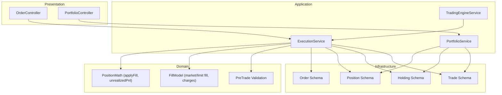
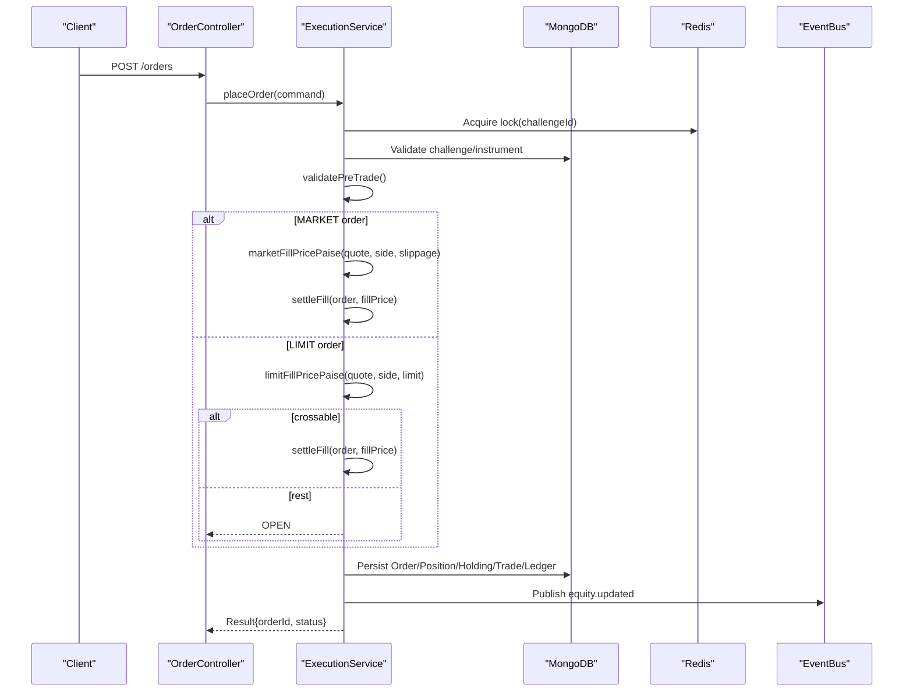
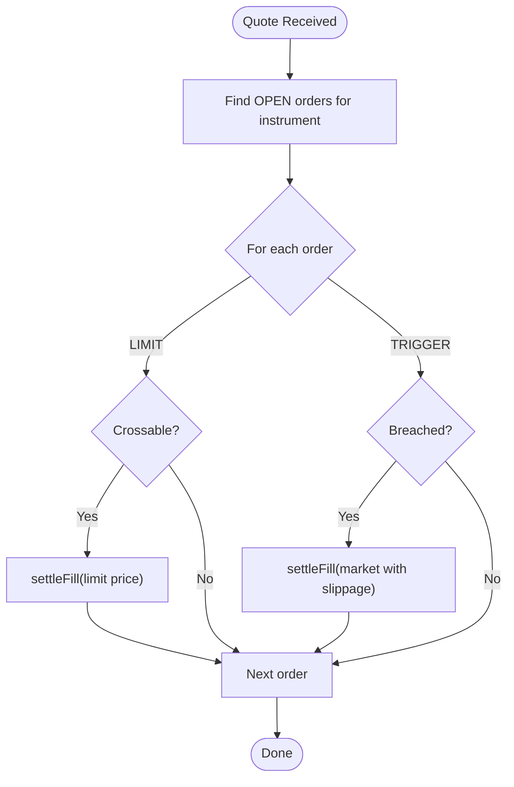
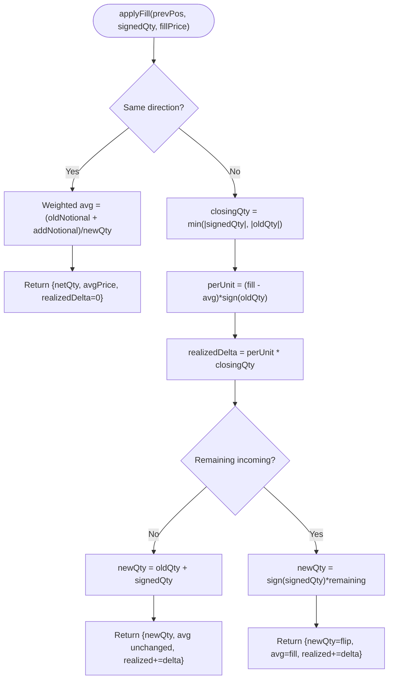
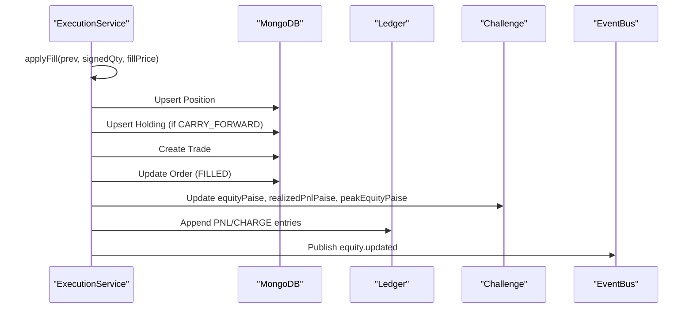
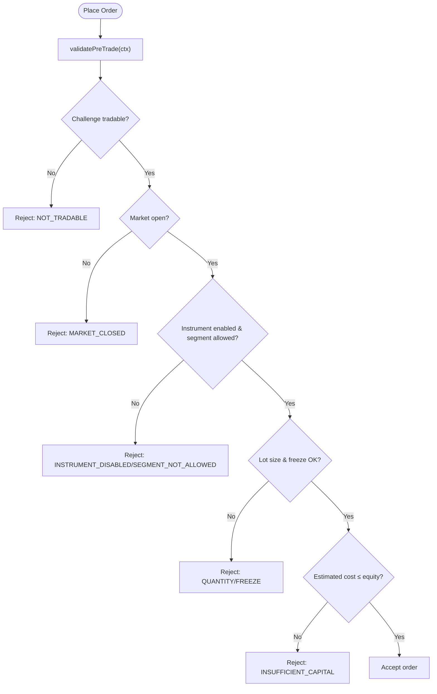
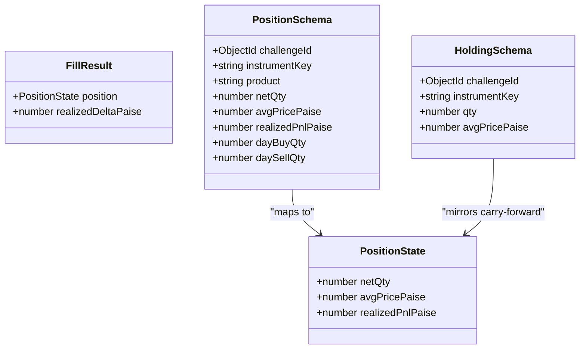
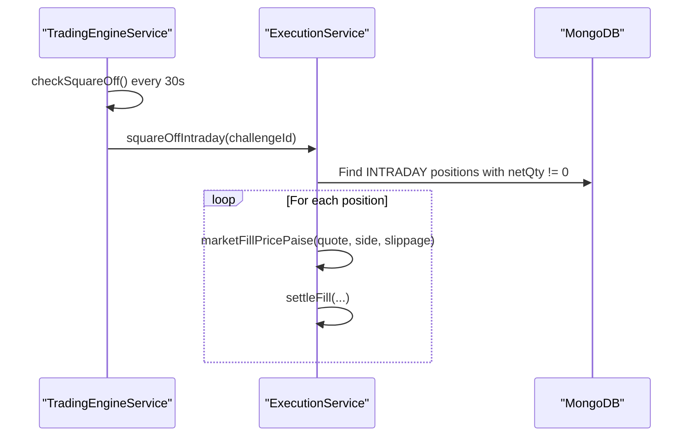
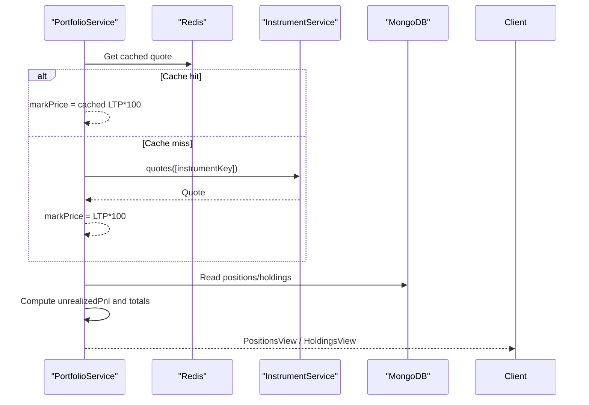
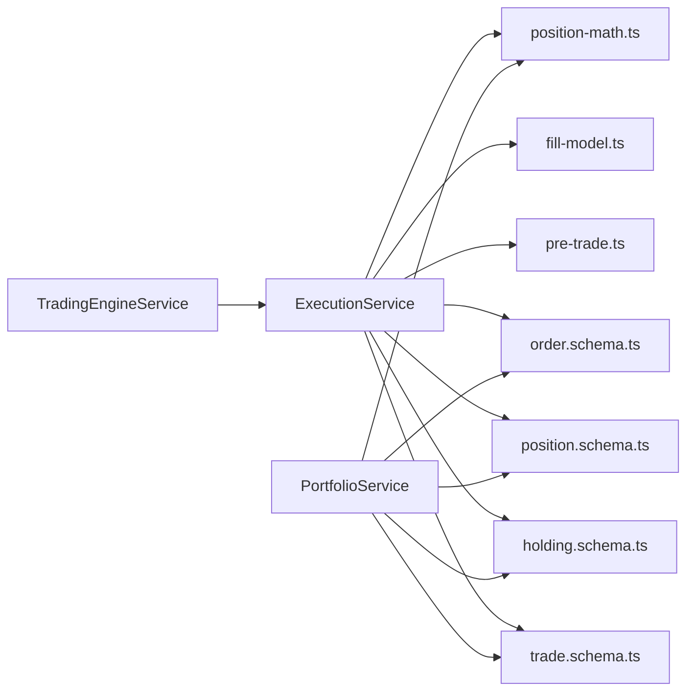

# Position Tracking & Reconciliation

<cite>
**Referenced Files in This Document**
- [position-math.ts](file://backend/apps/api/src/modules/trading/domain/position-math.ts)
- [fill-model.ts](file://backend/apps/api/src/modules/trading/domain/fill-model.ts)
- [pre-trade.ts](file://backend/apps/api/src/modules/trading/domain/pre-trade.ts)
- [execution.service.ts](file://backend/apps/api/src/modules/trading/application/execution.service.ts)
- [portfolio.service.ts](file://backend/apps/api/src/modules/trading/application/portfolio.service.ts)
- [trading-engine.service.ts](file://backend/apps/api/src/modules/trading/application/trading-engine.service.ts)
- [order.schema.ts](file://backend/apps/api/src/modules/trading/infrastructure/schemas/order.schema.ts)
- [position.schema.ts](file://backend/apps/api/src/modules/trading/infrastructure/schemas/position.schema.ts)
- [holding.schema.ts](file://backend/apps/api/src/modules/trading/infrastructure/schemas/holding.schema.ts)
- [trade.schema.ts](file://backend/apps/api/src/modules/trading/infrastructure/schemas/trade.schema.ts)
- [order.controller.ts](file://backend/apps/api/src/modules/trading/presentation/order.controller.ts)
- [portfolio.controller.ts](file://backend/apps/api/src/modules/trading/presentation/portfolio.controller.ts)
- [position-math.spec.ts](file://backend/apps/api/src/modules/trading/__tests__/position-math.spec.ts)
- [fill-model.spec.ts](file://backend/apps/api/src/modules/trading/__tests__/fill-model.spec.ts)
</cite>

## Table of Contents
1. Introduction
2. Project Structure
3. Core Components
4. Architecture Overview
5. Detailed Component Analysis
6. Dependency Analysis
7. Performance Considerations
8. Troubleshooting Guide
9. Conclusion
10. Appendices

## Introduction
This document explains how the system tracks positions, reconciles trades, and manages holdings across intraday and carry-forward products. It covers real-time position updates via a virtual execution engine, fill modeling with slippage, average price calculations using weighted averages, realized and unrealized P&L, trade lifecycle events, settlement processing, and automated square-off. It also outlines exposure controls enforced at order placement, and provides examples for querying positions, holdings, orders, and recent trades.

## Project Structure
The position tracking and reconciliation logic is implemented in the trading module under backend/apps/api/src/modules/trading:
- Domain layer defines pure functions for position math, fill modeling, and pre-trade validation.
- Application layer orchestrates order placement, matching, settlement, and portfolio views.
- Infrastructure layer persists Orders, Positions, Holdings, and Trades.
- Presentation layer exposes REST endpoints for placing orders and reading portfolio data.
- Engine service subscribes to market quotes and drives tick-based matching and square-off.

**Diagram sources**
- [order.controller.ts:23-47](file://backend/apps/api/src/modules/trading/presentation/order.controller.ts#L23-L47)
- [portfolio.controller.ts:5-24](file://backend/apps/api/src/modules/trading/presentation/portfolio.controller.ts#L5-L24)
- [execution.service.ts:31-49](file://backend/apps/api/src/modules/trading/application/execution.service.ts#L31-L49)
- [portfolio.service.ts:14-24](file://backend/apps/api/src/modules/trading/application/portfolio.service.ts#L14-L24)
- [trading-engine.service.ts:16-28](file://backend/apps/api/src/modules/trading/application/trading-engine.service.ts#L16-L28)
- [position-math.ts:3-18](file://backend/apps/api/src/modules/trading/domain/position-math.ts#L3-L18)
- [fill-model.ts:4-40](file://backend/apps/api/src/modules/trading/domain/fill-model.ts#L4-L40)
- [pre-trade.ts:4-25](file://backend/apps/api/src/modules/trading/domain/pre-trade.ts#L4-L25)
- [order.schema.ts:13-71](file://backend/apps/api/src/modules/trading/infrastructure/schemas/order.schema.ts#L13-L71)
- [position.schema.ts:4-34](file://backend/apps/api/src/modules/trading/infrastructure/schemas/position.schema.ts#L4-L34)
- [holding.schema.ts:4-23](file://backend/apps/api/src/modules/trading/infrastructure/schemas/holding.schema.ts#L4-L23)
- [trade.schema.ts:4-40](file://backend/apps/api/src/modules/trading/infrastructure/schemas/trade.schema.ts#L4-L40)

**Section sources**
- [order.controller.ts:23-47](file://backend/apps/api/src/modules/trading/presentation/order.controller.ts#L23-L47)
- [portfolio.controller.ts:5-24](file://backend/apps/api/src/modules/trading/presentation/portfolio.controller.ts#L5-L24)
- [execution.service.ts:31-49](file://backend/apps/api/src/modules/trading/application/execution.service.ts#L31-L49)
- [portfolio.service.ts:14-24](file://backend/apps/api/src/modules/trading/application/portfolio.service.ts#L14-L24)
- [trading-engine.service.ts:16-28](file://backend/apps/api/src/modules/trading/application/trading-engine.service.ts#L16-L28)

## Core Components
- Position math: Pure functions compute new position state and realized/unrealized P&L on each fill.
- Fill model: Simulates market and limit fills with slippage and computes per-order charges.
- Pre-trade validation: Enforces challenge status, market hours, instrument availability, segment permissions, lot sizing, freeze limits, trigger sanity, and capital sufficiency.
- Execution service: Orchestrates order placement, immediate fills, tick-driven matching, SL/target triggers, settlement, ledger updates, and equity changes.
- Portfolio service: Provides live positions view with MTM, holdings view, order book, and recent trades.
- Trading engine service: Subscribes to quote channels for instruments with open orders and enforces intraday square-off at cutoff.

**Section sources**
- [position-math.ts:3-73](file://backend/apps/api/src/modules/trading/domain/position-math.ts#L3-L73)
- [fill-model.ts:4-40](file://backend/apps/api/src/modules/trading/domain/fill-model.ts#L4-L40)
- [pre-trade.ts:27-79](file://backend/apps/api/src/modules/trading/domain/pre-trade.ts#L27-L79)
- [execution.service.ts:66-309](file://backend/apps/api/src/modules/trading/application/execution.service.ts#L66-L309)
- [portfolio.service.ts:26-88](file://backend/apps/api/src/modules/trading/application/portfolio.service.ts#L26-L88)
- [trading-engine.service.ts:30-66](file://backend/apps/api/src/modules/trading/application/trading-engine.service.ts#L30-L66)

## Architecture Overview
The Virtual Execution Engine (VEE) ensures race-free updates by locking per account (challenge). On each quote event, it matches resting limit orders and fires stop-loss/target exits when triggered. Market orders are filled immediately with slippage. Settlement updates positions, holdings (for carry-forward), trades, and challenge equity with an append-only ledger. A periodic scheduler squares off intraday positions at the exchange-defined cutoff.

**Diagram sources**
- [order.controller.ts:28-46](file://backend/apps/api/src/modules/trading/presentation/order.controller.ts#L28-L46)
- [execution.service.ts:68-130](file://backend/apps/api/src/modules/trading/application/execution.service.ts#L68-L130)
- [execution.service.ts:181-262](file://backend/apps/api/src/modules/trading/application/execution.service.ts#L181-L262)
- [fill-model.ts:14-40](file://backend/apps/api/src/modules/trading/domain/fill-model.ts#L14-L40)
- [pre-trade.ts:33-79](file://backend/apps/api/src/modules/trading/domain/pre-trade.ts#L33-L79)

## Detailed Component Analysis

### Real-Time Position Updates and Matching
- Quote-driven matching: The engine subscribes to quote channels for instruments with open orders and calls into the execution service to match or fire triggers.
- Limit fills: A limit buy fills when ask ≤ limit; a limit sell fills when bid ≥ limit.
- Stop-loss/target: When the last traded price breaches the trigger threshold relative to side, a market exit is executed with slippage.

**Diagram sources**
- [trading-engine.service.ts:39-47](file://backend/apps/api/src/modules/trading/application/trading-engine.service.ts#L39-L47)
- [execution.service.ts:148-177](file://backend/apps/api/src/modules/trading/application/execution.service.ts#L148-L177)

**Section sources**
- [trading-engine.service.ts:39-66](file://backend/apps/api/src/modules/trading/application/trading-engine.service.ts#L39-L66)
- [execution.service.ts:148-177](file://backend/apps/api/src/modules/trading/application/execution.service.ts#L148-L177)

### Fill Modeling and Average Price Calculations
- Market fills: Use best available quote (ask for buys, bid for sells) plus configured slippage basis points.
- Limit fills: Return limit price if crossable; otherwise no fill.
- Charges: Computed as flat fee plus turnover-based charge (basis points).
- Weighted-average cost: New average price is computed by blending notional values of existing and incoming quantities.
- Realized P&L: On opposite-direction fills, realize P&L on the closed quantity; remaining quantity opens a new position at the fill price.

**Diagram sources**
- [position-math.ts:26-66](file://backend/apps/api/src/modules/trading/domain/position-math.ts#L26-L66)
- [fill-model.ts:14-40](file://backend/apps/api/src/modules/trading/domain/fill-model.ts#L14-L40)

**Section sources**
- [position-math.ts:3-73](file://backend/apps/api/src/modules/trading/domain/position-math.ts#L3-L73)
- [fill-model.ts:4-40](file://backend/apps/api/src/modules/trading/domain/fill-model.ts#L4-L40)
- [position-math.spec.ts:3-62](file://backend/apps/api/src/modules/trading/__tests__/position-math.spec.ts#L3-L62)
- [fill-model.spec.ts:8-37](file://backend/apps/api/src/modules/trading/__tests__/fill-model.spec.ts#L8-L37)

### Trade Lifecycle Events and Settlement Processing
- Order states: OPEN → FILLED/CANCELLED/REJECTED.
- Immediate settlement for market orders; conditional settlement for limit orders when crossable.
- Settlement steps:
  - Compute fill price and charges.
  - Update position (netQty, avgPricePaise, realizedPnlPaise).
  - Mirror net carry-forward position into holdings.
  - Record trade with price, qty, charges, realized delta.
  - Mark order FILLED with timestamps and charges.
  - Update challenge equity with realized P&L and charges; append ledger entries.
  - Track trading days and publish equity update event.

**Diagram sources**
- [execution.service.ts:181-262](file://backend/apps/api/src/modules/trading/application/execution.service.ts#L181-L262)
- [position.schema.ts:4-34](file://backend/apps/api/src/modules/trading/infrastructure/schemas/position.schema.ts#L4-L34)
- [holding.schema.ts:4-23](file://backend/apps/api/src/modules/trading/infrastructure/schemas/holding.schema.ts#L4-L23)
- [trade.schema.ts:4-40](file://backend/apps/api/src/modules/trading/infrastructure/schemas/trade.schema.ts#L4-L40)
- [order.schema.ts:13-71](file://backend/apps/api/src/modules/trading/infrastructure/schemas/order.schema.ts#L13-L71)

**Section sources**
- [execution.service.ts:181-262](file://backend/apps/api/src/modules/trading/application/execution.service.ts#L181-L262)

### Position Sizing Algorithms and Exposure Limits
- Lot sizing: Quantities must be multiples of instrument lot size.
- Freeze limits: Per-instrument maximum order quantity enforced.
- Capital sufficiency: Estimated order value must not exceed available equity (conservative approach for shorts in simulator).
- Segment permissions: Only allowed segments per plan can be traded.
- Market hours: Orders only accepted when market is open for the instrument’s segment.

**Diagram sources**
- [pre-trade.ts:33-79](file://backend/apps/api/src/modules/trading/domain/pre-trade.ts#L33-L79)

**Section sources**
- [pre-trade.ts:27-79](file://backend/apps/api/src/modules/trading/domain/pre-trade.ts#L27-L79)

### Multi-leg Positions, Hedging Scenarios, and Complex Instruments
- Net position accounting: Each instrument+product has a single net position with signed quantity; long positive, short negative.
- Flipping behavior: Opposite-direction fills realize P&L on the closed portion and open a new position at the fill price for any remainder.
- Product segmentation: INTRADAY vs CARRY_FORWARD product types allow separate net positions per instrument; holdings mirror carry-forward net positions overnight.
- Complex instruments: The same logic applies regardless of instrument type; constraints like lot size and freeze quantity are instrument-specific.

**Diagram sources**
- [position-math.ts:8-18](file://backend/apps/api/src/modules/trading/domain/position-math.ts#L8-L18)
- [position.schema.ts:4-34](file://backend/apps/api/src/modules/trading/infrastructure/schemas/position.schema.ts#L4-L34)
- [holding.schema.ts:4-23](file://backend/apps/api/src/modules/trading/infrastructure/schemas/holding.schema.ts#L4-L23)

**Section sources**
- [position-math.ts:26-66](file://backend/apps/api/src/modules/trading/domain/position-math.ts#L26-L66)
- [execution.service.ts:196-213](file://backend/apps/api/src/modules/trading/application/execution.service.ts#L196-L213)

### Square-off and Forced Flatten
- Intraday square-off: At the exchange-defined cutoff, all INTRADAY positions are flattened via market orders with slippage.
- Force flatten: On challenge pass/fail, all open positions (intraday and carry-forward) are flattened.

**Diagram sources**
- [trading-engine.service.ts:49-66](file://backend/apps/api/src/modules/trading/application/trading-engine.service.ts#L49-L66)
- [execution.service.ts:289-307](file://backend/apps/api/src/modules/trading/application/execution.service.ts#L289-L307)

**Section sources**
- [trading-engine.service.ts:49-66](file://backend/apps/api/src/modules/trading/application/trading-engine.service.ts#L49-L66)
- [execution.service.ts:264-307](file://backend/apps/api/src/modules/trading/application/execution.service.ts#L264-L307)

### Position Monitoring, Alerts, and Equity Updates
- Live MTM: Positions view computes unrealized P&L using current mark prices from cache or instrument quotes.
- Equity updates: On each fill, realized P&L and charges are applied to challenge equity; an event is published for downstream consumers (e.g., challenge evaluator).
- Recent trades: Queryable for audit and reporting.

**Diagram sources**
- [portfolio.service.ts:26-88](file://backend/apps/api/src/modules/trading/application/portfolio.service.ts#L26-L88)

**Section sources**
- [portfolio.service.ts:43-88](file://backend/apps/api/src/modules/trading/application/portfolio.service.ts#L43-L88)

## Dependency Analysis
- ExecutionService depends on:
  - Domain: position-math, fill-model, pre-trade.
  - Infrastructure: Order, Position, Holding, Trade schemas.
  - Shared: Redis locks, event bus, config, calendar.
- PortfolioService depends on:
  - Infrastructure: Order, Position, Holding, Trade schemas.
  - Domain: unrealizedPnl.
  - Shared: Redis quote cache, InstrumentService.
- TradingEngineService depends on:
  - Application: ExecutionService.
  - Shared: EventBus, ExchangeCalendarService.

**Diagram sources**
- [execution.service.ts:1-49](file://backend/apps/api/src/modules/trading/application/execution.service.ts#L1-L49)
- [portfolio.service.ts:1-24](file://backend/apps/api/src/modules/trading/application/portfolio.service.ts#L1-L24)
- [trading-engine.service.ts:1-28](file://backend/apps/api/src/modules/trading/application/trading-engine.service.ts#L1-L28)

**Section sources**
- [execution.service.ts:1-49](file://backend/apps/api/src/modules/trading/application/execution.service.ts#L1-L49)
- [portfolio.service.ts:1-24](file://backend/apps/api/src/modules/trading/application/portfolio.service.ts#L1-L24)
- [trading-engine.service.ts:1-28](file://backend/apps/api/src/modules/trading/application/trading-engine.service.ts#L1-L28)

## Performance Considerations
- Account-level locking: All mutations run under a per-challenge Redis lock to prevent race conditions and ensure consistent equity and drawdown math.
- Quote caching: Market prices are read from Redis to minimize latency and external calls.
- Partial indexes: Orders indexed by status and instrumentKey for efficient matching; trades and positions have appropriate indexes for queries.
- Batch operations: Square-off iterates open positions and executes sequential settlements within a single lock to maintain consistency.

[No sources needed since this section provides general guidance]

## Troubleshooting Guide
Common rejection reasons and their causes:
- Challenge not tradable: Challenge status not PENDING/ACTIVE.
- Market closed: Market not open for the instrument’s segment.
- Instrument disabled or segment not allowed: Instrument flagged disabled or plan does not permit that segment.
- Quantity invalid: Not a multiple of lot size or exceeds freeze limit.
- Insufficient capital: Estimated order value exceeds available equity.
- No market data: Market order placed without available quote.
- Not cancellable: Order not in OPEN state.

Resolution steps:
- Verify challenge status and plan rules.
- Ensure market is open for the segment.
- Confirm instrument is enabled and segment permitted.
- Adjust quantity to respect lot size and freeze limits.
- Increase available equity or reduce order size.
- Retry market orders after market data becomes available.
- Cancel only OPEN orders.

**Section sources**
- [pre-trade.ts:33-79](file://backend/apps/api/src/modules/trading/domain/pre-trade.ts#L33-L79)
- [execution.service.ts:68-130](file://backend/apps/api/src/modules/trading/application/execution.service.ts#L68-L130)
- [order.controller.ts:11-21](file://backend/apps/api/src/modules/trading/presentation/order.controller.ts#L11-L21)

## Conclusion
The system implements robust position tracking and reconciliation through a virtual execution engine with deterministic fill modeling, precise average price computation, and comprehensive settlement flows. Pre-trade checks enforce exposure limits and risk controls, while the engine provides real-time matching and automated square-off. Portfolio APIs expose live positions, holdings, and trade history for monitoring and reporting.

[No sources needed since this section summarizes without analyzing specific files]

## Appendices

### API Examples for Position Queries and Reports
- Place an order: POST /orders with fields for challengeId, instrumentKey, side, type, product, qty, optional limitPricePaise and trigger.
- Cancel an order: DELETE /orders/:orderId.
- View positions: GET /portfolio/:challengeId/positions — returns positions with netQty, avgPricePaise, markPricePaise, unrealizedPnlPaise, realizedPnlPaise, and totals.
- View holdings: GET /portfolio/:challengeId/holdings — returns carry-forward holdings with qty, avgPricePaise, invested/current values, and PnL.
- View order book: GET /orders/:challengeId/book — returns open and recent executed orders.
- View recent trades: GET /portfolio/:challengeId/trades — returns recent trades sorted by time.

**Section sources**
- [order.controller.ts:28-46](file://backend/apps/api/src/modules/trading/presentation/order.controller.ts#L28-L46)
- [portfolio.controller.ts:10-23](file://backend/apps/api/src/modules/trading/presentation/portfolio.controller.ts#L10-L23)