# Risk Management & Compliance

<cite>
**Referenced Files in This Document**
- [pre-trade.ts](file://backend/apps/api/src/modules/trading/domain/pre-trade.ts)
- [execution.service.ts](file://backend/apps/api/src/modules/trading/application/execution.service.ts)
- [trading-engine.service.ts](file://backend/apps/api/src/modules/trading/application/trading-engine.service.ts)
- [portfolio.service.ts](file://backend/apps/api/src/modules/trading/application/portfolio.service.ts)
- [position-math.ts](file://backend/apps/api/src/modules/trading/domain/position-math.ts)
- [fill-model.ts](file://backend/apps/api/src/modules/trading/domain/fill-model.ts)
- [challenge-dashboard.service.ts](file://backend/apps/api/src/modules/challenge/application/challenge-dashboard.service.ts)
- [challenge-rules-eval.ts](file://backend/apps/api/src/modules/challenge/domain/challenge-rules-eval.ts)
- [plan-rules.vo.ts](file://backend/apps/api/src/modules/plans/domain/plan-rules.vo.ts)
- [challenge.schema.ts](file://backend/apps/api/src/modules/plans/infrastructure/schemas/challenge.schema.ts)
- [audit.service.ts](file://backend/libs/shared/src/audit/audit.service.ts)
- [audit-log.schema.ts](file://backend/libs/shared/src/audit/audit-log.schema.ts)
- [SRS.md](file://docs/SRS.md)
</cite>

## Table of Contents
1. Introduction
2. Project Structure
3. Core Components
4. Architecture Overview
5. Detailed Component Analysis
6. Dependency Analysis
7. Performance Considerations
8. Troubleshooting Guide
9. Conclusion
10. Appendices

## Introduction
This document explains the Risk Management and Compliance features implemented in the platform, focusing on pre-trade risk checks, position limits, exposure controls, margin and leverage assumptions, capital adequacy, compliance rules, audit trails, risk scoring via challenge evaluation, stress testing through scenario analysis, alerting mechanisms, dashboards, and reporting. It maps each feature to concrete code paths so readers can trace behavior end-to-end.

## Project Structure
Risk and compliance are primarily implemented across:
- Trading domain (pre-trade validation, execution engine, position math, fill model)
- Challenge engine (rule evaluation, dashboard, plan rule validation)
- Audit subsystem (immutable audit logs)
- Market data integration for live quotes used by risk checks and MTM

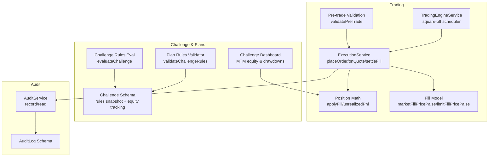

**Diagram sources**
- [pre-trade.ts:33-77](file://backend/apps/api/src/modules/trading/domain/pre-trade.ts#L33-L77)
- [execution.service.ts:68-130](file://backend/apps/api/src/modules/trading/application/execution.service.ts#L68-L130)
- [position-math.ts:26-72](file://backend/apps/api/src/modules/trading/domain/position-math.ts#L26-L72)
- [fill-model.ts:14-40](file://backend/apps/api/src/modules/trading/domain/fill-model.ts#L14-L40)
- [trading-engine.service.ts:49-65](file://backend/apps/api/src/modules/trading/application/trading-engine.service.ts#L49-L65)
- [challenge-rules-eval.ts:38-66](file://backend/apps/api/src/modules/challenge/domain/challenge-rules-eval.ts#L38-L66)
- [plan-rules.vo.ts:5-59](file://backend/apps/api/src/modules/plans/domain/plan-rules.vo.ts#L5-L59)
- [challenge.schema.ts:23-76](file://backend/apps/api/src/modules/plans/infrastructure/schemas/challenge.schema.ts#L23-L76)
- [audit.service.ts:24-43](file://backend/libs/shared/src/audit/audit.service.ts#L24-L43)
- [audit-log.schema.ts:6-41](file://backend/libs/shared/src/audit/audit-log.schema.ts#L6-L41)

**Section sources**
- [SRS.md:276-294](file://docs/SRS.md#L276-L294)

## Core Components
- Pre-trade risk checks enforce instrument availability, market hours, segment permissions, freeze quantity, order price sanity, and capital sufficiency before an order is accepted.
- Execution engine applies fills under per-account locks, updates positions, records trades, adjusts challenge equity, and emits events.
- Position math computes realized and unrealized P&L deterministically.
- Fill model simulates slippage and limit crossing logic.
- Challenge engine evaluates pass/fail based on profit target, daily/max drawdown floors, expiry, and minimum trading days.
- Plan rules validator ensures admin-configured parameters are consistent and bounded.
- Audit service provides immutable audit trails for compliance.

**Section sources**
- [pre-trade.ts:33-77](file://backend/apps/api/src/modules/trading/domain/pre-trade.ts#L33-L77)
- [execution.service.ts:68-130](file://backend/apps/api/src/modules/trading/application/execution.service.ts#L68-L130)
- [position-math.ts:26-72](file://backend/apps/api/src/modules/trading/domain/position-math.ts#L26-L72)
- [fill-model.ts:14-40](file://backend/apps/api/src/modules/trading/domain/fill-model.ts#L14-L40)
- [challenge-rules-eval.ts:38-66](file://backend/apps/api/src/modules/challenge/domain/challenge-rules-eval.ts#L38-L66)
- [plan-rules.vo.ts:5-59](file://backend/apps/api/src/modules/plans/domain/plan-rules.vo.ts#L5-L59)
- [audit.service.ts:24-43](file://backend/libs/shared/src/audit/audit.service.ts#L24-L43)

## Architecture Overview
The risk and compliance flow spans placement, matching, settlement, and evaluation:

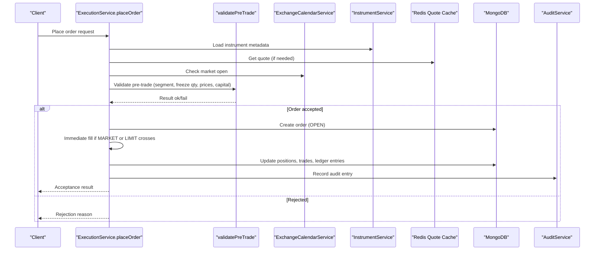

**Diagram sources**
- [execution.service.ts:68-130](file://backend/apps/api/src/modules/trading/application/execution.service.ts#L68-L130)
- [pre-trade.ts:33-77](file://backend/apps/api/src/modules/trading/domain/pre-trade.ts#L33-L77)
- [fill-model.ts:14-40](file://backend/apps/api/src/modules/trading/domain/fill-model.ts#L14-L40)
- [audit.service.ts:24-43](file://backend/libs/shared/src/audit/audit.service.ts#L24-L43)

## Detailed Component Analysis

### Pre-Trade Risk Checks
- Validates challenge tradability status, market open state, instrument enablement, allowed segments, lot sizing, freeze quantity caps, limit/trigger price validity, and buy-side capital sufficiency against estimated notional.
- Returns deterministic rejection reasons for downstream UI and audit logging.

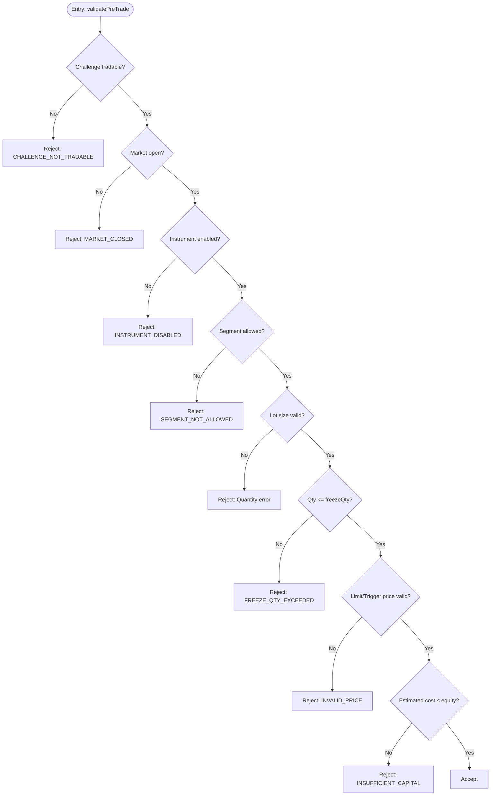

**Diagram sources**
- [pre-trade.ts:33-77](file://backend/apps/api/src/modules/trading/domain/pre-trade.ts#L33-L77)

**Section sources**
- [pre-trade.ts:33-77](file://backend/apps/api/src/modules/trading/domain/pre-trade.ts#L33-L77)

### Execution Engine and Settlement
- Places orders with immediate fill logic for MARKET and crossable LIMIT orders.
- Applies fills under per-account Redis locks to ensure race-free equity and position updates.
- Updates positions using weighted-average cost, records trades, adjusts challenge equity, tracks peak equity, and publishes events for downstream evaluators.

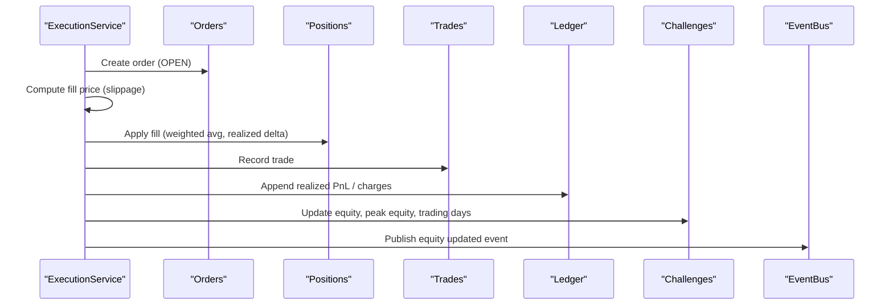

**Diagram sources**
- [execution.service.ts:68-130](file://backend/apps/api/src/modules/trading/application/execution.service.ts#L68-L130)
- [execution.service.ts:181-262](file://backend/apps/api/src/modules/trading/application/execution.service.ts#L181-L262)
- [position-math.ts:26-72](file://backend/apps/api/src/modules/trading/domain/position-math.ts#L26-L72)
- [fill-model.ts:14-40](file://backend/apps/api/src/modules/trading/domain/fill-model.ts#L14-L40)

**Section sources**
- [execution.service.ts:68-130](file://backend/apps/api/src/modules/trading/application/execution.service.ts#L68-L130)
- [execution.service.ts:181-262](file://backend/apps/api/src/modules/trading/application/execution.service.ts#L181-L262)

### Position Limits and Exposure Controls
- Instrument-level freeze quantity limits prevent oversized orders.
- Segment restrictions from plan rules restrict which markets a trader may access.
- Buy-side capital check enforces that estimated notional does not exceed available equity, ensuring conservative exposure.

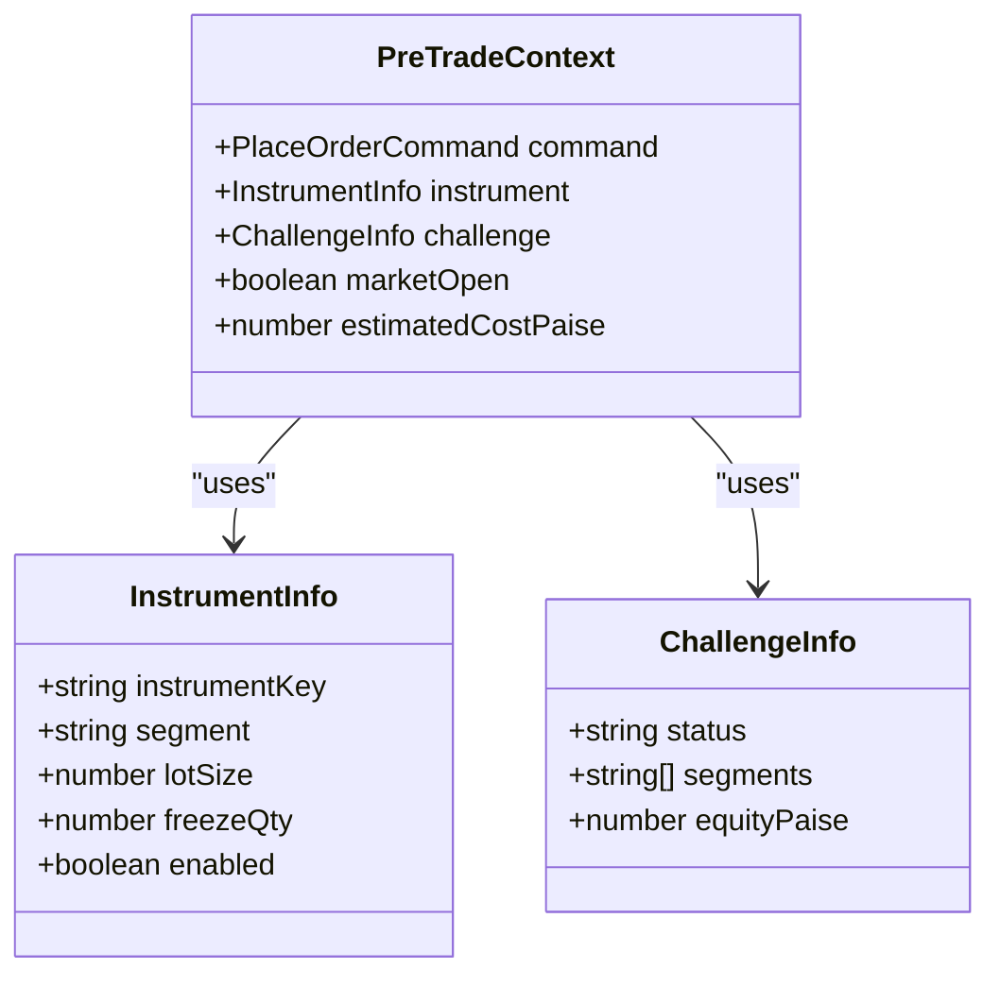

**Diagram sources**
- [pre-trade.ts:4-25](file://backend/apps/api/src/modules/trading/domain/pre-trade.ts#L4-L25)

**Section sources**
- [pre-trade.ts:33-77](file://backend/apps/api/src/modules/trading/domain/pre-trade.ts#L33-L77)

### Margin Calculations, Leverage Restrictions, and Capital Adequacy
- The simulator uses virtual capital; no real brokerage margin models are applied.
- For simplicity and conservative risk, buy-side capital checks require equity ≥ estimated notional for both sides, effectively capping leverage at 1x for buys in the simulation.
- Charges are simulated via a configurable model (flat per order + turnover bps), affecting net equity after fills.

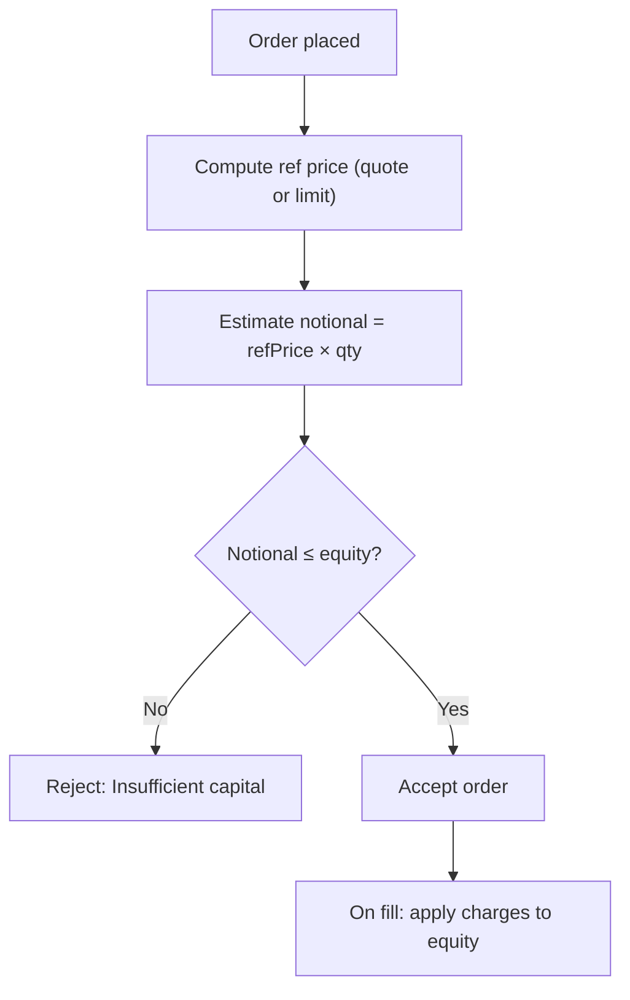

**Diagram sources**
- [execution.service.ts:77-94](file://backend/apps/api/src/modules/trading/application/execution.service.ts#L77-L94)
- [fill-model.ts:35-40](file://backend/apps/api/src/modules/trading/domain/fill-model.ts#L35-L40)

**Section sources**
- [execution.service.ts:77-94](file://backend/apps/api/src/modules/trading/application/execution.service.ts#L77-L94)
- [fill-model.ts:35-40](file://backend/apps/api/src/modules/trading/domain/fill-model.ts#L35-L40)

### Compliance Rules, Regulatory Constraints, and Audit Trails
- Challenge rules are validated and snapshotted at activation to ensure consistency and immutability during the challenge lifecycle.
- Drawdown anchors, profit targets, daily/max drawdown percentages, minimum trading days, expiry, reward percentage, and allowed segments are enforced.
- Audit service records actions with actor type, entity, IDs, and timestamps; writes are append-only and never abort business operations.

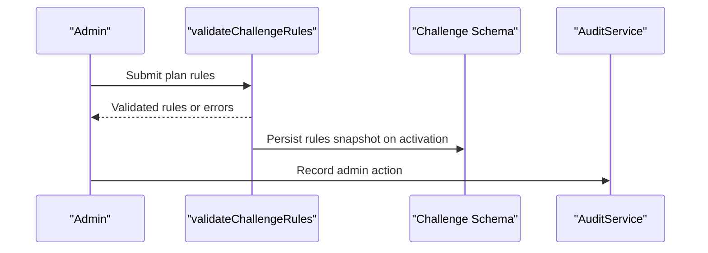

**Diagram sources**
- [plan-rules.vo.ts:5-59](file://backend/apps/api/src/modules/plans/domain/plan-rules.vo.ts#L5-L59)
- [challenge.schema.ts:23-76](file://backend/apps/api/src/modules/plans/infrastructure/schemas/challenge.schema.ts#L23-L76)
- [audit.service.ts:24-43](file://backend/libs/shared/src/audit/audit.service.ts#L24-L43)
- [audit-log.schema.ts:6-41](file://backend/libs/shared/src/audit/audit-log.schema.ts#L6-L41)

**Section sources**
- [plan-rules.vo.ts:5-59](file://backend/apps/api/src/modules/plans/domain/plan-rules.vo.ts#L5-L59)
- [challenge.schema.ts:23-76](file://backend/apps/api/src/modules/plans/infrastructure/schemas/challenge.schema.ts#L23-L76)
- [audit.service.ts:24-43](file://backend/libs/shared/src/audit/audit.service.ts#L24-L43)
- [audit-log.schema.ts:6-41](file://backend/libs/shared/src/audit/audit-log.schema.ts#L6-L41)

### Risk Scoring Models, Stress Testing, and Scenario Analysis
- Risk scoring is implemented via challenge evaluation: PASS when profit target reached and minimum trading days met; FAIL on daily drawdown breach, max drawdown breach, or expiry without meeting target.
- Stress testing and scenario analysis can be performed by replaying recorded market ticks through the VEE and asserting outcomes (pass/fail, equity curves). Tests cover edge cases like simultaneous breaches and expiry precedence.

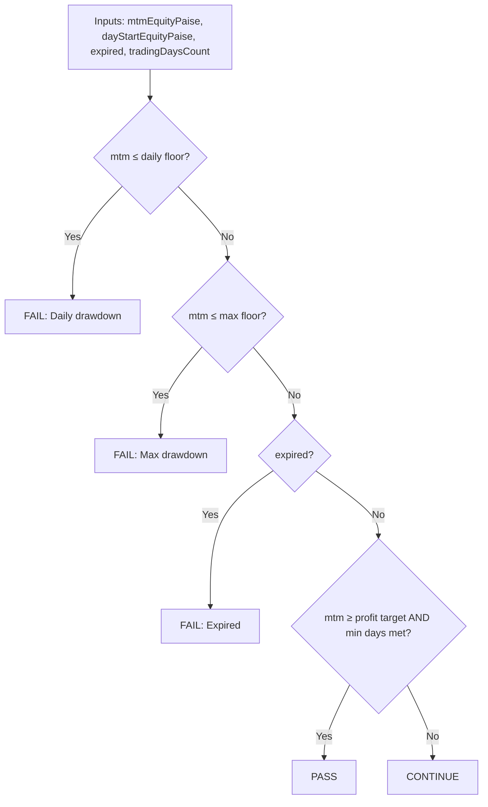

**Diagram sources**
- [challenge-rules-eval.ts:38-66](file://backend/apps/api/src/modules/challenge/domain/challenge-rules-eval.ts#L38-L66)

**Section sources**
- [challenge-rules-eval.ts:38-66](file://backend/apps/api/src/modules/challenge/domain/challenge-rules-eval.ts#L38-L66)

### Alerting Mechanisms, Risk Dashboards, and Reporting
- Real-time alerts: On equity changes or fills, the engine publishes events consumed by evaluators and dashboards.
- Risk dashboards: Challenge dashboard computes MTM equity, unrealized P&L, progress toward profit target, and drawdown usage percentages.
- Reporting: Portfolio service exposes positions with MTM and unrealized P&L, holdings valuation, recent trades, and order book views.

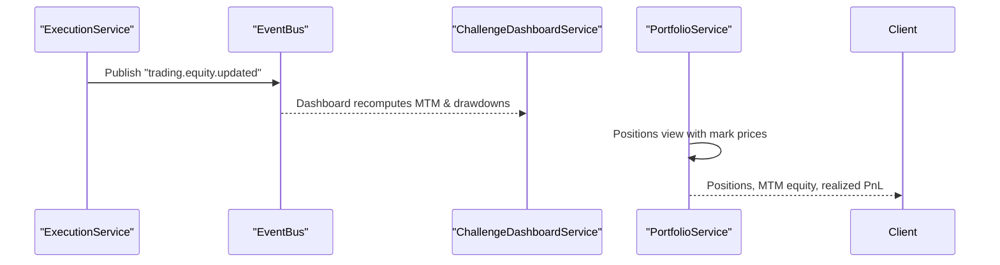

**Diagram sources**
- [execution.service.ts:256-260](file://backend/apps/api/src/modules/trading/application/execution.service.ts#L256-L260)
- [challenge-dashboard.service.ts:45-96](file://backend/apps/api/src/modules/challenge/application/challenge-dashboard.service.ts#L45-L96)
- [portfolio.service.ts:43-67](file://backend/apps/api/src/modules/trading/application/portfolio.service.ts#L43-L67)

**Section sources**
- [challenge-dashboard.service.ts:45-96](file://backend/apps/api/src/modules/challenge/application/challenge-dashboard.service.ts#L45-L96)
- [portfolio.service.ts:43-67](file://backend/apps/api/src/modules/trading/application/portfolio.service.ts#L43-L67)

### Square-Off and Intraday Exposure Control
- At the exchange-defined cutoff minute, intraday positions are automatically flattened to control overnight exposure risk.
- The engine schedules periodic checks and invokes square-off per active challenge.

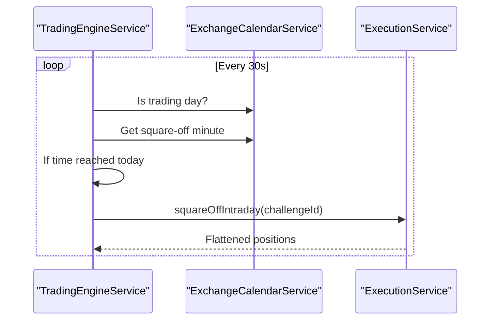

**Diagram sources**
- [trading-engine.service.ts:49-65](file://backend/apps/api/src/modules/trading/application/trading-engine.service.ts#L49-L65)
- [execution.service.ts:289-307](file://backend/apps/api/src/modules/trading/application/execution.service.ts#L289-L307)

**Section sources**
- [trading-engine.service.ts:49-65](file://backend/apps/api/src/modules/trading/application/trading-engine.service.ts#L49-L65)
- [execution.service.ts:289-307](file://backend/apps/api/src/modules/trading/application/execution.service.ts#L289-L307)

## Dependency Analysis
- ExecutionService depends on InstrumentService for quotes, AppConfigService for slippage and charge model, ExchangeCalendarService for market timing, and RedisLockService for concurrency control.
- Pre-trade validation depends on instrument metadata and challenge rules snapshot.
- Challenge evaluation depends on challenge schema fields (equity, rules snapshot, trading days).
- AuditService is independent but invoked by critical flows to record immutable events.

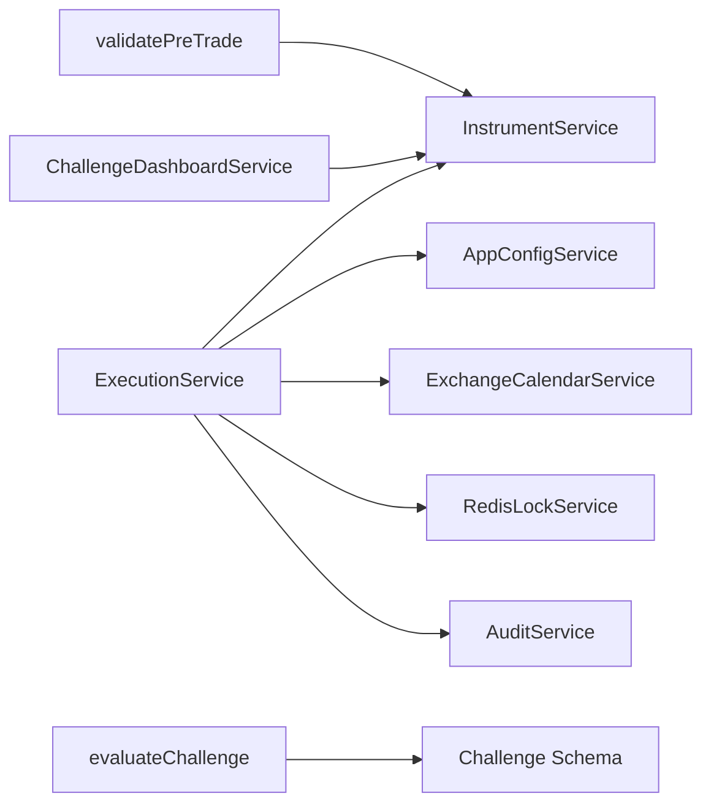

**Diagram sources**
- [execution.service.ts:35-49](file://backend/apps/api/src/modules/trading/application/execution.service.ts#L35-L49)
- [pre-trade.ts:33-77](file://backend/apps/api/src/modules/trading/domain/pre-trade.ts#L33-L77)
- [challenge-rules-eval.ts:38-66](file://backend/apps/api/src/modules/challenge/domain/challenge-rules-eval.ts#L38-L66)
- [challenge-dashboard.service.ts:14-21](file://backend/apps/api/src/modules/challenge/application/challenge-dashboard.service.ts#L14-L21)

**Section sources**
- [execution.service.ts:35-49](file://backend/apps/api/src/modules/trading/application/execution.service.ts#L35-L49)

## Performance Considerations
- Per-account locking ensures correctness under concurrent placements and tick-driven matching; lock durations are bounded to avoid contention.
- Quote caching reduces database load and latency for risk checks and MTM calculations.
- Square-off runs periodically with minimal overhead and only processes relevant instruments.
- Event publishing decouples heavy evaluations from hot paths.

[No sources needed since this section provides general guidance]

## Troubleshooting Guide
Common issues and where to investigate:
- Orders rejected due to insufficient capital: verify estimated notional vs equity and plan segment permissions.
- No fills for LIMIT orders: confirm limit price relative to bid/ask and that quotes are flowing.
- Unexpected equity drops: inspect charges model and realized P&L deltas; review ledger entries.
- Challenge fails unexpectedly: check daily/max drawdown floors and whether expiry conditions were met.
- Audit gaps: audit writes are non-blocking; failures are logged loudly—check application logs for audit write errors.

**Section sources**
- [execution.service.ts:68-130](file://backend/apps/api/src/modules/trading/application/execution.service.ts#L68-L130)
- [fill-model.ts:14-40](file://backend/apps/api/src/modules/trading/domain/fill-model.ts#L14-L40)
- [challenge-rules-eval.ts:38-66](file://backend/apps/api/src/modules/challenge/domain/challenge-rules-eval.ts#L38-L66)
- [audit.service.ts:24-43](file://backend/libs/shared/src/audit/audit.service.ts#L24-L43)

## Conclusion
The platform implements robust risk management and compliance through deterministic pre-trade checks, conservative capital adequacy enforcement, configurable challenge rules with drawdown protections, automated intraday square-off, immutable audit trails, and real-time dashboards and events. These components collectively ensure safe, auditable, and compliant paper trading while enabling scenario-based stress testing and clear visibility into risk metrics.

[No sources needed since this section summarizes without analyzing specific files]

## Appendices

### Example: Configuring Risk Rules and Limits
- Define plan rules with bounded percentages for profit target, daily drawdown, max drawdown, reward percentage, minimum trading days, expiry days, and allowed segments. Validation ensures consistency (e.g., daily drawdown cannot exceed max drawdown).
- Enforce instrument-level constraints such as freeze quantity and segment enablement.
- Use the challenge dashboard to monitor MTM equity, drawdown usage, and progress toward targets.

**Section sources**
- [plan-rules.vo.ts:5-59](file://backend/apps/api/src/modules/plans/domain/plan-rules.vo.ts#L5-L59)
- [pre-trade.ts:33-77](file://backend/apps/api/src/modules/trading/domain/pre-trade.ts#L33-L77)
- [challenge-dashboard.service.ts:45-96](file://backend/apps/api/src/modules/challenge/application/challenge-dashboard.service.ts#L45-L96)

### Example: Limit Enforcement Flow
- Place a LIMIT order; if the current quote crosses the limit, immediate fill occurs; otherwise, the order remains OPEN until the next tick triggers a match. Slippage is applied for MARKET orders.

**Section sources**
- [execution.service.ts:120-128](file://backend/apps/api/src/modules/trading/application/execution.service.ts#L120-L128)
- [fill-model.ts:22-33](file://backend/apps/api/src/modules/trading/domain/fill-model.ts#L22-L33)

### Example: Compliance Monitoring via Audit
- Every critical mutation path can record an audit entry with actor type, entity, IDs, and timestamps. Reads support querying by entity or actor for compliance reviews.

**Section sources**
- [audit.service.ts:24-43](file://backend/libs/shared/src/audit/audit.service.ts#L24-L43)
- [audit-log.schema.ts:6-41](file://backend/libs/shared/src/audit/audit-log.schema.ts#L6-L41)