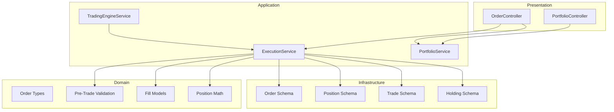
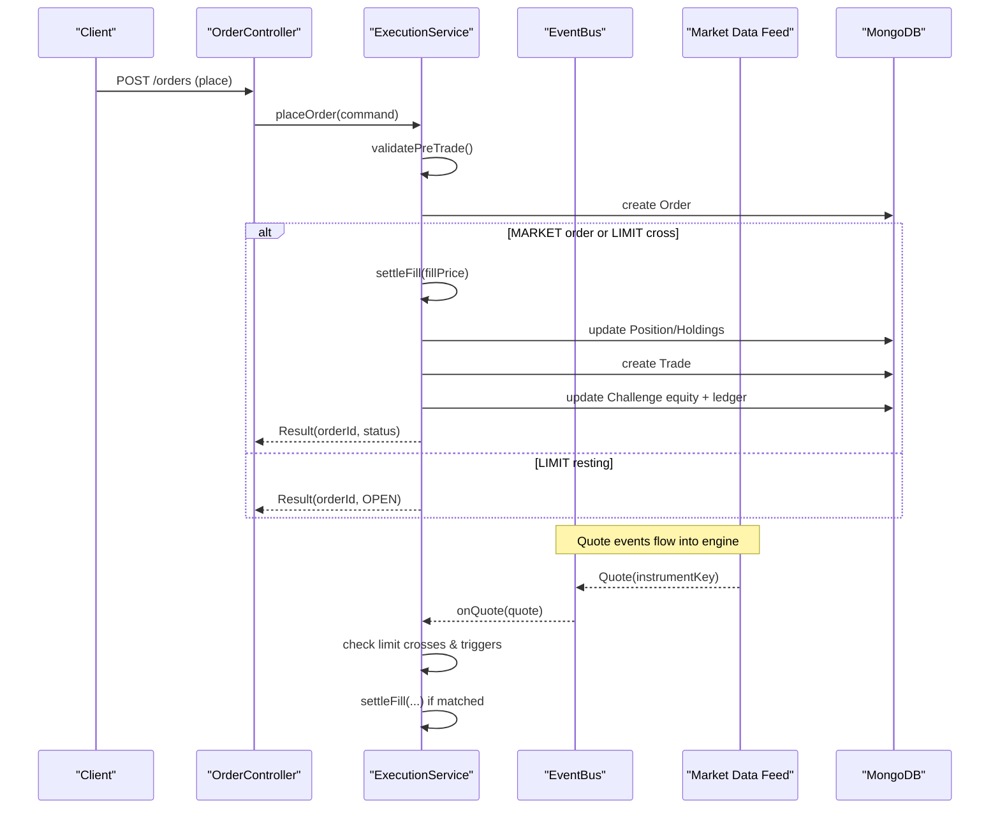
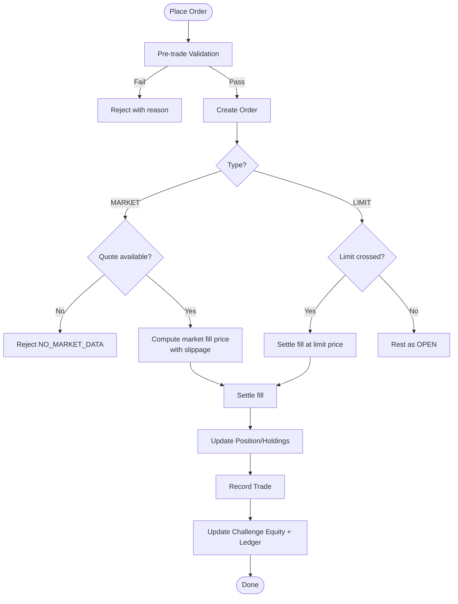
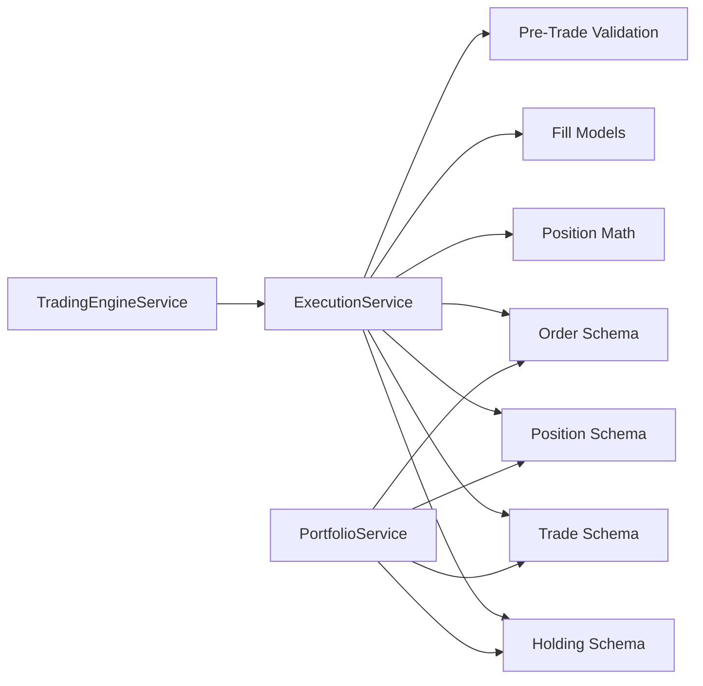

# Trading Operations

<cite>
**Referenced Files in This Document**
- [trading-engine.module.ts](file://backend/apps/api/src/modules/trading/trading-engine.module.ts)
- [trading-engine.service.ts](file://backend/apps/api/src/modules/trading/application/trading-engine.service.ts)
- [execution.service.ts](file://backend/apps/api/src/modules/trading/application/execution.service.ts)
- [portfolio.service.ts](file://backend/apps/api/src/modules/trading/application/portfolio.service.ts)
- [order.types.ts](file://backend/apps/api/src/modules/trading/domain/order.types.ts)
- [position-math.ts](file://backend/apps/api/src/modules/trading/domain/position-math.ts)
- [fill-model.ts](file://backend/apps/api/src/modules/trading/domain/fill-model.ts)
- [pre-trade.ts](file://backend/apps/api/src/modules/trading/domain/pre-trade.ts)
- [order.schema.ts](file://backend/apps/api/src/modules/trading/infrastructure/schemas/order.schema.ts)
- [position.schema.ts](file://backend/apps/api/src/modules/trading/infrastructure/schemas/position.schema.ts)
- [trade.schema.ts](file://backend/apps/api/src/modules/trading/infrastructure/schemas/trade.schema.ts)
- [holding.schema.ts](file://backend/apps/api/src/modules/trading/infrastructure/schemas/holding.schema.ts)
- [order.controller.ts](file://backend/apps/api/src/modules/trading/presentation/order.controller.ts)
- [portfolio.controller.ts](file://backend/apps/api/src/modules/trading/presentation/portfolio.controller.ts)
- [order.dtos.ts](file://backend/apps/api/src/modules/trading/presentation/dto/order.dtos.ts)
</cite>

## Table of Contents
1. Introduction
2. Project Structure
3. Core Components
4. Architecture Overview
5. Detailed Component Analysis
6. Dependency Analysis
7. Performance Considerations
8. Troubleshooting Guide
9. Conclusion
10. Appendices

## Introduction
This document explains the Trading Operations module, focusing on the order execution engine, portfolio management, position tracking, and risk controls. It covers the full order lifecycle from placement to fill, pre-trade validations, post-trade processing, paper trading simulation via a virtual execution engine (VEE), P&L calculations, portfolio analytics, position math, fill models, trade reconciliation, risk limits, margin checks, compliance rules, event-driven processing, real-time updates, and examples of order types and strategies.

## Project Structure
The Trading module is organized by layers:
- Presentation: REST controllers for orders and portfolio views
- Application: Execution engine, portfolio service, and trading engine driver
- Domain: Order types, pre-trade validation, position math, and fill models
- Infrastructure: Mongoose schemas for orders, positions, trades, and holdings
- Module wiring: NestJS modules that assemble providers and imports



**Diagram sources**
- [order.controller.ts:23-47](file://backend/apps/api/src/modules/trading/presentation/order.controller.ts#L23-L47)
- [portfolio.controller.ts:5-24](file://backend/apps/api/src/modules/trading/presentation/portfolio.controller.ts#L5-L24)
- [execution.service.ts:31-49](file://backend/apps/api/src/modules/trading/application/execution.service.ts#L31-L49)
- [portfolio.service.ts:14-24](file://backend/apps/api/src/modules/trading/application/portfolio.service.ts#L14-L24)
- [trading-engine.service.ts:16-28](file://backend/apps/api/src/modules/trading/application/trading-engine.service.ts#L16-L28)
- [order.types.ts:1-32](file://backend/apps/api/src/modules/trading/domain/order.types.ts#L1-L32)
- [pre-trade.ts:29-78](file://backend/apps/api/src/modules/trading/domain/pre-trade.ts#L29-L78)
- [position-math.ts:22-72](file://backend/apps/api/src/modules/trading/domain/position-math.ts#L22-L72)
- [fill-model.ts:9-40](file://backend/apps/api/src/modules/trading/domain/fill-model.ts#L9-L40)
- [order.schema.ts:13-71](file://backend/apps/api/src/modules/trading/infrastructure/schemas/order.schema.ts#L13-L71)
- [position.schema.ts:4-34](file://backend/apps/api/src/modules/trading/infrastructure/schemas/position.schema.ts#L4-L34)
- [trade.schema.ts:4-40](file://backend/apps/api/src/modules/trading/infrastructure/schemas/trade.schema.ts#L4-L40)
- [holding.schema.ts:4-23](file://backend/apps/api/src/modules/trading/infrastructure/schemas/holding.schema.ts#L4-L23)

**Section sources**
- [trading-engine.module.ts:7-11](file://backend/apps/api/src/modules/trading/trading-engine.module.ts#L7-L11)

## Core Components
- ExecutionService: Virtual execution engine handling order placement, cancellation, tick-driven matching, settlement, equity updates, and square-off.
- PortfolioService: Aggregates order book, positions with MTM, holdings, and recent trades.
- TradingEngineService: Event-driven loop subscribing to quotes for open orders, driving limit fills and SL/target triggers; schedules intraday square-off.
- Domain layer: Pre-trade validation, position math, and fill models ensure deterministic, testable behavior.
- Infrastructure: Schemas persist orders, positions, trades, and overnight holdings.

**Section sources**
- [execution.service.ts:24-49](file://backend/apps/api/src/modules/trading/application/execution.service.ts#L24-L49)
- [portfolio.service.ts:14-24](file://backend/apps/api/src/modules/trading/application/portfolio.service.ts#L14-L24)
- [trading-engine.service.ts:10-28](file://backend/apps/api/src/modules/trading/application/trading-engine.service.ts#L10-L28)
- [pre-trade.ts:29-78](file://backend/apps/api/src/modules/trading/domain/pre-trade.ts#L29-L78)
- [position-math.ts:22-72](file://backend/apps/api/src/modules/trading/domain/position-math.ts#L22-L72)
- [fill-model.ts:9-40](file://backend/apps/api/src/modules/trading/domain/fill-model.ts#L9-L40)

## Architecture Overview
The system uses an event-driven architecture where market quotes drive the VEE. The engine subscribes to quote channels for instruments with open orders, evaluates limit crosses and trigger conditions, and settles fills under per-account locks to maintain consistent equity and positions.



**Diagram sources**
- [order.controller.ts:28-46](file://backend/apps/api/src/modules/trading/presentation/order.controller.ts#L28-L46)
- [execution.service.ts:68-129](file://backend/apps/api/src/modules/trading/application/execution.service.ts#L68-L129)
- [execution.service.ts:148-177](file://backend/apps/api/src/modules/trading/application/execution.service.ts#L148-L177)
- [execution.service.ts:181-262](file://backend/apps/api/src/modules/trading/application/execution.service.ts#L181-L262)
- [trading-engine.service.ts:39-47](file://backend/apps/api/src/modules/trading/application/trading-engine.service.ts#L39-L47)

## Detailed Component Analysis

### Order Lifecycle: Placement to Fill
- Placement:
  - Validates challenge state, market hours, instrument availability, segment permissions, lot size, freeze quantity, limit price sanity, trigger price sanity, and capital sufficiency.
  - Creates an order record; for MARKET orders, immediately attempts a simulated fill using current quotes; for LIMIT orders, either fills instantly if crossed or rests.
- Matching:
  - On each quote, engine scans open orders for the instrument and applies limit crossing logic and trigger conditions.
- Settlement:
  - Updates positions using weighted-average cost, records realized P&L deltas, persists trades, marks orders filled, updates challenge equity and peak equity, appends ledger entries, and publishes equity updates.



**Diagram sources**
- [pre-trade.ts:29-78](file://backend/apps/api/src/modules/trading/domain/pre-trade.ts#L29-L78)
- [execution.service.ts:68-129](file://backend/apps/api/src/modules/trading/application/execution.service.ts#L68-L129)
- [fill-model.ts:9-40](file://backend/apps/api/src/modules/trading/domain/fill-model.ts#L9-L40)
- [execution.service.ts:181-262](file://backend/apps/api/src/modules/trading/application/execution.service.ts#L181-L262)

**Section sources**
- [order.controller.ts:28-46](file://backend/apps/api/src/modules/trading/presentation/order.controller.ts#L28-L46)
- [execution.service.ts:68-129](file://backend/apps/api/src/modules/trading/application/execution.service.ts#L68-L129)
- [execution.service.ts:148-177](file://backend/apps/api/src/modules/trading/application/execution.service.ts#L148-L177)
- [execution.service.ts:181-262](file://backend/apps/api/src/modules/trading/application/execution.service.ts#L181-L262)

### Position Math and P&L Calculations
- Positions are signed net quantities with weighted-average cost.
- applyFill computes realized P&L when reducing/closing/flipping positions and updates average cost on same-direction additions.
- unrealizedPnl calculates mark-to-market P&L for open positions.

```mermaid
flowchart TD
A[applyFill(prev, signedQty, fillPrice)] --> Dir{"Same direction?"}
Dir --> |Yes| WeightedAvg["Compute new weighted avg cost"]
WeightedAvg --> ReturnFlat["Return position with no realized delta"]
Dir --> |No| CloseCalc["Compute closing qty and per-unit realized"]
CloseCalc --> RealizedDelta["Accumulate realized delta"]
RealizedDelta --> Flip{"Remaining incoming?"}
Flip --> |No| NewFlat["netQty = oldQty + signedQty"]
Flip --> |Yes| NewSide["Open opposite side at fill price"]
NewFlat --> ReturnRes["Return updated position + realized delta"]
NewSide --> ReturnRes
```

**Diagram sources**
- [position-math.ts:22-72](file://backend/apps/api/src/modules/trading/domain/position-math.ts#L22-L72)

**Section sources**
- [position-math.ts:22-72](file://backend/apps/api/src/modules/trading/domain/position-math.ts#L22-L72)
- [execution.service.ts:181-219](file://backend/apps/api/src/modules/trading/application/execution.service.ts#L181-L219)

### Fill Models and Slippage
- Market fills use bid/ask with configurable slippage in basis points against taker side.
- Limit fills match when ask ≤ buy limit or bid ≥ sell limit; returns limit price.
- Charges computed from a configurable model combining flat fee and turnover-based charge.

**Section sources**
- [fill-model.ts:9-40](file://backend/apps/api/src/modules/trading/domain/fill-model.ts#L9-L40)
- [execution.service.ts:114-117](file://backend/apps/api/src/modules/trading/application/execution.service.ts#L114-L117)
- [execution.service.ts:156-173](file://backend/apps/api/src/modules/trading/application/execution.service.ts#L156-L173)

### Risk Management and Compliance Checks
- Pre-trade validation enforces:
  - Tradable challenge states
  - Market open for segment
  - Instrument enabled
  - Segment allowed by plan snapshot
  - Lot size and freeze quantity constraints
  - Positive limit and trigger prices
  - Capital sufficiency (estimated notional vs equity)
- Square-off:
  - Intraday positions are flattened at a configured cutoff minute per segment.
- Force flatten:
  - Used on challenge completion to close all positions at market.

**Section sources**
- [pre-trade.ts:29-78](file://backend/apps/api/src/modules/trading/domain/pre-trade.ts#L29-L78)
- [trading-engine.service.ts:49-65](file://backend/apps/api/src/modules/trading/application/trading-engine.service.ts#L49-L65)
- [execution.service.ts:269-285](file://backend/apps/api/src/modules/trading/application/execution.service.ts#L269-L285)

### Paper Trading Simulation
- All executions occur in-memory with simulated fills based on live quotes and configured slippage.
- No external broker integration; ideal for strategy testing and evaluation.

**Section sources**
- [execution.service.ts:24-30](file://backend/apps/api/src/modules/trading/application/execution.service.ts#L24-L30)
- [execution.service.ts:107-128](file://backend/apps/api/src/modules/trading/application/execution.service.ts#L107-L128)

### Portfolio Analytics and Reporting
- Order book: Open and recent executed orders.
- Positions view: Net quantities, average price, mark price, unrealized P&L, realized P&L, total unrealized, and MTM equity.
- Holdings view: Overnight carry-forward positions with invested/current values and P&L.
- Recent trades: Chronological trade history.

**Section sources**
- [portfolio.service.ts:34-88](file://backend/apps/api/src/modules/trading/application/portfolio.service.ts#L34-L88)
- [portfolio.controller.ts:10-23](file://backend/apps/api/src/modules/trading/presentation/portfolio.controller.ts#L10-L23)

### Event-Driven Processing and Real-Time Updates
- TradingEngineService subscribes to quote channels for instruments with open orders.
- Each quote triggers limit crossing and trigger evaluation under per-account locks.
- Equity updates published to event bus for downstream consumers.

**Section sources**
- [trading-engine.service.ts:30-47](file://backend/apps/api/src/modules/trading/application/trading-engine.service.ts#L30-L47)
- [execution.service.ts:148-177](file://backend/apps/api/src/modules/trading/application/execution.service.ts#L148-L177)
- [execution.service.ts:256-260](file://backend/apps/api/src/modules/trading/application/execution.service.ts#L256-L260)

### Examples: Order Types, Strategies, and Reporting
- Order types:
  - MARKET: Immediate simulated fill at quoted price with slippage.
  - LIMIT: Resting or instant fill if crossed; supports STOP_LOSS or TARGET triggers.
- Strategies:
  - Stop-loss and target exits via triggers evaluated on ticks.
  - Intraday square-off at market cutoff.
- Reporting:
  - GET /portfolio/:challengeId/positions for MTM and P&L.
  - GET /portfolio/:challengeId/holdings for overnight positions.
  - GET /portfolio/:challengeId/trades for trade history.
  - GET /orders/:challengeId/book for order book.

**Section sources**
- [order.types.ts:1-32](file://backend/apps/api/src/modules/trading/domain/order.types.ts#L1-L32)
- [execution.service.ts:107-177](file://backend/apps/api/src/modules/trading/application/execution.service.ts#L107-L177)
- [trading-engine.service.ts:49-65](file://backend/apps/api/src/modules/trading/application/trading-engine.service.ts#L49-L65)
- [portfolio.controller.ts:10-23](file://backend/apps/api/src/modules/trading/presentation/portfolio.controller.ts#L10-L23)
- [order.controller.ts:43-46](file://backend/apps/api/src/modules/trading/presentation/order.controller.ts#L43-L46)

## Dependency Analysis
The module composes services and domain logic with clear boundaries. ExecutionService depends on domain functions and infrastructure schemas; PortfolioService reads persisted state and live quotes; TradingEngineService orchestrates event subscriptions and scheduling.



**Diagram sources**
- [trading-engine.service.ts:22-28](file://backend/apps/api/src/modules/trading/application/trading-engine.service.ts#L22-L28)
- [execution.service.ts:35-49](file://backend/apps/api/src/modules/trading/application/execution.service.ts#L35-L49)
- [portfolio.service.ts:16-24](file://backend/apps/api/src/modules/trading/application/portfolio.service.ts#L16-L24)
- [order.schema.ts:13-71](file://backend/apps/api/src/modules/trading/infrastructure/schemas/order.schema.ts#L13-L71)
- [position.schema.ts:4-34](file://backend/apps/api/src/modules/trading/infrastructure/schemas/position.schema.ts#L4-L34)
- [trade.schema.ts:4-40](file://backend/apps/api/src/modules/trading/infrastructure/schemas/trade.schema.ts#L4-L40)
- [holding.schema.ts:4-23](file://backend/apps/api/src/modules/trading/infrastructure/schemas/holding.schema.ts#L4-L23)

**Section sources**
- [trading-engine.module.ts:7-11](file://backend/apps/api/src/modules/trading/trading-engine.module.ts#L7-L11)

## Performance Considerations
- Per-account Redis locks prevent race conditions during concurrent placements and tick processing.
- Quote caching reduces repeated lookups for mark pricing.
- Partial indexes optimize open-order queries.
- Batch operations like square-off iterate positions efficiently under a single lock.

**Section sources**
- [execution.service.ts:51-64](file://backend/apps/api/src/modules/trading/application/execution.service.ts#L51-L64)
- [order.schema.ts:67-71](file://backend/apps/api/src/modules/trading/infrastructure/schemas/order.schema.ts#L67-L71)
- [portfolio.service.ts:26-32](file://backend/apps/api/src/modules/trading/application/portfolio.service.ts#L26-L32)

## Troubleshooting Guide
Common rejection reasons and their causes:
- CHALLENGE_NOT_TRADABLE: Challenge not in PENDING/ACTIVE state.
- MARKET_CLOSED: Market closed for the instrument’s segment.
- INSTRUMENT_DISABLED: Instrument disabled for trading.
- SEGMENT_NOT_ALLOWED: Plan does not allow the instrument’s segment.
- FREEZE_QTY_EXCEEDED: Quantity exceeds freeze limit.
- LIMIT_PRICE_REQUIRED: Missing or non-positive limit price for LIMIT orders.
- TRIGGER_PRICE_INVALID: Non-positive trigger price.
- INSUFFICIENT_CAPITAL: Estimated cost exceeds available equity.
- NO_MARKET_DATA: MARKET order placed without live quotes.
- NOT_CANCELLABLE: Attempted to cancel a non-OPEN order.

Resolution steps:
- Ensure challenge is ACTIVE/PENDING and market is open for the segment.
- Verify instrument is enabled and segment allowed by plan.
- Adjust quantity to respect lot size and freeze limits.
- Provide valid positive limit and trigger prices.
- Confirm sufficient equity for estimated notional.
- For MARKET orders, ensure live quotes are available.

**Section sources**
- [pre-trade.ts:29-78](file://backend/apps/api/src/modules/trading/domain/pre-trade.ts#L29-L78)
- [execution.service.ts:107-117](file://backend/apps/api/src/modules/trading/application/execution.service.ts#L107-L117)
- [execution.service.ts:132-143](file://backend/apps/api/src/modules/trading/application/execution.service.ts#L132-L143)
- [order.controller.ts:11-21](file://backend/apps/api/src/modules/trading/presentation/order.controller.ts#L11-L21)

## Conclusion
The Trading Operations module implements a robust, event-driven virtual execution engine with deterministic pre-trade checks, accurate position math, realistic fill modeling, and comprehensive portfolio analytics. It supports paper trading with strict risk controls, automated intraday square-off, and real-time updates via an event bus. The layered design ensures clarity, testability, and scalability for trading simulations and evaluations.

## Appendices

### API Endpoints Summary
- POST /orders: Place order (MARKET or LIMIT with optional trigger).
- DELETE /orders/:orderId: Cancel an open order.
- GET /orders/:challengeId/book: Retrieve open and recent executed orders.
- GET /portfolio/:challengeId/positions: Positions with MTM and P&L.
- GET /portfolio/:challengeId/holdings: Overnight holdings.
- GET /portfolio/:challengeId/trades: Recent trades.

**Section sources**
- [order.controller.ts:28-46](file://backend/apps/api/src/modules/trading/presentation/order.controller.ts#L28-L46)
- [portfolio.controller.ts:10-23](file://backend/apps/api/src/modules/trading/presentation/portfolio.controller.ts#L10-L23)

### Data Models Overview
- Order: Captures side, type, product, quantity, limit price, trigger, status, timestamps.
- Position: Tracks net quantity, average price, realized P&L, daily buy/sell quantities.
- Trade: Records execution details including price, charges, and realized P&L.
- Holding: Mirrors carry-forward positions for overnight display.

**Section sources**
- [order.schema.ts:13-71](file://backend/apps/api/src/modules/trading/infrastructure/schemas/order.schema.ts#L13-L71)
- [position.schema.ts:4-34](file://backend/apps/api/src/modules/trading/infrastructure/schemas/position.schema.ts#L4-L34)
- [trade.schema.ts:4-40](file://backend/apps/api/src/modules/trading/infrastructure/schemas/trade.schema.ts#L4-L40)
- [holding.schema.ts:4-23](file://backend/apps/api/src/modules/trading/infrastructure/schemas/holding.schema.ts#L4-L23)