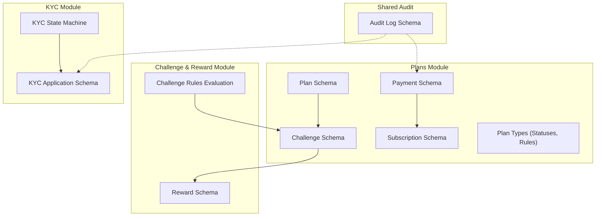
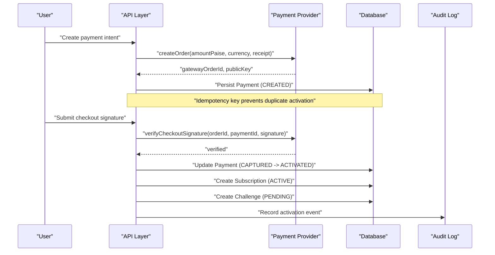
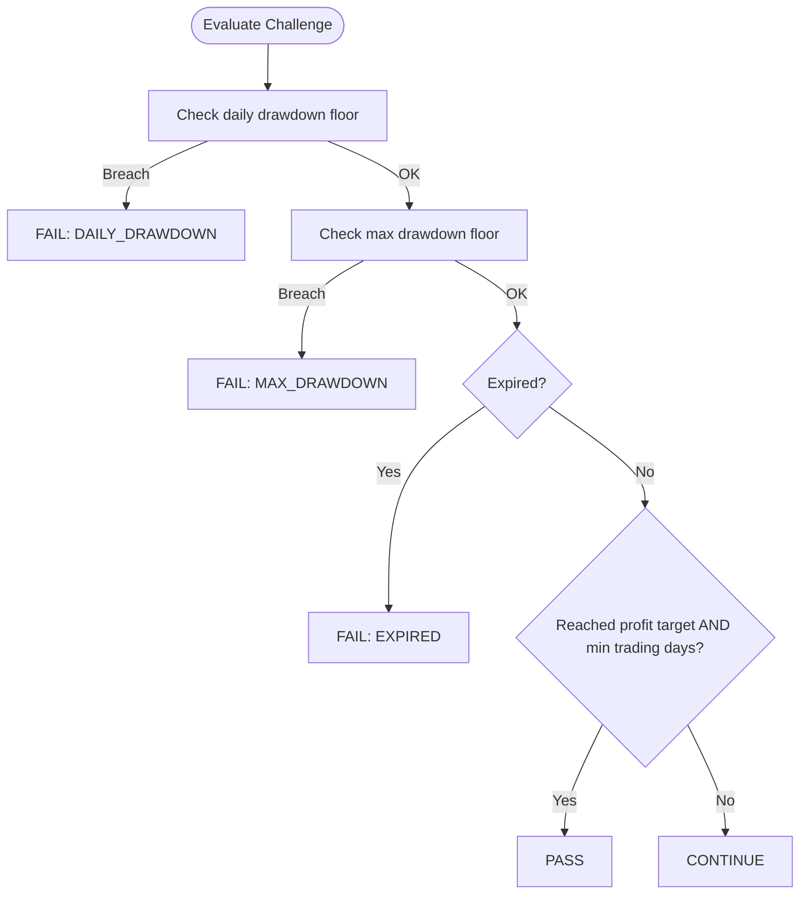
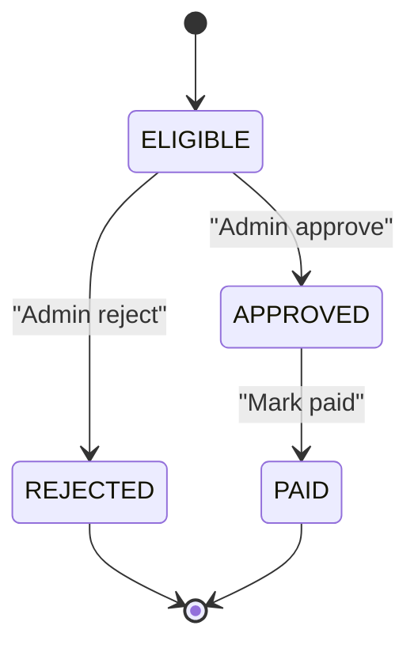
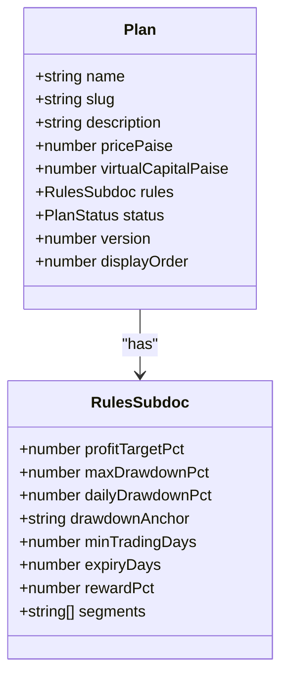
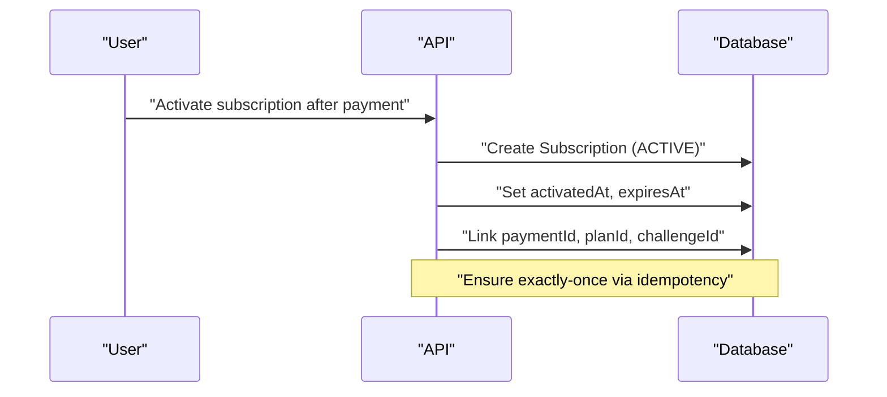
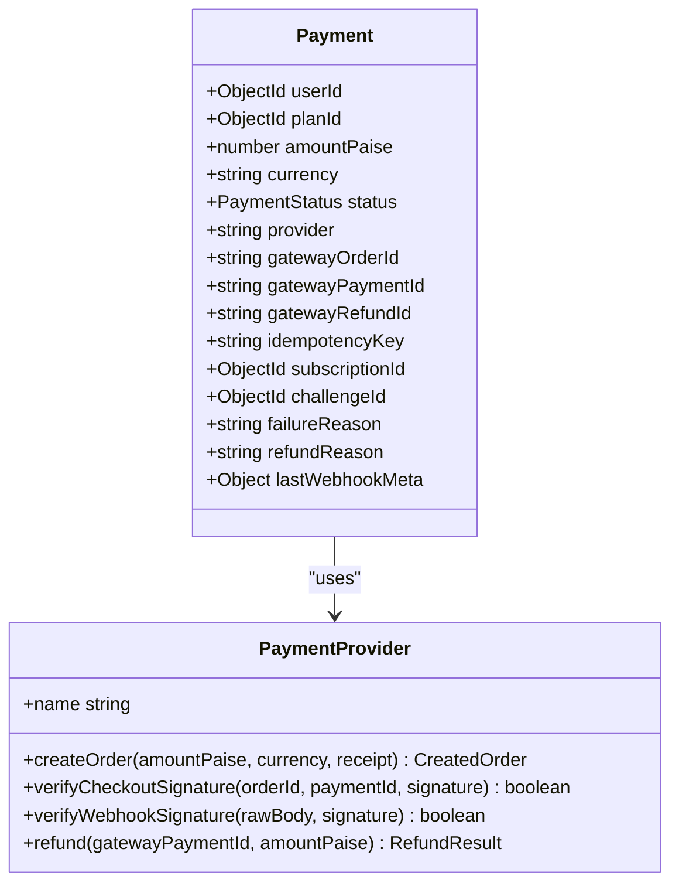
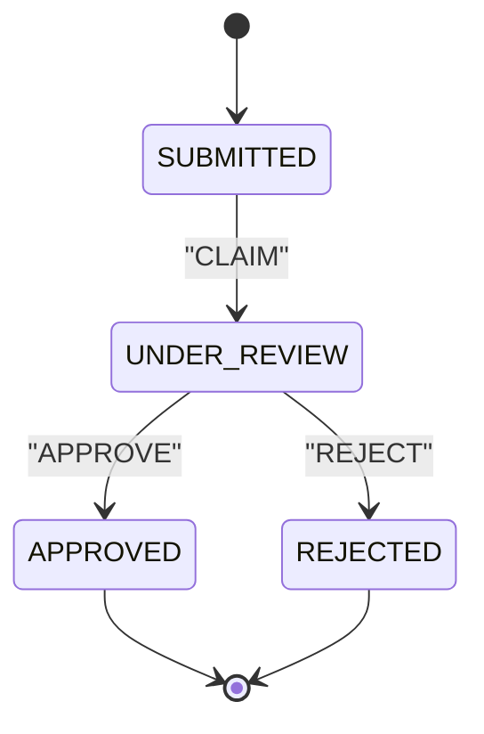
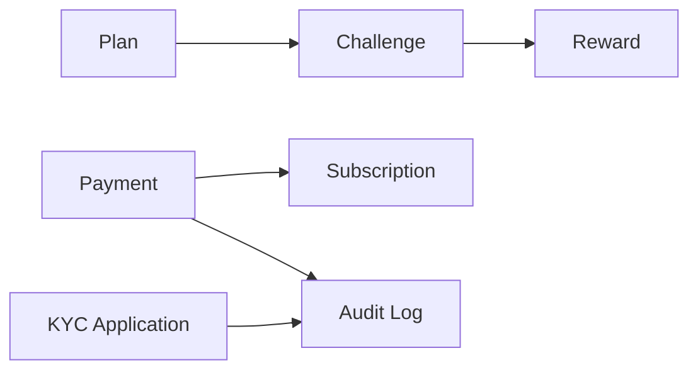
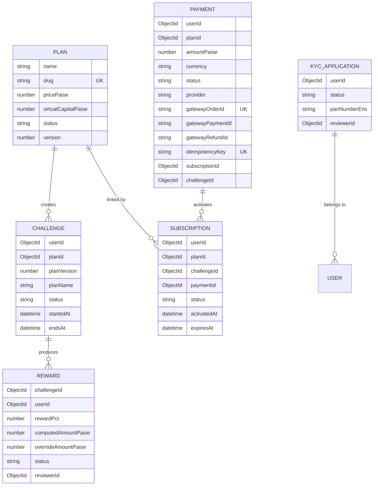

# Business Entities

<cite>
**Referenced Files in This Document**
- [reward.schema.ts](file://backend/apps/api/src/modules/challenge/infrastructure/schemas/reward.schema.ts)
- [challenge-rules-eval.ts](file://backend/apps/api/src/modules/challenge/domain/challenge-rules-eval.ts)
- [plan.schema.ts](file://backend/apps/api/src/modules/plans/infrastructure/schemas/plan.schema.ts)
- [subscription.schema.ts](file://backend/apps/api/src/modules/plans/infrastructure/schemas/subscription.schema.ts)
- [payment.schema.ts](file://backend/apps/api/src/modules/plans/infrastructure/schemas/payment.schema.ts)
- [challenge.schema.ts](file://backend/apps/api/src/modules/plans/infrastructure/schemas/challenge.schema.ts)
- [plan.types.ts](file://backend/apps/api/src/modules/plans/domain/plan.types.ts)
- [kyc-application.schema.ts](file://backend/apps/api/src/modules/kyc/infrastructure/kyc-application.schema.ts)
- [kyc-state.ts](file://backend/apps/api/src/modules/kyc/domain/kyc-state.ts)
- [audit-log.schema.ts](file://backend/libs/shared/src/audit/audit-log.schema.ts)
- [payment.port.ts](file://backend/apps/api/src/modules/plans/infrastructure/payment/payment.port.ts)
- [razorpay.provider.ts](file://backend/apps/api/src/modules/plans/infrastructure/payment/razorpay.provider.ts)
</cite>

## Table of Contents
1. [Introduction](#introduction)
2. [Project Structure](#project-structure)
3. [Core Components](#core-components)
4. [Architecture Overview](#architecture-overview)
5. [Detailed Component Analysis](#detailed-component-analysis)
6. [Dependency Analysis](#dependency-analysis)
7. [Performance Considerations](#performance-considerations)
8. [Troubleshooting Guide](#troubleshooting-guide)
9. [Conclusion](#conclusion)
10. [Appendices](#appendices)

## Introduction
This document provides detailed data model documentation for the core business entities: Challenges, Rewards, Plans, Subscriptions, Payments, and KYC Applications. It explains schemas, state transitions, business rules, audit requirements, and privacy considerations for sensitive data such as KYC documents and payment information. The goal is to make the system understandable for both technical and non-technical readers while remaining grounded in the actual codebase.

## Project Structure
The relevant entities are implemented across feature modules with a consistent layered structure:
- Domain types and pure logic (e.g., plan states, challenge evaluation)
- Infrastructure schemas (Mongoose models)
- Application services that orchestrate workflows
- Presentation controllers and DTOs for APIs

**Diagram sources**
- [plan.schema.ts:18-49](file://backend/apps/api/src/modules/plans/infrastructure/schemas/plan.schema.ts#L18-L49)
- [subscription.schema.ts:5-27](file://backend/apps/api/src/modules/plans/infrastructure/schemas/subscription.schema.ts#L5-L27)
- [payment.schema.ts:5-56](file://backend/apps/api/src/modules/plans/infrastructure/schemas/payment.schema.ts#L5-L56)
- [challenge.schema.ts:23-70](file://backend/apps/api/src/modules/plans/infrastructure/schemas/challenge.schema.ts#L23-L70)
- [plan.types.ts:22-48](file://backend/apps/api/src/modules/plans/domain/plan.types.ts#L22-L48)
- [challenge-rules-eval.ts:35-66](file://backend/apps/api/src/modules/challenge/domain/challenge-rules-eval.ts#L35-L66)
- [reward.schema.ts:20-50](file://backend/apps/api/src/modules/challenge/infrastructure/schemas/reward.schema.ts#L20-L50)
- [kyc-application.schema.ts:38-61](file://backend/apps/api/src/modules/kyc/infrastructure/kyc-application.schema.ts#L38-L61)
- [kyc-state.ts:3-17](file://backend/apps/api/src/modules/kyc/domain/kyc-state.ts#L3-L17)
- [audit-log.schema.ts:7-34](file://backend/libs/shared/src/audit/audit-log.schema.ts#L7-L34)

**Section sources**
- [plan.schema.ts:18-49](file://backend/apps/api/src/modules/plans/infrastructure/schemas/plan.schema.ts#L18-L49)
- [subscription.schema.ts:5-27](file://backend/apps/api/src/modules/plans/infrastructure/schemas/subscription.schema.ts#L5-L27)
- [payment.schema.ts:5-56](file://backend/apps/api/src/modules/plans/infrastructure/schemas/payment.schema.ts#L5-L56)
- [challenge.schema.ts:23-70](file://backend/apps/api/src/modules/plans/infrastructure/schemas/challenge.schema.ts#L23-L70)
- [plan.types.ts:22-48](file://backend/apps/api/src/modules/plans/domain/plan.types.ts#L22-L48)
- [challenge-rules-eval.ts:35-66](file://backend/apps/api/src/modules/challenge/domain/challenge-rules-eval.ts#L35-L66)
- [reward.schema.ts:20-50](file://backend/apps/api/src/modules/challenge/infrastructure/schemas/reward.schema.ts#L20-L50)
- [kyc-application.schema.ts:38-61](file://backend/apps/api/src/modules/kyc/infrastructure/kyc-application.schema.ts#L38-L61)
- [kyc-state.ts:3-17](file://backend/apps/api/src/modules/kyc/domain/kyc-state.ts#L3-L17)
- [audit-log.schema.ts:7-34](file://backend/libs/shared/src/audit/audit-log.schema.ts#L7-L34)

## Core Components
- Plan: Defines subscription tiers, pricing, virtual capital, and rule sets governing challenges.
- Challenge: An instance of a plan with snapshotted rules and live tracking fields for equity, peak equity, daily start equity, realized PnL, trading days, and status.
- Subscription: Links a user to a plan via a payment, with activation and expiry dates and lifecycle status.
- Payment: Records transaction intent, gateway identifiers, idempotency keys, and outcomes; integrates with a pluggable payment provider.
- Reward: Tracks gamification payouts tied to passed challenges, including computed amounts, admin overrides, and timeline events.
- KYC Application: Manages identity verification with encrypted PAN, document references, reviewer info, and a strict state machine.

**Section sources**
- [plan.schema.ts:18-49](file://backend/apps/api/src/modules/plans/infrastructure/schemas/plan.schema.ts#L18-L49)
- [challenge.schema.ts:23-70](file://backend/apps/api/src/modules/plans/infrastructure/schemas/challenge.schema.ts#L23-L70)
- [subscription.schema.ts:5-27](file://backend/apps/api/src/modules/plans/infrastructure/schemas/subscription.schema.ts#L5-L27)
- [payment.schema.ts:5-56](file://backend/apps/api/src/modules/plans/infrastructure/schemas/payment.schema.ts#L5-L56)
- [reward.schema.ts:20-50](file://backend/apps/api/src/modules/challenge/infrastructure/schemas/reward.schema.ts#L20-L50)
- [kyc-application.schema.ts:38-61](file://backend/apps/api/src/modules/kyc/infrastructure/kyc-application.schema.ts#L38-L61)

## Architecture Overview
The system separates domain logic from persistence and integration points:
- Domain layer defines immutable types and pure functions (e.g., challenge evaluation).
- Infrastructure layer persists data via Mongoose schemas and integrates with external providers (e.g., Razorpay).
- Shared audit logging ensures compliance and traceability for financial and identity-related actions.

**Diagram sources**
- [payment.port.ts:20-32](file://backend/apps/api/src/modules/plans/infrastructure/payment/payment.port.ts#L20-L32)
- [razorpay.provider.ts:27-45](file://backend/apps/api/src/modules/plans/infrastructure/payment/razorpay.provider.ts#L27-L45)
- [payment.schema.ts:5-56](file://backend/apps/api/src/modules/plans/infrastructure/schemas/payment.schema.ts#L5-L56)
- [subscription.schema.ts:5-27](file://backend/apps/api/src/modules/plans/infrastructure/schemas/subscription.schema.ts#L5-L27)
- [challenge.schema.ts:23-70](file://backend/apps/api/src/modules/plans/infrastructure/schemas/challenge.schema.ts#L23-L70)
- [audit-log.schema.ts:7-34](file://backend/libs/shared/src/audit/audit-log.schema.ts#L7-L34)

## Detailed Component Analysis

### Challenge Entity
- Purpose: Represents a user’s active trading challenge governed by a snapshot of plan rules.
- Key fields:
  - userId, planId, planVersion, planName
  - Snapshotted rules: profitTargetPct, maxDrawdownPct, dailyDrawdownPct, drawdownAnchor, minTradingDays, expiryDays, rewardPct, segments
  - Live metrics: equityPaise, peakEquityPaise, dayStartEquityPaise, realizedPnlPaise, tradingDays
  - Lifecycle: status (PENDING, ACTIVE, PASSED_PENDING_REVIEW, PASSED, FAILED, EXPIRED), startedAt, endsAt, events
- Business rules:
  - Challenge evaluation order: daily drawdown → max drawdown → expiry → profit target with minimum trading days.
  - Reward computation uses net profit above capital and configured reward percentage.
- Indices: userId+status, status+endsAt for efficient queries.

**Diagram sources**
- [challenge-rules-eval.ts:35-66](file://backend/apps/api/src/modules/challenge/domain/challenge-rules-eval.ts#L35-L66)

**Section sources**
- [challenge.schema.ts:23-70](file://backend/apps/api/src/modules/plans/infrastructure/schemas/challenge.schema.ts#L23-L70)
- [challenge-rules-eval.ts:35-66](file://backend/apps/api/src/modules/challenge/domain/challenge-rules-eval.ts#L35-L66)
- [plan.types.ts:41-48](file://backend/apps/api/src/modules/plans/domain/plan.types.ts#L41-L48)

### Reward Entity
- Purpose: Captures gamification payout eligibility and outcomes for passed challenges.
- Key fields:
  - challengeId, userId
  - rewardPct, computedAmountPaise (system-computed at pass time), optional overrideAmountPaise (admin override)
  - status: ELIGIBLE, APPROVED, REJECTED, PAID
  - reviewerId, decisionReason
  - timeline: timestamped events with actor and notes
- Validation and workflow:
  - Status progression enforced by application logic; timeline records all changes for auditability.
  - Admin can override payout amount; final payout marked PAID when completed off-platform.

**Diagram sources**
- [reward.schema.ts:4-9](file://backend/apps/api/src/modules/challenge/infrastructure/schemas/reward.schema.ts#L4-L9)
- [reward.schema.ts:20-50](file://backend/apps/api/src/modules/challenge/infrastructure/schemas/reward.schema.ts#L20-L50)

**Section sources**
- [reward.schema.ts:20-50](file://backend/apps/api/src/modules/challenge/infrastructure/schemas/reward.schema.ts#L20-L50)
- [challenge-rules-eval.ts:62-66](file://backend/apps/api/src/modules/challenge/domain/challenge-rules-eval.ts#L62-L66)

### Plan Entity
- Purpose: Defines subscription tiers with pricing, virtual capital, and rule sets.
- Key fields:
  - name, slug (unique), description
  - pricePaise (integer paise), virtualCapitalPaise (integer paise)
  - rules: profitTargetPct, maxDrawdownPct, dailyDrawdownPct, drawdownAnchor, minTradingDays, expiryDays, rewardPct, segments
  - status: ACTIVE, ARCHIVED
  - version bumped on edits; challenges snapshot version at creation
  - displayOrder for catalog ordering
- Business rules:
  - Rule set governs challenge evaluation; editing plans does not affect running challenges due to snapshots.
  - Segments restrict allowed instrument types (EQ, FO, CUR).

**Diagram sources**
- [plan.schema.ts:5-16](file://backend/apps/api/src/modules/plans/infrastructure/schemas/plan.schema.ts#L5-L16)
- [plan.schema.ts:18-49](file://backend/apps/api/src/modules/plans/infrastructure/schemas/plan.schema.ts#L18-L49)
- [plan.types.ts:1-20](file://backend/apps/api/src/modules/plans/domain/plan.types.ts#L1-L20)

**Section sources**
- [plan.schema.ts:18-49](file://backend/apps/api/src/modules/plans/infrastructure/schemas/plan.schema.ts#L18-L49)
- [plan.types.ts:1-20](file://backend/apps/api/src/modules/plans/domain/plan.types.ts#L1-L20)

### Subscription Entity
- Purpose: Tracks an active subscription linked to a plan and payment, with lifecycle management.
- Key fields:
  - userId, planId, challengeId, paymentId
  - status: ACTIVE, EXPIRED, CANCELLED
  - activatedAt, expiresAt
- Business rules:
  - Created upon successful payment activation; expiration derived from plan rules.
  - Indexed for fast lookup by user and status; expiresAt used for cleanup or renewal checks.

**Diagram sources**
- [subscription.schema.ts:5-27](file://backend/apps/api/src/modules/plans/infrastructure/schemas/subscription.schema.ts#L5-L27)
- [payment.schema.ts:35-40](file://backend/apps/api/src/modules/plans/infrastructure/schemas/payment.schema.ts#L35-L40)

**Section sources**
- [subscription.schema.ts:5-27](file://backend/apps/api/src/modules/plans/infrastructure/schemas/subscription.schema.ts#L5-L27)
- [plan.types.ts:35-39](file://backend/apps/api/src/modules/plans/domain/plan.types.ts#L35-L39)

### Payment Entity
- Purpose: Records transaction intent, gateway interactions, and outcomes with strong idempotency guarantees.
- Key fields:
  - userId, planId, amountPaise, currency (default INR)
  - status: CREATED, CAPTURED, ACTIVATED, FAILED, REFUNDED
  - provider, gatewayOrderId (unique), gatewayPaymentId, gatewayRefundId
  - idempotencyKey (unique) to ensure exactly-once capital crediting
  - Optional links to subscriptionId and challengeId
  - failureReason, refundReason, lastWebhookMeta
- Integration:
  - Pluggable provider interface abstracts gateway specifics; Razorpay implementation handles order creation, signature verification, webhook verification, and refunds.
  - Idempotency key prevents duplicate activations under concurrent webhooks and polling.

**Diagram sources**
- [payment.schema.ts:5-56](file://backend/apps/api/src/modules/plans/infrastructure/schemas/payment.schema.ts#L5-L56)
- [payment.port.ts:20-32](file://backend/apps/api/src/modules/plans/infrastructure/payment/payment.port.ts#L20-L32)
- [razorpay.provider.ts:12-45](file://backend/apps/api/src/modules/plans/infrastructure/payment/razorpay.provider.ts#L12-L45)

**Section sources**
- [payment.schema.ts:5-56](file://backend/apps/api/src/modules/plans/infrastructure/schemas/payment.schema.ts#L5-L56)
- [payment.port.ts:20-32](file://backend/apps/api/src/modules/plans/infrastructure/payment/payment.port.ts#L20-L32)
- [razorpay.provider.ts:27-45](file://backend/apps/api/src/modules/plans/infrastructure/payment/razorpay.provider.ts#L27-L45)
- [plan.types.ts:27-33](file://backend/apps/api/src/modules/plans/domain/plan.types.ts#L27-L33)

### KYC Application Entity
- Purpose: Manages identity verification workflows with secure document storage and strict state transitions.
- Key fields:
  - userId, status: SUBMITTED, UNDER_REVIEW, APPROVED, REJECTED
  - panNumberEnc: field-encrypted PAN (AES-256-GCM), excluded from default selects
  - documents: array of KycDocumentRef entries with type, fileKey, mimeType, sizeBytes
  - reviewerId, rejectionReason
  - timeline: timestamped events with actor and notes
- State machine:
  - SUBMITTED -> UNDER_REVIEW (CLAIM)
  - UNDER_REVIEW -> APPROVED (APPROVE) or REJECTED (REJECT)
  - Terminal states: APPROVED, REJECTED
- Privacy:
  - Documents stored as encrypted blobs; only relative keys persisted in DB.
  - Allowed MIME types and maximum file size enforced by domain constants.

**Diagram sources**
- [kyc-state.ts:3-17](file://backend/apps/api/src/modules/kyc/domain/kyc-state.ts#L3-L17)
- [kyc-application.schema.ts:38-61](file://backend/apps/api/src/modules/kyc/infrastructure/kyc-application.schema.ts#L38-L61)

**Section sources**
- [kyc-application.schema.ts:38-61](file://backend/apps/api/src/modules/kyc/infrastructure/kyc-application.schema.ts#L38-L61)
- [kyc-state.ts:3-17](file://backend/apps/api/src/modules/kyc/domain/kyc-state.ts#L3-L17)
- [kyc-state.ts:30-35](file://backend/apps/api/src/modules/kyc/domain/kyc-state.ts#L30-L35)

## Dependency Analysis
- Plan depends on domain types for statuses and rule definitions; challenges snapshot these rules at activation.
- Payment depends on a pluggable provider abstraction; Razorpay is one concrete implementation.
- Subscription depends on Payment and Plan to establish access rights and billing cycles.
- Reward depends on Challenge outcomes and plan-defined reward percentages.
- KYC Application is independent but often gated by approval for certain features.
- Audit Log is cross-cutting, recording actions across payments and KYC workflows.

**Diagram sources**
- [plan.schema.ts:18-49](file://backend/apps/api/src/modules/plans/infrastructure/schemas/plan.schema.ts#L18-L49)
- [challenge.schema.ts:23-70](file://backend/apps/api/src/modules/plans/infrastructure/schemas/challenge.schema.ts#L23-L70)
- [payment.schema.ts:5-56](file://backend/apps/api/src/modules/plans/infrastructure/schemas/payment.schema.ts#L5-L56)
- [subscription.schema.ts:5-27](file://backend/apps/api/src/modules/plans/infrastructure/schemas/subscription.schema.ts#L5-L27)
- [reward.schema.ts:20-50](file://backend/apps/api/src/modules/challenge/infrastructure/schemas/reward.schema.ts#L20-L50)
- [kyc-application.schema.ts:38-61](file://backend/apps/api/src/modules/kyc/infrastructure/kyc-application.schema.ts#L38-L61)
- [audit-log.schema.ts:7-34](file://backend/libs/shared/src/audit/audit-log.schema.ts#L7-L34)

**Section sources**
- [plan.schema.ts:18-49](file://backend/apps/api/src/modules/plans/infrastructure/schemas/plan.schema.ts#L18-L49)
- [challenge.schema.ts:23-70](file://backend/apps/api/src/modules/plans/infrastructure/schemas/challenge.schema.ts#L23-L70)
- [payment.schema.ts:5-56](file://backend/apps/api/src/modules/plans/infrastructure/schemas/payment.schema.ts#L5-L56)
- [subscription.schema.ts:5-27](file://backend/apps/api/src/modules/plans/infrastructure/schemas/subscription.schema.ts#L5-L27)
- [reward.schema.ts:20-50](file://backend/apps/api/src/modules/challenge/infrastructure/schemas/reward.schema.ts#L20-L50)
- [kyc-application.schema.ts:38-61](file://backend/apps/api/src/modules/kyc/infrastructure/kyc-application.schema.ts#L38-L61)
- [audit-log.schema.ts:7-34](file://backend/libs/shared/src/audit/audit-log.schema.ts#L7-L34)

## Performance Considerations
- Indexing:
  - Payment: indexed by userId and createdAt; status+createdAt for filtering recent transactions.
  - Subscription: indexed by userId+status and expiresAt for quick lookups and expiry scans.
  - Challenge: indexed by userId+status and status+endsAt for lifecycle queries.
  - Reward: indexed by status+createdAt for admin review queues.
  - KYC: indexed by status+createdAt and a partial unique index on userId for live applications.
- Idempotency:
  - Payment idempotencyKey ensures exactly-once activation even under concurrent webhooks/polling.
- Pure evaluation:
  - Challenge evaluation is pure and deterministic, minimizing I/O during hot paths.

[No sources needed since this section provides general guidance]

## Troubleshooting Guide
- Payment failures:
  - Check Payment.status and failureReason; verify webhook signatures using provider methods.
  - Ensure idempotencyKey uniqueness to avoid duplicate activations.
- KYC stuck states:
  - Validate state transitions using the transition function; invalid actions will fail with domain errors.
  - Confirm document constraints (MIME types, size limits) before upload.
- Audit trail:
  - Review audit_logs for actorType, action, entity, entityId, before/after snapshots, and timestamps.

**Section sources**
- [payment.schema.ts:5-56](file://backend/apps/api/src/modules/plans/infrastructure/schemas/payment.schema.ts#L5-L56)
- [razorpay.provider.ts:32-40](file://backend/apps/api/src/modules/plans/infrastructure/payment/razorpay.provider.ts#L32-L40)
- [kyc-state.ts:19-28](file://backend/apps/api/src/modules/kyc/domain/kyc-state.ts#L19-L28)
- [audit-log.schema.ts:7-34](file://backend/libs/shared/src/audit/audit-log.schema.ts#L7-L34)

## Conclusion
The data models for Challenges, Rewards, Plans, Subscriptions, Payments, and KYC Applications form a cohesive system supporting gamified trading challenges, subscription-based access, secure payments, and compliant identity verification. Strong state machines, pure evaluation logic, idempotent payment processing, and comprehensive audit logging ensure reliability, security, and regulatory readiness.

[No sources needed since this section summarizes without analyzing specific files]

## Appendices

### Data Models Diagram

**Diagram sources**
- [plan.schema.ts:18-49](file://backend/apps/api/src/modules/plans/infrastructure/schemas/plan.schema.ts#L18-L49)
- [challenge.schema.ts:23-70](file://backend/apps/api/src/modules/plans/infrastructure/schemas/challenge.schema.ts#L23-L70)
- [subscription.schema.ts:5-27](file://backend/apps/api/src/modules/plans/infrastructure/schemas/subscription.schema.ts#L5-L27)
- [payment.schema.ts:5-56](file://backend/apps/api/src/modules/plans/infrastructure/schemas/payment.schema.ts#L5-L56)
- [reward.schema.ts:20-50](file://backend/apps/api/src/modules/challenge/infrastructure/schemas/reward.schema.ts#L20-L50)
- [kyc-application.schema.ts:38-61](file://backend/apps/api/src/modules/kyc/infrastructure/kyc-application.schema.ts#L38-L61)