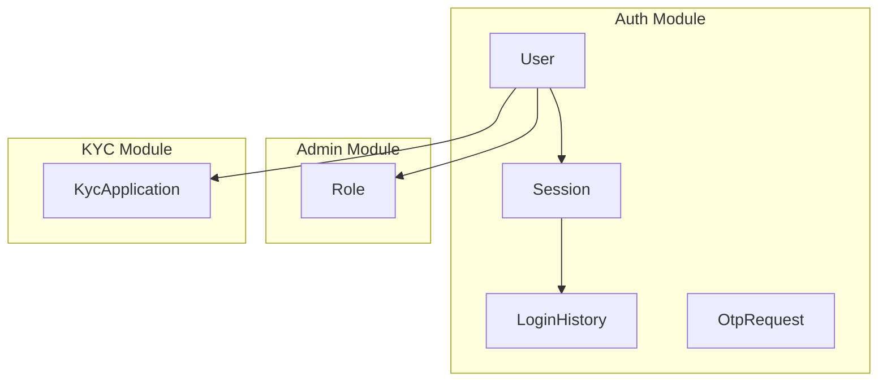
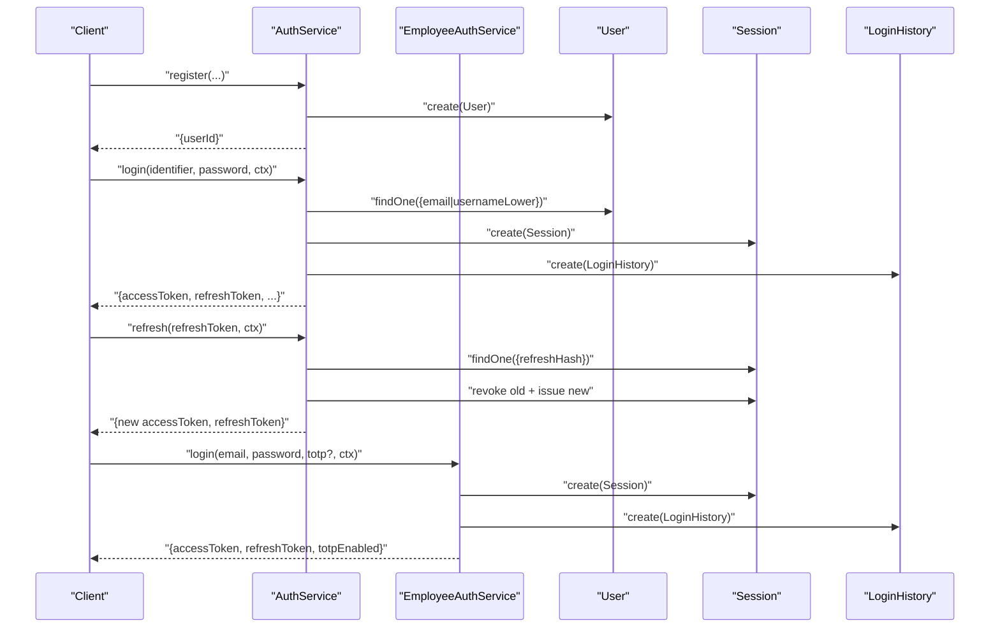
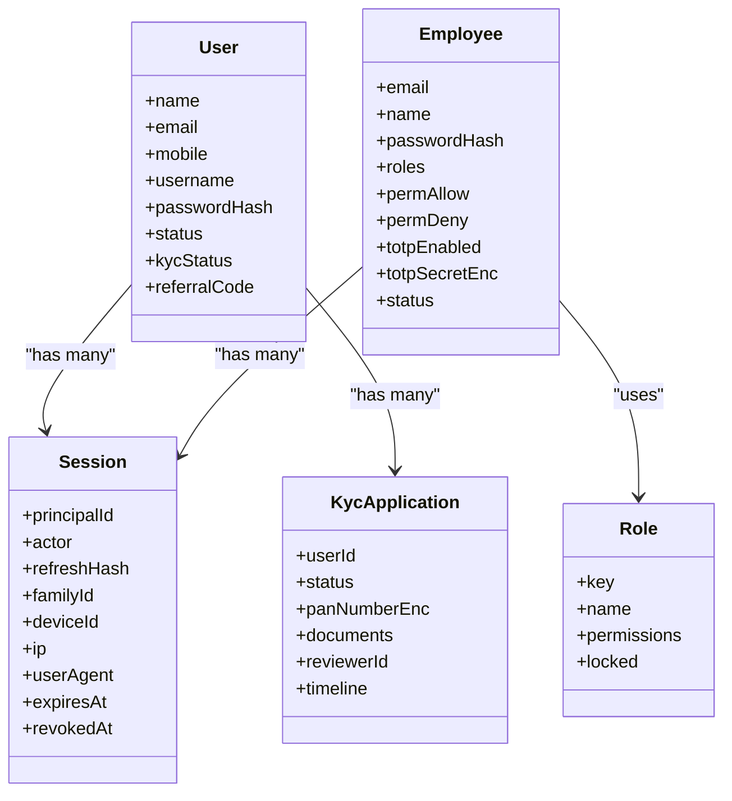

# Core Entities

<cite>
**Referenced Files in This Document**
- [user.schema.ts](file://backend/apps/api/src/modules/auth/infrastructure/schemas/user.schema.ts)
- [session.schema.ts](file://backend/apps/api/src/modules/auth/infrastructure/schemas/session.schema.ts)
- [employee.schema.ts](file://backend/apps/api/src/modules/auth/infrastructure/schemas/employee.schema.ts)
- [role.schema.ts](file://backend/apps/api/src/modules/admin/infrastructure/role.schema.ts)
- [kyc-application.schema.ts](file://backend/apps/api/src/modules/kyc/infrastructure/kyc-application.schema.ts)
- [auth.types.ts](file://backend/apps/api/src/modules/auth/domain/auth.types.ts)
- [kyc-state.ts](file://backend/apps/api/src/modules/kyc/domain/kyc-state.ts)
- [login-history.schema.ts](file://backend/apps/api/src/modules/auth/infrastructure/schemas/login-history.schema.ts)
- [otp-request.schema.ts](file://backend/apps/api/src/modules/auth/infrastructure/schemas/otp-request.schema.ts)
- [auth.service.ts](file://backend/apps/api/src/modules/auth/application/auth.service.ts)
- [employee-auth.service.ts](file://backend/apps/api/src/modules/auth/application/employee-auth.service.ts)
- [kyc.service.ts](file://backend/apps/api/src/modules/kyc/application/kyc.service.ts)
</cite>

## Table of Contents
1. [Introduction](#introduction)
2. [Project Structure](#project-structure)
3. [Core Components](#core-components)
4. [Architecture Overview](#architecture-overview)
5. [Detailed Component Analysis](#detailed-component-analysis)
6. [Dependency Analysis](#dependency-analysis)
7. [Performance Considerations](#performance-considerations)
8. [Troubleshooting Guide](#troubleshooting-guide)
9. [Conclusion](#conclusion)
10. [Appendices](#appendices)

## Introduction
This document describes the core data models for authentication and user management: User, Session, Employee, Role, and KYC Application. It covers field definitions, validation rules, business constraints, relationships, indexing strategies, security considerations, and common query patterns used by authentication flows.

## Project Structure
The relevant schemas are organized under module-specific infrastructure directories:
- Auth module: User, Session, LoginHistory, OtpRequest
- Admin module: Role
- KYC module: KycApplication
Domain enums and state transitions live alongside their modules to keep types and rules close to usage.

**Diagram sources**
- [user.schema.ts:5-67](file://backend/apps/api/src/modules/auth/infrastructure/schemas/user.schema.ts#L5-L67)
- [session.schema.ts:9-41](file://backend/apps/api/src/modules/auth/infrastructure/schemas/session.schema.ts#L9-L41)
- [login-history.schema.ts:4-28](file://backend/apps/api/src/modules/auth/infrastructure/schemas/login-history.schema.ts#L4-L28)
- [otp-request.schema.ts:4-28](file://backend/apps/api/src/modules/auth/infrastructure/schemas/otp-request.schema.ts#L4-L28)
- [role.schema.ts:4-18](file://backend/apps/api/src/modules/admin/infrastructure/role.schema.ts#L4-L18)
- [kyc-application.schema.ts:38-61](file://backend/apps/api/src/modules/kyc/infrastructure/kyc-application.schema.ts#L38-L61)

**Section sources**
- [user.schema.ts:5-67](file://backend/apps/api/src/modules/auth/infrastructure/schemas/user.schema.ts#L5-L67)
- [session.schema.ts:9-41](file://backend/apps/api/src/modules/auth/infrastructure/schemas/session.schema.ts#L9-L41)
- [employee.schema.ts:8-37](file://backend/apps/api/src/modules/auth/infrastructure/schemas/employee.schema.ts#L8-L37)
- [role.schema.ts:4-18](file://backend/apps/api/src/modules/admin/infrastructure/role.schema.ts#L4-L18)
- [kyc-application.schema.ts:38-61](file://backend/apps/api/src/modules/kyc/infrastructure/schemas/kyc-application.schema.ts#L38-L61)

## Core Components
- User: Personal identity, verification flags, KYC status, account settings, and approval metadata.
- Session: Refresh token family tracking with device and lifecycle metadata; supports rotation and revocation.
- Employee: Administrative principal with roles, explicit allow/deny permissions, TOTP support, and status.
- Role: Permission set definition with a locked super-admin role guard.
- KycApplication: Encrypted PAN, document references, reviewer assignment, timeline, and status transitions.

Key domain enums:
- UserStatus, IncomeType, KycStatus (auth types)
- KycAppStatus and allowed transitions (kyc state)

**Section sources**
- [auth.types.ts:1-45](file://backend/apps/api/src/modules/auth/domain/auth.types.ts#L1-L45)
- [kyc-state.ts:1-35](file://backend/apps/api/src/modules/kyc/domain/kyc-state.ts#L1-L35)

## Architecture Overview
Authentication and session management flow across services and schemas:
- Registration creates a User with pending approval and generates referral code.
- Login validates credentials, checks status, issues tokens, records login history, and persists a Session row.
- Refresh rotates refresh tokens within a family and revokes old rows; reuse of revoked tokens triggers family-wide revocation.
- Employee login enforces TOTP when enabled and includes roles in access tokens.
- KYC submission encrypts PAN, stores documents via a document store, updates user KYC status, and maintains an audit timeline.

**Diagram sources**
- [auth.service.ts:44-81](file://backend/apps/api/src/modules/auth/application/auth.service.ts#L44-L81)
- [auth.service.ts:145-183](file://backend/apps/api/src/modules/auth/application/auth.service.ts#L145-L183)
- [auth.service.ts:190-216](file://backend/apps/api/src/modules/auth/application/auth.service.ts#L190-L216)
- [employee-auth.service.ts:38-82](file://backend/apps/api/src/modules/auth/application/employee-auth.service.ts#L38-L82)
- [session.schema.ts:9-41](file://backend/apps/api/src/modules/auth/infrastructure/schemas/session.schema.ts#L9-L41)
- [login-history.schema.ts:4-28](file://backend/apps/api/src/modules/auth/infrastructure/schemas/login-history.schema.ts#L4-L28)

## Detailed Component Analysis

### User Schema
- Purpose: Represents a trader account with personal info, verification flags, KYC status, and approval metadata.
- Key fields:
  - name, email (unique, lowercase), username (unique lowercased key), mobile (E.164 India format), address
  - emailVerified, mobileVerified booleans
  - passwordHash (not selected by default)
  - incomeType (enum), monthlyIncome (non-negative)
  - status (enum with index), kycStatus (enum)
  - referralCode (unique), referredBy
  - profilePictureKey
  - approvedAt, approvedBy, rejectionReason
- Validation and constraints:
  - Email and mobile uniqueness enforced at schema level.
  - Mobile matches Indian E.164 pattern.
  - Status defaults to pending approval; has an index for queries.
  - Username lowercased for case-insensitive uniqueness.
- Security:
  - passwordHash is not included in default selects.
  - Approval fields track admin actions.

Common queries:
- Find by email or usernameLower for login.
- Fetch me() excluding sensitive fields.

**Section sources**
- [user.schema.ts:5-67](file://backend/apps/api/src/modules/auth/infrastructure/schemas/user.schema.ts#L5-L67)
- [auth.types.ts:1-22](file://backend/apps/api/src/modules/auth/domain/auth.types.ts#L1-L22)
- [auth.service.ts:145-183](file://backend/apps/api/src/modules/auth/application/auth.service.ts#L145-L183)
- [auth.service.ts:289-294](file://backend/apps/api/src/modules/auth/application/auth.service.ts#L289-L294)

### Session Schema
- Purpose: Tracks issued refresh tokens per family with device and lifecycle metadata.
- Key fields:
  - principalId (ObjectId, indexed), actor (USER|EMPLOYEE)
  - refreshHash (unique hash of refresh token; raw token never stored)
  - familyId (grouping for rotation), deviceId, ip, userAgent
  - expiresAt, revokedAt, replacedByHash
- Lifecycle and rotation:
  - On refresh, old session is revoked and replacedByHash recorded; new session created.
  - Reuse of revoked/expired token revokes entire family and signals theft.
- Indexes:
  - expiresAt TTL index for automatic cleanup.
  - Composite index on principalId and createdAt for listing active sessions.

Security:
- Only hashes of refresh tokens are stored.
- Family revocation mitigates token replay/theft.

**Section sources**
- [session.schema.ts:9-47](file://backend/apps/api/src/modules/auth/infrastructure/schemas/session.schema.ts#L9-L47)
- [auth.service.ts:190-216](file://backend/apps/api/src/modules/auth/application/auth.service.ts#L190-L216)
- [auth.service.ts:298-316](file://backend/apps/api/src/modules/auth/application/auth.service.ts#L298-L316)

### Employee Schema
- Purpose: Administrative users with role-based access control and optional TOTP.
- Key fields:
  - email (unique, lowercase), name
  - passwordHash (not selected by default)
  - roles (string[]), permAllow (string[]), permDeny (string[])
  - totpEnabled boolean
  - totpSecretEnc (encrypted secret, not selected by default)
  - status (ACTIVE|DISABLED)
- Security:
  - TOTP secret is encrypted at rest; decryption only at runtime.
  - Roles and explicit allow/deny lists enable fine-grained permissions.

**Section sources**
- [employee.schema.ts:8-37](file://backend/apps/api/src/modules/auth/infrastructure/schemas/employee.schema.ts#L8-L37)
- [employee-auth.service.ts:38-82](file://backend/apps/api/src/modules/auth/application/employee-auth.service.ts#L38-L82)

### Role Schema
- Purpose: Defines permission sets for roles.
- Key fields:
  - key (unique, uppercase), name
  - permissions (string[])
  - locked (boolean; SUPER_ADMIN cannot be edited or reduced)

Usage:
- Roles are attached to employees; permission resolution uses roles plus explicit allow/deny overrides.

**Section sources**
- [role.schema.ts:4-18](file://backend/apps/api/src/modules/admin/infrastructure/role.schema.ts#L4-L18)
- [employee.schema.ts:19-26](file://backend/apps/api/src/modules/auth/infrastructure/schemas/employee.schema.ts#L19-L26)

### KYC Application Schema
- Purpose: Stores KYC application details, encrypted PAN, document references, reviewer, timeline, and status.
- Key fields:
  - userId (ObjectId, indexed)
  - status (SUBMITTED|UNDER_REVIEW|APPROVED|REJECTED; indexed)
  - panNumberEnc (field-encrypted)
  - documents array: type, fileKey (relative storage key), mimeType, sizeBytes
  - reviewerId (ObjectId)
  - rejectionReason
  - timeline entries: at, event, byEmployeeId, note
- Constraints and indexes:
  - Unique partial index on userId for non-terminal statuses to ensure one live application per user.
  - Composite index on status and createdAt for queueing.
- Business logic:
  - Strict state transitions enforced by domain function.
  - PAN validated against expected format before encryption and storage.
  - Documents validated for MIME and size limits.

**Section sources**
- [kyc-application.schema.ts:5-71](file://backend/apps/api/src/modules/kyc/infrastructure/kyc-application.schema.ts#L5-L71)
- [kyc-state.ts:1-35](file://backend/apps/api/src/modules/kyc/domain/kyc-state.ts#L1-L35)
- [kyc.service.ts:55-109](file://backend/apps/api/src/modules/kyc/application/kyc.service.ts#L55-L109)
- [kyc.service.ts:152-188](file://backend/apps/api/src/modules/kyc/application/kyc.service.ts#L152-L188)

### Supporting Audit and OTP Schemas
- LoginHistory: Records successful/failed logins with actor, IP, user agent, device, and timestamp. Indexed by principalId and time for recent activity queries.
- OtpRequest: Stores hashed OTP codes with target, channel, purpose, attempts, expiration, and consumption time. TTL index auto-cleans expired requests.

**Section sources**
- [login-history.schema.ts:4-33](file://backend/apps/api/src/modules/auth/infrastructure/schemas/login-history.schema.ts#L4-L33)
- [otp-request.schema.ts:4-34](file://backend/apps/api/src/modules/auth/infrastructure/schemas/otp-request.schema.ts#L4-L34)

## Dependency Analysis
- AuthService depends on User, Session, LoginHistory, PasswordService, TokenService, OtpService, MailSender, AuditService.
- EmployeeAuthService depends on Employee, Session, LoginHistory, PasswordService, TokenService, AuditService, and crypto utilities for TOTP secrets.
- KycService depends on KycApplication, User, DocumentStoreService, AuditService, and domain transition logic.

**Diagram sources**
- [user.schema.ts:5-67](file://backend/apps/api/src/modules/auth/infrastructure/schemas/user.schema.ts#L5-L67)
- [session.schema.ts:9-41](file://backend/apps/api/src/modules/auth/infrastructure/schemas/session.schema.ts#L9-L41)
- [employee.schema.ts:8-37](file://backend/apps/api/src/modules/auth/infrastructure/schemas/employee.schema.ts#L8-L37)
- [role.schema.ts:4-18](file://backend/apps/api/src/modules/admin/infrastructure/role.schema.ts#L4-L18)
- [kyc-application.schema.ts:38-61](file://backend/apps/api/src/modules/kyc/infrastructure/schemas/kyc-application.schema.ts#L38-L61)

**Section sources**
- [auth.service.ts:29-40](file://backend/apps/api/src/modules/auth/application/auth.service.ts#L29-L40)
- [employee-auth.service.ts:23-36](file://backend/apps/api/src/modules/auth/application/employee-auth.service.ts#L23-L36)
- [kyc.service.ts:29-41](file://backend/apps/api/src/modules/kyc/application/kyc.service.ts#L29-L41)

## Performance Considerations
- Indexes:
  - User.status indexed for filtering active/pending accounts.
  - Session.expiresAt TTL index for automatic cleanup of expired sessions.
  - Session composite index on principalId and createdAt for efficient session listing.
  - LoginHistory indexed on principalId and at for recent login queries.
  - KycApplication indexed on status and createdAt for queueing; unique partial index on userId for non-terminal statuses to prevent duplicate open applications.
- Selectivity:
  - Use select() to exclude sensitive fields like passwordHash and encrypted secrets from responses.
- Query patterns:
  - Precompute lowercase keys (usernameLower, email) to avoid collation overhead.
  - Use lean() for read-only queries to reduce overhead.

[No sources needed since this section provides general guidance]

## Troubleshooting Guide
Common issues and where to investigate:
- Duplicate registration:
  - Check for existing email, mobile, or usernameLower before creating a User.
- Invalid credentials or suspended/rejected accounts:
  - Verify User.status and password verification; record failures in LoginHistory.
- Session reuse after expiry:
  - Detect revoked/expired refresh tokens and revoke entire family; return appropriate error.
- KYC submission errors:
  - Validate PAN format, required documents, MIME types, and file sizes; ensure no open application exists for the user.
- TOTP enforcement:
  - Ensure employee.totpEnabled requires a valid code; verify decrypted secret during setup and enablement.

**Section sources**
- [auth.service.ts:44-81](file://backend/apps/api/src/modules/auth/application/auth.service.ts#L44-L81)
- [auth.service.ts:145-183](file://backend/apps/api/src/modules/auth/application/auth.service.ts#L145-L183)
- [auth.service.ts:190-216](file://backend/apps/api/src/modules/auth/application/auth.service.ts#L190-L216)
- [kyc.service.ts:55-109](file://backend/apps/api/src/modules/kyc/application/kyc.service.ts#L55-L109)
- [employee-auth.service.ts:38-82](file://backend/apps/api/src/modules/auth/application/employee-auth.service.ts#L38-L82)

## Conclusion
The data model centers around secure, auditable authentication and user management with strong separation between users and employees, robust session rotation, and strict KYC workflows. Indexing and selective field exposure optimize performance and protect sensitive data. Domain-driven state transitions enforce compliance and integrity for KYC processes.

[No sources needed since this section summarizes without analyzing specific files]

## Appendices

### Field Validation Rules and Business Constraints Summary
- User:
  - email: unique, lowercase
  - mobile: unique, E.164 India pattern
  - username: unique lowercased key
  - status: enum with index; defaults to pending approval
  - kycStatus: enum reflecting KYC lifecycle
- Session:
  - refreshHash: unique; only hash stored
  - familyId: groups related sessions
  - TTL cleanup via expiresAt index
- Employee:
  - roles, permAllow, permDeny arrays for RBAC
  - totpEnabled flag; totpSecretEnc encrypted
- Role:
  - locked flag protects critical roles
- KycApplication:
  - panNumberEnc encrypted
  - documents validated for MIME and size
  - unique partial index prevents multiple open applications

**Section sources**
- [user.schema.ts:5-67](file://backend/apps/api/src/modules/auth/infrastructure/schemas/user.schema.ts#L5-L67)
- [session.schema.ts:9-47](file://backend/apps/api/src/modules/auth/infrastructure/schemas/session.schema.ts#L9-L47)
- [employee.schema.ts:8-37](file://backend/apps/api/src/modules/auth/infrastructure/schemas/employee.schema.ts#L8-L37)
- [role.schema.ts:4-18](file://backend/apps/api/src/modules/admin/infrastructure/role.schema.ts#L4-L18)
- [kyc-application.schema.ts:38-71](file://backend/apps/api/src/modules/kyc/infrastructure/kyc-application.schema.ts#L38-L71)

### Security Considerations
- Passwords:
  - Stored as hashes; never exposed in selects.
- Tokens:
  - Refresh tokens stored as hashes; rotation and revocation mitigate theft.
- Secrets:
  - TOTP secrets encrypted at rest; decrypted only in memory during operations.
- KYC data:
  - PAN encrypted at rest; documents stored externally with relative keys.
- Auditing:
  - Login attempts and KYC actions recorded with context (IP, user agent, device).

**Section sources**
- [auth.service.ts:145-183](file://backend/apps/api/src/modules/auth/application/auth.service.ts#L145-L183)
- [auth.service.ts:190-216](file://backend/apps/api/src/modules/auth/application/auth.service.ts#L190-L216)
- [employee-auth.service.ts:38-82](file://backend/apps/api/src/modules/auth/application/employee-auth.service.ts#L38-L82)
- [kyc.service.ts:55-109](file://backend/apps/api/src/modules/kyc/application/kyc.service.ts#L55-L109)

### Common Query Patterns for Authentication Flows
- Register:
  - Create User with hashed password, generate referral code, set status to pending approval.
- Login:
  - Find User by email or usernameLower; verify password; check status; create Session; record LoginHistory; return token pair.
- Refresh:
  - Lookup Session by refreshHash; if revoked/expired, revoke family; otherwise rotate and return new tokens.
- Logout:
  - Revoke Session by refreshHash.
- Active Sessions:
  - List non-revoked, non-expired sessions for a principal.
- Recent Logins:
  - Query LoginHistory by principalId sorted by time.

**Section sources**
- [auth.service.ts:44-81](file://backend/apps/api/src/modules/auth/application/auth.service.ts#L44-L81)
- [auth.service.ts:145-183](file://backend/apps/api/src/modules/auth/application/auth.service.ts#L145-L183)
- [auth.service.ts:190-216](file://backend/apps/api/src/modules/auth/application/auth.service.ts#L190-L216)
- [auth.service.ts:218-232](file://backend/apps/api/src/modules/auth/application/auth.service.ts#L218-L232)
- [auth.service.ts:273-287](file://backend/apps/api/src/modules/auth/application/auth.service.ts#L273-L287)