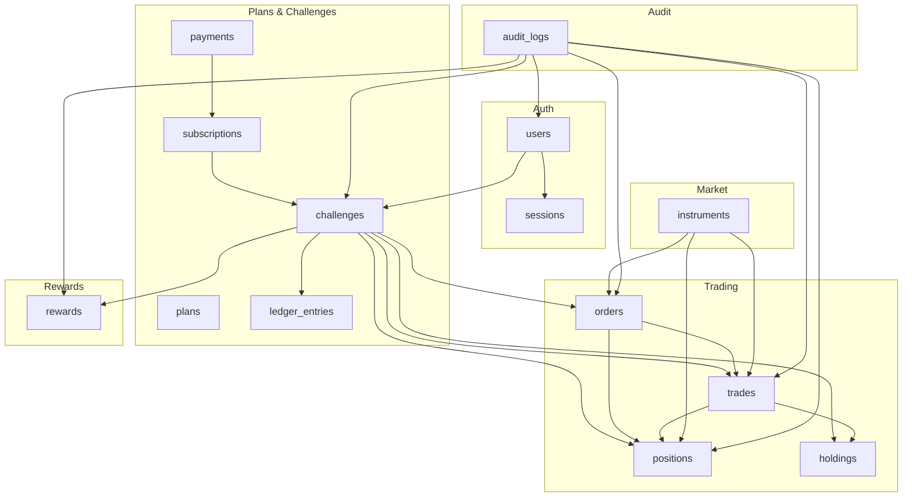
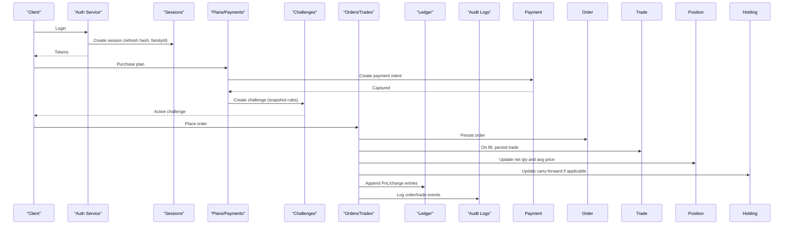
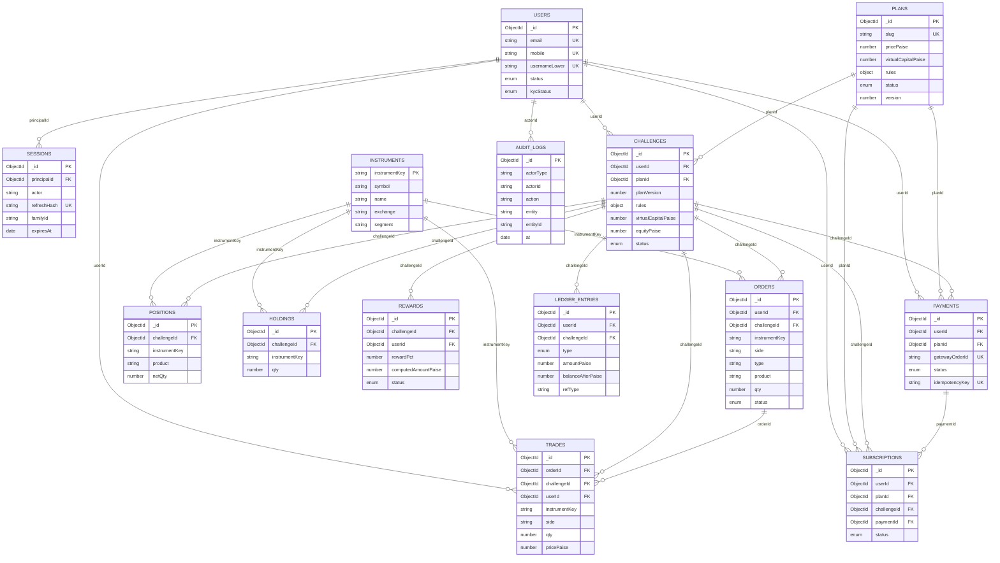

# Database Schema

<cite>
**Referenced Files in This Document**
- [user.schema.ts](file://backend/apps/api/src/modules/auth/infrastructure/schemas/user.schema.ts)
- [session.schema.ts](file://backend/apps/api/src/modules/auth/infrastructure/schemas/session.schema.ts)
- [instrument.schema.ts](file://backend/apps/api/src/modules/market/infrastructure/schemas/instrument.schema.ts)
- [order.schema.ts](file://backend/apps/api/src/modules/trading/infrastructure/schemas/order.schema.ts)
- [position.schema.ts](file://backend/apps/api/src/modules/trading/infrastructure/schemas/position.schema.ts)
- [trade.schema.ts](file://backend/apps/api/src/modules/trading/infrastructure/schemas/trade.schema.ts)
- [holding.schema.ts](file://backend/apps/api/src/modules/trading/infrastructure/schemas/holding.schema.ts)
- [challenge.schema.ts](file://backend/apps/api/src/modules/plans/infrastructure/schemas/challenge.schema.ts)
- [reward.schema.ts](file://backend/apps/api/src/modules/challenge/infrastructure/schemas/reward.schema.ts)
- [audit-log.schema.ts](file://backend/libs/shared/src/audit/audit-log.schema.ts)
- [plan.schema.ts](file://backend/apps/api/src/modules/plans/infrastructure/schemas/plan.schema.ts)
- [subscription.schema.ts](file://backend/apps/api/src/modules/plans/infrastructure/schemas/subscription.schema.ts)
- [payment.schema.ts](file://backend/apps/api/src/modules/plans/infrastructure/schemas/payment.schema.ts)
- [ledger-entry.schema.ts](file://backend/apps/api/src/modules/plans/infrastructure/schemas/ledger-entry.schema.ts)
- [auth.types.ts](file://backend/apps/api/src/modules/auth/domain/auth.types.ts)
- [order.types.ts](file://backend/apps/api/src/modules/trading/domain/order.types.ts)
- [plan.types.ts](file://backend/apps/api/src/modules/plans/domain/plan.types.ts)
</cite>

## Table of Contents
1. Introduction
2. Project Structure
3. Core Components
4. Architecture Overview
5. Detailed Component Analysis
6. Dependency Analysis
7. Performance Considerations
8. Troubleshooting Guide
9. Conclusion
10. Appendices

## Introduction
This document describes the MongoDB database schema for the platform, focusing on collections for users, sessions, instruments, orders, positions, challenges, rewards, and audit logs. It details entity relationships, field definitions, data types, validation rules, indexing strategies, query patterns, lifecycle management, retention policies, security considerations, backup and recovery procedures, performance tuning, and scaling guidance for high-frequency trading workloads.

## Project Structure
The schema is defined using Mongoose within NestJS modules. Each domain has its own infrastructure layer with dedicated schema files:
- Authentication: user and session schemas
- Market: instrument master
- Trading: orders, positions, trades, holdings
- Plans and Challenges: plans, subscriptions, payments, challenges, ledger entries
- Rewards: reward records tied to challenges
- Audit: immutable audit log

**Diagram sources**
- [user.schema.ts:5-67](file://backend/apps/api/src/modules/auth/infrastructure/schemas/user.schema.ts#L5-L67)
- [session.schema.ts:9-41](file://backend/apps/api/src/modules/auth/infrastructure/schemas/session.schema.ts#L9-L41)
- [instrument.schema.ts:9-67](file://backend/apps/api/src/modules/market/infrastructure/schemas/instrument.schema.ts#L9-L67)
- [order.schema.ts:13-63](file://backend/apps/api/src/modules/trading/infrastructure/schemas/order.schema.ts#L13-L63)
- [position.schema.ts:4-29](file://backend/apps/api/src/modules/trading/infrastructure/schemas/position.schema.ts#L4-L29)
- [trade.schema.ts:4-34](file://backend/apps/api/src/modules/trading/infrastructure/schemas/trade.schema.ts#L4-L34)
- [holding.schema.ts:5-18](file://backend/apps/api/src/modules/trading/infrastructure/schemas/holding.schema.ts#L5-L18)
- [challenge.schema.ts:23-70](file://backend/apps/api/src/modules/plans/infrastructure/schemas/challenge.schema.ts#L23-L70)
- [reward.schema.ts:20-50](file://backend/apps/api/src/modules/challenge/infrastructure/schemas/reward.schema.ts#L20-L50)
- [audit-log.schema.ts:7-34](file://backend/libs/shared/src/audit/audit-log.schema.ts#L7-L34)
- [plan.schema.ts:18-49](file://backend/apps/api/src/modules/plans/infrastructure/schemas/plan.schema.ts#L18-L49)
- [subscription.schema.ts:5-27](file://backend/apps/api/src/modules/plans/infrastructure/schemas/subscription.schema.ts#L5-L27)
- [payment.schema.ts:5-56](file://backend/apps/api/src/modules/plans/infrastructure/schemas/payment.schema.ts#L5-L56)
- [ledger-entry.schema.ts:10-37](file://backend/apps/api/src/modules/plans/infrastructure/schemas/ledger-entry.schema.ts#L10-L37)

**Section sources**
- [user.schema.ts:5-67](file://backend/apps/api/src/modules/auth/infrastructure/schemas/user.schema.ts#L5-L67)
- [session.schema.ts:9-41](file://backend/apps/api/src/modules/auth/infrastructure/schemas/session.schema.ts#L9-L41)
- [instrument.schema.ts:9-67](file://backend/apps/api/src/modules/market/infrastructure/schemas/instrument.schema.ts#L9-L67)
- [order.schema.ts:13-63](file://backend/apps/api/src/modules/trading/infrastructure/schemas/order.schema.ts#L13-L63)
- [position.schema.ts:4-29](file://backend/apps/api/src/modules/trading/infrastructure/schemas/position.schema.ts#L4-L29)
- [trade.schema.ts:4-34](file://backend/apps/api/src/modules/trading/infrastructure/schemas/trade.schema.ts#L4-L34)
- [holding.schema.ts:5-18](file://backend/apps/api/src/modules/trading/infrastructure/schemas/holding.schema.ts#L5-L18)
- [challenge.schema.ts:23-70](file://backend/apps/api/src/modules/plans/infrastructure/schemas/challenge.schema.ts#L23-L70)
- [reward.schema.ts:20-50](file://backend/apps/api/src/modules/challenge/infrastructure/schemas/reward.schema.ts#L20-L50)
- [audit-log.schema.ts:7-34](file://backend/libs/shared/src/audit/audit-log.schema.ts#L7-L34)
- [plan.schema.ts:18-49](file://backend/apps/api/src/modules/plans/infrastructure/schemas/plan.schema.ts#L18-L49)
- [subscription.schema.ts:5-27](file://backend/apps/api/src/modules/plans/infrastructure/schemas/subscription.schema.ts#L5-L27)
- [payment.schema.ts:5-56](file://backend/apps/api/src/modules/plans/infrastructure/schemas/payment.schema.ts#L5-L56)
- [ledger-entry.schema.ts:10-37](file://backend/apps/api/src/modules/plans/infrastructure/schemas/ledger-entry.schema.ts#L10-L37)

## Core Components
- Users: identity, verification flags, KYC and status fields, referral tracking.
- Sessions: refresh token rotation and revocation model with TTL-based expiry.
- Instruments: market instrument master with exchange, segment, derivatives metadata, and search indexes.
- Orders: order placement with side/type/product, optional triggers, and lifecycle states.
- Positions: per-challenge net position state keyed by instrument and product.
- Trades: append-only execution records linked to orders and challenges.
- Holdings: overnight carry-forward quantities and average prices.
- Challenges: plan snapshots, virtual capital, equity tracking, and lifecycle status.
- Rewards: eligibility, computed/admin amounts, timeline, and review workflow.
- Audit Logs: immutable action trail across entities.

Key validations and constraints are enforced via Mongoose properties (required, unique, enum, min/max, regex). Indexes optimize common queries and enforce uniqueness.

**Section sources**
- [user.schema.ts:5-67](file://backend/apps/api/src/modules/auth/infrastructure/schemas/user.schema.ts#L5-L67)
- [session.schema.ts:9-41](file://backend/apps/api/src/modules/auth/infrastructure/schemas/session.schema.ts#L9-L41)
- [instrument.schema.ts:9-67](file://backend/apps/api/src/modules/market/infrastructure/schemas/instrument.schema.ts#L9-L67)
- [order.schema.ts:13-63](file://backend/apps/api/src/modules/trading/infrastructure/schemas/order.schema.ts#L13-L63)
- [position.schema.ts:4-29](file://backend/apps/api/src/modules/trading/infrastructure/schemas/position.schema.ts#L4-L29)
- [trade.schema.ts:4-34](file://backend/apps/api/src/modules/trading/infrastructure/schemas/trade.schema.ts#L4-L34)
- [holding.schema.ts:5-18](file://backend/apps/api/src/modules/trading/infrastructure/schemas/holding.schema.ts#L5-L18)
- [challenge.schema.ts:23-70](file://backend/apps/api/src/modules/plans/infrastructure/schemas/challenge.schema.ts#L23-L70)
- [reward.schema.ts:20-50](file://backend/apps/api/src/modules/challenge/infrastructure/schemas/reward.schema.ts#L20-L50)
- [audit-log.schema.ts:7-34](file://backend/libs/shared/src/audit/audit-log.schema.ts#L7-L34)

## Architecture Overview
The system models a funded-trading challenge lifecycle:
- User registers and authenticates; sessions manage refresh tokens with rotation and revocation.
- Instrument master drives available tradables.
- Plans define rules and pricing; purchases create subscriptions and activate challenges.
- Challenges snapshot plan rules and track equity, realized PnL, and trading days.
- Orders and trades update positions and holdings; ledger entries record financial movements.
- Rewards evaluate passed challenges and capture admin decisions.
- Audit logs record all significant actions.

**Diagram sources**
- [session.schema.ts:9-41](file://backend/apps/api/src/modules/auth/infrastructure/schemas/session.schema.ts#L9-L41)
- [payment.schema.ts:5-56](file://backend/apps/api/src/modules/plans/infrastructure/schemas/payment.schema.ts#L5-L56)
- [challenge.schema.ts:23-70](file://backend/apps/api/src/modules/plans/infrastructure/schemas/challenge.schema.ts#L23-L70)
- [order.schema.ts:13-63](file://backend/apps/api/src/modules/trading/infrastructure/schemas/order.schema.ts#L13-L63)
- [trade.schema.ts:4-34](file://backend/apps/api/src/modules/trading/infrastructure/schemas/trade.schema.ts#L4-L34)
- [position.schema.ts:4-29](file://backend/apps/api/src/modules/trading/infrastructure/schemas/position.schema.ts#L4-L29)
- [holding.schema.ts:5-18](file://backend/apps/api/src/modules/trading/infrastructure/schemas/holding.schema.ts#L5-L18)
- [ledger-entry.schema.ts:10-37](file://backend/apps/api/src/modules/plans/infrastructure/schemas/ledger-entry.schema.ts#L10-L37)
- [audit-log.schema.ts:7-34](file://backend/libs/shared/src/audit/audit-log.schema.ts#L7-L34)

## Detailed Component Analysis

### Users
- Collection: users
- Purpose: Identity and onboarding profile
- Key fields: name, email (unique, lowercase), mobile (E.164 India format), username (case-insensitive unique via usernameLower), passwordHash (sensitive), address, incomeType, monthlyIncome, status (indexed), kycStatus, referralCode, referredBy, profilePictureKey, approvedAt, approvedBy, rejectionReason
- Validation: required fields, length limits, regex for mobile, enums for status and kycStatus
- Indexes: status indexed; email and mobile unique; usernameLower unique
- Security: passwordHash stored securely; sensitive fields should be excluded from responses where appropriate
- Lifecycle: PENDING_APPROVAL -> ACTIVE or REJECTED/SUSPENDED based on admin approval and KYC

**Section sources**
- [user.schema.ts:5-67](file://backend/apps/api/src/modules/auth/infrastructure/schemas/user.schema.ts#L5-L67)
- [auth.types.ts:1-22](file://backend/apps/api/src/modules/auth/domain/auth.types.ts#L1-L22)

### Sessions
- Collection: sessions
- Purpose: Refresh token rotation and revocation
- Key fields: principalId (ObjectId, indexed), actor (USER/EMPLOYEE), refreshHash (unique, SHA-256 of refresh token), familyId (indexed), deviceId, ip, userAgent, expiresAt (TTL), revokedAt, replacedByHash
- Validation: required fields, enums for actor
- Indexes: expiresAt TTL index; composite index on principalId + createdAt
- Security: raw refresh tokens never stored; only hashes
- Lifecycle: new row per issued token; rotation replaces old; presenting revoked token revokes family

**Section sources**
- [session.schema.ts:9-41](file://backend/apps/api/src/modules/auth/infrastructure/schemas/session.schema.ts#L9-L41)

### Instruments
- Collection: instruments
- Purpose: Master catalog of tradable instruments
- Key fields: instrumentKey (unique), symbol (text searchable), name, exchange (NSE/BSE), segment (EQ/FO/CUR/INDEX, indexed), lotSize, tickSize, freezeQty, expiry/strike/optType for derivatives, underlyingKey (indexed), enabled (indexed), angelToken/dhanSecurityId for integrations
- Validation: required fields, enums for exchange/segment/optType
- Indexes: text search on symbol/name; composite indexes for segment+enabled, underlyingKey+expiry+strike; symbol; exchange+segment+symbol
- Lifecycle: synced daily from broker masters; enabled flag controls visibility

**Section sources**
- [instrument.schema.ts:9-67](file://backend/apps/api/src/modules/market/infrastructure/schemas/instrument.schema.ts#L9-L67)

### Orders
- Collection: orders
- Purpose: Order placement and lifecycle
- Key fields: userId (ObjectId, indexed), challengeId (ObjectId, indexed), instrumentKey, side (BUY/SELL), type (MARKET/LIMIT), product (INTRADAY/CARRY_FORWARD), qty, limitPricePaise, trigger (STOP_LOSS/TARGET), status (OPEN/FILLED/CANCELLED/REJECTED, indexed), filledPricePaise, chargesPaise, rejectionReason, parentOrderId (for auto SL/target), placedAt, executedAt
- Validation: required fields, enums for side/type/product/status
- Indexes: partial index on OPEN orders by instrumentKey for matching; userId+status+placedAt; challengeId+placedAt
- Lifecycle: OPEN -> FILLED/CANCELLED/REJECTED; auto-generated exits link via parentOrderId

**Section sources**
- [order.schema.ts:13-63](file://backend/apps/api/src/modules/trading/infrastructure/schemas/order.schema.ts#L13-L63)
- [order.types.ts:1-32](file://backend/apps/api/src/modules/trading/domain/order.types.ts#L1-L32)

### Positions
- Collection: positions
- Purpose: Per-challenge net position state
- Key fields: challengeId (ObjectId, indexed), instrumentKey, product (INTRADAY/CARRY_FORWARD), netQty, avgPricePaise, realizedPnlPaise, dayBuyQty, daySellQty
- Validation: required fields, enums for product
- Indexes: unique composite on challengeId+instrumentKey+product
- Lifecycle: updated on fills; intraday reset at EOD; carry-forward tracked via holdings

**Section sources**
- [position.schema.ts:4-29](file://backend/apps/api/src/modules/trading/infrastructure/schemas/position.schema.ts#L4-L29)

### Trades
- Collection: trades
- Purpose: Append-only execution records
- Key fields: orderId (ObjectId, indexed), challengeId (ObjectId, indexed), userId (ObjectId, indexed), instrumentKey, side (BUY/SELL), qty, pricePaise, chargesPaise, realizedPnlPaise, at
- Validation: required fields, enums for side
- Indexes: challengeId+at; userId+at
- Lifecycle: created on fills; immutable

**Section sources**
- [trade.schema.ts:4-34](file://backend/apps/api/src/modules/trading/infrastructure/schemas/trade.schema.ts#L4-L34)

### Holdings
- Collection: holdings
- Purpose: Overnight carry-forward quantities and average price
- Key fields: challengeId (ObjectId, indexed), instrumentKey, qty, avgPricePaise
- Validation: required fields
- Indexes: unique composite on challengeId+instrumentKey
- Lifecycle: updated at EOD for carry-forward products

**Section sources**
- [holding.schema.ts:5-18](file://backend/apps/api/src/modules/trading/infrastructure/schemas/holding.schema.ts#L5-L18)

### Challenges
- Collection: challenges
- Purpose: Plan instance with rule snapshot and live tracking
- Key fields: userId (ObjectId, indexed), planId, planVersion, planName, rules (profitTargetPct, maxDrawdownPct, dailyDrawdownPct, drawdownAnchor, minTradingDays, expiryDays, rewardPct, segments), virtualCapitalPaise, equityPaise, peakEquityPaise, dayStartEquityPaise, realizedPnlPaise, tradingDays (IST date keys), status (PENDING/ACTIVE/PASSED_PENDING_REVIEW/PASSED/FAILED/EXPIRED, indexed), startedAt, endsAt, events
- Validation: required fields, enums for status
- Indexes: userId+status; status+endsAt
- Lifecycle: created on purchase; activated by engine; evaluated for pass/fail; expired after endsAt

**Section sources**
- [challenge.schema.ts:23-70](file://backend/apps/api/src/modules/plans/infrastructure/schemas/challenge.schema.ts#L23-L70)
- [plan.types.ts:22-49](file://backend/apps/api/src/modules/plans/domain/plan.types.ts#L22-L49)

### Rewards
- Collection: rewards
- Purpose: Eligibility and payout tracking for passed challenges
- Key fields: challengeId (unique), userId (ObjectId, indexed), rewardPct, computedAmountPaise, overrideAmountPaise (admin), status (ELIGIBLE/APPROVED/REJECTED/PAID, indexed), reviewerId, decisionReason, timeline (event history)
- Validation: required fields, enums for status
- Indexes: status+createdAt
- Lifecycle: ELIGIBLE on pass -> APPROVED/REJECTED by admin -> PAID off-platform

**Section sources**
- [reward.schema.ts:20-50](file://backend/apps/api/src/modules/challenge/infrastructure/schemas/reward.schema.ts#L20-L50)

### Audit Logs
- Collection: audit_logs
- Purpose: Immutable audit trail
- Key fields: actorType (USER/EMPLOYEE/SYSTEM), actorId (indexed), action, entity, entityId, before (optional), after (optional), ip, at
- Validation: required fields, enums for actorType
- Indexes: entity+entityId+at; actorId+at; at desc
- Lifecycle: append-only; no updates/deletes in code

**Section sources**
- [audit-log.schema.ts:7-34](file://backend/libs/shared/src/audit/audit-log.schema.ts#L7-L34)

### Additional Collections (Plans, Subscriptions, Payments, Ledger Entries)
- Plans: catalog of challenge plans with rules, pricing, versioning, and status
- Subscriptions: link user, plan, challenge, and payment with activation/expiry
- Payments: gateway integration with idempotency key and status transitions
- Ledger Entries: append-only financial ledger for credits, debits, charges, PnL, adjustments

These support the challenge lifecycle and financial integrity.

**Section sources**
- [plan.schema.ts:18-49](file://backend/apps/api/src/modules/plans/infrastructure/schemas/plan.schema.ts#L18-L49)
- [subscription.schema.ts:5-27](file://backend/apps/api/src/modules/plans/infrastructure/schemas/subscription.schema.ts#L5-L27)
- [payment.schema.ts:5-56](file://backend/apps/api/src/modules/plans/infrastructure/schemas/payment.schema.ts#L5-L56)
- [ledger-entry.schema.ts:10-37](file://backend/apps/api/src/modules/plans/infrastructure/schemas/ledger-entry.schema.ts#L10-L37)
- [plan.types.ts:1-21](file://backend/apps/api/src/modules/plans/domain/plan.types.ts#L1-L21)

## Dependency Analysis
Entity relationships and references:
- users._id referenced by sessions.principalId, challenges.userId, payments.userId, subscriptions.userId, trades.userId, audit_logs.actorId
- instruments.instrumentKey referenced by orders.instrumentKey, positions.instrumentKey, trades.instrumentKey, holdings.instrumentKey
- plans._id referenced by challenges.planId, subscriptions.planId, payments.planId
- challenges._id referenced by orders.challengeId, positions.challengeId, trades.challengeId, holdings.challengeId, rewards.challengeId, subscriptions.challengeId, payments.challengeId
- orders._id referenced by trades.orderId
- payments._id referenced by subscriptions.paymentId

**Diagram sources**
- [user.schema.ts:5-67](file://backend/apps/api/src/modules/auth/infrastructure/schemas/user.schema.ts#L5-L67)
- [session.schema.ts:9-41](file://backend/apps/api/src/modules/auth/infrastructure/schemas/session.schema.ts#L9-L41)
- [instrument.schema.ts:9-67](file://backend/apps/api/src/modules/market/infrastructure/schemas/instrument.schema.ts#L9-L67)
- [order.schema.ts:13-63](file://backend/apps/api/src/modules/trading/infrastructure/schemas/order.schema.ts#L13-L63)
- [position.schema.ts:4-29](file://backend/apps/api/src/modules/trading/infrastructure/schemas/position.schema.ts#L4-L29)
- [trade.schema.ts:4-34](file://backend/apps/api/src/modules/trading/infrastructure/schemas/trade.schema.ts#L4-L34)
- [holding.schema.ts:5-18](file://backend/apps/api/src/modules/trading/infrastructure/schemas/holding.schema.ts#L5-L18)
- [challenge.schema.ts:23-70](file://backend/apps/api/src/modules/plans/infrastructure/schemas/challenge.schema.ts#L23-L70)
- [reward.schema.ts:20-50](file://backend/apps/api/src/modules/challenge/infrastructure/schemas/reward.schema.ts#L20-L50)
- [audit-log.schema.ts:7-34](file://backend/libs/shared/src/audit/audit-log.schema.ts#L7-L34)
- [plan.schema.ts:18-49](file://backend/apps/api/src/modules/plans/infrastructure/schemas/plan.schema.ts#L18-L49)
- [subscription.schema.ts:5-27](file://backend/apps/api/src/modules/plans/infrastructure/schemas/subscription.schema.ts#L5-L27)
- [payment.schema.ts:5-56](file://backend/apps/api/src/modules/plans/infrastructure/schemas/payment.schema.ts#L5-L56)
- [ledger-entry.schema.ts:10-37](file://backend/apps/api/src/modules/plans/infrastructure/schemas/ledger-entry.schema.ts#L10-L37)

**Section sources**
- [user.schema.ts:5-67](file://backend/apps/api/src/modules/auth/infrastructure/schemas/user.schema.ts#L5-L67)
- [session.schema.ts:9-41](file://backend/apps/api/src/modules/auth/infrastructure/schemas/session.schema.ts#L9-L41)
- [instrument.schema.ts:9-67](file://backend/apps/api/src/modules/market/infrastructure/schemas/instrument.schema.ts#L9-L67)
- [order.schema.ts:13-63](file://backend/apps/api/src/modules/trading/infrastructure/schemas/order.schema.ts#L13-L63)
- [position.schema.ts:4-29](file://backend/apps/api/src/modules/trading/infrastructure/schemas/position.schema.ts#L4-L29)
- [trade.schema.ts:4-34](file://backend/apps/api/src/modules/trading/infrastructure/schemas/trade.schema.ts#L4-L34)
- [holding.schema.ts:5-18](file://backend/apps/api/src/modules/trading/infrastructure/schemas/holding.schema.ts#L5-L18)
- [challenge.schema.ts:23-70](file://backend/apps/api/src/modules/plans/infrastructure/schemas/challenge.schema.ts#L23-L70)
- [reward.schema.ts:20-50](file://backend/apps/api/src/modules/challenge/infrastructure/schemas/reward.schema.ts#L20-L50)
- [audit-log.schema.ts:7-34](file://backend/libs/shared/src/audit/audit-log.schema.ts#L7-L34)
- [plan.schema.ts:18-49](file://backend/apps/api/src/modules/plans/infrastructure/schemas/plan.schema.ts#L18-L49)
- [subscription.schema.ts:5-27](file://backend/apps/api/src/modules/plans/infrastructure/schemas/subscription.schema.ts#L5-L27)
- [payment.schema.ts:5-56](file://backend/apps/api/src/modules/plans/infrastructure/schemas/payment.schema.ts#L5-L56)
- [ledger-entry.schema.ts:10-37](file://backend/apps/api/src/modules/plans/infrastructure/schemas/ledger-entry.schema.ts#L10-L37)

## Performance Considerations
- Indexing strategy:
  - Unique indexes for identifiers (email, mobile, instrumentKey, gatewayOrderId, idempotencyKey)
  - Composite indexes for frequent filters (userId+status+placedAt, challengeId+instrumentKey+product, status+endsAt)
  - Partial index for open orders to speed matching
  - Text indexes on instruments for search
  - TTL index on sessions for automatic cleanup
- Query optimization:
  - Use projection to exclude sensitive fields (e.g., passwordHash)
  - Prefer compound indexes that match query predicates
  - Leverage partial indexes for high-cardinality subsets (open orders)
- High-frequency trading:
  - Batch writes for trades and ledger entries when possible
  - Use ordered bulk operations to maintain sequence
  - Monitor index cardinality and avoid over-indexing write-heavy collections
- Storage:
  - Keep append-only collections (trades, ledger_entries, audit_logs) compact
  - Archive historical data periodically to maintain performance

[No sources needed since this section provides general guidance]

## Troubleshooting Guide
- Authentication failures:
  - Verify session exists and not revoked; check refreshHash uniqueness and familyId handling
  - Ensure TTL index is active for session expiry
- Order processing issues:
  - Confirm partial index coverage for OPEN orders
  - Validate instrumentKey mapping and segment restrictions
- Position inconsistencies:
  - Reconcile positions against trades and holdings; ensure EOD rollover logic runs
- Challenge evaluation:
  - Check rules snapshot vs current plan version; verify equity and realized PnL updates
- Reward workflow:
  - Ensure status transitions are audited and reviewerId recorded
- Auditability:
  - Confirm audit_logs entries exist for critical actions; use entity+entityId+at index for retrieval

**Section sources**
- [session.schema.ts:9-41](file://backend/apps/api/src/modules/auth/infrastructure/schemas/session.schema.ts#L9-L41)
- [order.schema.ts:13-63](file://backend/apps/api/src/modules/trading/infrastructure/schemas/order.schema.ts#L13-L63)
- [position.schema.ts:4-29](file://backend/apps/api/src/modules/trading/infrastructure/schemas/position.schema.ts#L4-L29)
- [challenge.schema.ts:23-70](file://backend/apps/api/src/modules/plans/infrastructure/schemas/challenge.schema.ts#L23-L70)
- [reward.schema.ts:20-50](file://backend/apps/api/src/modules/challenge/infrastructure/schemas/reward.schema.ts#L20-L50)
- [audit-log.schema.ts:7-34](file://backend/libs/shared/src/audit/audit-log.schema.ts#L7-L34)

## Conclusion
The schema provides a robust foundation for identity, market data, trading operations, challenge lifecycle, and compliance. Indexing and validation ensure performance and data integrity. Append-only designs for trades, ledger entries, and audit logs support traceability and reconciliation. Proper lifecycle management and retention policies will keep the system scalable under high-frequency trading loads.

[No sources needed since this section summarizes without analyzing specific files]

## Appendices

### Data Lifecycle Management and Retention Policies
- Sessions: TTL-based expiration; periodic cleanup via TTL index
- Orders: retain indefinitely for audit; consider archival after long periods
- Positions/Holdings: intraday positions reset; holdings rolled overnight
- Trades/Ledger/Audit: append-only; archive to cold storage after retention period
- Challenges: expire after endsAt; mark PASSED/FAILED/EXPIRED accordingly
- Rewards: final state PAID/REJECTED; retain for compliance

[No sources needed since this section provides general guidance]

### Migration Strategies and Versioning
- Plan versioning: plans.version bumped on changes; challenges store planVersion snapshot to lock rules
- Schema evolution: add fields with defaults; avoid breaking changes to existing documents
- Backfills: run scripts to populate derived fields (e.g., usernameLower) and indexes

**Section sources**
- [plan.schema.ts:18-49](file://backend/apps/api/src/modules/plans/infrastructure/schemas/plan.schema.ts#L18-L49)
- [challenge.schema.ts:23-70](file://backend/apps/api/src/modules/plans/infrastructure/schemas/challenge.schema.ts#L23-L70)

### Security Requirements
- Encryption: Store passwordHash securely; do not store raw refresh tokens (only hashes)
- Access control: Enforce role-based access via JWT claims; restrict admin endpoints
- Sensitive fields: Exclude passwordHash and internal IDs from API responses
- Audit: Record actorType, actorId, action, entity, entityId, timestamps

**Section sources**
- [user.schema.ts:5-67](file://backend/apps/api/src/modules/auth/infrastructure/schemas/user.schema.ts#L5-L67)
- [session.schema.ts:9-41](file://backend/apps/api/src/modules/auth/infrastructure/schemas/session.schema.ts#L9-L41)
- [audit-log.schema.ts:7-34](file://backend/libs/shared/src/audit/audit-log.schema.ts#L7-L34)

### Backup and Recovery Procedures
- Regular backups: Full and incremental backups for all collections
- Point-in-time recovery: Enable oplog-based PITR for append-only collections
- Disaster recovery: Test restore procedures quarterly; validate referential integrity
- Archival: Move historical trades/ledger/audit to cold storage while maintaining query access via sharded clusters or external analytics

[No sources needed since this section provides general guidance]

### Scaling Considerations for High-Frequency Trading
- Sharding: Shard by userId or challengeId for horizontal scalability
- Write throughput: Use bulk writes and minimize round trips
- Read paths: Cache frequently accessed instruments and plan catalogs
- Monitoring: Track index usage, query latency, and collection sizes

[No sources needed since this section provides general guidance]