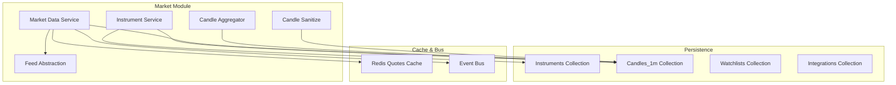
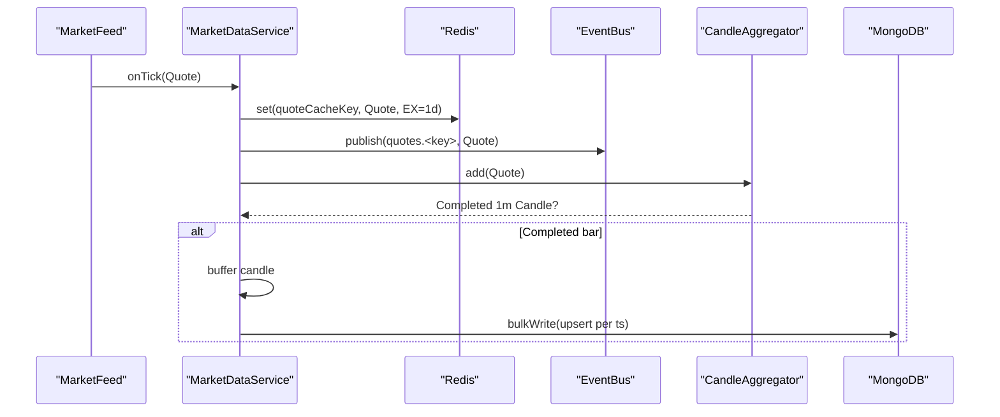
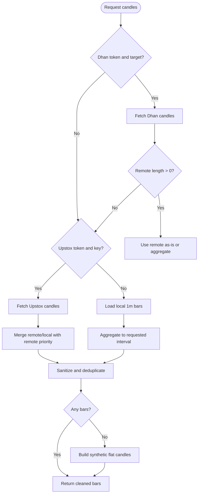
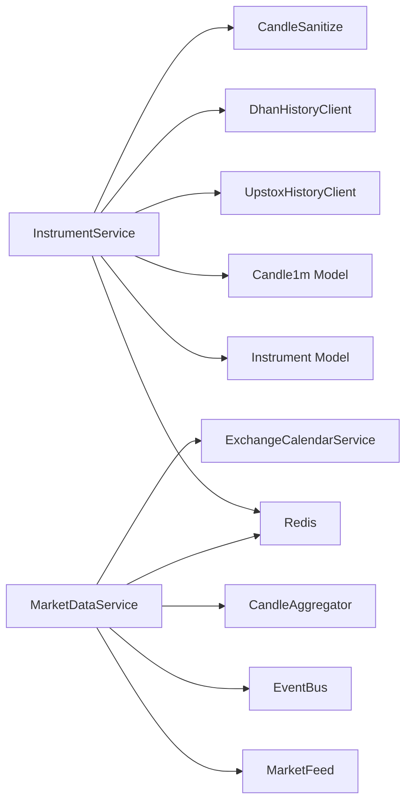

# Market Data Entities

<cite>
**Referenced Files in This Document**
- [instrument.schema.ts](file://backend/apps/api/src/modules/market/infrastructure/schemas/instrument.schema.ts)
- [candle.schema.ts](file://backend/apps/api/src/modules/market/infrastructure/schemas/candle.schema.ts)
- [watchlist.schema.ts](file://backend/apps/api/src/modules/market/infrastructure/schemas/watchlist.schema.ts)
- [integration-settings.schema.ts](file://backend/apps/api/src/modules/market/infrastructure/schemas/integration-settings.schema.ts)
- [instrument.service.ts](file://backend/apps/api/src/modules/market/application/instrument.service.ts)
- [market-data.service.ts](file://backend/apps/api/src/modules/market/application/market-data.service.ts)
- [candle-aggregator.ts](file://backend/apps/api/src/modules/market/domain/candle-aggregator.ts)
- [candle-sanitize.ts](file://backend/apps/api/src/modules/market/domain/candle-sanitize.ts)
- [instrument-sync.service.ts](file://backend/apps/api/src/modules/market/application/instrument-sync.service.ts)
- [market-feed.port.ts](file://backend/apps/api/src/modules/market/infrastructure/feed/market-feed.port.ts)
- [market.types.ts](file://backend/libs/shared/src/market/market.types.ts)
- [market.dtos.ts](file://backend/apps/api/src/modules/market/presentation/dto/market.dtos.ts)
</cite>

## Table of Contents
1. Introduction
2. Project Structure
3. Core Components
4. Architecture Overview
5. Detailed Component Analysis
6. Dependency Analysis
7. Performance Considerations
8. Troubleshooting Guide
9. Conclusion

## Introduction
This document provides a comprehensive data model and operational guide for market data entities: Instruments, Candles, Watchlists, and Integration Settings. It explains schemas, validation rules, time-series optimization techniques, caching strategies for high-frequency data, retention and archival considerations, and performance tuning for large-scale operations. The goal is to make the system understandable for both technical and non-technical readers while remaining grounded in the actual codebase.

## Project Structure
The market data subsystem is organized under the market module with clear separation between domain logic, application services, infrastructure (schemas, feeds), and presentation (DTOs). Key areas:
- Schemas define persistent models for instruments, candles, watchlists, and integration settings.
- Application services orchestrate data flows: instrument catalog management, candle aggregation, quote caching, and history retrieval.
- Infrastructure includes feed abstraction and broker history clients.
- Shared types define contracts for quotes and candles used across the engine and API.

**Diagram sources**
- [instrument.service.ts:150-288](file://backend/apps/api/src/modules/market/application/instrument.service.ts#L150-L288)
- [market-data.service.ts:103-137](file://backend/apps/api/src/modules/market/application/market-data.service.ts#L103-L137)
- [candle-aggregator.ts:13-51](file://backend/apps/api/src/modules/market/domain/candle-aggregator.ts#L13-L51)
- [candle-sanitize.ts:33-147](file://backend/apps/api/src/modules/market/domain/candle-sanitize.ts#L33-L147)
- [market-feed.port.ts:7-22](file://backend/apps/api/src/modules/market/infrastructure/feed/market-feed.port.ts#L7-L22)

**Section sources**
- [instrument.schema.ts:1-76](file://backend/apps/api/src/modules/market/infrastructure/schemas/instrument.schema.ts#L1-L76)
- [candle.schema.ts:1-22](file://backend/apps/api/src/modules/market/infrastructure/schemas/candle.schema.ts#L1-L22)
- [watchlist.schema.ts:1-31](file://backend/apps/api/src/modules/market/infrastructure/schemas/watchlist.schema.ts#L1-L31)
- [integration-settings.schema.ts:1-40](file://backend/apps/api/src/modules/market/infrastructure/schemas/integration-settings.schema.ts#L1-L40)

## Core Components
- Instrument: Master catalog of tradable instruments with exchange mappings, company details, trading metadata, and cross-broker identifiers.
- Candle: Time-series OHLCV records at 1-minute granularity, indexed by instrument and timestamp.
- Watchlist: User-defined collections of instruments with ordering and tab support for built-in categories and custom lists.
- Integration Settings: Provider configuration including feed mode and encrypted credentials for broker connections.

Key responsibilities:
- InstrumentService: Catalog search, segment browsing, quotes cache, candle history retrieval, option chain assembly.
- MarketDataService: Real-time tick ingestion, Redis quote caching, event bus publishing, 1m candle aggregation and flush.
- CandleAggregator: Pure aggregator that emits completed minute bars from ticks.
- CandleSanitize: Validation, normalization, deduplication, outlier filtering, and aggregation utilities.

**Section sources**
- [instrument.service.ts:40-183](file://backend/apps/api/src/modules/market/application/instrument.service.ts#L40-L183)
- [market-data.service.ts:24-52](file://backend/apps/api/src/modules/market/application/market-data.service.ts#L24-L52)
- [candle-aggregator.ts:13-51](file://backend/apps/api/src/modules/market/domain/candle-aggregator.ts#L13-L51)
- [candle-sanitize.ts:5-147](file://backend/apps/api/src/modules/market/domain/candle-sanitize.ts#L5-L147)

## Architecture Overview
The market data pipeline ingests normalized ticks via a single MarketFeed instance, writes quotes to Redis with TTL, publishes events on an event bus, aggregates 1m candles, and persists them in batches. Historical charting prefers broker-provided candles (Dhan or Upstox), merges with local 1m bars, and falls back to synthetic flat candles when no history exists.

**Diagram sources**
- [market-data.service.ts:103-126](file://backend/apps/api/src/modules/market/application/market-data.service.ts#L103-L126)
- [market-feed.port.ts:7-22](file://backend/apps/api/src/modules/market/infrastructure/feed/market-feed.port.ts#L7-L22)
- [candle-aggregator.ts:13-51](file://backend/apps/api/src/modules/market/domain/candle-aggregator.ts#L13-L51)

**Section sources**
- [market-data.service.ts:15-52](file://backend/apps/api/src/modules/market/application/market-data.service.ts#L15-L52)
- [market.types.ts:5-38](file://backend/libs/shared/src/market/market.types.ts#L5-L38)

## Detailed Component Analysis

### Instrument Schema
- Purpose: Master catalog of tradable instruments; one row per instrument.
- Fields:
  - instrumentKey: Unique identifier (e.g., Upstox instrument_key).
  - symbol: Trading symbol (e.g., RELIANCE, NIFTY 50).
  - name: Company or index name.
  - exchange: Exchange code (NSE, BSE).
  - segment: Market segment (EQ, FO, CUR, INDEX).
  - lotSize, tickSize, freezeQty: Trading parameters.
  - expiry, strike, optType: Derivatives-specific fields.
  - underlyingKey: Groups options/futures by underlying for chain building.
  - enabled: Flag to include/exclude from trader catalog.
  - angelToken, angelExchangeType: Angel One SmartAPI identifiers.
  - dhanSecurityId, dhanExchangeSegment: Dhan master identifiers.
- Indexes:
  - Unique on instrumentKey.
  - Text search on symbol and name.
  - Composite indexes for segment+enabled, underlyingKey+expiry+strike, symbol, exchange+segment+symbol.

Validation and constraints:
- Required fields enforced by schema definitions.
- Enum constraints for exchange and segment.
- Boolean default for enabled ensures new rows are visible unless explicitly disabled.

Operational notes:
- Synced daily from Upstox and optionally enriched from Dhan master CSV.
- BSE instruments are disabled during sync to restrict to supported exchanges.

**Section sources**
- [instrument.schema.ts:4-76](file://backend/apps/api/src/modules/market/infrastructure/schemas/instrument.schema.ts#L4-L76)
- [instrument-sync.service.ts:37-97](file://backend/apps/api/src/modules/market/application/instrument-sync.service.ts#L37-L97)
- [instrument-sync.service.ts:99-188](file://backend/apps/api/src/modules/market/application/instrument-sync.service.ts#L99-L188)
- [instrument-sync.service.ts:210-225](file://backend/apps/api/src/modules/market/application/instrument-sync.service.ts#L210-L225)

### Candle Schema
- Purpose: Store 1-minute OHLCV time series for each instrument.
- Fields:
  - instrumentKey: Foreign reference to instrument catalog.
  - ts: Minute-aligned epoch milliseconds.
  - o, h, l, c, v: Open, high, low, close, volume.
- Indexes:
  - Unique composite index on instrumentKey + ts to ensure one bar per minute.

Data quality:
- Bars are sanitized, normalized, and deduplicated before persistence.
- Outlier filtering removes polluted simulator or wrong-symbol bars.

Time-series optimization:
- Ingestion buffers completed bars and flushes in batches to reduce write overhead.
- Aggregation supports higher timeframes by rolling up 1m bars.

**Section sources**
- [candle.schema.ts:4-22](file://backend/apps/api/src/modules/market/infrastructure/schemas/candle.schema.ts#L4-L22)
- [candle-sanitize.ts:33-147](file://backend/apps/api/src/modules/market/domain/candle-sanitize.ts#L33-L147)
- [market-data.service.ts:110-126](file://backend/apps/api/src/modules/market/application/market-data.service.ts#L110-L126)

### Watchlist Schema
- Purpose: User-defined instrument collections with ordering and tab support.
- Fields:
  - userId: Owner reference.
  - tab: Built-in tabs (STOCKS, INDICES, OPTIONS, CURRENCY) or custom WL1..WL20.
  - name: Optional display name for custom lists.
  - items: Array of { instrumentKey, sort } defining order.
- Indexes:
  - Unique composite on userId + tab to enforce one list per tab per user.

Behavior:
- Built-in tabs map to segments (EQ, INDEX, FO, CUR) and can show counts from the instrument catalog.
- Custom lists limited to 20 per user; adding duplicates is idempotent.
- Reordering updates sort values based on provided ordered keys.

**Section sources**
- [watchlist.schema.ts:4-31](file://backend/apps/api/src/modules/market/infrastructure/schemas/watchlist.schema.ts#L4-L31)
- [market.dtos.ts:4-56](file://backend/apps/api/src/modules/market/presentation/dto/market.dtos.ts#L4-L56)

### Integration Settings Schema
- Purpose: Singleton-like provider configuration for market data adapters.
- Fields:
  - provider: Identifier (e.g., upstox).
  - feedMode: Active adapter selection (simulator, upstox, angel, dhan).
  - accessTokenEnc, apiKeyEnc, apiSecretEnc: Encrypted secrets.
  - clientCode: Non-secret identifier for Angel One.
  - feedTokenEnc: Encrypted feed token for Angel One.
  - updatedBy: Audit field indicating last updater.

Security:
- Secrets stored encrypted; environment variables serve as fallback when DB row is absent.

**Section sources**
- [integration-settings.schema.ts:4-40](file://backend/apps/api/src/modules/market/infrastructure/schemas/integration-settings.schema.ts#L4-L40)

### Candle Aggregation and History Retrieval
- Aggregation:
  - CandleAggregator maintains open bars per instrument and emits completed minute bars when timestamps cross minute boundaries.
  - Flush closes all open bars at session end or shutdown.
- History retrieval:
  - InstrumentService.candles prefers Dhan charts API if configured; otherwise falls back to Upstox historical REST.
  - For 1m intervals, fetched remote bars are upserted into MongoDB for future use.
  - Higher timeframes are aggregated from 1m bars using sanitize and aggregation utilities.
  - Merge strategy ensures remote broker history wins over local simulator bars to avoid inflated highs/lows.
  - Synthetic flat candles are generated when no live or historical data is available.

**Diagram sources**
- [instrument.service.ts:190-288](file://backend/apps/api/src/modules/market/application/instrument.service.ts#L190-L288)
- [candle-sanitize.ts:94-147](file://backend/apps/api/src/modules/market/domain/candle-sanitize.ts#L94-L147)

**Section sources**
- [candle-aggregator.ts:13-51](file://backend/apps/api/src/modules/market/domain/candle-aggregator.ts#L13-L51)
- [instrument.service.ts:190-288](file://backend/apps/api/src/modules/market/application/instrument.service.ts#L190-L288)
- [candle-sanitize.ts:94-147](file://backend/apps/api/src/modules/market/domain/candle-sanitize.ts#L94-L147)

### Option Chain Assembly
- Resolves underlying key for derivatives and filters options by exchange, segment, and expiry.
- Retrieves spot LTP from Redis cache to compute ATM band.
- Builds strike map grouping CE and PE legs, then slices around ATM based on atmSpan.

**Section sources**
- [instrument.service.ts:332-388](file://backend/apps/api/src/modules/market/application/instrument.service.ts#L332-L388)

## Dependency Analysis
- InstrumentService depends on:
  - Instrument and Candle1m models for catalog and time-series data.
  - Redis for quote caching and last-close fallbacks.
  - UpstoxHistoryClient and DhanHistoryClient for historical data.
  - CandleSanitize utilities for validation and aggregation.
- MarketDataService depends on:
  - MarketFeed abstraction for real-time ticks.
  - Redis for quote cache and TTL.
  - Event Bus for fan-out to subscribers.
  - CandleAggregator for 1m bar construction.
  - ExchangeCalendarService for stale feed detection during market hours.

**Diagram sources**
- [instrument.service.ts:40-50](file://backend/apps/api/src/modules/market/application/instrument.service.ts#L40-L50)
- [market-data.service.ts:34-41](file://backend/apps/api/src/modules/market/application/market-data.service.ts#L34-L41)

**Section sources**
- [instrument.service.ts:40-50](file://backend/apps/api/src/modules/market/application/instrument.service.ts#L40-L50)
- [market-data.service.ts:34-41](file://backend/apps/api/src/modules/market/application/market-data.service.ts#L34-L41)

## Performance Considerations
- High-frequency ingestion:
  - Batched upserts for candles reduce database round-trips.
  - Quote cache TTL prevents stale reads and limits memory usage.
  - On-demand subscription to upstream feed minimizes bandwidth and processing load.
- Time-series optimization:
  - Minute-aligned buckets enable efficient aggregation and indexing.
  - Outlier filtering and merge strategies protect aggregated bars from pollution.
- Large-scale operations:
  - Bulk writes and allowDiskUse for catalog queries handle large instrument sets.
  - Segment-based pagination and counting optimize UI responsiveness.
- Retention and archival:
  - Current implementation stores 1m candles indefinitely; consider implementing TTL or partitioning by date ranges for long-term storage.
  - Archive older days to cold storage and maintain recent hot data for low-latency access.
- Caching strategies:
  - Redis quote cache with 24-hour TTL balances freshness and performance.
  - Last-close fallback uses recent historical bars or reference prices to provide meaningful quotes when live data is unavailable.

[No sources needed since this section provides general guidance]

## Troubleshooting Guide
Common issues and mitigations:
- Stale feed detection:
  - If no ticks arrive during market hours beyond threshold, the service logs a warning and resubscribes tracked keys.
- Polluted candles:
  - Sanitization and outlier filtering remove invalid or anomalous bars; merging prioritizes remote broker data over local simulator bars.
- Missing history:
  - When no broker tokens are configured, the service generates synthetic flat candles based on reference prices or last known close.
- Quote staleness:
  - Simulator quotes outside reference price bands are rejected; fallback to last close or reference quote ensures reasonable displays.

**Section sources**
- [market-data.service.ts:128-137](file://backend/apps/api/src/modules/market/application/market-data.service.ts#L128-L137)
- [candle-sanitize.ts:5-73](file://backend/apps/api/src/modules/market/domain/candle-sanitize.ts#L5-L73)
- [instrument.service.ts:290-330](file://backend/apps/api/src/modules/market/application/instrument.service.ts#L290-L330)
- [instrument.service.ts:591-601](file://backend/apps/api/src/modules/market/application/instrument.service.ts#L591-L601)

## Conclusion
The market data subsystem provides a robust foundation for managing instruments, storing and aggregating time-series data, curating user watchlists, and configuring broker integrations. With careful validation, caching, and aggregation strategies, it supports high-frequency operations and scalable historical analysis. Future enhancements may include configurable retention policies, advanced archival procedures, and further performance tuning for extremely large datasets.

[No sources needed since this section summarizes without analyzing specific files]