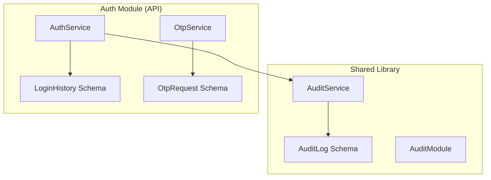
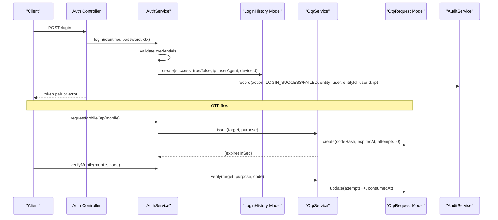
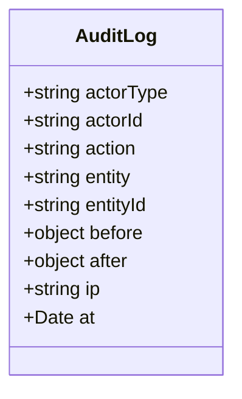
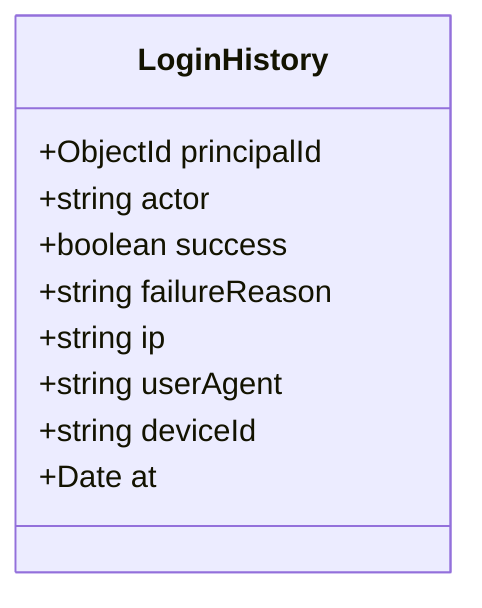
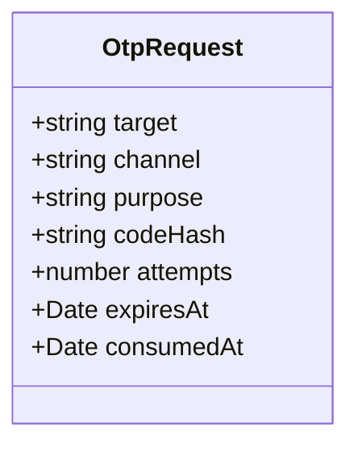
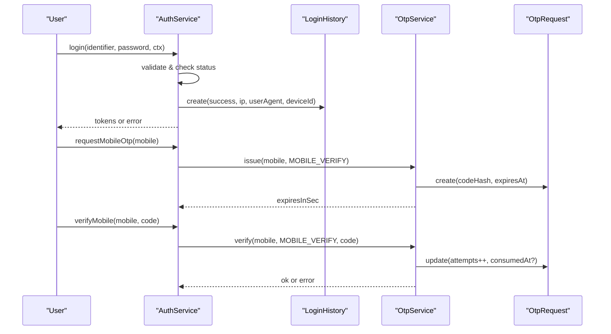
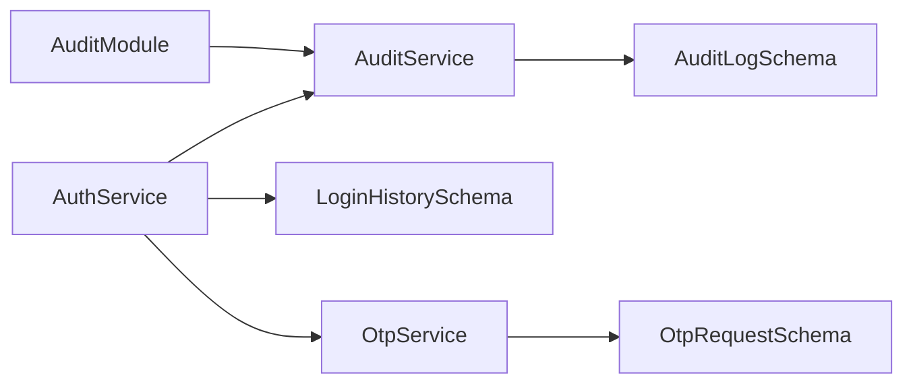

# System Entities

<cite>
**Referenced Files in This Document**
- [audit-log.schema.ts](file://backend/libs/shared/src/audit/audit-log.schema.ts)
- [audit.service.ts](file://backend/libs/shared/src/audit/audit.service.ts)
- [audit.module.ts](file://backend/libs/shared/src/audit/audit.module.ts)
- [login-history.schema.ts](file://backend/apps/api/src/modules/auth/infrastructure/schemas/login-history.schema.ts)
- [otp-request.schema.ts](file://backend/apps/api/src/modules/auth/infrastructure/schemas/otp-request.schema.ts)
- [auth.service.ts](file://backend/apps/api/src/modules/auth/application/auth.service.ts)
- [otp.service.ts](file://backend/apps/api/src/modules/auth/infrastructure/otp.service.ts)
- [crypto.util.ts](file://backend/apps/api/src/modules/auth/infrastructure/crypto.util.ts)
</cite>

## Table of Contents
1. Introduction
2. Project Structure
3. Core Components
4. Architecture Overview
5. Detailed Component Analysis
6. Dependency Analysis
7. Performance Considerations
8. Troubleshooting Guide
9. Conclusion

## Introduction
This document provides comprehensive data model documentation for system-level entities used for auditing, security monitoring, and multi-factor authentication: Audit Logs, Login History, and OTP Requests. It explains schemas, fields, relationships, processing logic, retention considerations, GDPR implications, performance characteristics, and security controls for storing sensitive audit data.

## Project Structure
The relevant data models and services are implemented across shared and API modules:
- Audit Log schema and service reside in the shared library to be reusable across features.
- Login History and OTP Request schemas live under the Auth module’s infrastructure layer.
- The Auth service orchestrates login flows, writes login history, and issues/verifies OTPs via OTP service.



**Diagram sources**
- [audit-log.schema.ts:1-41](file://backend/libs/shared/src/audit/audit-log.schema.ts#L1-L41)
- [audit.service.ts:1-45](file://backend/libs/shared/src/audit/audit.service.ts#L1-L45)
- [audit.module.ts:1-13](file://backend/libs/shared/src/audit/audit.module.ts#L1-L13)
- [login-history.schema.ts:1-33](file://backend/apps/api/src/modules/auth/infrastructure/schemas/login-history.schema.ts#L1-L33)
- [otp-request.schema.ts:1-34](file://backend/apps/api/src/modules/auth/infrastructure/schemas/otp-request.schema.ts#L1-L34)
- [auth.service.ts:1-346](file://backend/apps/api/src/modules/auth/application/auth.service.ts#L1-L346)
- [otp.service.ts:1-76](file://backend/apps/api/src/modules/auth/infrastructure/otp.service.ts#L1-L76)

**Section sources**
- [audit-log.schema.ts:1-41](file://backend/libs/shared/src/audit/audit-log.schema.ts#L1-L41)
- [audit.service.ts:1-45](file://backend/libs/shared/src/audit/audit.service.ts#L1-L45)
- [audit.module.ts:1-13](file://backend/libs/shared/src/audit/audit.module.ts#L1-L13)
- [login-history.schema.ts:1-33](file://backend/apps/api/src/modules/auth/infrastructure/schemas/login-history.schema.ts#L1-L33)
- [otp-request.schema.ts:1-34](file://backend/apps/api/src/modules/auth/infrastructure/schemas/otp-request.schema.ts#L1-L34)
- [auth.service.ts:145-183](file://backend/apps/api/src/modules/auth/application/auth.service.ts#L145-L183)
- [otp.service.ts:28-74](file://backend/apps/api/src/modules/auth/infrastructure/otp.service.ts#L28-L74)

## Core Components
- Audit Log: Immutable, write-once records capturing actor type, actor ID, action, entity, entity ID, before/after snapshots, IP address, and timestamp. Designed for high-volume append-only logging with indexes for efficient queries by entity, actor, and time.
- Login History: Security-focused log of login attempts per principal, including success/failure status, failure reason, IP, user agent, device ID, and timestamp. Used for threat detection and new-device notifications.
- OTP Request: Multi-factor authentication request record storing target (mobile), channel, purpose, hashed code, attempt count, expiration, and consumption time. Supports rate limiting, cooldown, and TTL-based expiry.

**Section sources**
- [audit-log.schema.ts:1-41](file://backend/libs/shared/src/audit/audit-log.schema.ts#L1-L41)
- [login-history.schema.ts:1-33](file://backend/apps/api/src/modules/auth/infrastructure/schemas/login-history.schema.ts#L1-L33)
- [otp-request.schema.ts:1-34](file://backend/apps/api/src/modules/auth/infrastructure/schemas/otp-request.schema.ts#L1-L34)

## Architecture Overview
The system uses a layered approach:
- Controllers invoke application services.
- Application services orchestrate domain operations and persist audit and security events.
- Infrastructure schemas define MongoDB collections and indexes.
- Shared AuditModule exposes AuditService globally for cross-module auditing.



**Diagram sources**
- [auth.service.ts:145-183](file://backend/apps/api/src/modules/auth/application/auth.service.ts#L145-L183)
- [auth.service.ts:318-328](file://backend/apps/api/src/modules/auth/application/auth.service.ts#L318-L328)
- [otp.service.ts:28-74](file://backend/apps/api/src/modules/auth/infrastructure/otp.service.ts#L28-L74)
- [audit.service.ts:29-43](file://backend/libs/shared/src/audit/audit.service.ts#L29-L43)

## Detailed Component Analysis

### Audit Log Data Model
- Collection: audit_logs
- Fields:
  - actorType: enum USER | EMPLOYEE | SYSTEM
  - actorId: string identifier of the actor
  - action: string describing the operation
  - entity: string representing the affected business entity
  - entityId: string identifier of the specific entity instance
  - before: optional object capturing pre-change state
  - after: optional object capturing post-change state
  - ip: optional client IP address
  - at: immutable timestamp (createdAt alias)
- Indexes:
  - entity + entityId + at (descending)
  - actorId + at (descending)
  - at (descending)
- Design notes:
  - Write-once, no update/delete paths in code; immutability enforced by design.
  - High cardinality on at supports time-range queries and recent activity views.



**Diagram sources**
- [audit-log.schema.ts:1-41](file://backend/libs/shared/src/audit/audit-log.schema.ts#L1-L41)

**Section sources**
- [audit-log.schema.ts:1-41](file://backend/libs/shared/src/audit/audit-log.schema.ts#L1-L41)

### Audit Service Usage
- Provides record(entry) that never throws; failures are logged for alerting without aborting business operations.
- Query helpers:
  - forEntity(entity, entityId, limit): returns recent entries for an entity
  - forActor(actorId, limit): returns recent entries for an actor
- Global module exposure allows any feature to audit actions consistently.

```mermaid
flowchart TD
Start([record(entry)]) --> TryCreate["Attempt create(AuditLog)"]
TryCreate --> Success{"Success?"}
Success --> |Yes| End([Done])
Success --> |No| LogError["Log error for alerting"] --> End
```

**Diagram sources**
- [audit.service.ts:29-43](file://backend/libs/shared/src/audit/audit.service.ts#L29-L43)

**Section sources**
- [audit.service.ts:1-45](file://backend/libs/shared/src/audit/audit.service.ts#L1-L45)
- [audit.module.ts:1-13](file://backend/libs/shared/src/audit/audit.module.ts#L1-L13)

### Login History Data Model
- Collection: login_history
- Fields:
  - principalId: ObjectId reference to the user/employee
  - actor: enum USER | EMPLOYEE
  - success: boolean indicating outcome
  - failureReason: optional string explaining failure
  - ip: optional client IP
  - userAgent: optional browser/client info
  - deviceId: optional device identifier
  - at: immutable timestamp
- Indexes:
  - principalId + at (descending) for per-user timeline
- Usage:
  - Written on every login attempt (success or failure).
  - Used to detect new devices and send security notifications.



**Diagram sources**
- [login-history.schema.ts:1-33](file://backend/apps/api/src/modules/auth/infrastructure/schemas/login-history.schema.ts#L1-L33)

**Section sources**
- [login-history.schema.ts:1-33](file://backend/apps/api/src/modules/auth/infrastructure/schemas/login-history.schema.ts#L1-L33)
- [auth.service.ts:318-328](file://backend/apps/api/src/modules/auth/application/auth.service.ts#L318-L328)

### OTP Request Data Model
- Collection: otp_requests
- Fields:
  - target: mobile number in E.164 format
  - channel: fixed SMS
  - purpose: MOBILE_VERIFY | MOBILE_CHANGE
  - codeHash: sha256(code + pepper) — stores only hash, not plaintext
  - attempts: counter incremented on invalid verification
  - expiresAt: TTL for code validity
  - consumedAt: optional timestamp when code is successfully used
- Indexes:
  - target + createdAt (descending)
  - expiresAt with TTL policy (expireAfterSeconds)
- Behavior:
  - Rate limits per hour and cooldown between resends enforced in service.
  - Verification increments attempts and marks consumed upon success.



**Diagram sources**
- [otp-request.schema.ts:1-34](file://backend/apps/api/src/modules/auth/infrastructure/schemas/otp-request.schema.ts#L1-L34)

**Section sources**
- [otp-request.schema.ts:1-34](file://backend/apps/api/src/modules/auth/infrastructure/schemas/otp-request.schema.ts#L1-L34)
- [otp.service.ts:28-74](file://backend/apps/api/src/modules/auth/infrastructure/otp.service.ts#L28-L74)

### Authentication Flow and Security Monitoring
- Login flow:
  - Validates credentials, checks account status, issues tokens, records successful login, and audits the event.
  - On failure, records failure reason and audits accordingly.
  - Detects new devices using LoginHistory and sends email notification.
- OTP flow:
  - Issues OTP with TTL and stores only hashed code.
  - Enforces per-hour limits and resend cooldown.
  - Verifies against latest active OTP, increments attempts on failure, marks consumed on success.



**Diagram sources**
- [auth.service.ts:145-183](file://backend/apps/api/src/modules/auth/application/auth.service.ts#L145-L183)
- [auth.service.ts:318-328](file://backend/apps/api/src/modules/auth/application/auth.service.ts#L318-L328)
- [otp.service.ts:28-74](file://backend/apps/api/src/modules/auth/infrastructure/otp.service.ts#L28-L74)

**Section sources**
- [auth.service.ts:145-183](file://backend/apps/api/src/modules/auth/application/auth.service.ts#L145-L183)
- [auth.service.ts:318-328](file://backend/apps/api/src/modules/auth/application/auth.service.ts#L318-L328)
- [otp.service.ts:28-74](file://backend/apps/api/src/modules/auth/infrastructure/otp.service.ts#L28-L74)

## Dependency Analysis
- AuditService depends on Mongoose model for AuditLog and is exposed globally via AuditModule.
- AuthService depends on:
  - User and Session models for authentication
  - LoginHistory model for security monitoring
  - OtpService for OTP issuance and verification
  - AuditService for cross-cutting audit logging
- OtpService depends on:
  - OtpRequest model for persistence
  - SMS sender port for delivery
  - Configuration for OTP limits and TTL



**Diagram sources**
- [audit.module.ts:1-13](file://backend/libs/shared/src/audit/audit.module.ts#L1-L13)
- [audit.service.ts:1-45](file://backend/libs/shared/src/audit/audit.service.ts#L1-L45)
- [auth.service.ts:1-346](file://backend/apps/api/src/modules/auth/application/auth.service.ts#L1-L346)
- [otp.service.ts:1-76](file://backend/apps/api/src/modules/auth/infrastructure/otp.service.ts#L1-L76)

**Section sources**
- [audit.module.ts:1-13](file://backend/libs/shared/src/audit/audit.module.ts#L1-L13)
- [auth.service.ts:1-346](file://backend/apps/api/src/modules/auth/application/auth.service.ts#L1-L346)
- [otp.service.ts:1-76](file://backend/apps/api/src/modules/auth/infrastructure/otp.service.ts#L1-L76)

## Performance Considerations
- Indexing strategy:
  - Audit logs: indexes on entity+entityId+at, actorId+at, and at support common query patterns (recent activity, per-entity timelines).
  - Login history: index on principalId+at enables fast per-user login timelines.
  - OTP requests: index on target+createdAt and TTL index on expiresAt ensure efficient lookups and automatic cleanup.
- Write-once semantics:
  - Audit logs are immutable; avoid updates/deletes to maintain integrity and simplify compaction.
- Rate limiting and cooldowns:
  - OTP issuance enforces per-hour limits and resend cooldowns to reduce load and abuse.
- Asynchronous resilience:
  - AuditService.record() catches errors and logs them without failing the caller, ensuring high availability even if logging backend is degraded.
- Storage growth:
  - Use TTL on OTP requests to auto-expire old codes.
  - Consider database partitioning or sharding strategies for high-volume audit logs based on time ranges.

[No sources needed since this section provides general guidance]

## Troubleshooting Guide
- Audit write failures:
  - Symptoms: Missing audit entries despite successful business operations.
  - Investigation: Check AuditService error logs for “AUDIT WRITE FAILED” messages.
  - Mitigation: Ensure database connectivity and capacity; consider retry/backoff policies if needed.
- OTP issues:
  - Too many requests: Verify per-hour limits and cooldown settings; adjust configuration if necessary.
  - Code expired: Ensure clients handle expiration and prompt re-request.
  - Invalid code: Confirm correct hashing with pepper and that attempts are tracked properly.
- Login anomalies:
  - Frequent failures: Review failure reasons in LoginHistory; investigate potential brute-force or misconfiguration.
  - New device alerts: Validate email delivery and ensure device tracking headers are present.

**Section sources**
- [audit.service.ts:29-43](file://backend/libs/shared/src/audit/audit.service.ts#L29-L43)
- [otp.service.ts:28-74](file://backend/apps/api/src/modules/auth/infrastructure/otp.service.ts#L28-L74)
- [auth.service.ts:318-328](file://backend/apps/api/src/modules/auth/application/auth.service.ts#L318-L328)

## Conclusion
The system implements robust, secure, and scalable data models for auditing, login monitoring, and OTP-based multi-factor authentication. Audit logs provide immutable, indexed records for compliance and investigation. Login history supports security monitoring and anomaly detection. OTP requests enforce strict lifecycle management with hashed codes, rate limits, and TTL-based expiration. Together, these components form a strong foundation for security, compliance, and operational visibility.

[No sources needed since this section summarizes without analyzing specific files]

## Appendices

### Data Retention Policies
- Audit Logs:
  - No built-in TTL; plan for periodic archival or deletion based on compliance requirements.
  - Use indexes to efficiently query recent entries and older archives.
- Login History:
  - No TTL; implement retention jobs to archive or delete older records per policy.
- OTP Requests:
  - TTL index automatically removes expired codes after configured seconds.

[No sources needed since this section provides general guidance]

### GDPR Compliance Considerations
- Minimize personal data:
  - Store only necessary fields (e.g., IP, device identifiers) and avoid sensitive payloads in audit logs.
- Right to erasure:
  - Provide mechanisms to anonymize or delete records where legally required, especially for Login History and OTP Requests.
- Lawful basis and transparency:
  - Document purposes for collecting and retaining audit and login data; inform users via privacy notices.
- Data minimization and storage limitation:
  - Apply retention policies and TTL where applicable; avoid indefinite retention.

[No sources needed since this section provides general guidance]

### Security Implications and Controls
- Sensitive data handling:
  - OTP codes are stored as hashes using a pepper; never store plaintext codes.
  - Encryption utilities exist for field-level encryption of sensitive values at rest.
- Access controls:
  - Restrict access to audit and login history tables to authorized roles (e.g., admin, security teams).
  - Enforce least privilege for database access and API endpoints exposing these records.
- Transport security:
  - Ensure HTTPS for all APIs to protect IPs, user agents, and tokens in transit.
- Monitoring and alerting:
  - Alert on audit write failures and unusual login patterns (e.g., spikes in failures, new devices).

**Section sources**
- [otp.service.ts:28-74](file://backend/apps/api/src/modules/auth/infrastructure/otp.service.ts#L28-L74)
- [crypto.util.ts:1-44](file://backend/apps/api/src/modules/auth/infrastructure/crypto.util.ts#L1-L44)