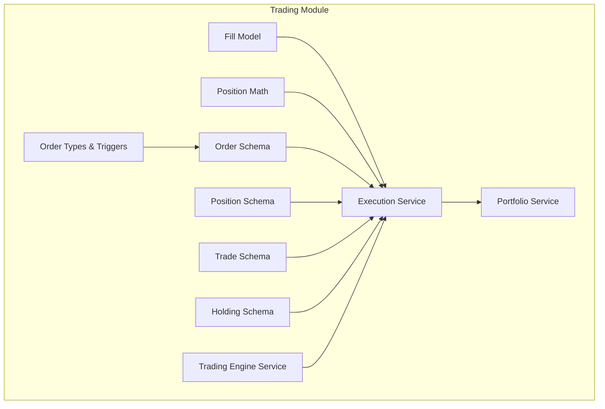
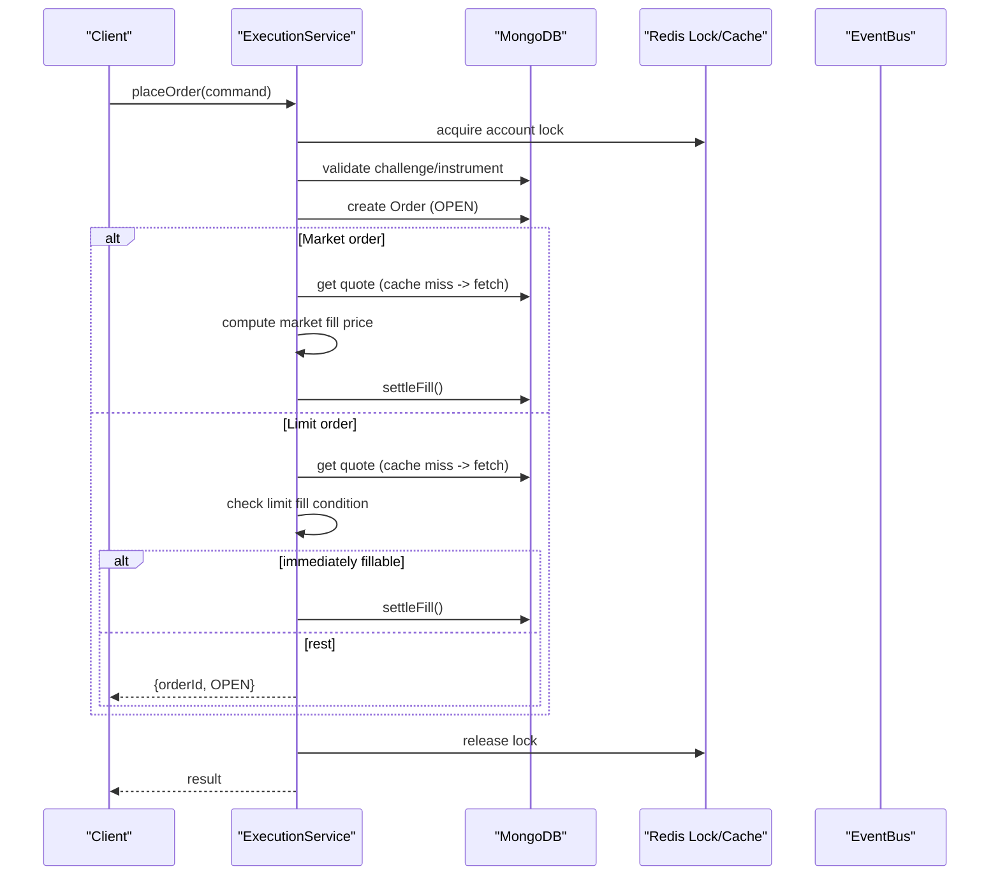
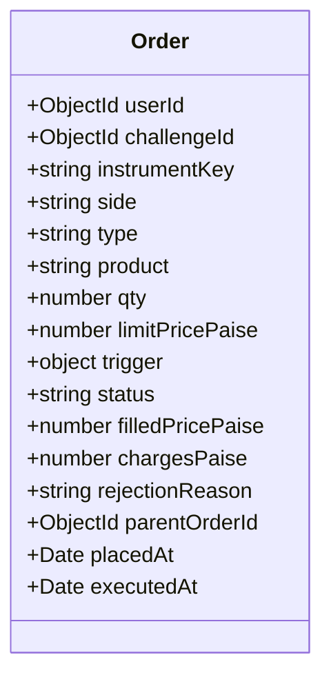
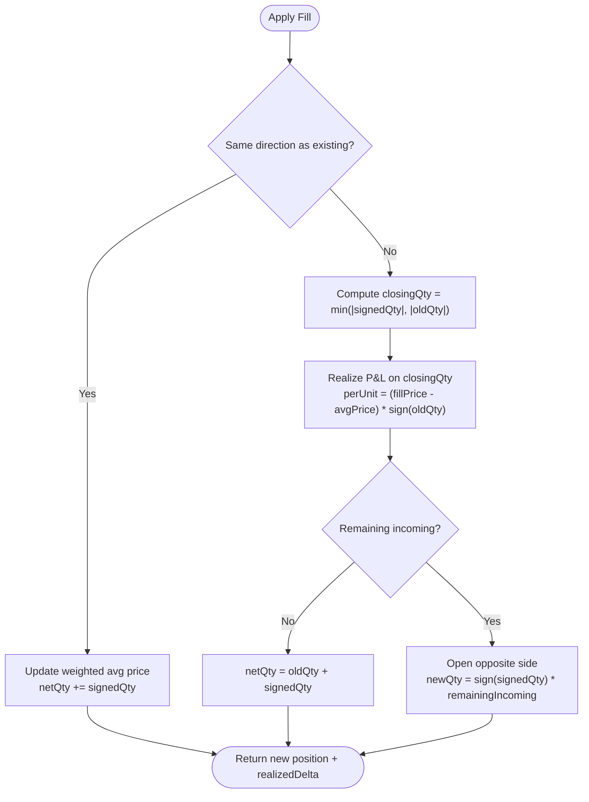
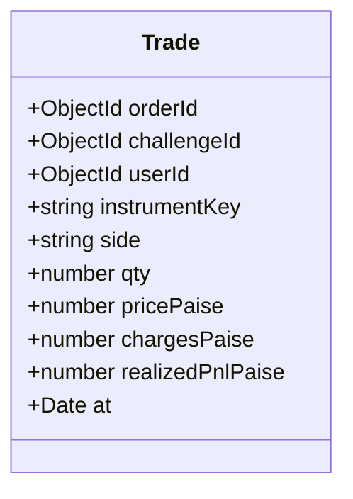
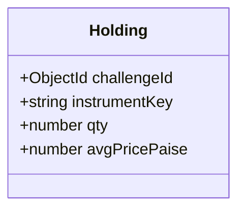
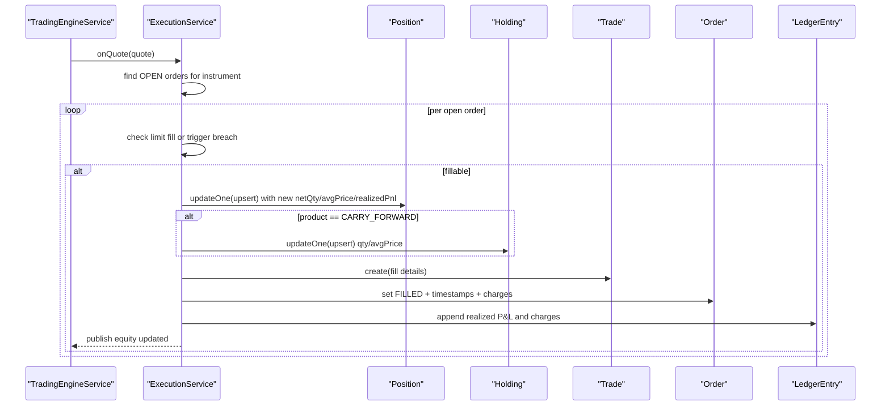
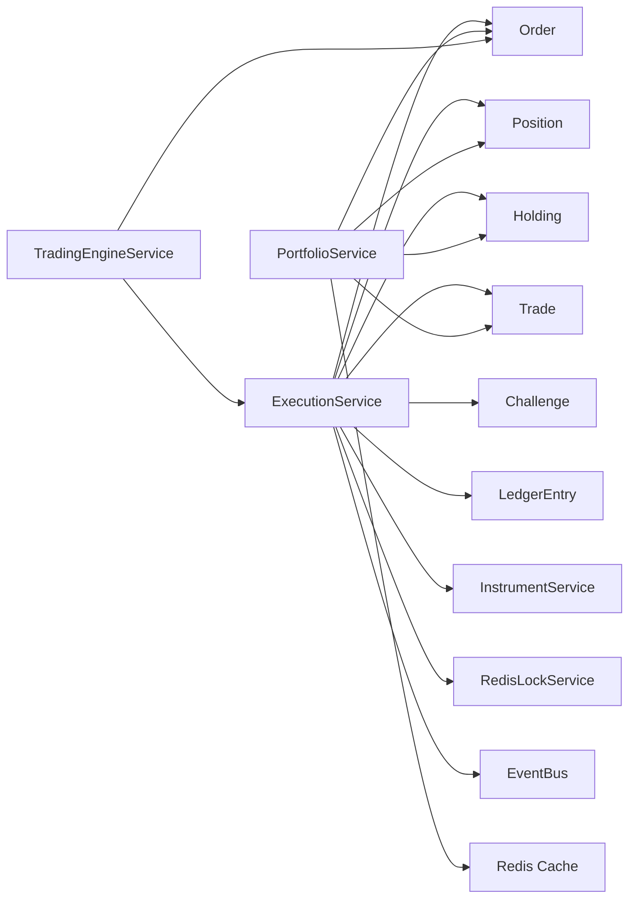

# Trading Entities

<cite>
**Referenced Files in This Document**
- [order.schema.ts](file://backend/apps/api/src/modules/trading/infrastructure/schemas/order.schema.ts)
- [position.schema.ts](file://backend/apps/api/src/modules/trading/infrastructure/schemas/position.schema.ts)
- [trade.schema.ts](file://backend/apps/api/src/modules/trading/infrastructure/schemas/trade.schema.ts)
- [holding.schema.ts](file://backend/apps/api/src/modules/trading/infrastructure/schemas/holding.schema.ts)
- [order.types.ts](file://backend/apps/api/src/modules/trading/domain/order.types.ts)
- [position-math.ts](file://backend/apps/api/src/modules/trading/domain/position-math.ts)
- [fill-model.ts](file://backend/apps/api/src/modules/trading/domain/fill-model.ts)
- [execution.service.ts](file://backend/apps/api/src/modules/trading/application/execution.service.ts)
- [trading-engine.service.ts](file://backend/apps/api/src/modules/trading/application/trading-engine.service.ts)
- [portfolio.service.ts](file://backend/apps/api/src/modules/trading/application/portfolio.service.ts)
- [audit-log.schema.ts](file://backend/libs/shared/src/audit/audit-log.schema.ts)
- [audit.service.ts](file://backend/libs/shared/src/audit/audit.service.ts)
</cite>

## Table of Contents
1. [Introduction](#introduction)
2. [Project Structure](#project-structure)
3. [Core Components](#core-components)
4. [Architecture Overview](#architecture-overview)
5. [Detailed Component Analysis](#detailed-component-analysis)
6. [Dependency Analysis](#dependency-analysis)
7. [Performance Considerations](#performance-considerations)
8. [Troubleshooting Guide](#troubleshooting-guide)
9. [Conclusion](#conclusion)

## Introduction
This document provides comprehensive data model documentation for trading-related entities: Orders, Positions, Trades, and Holdings. It explains the schema fields, relationships, and business rules governing order lifecycle, position accounting, trade records, and overnight holdings. It also covers transaction consistency requirements (atomic updates under per-account locks), audit trails for regulatory compliance, and performance considerations for real-time position updates, historical trade analysis, and portfolio valuation queries.

## Project Structure
The trading domain is implemented as a NestJS module with clear separation between domain logic, application services, and infrastructure schemas:
- Domain: types, fill models, and position math
- Application: execution engine, portfolio views, and engine tick loop
- Infrastructure: Mongoose schemas for orders, positions, trades, and holdings

**Diagram sources**
- [order.schema.ts:13-70](file://backend/apps/api/src/modules/trading/infrastructure/schemas/order.schema.ts#L13-L70)
- [position.schema.ts:4-33](file://backend/apps/api/src/modules/trading/infrastructure/schemas/position.schema.ts#L4-L33)
- [trade.schema.ts:4-39](file://backend/apps/api/src/modules/trading/infrastructure/schemas/trade.schema.ts#L4-L39)
- [holding.schema.ts:5-22](file://backend/apps/api/src/modules/trading/infrastructure/schemas/holding.schema.ts#L5-L22)
- [order.types.ts:1-31](file://backend/apps/api/src/modules/trading/domain/order.types.ts#L1-L31)
- [fill-model.ts:4-40](file://backend/apps/api/src/modules/trading/domain/fill-model.ts#L4-L40)
- [position-math.ts:8-72](file://backend/apps/api/src/modules/trading/domain/position-math.ts#L8-L72)
- [execution.service.ts:68-262](file://backend/apps/api/src/modules/trading/application/execution.service.ts#L68-L262)
- [portfolio.service.ts:34-88](file://backend/apps/api/src/modules/trading/application/portfolio.service.ts#L34-L88)
- [trading-engine.service.ts:16-66](file://backend/apps/api/src/modules/trading/application/trading-engine.service.ts#L16-L66)

**Section sources**
- [order.schema.ts:13-70](file://backend/apps/api/src/modules/trading/infrastructure/schemas/order.schema.ts#L13-L70)
- [position.schema.ts:4-33](file://backend/apps/api/src/modules/trading/infrastructure/schemas/position.schema.ts#L4-L33)
- [trade.schema.ts:4-39](file://backend/apps/api/src/modules/trading/infrastructure/schemas/trade.schema.ts#L4-L39)
- [holding.schema.ts:5-22](file://backend/apps/api/src/modules/trading/infrastructure/schemas/holding.schema.ts#L5-L22)
- [order.types.ts:1-31](file://backend/apps/api/src/modules/trading/domain/order.types.ts#L1-L31)
- [execution.service.ts:68-262](file://backend/apps/api/src/modules/trading/application/execution.service.ts#L68-L262)
- [portfolio.service.ts:34-88](file://backend/apps/api/src/modules/trading/application/portfolio.service.ts#L34-L88)
- [trading-engine.service.ts:16-66](file://backend/apps/api/src/modules/trading/application/trading-engine.service.ts#L16-L66)

## Core Components
This section documents the four core trading entities and their relationships.

- Order
  - Purpose: Represents a user’s request to buy or sell an instrument, including type, product, quantity, pricing, status, and execution details.
  - Key fields: userId, challengeId, instrumentKey, side, type, product, qty, limitPricePaise, trigger (kind + pricePaise + armed), status, filledPricePaise, chargesPaise, rejectionReason, parentOrderId, placedAt, executedAt.
  - Statuses: OPEN, FILLED, CANCELLED, REJECTED.
  - Indexes: Optimized for open-order matching by instrument and user timeline.

- Position
  - Purpose: Tracks net open positions per instrument+product within a challenge, including weighted-average cost and realized P&L.
  - Key fields: challengeId, instrumentKey, product, netQty, avgPricePaise, realizedPnlPaise, dayBuyQty, daySellQty.
  - Uniqueness: One position per challenge+instrument+product.

- Trade
  - Purpose: Immutable record of each executed fill with fill price, quantity, charges, realized P&L contribution, and timestamp.
  - Key fields: orderId, challengeId, userId, instrumentKey, side, qty, pricePaise, chargesPaise, realizedPnlPaise, at.
  - Indexes: Optimized for recent trades by challenge and user timelines.

- Holding
  - Purpose: Overnight carry-forward equity holdings mirroring net CARRY_FORWARD positions for display and valuation.
  - Key fields: challengeId, instrumentKey, qty, avgPricePaise.
  - Uniqueness: One holding per challenge+instrument.

Relationships
- One Order can produce one Trade on fill; Orders are linked to Trades via orderId.
- Positions aggregate fills across Orders for a given instrument+product.
- Holdings mirror net CARRY_FORWARD positions for overnight exposure.

**Section sources**
- [order.schema.ts:13-70](file://backend/apps/api/src/modules/trading/infrastructure/schemas/order.schema.ts#L13-L70)
- [position.schema.ts:4-33](file://backend/apps/api/src/modules/trading/infrastructure/schemas/position.schema.ts#L4-L33)
- [trade.schema.ts:4-39](file://backend/apps/api/src/modules/trading/infrastructure/schemas/trade.schema.ts#L4-L39)
- [holding.schema.ts:5-22](file://backend/apps/api/src/modules/trading/infrastructure/schemas/holding.schema.ts#L5-L22)
- [order.types.ts:1-31](file://backend/apps/api/src/modules/trading/domain/order.types.ts#L1-L31)

## Architecture Overview
The trading system uses a Virtual Execution Engine (VEE) that processes order placement, live quote-driven matching, and settlement. All mutations to orders, positions, trades, and challenge equity run under a per-account Redis lock to ensure atomicity and race-free calculations.

**Diagram sources**
- [execution.service.ts:68-129](file://backend/apps/api/src/modules/trading/application/execution.service.ts#L68-L129)
- [execution.service.ts:181-262](file://backend/apps/api/src/modules/trading/application/execution.service.ts#L181-L262)
- [fill-model.ts:14-39](file://backend/apps/api/src/modules/trading/domain/fill-model.ts#L14-L39)
- [portfolio.service.ts:26-32](file://backend/apps/api/src/modules/trading/application/portfolio.service.ts#L26-L32)

## Detailed Component Analysis

### Order Data Model
- Fields
  - Identifiers: userId, challengeId, instrumentKey
  - Side and Type: side (BUY/SELL), type (MARKET/LIMIT)
  - Product: product (INTRADAY/CARRY_FORWARD)
  - Quantity and Pricing: qty, limitPricePaise (for LIMIT), filledPricePaise (on fill)
  - Trigger: kind (STOP_LOSS/TARGET), pricePaise, armed flag
  - Status and Lifecycle: status (OPEN/FILLED/CANCELLED/REJECTED), placedAt, executedAt
  - Charges and Rejection: chargesPaise, rejectionReason
  - Parent linkage: parentOrderId for auto-generated SL/Target exit orders
- Indexes
  - Partial index for OPEN orders by instrumentKey to support fast matching
  - User and challenge timelines for UI and reporting

**Diagram sources**
- [order.schema.ts:13-70](file://backend/apps/api/src/modules/trading/infrastructure/schemas/order.schema.ts#L13-L70)
- [order.types.ts:1-31](file://backend/apps/api/src/modules/trading/domain/order.types.ts#L1-L31)

**Section sources**
- [order.schema.ts:13-70](file://backend/apps/api/src/modules/trading/infrastructure/schemas/order.schema.ts#L13-L70)
- [order.types.ts:1-31](file://backend/apps/api/src/modules/trading/domain/order.types.ts#L1-L31)

### Position Data Model and Accounting
- Fields
  - challengeId, instrumentKey, product
  - netQty (signed: positive long, negative short)
  - avgPricePaise (weighted-average cost of open quantity)
  - realizedPnlPaise (cumulative realized P&L from closed quantities)
  - dayBuyQty, daySellQty (intraday activity counters)
- Uniqueness
  - Unique composite key on challengeId, instrumentKey, product ensures one position per segment
- Accounting Rules
  - applyFill computes new netQty, updates avgPricePaise when opening or adding, realizes P&L when reducing/closing/flipping
  - unrealizedPnl calculates mark-to-market gain/loss using current mark price

**Diagram sources**
- [position-math.ts:22-66](file://backend/apps/api/src/modules/trading/domain/position-math.ts#L22-L66)

**Section sources**
- [position.schema.ts:4-33](file://backend/apps/api/src/modules/trading/infrastructure/schemas/position.schema.ts#L4-L33)
- [position-math.ts:8-72](file://backend/apps/api/src/modules/trading/domain/position-math.ts#L8-L72)

### Trade Data Model
- Fields
  - orderId linking back to the originating order
  - challengeId, userId, instrumentKey
  - side, qty, pricePaise (fill price)
  - chargesPaise, realizedPnlPaise (contribution of this fill)
  - at (timestamp)
- Indexes
  - Optimized for recent trades by challenge and user timelines

**Diagram sources**
- [trade.schema.ts:4-39](file://backend/apps/api/src/modules/trading/infrastructure/schemas/trade.schema.ts#L4-L39)

**Section sources**
- [trade.schema.ts:4-39](file://backend/apps/api/src/modules/trading/infrastructure/schemas/trade.schema.ts#L4-L39)

### Holding Data Model
- Fields
  - challengeId, instrumentKey
  - qty (overnight carry-forward quantity)
  - avgPricePaise (carry-forward average cost)
- Uniqueness
  - Unique composite key on challengeId, instrumentKey
- Role
  - Mirrors net CARRY_FORWARD positions for overnight display and valuation

**Diagram sources**
- [holding.schema.ts:5-22](file://backend/apps/api/src/modules/trading/infrastructure/schemas/holding.schema.ts#L5-L22)

**Section sources**
- [holding.schema.ts:5-22](file://backend/apps/api/src/modules/trading/infrastructure/schemas/holding.schema.ts#L5-L22)

### Fill and Settlement Flow
- Market orders: compute fill price using bid/ask plus slippage; settle immediately if quotes available
- Limit orders: check if crossable against current quote; if yes, settle immediately; otherwise rest as OPEN
- SL/Target triggers: fire when LTP breaches thresholds; convert to MARKET-style exits with slippage
- Settlement writes: update position (with upsert), optionally update holdings for CARRY_FORWARD, create immutable Trade, update Order to FILLED, adjust challenge equity and ledger entries, publish event

**Diagram sources**
- [execution.service.ts:148-177](file://backend/apps/api/src/modules/trading/application/execution.service.ts#L148-L177)
- [execution.service.ts:181-262](file://backend/apps/api/src/modules/trading/application/execution.service.ts#L181-L262)
- [trading-engine.service.ts:39-47](file://backend/apps/api/src/modules/trading/application/trading-engine.service.ts#L39-L47)

**Section sources**
- [execution.service.ts:68-262](file://backend/apps/api/src/modules/trading/application/execution.service.ts#L68-L262)
- [trading-engine.service.ts:16-66](file://backend/apps/api/src/modules/trading/application/trading-engine.service.ts#L16-L66)

## Dependency Analysis
- ExecutionService depends on:
  - Order, Position, Holding, Trade schemas for persistence
  - Challenge and LedgerEntry for equity and audit-like ledgering
  - InstrumentService for quotes and metadata
  - RedisLockService for per-account concurrency control
  - EventBus for downstream notifications
- PortfolioService reads:
  - Order, Position, Holding, Trade for views
  - Redis cache for quotes to compute MTM and unrealized P&L
- TradingEngineService orchestrates:
  - Quote subscriptions for instruments with OPEN orders
  - Periodic square-off checks for INTRADAY positions

**Diagram sources**
- [execution.service.ts:31-49](file://backend/apps/api/src/modules/trading/application/execution.service.ts#L31-L49)
- [portfolio.service.ts:14-24](file://backend/apps/api/src/modules/trading/application/portfolio.service.ts#L14-L24)
- [trading-engine.service.ts:16-28](file://backend/apps/api/src/modules/trading/application/trading-engine.service.ts#L16-L28)

**Section sources**
- [execution.service.ts:31-49](file://backend/apps/api/src/modules/trading/application/execution.service.ts#L31-L49)
- [portfolio.service.ts:14-24](file://backend/apps/api/src/modules/trading/application/portfolio.service.ts#L14-L24)
- [trading-engine.service.ts:16-28](file://backend/apps/api/src/modules/trading/application/trading-engine.service.ts#L16-L28)

## Performance Considerations
- Real-time position updates
  - Per-account Redis locks prevent race conditions during concurrent fills and ensure consistent position/equity updates
  - Quote caching via Redis reduces database load and latency for price lookups
  - Partial indexes on OPEN orders accelerate matching by instrumentKey
- Historical trade analysis
  - Trade schema indexes on challengeId and userId with descending timestamps optimize recent-trade queries
  - Aggregations over trades are supported by stable timestamps and immutable records
- Portfolio valuation queries
  - PortfolioService computes MTM and unrealized P&L using cached quotes; falls back to instrument service on cache misses
  - Holdings view computes invested vs current value using stored avgPricePaise and live marks
- Square-off and engine efficiency
  - TradingEngineService refreshes quote subscriptions every 15 seconds and runs square-off checks every 30 seconds
  - Intraday square-off flattens positions at cutoff to avoid overnight risk

[No sources needed since this section provides general guidance]

## Troubleshooting Guide
- No market data for market orders
  - If no quote is available, the order is rejected with a specific reason; verify instrument availability and market hours
- Only open orders can be cancelled
  - Ensure the order status is OPEN before attempting cancellation
- Slippage and fill prices
  - Market fills use bid/ask plus configured slippage; confirm slippage configuration if fills deviate from expectations
- Square-off behavior
  - Intraday positions are flattened at the exchange-defined cutoff; verify calendar settings and trading day detection
- Audit trail
  - Audit logs are write-once and never block business operations; failures are logged but do not abort trades

**Section sources**
- [execution.service.ts:107-117](file://backend/apps/api/src/modules/trading/application/execution.service.ts#L107-L117)
- [execution.service.ts:132-143](file://backend/apps/api/src/modules/trading/application/execution.service.ts#L132-L143)
- [execution.service.ts:289-307](file://backend/apps/api/src/modules/trading/application/execution.service.ts#L289-L307)
- [audit.service.ts:17-35](file://backend/libs/shared/src/audit/audit.service.ts#L17-L35)
- [audit-log.schema.ts:6-40](file://backend/libs/shared/src/audit/audit-log.schema.ts#L6-L40)

## Conclusion
The trading data model centers on four core entities—Orders, Positions, Trades, and Holdings—each designed for clarity, integrity, and performance. Orders capture intent and lifecycle; Positions maintain accurate, signed net exposures with weighted-average costs and realized P&L; Trades provide immutable execution history; Holdings reflect overnight carry-forward exposure. The Virtual Execution Engine enforces atomic updates under per-account locks, ensuring consistency across all state changes. Robust indexes and quote caching support real-time responsiveness, while audit and ledger mechanisms provide compliance-ready traceability. Together, these components deliver a reliable foundation for order management, risk monitoring, and portfolio valuation.