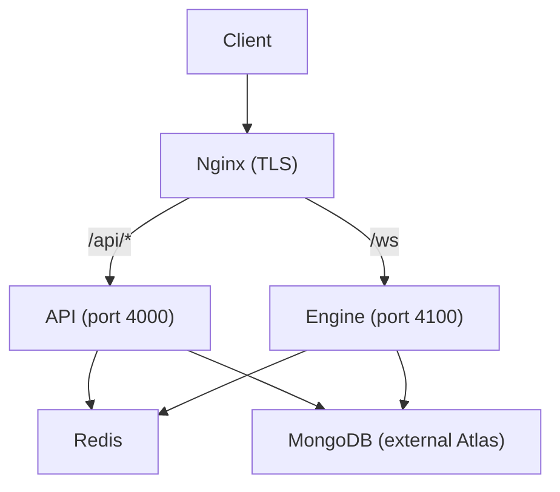
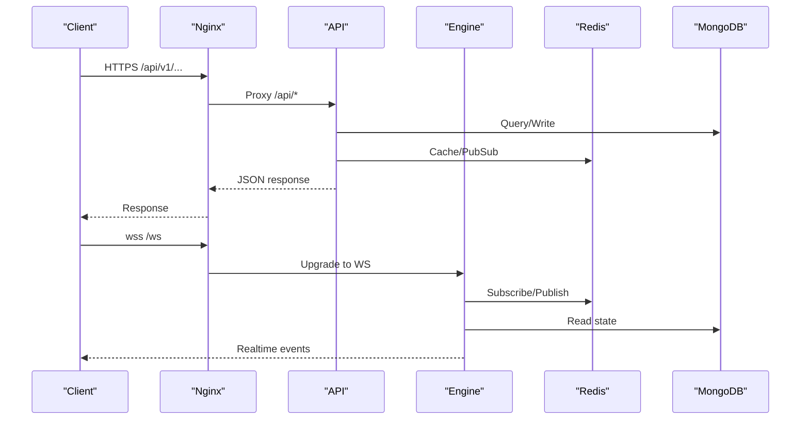
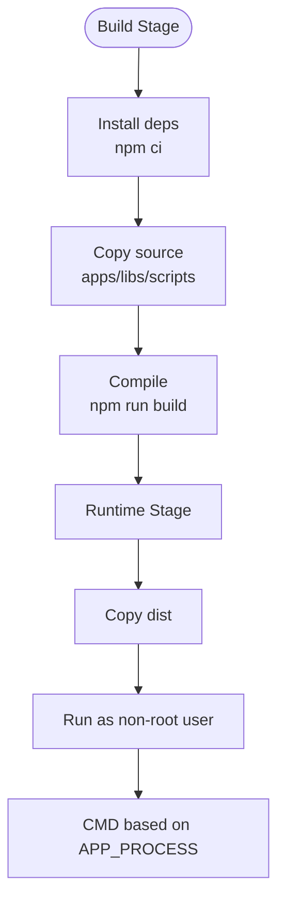
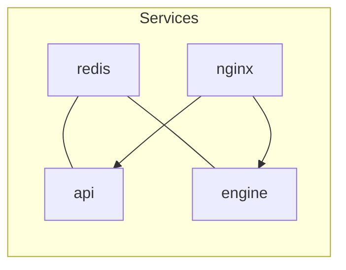
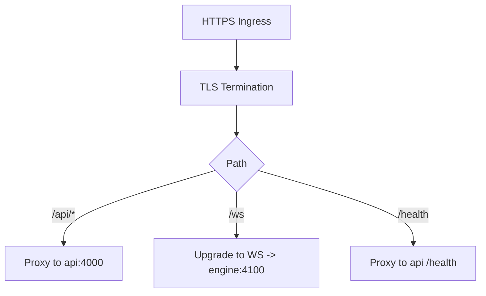
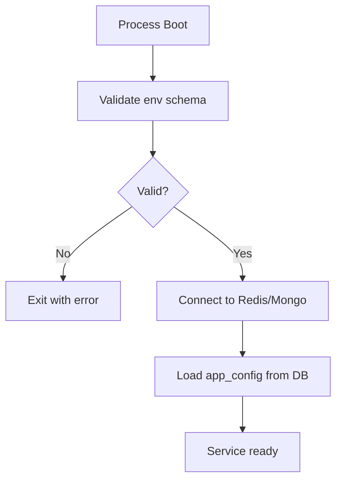
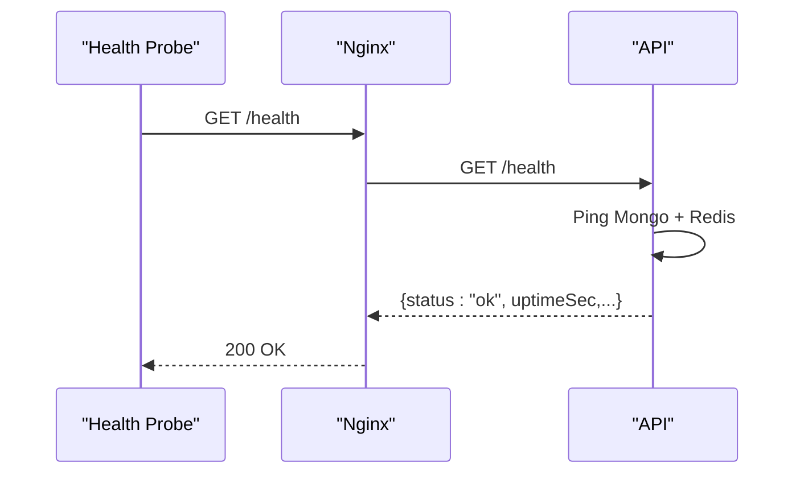
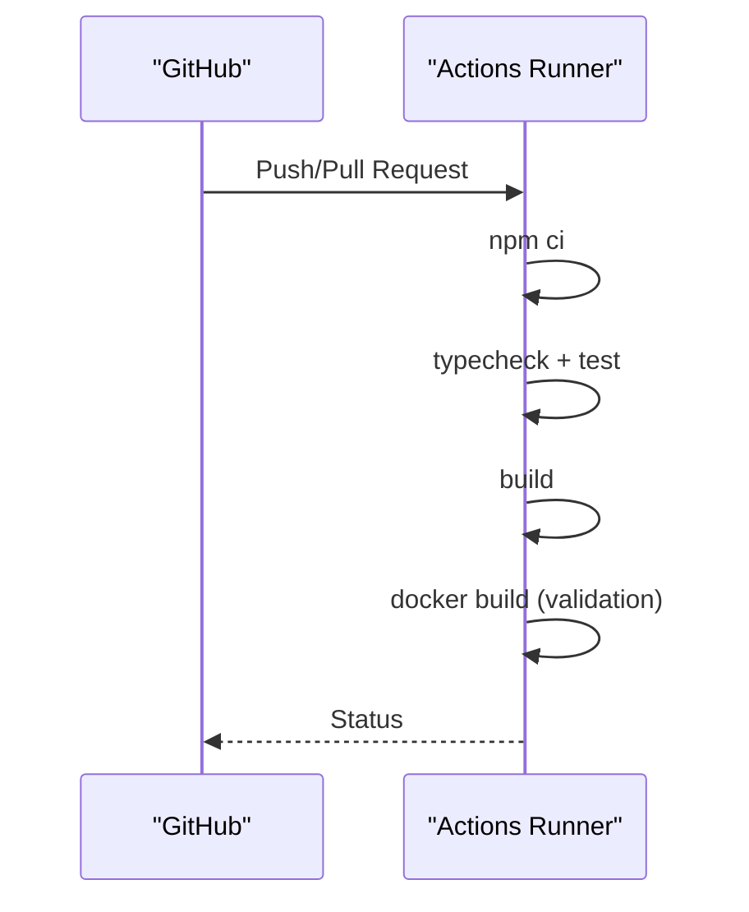
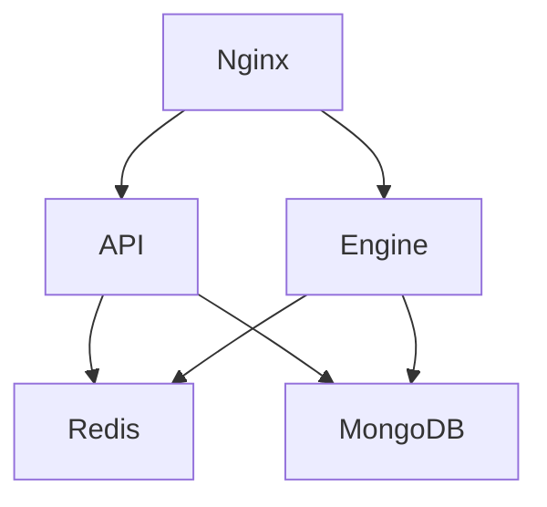

# Deployment Guide

<cite>
**Referenced Files in This Document**
- [docker-compose.yml](file://deploy/docker-compose.yml)
- [Dockerfile](file://backend/Dockerfile)
- [nginx.conf](file://deploy/nginx/nginx.conf)
- [site.conf](file://deploy/nginx/site.conf)
- [ci.yml](file://.github/workflows/ci.yml)
- [api main.ts](file://backend/apps/api/src/main.ts)
- [engine main.ts](file://backend/apps/engine/src/main.ts)
- [env.schema.ts](file://backend/libs/shared/src/config/env.schema.ts)
- [health.controller.ts](file://backend/libs/shared/src/health/health.controller.ts)
- [database.module.ts](file://backend/libs/shared/src/database/database.module.ts)
</cite>

## Table of Contents
1. [Introduction](#introduction)
2. [Project Structure](#project-structure)
3. [Core Components](#core-components)
4. [Architecture Overview](#architecture-overview)
5. [Detailed Component Analysis](#detailed-component-analysis)
6. [Dependency Analysis](#dependency-analysis)
7. [Performance Considerations](#performance-considerations)
8. [Troubleshooting Guide](#troubleshooting-guide)
9. [Conclusion](#conclusion)
10. [Appendices](#appendices)

## Introduction
This guide documents production deployment of the trading platform using Docker and docker-compose, with Nginx as a reverse proxy, SSL via Certbot-managed certificates, and GitHub Actions for CI. It covers environment configuration, secrets management, database provisioning, monitoring and logging, scaling strategies, backups, disaster recovery, performance tuning, security hardening, firewall configuration, and compliance considerations for financial applications.

## Project Structure
The deployment is orchestrated by docker-compose, which defines:
- Redis container for caching and pub/sub
- API process (HTTP REST)
- Engine process (WebSocket gateway)
- Nginx reverse proxy with TLS termination and WebSocket support

**Diagram sources**
- [docker-compose.yml:20-122](file://deploy/docker-compose.yml#L20-L122)
- [site.conf:4-56](file://deploy/nginx/site.conf#L4-L56)

**Section sources**
- [docker-compose.yml:1-130](file://deploy/docker-compose.yml#L1-L130)
- [nginx.conf:1-28](file://deploy/nginx/nginx.conf#L1-L28)
- [site.conf:1-58](file://deploy/nginx/site.conf#L1-L58)

## Core Components
- Containerized backend processes built via multi-stage Dockerfile to minimize runtime image size and attack surface.
- docker-compose composes services with health checks, restart policies, and persistent volumes.
- Nginx terminates TLS, enforces security headers, proxies HTTP and WebSocket traffic, and exposes a /health endpoint.
- Environment variables are validated at boot; missing or invalid values fail fast.
- Health endpoint verifies connectivity to MongoDB and Redis.

**Section sources**
- [Dockerfile:1-27](file://backend/Dockerfile#L1-L27)
- [docker-compose.yml:20-108](file://deploy/docker-compose.yml#L20-L108)
- [env.schema.ts:8-72](file://backend/libs/shared/src/config/env.schema.ts#L8-L72)
- [health.controller.ts:19-35](file://backend/libs/shared/src/health/health.controller.ts#L19-L35)

## Architecture Overview
The production topology routes all external traffic through Nginx, which forwards API requests to the NestJS API service and WebSocket connections to the Engine service. Both services depend on Redis and an external MongoDB instance. The API serves REST endpoints under a global prefix and exposes a health check. The Engine enables WebSocket communication for real-time market data and trading updates.

**Diagram sources**
- [site.conf:31-56](file://deploy/nginx/site.conf#L31-L56)
- [docker-compose.yml:20-108](file://deploy/docker-compose.yml#L20-L108)
- [health.controller.ts:19-35](file://backend/libs/shared/src/health/health.controller.ts#L19-L35)

## Detailed Component Analysis

### Docker Build and Runtime
- Multi-stage build separates dependencies installation from the runtime image.
- Production runtime runs as a non-root user and only includes compiled artifacts.
- APP_PROCESS selects whether the container boots the API or Engine entrypoint.

**Diagram sources**
- [Dockerfile:1-27](file://backend/Dockerfile#L1-L27)

**Section sources**
- [Dockerfile:1-27](file://backend/Dockerfile#L1-L27)
- [api main.ts:7-23](file://backend/apps/api/src/main.ts#L7-L23)
- [engine main.ts:7-17](file://backend/apps/engine/src/main.ts#L7-L17)

### Service Orchestration with docker-compose
- Redis is configured with persistence and memory limits; health-checked before dependent services start.
- API and Engine expose internal ports and validate environment variables at startup.
- Nginx mounts TLS certificates from an external volume and proxies to upstreams.

**Diagram sources**
- [docker-compose.yml:4-122](file://deploy/docker-compose.yml#L4-L122)

**Section sources**
- [docker-compose.yml:4-122](file://deploy/docker-compose.yml#L4-L122)

### Nginx Reverse Proxy and SSL
- Redirects HTTP to HTTPS and serves ACME challenge for certificate issuance.
- Enforces modern TLS protocols and sets security headers.
- Proxies /api to API upstream and /ws to Engine upstream with WebSocket upgrade support.
- Exposes /health proxied to the API for liveness/readiness probes.

**Diagram sources**
- [site.conf:7-56](file://deploy/nginx/site.conf#L7-L56)
- [nginx.conf:15-24](file://deploy/nginx/nginx.conf#L15-L24)

**Section sources**
- [nginx.conf:1-28](file://deploy/nginx/nginx.conf#L1-L28)
- [site.conf:1-58](file://deploy/nginx/site.conf#L1-L58)

### Environment Configuration and Secrets
- All required infrastructure settings are validated at boot; missing keys cause immediate failure.
- Sensitive values (JWT keys, encryption secret, OTP pepper, provider credentials) must be provided via environment variables or a secure secrets manager.
- Business configuration is stored in the database and hot-reloaded across instances via Redis pub/sub.

**Diagram sources**
- [env.schema.ts:8-72](file://backend/libs/shared/src/config/env.schema.ts#L8-L72)
- [database.module.ts:5-15](file://backend/libs/shared/src/database/database.module.ts#L5-L15)

**Section sources**
- [env.schema.ts:8-72](file://backend/libs/shared/src/config/env.schema.ts#L8-L72)
- [docker-compose.yml:23-98](file://deploy/docker-compose.yml#L23-L98)

### Monitoring and Logging
- Health endpoint returns ok only when both MongoDB and Redis respond.
- Nginx access logs include request time for performance analysis.
- Application uses structured logging via a logger module; log level is configurable.

**Diagram sources**
- [health.controller.ts:19-35](file://backend/libs/shared/src/health/health.controller.ts#L19-L35)
- [site.conf:53-56](file://deploy/nginx/site.conf#L53-L56)

**Section sources**
- [health.controller.ts:1-55](file://backend/libs/shared/src/health/health.controller.ts#L1-L55)
- [nginx.conf:21-24](file://deploy/nginx/nginx.conf#L21-L24)

### CI/CD Pipeline
- GitHub Actions workflow validates Node version, installs dependencies, runs type checks, unit tests, builds the application, and performs a Docker build to ensure the image compiles successfully.
- An e2e job spins up temporary MongoDB and Redis services and executes end-to-end tests against them.

**Diagram sources**
- [ci.yml:1-56](file://.github/workflows/ci.yml#L1-L56)

**Section sources**
- [ci.yml:1-56](file://.github/workflows/ci.yml#L1-L56)

## Dependency Analysis
- API and Engine depend on Redis for caching/pub/sub and on MongoDB for persistence.
- Nginx depends on API and Engine being healthy before routing traffic.
- docker-compose health checks enforce startup order and readiness.

**Diagram sources**
- [docker-compose.yml:20-122](file://deploy/docker-compose.yml#L20-L122)

**Section sources**
- [docker-compose.yml:20-122](file://deploy/docker-compose.yml#L20-L122)

## Performance Considerations
- Use connection pooling and timeouts for MongoDB; tune pool size and selection timeout according to workload.
- Configure Redis maxmemory and eviction policy to prevent OOM; enable append-only file for durability.
- Keep Nginx keepalive connections to upstreams enabled for reduced handshake overhead.
- Set appropriate proxy timeouts for long-running operations (e.g., WebSocket).
- Enable compression at Nginx if not already configured.
- Monitor CPU/memory usage of containers and scale horizontally by running multiple API/Engine replicas behind Nginx.

[No sources needed since this section provides general guidance]

## Troubleshooting Guide
- Health endpoint returns 503 when either MongoDB or Redis is unreachable; inspect logs and network connectivity.
- If Nginx cannot connect to upstreams, verify service names and ports in site.conf and docker-compose.
- Certificate errors indicate misconfigured paths or missing files in the certbot-certs volume.
- Environment validation failures will prevent the process from starting; review required variables and their formats.

**Section sources**
- [health.controller.ts:19-35](file://backend/libs/shared/src/health/health.controller.ts#L19-L35)
- [site.conf:14-28](file://deploy/nginx/site.conf#L14-L28)
- [env.schema.ts:8-72](file://backend/libs/shared/src/config/env.schema.ts#L8-L72)

## Conclusion
The platform is deployed as a set of containerized services orchestrated by docker-compose, fronted by Nginx with TLS termination and robust security headers. Environment configuration is validated at boot, and health checks ensure dependency availability. CI validates builds and tests automatically. For production, follow the scaling, backup, disaster recovery, security, and compliance recommendations below.

[No sources needed since this section summarizes without analyzing specific files]

## Appendices

### Production Checklist
- Set domain name in site.conf and provision TLS certificates via Certbot into the mounted volume.
- Provide all required environment variables; use a secrets manager to inject sensitive values.
- Ensure external MongoDB is reachable and whitelisted for the deployment host.
- Verify health endpoint responds ok from both API and Engine.
- Confirm WebSocket path upgrades correctly to the Engine.

**Section sources**
- [site.conf:1-28](file://deploy/nginx/site.conf#L1-L28)
- [docker-compose.yml:23-98](file://deploy/docker-compose.yml#L23-L98)
- [health.controller.ts:19-35](file://backend/libs/shared/src/health/health.controller.ts#L19-L35)

### Scaling Strategies
- Horizontal scaling: Run multiple API and Engine replicas behind Nginx; share Redis and MongoDB.
- Stateless design: Store session/state in Redis; persist business data in MongoDB.
- Connection limits: Tune Nginx worker_connections and upstream keepalive per replica count.
- Resource quotas: Assign CPU/memory limits per container to avoid noisy neighbor issues.

[No sources needed since this section provides general guidance]

### Database Backups and Disaster Recovery
- Schedule regular snapshots of the external MongoDB instance (e.g., Atlas automated backups or custom scripts).
- Retain multiple generations of backups and store offsite.
- Test restore procedures periodically to validate RTO/RPO.
- Encrypt backups at rest and restrict access to authorized personnel.

[No sources needed since this section provides general guidance]

### Security Hardening and Compliance
- Enforce TLS 1.2+ and strong ciphers; disable server tokens.
- Apply security headers (HSTS, X-Content-Type-Options, X-Frame-Options, Referrer-Policy).
- Restrict CORS origins to known domains.
- Rotate JWT keypairs and encryption secrets regularly; never commit secrets to code.
- Limit exposed ports to 80/443; configure firewall to allow only necessary inbound traffic.
- Implement audit logging for sensitive operations and retain logs per retention policy.
- Follow PCI-like controls where applicable: least privilege, encryption in transit/at rest, and regular vulnerability scanning.

**Section sources**
- [site.conf:14-28](file://deploy/nginx/site.conf#L14-L28)
- [env.schema.ts:21-32](file://backend/libs/shared/src/config/env.schema.ts#L21-L32)

### Firewall and Network Configuration
- Allow inbound TCP 80 and 443 only from trusted networks or public internet as needed.
- Block direct access to Redis and MongoDB from the internet; expose only via internal network or managed services.
- Use private networking between containers and restrict inter-service communication to required ports.

[No sources needed since this section provides general guidance]

### Monitoring and Alerting
- Centralize logs from Nginx and application containers; forward to a log aggregation system.
- Alert on health endpoint failures and high error rates.
- Track latency percentiles and resource utilization; alert on thresholds.
- Integrate metrics collection for Redis and MongoDB to detect bottlenecks.

[No sources needed since this section provides general guidance]