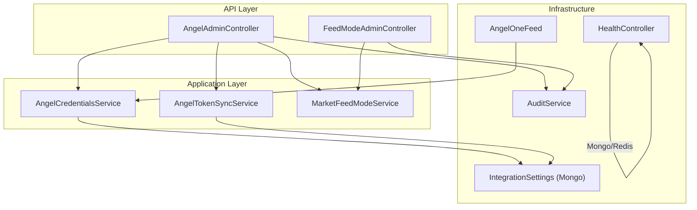
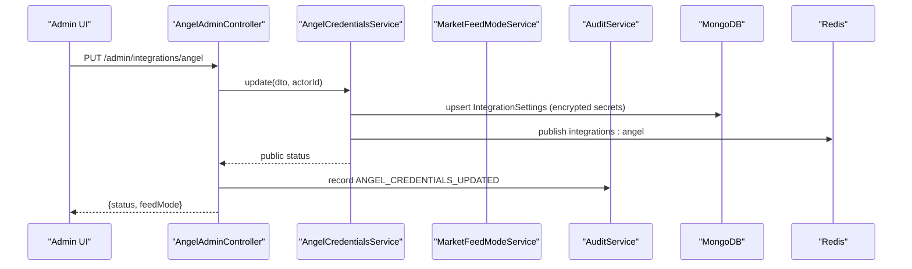
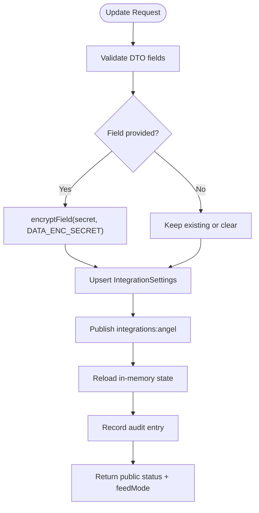
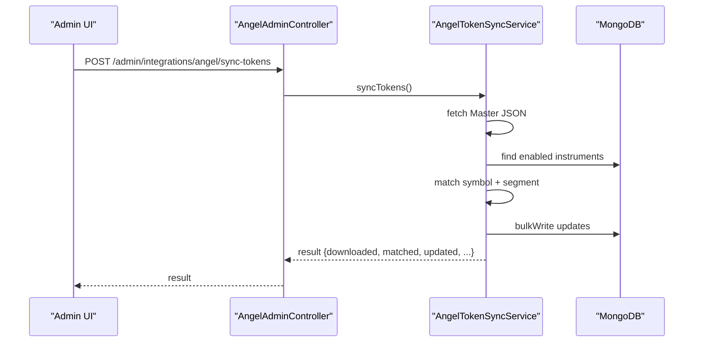
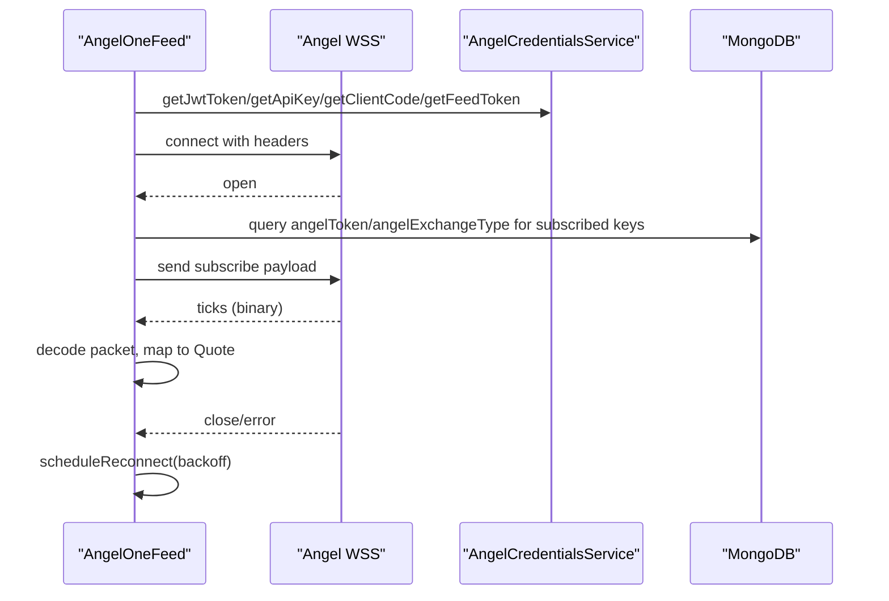
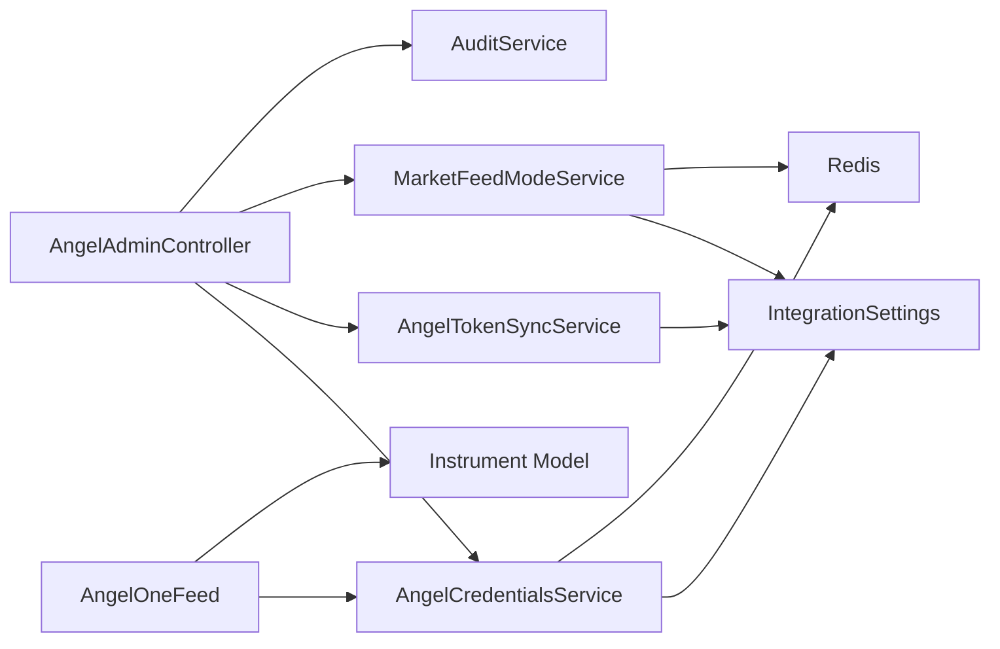

# Admin Configuration & Monitoring

<cite>
**Referenced Files in This Document**
- [angel-admin.controller.ts](file://backend/apps/api/src/modules/market/presentation/angel-admin.controller.ts)
- [angel-credentials.service.ts](file://backend/apps/api/src/modules/market/application/angel-credentials.service.ts)
- [angel-token-sync.service.ts](file://backend/apps/api/src/modules/market/application/angel-token-sync.service.ts)
- [angel-one-feed.ts](file://backend/apps/api/src/modules/market/infrastructure/feed/angel-one-feed.ts)
- [integration-settings.schema.ts](file://backend/apps/api/src/modules/market/infrastructure/schemas/integration-settings.schema.ts)
- [market-feed-mode.service.ts](file://backend/apps/api/src/modules/market/application/market-feed-mode.service.ts)
- [crypto.util.ts](file://backend/apps/api/src/modules/auth/infrastructure/crypto.util.ts)
- [audit.service.ts](file://backend/libs/shared/src/audit/audit.service.ts)
- [audit-log.schema.ts](file://backend/libs/shared/src/audit/audit-log.schema.ts)
- [health.controller.ts](file://backend/libs/shared/src/health/health.controller.ts)
</cite>

## Table of Contents
1. [Introduction](#introduction)
2. [Project Structure](#project-structure)
3. [Core Components](#core-components)
4. [Architecture Overview](#architecture-overview)
5. [Detailed Component Analysis](#detailed-component-analysis)
6. [Dependency Analysis](#dependency-analysis)
7. [Performance Considerations](#performance-considerations)
8. [Troubleshooting Guide](#troubleshooting-guide)
9. [Conclusion](#conclusion)

## Introduction
This document describes the administrative interface and monitoring capabilities for configuring and operating the Angel One broker integration. It covers admin endpoints to set credentials, manage API keys, control feed mode, test connectivity, synchronize instrument tokens, and monitor connection health. It also explains configuration validation, encryption at rest for secrets, audit logging for all configuration changes, and operational troubleshooting guidance.

## Project Structure
The Angel One admin surface is implemented as a NestJS module with:
- A REST controller exposing admin endpoints under /admin/integrations/angel and /admin/integrations/feed-mode
- Application services handling credential storage, login flows, token synchronization, and feed mode management
- An infrastructure feed adapter that connects to Angel One’s WebSocket stream and maps instruments
- Shared services for auditing and system health checks

**Diagram sources**
- [angel-admin.controller.ts:56-180](file://backend/apps/api/src/modules/market/presentation/angel-admin.controller.ts#L56-L180)
- [angel-credentials.service.ts:53-177](file://backend/apps/api/src/modules/market/application/angel-credentials.service.ts#L53-L177)
- [angel-token-sync.service.ts:47-140](file://backend/apps/api/src/modules/market/application/angel-token-sync.service.ts#L47-L140)
- [market-feed-mode.service.ts:20-74](file://backend/apps/api/src/modules/market/application/market-feed-mode.service.ts#L20-L74)
- [angel-one-feed.ts:22-62](file://backend/apps/api/src/modules/market/infrastructure/feed/angel-one-feed.ts#L22-L62)
- [integration-settings.schema.ts:9-37](file://backend/apps/api/src/modules/market/infrastructure/schemas/integration-settings.schema.ts#L9-L37)
- [audit.service.ts:23-39](file://backend/libs/shared/src/audit/audit.service.ts#L23-L39)
- [health.controller.ts:19-35](file://backend/libs/shared/src/health/health.controller.ts#L19-L35)

**Section sources**
- [angel-admin.controller.ts:56-180](file://backend/apps/api/src/modules/market/presentation/angel-admin.controller.ts#L56-L180)
- [angel-credentials.service.ts:53-177](file://backend/apps/api/src/modules/market/application/angel-credentials.service.ts#L53-L177)
- [market-feed-mode.service.ts:20-74](file://backend/apps/api/src/modules/market/application/market-feed-mode.service.ts#L20-L74)
- [angel-one-feed.ts:22-62](file://backend/apps/api/src/modules/market/infrastructure/feed/angel-one-feed.ts#L22-L62)
- [integration-settings.schema.ts:9-37](file://backend/apps/api/src/modules/market/infrastructure/schemas/integration-settings.schema.ts#L9-L37)
- [audit.service.ts:23-39](file://backend/libs/shared/src/audit/audit.service.ts#L23-L39)
- [health.controller.ts:19-35](file://backend/libs/shared/src/health/health.controller.ts#L19-L35)

## Core Components
- AngelAdminController: Exposes admin endpoints to read status, update credentials, log in via password+TOTP, test connection, sync instrument tokens, and set feed mode. All endpoints are protected by employee authentication and permissions.
- AngelCredentialsService: Manages encrypted storage of API key, client code, JWT, and feed token; supports environment fallback; reloads on Redis invalidation; exposes public status with masked secrets; validates configuration completeness.
- AngelTokenSyncService: Downloads Angel One’s instrument master, matches against existing instruments, and updates mapping fields in bulk.
- MarketFeedModeService: Persists and hot-reloads the active market feed mode across processes using Redis pub/sub.
- AngelOneFeed: WebSocket-based live data adapter that subscribes/unsubscribes to quotes, handles heartbeats, reconnects with backoff, and reacts to credential changes.
- AuditService: Immutable audit trail for configuration changes, including actor identity, action, entity, before/after snapshots, and IP address.
- HealthController: Liveness/readiness endpoint checking MongoDB and Redis availability.

**Section sources**
- [angel-admin.controller.ts:56-180](file://backend/apps/api/src/modules/market/presentation/angel-admin.controller.ts#L56-L180)
- [angel-credentials.service.ts:53-177](file://backend/apps/api/src/modules/market/application/angel-credentials.service.ts#L53-L177)
- [angel-token-sync.service.ts:47-140](file://backend/apps/api/src/modules/market/application/angel-token-sync.service.ts#L47-L140)
- [market-feed-mode.service.ts:20-74](file://backend/apps/api/src/modules/market/application/market-feed-mode.service.ts#L20-L74)
- [angel-one-feed.ts:22-62](file://backend/apps/api/src/modules/market/infrastructure/feed/angel-one-feed.ts#L22-L62)
- [audit.service.ts:23-39](file://backend/libs/shared/src/audit/audit.service.ts#L23-L39)
- [health.controller.ts:19-35](file://backend/libs/shared/src/health/health.controller.ts#L19-L35)

## Architecture Overview
The admin flow combines secure HTTP endpoints with background services that persist secrets, broadcast runtime changes, and maintain live connections.

**Diagram sources**
- [angel-admin.controller.ts:75-103](file://backend/apps/api/src/modules/market/presentation/angel-admin.controller.ts#L75-L103)
- [angel-credentials.service.ts:139-177](file://backend/apps/api/src/modules/market/application/angel-credentials.service.ts#L139-L177)
- [audit.service.ts:29-35](file://backend/libs/shared/src/audit/audit.service.ts#L29-L35)
- [integration-settings.schema.ts:9-37](file://backend/apps/api/src/modules/market/infrastructure/schemas/integration-settings.schema.ts#L9-L37)

## Detailed Component Analysis

### Admin Endpoints for Angel One
- GET /admin/integrations/angel: Returns public status (masked secrets), source of truth (database/environment/mixed/none), timestamps, and current feed mode.
- PUT /admin/integrations/angel: Updates API key, client code, JWT token, feed token, or clears specific fields. Validates inputs, encrypts secrets, persists to database, publishes Redis invalidation, reloads in-memory state, and records an audit entry.
- PUT /admin/integrations/angel/feed-mode: Sets the active feed mode (simulator/upstox/angel/dhan). Validates allowed values, persists, broadcasts change, and audits.
- POST /admin/integrations/angel/login: Authenticates with Angel One using password and TOTP, stores returned JWT and feed tokens, and audits the action.
- POST /admin/integrations/angel/test: Tests connectivity by calling Angel One profile endpoint with current credentials.
- POST /admin/integrations/angel/sync-tokens: Triggers download and mapping of Angel One instrument tokens into the local instrument catalog.

All endpoints require employee authentication and the instruments.manage permission. Errors are mapped to application exceptions with appropriate HTTP status codes.

**Section sources**
- [angel-admin.controller.ts:56-180](file://backend/apps/api/src/modules/market/presentation/angel-admin.controller.ts#L56-L180)

### Credential Storage and Encryption at Rest
- Secrets (API key, JWT, feed token) are stored encrypted in the IntegrationSettings collection using AES-256-GCM with a secret derived from DATA_ENC_SECRET.
- Client code is stored unencrypted alongside secrets.
- On startup and on Redis invalidation, the service decrypts stored secrets and merges with environment variables if present, determining the effective source (database/environment/mixed/none).
- Public status masks secrets while indicating presence and last update metadata.

**Diagram sources**
- [angel-credentials.service.ts:139-177](file://backend/apps/api/src/modules/market/application/angel-credentials.service.ts#L139-L177)
- [crypto.util.ts:9-24](file://backend/apps/api/src/modules/auth/infrastructure/crypto.util.ts#L9-L24)
- [integration-settings.schema.ts:9-37](file://backend/apps/api/src/modules/market/infrastructure/schemas/integration-settings.schema.ts#L9-L37)

**Section sources**
- [angel-credentials.service.ts:53-177](file://backend/apps/api/src/modules/market/application/angel-credentials.service.ts#L53-L177)
- [crypto.util.ts:9-24](file://backend/apps/api/src/modules/auth/infrastructure/crypto.util.ts#L9-L24)
- [integration-settings.schema.ts:9-37](file://backend/apps/api/src/modules/market/infrastructure/schemas/integration-settings.schema.ts#L9-L37)

### Feed Mode Management
- The active feed mode is persisted per provider and can be changed via admin endpoints.
- Changes are broadcast over Redis so both API and engine instances reload without restart.
- Validation ensures only allowed modes are accepted.

**Section sources**
- [market-feed-mode.service.ts:20-74](file://backend/apps/api/src/modules/market/application/market-feed-mode.service.ts#L20-L74)
- [angel-admin.controller.ts:105-127](file://backend/apps/api/src/modules/market/presentation/angel-admin.controller.ts#L105-L127)

### Instrument Token Synchronization
- Downloads Angel One’s OpenAPIScripMaster.json and matches symbols to existing enabled instruments.
- Maps exchange segments to internal exchange types and updates angelToken and angelExchangeType fields in bulk.
- Skips unsupported segments and reports unmatched counts.

**Diagram sources**
- [angel-admin.controller.ts:159-180](file://backend/apps/api/src/modules/market/presentation/angel-admin.controller.ts#L159-L180)
- [angel-token-sync.service.ts:55-140](file://backend/apps/api/src/modules/market/application/angel-token-sync.service.ts#L55-L140)

**Section sources**
- [angel-token-sync.service.ts:47-140](file://backend/apps/api/src/modules/market/application/angel-token-sync.service.ts#L47-L140)

### Live Feed Connection and Monitoring
- AngelOneFeed connects to Angel One’s Smart Stream WebSocket with headers carrying JWT, API key, client code, and feed token.
- Subscriptions are built from instrument mappings and re-established after reconnects.
- Heartbeat messages are handled; last tick timestamp enables liveness checks.
- Reconnection uses exponential backoff capped at a maximum delay.

**Diagram sources**
- [angel-one-feed.ts:45-107](file://backend/apps/api/src/modules/market/infrastructure/feed/angel-one-feed.ts#L45-L107)
- [angel-one-feed.ts:136-198](file://backend/apps/api/src/modules/market/infrastructure/feed/angel-one-feed.ts#L136-L198)
- [angel-one-decode.ts:23-61](file://backend/apps/api/src/modules/market/infrastructure/feed/angel-one-decode.ts#L23-L61)

**Section sources**
- [angel-one-feed.ts:22-242](file://backend/apps/api/src/modules/market/infrastructure/feed/angel-one-feed.ts#L22-L242)
- [angel-one-decode.ts:23-61](file://backend/apps/api/src/modules/market/infrastructure/feed/angel-one-decode.ts#L23-L61)

### Audit Logging for Configuration Changes
- Every configuration change (credential updates, feed mode changes, login, token sync) is recorded with actor type, actor ID, action, entity, entity ID, before/after snapshots, and request IP.
- Audit writes are non-fatal; failures are logged but do not abort business operations.

**Section sources**
- [audit.service.ts:23-39](file://backend/libs/shared/src/audit/audit.service.ts#L23-L39)
- [audit-log.schema.ts:6-41](file://backend/libs/shared/src/audit/audit-log.schema.ts#L6-L41)
- [angel-admin.controller.ts:75-180](file://backend/apps/api/src/modules/market/presentation/angel-admin.controller.ts#L75-L180)

### System Health Checks
- The health endpoint verifies MongoDB and Redis availability and returns a unified status used for liveness/readiness probes.

**Section sources**
- [health.controller.ts:19-35](file://backend/libs/shared/src/health/health.controller.ts#L19-L35)

## Dependency Analysis
Key dependencies and relationships:
- AngelAdminController depends on AngelCredentialsService, AngelTokenSyncService, MarketFeedModeService, and AuditService.
- AngelCredentialsService depends on IntegrationSettings schema, ConfigService, and Redis for pub/sub invalidation.
- AngelOneFeed depends on AngelCredentialsService and Instrument model to build subscription routes.
- MarketFeedModeService persists feed mode and broadcasts changes via Redis.
- AuditService writes immutable logs to MongoDB.

**Diagram sources**
- [angel-admin.controller.ts:56-180](file://backend/apps/api/src/modules/market/presentation/angel-admin.controller.ts#L56-L180)
- [angel-credentials.service.ts:53-177](file://backend/apps/api/src/modules/market/application/angel-credentials.service.ts#L53-L177)
- [angel-token-sync.service.ts:47-140](file://backend/apps/api/src/modules/market/application/angel-token-sync.service.ts#L47-L140)
- [market-feed-mode.service.ts:20-74](file://backend/apps/api/src/modules/market/application/market-feed-mode.service.ts#L20-L74)
- [angel-one-feed.ts:22-62](file://backend/apps/api/src/modules/market/infrastructure/feed/angel-one-feed.ts#L22-L62)

**Section sources**
- [angel-admin.controller.ts:56-180](file://backend/apps/api/src/modules/market/presentation/angel-admin.controller.ts#L56-L180)
- [angel-credentials.service.ts:53-177](file://backend/apps/api/src/modules/market/application/angel-credentials.service.ts#L53-L177)
- [angel-token-sync.service.ts:47-140](file://backend/apps/api/src/modules/market/application/angel-token-sync.service.ts#L47-L140)
- [market-feed-mode.service.ts:20-74](file://backend/apps/api/src/modules/market/application/market-feed-mode.service.ts#L20-L74)
- [angel-one-feed.ts:22-62](file://backend/apps/api/src/modules/market/infrastructure/feed/angel-one-feed.ts#L22-L62)

## Performance Considerations
- Bulk writes: Instrument token sync batches updates to reduce database round-trips and improve throughput.
- Backoff reconnection: WebSocket reconnection uses exponential backoff capped at a maximum delay to avoid thundering herds.
- Hot reload: Redis pub/sub allows runtime updates to credentials and feed mode without process restarts, minimizing downtime.
- Heartbeat: Periodic pings keep the WebSocket alive and help detect stale connections quickly.
- Subscription grouping: Subscribe payloads group tokens by exchange type to minimize message size and processing overhead.

[No sources needed since this section provides general guidance]

## Troubleshooting Guide
Common issues and resolutions:
- Missing or incomplete credentials:
  - Symptom: testConnection fails with “API key, client code, JWT, and feed token are all required.”
  - Resolution: Configure all four fields via PUT /admin/integrations/angel or perform loginByPassword to obtain JWT and feed token.
- Invalid feed mode:
  - Symptom: Error when setting feed mode.
  - Resolution: Use one of the allowed modes (simulator/upstox/angel/dhan).
- Login failure:
  - Symptom: ANGEL_LOGIN_FAILED error.
  - Resolution: Verify password and TOTP; ensure API key and client code are configured; check network access to Angel One endpoints.
- Token sync failures:
  - Symptom: Download or mapping errors.
  - Resolution: Ensure outbound access to Angel One master URL; verify enabled instruments exist; review unmatched and skipped segment counts.
- WebSocket connectivity issues:
  - Symptom: Frequent disconnects or no ticks.
  - Resolution: Confirm JWT, API key, client code, and feed token are valid; check firewall/proxy settings; observe backoff logs; verify subscriptions include mapped angelToken and angelExchangeType.
- Health checks failing:
  - Symptom: /health returns 503.
  - Resolution: Check MongoDB and Redis connectivity; resolve dependency outages.

Operational tips:
- Use GET /admin/integrations/angel to inspect masked secrets and source of truth.
- Use POST /admin/integrations/angel/test to validate credentials against Angel One.
- Monitor audit logs for recent configuration changes and identify actors responsible.
- For live feed diagnostics, track secondsSinceLastTick and heartbeat behavior in logs.

**Section sources**
- [angel-admin.controller.ts:66-180](file://backend/apps/api/src/modules/market/presentation/angel-admin.controller.ts#L66-L180)
- [angel-credentials.service.ts:179-247](file://backend/apps/api/src/modules/market/application/angel-credentials.service.ts#L179-L247)
- [angel-token-sync.service.ts:55-140](file://backend/apps/api/src/modules/market/application/angel-token-sync.service.ts#L55-L140)
- [angel-one-feed.ts:71-134](file://backend/apps/api/src/modules/market/infrastructure/feed/angel-one-feed.ts#L71-L134)
- [health.controller.ts:26-35](file://backend/libs/shared/src/health/health.controller.ts#L26-L35)

## Conclusion
The Angel One admin interface provides a secure, audited, and observable way to configure credentials, manage tokens, switch feed modes, and validate connectivity. Secrets are encrypted at rest, changes propagate in real time via Redis, and the live feed adapts automatically to configuration updates. With robust error handling, audit trails, and health checks, operators can confidently deploy and monitor the integration in production environments.

[No sources needed since this section summarizes without analyzing specific files]