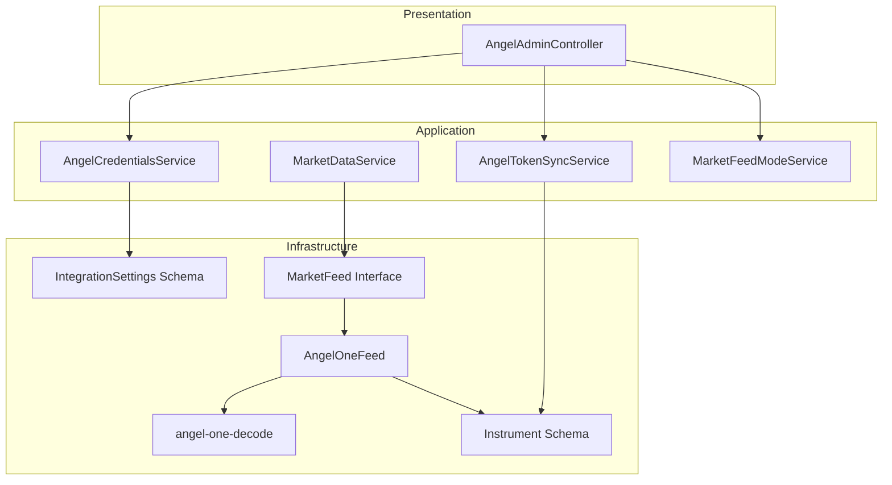
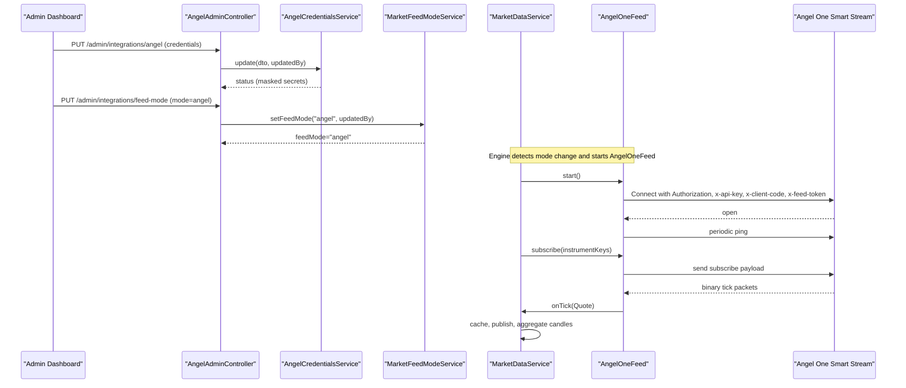
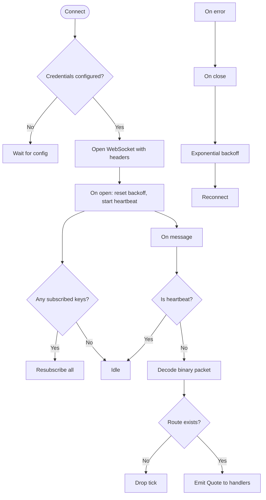
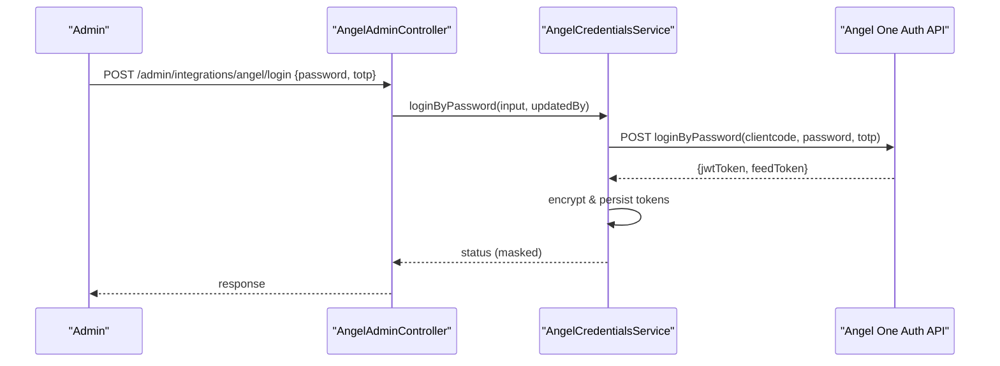
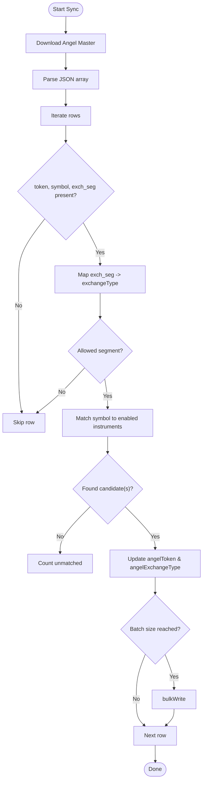
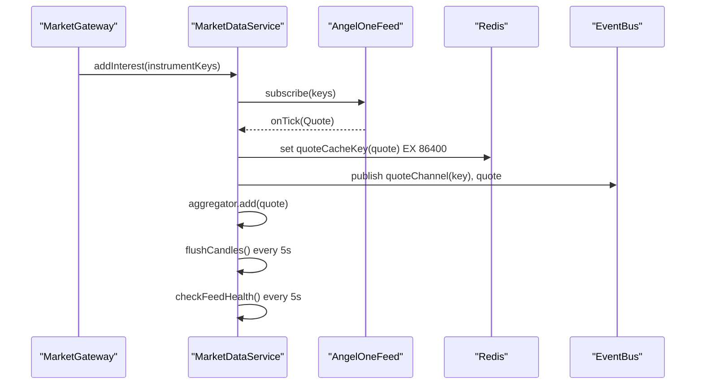
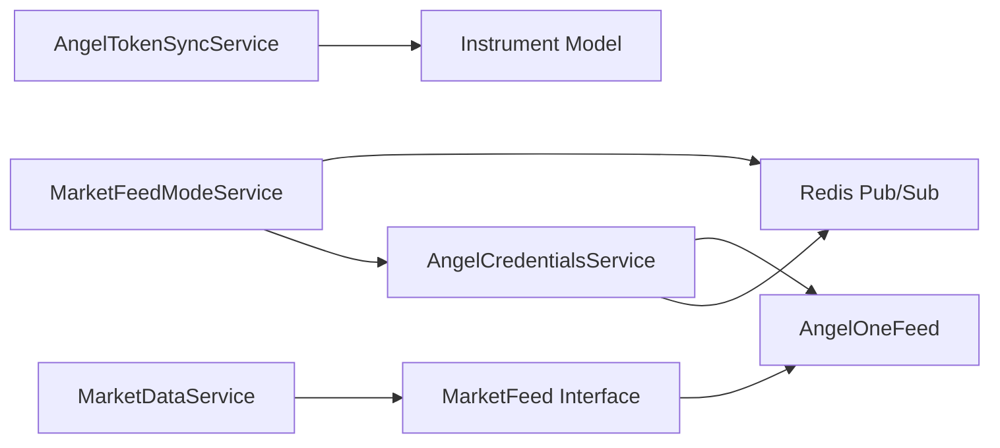

# Angel One Broker Integration

<cite>
**Referenced Files in This Document**
- [angel-one-feed.ts](file://backend/apps/api/src/modules/market/infrastructure/feed/angel-one-feed.ts)
- [angel-one-decode.ts](file://backend/apps/api/src/modules/market/infrastructure/feed/angel-one-decode.ts)
- [market-feed.port.ts](file://backend/apps/api/src/modules/market/infrastructure/feed/market-feed.port.ts)
- [instrument.schema.ts](file://backend/apps/api/src/modules/market/infrastructure/schemas/instrument.schema.ts)
- [integration-settings.schema.ts](file://backend/apps/api/src/modules/market/infrastructure/schemas/integration-settings.schema.ts)
- [angel-credentials.service.ts](file://backend/apps/api/src/modules/market/application/angel-credentials.service.ts)
- [angel-token-sync.service.ts](file://backend/apps/api/src/modules/market/application/angel-token-sync.service.ts)
- [market-data.service.ts](file://backend/apps/api/src/modules/market/application/market-data.service.ts)
- [market-feed-mode.service.ts](file://backend/apps/api/src/modules/market/application/market-feed-mode.service.ts)
- [angel-admin.controller.ts](file://backend/apps/api/src/modules/market/presentation/angel-admin.controller.ts)
- [MarketDataFeed.proto](file://backend/apps/api/src/modules/market/infrastructure/feed/MarketDataFeed.proto)
</cite>

## Table of Contents
1. [Introduction](#introduction)
2. [Project Structure](#project-structure)
3. [Core Components](#core-components)
4. [Architecture Overview](#architecture-overview)
5. [Detailed Component Analysis](#detailed-component-analysis)
6. [Dependency Analysis](#dependency-analysis)
7. [Performance Considerations](#performance-considerations)
8. [Troubleshooting Guide](#troubleshooting-guide)
9. [Conclusion](#conclusion)
10. [Appendices](#appendices)

## Introduction
This document explains the Angel One broker integration implemented in the market data subsystem. It focuses on the AngelOneFeed class that connects to Angel One’s Smart Stream WebSocket, handles authentication and session management, subscribes to instruments, processes real-time quotes, and recovers from errors. It also covers configuration via the admin dashboard, credential encryption, token refresh flows, instrument mapping, rate-limiting considerations, performance optimizations, testing approaches, and debugging techniques for WebSocket communication.

## Project Structure
The Angel One integration spans application services, infrastructure adapters, schemas, and admin controllers:
- Application layer: credentials management, token sync, feed mode selection, and market data pipeline.
- Infrastructure layer: WebSocket adapter (AngelOneFeed), binary packet decoding, instrument schema, and shared feed interface.
- Presentation layer: admin endpoints to configure credentials, login, test connectivity, and synchronize instrument tokens.
- Shared types and protocols: protobuf definitions used by other feeds and a canonical Quote type consumed by the pipeline.

**Diagram sources**
- [angel-one-feed.ts:22-39](file://backend/apps/api/src/modules/market/infrastructure/feed/angel-one-feed.ts#L22-L39)
- [angel-one-decode.ts:1-62](file://backend/apps/api/src/modules/market/infrastructure/feed/angel-one-decode.ts#L1-L62)
- [instrument.schema.ts:9-76](file://backend/apps/api/src/modules/market/infrastructure/schemas/instrument.schema.ts#L9-L76)
- [integration-settings.schema.ts:9-40](file://backend/apps/api/src/modules/market/infrastructure/schemas/integration-settings.schema.ts#L9-L40)
- [market-feed.port.ts:1-23](file://backend/apps/api/src/modules/market/infrastructure/feed/market-feed.port.ts#L1-L23)
- [angel-credentials.service.ts:53-105](file://backend/apps/api/src/modules/market/application/angel-credentials.service.ts#L53-L105)
- [angel-token-sync.service.ts:47-53](file://backend/apps/api/src/modules/market/application/angel-token-sync.service.ts#L47-L53)
- [market-data.service.ts:24-41](file://backend/apps/api/src/modules/market/application/market-data.service.ts#L24-L41)
- [market-feed-mode.service.ts:20-35](file://backend/apps/api/src/modules/market/application/market-feed-mode.service.ts#L20-L35)
- [angel-admin.controller.ts:56-64](file://backend/apps/api/src/modules/market/presentation/angel-admin.controller.ts#L56-L64)

**Section sources**
- [angel-one-feed.ts:22-39](file://backend/apps/api/src/modules/market/infrastructure/feed/angel-one-feed.ts#L22-L39)
- [angel-credentials.service.ts:53-105](file://backend/apps/api/src/modules/market/application/angel-credentials.service.ts#L53-L105)
- [angel-admin.controller.ts:56-64](file://backend/apps/api/src/modules/market/presentation/angel-admin.controller.ts#L56-L64)

## Core Components
- AngelOneFeed: WebSocket client for Angel One Smart Stream; manages connection lifecycle, heartbeat, reconnection with exponential backoff, subscription/unsubscription, and quote routing.
- AngelCredentialsService: Securely stores and serves API key, client code, JWT, and feed token; supports login by password with TOTP; hot-reloads via Redis; exposes public status with masked secrets.
- AngelTokenSyncService: Downloads Angel One’s instrument master, maps exchange segments to Smart Stream exchangeType, and updates instrument records with angelToken and angelExchangeType.
- MarketDataService: Owns the single MarketFeed instance, implements on-demand subscribe based on consumer interest, writes quotes to Redis, publishes events, aggregates candles, and monitors feed health.
- MarketFeedModeService: Centralized feed mode selection (simulator/upstox/angel/dhan) persisted in DB and broadcast via Redis for live reload across services.
- AngelAdminController: Admin endpoints to update credentials, login, test connection, set feed mode, and trigger token sync.

**Section sources**
- [angel-one-feed.ts:22-39](file://backend/apps/api/src/modules/market/infrastructure/feed/angel-one-feed.ts#L22-L39)
- [angel-credentials.service.ts:53-105](file://backend/apps/api/src/modules/market/application/angel-credentials.service.ts#L53-L105)
- [angel-token-sync.service.ts:47-53](file://backend/apps/api/src/modules/market/application/angel-token-sync.service.ts#L47-L53)
- [market-data.service.ts:24-41](file://backend/apps/api/src/modules/market/application/market-data.service.ts#L24-L41)
- [market-feed-mode.service.ts:20-35](file://backend/apps/api/src/modules/market/application/market-feed-mode.service.ts#L20-L35)
- [angel-admin.controller.ts:56-64](file://backend/apps/api/src/modules/market/presentation/angel-admin.controller.ts#L56-L64)

## Architecture Overview
The system uses a pluggable feed abstraction so the engine can run simulator or live feeds. When the feed mode is set to “angel,” MarketDataService starts AngelOneFeed, which authenticates to Angel One via headers and maintains a persistent WebSocket connection. Quotes are decoded into a canonical Quote, cached in Redis, published on an event bus, and aggregated into 1-minute candles.

**Diagram sources**
- [angel-admin.controller.ts:75-127](file://backend/apps/api/src/modules/market/presentation/angel-admin.controller.ts#L75-L127)
- [angel-credentials.service.ts:139-177](file://backend/apps/api/src/modules/market/application/angel-credentials.service.ts#L139-L177)
- [market-feed-mode.service.ts:61-74](file://backend/apps/api/src/modules/market/application/market-feed-mode.service.ts#L61-L74)
- [market-data.service.ts:43-52](file://backend/apps/api/src/modules/market/application/market-data.service.ts#L43-L52)
- [angel-one-feed.ts:71-107](file://backend/apps/api/src/modules/market/infrastructure/feed/angel-one-feed.ts#L71-L107)
- [angel-one-feed.ts:136-163](file://backend/apps/api/src/modules/market/infrastructure/feed/angel-one-feed.ts#L136-L163)

## Detailed Component Analysis

### AngelOneFeed: WebSocket Adapter and Quote Processing
Responsibilities:
- Establishes WebSocket connection using JWT, API key, client code, and feed token.
- Sends periodic ping to keep connection alive.
- Subscribes to instruments by exchanging Angel One’s token list grouped by exchangeType.
- Decodes binary packets into ticks and routes them to consumers via handlers.
- Reconnects with exponential backoff on close/error and resubscribes after reconnect.
- Tracks last tick timestamp for stale feed detection.

Key behaviors:
- Connection headers include Authorization (Bearer), x-api-key, x-client-code, x-feed-token.
- Heartbeat interval configured to send ping messages at a fixed cadence.
- Subscription payloads group tokens per exchangeType to minimize requests.
- Unsubscribe removes routes and sends corresponding payload.
- ResubscribeAll rebuilds routes and re-sends subscriptions after reconnect.

**Diagram sources**
- [angel-one-feed.ts:71-107](file://backend/apps/api/src/modules/market/infrastructure/feed/angel-one-feed.ts#L71-L107)
- [angel-one-feed.ts:109-126](file://backend/apps/api/src/modules/market/infrastructure/feed/angel-one-feed.ts#L109-L126)
- [angel-one-feed.ts:128-134](file://backend/apps/api/src/modules/market/infrastructure/feed/angel-one-feed.ts#L128-L134)
- [angel-one-feed.ts:136-198](file://backend/apps/api/src/modules/market/infrastructure/feed/angel-one-feed.ts#L136-L198)
- [angel-one-feed.ts:200-232](file://backend/apps/api/src/modules/market/infrastructure/feed/angel-one-feed.ts#L200-L232)

**Section sources**
- [angel-one-feed.ts:22-39](file://backend/apps/api/src/modules/market/infrastructure/feed/angel-one-feed.ts#L22-L39)
- [angel-one-feed.ts:71-107](file://backend/apps/api/src/modules/market/infrastructure/feed/angel-one-feed.ts#L71-L107)
- [angel-one-feed.ts:109-126](file://backend/apps/api/src/modules/market/infrastructure/feed/angel-one-feed.ts#L109-L126)
- [angel-one-feed.ts:136-198](file://backend/apps/api/src/modules/market/infrastructure/feed/angel-one-feed.ts#L136-L198)
- [angel-one-feed.ts:200-232](file://backend/apps/api/src/modules/market/infrastructure/feed/angel-one-feed.ts#L200-L232)

### AngelCredentialsService: Authentication, Token Management, and Session Handling
Capabilities:
- Loads credentials from encrypted database fields with environment fallback.
- Supports login by password plus TOTP to obtain JWT and feed token.
- Stores tokens securely and broadcasts changes via Redis for live reload.
- Provides a public status endpoint with masked secrets and source attribution.
- Validates connectivity by calling a profile endpoint with current JWT.

Authentication flow:
- Requires API key and client code before login.
- Calls login endpoint with password and TOTP; on success, persists JWT and feed token.
- Updates feed mode and triggers listeners to reconnect dependent components.

Session management:
- Credentials service emits change events when tokens are updated.
- AngelOneFeed listens to changes and reconnects automatically.

**Diagram sources**
- [angel-admin.controller.ts:129-151](file://backend/apps/api/src/modules/market/presentation/angel-admin.controller.ts#L129-L151)
- [angel-credentials.service.ts:179-219](file://backend/apps/api/src/modules/market/application/angel-credentials.service.ts#L179-L219)

**Section sources**
- [angel-credentials.service.ts:53-105](file://backend/apps/api/src/modules/market/application/angel-credentials.service.ts#L53-L105)
- [angel-credentials.service.ts:139-177](file://backend/apps/api/src/modules/market/application/angel-credentials.service.ts#L139-L177)
- [angel-credentials.service.ts:179-219](file://backend/apps/api/src/modules/market/application/angel-credentials.service.ts#L179-L219)
- [angel-credentials.service.ts:221-247](file://backend/apps/api/src/modules/market/application/angel-credentials.service.ts#L221-L247)
- [angel-credentials.service.ts:257-304](file://backend/apps/api/src/modules/market/application/angel-credentials.service.ts#L257-L304)

### AngelTokenSyncService: Instrument Mapping
Purpose:
- Downloads Angel One’s instrument master JSON.
- Maps exchange segments (NSE, NFO, BSE, BFO, MCX) to Smart Stream exchangeType values.
- Matches symbols to existing enabled instruments and updates angelToken and angelExchangeType.

Mapping logic:
- NSE index vs equity mapped appropriately.
- NFO mapped to derivatives segment.
- Only allowed segments processed; others skipped.

**Diagram sources**
- [angel-token-sync.service.ts:55-140](file://backend/apps/api/src/modules/market/application/angel-token-sync.service.ts#L55-L140)
- [angel-token-sync.service.ts:27-39](file://backend/apps/api/src/modules/market/application/angel-token-sync.service.ts#L27-L39)

**Section sources**
- [angel-token-sync.service.ts:27-39](file://backend/apps/api/src/modules/market/application/angel-token-sync.service.ts#L27-L39)
- [angel-token-sync.service.ts:55-140](file://backend/apps/api/src/modules/market/application/angel-token-sync.service.ts#L55-L140)
- [instrument.schema.ts:52-58](file://backend/apps/api/src/modules/market/infrastructure/schemas/instrument.schema.ts#L52-L58)

### MarketDataService: Ingestion Pipeline and Stale Feed Watchdog
Responsibilities:
- Starts the selected MarketFeed and registers a tick handler.
- Implements on-demand subscription: only instruments with active interest are subscribed upstream.
- Writes quotes to Redis with TTL, publishes to event bus, aggregates 1m candles, and flushes periodically.
- Monitors feed health; if no ticks during market hours beyond threshold, logs warning and resubscribes tracked keys.

**Diagram sources**
- [market-data.service.ts:43-52](file://backend/apps/api/src/modules/market/application/market-data.service.ts#L43-L52)
- [market-data.service.ts:65-96](file://backend/apps/api/src/modules/market/application/market-data.service.ts#L65-L96)
- [market-data.service.ts:103-137](file://backend/apps/api/src/modules/market/application/market-data.service.ts#L103-L137)

**Section sources**
- [market-data.service.ts:24-41](file://backend/apps/api/src/modules/market/application/market-data.service.ts#L24-L41)
- [market-data.service.ts:65-96](file://backend/apps/api/src/modules/market/application/market-data.service.ts#L65-L96)
- [market-data.service.ts:103-137](file://backend/apps/api/src/modules/market/application/market-data.service.ts#L103-L137)

### Admin Configuration and Feed Mode Control
Endpoints:
- GET /admin/integrations/angel: returns masked status and current feed mode.
- PUT /admin/integrations/audit: updates credentials with optional clear flags; persists encrypted fields; broadcasts reload.
- PUT /admin/integrations/feed-mode: sets active feed mode (simulator/upstox/angel/dhan).
- POST /admin/integrations/angel/login: performs login with password and TOTP; stores JWT and feed token.
- POST /admin/integrations/angel/test: validates JWT by fetching user profile.
- POST /admin/integrations/angel/sync-tokens: downloads and applies instrument mappings.

Security and audit:
- All endpoints protected by employee auth and permissions guard.
- Audit records capture actor, action, entity, and after state.

**Section sources**
- [angel-admin.controller.ts:56-64](file://backend/apps/api/src/modules/market/presentation/angel-admin.controller.ts#L56-L64)
- [angel-admin.controller.ts:66-103](file://backend/apps/api/src/modules/market/presentation/angel-admin.controller.ts#L66-L103)
- [angel-admin.controller.ts:105-127](file://backend/apps/api/src/modules/market/presentation/angel-admin.controller.ts#L105-L127)
- [angel-admin.controller.ts:129-180](file://backend/apps/api/src/modules/market/presentation/angel-admin.controller.ts#L129-L180)

## Dependency Analysis
Coupling and cohesion:
- AngelOneFeed depends on AngelCredentialsService for runtime tokens and Instrument model for token mapping.
- AngelCredentialsService depends on IntegrationSettings schema and Redis pub/sub for live reload.
- AngelTokenSyncService depends on Instrument model and external fetch for master data.
- MarketDataService depends on MarketFeed abstraction, Redis, EventBus, and ExchangeCalendarService.
- MarketFeedModeService centralizes feed mode persistence and broadcasting.

External dependencies:
- Angel One Smart Stream WebSocket endpoint.
- Angel One REST endpoints for login and profile validation.
- Angel One instrument master JSON hosted externally.

Potential circular dependencies:
- None observed; services communicate through interfaces and events.

**Diagram sources**
- [angel-credentials.service.ts:53-105](file://backend/apps/api/src/modules/market/application/angel-credentials.service.ts#L53-L105)
- [angel-one-feed.ts:22-39](file://backend/apps/api/src/modules/market/infrastructure/feed/angel-one-feed.ts#L22-L39)
- [angel-token-sync.service.ts:47-53](file://backend/apps/api/src/modules/market/application/angel-token-sync.service.ts#L47-L53)
- [market-data.service.ts:24-41](file://backend/apps/api/src/modules/market/application/market-data.service.ts#L24-L41)
- [market-feed-mode.service.ts:20-35](file://backend/apps/api/src/modules/market/application/market-feed-mode.service.ts#L20-L35)

**Section sources**
- [angel-credentials.service.ts:53-105](file://backend/apps/api/src/modules/market/application/angel-credentials.service.ts#L53-L105)
- [angel-one-feed.ts:22-39](file://backend/apps/api/src/modules/market/infrastructure/feed/angel-one-feed.ts#L22-L39)
- [angel-token-sync.service.ts:47-53](file://backend/apps/api/src/modules/market/application/angel-token-sync.service.ts#L47-L53)
- [market-data.service.ts:24-41](file://backend/apps/api/src/modules/market/application/market-data.service.ts#L24-L41)
- [market-feed-mode.service.ts:20-35](file://backend/apps/api/src/modules/market/application/market-feed-mode.service.ts#L20-L35)

## Performance Considerations
- On-demand subscription: MarketDataService tracks consumer interest and subscribes only when needed, avoiding wholesale subscription of large instrument catalogs.
- Batched writes: Candle aggregation buffers and bulk writes reduce database overhead.
- Heartbeat and backoff: Periodic pings maintain liveness; exponential backoff prevents thundering herds on reconnect.
- Redis caching: Quotes cached with TTL for fast reads and reduced load.
- Event bus fan-out: Decouples downstream consumers from ingestion path.
- Instrument mapping efficiency: Bulk updates with batch size limits optimize DB operations.

[No sources needed since this section provides general guidance]

## Troubleshooting Guide
Common issues and diagnostics:
- Missing or invalid credentials: Use GET /admin/integrations/angel to inspect masked status and source; ensure API key, client code, JWT, and feed token are set.
- Login failures: Use POST /admin/integrations/angel/login with correct password and TOTP; verify network access to Angel One auth endpoints.
- Connection problems: Use POST /admin/integrations/angel/test to validate JWT against Angel One profile endpoint.
- Stale feed: MarketDataService logs warnings when no ticks arrive during market hours; it will resubscribe tracked keys automatically.
- Instrument mapping gaps: Run POST /admin/integrations/angel/sync-tokens to download and apply Angel One instrument master mappings.

Debugging tips:
- Inspect WebSocket events and messages in logs for connect, open, message, close, and error events.
- Verify subscription payloads sent to Angel One and confirm tokenList grouping by exchangeType.
- Monitor Redis cache entries for quotes and event bus channels for propagation.
- Use admin endpoints to toggle feed mode to simulator for controlled testing without live broker traffic.

**Section sources**
- [angel-admin.controller.ts:66-103](file://backend/apps/api/src/modules/market/presentation/angel-admin.controller.ts#L66-L103)
- [angel-admin.controller.ts:129-180](file://backend/apps/api/src/modules/market/presentation/angel-admin.controller.ts#L129-L180)
- [market-data.service.ts:128-137](file://backend/apps/api/src/modules/market/application/market-data.service.ts#L128-L137)
- [angel-one-feed.ts:88-107](file://backend/apps/api/src/modules/market/infrastructure/feed/angel-one-feed.ts#L88-L107)

## Conclusion
The Angel One integration is implemented as a robust, pluggable feed adapter with secure credential management, on-demand subscriptions, efficient quote processing, and resilient reconnection strategies. The admin dashboard provides comprehensive control over configuration, authentication, and instrument mapping. The design emphasizes performance through batching, caching, and event-driven architecture while maintaining operational visibility and troubleshooting capabilities.

[No sources needed since this section summarizes without analyzing specific files]

## Appendices

### Data Models and Protobuf Context
- Instrument schema includes fields for Angel One token and exchange type mapping.
- Integration settings store provider-specific credentials and active feed mode.
- Protobuf definitions illustrate canonical structures used by other feeds and inform quote modeling.

**Section sources**
- [instrument.schema.ts:9-76](file://backend/apps/api/src/modules/market/infrastructure/schemas/instrument.schema.ts#L9-L76)
- [integration-settings.schema.ts:9-40](file://backend/apps/api/src/modules/market/infrastructure/schemas/integration-settings.schema.ts#L9-L40)
- [MarketDataFeed.proto:1-119](file://backend/apps/api/src/modules/market/infrastructure/feed/MarketDataFeed.proto#L1-L119)