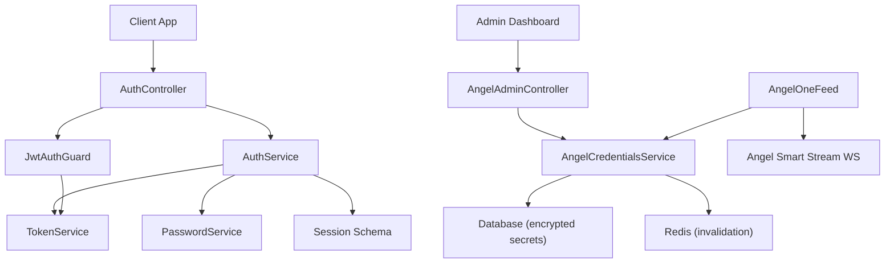
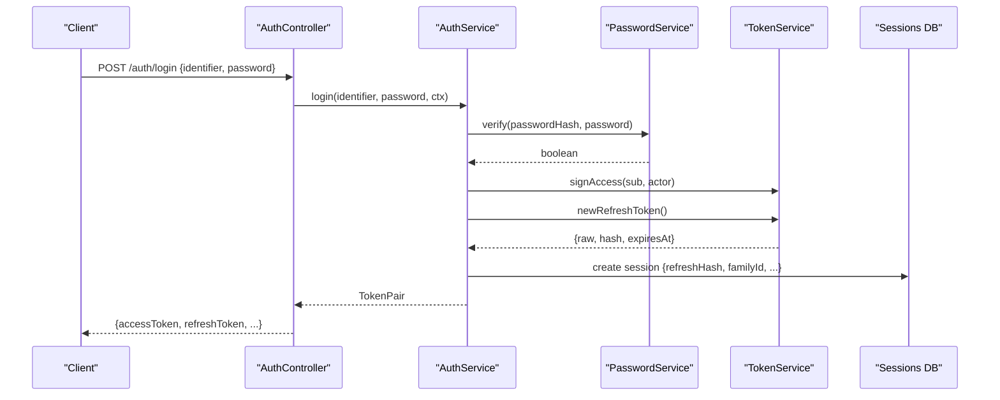
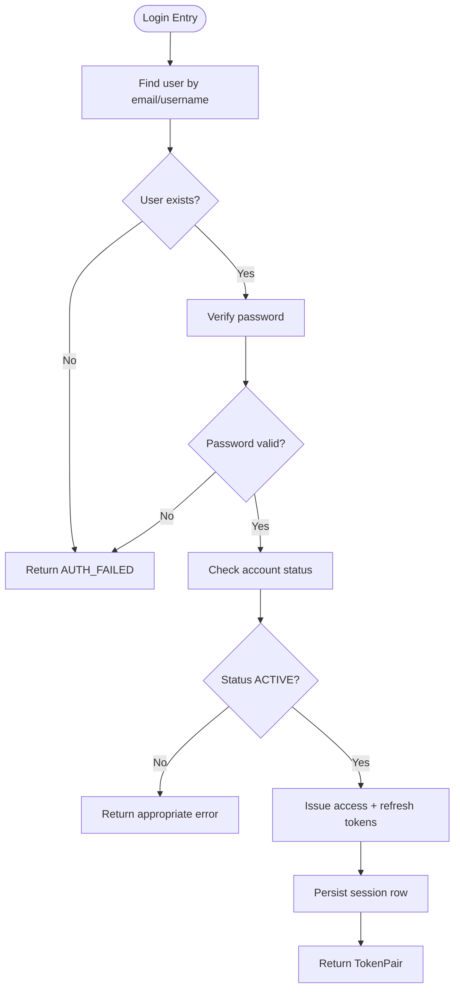
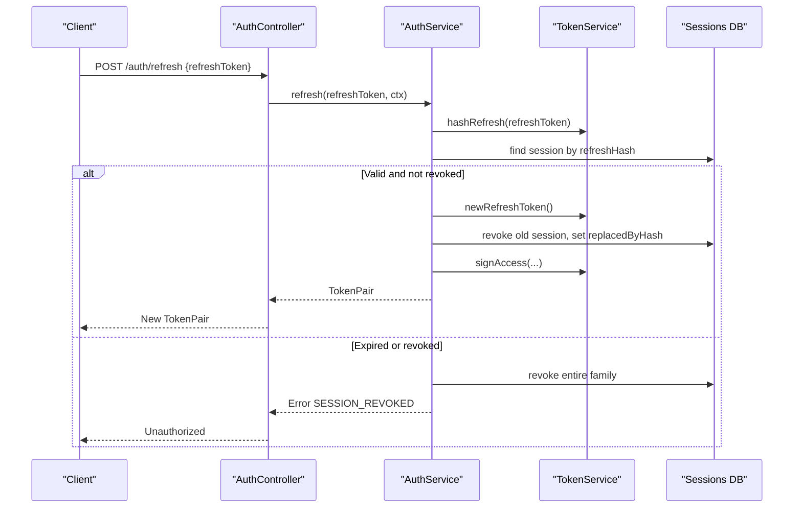
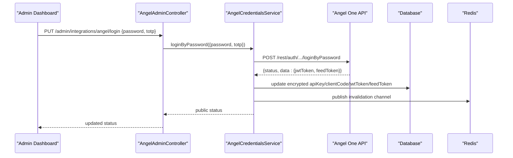
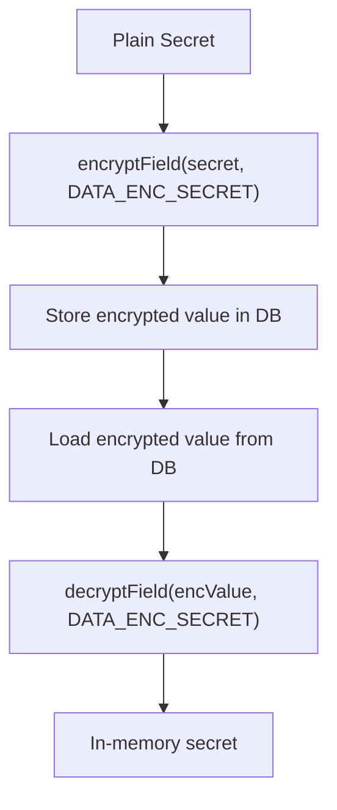
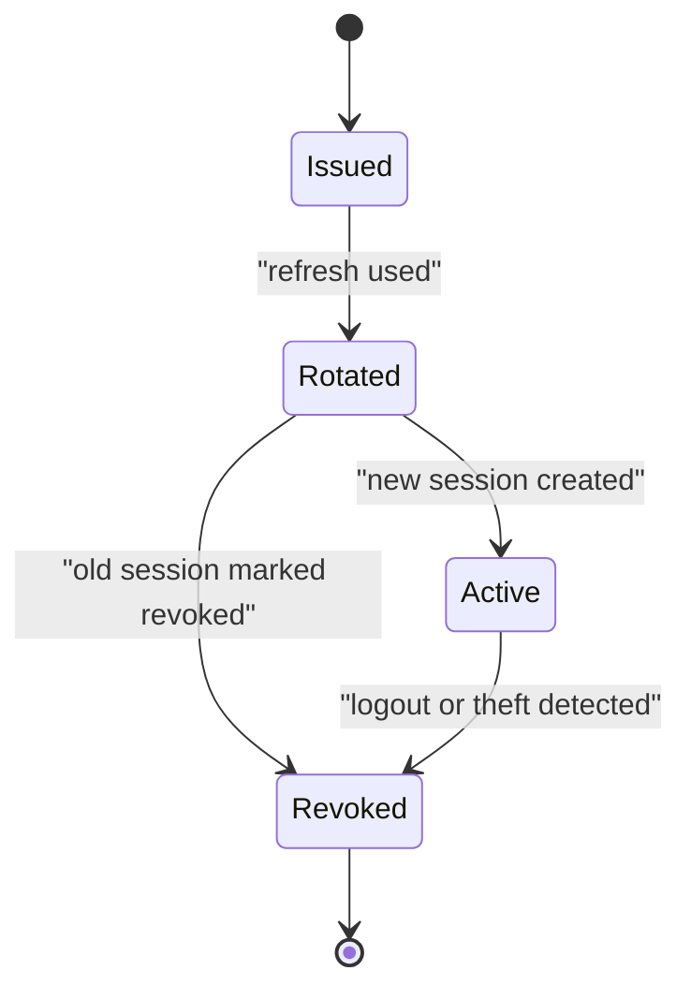
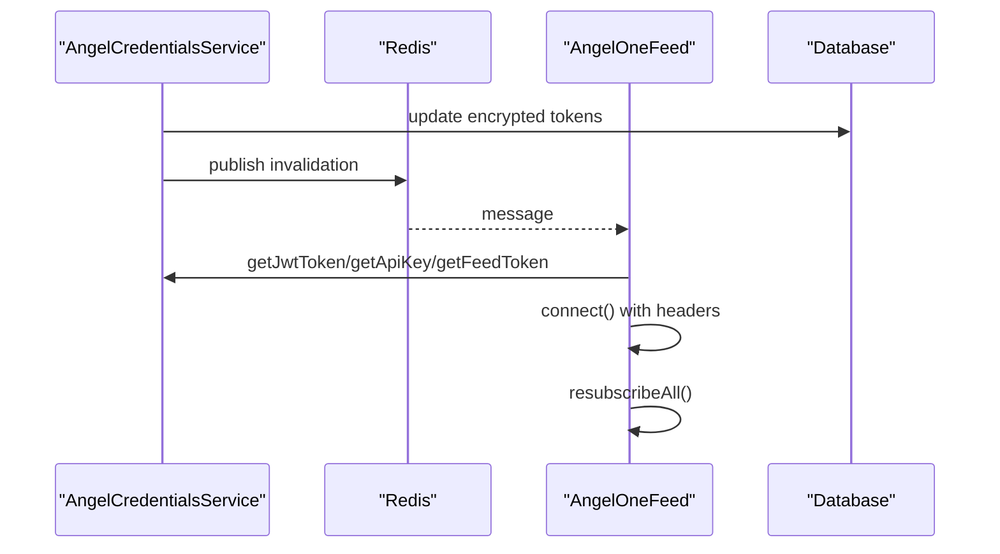
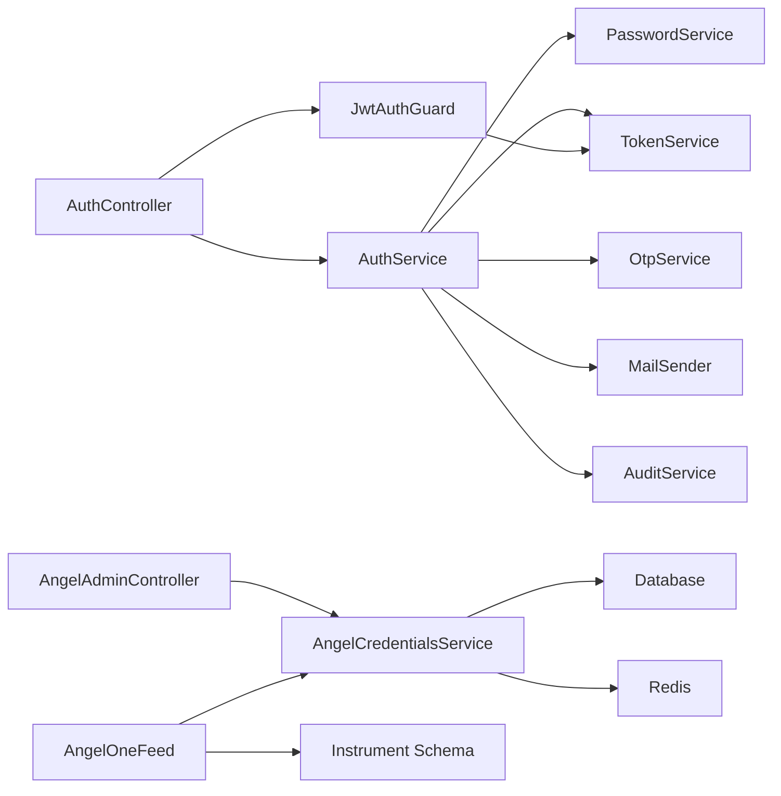

# Authentication & Session Management

<cite>
**Referenced Files in This Document**
- [auth.service.ts](file://backend/apps/api/src/modules/auth/application/auth.service.ts)
- [token.service.ts](file://backend/apps/api/src/modules/auth/infrastructure/token.service.ts)
- [crypto.util.ts](file://backend/apps/api/src/modules/auth/infrastructure/crypto.util.ts)
- [session.schema.ts](file://backend/apps/api/src/modules/auth/infrastructure/schemas/session.schema.ts)
- [password.service.ts](file://backend/apps/api/src/modules/auth/infrastructure/password.service.ts)
- [auth.controller.ts](file://backend/apps/api/src/modules/auth/presentation/auth.controller.ts)
- [jwt-auth.guard.ts](file://backend/apps/api/src/modules/auth/presentation/jwt-auth.guard.ts)
- [angel-credentials.service.ts](file://backend/apps/api/src/modules/market/application/angel-credentials.service.ts)
- [angel-admin.controller.ts](file://backend/apps/api/src/modules/market/presentation/angel-admin.controller.ts)
- [angel-one-feed.ts](file://backend/apps/api/src/modules/market/infrastructure/feed/angel-one-feed.ts)
- [app-config.service.ts](file://backend/libs/shared/src/config/app-config.service.ts)
</cite>

## Table of Contents
1. Introduction
2. Project Structure
3. Core Components
4. Architecture Overview
5. Detailed Component Analysis
6. Dependency Analysis
7. Performance Considerations
8. Troubleshooting Guide
9. Conclusion

## Introduction
This document explains the authentication and session management for Angel One integration within the system. It covers:
- Multi-step authentication flow (user ID, password, two-factor authentication)
- JWT token acquisition and refresh
- Feed token generation and automatic refresh via admin operations
- Credential storage with encryption
- Session lifecycle management
- Error handling for authentication failures
- Configuration through the admin dashboard
- Security best practices for API key management

## Project Structure
The authentication and Angel One integration span multiple modules:
- Auth module: user login, refresh, logout, password reset, OTP flows, JWT issuance, session persistence
- Market module: Angel One credentials management, feed token handling, WebSocket market data feed
- Shared config: runtime configuration service with hot reload



**Diagram sources**
- [auth.controller.ts:53-139](file://backend/apps/api/src/modules/auth/presentation/auth.controller.ts#L53-L139)
- [auth.service.ts:145-232](file://backend/apps/api/src/modules/auth/application/auth.service.ts#L145-L232)
- [token.service.ts:20-89](file://backend/apps/api/src/modules/auth/infrastructure/token.service.ts#L20-L89)
- [angel-admin.controller.ts:56-180](file://backend/apps/api/src/modules/market/presentation/angel-admin.controller.ts#L56-L180)
- [angel-credentials.service.ts:54-177](file://backend/apps/api/src/modules/market/application/angel-credentials.service.ts#L54-L177)
- [angel-one-feed.ts:22-62](file://backend/apps/api/src/modules/market/infrastructure/feed/angel-one-feed.ts#L22-L62)

**Section sources**
- [auth.controller.ts:53-139](file://backend/apps/api/src/modules/auth/presentation/auth.controller.ts#L53-L139)
- [auth.service.ts:145-232](file://backend/apps/api/src/modules/auth/application/auth.service.ts#L145-L232)
- [token.service.ts:20-89](file://backend/apps/api/src/modules/auth/infrastructure/token.service.ts#L20-L89)
- [angel-admin.controller.ts:56-180](file://backend/apps/api/src/modules/market/presentation/angel-admin.controller.ts#L56-L180)
- [angel-credentials.service.ts:54-177](file://backend/apps/api/src/modules/market/application/angel-credentials.service.ts#L54-L177)
- [angel-one-feed.ts:22-62](file://backend/apps/api/src/modules/market/infrastructure/feed/angel-one-feed.ts#L22-L62)

## Core Components
- AuthService: orchestrates login, refresh, logout, password reset, email/mobile verification, and session creation
- TokenService: issues RS256 JWT access tokens and purpose-bound short-lived tokens; manages opaque refresh tokens stored as hashes
- PasswordService: secure hashing and verification using Argon2id
- AngelCredentialsService: stores encrypted API key, client code, JWT token, and feed token; supports admin login to obtain fresh tokens; broadcasts changes via Redis
- AngelOneFeed: connects to Angel One Smart Stream using current credentials; reconnects on credential updates
- JwtAuthGuard: validates Bearer tokens and enforces actor type (USER/EMPLOYEE)

**Section sources**
- [auth.service.ts:28-345](file://backend/apps/api/src/modules/auth/application/auth.service.ts#L28-L345)
- [token.service.ts:20-89](file://backend/apps/api/src/modules/auth/infrastructure/token.service.ts#L20-L89)
- [password.service.ts:1-26](file://backend/apps/api/src/modules/auth/infrastructure/password.service.ts#L1-L26)
- [angel-credentials.service.ts:54-177](file://backend/apps/api/src/modules/market/application/angel-credentials.service.ts#L54-L177)
- [angel-one-feed.ts:22-62](file://backend/apps/api/src/modules/market/infrastructure/feed/angel-one-feed.ts#L22-L62)
- [jwt-auth.guard.ts:10-34](file://backend/apps/api/src/modules/auth/presentation/jwt-auth.guard.ts#L10-L34)

## Architecture Overview
The system implements a layered approach:
- Presentation layer exposes REST endpoints for auth and admin operations
- Application layer contains business logic for authentication and Angel One integration
- Infrastructure layer handles persistence, encryption, tokenization, and external integrations



**Diagram sources**
- [auth.controller.ts:86-96](file://backend/apps/api/src/modules/auth/presentation/auth.controller.ts#L86-L96)
- [auth.service.ts:145-183](file://backend/apps/api/src/modules/auth/application/auth.service.ts#L145-L183)
- [token.service.ts:42-79](file://backend/apps/api/src/modules/auth/infrastructure/token.service.ts#L42-L79)
- [session.schema.ts:9-41](file://backend/apps/api/src/modules/auth/infrastructure/schemas/session.schema.ts#L9-L41)

## Detailed Component Analysis

### User Authentication Flow
- Login accepts identifier (email or username) and password
- Validates account status and records login attempts
- Issues an access token (RS256 JWT) and a refresh token (opaque, hashed in DB)
- Stores session metadata including device, IP, user agent, expiry, and family ID



**Diagram sources**
- [auth.service.ts:145-183](file://backend/apps/api/src/modules/auth/application/auth.service.ts#L145-L183)
- [password.service.ts:14-23](file://backend/apps/api/src/modules/auth/infrastructure/password.service.ts#L14-L23)
- [token.service.ts:42-79](file://backend/apps/api/src/modules/auth/infrastructure/token.service.ts#L42-L79)
- [session.schema.ts:9-41](file://backend/apps/api/src/modules/auth/infrastructure/schemas/session.schema.ts#L9-L41)

**Section sources**
- [auth.controller.ts:86-96](file://backend/apps/api/src/modules/auth/presentation/auth.controller.ts#L86-L96)
- [auth.service.ts:145-183](file://backend/apps/api/src/modules/auth/application/auth.service.ts#L145-L183)

### Refresh and Logout
- Refresh uses the opaque refresh token to issue a new pair and rotate sessions
- Revoked or expired refresh tokens trigger family-wide revocation to mitigate theft
- Logout marks the specific session as revoked



**Diagram sources**
- [auth.controller.ts:92-96](file://backend/apps/api/src/modules/auth/presentation/auth.controller.ts#L92-L96)
- [auth.service.ts:190-216](file://backend/apps/api/src/modules/auth/application/auth.service.ts#L190-L216)
- [token.service.ts:73-84](file://backend/apps/api/src/modules/auth/infrastructure/token.service.ts#L73-L84)
- [session.schema.ts:9-41](file://backend/apps/api/src/modules/auth/infrastructure/schemas/session.schema.ts#L9-L41)

**Section sources**
- [auth.service.ts:190-232](file://backend/apps/api/src/modules/auth/application/auth.service.ts#L190-L232)
- [auth.controller.ts:92-107](file://backend/apps/api/src/modules/auth/presentation/auth.controller.ts#L92-L107)

### Two-Factor Authentication (TOTP) for Angel One
- Admin logs into Angel One via password and TOTP
- On success, Angel One returns jwtToken and feedToken
- These are stored encrypted in the database and loaded into memory at runtime
- Changes broadcast via Redis to reload components without restart



**Diagram sources**
- [angel-admin.controller.ts:129-151](file://backend/apps/api/src/modules/market/presentation/angel-admin.controller.ts#L129-L151)
- [angel-credentials.service.ts:179-219](file://backend/apps/api/src/modules/market/application/angel-credentials.service.ts#L179-L219)
- [crypto.util.ts:9-24](file://backend/apps/api/src/modules/auth/infrastructure/crypto.util.ts#L9-L24)

**Section sources**
- [angel-admin.controller.ts:129-151](file://backend/apps/api/src/modules/market/presentation/angel-admin.controller.ts#L129-L151)
- [angel-credentials.service.ts:179-219](file://backend/apps/api/src/modules/market/application/angel-credentials.service.ts#L179-L219)

### JWT Token Acquisition and Validation
- Access tokens are RS256-signed JWTs containing sub, actor, typ, roles
- Purpose tokens are short-lived signed tokens for email verification and password reset
- Guards validate Bearer tokens and enforce actor type

```mermaid
classDiagram
class TokenService {
+signAccess(sub, actor, roles) string
+verifyAccess(token) AccessTokenClaims
+signPurpose(claims, ttlSeconds) string
+verifyPurpose(token, expected) PurposeTokenClaims
+newRefreshToken() {raw, hash, expiresAt}
+hashRefresh(raw) string
+passwordFingerprint(hash) string
}
class JwtAuthGuard {
+canActivate(context) bool
}
JwtAuthGuard --> TokenService : "verifies access token"
```

**Diagram sources**
- [token.service.ts:20-89](file://backend/apps/api/src/modules/auth/infrastructure/token.service.ts#L20-L89)
- [jwt-auth.guard.ts:10-34](file://backend/apps/api/src/modules/auth/presentation/jwt-auth.guard.ts#L10-L34)

**Section sources**
- [token.service.ts:20-89](file://backend/apps/api/src/modules/auth/infrastructure/token.service.ts#L20-L89)
- [jwt-auth.guard.ts:10-34](file://backend/apps/api/src/modules/auth/presentation/jwt-auth.guard.ts#L10-L34)

### Credential Storage with Encryption
- Sensitive fields (API key, JWT token, feed token) are encrypted using AES-256-GCM before storage
- Decryption occurs when loading credentials into memory
- Public status masks secrets for safe display



**Diagram sources**
- [crypto.util.ts:9-24](file://backend/apps/api/src/modules/auth/infrastructure/crypto.util.ts#L9-L24)
- [angel-credentials.service.ts:139-177](file://backend/apps/api/src/modules/market/application/angel-credentials.service.ts#L139-L177)
- [angel-credentials.service.ts:257-303](file://backend/apps/api/src/modules/market/application/angel-credentials.service.ts#L257-L303)

**Section sources**
- [crypto.util.ts:9-24](file://backend/apps/api/src/modules/auth/infrastructure/crypto.util.ts#L9-L24)
- [angel-credentials.service.ts:139-177](file://backend/apps/api/src/modules/market/application/angel-credentials.service.ts#L139-L177)
- [angel-credentials.service.ts:257-303](file://backend/apps/api/src/modules/market/application/angel-credentials.service.ts#L257-L303)

### Session Lifecycle Management
- Sessions store hashed refresh tokens, family IDs, device info, IPs, user agents, expiry, revocation state
- Rotation replaces old session with new one and marks old as revoked
- Family revocation protects against token reuse/theft



**Diagram sources**
- [session.schema.ts:9-41](file://backend/apps/api/src/modules/auth/infrastructure/schemas/session.schema.ts#L9-L41)
- [auth.service.ts:190-232](file://backend/apps/api/src/modules/auth/application/auth.service.ts#L190-L232)

**Section sources**
- [session.schema.ts:9-41](file://backend/apps/api/src/modules/auth/infrastructure/schemas/session.schema.ts#L9-L41)
- [auth.service.ts:190-232](file://backend/apps/api/src/modules/auth/application/auth.service.ts#L190-L232)

### Automatic Token Refresh Mechanisms
- Angel One feed automatically reconnects when credentials change
- Credentials are reloaded from DB/env and broadcast via Redis
- Feed subscribes/unsubscribes instruments based on mapped tokens



**Diagram sources**
- [angel-credentials.service.ts:83-92](file://backend/apps/api/src/modules/market/application/angel-credentials.service.ts#L83-L92)
- [angel-credentials.service.ts:139-177](file://backend/apps/api/src/modules/market/application/angel-credentials.service.ts#L139-L177)
- [angel-one-feed.ts:45-62](file://backend/apps/api/src/modules/market/infrastructure/feed/angel-one-feed.ts#L45-L62)
- [angel-one-feed.ts:188-198](file://backend/apps/api/src/modules/market/infrastructure/feed/angel-one-feed.ts#L188-L198)

**Section sources**
- [angel-credentials.service.ts:83-92](file://backend/apps/api/src/modules/market/application/angel-credentials.service.ts#L83-L92)
- [angel-one-feed.ts:45-62](file://backend/apps/api/src/modules/market/infrastructure/feed/angel-one-feed.ts#L45-L62)
- [angel-one-feed.ts:188-198](file://backend/apps/api/src/modules/market/infrastructure/feed/angel-one-feed.ts#L188-L198)

### Configuration Through Admin Dashboard
- Admin endpoints allow updating Angel One credentials and feed mode
- All changes are audited and broadcast to reload services
- Public status shows masked secrets and source of configuration

**Section sources**
- [angel-admin.controller.ts:56-180](file://backend/apps/api/src/modules/market/presentation/angel-admin.controller.ts#L56-L180)
- [angel-credentials.service.ts:123-177](file://backend/apps/api/src/modules/market/application/angel-credentials.service.ts#L123-L177)

### Security Best Practices for API Key Management
- Use environment variables for initial setup; prefer DB-backed encrypted storage for runtime updates
- Mask secrets in responses to avoid leakage
- Enforce strict rate limiting on sensitive endpoints
- Rotate refresh tokens and revoke families on reuse detection
- Validate actor types via guards to prevent cross-role access

**Section sources**
- [auth.controller.ts:22-51](file://backend/apps/api/src/modules/auth/presentation/auth.controller.ts#L22-L51)
- [jwt-auth.guard.ts:10-34](file://backend/apps/api/src/modules/auth/presentation/jwt-auth.guard.ts#L10-L34)
- [angel-credentials.service.ts:43-47](file://backend/apps/api/src/modules/market/application/angel-credentials.service.ts#L43-L47)

## Dependency Analysis
Key dependencies and relationships:
- AuthController depends on AuthService and DTOs
- AuthService depends on PasswordService, TokenService, OtpService, MailSender, AuditService, ConfigService
- AngelCredentialsService depends on Database, Redis, Crypto utilities, ConfigService
- AngelOneFeed depends on AngelCredentialsService and Instrument schema mapping
- JwtAuthGuard depends on TokenService for access token validation



**Diagram sources**
- [auth.controller.ts:53-139](file://backend/apps/api/src/modules/auth/presentation/auth.controller.ts#L53-L139)
- [auth.service.ts:28-40](file://backend/apps/api/src/modules/auth/application/auth.service.ts#L28-L40)
- [angel-admin.controller.ts:56-64](file://backend/apps/api/src/modules/market/presentation/angel-admin.controller.ts#L56-L64)
- [angel-credentials.service.ts:70-81](file://backend/apps/api/src/modules/market/application/angel-credentials.service.ts#L70-L81)
- [angel-one-feed.ts:36-39](file://backend/apps/api/src/modules/market/infrastructure/feed/angel-one-feed.ts#L36-L39)

**Section sources**
- [auth.controller.ts:53-139](file://backend/apps/api/src/modules/auth/presentation/auth.controller.ts#L53-L139)
- [auth.service.ts:28-40](file://backend/apps/api/src/modules/auth/application/auth.service.ts#L28-L40)
- [angel-admin.controller.ts:56-64](file://backend/apps/api/src/modules/market/presentation/angel-admin.controller.ts#L56-L64)
- [angel-credentials.service.ts:70-81](file://backend/apps/api/src/modules/market/application/angel-credentials.service.ts#L70-L81)
- [angel-one-feed.ts:36-39](file://backend/apps/api/src/modules/market/infrastructure/feed/angel-one-feed.ts#L36-L39)

## Performance Considerations
- Rate limiting on auth endpoints prevents brute-force attacks
- Refresh rotation reduces exposure window and enables theft detection
- Encrypted field storage adds minimal overhead but ensures security at rest
- Redis-based invalidation avoids full restarts and improves responsiveness
- Batched instrument token sync minimizes DB writes

[No sources needed since this section provides general guidance]

## Troubleshooting Guide
Common authentication failures and resolutions:
- Invalid credentials: check user existence and password correctness
- Suspended or rejected accounts: contact support to resolve status
- Verification pending: complete mobile/email verification steps
- Session revoked: indicates reuse or expiration; re-authenticate
- Angel login failed: ensure API key and client code configured; verify TOTP
- Feed connection errors: confirm JWT and feed tokens are present and valid

**Section sources**
- [auth.controller.ts:25-51](file://backend/apps/api/src/modules/auth/presentation/auth.controller.ts#L25-L51)
- [auth.service.ts:151-183](file://backend/apps/api/src/modules/auth/application/auth.service.ts#L151-L183)
- [angel-credentials.service.ts:179-219](file://backend/apps/api/src/modules/market/application/angel-credentials.service.ts#L179-L219)
- [angel-one-feed.ts:71-107](file://backend/apps/api/src/modules/market/infrastructure/feed/angel-one-feed.ts#L71-L107)

## Conclusion
The system implements robust authentication and session management with strong security measures:
- Multi-step user authentication with status checks and audit logging
- Secure JWT issuance and refresh rotation with family revocation
- Encrypted credential storage with runtime reload via Redis
- Admin-driven Angel One integration with TOTP-based login and feed token management
- Automatic feed reconnection and subscription handling

These mechanisms ensure secure, scalable, and maintainable authentication and session management for Angel One integration.