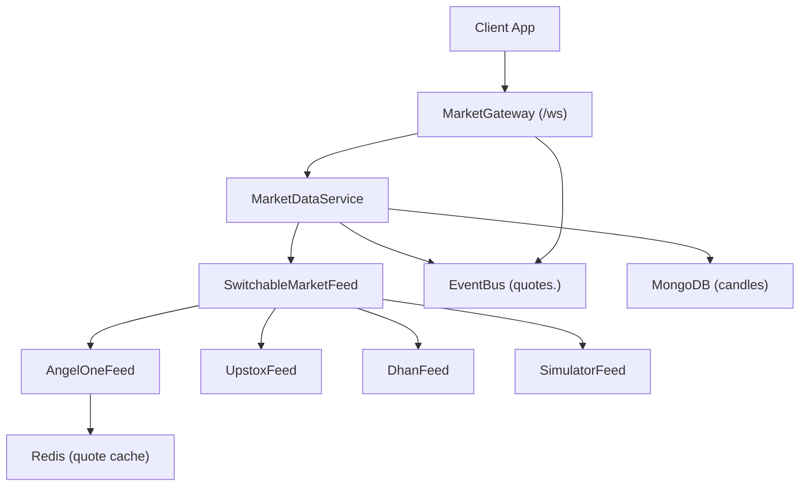
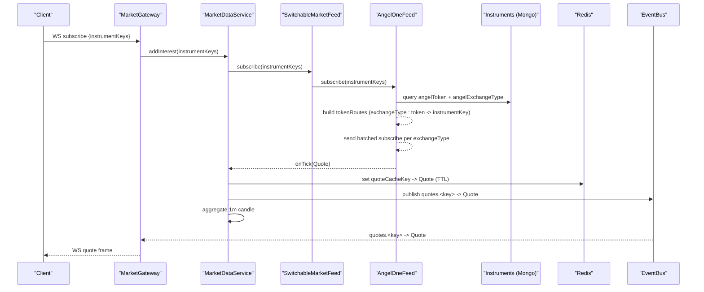
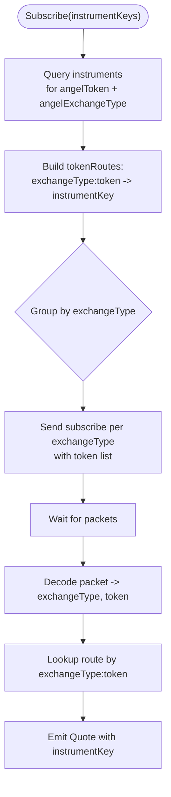
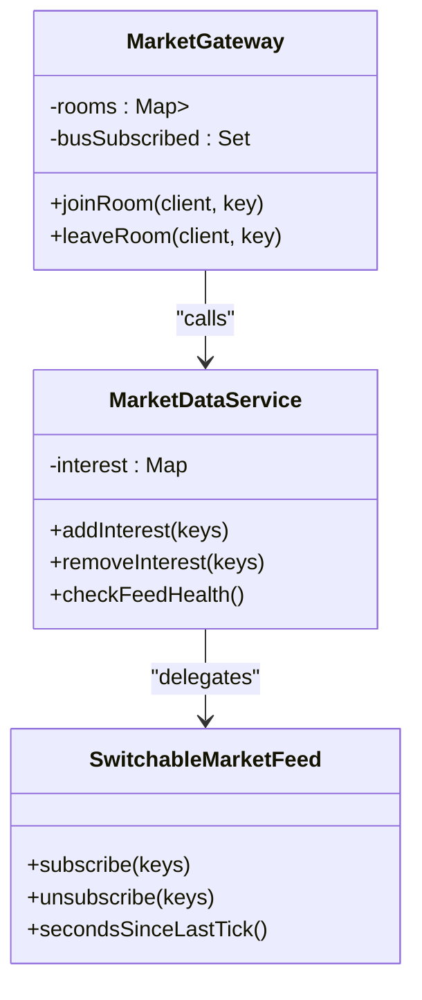
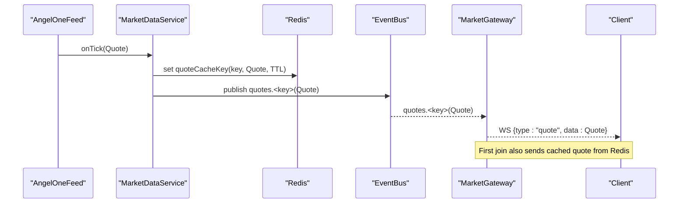
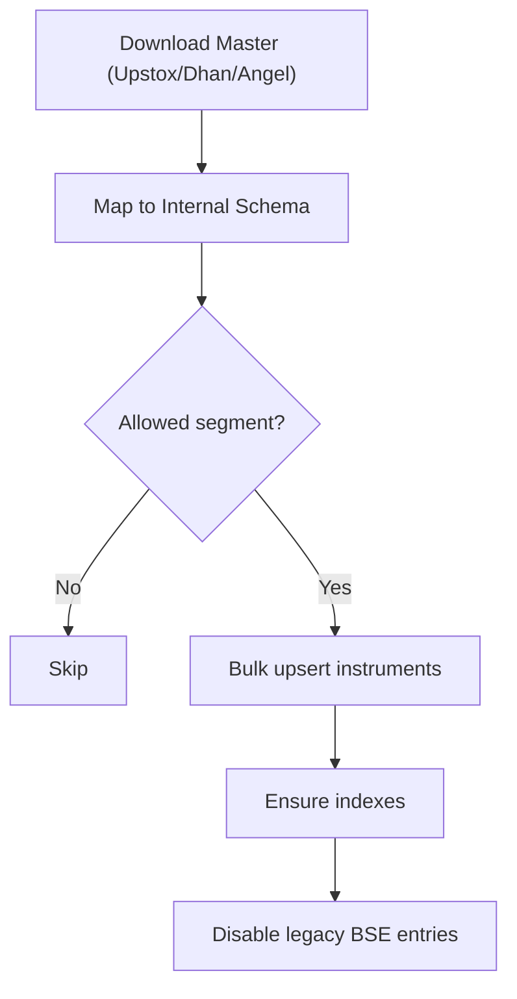
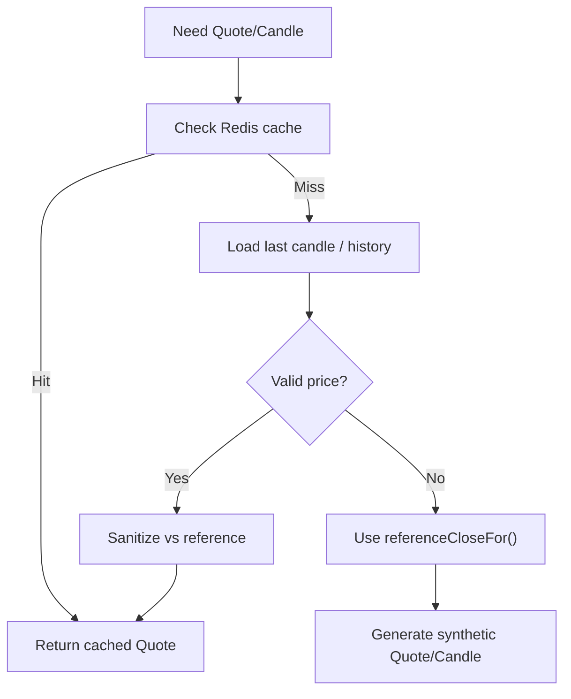
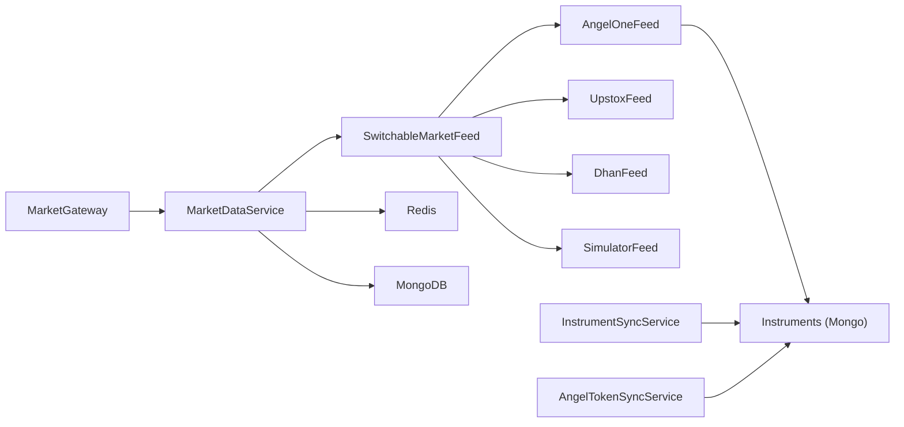

# Instrument Subscription & Market Data

<cite>
**Referenced Files in This Document**
- [market-data.service.ts](file://backend/apps/api/src/modules/market/application/market-data.service.ts)
- [angel-one-feed.ts](file://backend/apps/api/src/modules/market/infrastructure/feed/angel-one-feed.ts)
- [angel-one-decode.ts](file://backend/apps/api/src/modules/market/infrastructure/feed/angel-one-decode.ts)
- [switchable-market-feed.ts](file://backend/apps/api/src/modules/market/infrastructure/feed/switchable-market-feed.ts)
- [market.gateway.ts](file://backend/apps/api/src/modules/market/presentation/market.gateway.ts)
- [instrument-mapper.ts](file://backend/apps/api/src/modules/market/infrastructure/instrument-mapper.ts)
- [instrument-sync.service.ts](file://backend/apps/api/src/modules/market/application/instrument-sync.service.ts)
- [angel-token-sync.service.ts](file://backend/apps/api/src/modules/market/application/angel-token-sync.service.ts)
- [instrument.schema.ts](file://backend/apps/api/src/modules/market/infrastructure/schemas/instrument.schema.ts)
- [catalog-aggregation.ts](file://backend/apps/api/src/modules/market/infrastructure/catalog-aggregation.ts)
- [market.types.ts](file://backend/libs/shared/src/market/market.types.ts)
- [reference-prices.ts](file://backend/libs/shared/src/market/reference-prices.ts)
</cite>

## Table of Contents
1. Introduction
2. Project Structure
3. Core Components
4. Architecture Overview
5. Detailed Component Analysis
6. Dependency Analysis
7. Performance Considerations
8. Troubleshooting Guide
9. Conclusion

## Introduction
This document explains how instruments are subscribed and how market data flows through the system, with a focus on:
- Mapping internal instrument keys to Angel One tokens and exchange types
- Batching subscriptions by exchange type for efficiency
- Real-time quote processing and fan-out to clients
- Token routing that maps Angel One tokens back to internal instrument keys
- Subscription state management (on-demand subscribe/unsubscribe)
- Handling instrument metadata changes and fallbacks when live data is unavailable
- Performance considerations for large subscription lists and monitoring market data quality

## Project Structure
The market data subsystem spans application services, infrastructure adapters, presentation gateways, and shared contracts:
- Application layer orchestrates subscription interest, caching, aggregation, and persistence
- Infrastructure provides feed adapters (Angel One, Upstox, Dhan, Simulator) and instrument mapping/sync
- Presentation exposes WebSocket gateway for client subscriptions and real-time quotes
- Shared contracts define Quote, channels, and reference prices used across components

**Diagram sources**
- [market.gateway.ts:26-134](file://backend/apps/api/src/modules/market/presentation/market.gateway.ts#L26-L134)
- [market-data.service.ts:24-139](file://backend/apps/api/src/modules/market/application/market-data.service.ts#L24-L139)
- [switchable-market-feed.ts:23-186](file://backend/apps/api/src/modules/market/infrastructure/feed/switchable-market-feed.ts#L23-L186)
- [angel-one-feed.ts:22-242](file://backend/apps/api/src/modules/market/infrastructure/feed/angel-one-feed.ts#L22-L242)

**Section sources**
- [market.gateway.ts:26-134](file://backend/apps/api/src/modules/market/presentation/market.gateway.ts#L26-L134)
- [market-data.service.ts:24-139](file://backend/apps/api/src/modules/market/application/market-data.service.ts#L24-L139)
- [switchable-market-feed.ts:23-186](file://backend/apps/api/src/modules/market/infrastructure/feed/switchable-market-feed.ts#L23-L186)
- [angel-one-feed.ts:22-242](file://backend/apps/api/src/modules/market/infrastructure/feed/angel-one-feed.ts#L22-L242)

## Core Components
- MarketDataService: Central pipeline owning one MarketFeed instance; manages per-instrument interest counts; writes ticks to Redis; publishes events; aggregates 1-minute candles; monitors feed health.
- AngelOneFeed: WSS adapter to Angel One Smart Stream; decodes binary packets; routes tokens to internal instrument keys via DB; batches subscribe/unsubscribe by exchange type.
- SwitchableMarketFeed: Runtime switch between simulator/live feeds; failover on stale ticks; preserves subscriptions across switches.
- MarketGateway: WebSocket endpoint handling client subscribe/unsubscribe; room-per-instrument fan-out; triggers upstream subscription via MarketDataService.
- InstrumentSyncService & AngelTokenSyncService: Sync instrument master from Upstox/Dhan/Angel; map fields; update angelToken and angelExchangeType on instruments.
- Catalog Aggregation & Instrument Mapper: Dedupe and prioritize instruments; normalize tick sizes; infer underlying keys; filter segments.

Key responsibilities:
- On-demand subscription: only instruments with active clients are subscribed upstream
- Exchange-type batching: Angel One subscribes per exchange type with token arrays
- Token routing: incoming Angel One packets mapped back to canonical instrument keys
- Quote caching and event bus: Redis-backed last quote and pub/sub fan-out
- Candle aggregation and persistence: 1m bars buffered and flushed to MongoDB
- Stale feed watchdog: re-subscribe or failover if no ticks during market hours

**Section sources**
- [market-data.service.ts:24-139](file://backend/apps/api/src/modules/market/application/market-data.service.ts#L24-L139)
- [angel-one-feed.ts:22-242](file://backend/apps/api/src/modules/market/infrastructure/feed/angel-one-feed.ts#L22-L242)
- [switchable-market-feed.ts:23-186](file://backend/apps/api/src/modules/market/infrastructure/feed/switchable-market-feed.ts#L23-L186)
- [market.gateway.ts:26-134](file://backend/apps/api/src/modules/market/presentation/market.gateway.ts#L26-L134)
- [instrument-sync.service.ts:29-227](file://backend/apps/api/src/modules/market/application/instrument-sync.service.ts#L29-L227)
- [angel-token-sync.service.ts:47-170](file://backend/apps/api/src/modules/market/application/angel-token-sync.service.ts#L47-L170)
- [catalog-aggregation.ts:1-78](file://backend/apps/api/src/modules/market/infrastructure/catalog-aggregation.ts#L1-L78)
- [instrument-mapper.ts:1-135](file://backend/apps/api/src/modules/market/infrastructure/instrument-mapper.ts#L1-L135)

## Architecture Overview
End-to-end flow from client subscription to live quote delivery:

**Diagram sources**
- [market.gateway.ts:71-134](file://backend/apps/api/src/modules/market/presentation/market.gateway.ts#L71-L134)
- [market-data.service.ts:61-139](file://backend/apps/api/src/modules/market/application/market-data.service.ts#L61-L139)
- [switchable-market-feed.ts:86-102](file://backend/apps/api/src/modules/market/infrastructure/feed/switchable-market-feed.ts#L86-L102)
- [angel-one-feed.ts:136-215](file://backend/apps/api/src/modules/market/infrastructure/feed/angel-one-feed.ts#L136-L215)

## Detailed Component Analysis

### Angel One Token Routing and Exchange-Type Batching
- Subscriptions are grouped by exchange type to minimize messages to Angel One. Each group sends an array of tokens for that exchange type.
- Incoming packets are decoded into exchangeType and token; a route map associates each exchangeType:token pair with an internal instrumentKey.
- The route map is built from the Instruments collection where angelToken and angelExchangeType are present.

**Diagram sources**
- [angel-one-feed.ts:136-215](file://backend/apps/api/src/modules/market/infrastructure/feed/angel-one-feed.ts#L136-L215)
- [angel-one-decode.ts:23-57](file://backend/apps/api/src/modules/market/infrastructure/feed/angel-one-decode.ts#L23-L57)

**Section sources**
- [angel-one-feed.ts:136-215](file://backend/apps/api/src/modules/market/infrastructure/feed/angel-one-feed.ts#L136-L215)
- [angel-one-decode.ts:23-57](file://backend/apps/api/src/modules/market/infrastructure/feed/angel-one-decode.ts#L23-L57)

### Subscription State Management (On-Demand)
- MarketGateway tracks rooms per instrument and ensures first client triggers upstream subscription; last client leaves triggers unsubscribe.
- MarketDataService maintains an interest counter per instrumentKey; increments/decrements and calls feed.subscribe/unsubscribe accordingly.
- A watchdog periodically checks feed health and resubscribes tracked keys if stale during market hours.

**Diagram sources**
- [market.gateway.ts:91-134](file://backend/apps/api/src/modules/market/presentation/market.gateway.ts#L91-L134)
- [market-data.service.ts:61-101](file://backend/apps/api/src/modules/market/application/market-data.service.ts#L61-L101)
- [switchable-market-feed.ts:86-102](file://backend/apps/api/src/modules/market/infrastructure/feed/switchable-market-feed.ts#L86-L102)

**Section sources**
- [market.gateway.ts:91-134](file://backend/apps/api/src/modules/market/presentation/market.gateway.ts#L91-L134)
- [market-data.service.ts:61-101](file://backend/apps/api/src/modules/market/application/market-data.service.ts#L61-L101)

### Real-Time Quote Processing Pipeline
- AngelOneFeed decodes packets and emits normalized Quote objects with instrumentKey resolved via tokenRoutes.
- MarketDataService persists last quote to Redis with TTL, publishes to EventBus channel quotes.<key>, and aggregates 1-minute candles.
- MarketGateway subscribes to EventBus channels once per key and relays frames to connected clients; also sends cached last quote immediately upon joining.

**Diagram sources**
- [angel-one-decode.ts:43-57](file://backend/apps/api/src/modules/market/infrastructure/feed/angel-one-decode.ts#L43-L57)
- [market-data.service.ts:103-126](file://backend/apps/api/src/modules/market/application/market-data.service.ts#L103-L126)
- [market.gateway.ts:106-113](file://backend/apps/api/src/modules/market/presentation/market.gateway.ts#L106-L113)

**Section sources**
- [angel-one-decode.ts:43-57](file://backend/apps/api/src/modules/market/infrastructure/feed/angel-one-decode.ts#L43-L57)
- [market-data.service.ts:103-126](file://backend/apps/api/src/modules/market/application/market-data.service.ts#L103-L126)
- [market.gateway.ts:106-113](file://backend/apps/api/src/modules/market/presentation/market.gateway.ts#L106-L113)

### Instrument Metadata and Token Mapping
- InstrumentSyncService downloads Upstox/Dhan masters, maps rows to internal schema, bulk upserts, and ensures indexes. It disables legacy BSE entries for trader catalog visibility.
- AngelTokenSyncService downloads Angel OpenAPI scrip master, maps exch_seg to exchangeType, matches against enabled instruments by symbol/exchange/segment heuristics, and updates angelToken and angelExchangeType.
- Instrument schema stores canonical instrumentKey plus provider-specific identifiers (angelToken, angelExchangeType, dhanSecurityId, dhanExchangeSegment).

**Diagram sources**
- [instrument-sync.service.ts:37-97](file://backend/apps/api/src/modules/market/application/instrument-sync.service.ts#L37-L97)
- [instrument-sync.service.ts:99-188](file://backend/apps/api/src/modules/market/application/instrument-sync.service.ts#L99-L188)
- [angel-token-sync.service.ts:55-140](file://backend/apps/api/src/modules/market/application/angel-token-sync.service.ts#L55-L140)
- [instrument.schema.ts:9-76](file://backend/apps/api/src/modules/market/infrastructure/schemas/instrument.schema.ts#L9-L76)

**Section sources**
- [instrument-sync.service.ts:37-97](file://backend/apps/api/src/modules/market/application/instrument-sync.service.ts#L37-L97)
- [instrument-sync.service.ts:99-188](file://backend/apps/api/src/modules/market/application/instrument-sync.service.ts#L99-L188)
- [angel-token-sync.service.ts:55-140](file://backend/apps/api/src/modules/market/application/angel-token-sync.service.ts#L55-L140)
- [instrument.schema.ts:9-76](file://backend/apps/api/src/modules/market/infrastructure/schemas/instrument.schema.ts#L9-L76)

### Fallbacks and Reference Prices
- When live/history is unavailable, synthetic quotes/candles are generated using reference closes for indices and liquid names.
- Stale simulator quotes are rejected if they deviate significantly from reference levels.
- Last known close is derived from recent candles or historical day bars, then sanitized against reference prices.

**Diagram sources**
- [reference-prices.ts:39-89](file://backend/libs/shared/src/market/reference-prices.ts#L39-L89)
- [market-data.service.ts:128-139](file://backend/apps/api/src/modules/market/application/market-data.service.ts#L128-L139)

**Section sources**
- [reference-prices.ts:39-89](file://backend/libs/shared/src/market/reference-prices.ts#L39-L89)
- [market-data.service.ts:128-139](file://backend/apps/api/src/modules/market/application/market-data.service.ts#L128-L139)

## Dependency Analysis
- MarketGateway depends on MarketDataService for interest management and on EventBus for quote fan-out.
- MarketDataService depends on a single MarketFeed abstraction (SwitchableMarketFeed), Redis for caching, and MongoDB for candle persistence.
- SwitchableMarketFeed composes multiple concrete feeds and handles runtime switching and failover.
- AngelOneFeed depends on Instruments collection for token routing and uses Angel credentials service for connection setup.
- InstrumentSyncService and AngelTokenSyncService depend on external masters and write to Instruments collection.

**Diagram sources**
- [market.gateway.ts:26-134](file://backend/apps/api/src/modules/market/presentation/market.gateway.ts#L26-L134)
- [market-data.service.ts:24-139](file://backend/apps/api/src/modules/market/application/market-data.service.ts#L24-L139)
- [switchable-market-feed.ts:23-186](file://backend/apps/api/src/modules/market/infrastructure/feed/switchable-market-feed.ts#L23-L186)
- [angel-one-feed.ts:22-242](file://backend/apps/api/src/modules/market/infrastructure/feed/angel-one-feed.ts#L22-L242)
- [instrument-sync.service.ts:29-227](file://backend/apps/api/src/modules/market/application/instrument-sync.service.ts#L29-L227)
- [angel-token-sync.service.ts:47-170](file://backend/apps/api/src/modules/market/application/angel-token-sync.service.ts#L47-L170)

**Section sources**
- [market.gateway.ts:26-134](file://backend/apps/api/src/modules/market/presentation/market.gateway.ts#L26-L134)
- [market-data.service.ts:24-139](file://backend/apps/api/src/modules/market/application/market-data.service.ts#L24-L139)
- [switchable-market-feed.ts:23-186](file://backend/apps/api/src/modules/market/infrastructure/feed/switchable-market-feed.ts#L23-L186)
- [angel-one-feed.ts:22-242](file://backend/apps/api/src/modules/market/infrastructure/feed/angel-one-feed.ts#L22-L242)
- [instrument-sync.service.ts:29-227](file://backend/apps/api/src/modules/market/application/instrument-sync.service.ts#L29-L227)
- [angel-token-sync.service.ts:47-170](file://backend/apps/api/src/modules/market/application/angel-token-sync.service.ts#L47-L170)

## Performance Considerations
- On-demand subscription: Only instruments with active clients are subscribed upstream, preventing wholesale subscription of large catalogs.
- Exchange-type batching: Angel One subscriptions are grouped by exchangeType with token arrays to reduce message overhead.
- Redis caching: Last quotes are cached with TTL to avoid repeated DB lookups and provide immediate responses to new subscribers.
- Event bus fan-out: Per-key channels ensure efficient distribution to interested clients without scanning all connections.
- Candle buffering: 1-minute candles are aggregated in memory and flushed in batches to MongoDB to reduce write pressure.
- Stale feed watchdog: Periodic checks resubscribe tracked keys or trigger failover to alternate live feeds when idle beyond threshold.
- Catalog deduplication: Aggregation pipelines prefer Dhan instrument keys and deduplicate symbols to optimize UI queries.

[No sources needed since this section provides general guidance]

## Troubleshooting Guide
Common issues and diagnostics:
- No quotes received during market hours:
  - Check feed secondsSinceLastTick and stale alert thresholds; re-subscription may be triggered automatically.
  - Verify credentials are configured for the selected feed mode; SwitchableMarketFeed will fall back if primary is unavailable.
- Wrong instrumentKey in quotes:
  - Ensure angelToken and angelExchangeType are correctly synced in Instruments; verify tokenRoutes are built after reconnect.
- Excessive CPU/memory usage:
  - Limit client-side subscription lists; gateway caps instrumentKeys per message.
  - Monitor Redis TTL and size; ensure quoteCacheKey usage is consistent.
- Stale or invalid quotes:
  - Synthetic quotes use referenceCloseFor; check reference prices and sanitize logic if values seem off.
  - Legacy simulator quotes are rejected if outside reference bounds.

**Section sources**
- [market-data.service.ts:128-139](file://backend/apps/api/src/modules/market/application/market-data.service.ts#L128-L139)
- [switchable-market-feed.ts:158-186](file://backend/apps/api/src/modules/market/infrastructure/feed/switchable-market-feed.ts#L158-L186)
- [angel-one-feed.ts:188-198](file://backend/apps/api/src/modules/market/infrastructure/feed/angel-one-feed.ts#L188-L198)
- [reference-prices.ts:39-89](file://backend/libs/shared/src/market/reference-prices.ts#L39-L89)

## Conclusion
The system implements a robust, scalable market data pipeline with on-demand subscriptions, exchange-type batching, and resilient feed switching. Angel One token routing maps provider tokens back to canonical instrument keys, enabling accurate quote delivery. Redis caching and event bus fan-out ensure low-latency client updates, while candle aggregation and persistence support charting needs. Instrument metadata synchronization keeps mappings current, and reference-based fallbacks maintain data quality even when live sources are unavailable. Monitoring via stale feed detection and watchdogs helps maintain reliability under varying conditions.

[No sources needed since this section summarizes without analyzing specific files]