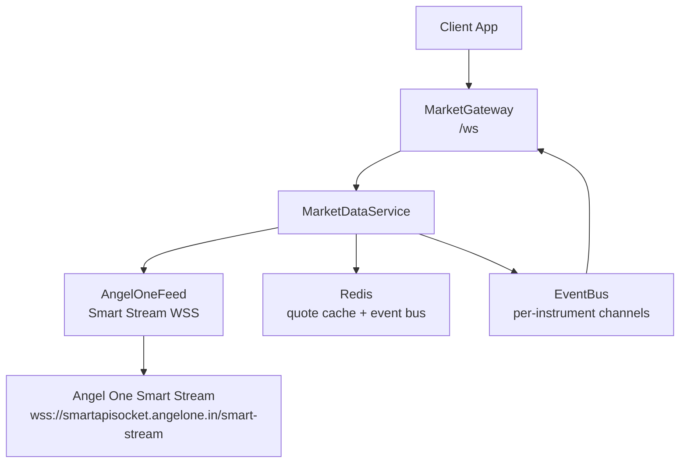
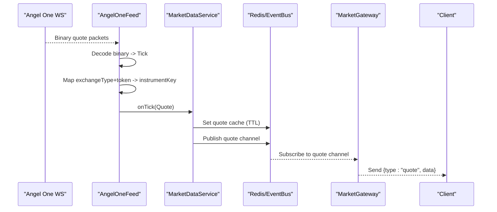
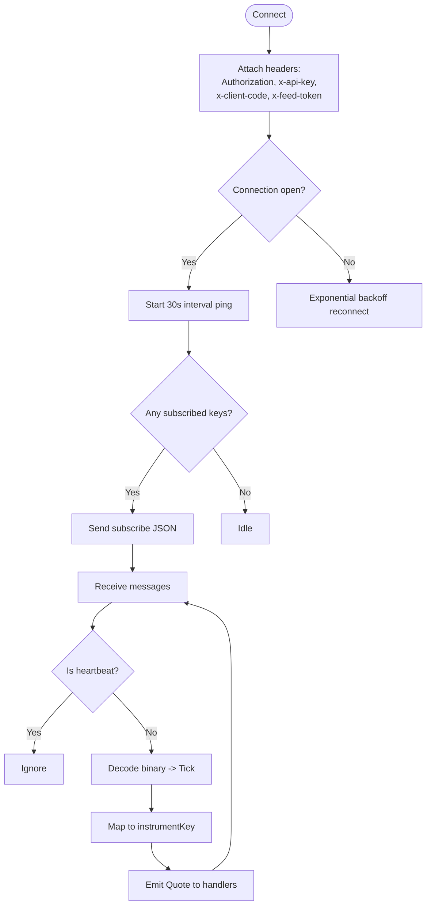
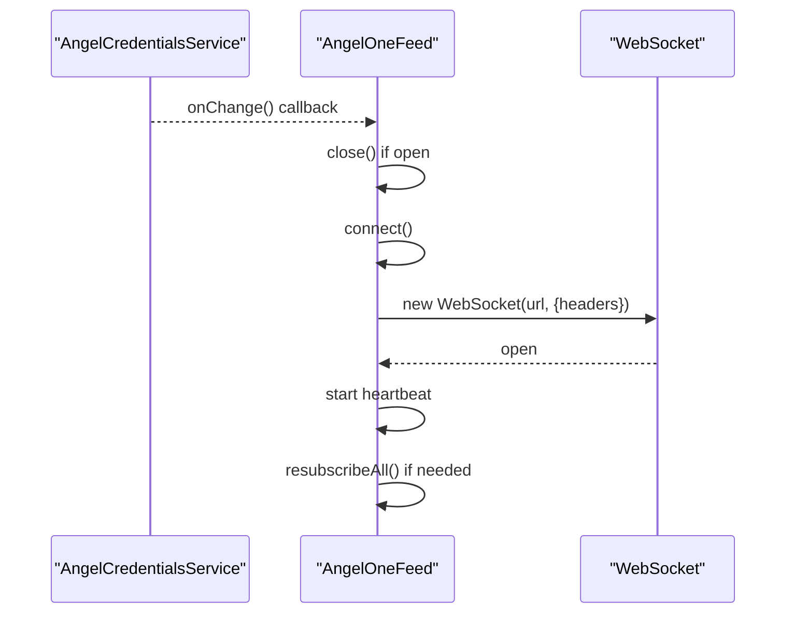
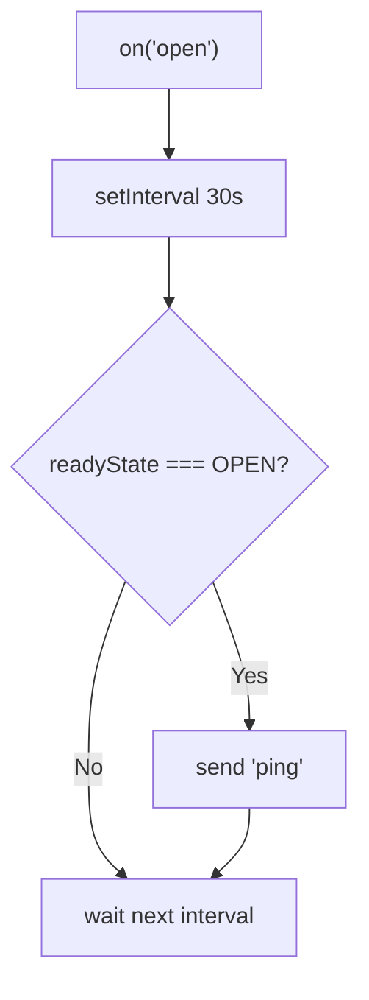
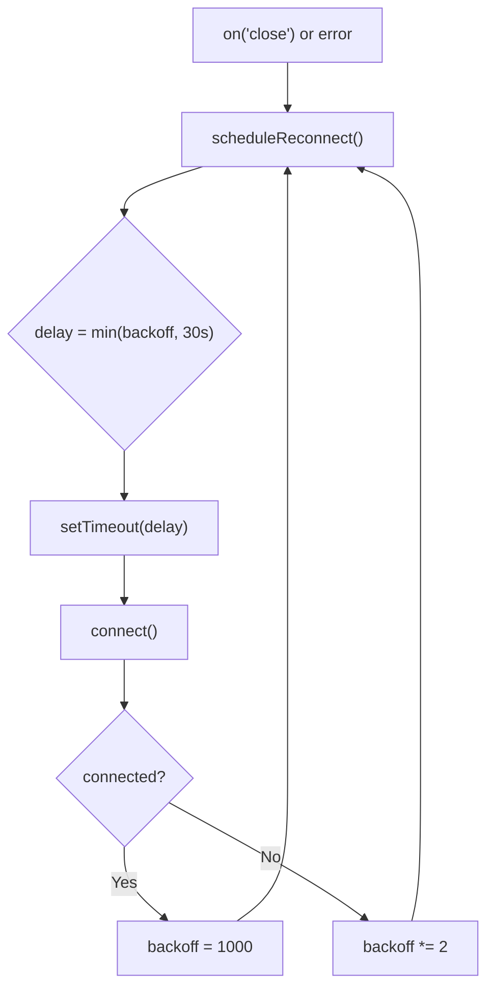
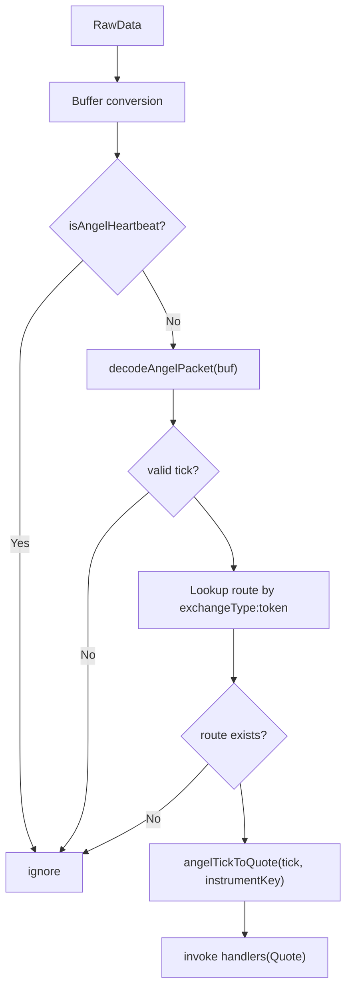
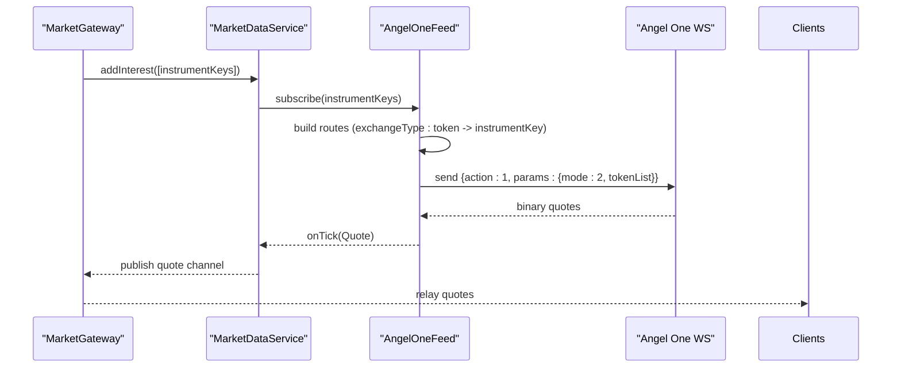
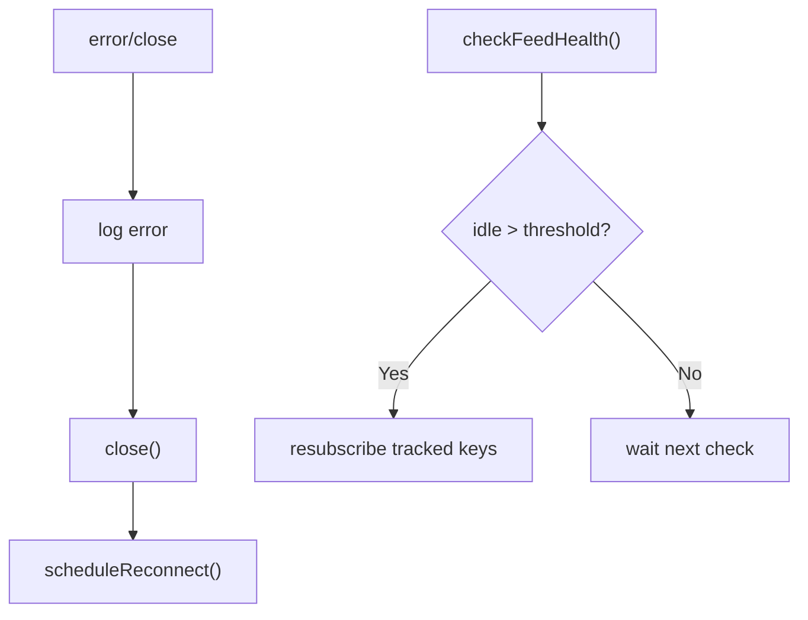
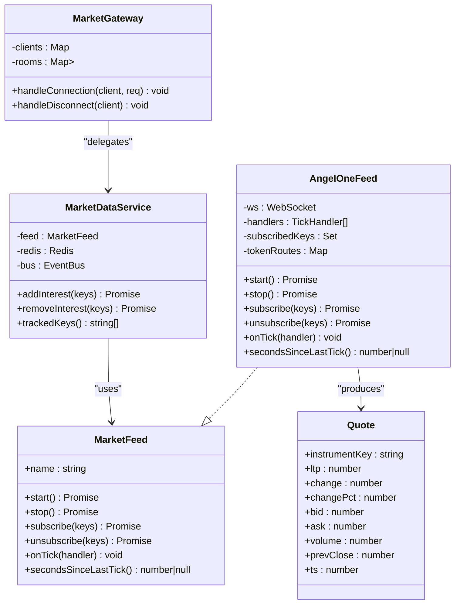

# WebSocket Connection & Message Handling

<cite>
**Referenced Files in This Document**
- [angel-one-feed.ts](file://backend/apps/api/src/modules/market/infrastructure/feed/angel-one-feed.ts)
- [angel-one-decode.ts](file://backend/apps/api/src/modules/market/infrastructure/feed/angel-one-decode.ts)
- [market-feed.port.ts](file://backend/apps/api/src/modules/market/infrastructure/feed/market-feed.port.ts)
- [market-data.service.ts](file://backend/apps/api/src/modules/market/application/market-data.service.ts)
- [angel-credentials.service.ts](file://backend/apps/api/src/modules/market/application/angel-credentials.service.ts)
- [market.gateway.ts](file://backend/apps/api/src/modules/market/presentation/market.gateway.ts)
- [market.types.ts](file://backend/libs/shared/src/market/market.types.ts)
</cite>

## Table of Contents
1. [Introduction](#introduction)
2. [Project Structure](#project-structure)
3. [Core Components](#core-components)
4. [Architecture Overview](#architecture-overview)
5. [Detailed Component Analysis](#detailed-component-analysis)
6. [Dependency Analysis](#dependency-analysis)
7. [Performance Considerations](#performance-considerations)
8. [Troubleshooting Guide](#troubleshooting-guide)
9. [Conclusion](#conclusion)

## Introduction
This document explains the Angel One Smart Stream WebSocket integration used to ingest live market data, focusing on connection management, message decoding, subscription protocols, heartbeat and reconnection behavior, and error recovery strategies. It also covers how quotes are normalized into a canonical Quote model and propagated through the system for downstream consumers.

## Project Structure
The WebSocket pipeline is implemented as a layered architecture:
- Presentation layer exposes a client-facing WebSocket gateway that authenticates clients and fans out quotes per instrument room.
- Application layer owns the single upstream MarketFeed instance, tracks interest, persists quotes, aggregates candles, and monitors feed health.
- Infrastructure layer implements provider-specific adapters (Angel One here) over WebSockets with binary packet decoding and subscription messaging.
- Shared types define the canonical Quote contract and channeling utilities.

**Diagram sources**
- [market.gateway.ts:26-134](file://backend/apps/api/src/modules/market/presentation/market.gateway.ts#L26-L134)
- [market-data.service.ts:24-139](file://backend/apps/api/src/modules/market/application/market-data.service.ts#L24-L139)
- [angel-one-feed.ts:13-242](file://backend/apps/api/src/modules/market/infrastructure/feed/angel-one-feed.ts#L13-L242)
- [market.types.ts:5-38](file://backend/libs/shared/src/market/market.types.ts#L5-L38)

**Section sources**
- [market.gateway.ts:26-134](file://backend/apps/api/src/modules/market/presentation/market.gateway.ts#L26-L134)
- [market-data.service.ts:24-139](file://backend/apps/api/src/modules/market/application/market-data.service.ts#L24-L139)
- [angel-one-feed.ts:13-242](file://backend/apps/api/src/modules/market/infrastructure/feed/angel-one-feed.ts#L13-L242)
- [market.types.ts:5-38](file://backend/libs/shared/src/market/market.types.ts#L5-L38)

## Core Components
- AngelOneFeed: Implements MarketFeed using Angel One Smart Stream WebSocket. Handles connection, headers, heartbeat, messages, subscriptions, and exponential backoff reconnection.
- Angel One decoder: Parses binary packets into an internal tick representation and converts to Quote.
- MarketDataService: Owns the feed, tracks per-instrument interest, writes quotes to Redis, publishes via EventBus, aggregates 1m candles, and runs a stale-feed watchdog.
- MarketGateway: Client-facing WebSocket at /ws; authenticates via token, manages rooms per instrument, relays quotes, and triggers upstream subscribe/unsubscribe based on room membership.
- AngelCredentialsService: Provides API key, client code, JWT, and feed token; supports hot reload and emits change events to trigger reconnects when credentials update.

**Section sources**
- [angel-one-feed.ts:22-242](file://backend/apps/api/src/modules/market/infrastructure/feed/angel-one-feed.ts#L22-L242)
- [angel-one-decode.ts:3-62](file://backend/apps/api/src/modules/market/infrastructure/feed/angel-one-decode.ts#L3-L62)
- [market-data.service.ts:24-139](file://backend/apps/api/src/modules/market/application/market-data.service.ts#L24-L139)
- [market.gateway.ts:26-134](file://backend/apps/api/src/modules/market/presentation/market.gateway.ts#L26-L134)
- [angel-credentials.service.ts:53-305](file://backend/apps/api/src/modules/market/application/angel-credentials.service.ts#L53-L305)

## Architecture Overview
The end-to-end flow from upstream market data to clients:

**Diagram sources**
- [angel-one-feed.ts:109-126](file://backend/apps/api/src/modules/market/infrastructure/feed/angel-one-feed.ts#L109-L126)
- [market-data.service.ts:103-108](file://backend/apps/api/src/modules/market/application/market-data.service.ts#L103-L108)
- [market.gateway.ts:106-113](file://backend/apps/api/src/modules/market/presentation/market.gateway.ts#L106-L113)

## Detailed Component Analysis

### Angel One Smart Stream WebSocket Protocol
- Endpoint: wss://smartapisocket.angelone.in/smart-stream
- Connection headers: Authorization (Bearer JWT), x-api-key, x-client-code, x-feed-token
- Heartbeat: Client sends periodic ping string every 30 seconds while connected; server may send pong frames or a special 4-byte heartbeat packet which is ignored by the decoder
- Subscription protocol: JSON messages with action 1 (subscribe) and action 0 (unsubscribe), mode set to quote mode, tokenList grouped by exchangeType
- Unsubscription: Same structure with action 0 and matching tokens

**Diagram sources**
- [angel-one-feed.ts:71-107](file://backend/apps/api/src/modules/market/infrastructure/feed/angel-one-feed.ts#L71-L107)
- [angel-one-feed.ts:200-232](file://backend/apps/api/src/modules/market/infrastructure/feed/angel-one-feed.ts#L200-L232)
- [angel-one-decode.ts:23-62](file://backend/apps/api/src/modules/market/infrastructure/feed/angel-one-decode.ts#L23-L62)

**Section sources**
- [angel-one-feed.ts:71-107](file://backend/apps/api/src/modules/market/infrastructure/feed/angel-one-feed.ts#L71-L107)
- [angel-one-decode.ts:23-62](file://backend/apps/api/src/modules/market/infrastructure/feed/angel-one-decode.ts#L23-L62)

### Connection Establishment and Credentials
- The feed reads credentials from AngelCredentialsService, which loads encrypted values from the database with environment fallback and emits changes when updated.
- On credential change, the feed closes the existing socket and reconnects automatically if configured.
- The connection uses the ws library with custom headers for authentication.

**Diagram sources**
- [angel-credentials.service.ts:83-92](file://backend/apps/api/src/modules/market/application/angel-credentials.service.ts#L83-L92)
- [angel-one-feed.ts:45-62](file://backend/apps/api/src/modules/market/infrastructure/feed/angel-one-feed.ts#L45-L62)
- [angel-one-feed.ts:71-97](file://backend/apps/api/src/modules/market/infrastructure/feed/angel-one-feed.ts#L71-L97)

**Section sources**
- [angel-credentials.service.ts:83-92](file://backend/apps/api/src/modules/market/application/angel-credentials.service.ts#L83-L92)
- [angel-one-feed.ts:45-62](file://backend/apps/api/src/modules/market/infrastructure/feed/angel-one-feed.ts#L45-L62)

### Heartbeat Mechanism
- After connection open, a timer sends a literal "ping" string every 30 seconds to keep the connection alive.
- Server heartbeat packets (a specific 4-byte sequence) are detected and ignored during message processing.

**Diagram sources**
- [angel-one-feed.ts:88-96](file://backend/apps/api/src/modules/market/infrastructure/feed/angel-one-feed.ts#L88-L96)
- [angel-one-decode.ts:59-62](file://backend/apps/api/src/modules/market/infrastructure/feed/angel-one-decode.ts#L59-L62)

**Section sources**
- [angel-one-feed.ts:88-96](file://backend/apps/api/src/modules/market/infrastructure/feed/angel-one-feed.ts#L88-L96)
- [angel-one-decode.ts:59-62](file://backend/apps/api/src/modules/market/infrastructure/feed/angel-one-decode.ts#L59-L62)

### Automatic Reconnection with Exponential Backoff
- On close or error, the feed schedules a reconnect with initial delay and doubles it up to a cap.
- When credentials change, the feed proactively closes and reconnects to refresh tokens.

**Diagram sources**
- [angel-one-feed.ts:99-107](file://backend/apps/api/src/modules/market/infrastructure/feed/angel-one-feed.ts#L99-L107)
- [angel-one-feed.ts:128-134](file://backend/apps/api/src/modules/market/infrastructure/feed/angel-one-feed.ts#L128-L134)

**Section sources**
- [angel-one-feed.ts:99-107](file://backend/apps/api/src/modules/market/infrastructure/feed/angel-one-feed.ts#L99-L107)
- [angel-one-feed.ts:128-134](file://backend/apps/api/src/modules/market/infrastructure/feed/angel-one-feed.ts#L128-L134)

### Message Decoding from Binary to Quote
- Incoming messages are converted to Buffer and checked for heartbeat; non-heartbeat packets are decoded using a fixed layout for LTP/Quote modes.
- The decoded tick includes exchangeType, token, ltp, prevClose, volume, and timestamp.
- The feed maps exchangeType+token to a canonical instrumentKey via a route map built from the instruments collection.
- The tick is transformed into a Quote with derived fields like change and changePct.

**Diagram sources**
- [angel-one-feed.ts:109-126](file://backend/apps/api/src/modules/market/infrastructure/feed/angel-one-feed.ts#L109-L126)
- [angel-one-decode.ts:23-57](file://backend/apps/api/src/modules/market/infrastructure/feed/angel-one-decode.ts#L23-L57)

**Section sources**
- [angel-one-feed.ts:109-126](file://backend/apps/api/src/modules/market/infrastructure/feed/angel-one-feed.ts#L109-L126)
- [angel-one-decode.ts:23-57](file://backend/apps/api/src/modules/market/infrastructure/feed/angel-one-decode.ts#L23-L57)

### Instrument Subscription and Unsubscription Protocols
- Subscription request: JSON with action 1, mode set to quote mode, and tokenList grouped by exchangeType containing arrays of tokens.
- Unsubscription request: JSON with action 0 and same tokenList structure.
- The feed groups tokens by exchangeType to minimize payload size and align with the upstream protocol.
- Interest tracking ensures upstream subscriptions happen only when at least one client cares about an instrument.

**Diagram sources**
- [market.gateway.ts:91-113](file://backend/apps/api/src/modules/market/presentation/market.gateway.ts#L91-L113)
- [market-data.service.ts:65-76](file://backend/apps/api/src/modules/market/application/market-data.service.ts#L65-L76)
- [angel-one-feed.ts:136-163](file://backend/apps/api/src/modules/market/infrastructure/feed/angel-one-feed.ts#L136-L163)
- [angel-one-feed.ts:200-215](file://backend/apps/api/src/modules/market/infrastructure/feed/angel-one-feed.ts#L200-L215)

**Section sources**
- [market.gateway.ts:91-113](file://backend/apps/api/src/modules/market/presentation/market.gateway.ts#L91-L113)
- [market-data.service.ts:65-76](file://backend/apps/api/src/modules/market/application/market-data.service.ts#L65-L76)
- [angel-one-feed.ts:136-163](file://backend/apps/api/src/modules/market/infrastructure/feed/angel-one-feed.ts#L136-L163)
- [angel-one-feed.ts:200-215](file://backend/apps/api/src/modules/market/infrastructure/feed/angel-one-feed.ts#L200-L215)

### Error Recovery Strategies
- Connection errors: logged and closed; reconnect scheduled with exponential backoff.
- Credential updates: feed detects changes and reconnects to refresh tokens.
- Stale feed detection: MarketDataService watchdog checks secondsSinceLastTick against a threshold during market hours; if stale, it re-subscribes tracked keys to force refresh.
- Graceful shutdown: stop clears heartbeat timers and closes the WebSocket.

**Diagram sources**
- [angel-one-feed.ts:99-107](file://backend/apps/api/src/modules/market/infrastructure/feed/angel-one-feed.ts#L99-L107)
- [angel-one-feed.ts:128-134](file://backend/apps/api/src/modules/market/infrastructure/feed/angel-one-feed.ts#L128-L134)
- [market-data.service.ts:128-137](file://backend/apps/api/src/modules/market/application/market-data.service.ts#L128-L137)

**Section sources**
- [angel-one-feed.ts:99-107](file://backend/apps/api/src/modules/market/infrastructure/feed/angel-one-feed.ts#L99-L107)
- [angel-one-feed.ts:128-134](file://backend/apps/api/src/modules/market/infrastructure/feed/angel-one-feed.ts#L128-L134)
- [market-data.service.ts:128-137](file://backend/apps/api/src/modules/market/application/market-data.service.ts#L128-L137)

## Dependency Analysis
The components interact through well-defined interfaces and shared types:

**Diagram sources**
- [market-feed.port.ts:7-22](file://backend/apps/api/src/modules/market/infrastructure/feed/market-feed.port.ts#L7-L22)
- [angel-one-feed.ts:22-242](file://backend/apps/api/src/modules/market/infrastructure/feed/angel-one-feed.ts#L22-L242)
- [market-data.service.ts:24-139](file://backend/apps/api/src/modules/market/application/market-data.service.ts#L24-L139)
- [market.gateway.ts:26-134](file://backend/apps/api/src/modules/market/presentation/market.gateway.ts#L26-L134)
- [market.types.ts:5-16](file://backend/libs/shared/src/market/market.types.ts#L5-L16)

**Section sources**
- [market-feed.port.ts:7-22](file://backend/apps/api/src/modules/market/infrastructure/feed/market-feed.port.ts#L7-L22)
- [angel-one-feed.ts:22-242](file://backend/apps/api/src/modules/market/infrastructure/feed/angel-one-feed.ts#L22-L242)
- [market-data.service.ts:24-139](file://backend/apps/api/src/modules/market/application/market-data.service.ts#L24-L139)
- [market.gateway.ts:26-134](file://backend/apps/api/src/modules/market/presentation/market.gateway.ts#L26-L134)
- [market.types.ts:5-16](file://backend/libs/shared/src/market/market.types.ts#L5-L16)

## Performance Considerations
- On-demand subscription: Upstream subscribes only when at least one client joins a room; reduces bandwidth and load.
- Batch grouping: Tokens are grouped by exchangeType before sending subscribe/unsubscribe payloads to minimize message size.
- Redis caching: Quotes are cached with TTL to serve immediate snapshots to joining clients and reduce upstream pressure.
- Event bus fan-out: Per-instrument channels decouple ingestion from delivery, enabling scalable distribution.
- Candle aggregation: Batches completed minute bars and performs bulk writes to reduce DB operations.
- Stale feed watchdog: Proactively re-subscribes when no ticks arrive during market hours to recover from silent failures.

[No sources needed since this section provides general guidance]

## Troubleshooting Guide
- Missing or invalid headers: Ensure Authorization (Bearer JWT), x-api-key, x-client-code, and x-feed-token are present and valid.
- No quotes received:
  - Verify instruments have angelToken and angelExchangeType populated so routes can be built.
  - Check that MarketDataService has positive interest for the instrument (at least one client joined the room).
  - Confirm heartbeat is running and not being blocked by firewall/proxy.
- Frequent reconnects:
  - Inspect logs for error messages; validate credentials and network connectivity.
  - Monitor backoff delays to ensure they are increasing appropriately.
- Stale feed alerts:
  - If stale feed warnings appear, verify market hours and that tracked keys exist; the system will attempt to re-subscribe automatically.
- Debugging tips:
  - Enable logging in AngelOneFeed and MarketDataService to trace connection lifecycle and message flows.
  - Use Redis to inspect cached quotes and confirm presence of expected instrument keys.
  - Validate client subscriptions via MarketGateway rooms and ensure join/unsubscribe logic is invoked correctly.

**Section sources**
- [angel-one-feed.ts:71-107](file://backend/apps/api/src/modules/market/infrastructure/feed/angel-one-feed.ts#L71-L107)
- [angel-one-feed.ts:136-163](file://backend/apps/api/src/modules/market/infrastructure/feed/angel-one-feed.ts#L136-L163)
- [market-data.service.ts:128-137](file://backend/apps/api/src/modules/market/application/market-data.service.ts#L128-L137)
- [market.gateway.ts:48-113](file://backend/apps/api/src/modules/market/presentation/market.gateway.ts#L48-L113)

## Conclusion
The Angel One Smart Stream integration provides a robust, production-grade WebSocket pipeline with clear separation of concerns: a provider adapter handles low-level protocol details, an application service orchestrates interest-based subscriptions and persistence, and a presentation gateway delivers quotes to clients efficiently. Heartbeats, automatic reconnection with exponential backoff, and stale feed detection ensure resilience, while Redis caching and event bus fan-out support scalability. Proper header configuration, instrument routing, and subscription grouping are critical to reliable operation.

[No sources needed since this section summarizes without analyzing specific files]