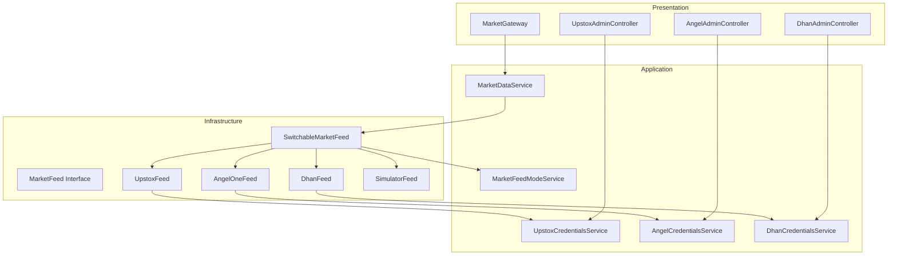
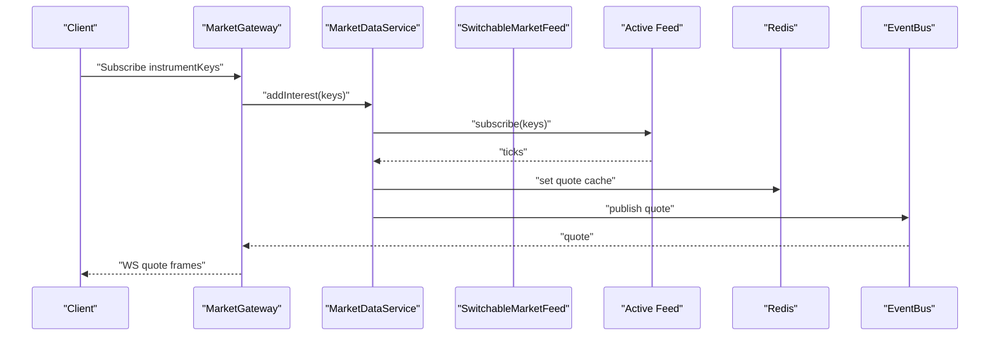
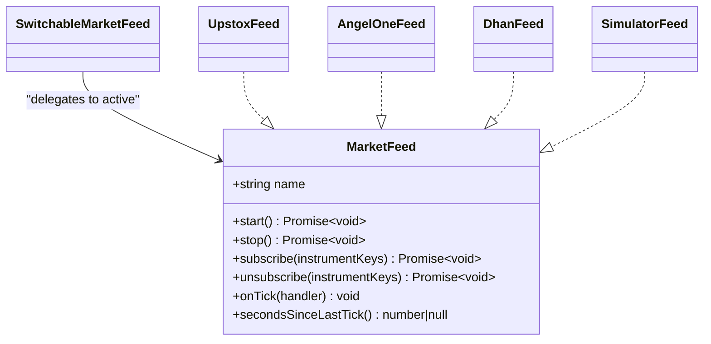
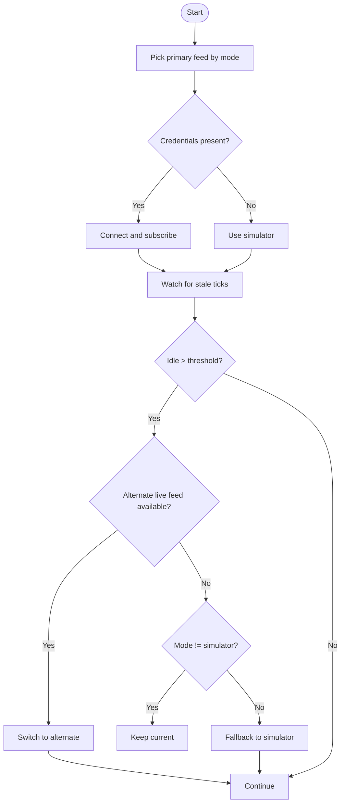
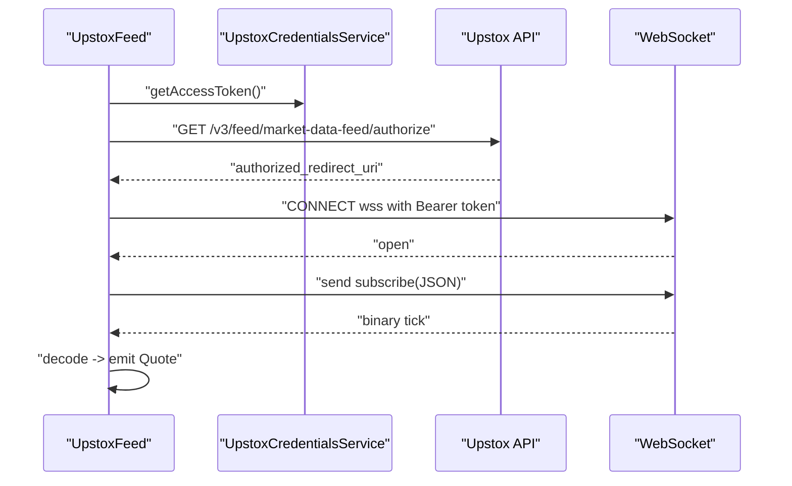
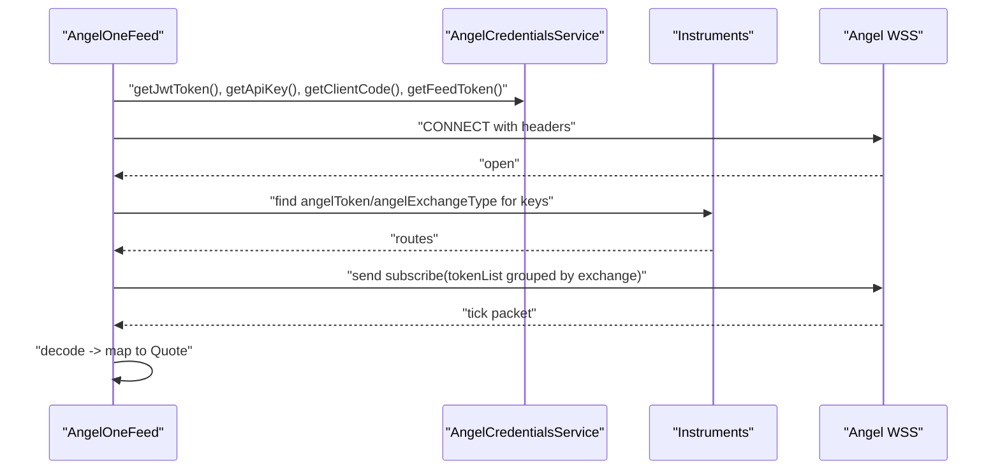
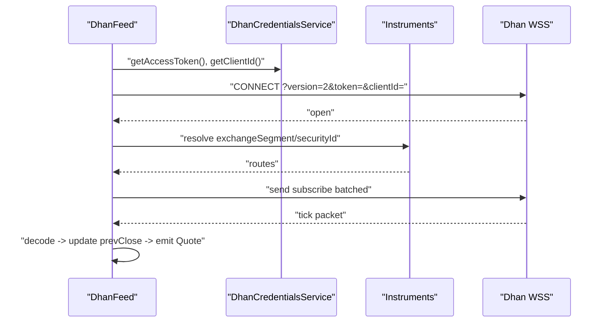
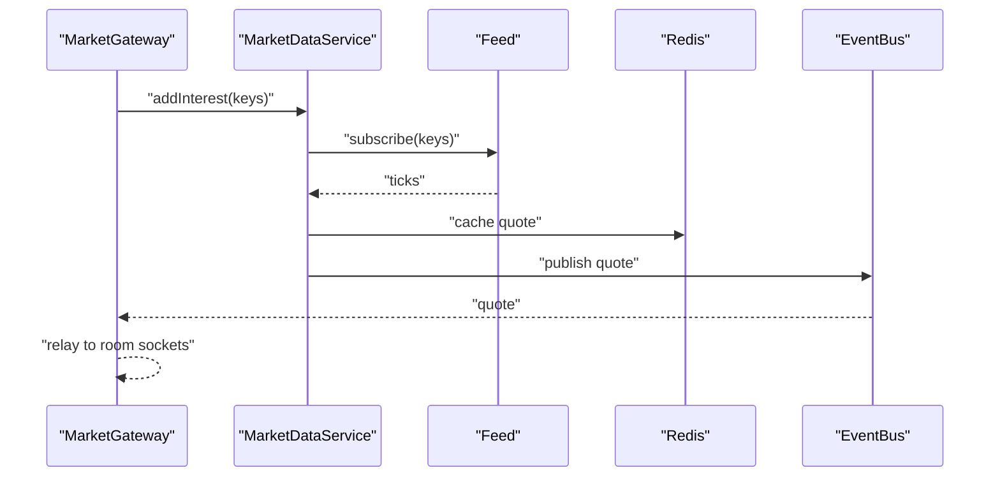
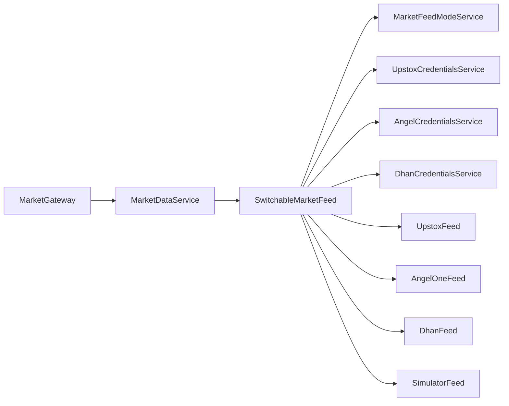

# Broker Integrations

<cite>
**Referenced Files in This Document**
- [market-feed.port.ts](file://backend/apps/api/src/modules/market/infrastructure/feed/market-feed.port.ts)
- [switchable-market-feed.ts](file://backend/apps/api/src/modules/market/infrastructure/feed/switchable-market-feed.ts)
- [upstox-feed.ts](file://backend/apps/api/src/modules/market/infrastructure/feed/upstox-feed.ts)
- [angel-one-feed.ts](file://backend/apps/api/src/modules/market/infrastructure/feed/angel-one-feed.ts)
- [dhan-feed.ts](file://backend/apps/api/src/modules/market/infrastructure/feed/dhan-feed.ts)
- [simulator-feed.ts](file://backend/apps/api/src/modules/market/infrastructure/feed/simulator-feed.ts)
- [upstox-credentials.service.ts](file://backend/apps/api/src/modules/market/application/upstox-credentials.service.ts)
- [angel-credentials.service.ts](file://backend/apps/api/src/modules/market/application/angel-credentials.service.ts)
- [dhan-credentials.service.ts](file://backend/apps/api/src/modules/market/application/dhan-credentials.service.ts)
- [market-data.service.ts](file://backend/apps/api/src/modules/market/application/market-data.service.ts)
- [market-feed-mode.service.ts](file://backend/apps/api/src/modules/market/application/market-feed-mode.service.ts)
- [upstox-admin.controller.ts](file://backend/apps/api/src/modules/market/presentation/upstox-admin.controller.ts)
- [angel-admin.controller.ts](file://backend/apps/api/src/modules/market/presentation/angel-admin.controller.ts)
- [dhan-admin.controller.ts](file://backend/apps/api/src/modules/market/presentation/dhan-admin.controller.ts)
- [market.gateway.ts](file://backend/apps/api/src/modules/market/presentation/market.gateway.ts)
</cite>

## Table of Contents
1. Introduction
2. Project Structure
3. Core Components
4. Architecture Overview
5. Detailed Component Analysis
6. Dependency Analysis
7. Performance Considerations
8. Troubleshooting Guide
9. Conclusion
10. Appendices

## Introduction
This document explains the broker integration architecture that standardizes market data streaming across multiple brokers (Upstox, Angel One, Dhan) and a simulator for development/testing. It covers the unified MarketFeed interface, runtime feed switching, connection management, authentication flows, message decoding, subscription handling, reconnection logic, configuration via admin interfaces, rate limiting considerations, performance optimizations, and testing strategies using mock feeds and integration patterns.

## Project Structure
The market data subsystem is organized under the market module:
- Infrastructure layer defines the MarketFeed abstraction and concrete broker adapters plus a simulator.
- Application layer provides credential services, feed mode management, and the ingestion pipeline.
- Presentation layer exposes admin APIs to configure credentials and switch feed modes, and a WebSocket gateway to stream quotes to clients.

**Diagram sources**
- [market-feed.port.ts:1-23](file://backend/apps/api/src/modules/market/infrastructure/feed/market-feed.port.ts#L1-L23)
- [switchable-market-feed.ts:1-186](file://backend/apps/api/src/modules/market/infrastructure/feed/switchable-market-feed.ts#L1-L186)
- [upstox-feed.ts:1-136](file://backend/apps/api/src/modules/market/infrastructure/feed/upstox-feed.ts#L1-L136)
- [angel-one-feed.ts:1-242](file://backend/apps/api/src/modules/market/infrastructure/feed/angel-one-feed.ts#L1-L242)
- [dhan-feed.ts:1-279](file://backend/apps/api/src/modules/market/infrastructure/feed/dhan-feed.ts#L1-L279)
- [simulator-feed.ts:1-145](file://backend/apps/api/src/modules/market/infrastructure/feed/simulator-feed.ts#L1-L145)
- [market-data.service.ts:1-139](file://backend/apps/api/src/modules/market/application/market-data.service.ts#L1-L139)
- [market-feed-mode.service.ts:1-99](file://backend/apps/api/src/modules/market/application/market-feed-mode.service.ts#L1-L99)
- [upstox-credentials.service.ts:1-216](file://backend/apps/api/src/modules/market/application/upstox-credentials.service.ts#L1-L216)
- [angel-credentials.service.ts:1-305](file://backend/apps/api/src/modules/market/application/angel-credentials.service.ts#L1-L305)
- [dhan-credentials.service.ts:1-282](file://backend/apps/api/src/modules/market/application/dhan-credentials.service.ts#L1-L282)
- [market.gateway.ts:1-134](file://backend/apps/api/src/modules/market/presentation/market.gateway.ts#L1-L134)
- [upstox-admin.controller.ts:1-85](file://backend/apps/api/src/modules/market/presentation/upstox-admin.controller.ts#L1-L85)
- [angel-admin.controller.ts:1-217](file://backend/apps/api/src/modules/market/presentation/angel-admin.controller.ts#L1-L217)
- [dhan-admin.controller.ts:1-145](file://backend/apps/api/src/modules/market/presentation/dhan-admin.controller.ts#L1-L145)

**Section sources**
- [market-feed.port.ts:1-23](file://backend/apps/api/src/modules/market/infrastructure/feed/market-feed.port.ts#L1-L23)
- [switchable-market-feed.ts:1-186](file://backend/apps/api/src/modules/market/infrastructure/feed/switchable-market-feed.ts#L1-L186)
- [market-data.service.ts:1-139](file://backend/apps/api/src/modules/market/application/market-data.service.ts#L1-L139)
- [market-feed-mode.service.ts:1-99](file://backend/apps/api/src/modules/market/application/market-feed-mode.service.ts#L1-L99)
- [market.gateway.ts:1-134](file://backend/apps/api/src/modules/market/presentation/market.gateway.ts#L1-L134)

## Core Components
- Unified MarketFeed interface: Defines start, stop, subscribe/unsubscribe, onTick, secondsSinceLastTick, and name for all feed implementations.
- SwitchableMarketFeed: Runtime aggregator that selects active feed based on configured mode and credentials, supports failover when stale, and maintains subscriptions across switches.
- Broker-specific feeds: UpstoxFeed, AngelOneFeed, DhanFeed implement WebSocket connections, auth headers, message decoding, subscription batching, and reconnect backoff.
- SimulatorFeed: Deterministic synthetic feed for dev/test/replay without network or credentials.
- Credential services: Encrypted storage with DB priority over environment variables; hot reload via Redis pub/sub; test endpoints to validate connectivity.
- Feed mode service: Centralized feed selection (simulator/upstox/angel/dhan) persisted and hot-reloaded.
- MarketDataService: Ingestion pipeline that fans out ticks to Redis and event bus, aggregates 1m candles, and runs stale-feed watchdog.
- MarketGateway: Client-facing WebSocket gateway that manages per-instrument rooms, interest tracking, and relays quotes from the event bus.

**Section sources**
- [market-feed.port.ts:1-23](file://backend/apps/api/src/modules/market/infrastructure/feed/market-feed.port.ts#L1-L23)
- [switchable-market-feed.ts:1-186](file://backend/apps/api/src/modules/market/infrastructure/feed/switchable-market-feed.ts#L1-L186)
- [upstox-feed.ts:1-136](file://backend/apps/api/src/modules/market/infrastructure/feed/upstox-feed.ts#L1-L136)
- [angel-one-feed.ts:1-242](file://backend/apps/api/src/modules/market/infrastructure/feed/angel-one-feed.ts#L1-L242)
- [dhan-feed.ts:1-279](file://backend/apps/api/src/modules/market/infrastructure/feed/dhan-feed.ts#L1-L279)
- [simulator-feed.ts:1-145](file://backend/apps/api/src/modules/market/infrastructure/feed/simulator-feed.ts#L1-L145)
- [upstox-credentials.service.ts:1-216](file://backend/apps/api/src/modules/market/application/upstox-credentials.service.ts#L1-L216)
- [angel-credentials.service.ts:1-305](file://backend/apps/api/src/modules/market/application/angel-credentials.service.ts#L1-L305)
- [dhan-credentials.service.ts:1-282](file://backend/apps/api/src/modules/market/application/dhan-credentials.service.ts#L1-L282)
- [market-data.service.ts:1-139](file://backend/apps/api/src/modules/market/application/market-data.service.ts#L1-L139)
- [market-feed-mode.service.ts:1-99](file://backend/apps/api/src/modules/market/application/market-feed-mode.service.ts#L1-L99)
- [market.gateway.ts:1-134](file://backend/apps/api/src/modules/market/presentation/market.gateway.ts#L1-L134)

## Architecture Overview
The system uses a layered design:
- Presentation: Admin controllers manage credentials and feed mode; MarketGateway streams quotes to clients.
- Application: MarketDataService orchestrates ingestion, caching, aggregation, and health checks; credential services provide secure, hot-reloadable secrets; feed mode service controls active provider.
- Infrastructure: MarketFeed abstraction with concrete adapters per broker and a simulator; SwitchableMarketFeed coordinates active feed and failover.

**Diagram sources**
- [market.gateway.ts:71-134](file://backend/apps/api/src/modules/market/presentation/market.gateway.ts#L71-L134)
- [market-data.service.ts:43-108](file://backend/apps/api/src/modules/market/application/market-data.service.ts#L43-L108)
- [switchable-market-feed.ts:86-102](file://backend/apps/api/src/modules/market/infrastructure/feed/switchable-market-feed.ts#L86-L102)

## Detailed Component Analysis

### Unified MarketFeed Abstraction
- Purpose: Standardize lifecycle and messaging for all market data providers.
- Key methods: start/stop, subscribe/unsubscribe, onTick handler registration, secondsSinceLastTick for health monitoring, name for logging.
- Consumers: SwitchableMarketFeed delegates to active implementation; MarketDataService consumes via dependency injection.

**Diagram sources**
- [market-feed.port.ts:1-23](file://backend/apps/api/src/modules/market/infrastructure/feed/market-feed.port.ts#L1-L23)
- [switchable-market-feed.ts:23-102](file://backend/apps/api/src/modules/market/infrastructure/feed/switchable-market-feed.ts#L23-L102)
- [upstox-feed.ts:13-136](file://backend/apps/api/src/modules/market/infrastructure/feed/upstox-feed.ts#L13-L136)
- [angel-one-feed.ts:23-242](file://backend/apps/api/src/modules/market/infrastructure/feed/angel-one-feed.ts#L23-L242)
- [dhan-feed.ts:38-279](file://backend/apps/api/src/modules/market/infrastructure/feed/dhan-feed.ts#L38-L279)
- [simulator-feed.ts:26-145](file://backend/apps/api/src/modules/market/infrastructure/feed/simulator-feed.ts#L26-L145)

**Section sources**
- [market-feed.port.ts:1-23](file://backend/apps/api/src/modules/market/infrastructure/feed/market-feed.port.ts#L1-L23)

### Feed Switching and Failover
- Mode-driven selection: Reads current mode (simulator/upstox/angel/dhan) and picks an available feed based on credentials.
- Hot rebind: Subscribes to changes in feed mode and credentials; switches active feed while preserving subscribed keys.
- Stale failover: Periodic check triggers fallback to alternate live feed or simulator if no ticks received within threshold.

**Diagram sources**
- [switchable-market-feed.ts:104-186](file://backend/apps/api/src/modules/market/infrastructure/feed/switchable-market-feed.ts#L104-L186)

**Section sources**
- [switchable-market-feed.ts:1-186](file://backend/apps/api/src/modules/market/infrastructure/feed/switchable-market-feed.ts#L1-L186)
- [market-feed-mode.service.ts:1-99](file://backend/apps/api/src/modules/market/application/market-feed-mode.service.ts#L1-L99)

### Upstox Feed Implementation
- Authentication: Uses access token from UpstoxCredentialsService; obtains feed URL via authorize endpoint; sets Authorization header.
- Connection: WebSocket with binary messages; decodes protobuf-like payloads into Quote objects.
- Subscription: Sends JSON subscribe/unsubscribe messages; tracks subscribed keys; resubscribes on connect.
- Reconnect: Exponential backoff capped at 30s; closes and reconnects on errors or close events.

**Diagram sources**
- [upstox-feed.ts:26-136](file://backend/apps/api/src/modules/market/infrastructure/feed/upstox-feed.ts#L26-L136)
- [upstox-credentials.service.ts:90-162](file://backend/apps/api/src/modules/market/application/upstox-credentials.service.ts#L90-L162)

**Section sources**
- [upstox-feed.ts:1-136](file://backend/apps/api/src/modules/market/infrastructure/feed/upstox-feed.ts#L1-L136)
- [upstox-credentials.service.ts:1-216](file://backend/apps/api/src/modules/market/application/upstox-credentials.service.ts#L1-L216)

### Angel One Feed Implementation
- Authentication: Requires apiKey, clientCode, jwtToken, feedToken; sends them in headers; heartbeat ping every 30s.
- Subscription mapping: Resolves canonical instrumentKey to exchangeType/token pairs via instruments collection; groups tokens by exchange for efficient subscribe/unsubscribe.
- Message decoding: Filters heartbeats; decodes packets; maps to Quote using exchangeType/token route.
- Reconnect: Exponential backoff; clears and rebuilds routes on reconnect.

**Diagram sources**
- [angel-one-feed.ts:45-242](file://backend/apps/api/src/modules/market/infrastructure/feed/angel-one-feed.ts#L45-L242)
- [angel-credentials.service.ts:103-247](file://backend/apps/api/src/modules/market/application/angel-credentials.service.ts#L103-L247)

**Section sources**
- [angel-one-feed.ts:1-242](file://backend/apps/api/src/modules/market/infrastructure/feed/angel-one-feed.ts#L1-L242)
- [angel-credentials.service.ts:1-305](file://backend/apps/api/src/modules/market/application/angel-credentials.service.ts#L1-L305)

### Dhan Feed Implementation
- Authentication: Builds WSS URL with token and clientId; handles disconnect packets explicitly.
- Subscription mapping: Resolves canonical instrumentKey to exchangeSegment/securityId; supports parsing DHAN|segment|securityId keys; batches subscribes in chunks of 100.
- Message decoding: Tracks prevClose per route; converts ticks to Quote; ignores disconnect packets by reconnecting.
- Reconnect: Exponential backoff; rebuilds routes and resubscribes after reconnect.

**Diagram sources**
- [dhan-feed.ts:60-279](file://backend/apps/api/src/modules/market/infrastructure/feed/dhan-feed.ts#L60-L279)
- [dhan-credentials.service.ts:100-232](file://backend/apps/api/src/modules/market/application/dhan-credentials.service.ts#L100-L232)

**Section sources**
- [dhan-feed.ts:1-279](file://backend/apps/api/src/modules/market/infrastructure/feed/dhan-feed.ts#L1-L279)
- [dhan-credentials.service.ts:1-282](file://backend/apps/api/src/modules/market/application/dhan-credentials.service.ts#L1-L282)

### Simulator Feed
- Purpose: Deterministic synthetic quotes for development, off-hours, and replay tests; no network or credentials required.
- Features: Mean-reverting random walk; seeded RNG for reproducibility; pushTick for replay scenarios; base price resolution via reference closes or last candle.

**Section sources**
- [simulator-feed.ts:1-145](file://backend/apps/api/src/modules/market/infrastructure/feed/simulator-feed.ts#L1-L145)

### Ingestion Pipeline and Client Streaming
- MarketDataService:
  - Listens to feed ticks, writes to Redis with TTL, publishes to event bus, aggregates 1m candles, flushes periodically.
  - Tracks per-key interest to minimize upstream subscriptions; unsubscribes when no consumers remain.
  - Runs stale-feed watchdog during market hours to re-subscribe if idle beyond threshold.
- MarketGateway:
  - Authenticates clients via JWT query parameter.
  - Manages per-instrument rooms; first client joins triggers addInterest; last client leaves triggers removeInterest.
  - Subscribes to event bus once per key and relays quotes to room members; sends cached quote on join.

**Diagram sources**
- [market-data.service.ts:43-139](file://backend/apps/api/src/modules/market/application/market-data.service.ts#L43-L139)
- [market.gateway.ts:48-134](file://backend/apps/api/src/modules/market/presentation/market.gateway.ts#L48-L134)

**Section sources**
- [market-data.service.ts:1-139](file://backend/apps/api/src/modules/market/application/market-data.service.ts#L1-L139)
- [market.gateway.ts:1-134](file://backend/apps/api/src/modules/market/presentation/market.gateway.ts#L1-L134)

## Dependency Analysis
- SwitchableMarketFeed depends on:
  - MarketFeedModeService for active mode.
  - Credential services for each broker to determine availability.
  - All feed implementations to delegate lifecycle and subscriptions.
- Each broker feed depends on its credential service and, where applicable, instruments collection for routing metadata.
- MarketDataService depends on injected MarketFeed (SwitchableMarketFeed), Redis, EventBus, and calendar/config for health checks.
- Admin controllers depend on credential services and feed mode service to persist and expose configuration.

**Diagram sources**
- [switchable-market-feed.ts:1-186](file://backend/apps/api/src/modules/market/infrastructure/feed/switchable-market-feed.ts#L1-L186)
- [market-data.service.ts:1-139](file://backend/apps/api/src/modules/market/application/market-data.service.ts#L1-L139)
- [market.gateway.ts:1-134](file://backend/apps/api/src/modules/market/presentation/market.gateway.ts#L1-L134)

**Section sources**
- [switchable-market-feed.ts:1-186](file://backend/apps/api/src/modules/market/infrastructure/feed/switchable-market-feed.ts#L1-L186)
- [market-data.service.ts:1-139](file://backend/apps/api/src/modules/market/application/market-data.service.ts#L1-L139)
- [market.gateway.ts:1-134](file://backend/apps/api/src/modules/market/presentation/market.gateway.ts#L1-L134)

## Performance Considerations
- On-demand subscription: Interest tracking ensures upstream subscriptions only when needed; reduces bandwidth and broker limits.
- Batched subscriptions: Dhan feed batches requests in chunks of 100; Angel One groups tokens by exchange; minimizes message overhead.
- Heartbeat and keep-alive: Angel One sends periodic pings; Dhan responds to server pings; improves connection stability.
- Backoff and cap: All feeds use exponential backoff capped at 30 seconds to avoid thundering herds on reconnect.
- Caching and fan-out: Quotes cached in Redis with TTL; event bus decouples ingestion from client relay; reduces redundant processing.
- Stale watchdog: MarketDataService re-subscribes tracked keys if idle beyond threshold during market hours; helps recover from silent failures.

[No sources needed since this section provides general guidance]

## Troubleshooting Guide
- No access token configured:
  - Upstox feed logs warning and skips connect until token is set via admin.
  - Use admin endpoint to update credentials and test connection.
- Missing credentials for live feeds:
  - SwitchableMarketFeed falls back to simulator if configured mode’s credentials are absent; verify admin status.
- Stale feed detected:
  - Watchdog logs warning and may trigger re-subscription; consider failover to alternate live feed if configured.
- Angel One login issues:
  - Ensure API key and client code are set before login; use login endpoint to obtain JWT and feed token.
- Dhan token generation failures:
  - Validate client ID, PIN, and TOTP; use generate-token endpoint and review error messages.
- Instrument mapping missing:
  - For Angel/Dhan, ensure instruments have required fields (angelToken/exchangeType or dhanSecurityId/exchangeSegment); otherwise subscribe is skipped.

**Section sources**
- [upstox-feed.ts:26-60](file://backend/apps/api/src/modules/market/infrastructure/feed/upstox-feed.ts#L26-L60)
- [angel-one-feed.ts:45-62](file://backend/apps/api/src/modules/market/infrastructure/feed/angel-one-feed.ts#L45-L62)
- [dhan-feed.ts:60-77](file://backend/apps/api/src/modules/market/infrastructure/feed/dhan-feed.ts#L60-L77)
- [angel-credentials.service.ts:179-247](file://backend/apps/api/src/modules/market/application/angel-credentials.service.ts#L179-L247)
- [dhan-credentials.service.ts:154-232](file://backend/apps/api/src/modules/market/application/dhan-credentials.service.ts#L154-L232)
- [market-data.service.ts:128-139](file://backend/apps/api/src/modules/market/application/market-data.service.ts#L128-L139)

## Conclusion
The broker integration architecture provides a robust, extensible framework for streaming market data across multiple brokers with standardized interfaces, dynamic feed switching, resilient connections, and efficient ingestion. Admin interfaces enable secure credential management and live feed control, while the ingestion pipeline ensures low-latency distribution to clients with caching and event-driven fan-out. The design supports testing via a deterministic simulator and offers clear troubleshooting paths for common operational issues.

[No sources needed since this section summarizes without analyzing specific files]

## Appendices

### Configuration Requirements and Credential Management
- Upstox:
  - Required: access token; optional api key/secret for other flows.
  - Storage: Encrypted in database with environment fallback; hot reload via Redis.
  - Admin: Update credentials, test connection, view status including source and masked previews.
- Angel One:
  - Required: api key, client code, jwt token, feed token.
  - Storage: Encrypted in database with environment fallback; hot reload via Redis.
  - Admin: Update credentials, login by password to fetch tokens, sync tokens, test connection.
- Dhan:
  - Required: client id, access token.
  - Storage: Encrypted in database with environment fallback; hot reload via Redis.
  - Admin: Update credentials, generate access token via PIN/TOTP, test connection, sync tokens.

**Section sources**
- [upstox-admin.controller.ts:32-85](file://backend/apps/api/src/modules/market/presentation/upstox-admin.controller.ts#L32-L85)
- [angel-admin.controller.ts:56-217](file://backend/apps/api/src/modules/market/presentation/angel-admin.controller.ts#L56-L217)
- [dhan-admin.controller.ts:38-145](file://backend/apps/api/src/modules/market/presentation/dhan-admin.controller.ts#L38-L145)
- [upstox-credentials.service.ts:43-216](file://backend/apps/api/src/modules/market/application/upstox-credentials.service.ts#L43-L216)
- [angel-credentials.service.ts:53-305](file://backend/apps/api/src/modules/market/application/angel-credentials.service.ts#L53-L305)
- [dhan-credentials.service.ts:56-282](file://backend/apps/api/src/modules/market/application/dhan-credentials.service.ts#L56-L282)

### Rate Limiting Considerations
- Batch subscriptions to reduce request volume (Dhan batches by 100; Angel groups by exchange).
- Avoid subscribing to entire master catalog; rely on on-demand interest tracking.
- Monitor stale thresholds and adjust re-subscription frequency to balance freshness and load.

[No sources needed since this section provides general guidance]

### Testing Approaches
- Mock feeds:
  - Use SimulatorFeed for deterministic, seedable quote generation; supports pushTick for replay scenarios.
- Sandbox environments:
  - Configure feed mode to simulator for local development; switch to live feeds when credentials are set.
- Integration test patterns:
  - Assert interest tracking: Verify upstream subscribe occurs on first client join and unsubscribe on last leave.
  - Validate caching: Confirm cached quote is sent on join and updated via event bus.
  - Health checks: Simulate stale conditions and verify re-subscription behavior.

**Section sources**
- [simulator-feed.ts:40-75](file://backend/apps/api/src/modules/market/infrastructure/feed/simulator-feed.ts#L40-L75)
- [market.gateway.ts:91-134](file://backend/apps/api/src/modules/market/presentation/market.gateway.ts#L91-L134)
- [market-data.service.ts:61-108](file://backend/apps/api/src/modules/market/application/market-data.service.ts#L61-L108)