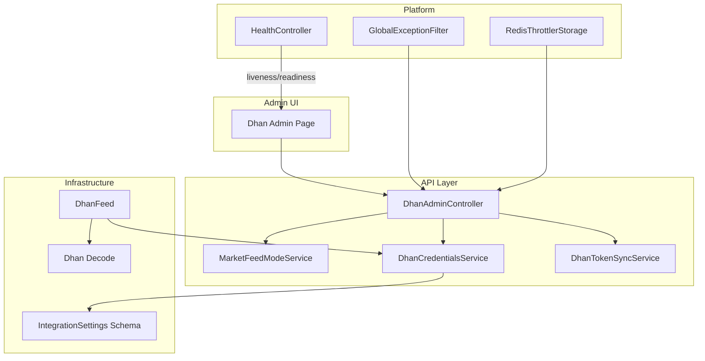
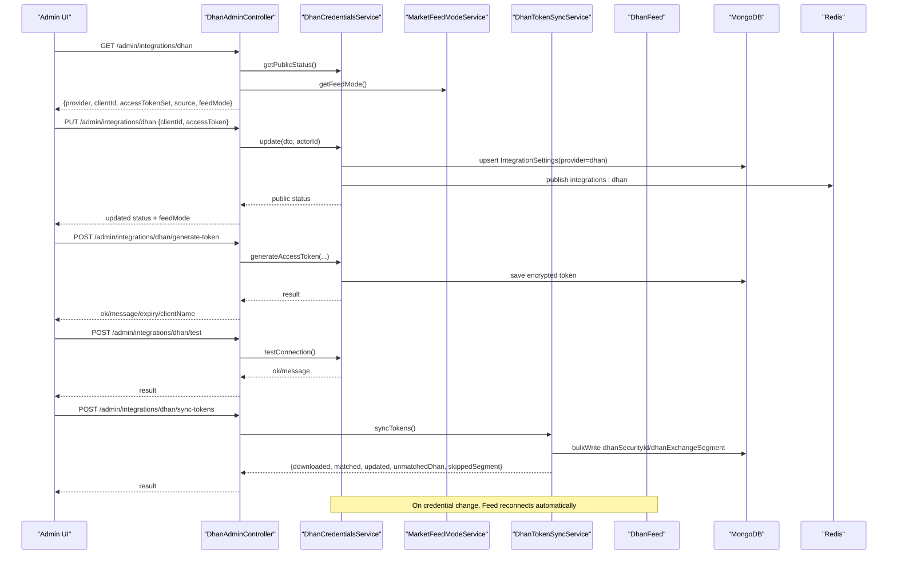
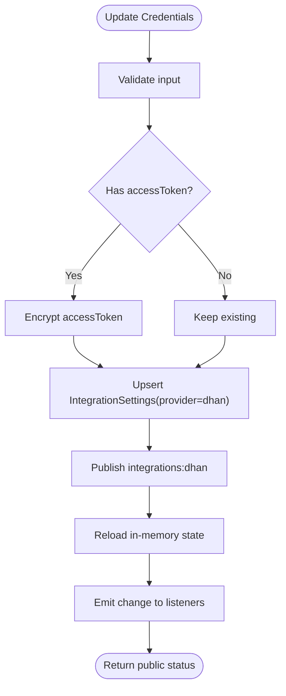
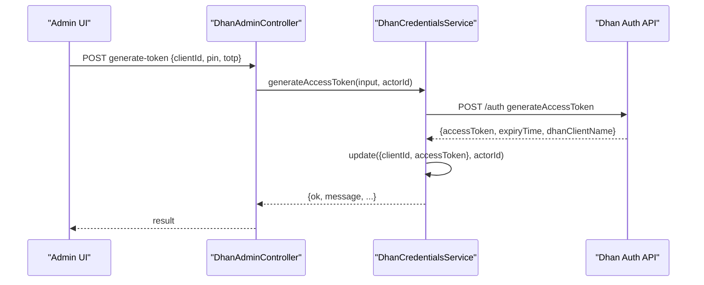
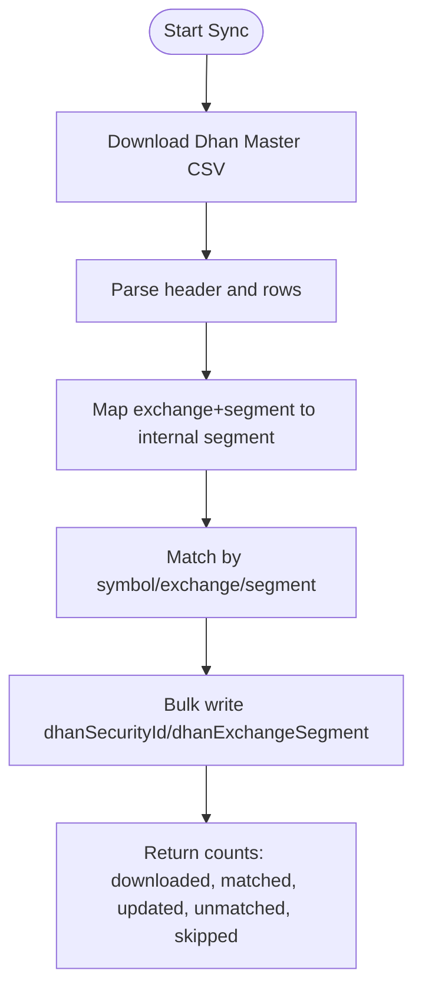
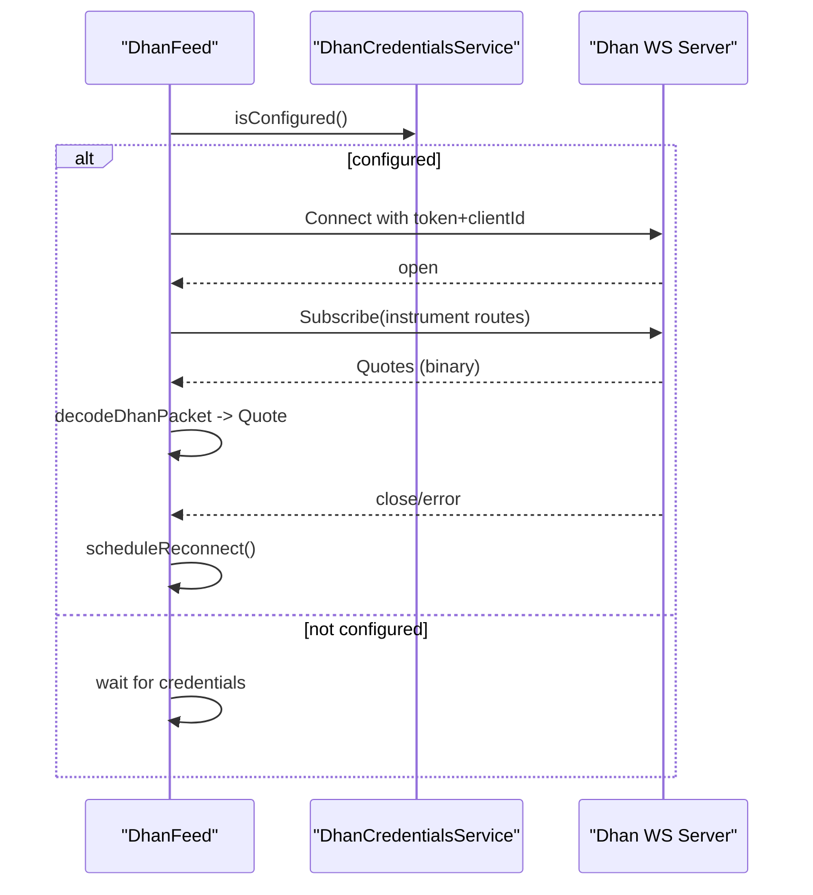
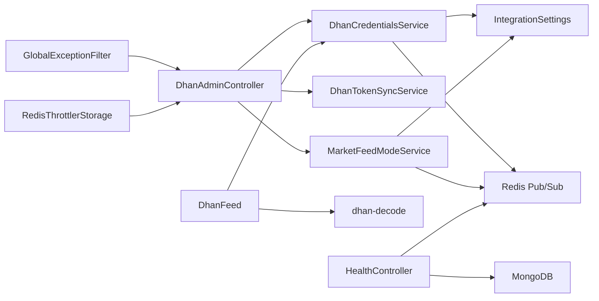

# Admin Configuration & Monitoring

<cite>
**Referenced Files in This Document**
- [dhan-admin.controller.ts](file://backend/apps/api/src/modules/market/presentation/dhan-admin.controller.ts)
- [dhan-credentials.service.ts](file://backend/apps/api/src/modules/market/application/dhan-credentials.service.ts)
- [dhan-feed.ts](file://backend/apps/api/src/modules/market/infrastructure/feed/dhan-feed.ts)
- [dhan-decode.ts](file://backend/apps/api/src/modules/market/infrastructure/feed/dhan-decode.ts)
- [integration-settings.schema.ts](file://backend/apps/api/src/modules/market/infrastructure/schemas/integration-settings.schema.ts)
- [market-feed-mode.service.ts](file://backend/apps/api/src/modules/market/application/market-feed-mode.service.ts)
- [dhan-token-sync.service.ts](file://backend/apps/api/src/modules/market/application/dhan-token-sync.service.ts)
- [webhook.controller.ts](file://backend/apps/api/src/modules/plans/presentation/webhook.controller.ts)
- [env.schema.ts](file://backend/libs/shared/src/config/env.schema.ts)
- [health.controller.ts](file://backend/libs/shared/src/health/health.controller.ts)
- [global-exception.filter.ts](file://backend/libs/shared/src/http/global-exception.filter.ts)
- [redis-throttler.storage.ts](file://backend/libs/shared/src/rate-limit/redis-throttler.storage.ts)
- [market-data.service.ts](file://backend/apps/api/src/modules/market/application/market-data.service.ts)
- [page.tsx](file://frontend/trader/src/app/admin/dhan/page.tsx)
</cite>

## Table of Contents
1. Introduction
2. Project Structure
3. Core Components
4. Architecture Overview
5. Detailed Component Analysis
6. Dependency Analysis
7. Performance Considerations
8. Troubleshooting Guide
9. Conclusion
10. Appendices

## Introduction
This document explains how to configure and monitor the Dhan broker integration via the admin API and UI. It covers managing credentials, testing connectivity, switching feed modes, synchronizing instrument mappings, and monitoring connection health. It also documents logging, alerting, rate limiting, and provides guidance for dashboards and troubleshooting common issues.

## Project Structure
The Dhan integration spans presentation (admin controller), application services (credentials, token sync, feed mode), infrastructure (WebSocket feed, decoding), persistence (MongoDB schema), and shared platform capabilities (health, exceptions, throttling). The frontend admin page orchestrates user actions against these APIs.

**Diagram sources**
- [dhan-admin.controller.ts:38-144](file://backend/apps/api/src/modules/market/presentation/dhan-admin.controller.ts#L38-L144)
- [dhan-credentials.service.ts:56-152](file://backend/apps/api/src/modules/market/application/dhan-credentials.service.ts#L56-L152)
- [market-feed-mode.service.ts:21-99](file://backend/apps/api/src/modules/market/application/market-feed-mode.service.ts#L21-L99)
- [dhan-token-sync.service.ts:31-179](file://backend/apps/api/src/modules/market/application/dhan-token-sync.service.ts#L31-L179)
- [dhan-feed.ts:37-111](file://backend/apps/api/src/modules/market/infrastructure/feed/dhan-feed.ts#L37-L111)
- [dhan-decode.ts:28-77](file://backend/apps/api/src/modules/market/infrastructure/feed/dhan-decode.ts#L28-L77)
- [integration-settings.schema.ts:9-39](file://backend/apps/api/src/modules/market/infrastructure/schemas/integration-settings.schema.ts#L9-L39)
- [health.controller.ts:19-55](file://backend/libs/shared/src/health/health.controller.ts#L19-L55)
- [global-exception.filter.ts:18-91](file://backend/libs/shared/src/http/global-exception.filter.ts#L18-L91)
- [redis-throttler.storage.ts:12-55](file://backend/libs/shared/src/rate-limit/redis-throttler.storage.ts#L12-L55)

**Section sources**
- [dhan-admin.controller.ts:38-144](file://backend/apps/api/src/modules/market/presentation/dhan-admin.controller.ts#L38-L144)
- [dhan-credentials.service.ts:56-152](file://backend/apps/api/src/modules/market/application/dhan-credentials.service.ts#L56-L152)
- [market-feed-mode.service.ts:21-99](file://backend/apps/api/src/modules/market/application/market-feed-mode.service.ts#L21-L99)
- [dhan-token-sync.service.ts:31-179](file://backend/apps/api/src/modules/market/application/dhan-token-sync.service.ts#L31-L179)
- [dhan-feed.ts:37-111](file://backend/apps/api/src/modules/market/infrastructure/feed/dhan-feed.ts#L37-L111)
- [dhan-decode.ts:28-77](file://backend/apps/api/src/modules/market/infrastructure/feed/dhan-decode.ts#L28-L77)
- [integration-settings.schema.ts:9-39](file://backend/apps/api/src/modules/market/infrastructure/schemas/integration-settings.schema.ts#L9-L39)
- [health.controller.ts:19-55](file://backend/libs/shared/src/health/health.controller.ts#L19-L55)
- [global-exception.filter.ts:18-91](file://backend/libs/shared/src/http/global-exception.filter.ts#L18-L91)
- [redis-throttler.storage.ts:12-55](file://backend/libs/shared/src/rate-limit/redis-throttler.storage.ts#L12-L55)

## Core Components
- DhanAdminController: Exposes admin endpoints to get status, update credentials, generate tokens, test connection, and sync instruments.
- DhanCredentialsService: Loads, updates, and persists encrypted credentials; supports environment fallback; broadcasts reloads via Redis.
- MarketFeedModeService: Manages active feed mode (simulator/upstox/angel/dhan) with hot reload across processes.
- DhanTokenSyncService: Downloads Dhan master CSV and maps security IDs to local instruments.
- DhanFeed: WebSocket client that connects, subscribes/unsubscribes, decodes ticks, and reconnects on changes or errors.
- HealthController: Liveness/readiness endpoint checking Mongo and Redis.
- GlobalExceptionFilter: Centralized error envelope and logging.
- RedisThrottlerStorage: Shared rate limiting backed by Redis.

**Section sources**
- [dhan-admin.controller.ts:38-144](file://backend/apps/api/src/modules/market/presentation/dhan-admin.controller.ts#L38-L144)
- [dhan-credentials.service.ts:56-152](file://backend/apps/api/src/modules/market/application/dhan-credentials.service.ts#L56-L152)
- [market-feed-mode.service.ts:21-99](file://backend/apps/api/src/modules/market/application/market-feed-mode.service.ts#L21-L99)
- [dhan-token-sync.service.ts:31-179](file://backend/apps/api/src/modules/market/application/dhan-token-sync.service.ts#L31-L179)
- [dhan-feed.ts:37-111](file://backend/apps/api/src/modules/market/infrastructure/feed/dhan-feed.ts#L37-L111)
- [health.controller.ts:19-55](file://backend/libs/shared/src/health/health.controller.ts#L19-L55)
- [global-exception.filter.ts:18-91](file://backend/libs/shared/src/http/global-exception.filter.ts#L18-L91)
- [redis-throttler.storage.ts:12-55](file://backend/libs/shared/src/rate-limit/redis-throttler.storage.ts#L12-L55)

## Architecture Overview
The admin UI calls protected endpoints under /admin/integrations/dhan. Credentials are stored encrypted in MongoDB and can be overridden by environment variables at boot. Changes are broadcast via Redis so both API and engine reload without restart. The live feed uses a WebSocket to Dhan HQ v2, mapping instruments via database fields or catalog keys.

**Diagram sources**
- [dhan-admin.controller.ts:48-144](file://backend/apps/api/src/modules/market/presentation/dhan-admin.controller.ts#L48-L144)
- [dhan-credentials.service.ts:124-232](file://backend/apps/api/src/modules/market/application/dhan-credentials.service.ts#L124-L232)
- [market-feed-mode.service.ts:61-74](file://backend/apps/api/src/modules/market/application/market-feed-mode.service.ts#L61-L74)
- [dhan-token-sync.service.ts:39-147](file://backend/apps/api/src/modules/market/application/dhan-token-sync.service.ts#L39-L147)
- [dhan-feed.ts:60-77](file://backend/apps/api/src/modules/market/infrastructure/feed/dhan-feed.ts#L60-L77)

## Detailed Component Analysis

### Admin REST API Endpoints
- GET /admin/integrations/dhan
  - Returns provider, clientId, accessTokenSet, accessTokenPreview, source, updatedAt, updatedBy, and current feedMode.
  - Requires employee authentication and instruments.manage permission.
- PUT /admin/integrations/dhan
  - Update clientId and/or accessToken; supports clearing fields. Persists encrypted, publishes Redis invalidation, reloads in-memory state.
  - Audits changes with actor details and IP.
- POST /admin/integrations/dhan/generate-token
  - Calls Dhan auth endpoint with clientId, PIN, TOTP; saves token if successful; audits success.
- POST /admin/integrations/dhan/test
  - Validates access token by fetching profile endpoint; returns ok/message.
- POST /admin/integrations/dhan/sync-tokens
  - Downloads Dhan master CSV, maps to instruments, bulk writes security IDs and segments; audits action.

Example calls (conceptual):
- GET /admin/integrations/dhan
- PUT /admin/integrations/dhan with body { clientId, accessToken }
- POST /admin/integrations/dhan/generate-token with body { clientId, pin, totp }
- POST /admin/integrations/dhan/test with empty body
- POST /admin/integrations/dhan/sync-tokens with empty body

**Section sources**
- [dhan-admin.controller.ts:48-144](file://backend/apps/api/src/modules/market/presentation/dhan-admin.controller.ts#L48-L144)
- [dhan-credentials.service.ts:124-232](file://backend/apps/api/src/modules/market/application/dhan-credentials.service.ts#L124-L232)
- [dhan-token-sync.service.ts:39-147](file://backend/apps/api/src/modules/market/application/dhan-token-sync.service.ts#L39-L147)

### Credential Management and Persistence
- Secrets are AES-GCM encrypted using DATA_ENC_SECRET before storage.
- Runtime precedence: DB row wins over environment variables for secrets; source field indicates origin.
- Hot reload: Updates publish to Redis channel integrations:dhan; subscribers reload credentials and notify listeners.

**Diagram sources**
- [dhan-credentials.service.ts:124-152](file://backend/apps/api/src/modules/market/application/dhan-credentials.service.ts#L124-L152)
- [integration-settings.schema.ts:9-39](file://backend/apps/api/src/modules/market/infrastructure/schemas/integration-settings.schema.ts#L9-L39)

**Section sources**
- [dhan-credentials.service.ts:56-152](file://backend/apps/api/src/modules/market/application/dhan-credentials.service.ts#L56-L152)
- [integration-settings.schema.ts:9-39](file://backend/apps/api/src/modules/market/infrastructure/schemas/integration-settings.schema.ts#L9-L39)

### Token Generation Flow
- Accepts clientId, PIN, TOTP; calls Dhan auth endpoint; on success, saves credentials and returns metadata including expiry and client name.

**Diagram sources**
- [dhan-admin.controller.ts:85-114](file://backend/apps/api/src/modules/market/presentation/dhan-admin.controller.ts#L85-L114)
- [dhan-credentials.service.ts:154-211](file://backend/apps/api/src/modules/market/application/dhan-credentials.service.ts#L154-L211)

**Section sources**
- [dhan-admin.controller.ts:85-114](file://backend/apps/api/src/modules/market/presentation/dhan-admin.controller.ts#L85-L114)
- [dhan-credentials.service.ts:154-211](file://backend/apps/api/src/modules/market/application/dhan-credentials.service.ts#L154-L211)

### Connection Testing
- Tests connectivity by calling Dhan profile endpoint with the stored access token; returns ok/message indicating validity.

**Section sources**
- [dhan-credentials.service.ts:213-232](file://backend/apps/api/src/modules/market/application/dhan-credentials.service.ts#L213-L232)

### Instrument Mapping and Sync
- Downloads Dhan master CSV, parses columns, maps exchange/segment to internal segment enums, matches by trading symbol/exchange/segment heuristics, and bulk-writes dhanSecurityId and dhanExchangeSegment.

**Diagram sources**
- [dhan-token-sync.service.ts:39-147](file://backend/apps/api/src/modules/market/application/dhan-token-sync.service.ts#L39-L147)

**Section sources**
- [dhan-token-sync.service.ts:39-147](file://backend/apps/api/src/modules/market/application/dhan-token-sync.service.ts#L39-L147)

### Live Feed and Real-Time Health
- DhanFeed connects to wss://api-feed.dhan.co with token and clientId from credentials.
- Subscribes/unsubscribes in batches; decodes binary packets to quotes; handles disconnects and reconnects with exponential backoff.
- Reconnects automatically when credentials change.

**Diagram sources**
- [dhan-feed.ts:60-111](file://backend/apps/api/src/modules/market/infrastructure/feed/dhan-feed.ts#L60-L111)
- [dhan-decode.ts:28-77](file://backend/apps/api/src/modules/market/infrastructure/feed/dhan-decode.ts#L28-L77)

**Section sources**
- [dhan-feed.ts:60-111](file://backend/apps/api/src/modules/market/infrastructure/feed/dhan-feed.ts#L60-L111)
- [dhan-decode.ts:28-77](file://backend/apps/api/src/modules/market/infrastructure/feed/dhan-decode.ts#L28-L77)

### Feed Mode Switching
- Active feed mode is persisted and hot-reloaded via Redis; UI allows selecting simulator/upstox/angel/dhan.

**Section sources**
- [market-feed-mode.service.ts:21-99](file://backend/apps/api/src/modules/market/application/market-feed-mode.service.ts#L21-L99)

### Webhooks
- Payment webhooks are handled at /webhooks/payment with signature verification and event routing. Not specific to Dhan but part of the system’s webhook capability.

**Section sources**
- [webhook.controller.ts:13-47](file://backend/apps/api/src/modules/plans/presentation/webhook.controller.ts#L13-L47)

## Dependency Analysis
- DhanAdminController depends on DhanCredentialsService, DhanTokenSyncService, MarketFeedModeService, and AuditService.
- DhanCredentialsService depends on IntegrationSettings model, ConfigService, Redis client/subscriber, and crypto utilities.
- DhanFeed depends on DhanCredentialsService and Instrument model; uses dhan-decode utilities.
- MarketFeedModeService depends on IntegrationSettings model, ConfigService, and Redis pub/sub.
- HealthController depends on Mongo and Redis clients.
- GlobalExceptionFilter centralizes error responses and logging.
- RedisThrottlerStorage provides shared rate limiting.

**Diagram sources**
- [dhan-admin.controller.ts:38-144](file://backend/apps/api/src/modules/market/presentation/dhan-admin.controller.ts#L38-L144)
- [dhan-credentials.service.ts:56-152](file://backend/apps/api/src/modules/market/application/dhan-credentials.service.ts#L56-L152)
- [dhan-feed.ts:37-111](file://backend/apps/api/src/modules/market/infrastructure/feed/dhan-feed.ts#L37-L111)
- [market-feed-mode.service.ts:21-99](file://backend/apps/api/src/modules/market/application/market-feed-mode.service.ts#L21-L99)
- [health.controller.ts:19-55](file://backend/libs/shared/src/health/health.controller.ts#L19-L55)
- [global-exception.filter.ts:18-91](file://backend/libs/shared/src/http/global-exception.filter.ts#L18-L91)
- [redis-throttler.storage.ts:12-55](file://backend/libs/shared/src/rate-limit/redis-throttler.storage.ts#L12-L55)

**Section sources**
- [dhan-admin.controller.ts:38-144](file://backend/apps/api/src/modules/market/presentation/dhan-admin.controller.ts#L38-L144)
- [dhan-credentials.service.ts:56-152](file://backend/apps/api/src/modules/market/application/dhan-credentials.service.ts#L56-L152)
- [dhan-feed.ts:37-111](file://backend/apps/api/src/modules/market/infrastructure/feed/dhan-feed.ts#L37-L111)
- [market-feed-mode.service.ts:21-99](file://backend/apps/api/src/modules/market/application/market-feed-mode.service.ts#L21-L99)
- [health.controller.ts:19-55](file://backend/libs/shared/src/health/health.controller.ts#L19-L55)
- [global-exception.filter.ts:18-91](file://backend/libs/shared/src/http/global-exception.filter.ts#L18-L91)
- [redis-throttler.storage.ts:12-55](file://backend/libs/shared/src/rate-limit/redis-throttler.storage.ts#L12-L55)

## Performance Considerations
- Batch subscriptions and unsubscriptions to reduce overhead.
- Use bulk writes for instrument mapping to minimize DB round-trips.
- Exponential backoff for reconnection prevents thundering herds.
- Redis-backed throttling ensures consistent limits across instances.
- Stale feed detection triggers resubscription during market hours.

[No sources needed since this section provides general guidance]

## Troubleshooting Guide
Common issues and resolutions:
- Missing credentials: Ensure both clientId and accessToken are set; use generate-token flow or manual update.
- Invalid token: Use test endpoint to validate; check network access to Dhan endpoints.
- No ticks during market hours: Check stale feed threshold and ensure tracked keys exist; feed will auto-resubscribe.
- Rate limiting: Inspect throttle responses; adjust limits or back off; verify Redis availability.
- Environment vs DB precedence: Source field indicates where credentials originate; prefer DB for runtime updates.
- Health checks: Monitor /health for dependency status; investigate Mongo/Redis connectivity if down.

Operational tips:
- Use audit logs to trace who changed credentials and when.
- Keep feed mode aligned with available credentials to avoid wasted connections.
- Periodically run token sync to keep instrument mappings current.

**Section sources**
- [dhan-credentials.service.ts:100-122](file://backend/apps/api/src/modules/market/application/dhan-credentials.service.ts#L100-L122)
- [market-data.service.ts:128-138](file://backend/apps/api/src/modules/market/application/market-data.service.ts#L128-L138)
- [health.controller.ts:19-55](file://backend/libs/shared/src/health/health.controller.ts#L19-L55)
- [global-exception.filter.ts:18-91](file://backend/libs/shared/src/http/global-exception.filter.ts#L18-L91)
- [redis-throttler.storage.ts:12-55](file://backend/libs/shared/src/rate-limit/redis-throttler.storage.ts#L12-L55)

## Conclusion
The Dhan integration provides a robust admin workflow to manage credentials, test connectivity, synchronize instruments, and switch feed modes with hot reload. The live feed maintains resilient connections and real-time data flow. Platform features like centralized error handling, health checks, and throttling support reliable operations. Use the admin UI and APIs to configure and monitor effectively, and leverage logging and alerts to maintain service health.

[No sources needed since this section summarizes without analyzing specific files]

## Appendices

### Admin Interface Features
- Configure Client ID and Access Token; optionally clear fields.
- Generate Access Token using Client ID, PIN, and TOTP.
- Test Connection to validate credentials.
- Sync Tokens to map Dhan scrips to local instruments.
- Select Feed Mode (simulator/upstox/angel/dhan) shared across providers.

**Section sources**
- [page.tsx:18-148](file://frontend/trader/src/app/admin/dhan/page.tsx#L18-L148)

### Environment Variables
- DHAN_CLIENT_ID and DHAN_ACCESS_TOKEN are optional boot-time fallbacks; runtime updates via admin take precedence.

**Section sources**
- [env.schema.ts:53-55](file://backend/libs/shared/src/config/env.schema.ts#L53-L55)

### Example Admin API Calls
- GET /admin/integrations/dhan
- PUT /admin/integrations/dhan with { clientId?, accessToken? }
- POST /admin/integrations/dhan/generate-token with { clientId, pin, totp }
- POST /admin/integrations/dhan/test with {}
- POST /admin/integrations/dhan/sync-tokens with {}

**Section sources**
- [dhan-admin.controller.ts:48-144](file://backend/apps/api/src/modules/market/presentation/dhan-admin.controller.ts#L48-L144)

### Best Practices
- Prefer runtime updates via admin for secrets; use environment only for initial setup.
- Always run token sync after enabling Dhan feed mode to populate mappings.
- Monitor /health and logs for dependency health and feed staleness.
- Use permissions guards to restrict admin actions to authorized employees.

**Section sources**
- [dhan-credentials.service.ts:56-152](file://backend/apps/api/src/modules/market/application/dhan-credentials.service.ts#L56-L152)
- [dhan-token-sync.service.ts:39-147](file://backend/apps/api/src/modules/market/application/dhan-token-sync.service.ts#L39-L147)
- [health.controller.ts:19-55](file://backend/libs/shared/src/health/health.controller.ts#L19-L55)
- [dhan-admin.controller.ts:38-46](file://backend/apps/api/src/modules/market/presentation/dhan-admin.controller.ts#L38-L46)