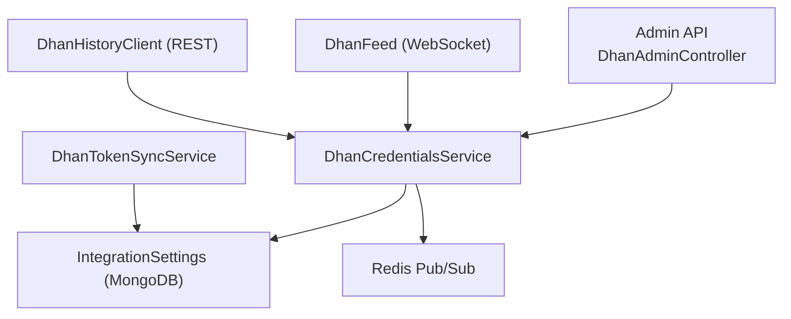
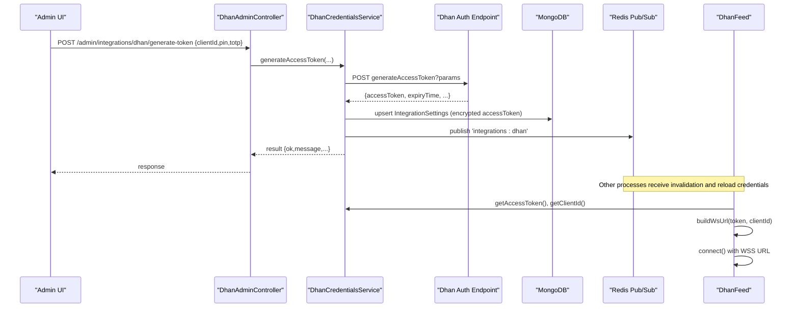
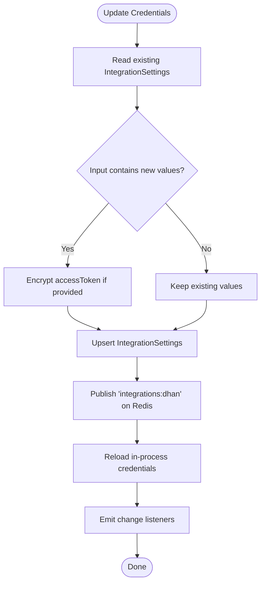
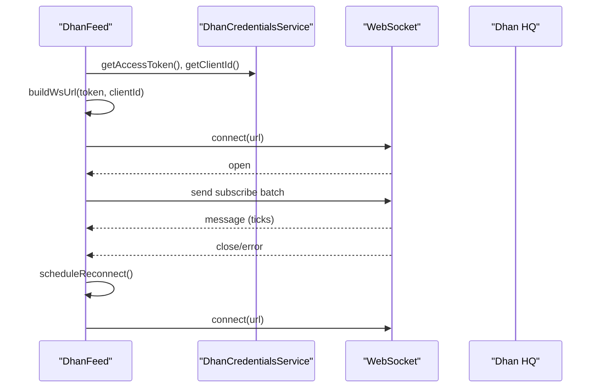
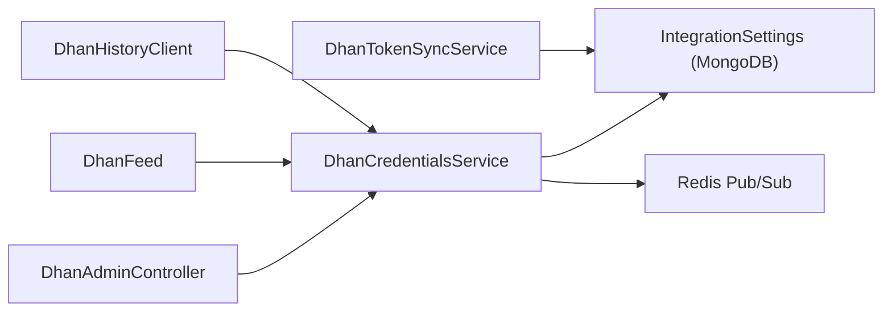

# Dhan Authentication & Session Management

<cite>
**Referenced Files in This Document**
- [dhan-credentials.service.ts](file://backend/apps/api/src/modules/market/application/dhan-credentials.service.ts)
- [dhan-feed.ts](file://backend/apps/api/src/modules/market/infrastructure/feed/dhan-feed.ts)
- [dhan-history.client.ts](file://backend/apps/api/src/modules/market/infrastructure/dhan-history.client.ts)
- [integration-settings.schema.ts](file://backend/apps/api/src/modules/market/infrastructure/schemas/integration-settings.schema.ts)
- [crypto.util.ts](file://backend/apps/api/src/modules/auth/infrastructure/crypto.util.ts)
- [dhan-admin.controller.ts](file://backend/apps/api/src/modules/market/presentation/dhan-admin.controller.ts)
- [dhan-csv.util.ts](file://backend/apps/api/src/modules/market/infrastructure/dhan-csv.util.ts)
</cite>

## Table of Contents
1. Introduction
2. Project Structure
3. Core Components
4. Architecture Overview
5. Detailed Component Analysis
6. Dependency Analysis
7. Performance Considerations
8. Troubleshooting Guide
9. Conclusion

## Introduction
This document explains how the system authenticates with Dhan, manages sessions, and maintains live market data connectivity. It covers:
- OAuth-like token generation using client ID, PIN, and TOTP
- Secure storage and runtime resolution of credentials (database vs environment variables)
- WebSocket URL construction with authentication parameters
- Automatic reconnection strategies for the Dhan feed
- Token lifecycle management, including refresh via admin actions and connection testing
- Security considerations for credential storage and token handling
- Configuration examples and troubleshooting steps

## Project Structure
The Dhan integration spans application services, infrastructure clients, and admin APIs:
- Application layer: credential management and token sync utilities
- Infrastructure layer: WebSocket feed, REST history client, CSV mapping utilities
- Presentation layer: admin endpoints to configure credentials and test connections
- Shared security: encryption utilities for secrets at rest

**Diagram sources**
- [dhan-admin.controller.ts:38-144](file://backend/apps/api/src/modules/market/presentation/dhan-admin.controller.ts#L38-L144)
- [dhan-credentials.service.ts:56-151](file://backend/apps/api/src/modules/market/application/dhan-credentials.service.ts#L56-L151)
- [dhan-feed.ts:37-77](file://backend/apps/api/src/modules/market/infrastructure/feed/dhan-feed.ts#L37-L77)
- [dhan-history.client.ts:31-48](file://backend/apps/api/src/modules/market/infrastructure/dhan-history.client.ts#L31-L48)
- [integration-settings.schema.ts:9-37](file://backend/apps/api/src/modules/market/infrastructure/schemas/integration-settings.schema.ts#L9-L37)

**Section sources**
- [dhan-admin.controller.ts:38-144](file://backend/apps/api/src/modules/market/presentation/dhan-admin.controller.ts#L38-L144)
- [dhan-credentials.service.ts:56-151](file://backend/apps/api/src/modules/market/application/dhan-credentials.service.ts#L56-L151)
- [dhan-feed.ts:37-77](file://backend/apps/api/src/modules/market/infrastructure/feed/dhan-feed.ts#L37-L77)
- [dhan-history.client.ts:31-48](file://backend/apps/api/src/modules/market/infrastructure/dhan-history.client.ts#L31-L48)
- [integration-settings.schema.ts:9-37](file://backend/apps/api/src/modules/market/infrastructure/schemas/integration-settings.schema.ts#L9-L37)

## Core Components
- DhanCredentialsService: Loads, updates, and exposes Dhan credentials; generates tokens via Dhan’s endpoint; persists encrypted access tokens; broadcasts changes via Redis so other processes reload without restarts.
- DhanFeed: Manages the Dhan WebSocket connection, builds authenticated URLs, handles subscribe/unsubscribe, and reconnects on errors or disconnects.
- DhanHistoryClient: Fetches historical/intraday candles using the current access token and optional client ID header.
- DhanTokenSyncService: Downloads Dhan’s instrument master CSV and maps it into local instruments for routing market data.
- IntegrationSettings schema: Stores provider-specific secrets (encrypted) and metadata.
- Crypto utilities: AES-GCM encryption/decryption for sensitive fields at rest.

Key responsibilities:
- Credential source priority: database (encrypted) wins over environment variables when present.
- Real-time propagation: Redis pub/sub triggers reload across instances.
- Connection resilience: exponential backoff reconnection for WebSocket.
- Auditability: admin actions are recorded with actor context.

**Section sources**
- [dhan-credentials.service.ts:56-280](file://backend/apps/api/src/modules/market/application/dhan-credentials.service.ts#L56-L280)
- [dhan-feed.ts:37-279](file://backend/apps/api/src/modules/market/infrastructure/feed/dhan-feed.ts#L37-L279)
- [dhan-history.client.ts:31-146](file://backend/apps/api/src/modules/market/infrastructure/dhan-history.client.ts#L31-L146)
- [dhan-token-sync.service.ts:31-179](file://backend/apps/api/src/modules/market/application/dhan-token-sync.service.ts#L31-L179)
- [integration-settings.schema.ts:9-37](file://backend/apps/api/src/modules/market/infrastructure/schemas/integration-settings.schema.ts#L9-L37)
- [crypto.util.ts:9-24](file://backend/apps/api/src/modules/auth/infrastructure/crypto.util.ts#L9-L24)

## Architecture Overview
The authentication and session flow integrates admin configuration, secure storage, and live connectivity:

**Diagram sources**
- [dhan-admin.controller.ts:85-114](file://backend/apps/api/src/modules/market/presentation/dhan-admin.controller.ts#L85-L114)
- [dhan-credentials.service.ts:154-211](file://backend/apps/api/src/modules/market/application/dhan-credentials.service.ts#L154-L211)
- [dhan-credentials.service.ts:124-151](file://backend/apps/api/src/modules/market/application/dhan-credentials.service.ts#L124-L151)
- [dhan-feed.ts:85-111](file://backend/apps/api/src/modules/market/infrastructure/feed/dhan-feed.ts#L85-L111)

## Detailed Component Analysis

### DhanCredentialsService
Responsibilities:
- Load credentials from database (encrypted) and environment fallback
- Generate access tokens via Dhan’s auth endpoint
- Persist encrypted access tokens and client ID
- Broadcast changes via Redis to trigger reloads
- Expose public status and test connection

Credential resolution logic:
- On module init, load from DB and set env fallbacks
- Reload on Redis message to propagate config changes
- Priority: DB row (if present) overrides env vars; mixed state is reported

Token generation:
- Validates required inputs (client ID, PIN, TOTP)
- Calls Dhan’s generateAccessToken endpoint
- Saves returned token and client ID if successful

Connection testing:
- Uses profile endpoint to validate current access token

Security:
- Secrets stored encrypted using AES-GCM with a derived key
- Public status masks access tokens

**Diagram sources**
- [dhan-credentials.service.ts:124-151](file://backend/apps/api/src/modules/market/application/dhan-credentials.service.ts#L124-L151)
- [crypto.util.ts:9-24](file://backend/apps/api/src/modules/auth/infrastructure/crypto.util.ts#L9-L24)

**Section sources**
- [dhan-credentials.service.ts:56-280](file://backend/apps/api/src/modules/market/application/dhan-credentials.service.ts#L56-L280)
- [crypto.util.ts:9-24](file://backend/apps/api/src/modules/auth/infrastructure/crypto.util.ts#L9-L24)

### DhanFeed (WebSocket)
Responsibilities:
- Build authenticated WebSocket URL with token and clientId
- Connect, handle messages, and manage subscriptions
- Reconnect with exponential backoff on close/error/disconnect
- Rebuild routes and resubscribe after reconnect or credential changes

Authentication parameters:
- URL includes version, token, clientId, and authType query parameters
- Token and clientId are encoded before inclusion

Reconnection strategy:
- On close or error, schedule reconnect with doubling delay capped at a maximum
- On server-initiated disconnect packet, force reconnect
- On credential changes, close existing socket and reconnect if configured

Subscription handling:
- Resolves instrument keys to exchange segment and security ID
- Batches subscribe/unsubscribe requests

**Diagram sources**
- [dhan-feed.ts:85-111](file://backend/apps/api/src/modules/market/infrastructure/feed/dhan-feed.ts#L85-L111)
- [dhan-feed.ts:142-148](file://backend/apps/api/src/modules/market/infrastructure/feed/dhan-feed.ts#L142-L148)
- [dhan-feed.ts:190-196](file://backend/apps/api/src/modules/market/infrastructure/feed/dhan-feed.ts#L190-L196)

**Section sources**
- [dhan-feed.ts:37-279](file://backend/apps/api/src/modules/market/infrastructure/feed/dhan-feed.ts#L37-L279)

### DhanHistoryClient (REST)
Responsibilities:
- Fetch daily and intraday candle data using current access token
- Chunk large intraday ranges to respect API limits
- Map instrument segments to Dhan’s instrument enum
- Include client-id header when available

Authentication:
- Uses access token in request headers
- Optionally includes client-id header based on current credentials

Error handling:
- Logs warnings for chunk failures but continues processing
- Throws descriptive errors for non-OK responses

**Section sources**
- [dhan-history.client.ts:31-146](file://backend/apps/api/src/modules/market/infrastructure/dhan-history.client.ts#L31-L146)
- [dhan-history.client.ts:185-232](file://backend/apps/api/src/modules/market/infrastructure/dhan-history.client.ts#L185-L232)

### DhanTokenSyncService
Responsibilities:
- Download Dhan’s instrument master CSV
- Map exchange and segment to canonical values
- Match against local instruments by symbol and segment heuristics
- Bulk update instruments with Dhan security IDs and segments

Notes:
- Skips unsupported segments (e.g., certain BSE segments)
- Provides metrics for downloaded, matched, updated, unmatched, and skipped counts

**Section sources**
- [dhan-token-sync.service.ts:31-179](file://backend/apps/api/src/modules/market/application/dhan-token-sync.service.ts#L31-L179)
- [dhan-csv.util.ts:1-54](file://backend/apps/api/src/modules/market/infrastructure/dhan-csv.util.ts#L1-L54)

### Admin API (DhanAdminController)
Endpoints:
- GET status: returns public credential status and feed mode
- PUT update: saves client ID and/or access token (encrypted), triggers reload
- POST generate-token: calls Dhan auth endpoint and persists result
- POST test: validates current access token via profile endpoint
- POST sync-tokens: runs instrument master sync and audits action

Security and audit:
- Protected by JWT and permissions guards
- Records actor, IP, and before/after state for changes

**Section sources**
- [dhan-admin.controller.ts:38-144](file://backend/apps/api/src/modules/market/presentation/dhan-admin.controller.ts#L38-L144)

## Dependency Analysis
Component relationships and coupling:
- DhanCredentialsService depends on MongoDB (IntegrationSettings), ConfigService, and Redis for pub/sub
- DhanFeed depends on DhanCredentialsService and Instrument model for route resolution
- DhanHistoryClient depends on DhanCredentialsService for token and client ID
- DhanTokenSyncService depends on Instrument model and CSV utilities
- Admin controller orchestrates user actions and audits

External integrations:
- Dhan Auth endpoint for token generation
- DHQ WebSocket for live market data
- Dhan REST APIs for historical/intraday charts
- Dhan instrument master CSV for catalog mapping

Potential circular dependencies:
- None observed; dependencies are layered (presentation → application → infrastructure)

**Diagram sources**
- [dhan-admin.controller.ts:38-144](file://backend/apps/api/src/modules/market/presentation/dhan-admin.controller.ts#L38-L144)
- [dhan-credentials.service.ts:56-151](file://backend/apps/api/src/modules/market/application/dhan-credentials.service.ts#L56-L151)
- [dhan-feed.ts:37-77](file://backend/apps/api/src/modules/market/infrastructure/feed/dhan-feed.ts#L37-L77)
- [dhan-history.client.ts:31-48](file://backend/apps/api/src/modules/market/infrastructure/dhan-history.client.ts#L31-L48)
- [dhan-token-sync.service.ts:31-47](file://backend/apps/api/src/modules/market/application/dhan-token-sync.service.ts#L31-L47)

**Section sources**
- [dhan-admin.controller.ts:38-144](file://backend/apps/api/src/modules/market/presentation/dhan-admin.controller.ts#L38-L144)
- [dhan-credentials.service.ts:56-151](file://backend/apps/api/src/modules/market/application/dhan-credentials.service.ts#L56-L151)
- [dhan-feed.ts:37-77](file://backend/apps/api/src/modules/market/infrastructure/feed/dhan-feed.ts#L37-L77)
- [dhan-history.client.ts:31-48](file://backend/apps/api/src/modules/market/infrastructure/dhan-history.client.ts#L31-L48)
- [dhan-token-sync.service.ts:31-47](file://backend/apps/api/src/modules/market/application/dhan-token-sync.service.ts#L31-L47)

## Performance Considerations
- WebSocket reconnection uses exponential backoff capped at a reasonable interval to avoid thundering herds.
- Subscribe/unsubscribe operations are batched to reduce network overhead.
- Historical chart fetching chunks intraday ranges to comply with API limits and avoids excessive single-request sizes.
- Bulk writes are used when syncing instrument mappings to minimize database round-trips.
- Redis pub/sub enables zero-downtime credential reloads across multiple instances.

[No sources needed since this section provides general guidance]

## Troubleshooting Guide
Common issues and resolutions:
- Missing credentials: Ensure both client ID and access token are configured; use the status endpoint to verify source and masked token preview.
- Invalid token: Use the test endpoint to validate the current access token against Dhan’s profile endpoint.
- WebSocket not connecting: Check that credentials are configured and the feed is started; logs will indicate missing credentials or connection errors.
- Repeated disconnections: Inspect logs for disconnect packets; ensure network access to Dhan HQ and correct token/client ID.
- Instrument mapping gaps: Run the sync-tokens endpoint to map local instruments to Dhan security IDs and segments; check unmatched counts.

Configuration examples:
- Environment variables:
  - DHAN_CLIENT_ID: your Dhan client identifier
  - DHAN_ACCESS_TOKEN: temporary or persisted access token (optional if generated via admin)
- Admin API usage:
  - Update credentials: PUT /admin/integrations/dhan with clientId and/or accessToken
  - Generate token: POST /admin/integrations/dhan/generate-token with clientId, pin, totp
  - Test connection: POST /admin/integrations/dhan/test
  - Sync instruments: POST /admin/integrations/dhan/sync-tokens

Security considerations:
- Access tokens are encrypted at rest using AES-GCM with a derived key from DATA_ENC_SECRET.
- Public status masks access tokens to prevent accidental exposure.
- All admin actions are audited with actor identity and IP address.
- Prefer generating tokens via admin rather than storing plaintext tokens in environment variables.

**Section sources**
- [dhan-admin.controller.ts:48-144](file://backend/apps/api/src/modules/market/presentation/dhan-admin.controller.ts#L48-L144)
- [dhan-credentials.service.ts:100-122](file://backend/apps/api/src/modules/market/application/dhan-credentials.service.ts#L100-L122)
- [dhan-credentials.service.ts:213-232](file://backend/apps/api/src/modules/market/application/dhan-credentials.service.ts#L213-L232)
- [crypto.util.ts:9-24](file://backend/apps/api/src/modules/auth/infrastructure/crypto.util.ts#L9-L24)

## Conclusion
The Dhan integration implements a robust authentication and session management approach:
- Secure credential storage with encryption and environment fallback
- Centralized token generation and persistence via admin APIs
- Live WebSocket connectivity with resilient reconnection and automatic resubscription
- Comprehensive instrument mapping to support accurate market data routing
- Strong auditing and visibility into configuration state and changes

For ongoing reliability:
- Monitor connection health and reconnection logs
- Periodically regenerate tokens as needed and validate via test endpoint
- Keep instrument mappings synchronized to ensure complete coverage

[No sources needed since this section summarizes without analyzing specific files]