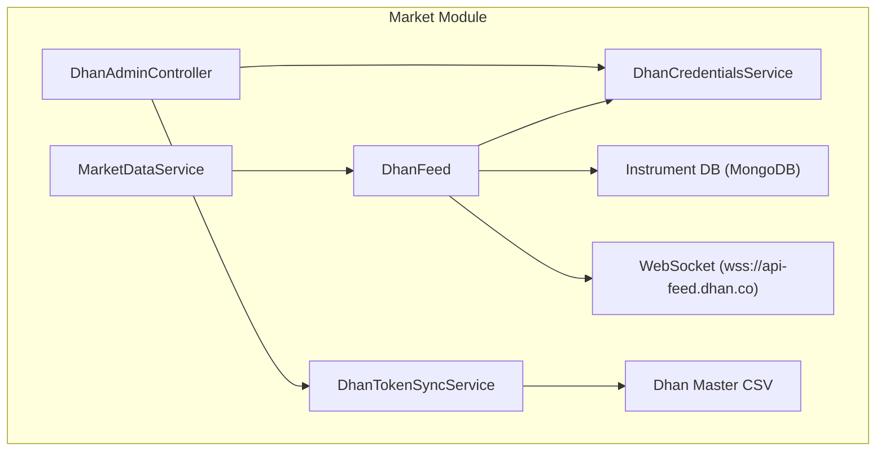
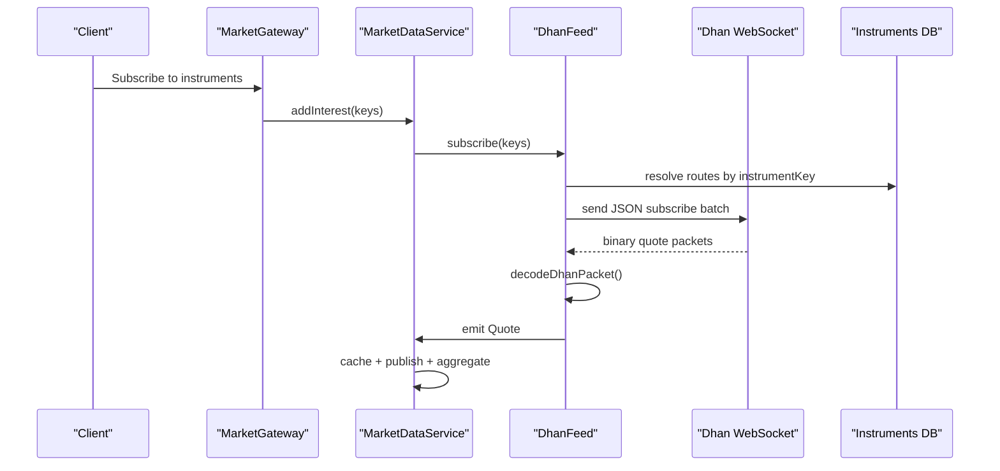
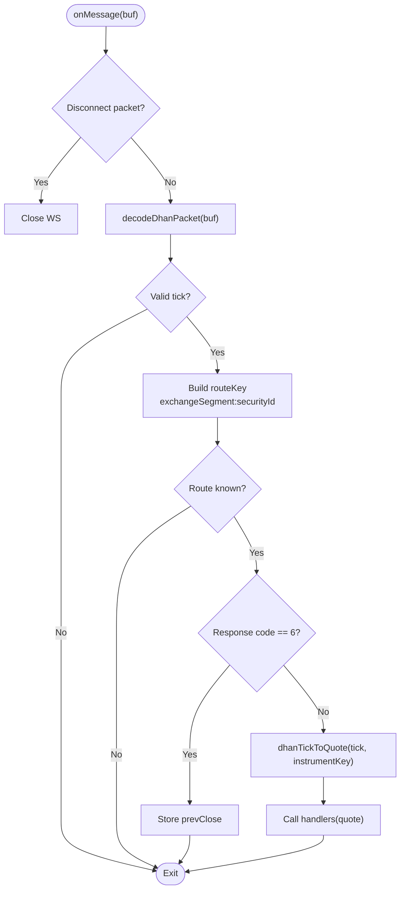
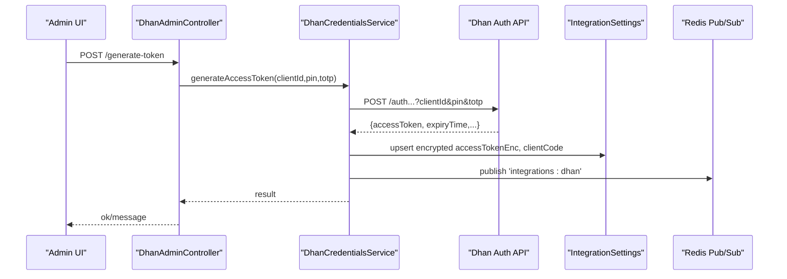
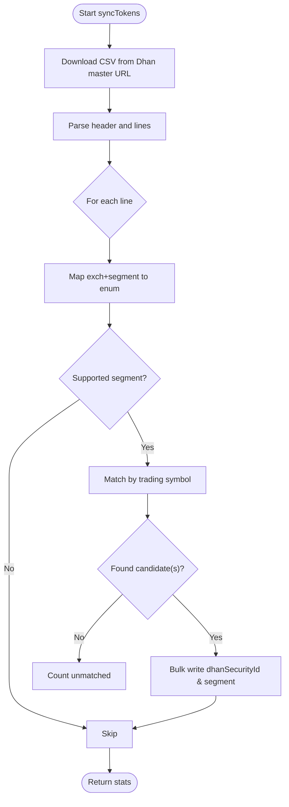
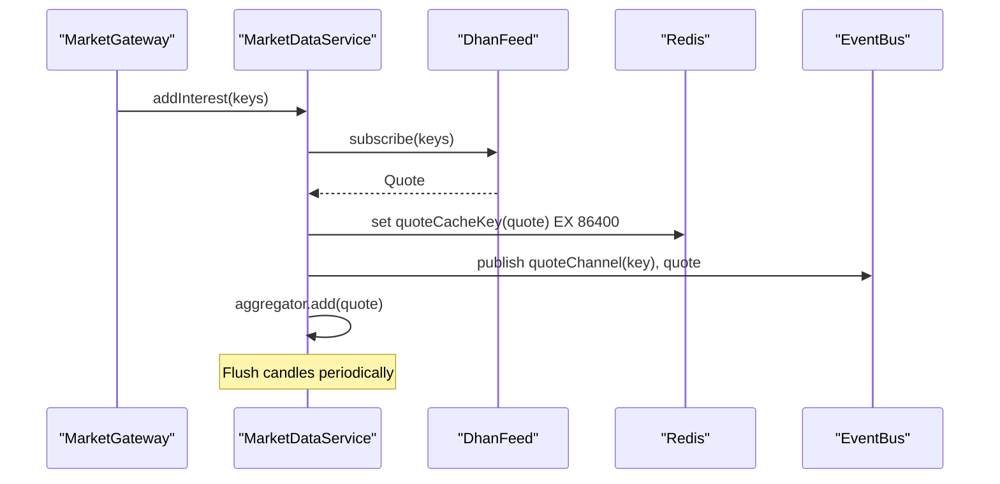
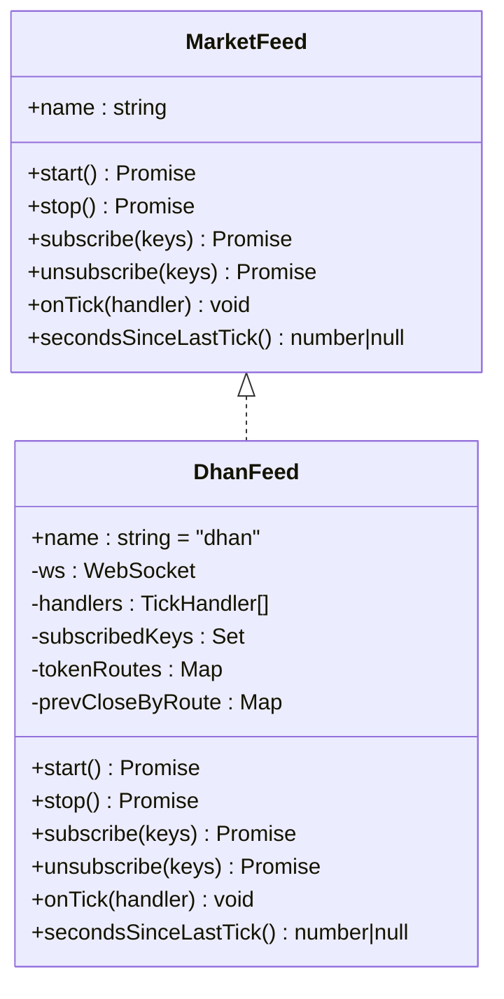
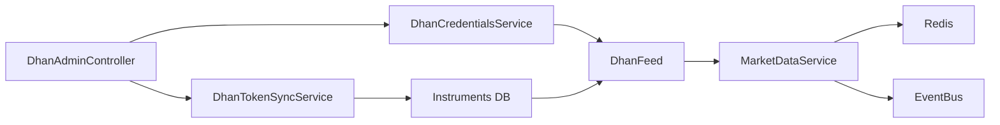

# Dhan Broker Integration

<cite>
**Referenced Files in This Document**
- [dhan-feed.ts](file://backend/apps/api/src/modules/market/infrastructure/feed/dhan-feed.ts)
- [dhan-decode.ts](file://backend/apps/api/src/modules/market/infrastructure/feed/dhan-decode.ts)
- [dhan-credentials.service.ts](file://backend/apps/api/src/modules/market/application/dhan-credentials.service.ts)
- [dhan-token-sync.service.ts](file://backend/apps/api/src/modules/market/application/dhan-token-sync.service.ts)
- [dhan-admin.controller.ts](file://backend/apps/api/src/modules/market/presentation/dhan-admin.controller.ts)
- [market-data.service.ts](file://backend/apps/api/src/modules/market/application/market-data.service.ts)
- [market-feed.port.ts](file://backend/apps/api/src/modules/market/infrastructure/feed/market-feed.port.ts)
- [dhan-csv.util.ts](file://backend/apps/api/src/modules/market/infrastructure/dhan-csv.util.ts)
- [dhan-instrument-mapper.ts](file://backend/apps/api/src/modules/market/infrastructure/dhan-instrument-mapper.ts)
- [MarketDataFeed.proto](file://backend/apps/api/src/modules/market/infrastructure/feed/MarketDataFeed.proto)
- [MarketDataFeedV3.proto](file://backend/apps/api/src/modules/market/infrastructure/feed/MarketDataFeedV3.proto)
</cite>

## Table of Contents
1. [Introduction](#introduction)
2. [Project Structure](#project-structure)
3. [Core Components](#core-components)
4. [Architecture Overview](#architecture-overview)
5. [Detailed Component Analysis](#detailed-component-analysis)
6. [Dependency Analysis](#dependency-analysis)
7. [Performance Considerations](#performance-considerations)
8. [Troubleshooting Guide](#troubleshooting-guide)
9. [Conclusion](#conclusion)
10. [Appendices](#appendices)

## Introduction
This document explains the Dhan broker integration for real-time market data. It focuses on the DhanFeed class that connects to Dhan’s WebSocket feed, decodes binary quote packets, maps instruments, and emits normalized quotes into the system. It also covers authentication via API credentials, token lifecycle management, instrument mapping from Dhan’s master CSV, subscription management for multiple instruments, connection monitoring with automatic reconnection and state restoration, admin configuration endpoints, and guidance for testing and debugging.

## Project Structure
The Dhan integration is implemented under the market module:
- Feed adapter: DhanFeed implements a common MarketFeed interface to abstract upstream market data sources.
- Decoding utilities: Binary packet decoding and transformation to internal Quote objects.
- Credentials service: Secure storage and hot-reload of client ID and access token.
- Token sync service: Downloads and maps Dhan’s instrument master CSV to local instruments.
- Admin controller: Exposes endpoints to configure credentials, generate tokens, test connectivity, and sync instruments.
- Market data pipeline: Orchestrates subscriptions, caching, event bus publishing, candle aggregation, and stale-feed detection.

**Diagram sources**
- [dhan-feed.ts:37-111](file://backend/apps/api/src/modules/market/infrastructure/feed/dhan-feed.ts#L37-L111)
- [dhan-credentials.service.ts:57-122](file://backend/apps/api/src/modules/market/application/dhan-credentials.service.ts#L57-L122)
- [dhan-token-sync.service.ts:31-47](file://backend/apps/api/src/modules/market/application/dhan-token-sync.service.ts#L31-L47)
- [dhan-admin.controller.ts:38-144](file://backend/apps/api/src/modules/market/presentation/dhan-admin.controller.ts#L38-L144)
- [market-data.service.ts:24-52](file://backend/apps/api/src/modules/market/application/market-data.service.ts#L24-L52)

**Section sources**
- [dhan-feed.ts:37-111](file://backend/apps/api/src/modules/market/infrastructure/feed/dhan-feed.ts#L37-L111)
- [market-data.service.ts:24-52](file://backend/apps/api/src/modules/market/application/market-data.service.ts#L24-L52)
- [dhan-admin.controller.ts:38-144](file://backend/apps/api/src/modules/market/presentation/dhan-admin.controller.ts#L38-L144)

## Core Components
- DhanFeed: Manages WebSocket lifecycle, subscribes/unsubscribes to instruments, decodes incoming packets, and emits normalized quotes. Implements backoff-based reconnection and preserves subscription state across reconnects.
- DhanCredentialsService: Loads encrypted access tokens and client IDs from database with environment fallback, supports token generation flow, and broadcasts changes via Redis for live reload.
- DhanTokenSyncService: Downloads Dhan’s scrip master CSV, maps exchange segments, and updates instruments with securityId and exchange segment mappings.
- MarketDataService: Owns the single MarketFeed instance, manages per-instrument interest counts, publishes quotes to Redis and event bus, aggregates candles, and monitors feed health.
- DhanAdminController: Provides admin APIs to update credentials, generate tokens, test connection, and run token sync.

**Section sources**
- [dhan-feed.ts:37-279](file://backend/apps/api/src/modules/market/infrastructure/feed/dhan-feed.ts#L37-L279)
- [dhan-credentials.service.ts:57-282](file://backend/apps/api/src/modules/market/application/dhan-credentials.service.ts#L57-L282)
- [dhan-token-sync.service.ts:31-179](file://backend/apps/api/src/modules/market/application/dhan-token-sync.service.ts#L31-L179)
- [market-data.service.ts:24-139](file://backend/apps/api/src/modules/market/application/market-data.service.ts#L24-L139)
- [dhan-admin.controller.ts:38-144](file://backend/apps/api/src/modules/market/presentation/dhan-admin.controller.ts#L38-L144)

## Architecture Overview
The architecture follows an adapter pattern where DhanFeed implements a common MarketFeed interface. The MarketDataService coordinates subscriptions and downstream processing. Credentials are managed centrally and can be updated at runtime without restarts.

**Diagram sources**
- [market-data.service.ts:61-108](file://backend/apps/api/src/modules/market/application/market-data.service.ts#L61-L108)
- [dhan-feed.ts:150-224](file://backend/apps/api/src/modules/market/infrastructure/feed/dhan-feed.ts#L150-L224)
- [dhan-decode.ts:28-71](file://backend/apps/api/src/modules/market/infrastructure/feed/dhan-decode.ts#L28-L71)

## Detailed Component Analysis

### DhanFeed: WebSocket, Subscription, Reconnection, and Quote Transformation
- Authentication: Builds WebSocket URL with access token and client ID from credentials; uses authType=2.
- Connection lifecycle: Handles open, message, close, error, ping events; schedules exponential backoff reconnection up to a cap.
- Instrument mapping: Resolves instrument keys to exchangeSegment and securityId using DB fields or DHAN|segment|securityId keys.
- Subscription batching: Sends subscribe/unsubscribe requests in batches of 100.
- Message handling: Detects disconnect packets, decodes binary quotes, maintains prevClose per route, and emits normalized Quote objects.
- State restoration: On reconnect, clears and rebuilds routes and resubscribes all previously tracked instruments.

**Diagram sources**
- [dhan-feed.ts:113-140](file://backend/apps/api/src/modules/market/infrastructure/feed/dhan-feed.ts#L113-L140)
- [dhan-decode.ts:28-71](file://backend/apps/api/src/modules/market/infrastructure/feed/dhan-decode.ts#L28-L71)

**Section sources**
- [dhan-feed.ts:56-148](file://backend/apps/api/src/modules/market/infrastructure/feed/dhan-feed.ts#L56-L148)
- [dhan-feed.ts:150-224](file://backend/apps/api/src/modules/market/infrastructure/feed/dhan-feed.ts#L150-L224)
- [dhan-decode.ts:28-71](file://backend/apps/api/src/modules/market/infrastructure/feed/dhan-decode.ts#L28-L71)

### DhanCredentialsService: Authentication, Token Lifecycle, and Hot Reload
- Sources: Reads encrypted access token and client ID from database; falls back to environment variables if present.
- Token generation: Calls Dhan’s token endpoint with client ID, PIN, and TOTP; persists result and notifies listeners.
- Validation: Tests connectivity by fetching profile endpoint with access token header.
- Hot reload: Subscribes to Redis channel to reload credentials and notify subscribers when settings change.

**Diagram sources**
- [dhan-admin.controller.ts:85-114](file://backend/apps/api/src/modules/market/presentation/dhan-admin.controller.ts#L85-L114)
- [dhan-credentials.service.ts:154-211](file://backend/apps/api/src/modules/market/application/dhan-credentials.service.ts#L154-L211)
- [dhan-credentials.service.ts:242-280](file://backend/apps/api/src/modules/market/application/dhan-credentials.service.ts#L242-L280)

**Section sources**
- [dhan-credentials.service.ts:57-122](file://backend/apps/api/src/modules/market/application/dhan-credentials.service.ts#L57-L122)
- [dhan-credentials.service.ts:124-211](file://backend/apps/api/src/modules/market/application/dhan-credentials.service.ts#L124-L211)
- [dhan-credentials.service.ts:213-232](file://backend/apps/api/src/modules/market/application/dhan-credentials.service.ts#L213-L232)
- [dhan-credentials.service.ts:242-280](file://backend/apps/api/src/modules/market/application/dhan-credentials.service.ts#L242-L280)

### DhanTokenSyncService: Instrument Mapping from Dhan Master CSV
- Downloads Dhan’s instrument master CSV and parses columns.
- Maps exchange and segment to internal enums, skipping unsupported segments.
- Matches trading symbols to existing enabled instruments and updates dhanSecurityId and dhanExchangeSegment fields in bulk.

**Diagram sources**
- [dhan-token-sync.service.ts:39-147](file://backend/apps/api/src/modules/market/application/dhan-token-sync.service.ts#L39-L147)
- [dhan-csv.util.ts:1-54](file://backend/apps/api/src/modules/market/infrastructure/dhan-csv.util.ts#L1-L54)

**Section sources**
- [dhan-token-sync.service.ts:39-147](file://backend/apps/api/src/modules/market/application/dhan-token-sync.service.ts#L39-L147)
- [dhan-csv.util.ts:1-54](file://backend/apps/api/src/modules/market/infrastructure/dhan-csv.util.ts#L1-L54)

### MarketDataService: Interest Management, Stale Feed Watchdog, and Pipeline
- Maintains per-instrument interest counts and triggers upstream subscribe/unsubscribe accordingly.
- Publishes quotes to Redis cache and event bus, aggregates 1-minute candles, and flushes to DB.
- Monitors feed health during market hours and resubscribes if ticks are stale beyond threshold.

**Diagram sources**
- [market-data.service.ts:61-108](file://backend/apps/api/src/modules/market/application/market-data.service.ts#L61-L108)
- [market-data.service.ts:128-136](file://backend/apps/api/src/modules/market/application/market-data.service.ts#L128-L136)

**Section sources**
- [market-data.service.ts:24-52](file://backend/apps/api/src/modules/market/application/market-data.service.ts#L24-L52)
- [market-data.service.ts:61-108](file://backend/apps/api/src/modules/market/application/market-data.service.ts#L61-L108)
- [market-data.service.ts:128-136](file://backend/apps/api/src/modules/market/application/market-data.service.ts#L128-L136)

### Protobuf Context and Dhan Binary Protocol
- The repository includes protobuf definitions for Upstox market data feeds (MarketDataFeed.proto and MarketDataFeedV3.proto). These define messages such as LTPC, FullFeed, and MarketInfo used by other adapters.
- Dhan integration does not use these protobuf files directly; it decodes Dhan’s proprietary binary quote packets (fixed-size buffers) and transforms them into internal Quote objects.

**Diagram sources**
- [market-feed.port.ts:1-23](file://backend/apps/api/src/modules/market/infrastructure/feed/market-feed.port.ts#L1-L23)
- [dhan-feed.ts:37-279](file://backend/apps/api/src/modules/market/infrastructure/feed/dhan-feed.ts#L37-L279)

**Section sources**
- [MarketDataFeed.proto:1-119](file://backend/apps/api/src/modules/market/infrastructure/feed/MarketDataFeed.proto#L1-L119)
- [MarketDataFeedV3.proto:1-119](file://backend/apps/api/src/modules/market/infrastructure/feed/MarketDataFeedV3.proto#L1-L119)
- [dhan-decode.ts:28-71](file://backend/apps/api/src/modules/market/infrastructure/feed/dhan-decode.ts#L28-L71)

## Dependency Analysis
- DhanFeed depends on:
  - DhanCredentialsService for authentication parameters and change notifications.
  - Instruments DB for resolving exchangeSegment and securityId.
  - WebSocket library for transport.
- MarketDataService depends on:
  - MarketFeed abstraction (here, DhanFeed).
  - Redis for caching and event bus for fan-out.
  - ExchangeCalendarService for market-open checks.
- DhanTokenSyncService depends on:
  - Dhan master CSV source and Instruments DB for bulk updates.
- DhanAdminController orchestrates user actions against credentials and sync services.

**Diagram sources**
- [dhan-feed.ts:37-111](file://backend/apps/api/src/modules/market/infrastructure/feed/dhan-feed.ts#L37-L111)
- [market-data.service.ts:24-52](file://backend/apps/api/src/modules/market/application/market-data.service.ts#L24-L52)
- [dhan-token-sync.service.ts:31-47](file://backend/apps/api/src/modules/market/application/dhan-token-sync.service.ts#L31-L47)
- [dhan-admin.controller.ts:38-144](file://backend/apps/api/src/modules/market/presentation/dhan-admin.controller.ts#L38-L144)

**Section sources**
- [dhan-feed.ts:37-111](file://backend/apps/api/src/modules/market/infrastructure/feed/dhan-feed.ts#L37-L111)
- [market-data.service.ts:24-52](file://backend/apps/api/src/modules/market/application/market-data.service.ts#L24-L52)
- [dhan-token-sync.service.ts:31-47](file://backend/apps/api/src/modules/market/application/dhan-token-sync.service.ts#L31-L47)
- [dhan-admin.controller.ts:38-144](file://backend/apps/api/src/modules/market/presentation/dhan-admin.controller.ts#L38-L144)

## Performance Considerations
- Subscription batching: DhanFeed sends subscribe/unsubscribe requests in batches of 100 to reduce overhead.
- Interest tracking: MarketDataService avoids subscribing to the entire instrument catalog by tracking consumer interest per instrument key.
- Backoff reconnection: DhanFeed uses exponential backoff capped at 30 seconds to prevent rapid reconnect storms.
- Candle aggregation: Aggregates ticks into 1-minute candles and flushes in batches to minimize DB writes.
- Cache TTL: Quotes are cached in Redis with a 24-hour TTL to support read-heavy consumers.

[No sources needed since this section provides general guidance]

## Troubleshooting Guide
- No quotes received:
  - Verify credentials are configured and valid using the test endpoint.
  - Ensure instruments have dhanSecurityId and dhanExchangeSegment mapped; otherwise, run token sync to populate mappings.
  - Check stale feed watchdog logs; if idle during market hours, the system will attempt resubscription.
- Frequent disconnects:
  - Inspect server-side disconnect packets; DhanFeed detects response code 50 and reconnects automatically.
  - Validate network access to wss://api-feed.dhan.co and firewall rules.
- Invalid instrument keys:
  - Confirm instrumentKey format or DB fields; DhanFeed supports both DB fields and DHAN|segment|securityId keys.
- Token issues:
  - Use generate-token endpoint with correct PIN and TOTP; verify returned expiry and refresh before next session.
  - If token expires, DhanFeed will reconnect using updated credentials after admin updates.

**Section sources**
- [dhan-credentials.service.ts:213-232](file://backend/apps/api/src/modules/market/application/dhan-credentials.service.ts#L213-L232)
- [dhan-decode.ts:73-77](file://backend/apps/api/src/modules/market/infrastructure/feed/dhan-decode.ts#L73-L77)
- [market-data.service.ts:128-136](file://backend/apps/api/src/modules/market/application/market-data.service.ts#L128-L136)
- [dhan-token-sync.service.ts:39-147](file://backend/apps/api/src/modules/market/application/dhan-token-sync.service.ts#L39-L147)

## Conclusion
The Dhan integration provides a robust, production-ready adapter for real-time market data. It handles authentication, secure credential management, instrument mapping, efficient subscription scaling, resilient reconnection, and a clean pipeline for quote distribution and aggregation. Admin APIs simplify configuration and maintenance, while the design allows easy switching between feed modes and future integrations.

[No sources needed since this section summarizes without analyzing specific files]

## Appendices

### Admin Configuration and Webhooks
- Configure Dhan credentials:
  - PUT /admin/integrations/dhan to set client ID and access token (encrypted in DB).
  - POST /admin/integrations/dhan/generate-token to obtain a new access token using client ID, PIN, and TOTP.
  - POST /admin/integrations/dhan/test to validate connectivity.
- Sync instruments:
  - POST /admin/integrations/dhan/sync-tokens to download and map Dhan’s master CSV to local instruments.
- Monitoring dashboards:
  - Use the status endpoint to view current feed mode, credential source, and previewed token presence.
  - Observe logs for reconnect attempts and stale feed warnings.

**Section sources**
- [dhan-admin.controller.ts:48-144](file://backend/apps/api/src/modules/market/presentation/dhan-admin.controller.ts#L48-L144)
- [dhan-credentials.service.ts:112-122](file://backend/apps/api/src/modules/market/application/dhan-credentials.service.ts#L112-L122)

### Testing with Dhan Sandbox and Debugging Protobuf Messages
- Sandbox testing:
  - Use Dhan’s sandbox credentials via the generate-token endpoint and test connectivity with the test endpoint.
  - Run token sync to ensure instruments are mapped correctly in the sandbox environment.
- Debugging binary messages:
  - Capture raw WebSocket frames and inspect the first byte to identify packet type (e.g., 2 for ticker, 4 for quote, 6 for prev close, 50 for disconnect).
  - Validate buffer length (≥50 bytes for quote packets) and parse fields according to the decoder logic.
  - Confirm exchange segment mapping and securityId match expected values.

**Section sources**
- [dhan-decode.ts:28-77](file://backend/apps/api/src/modules/market/infrastructure/feed/dhan-decode.ts#L28-L77)
- [dhan-admin.controller.ts:85-144](file://backend/apps/api/src/modules/market/presentation/dhan-admin.controller.ts#L85-L144)