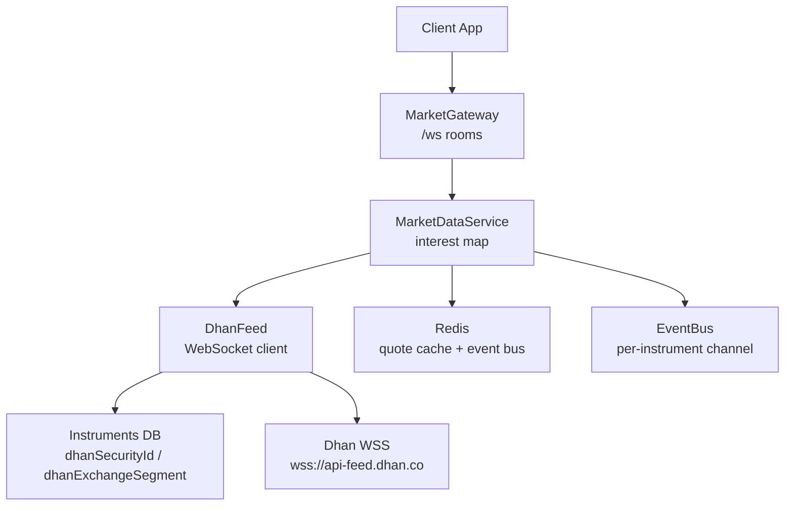
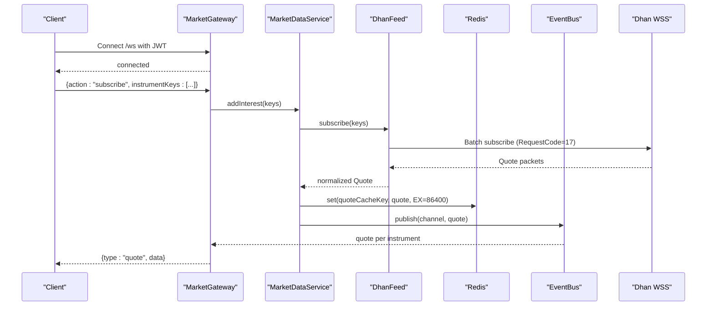
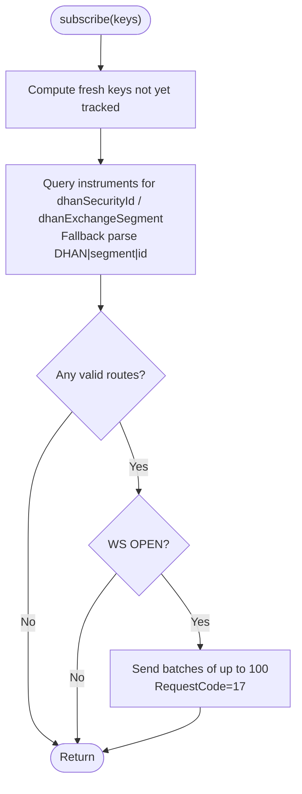
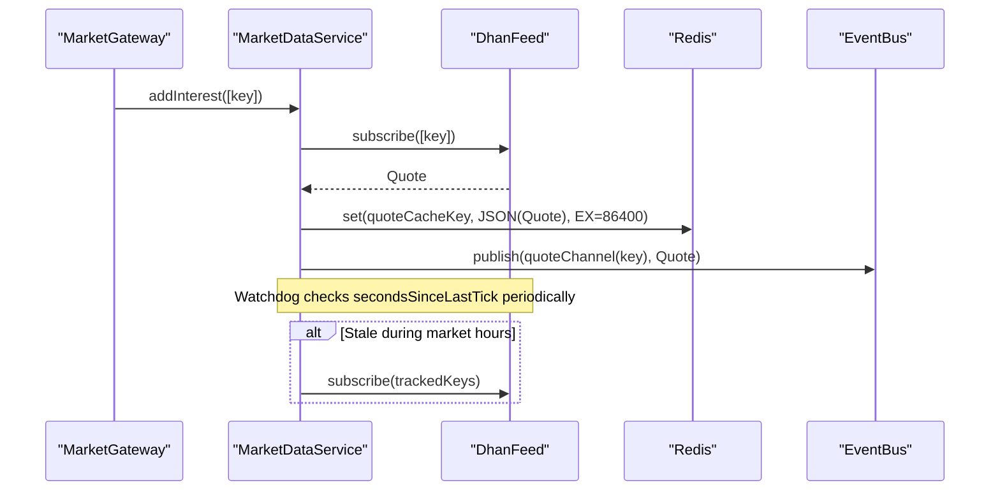
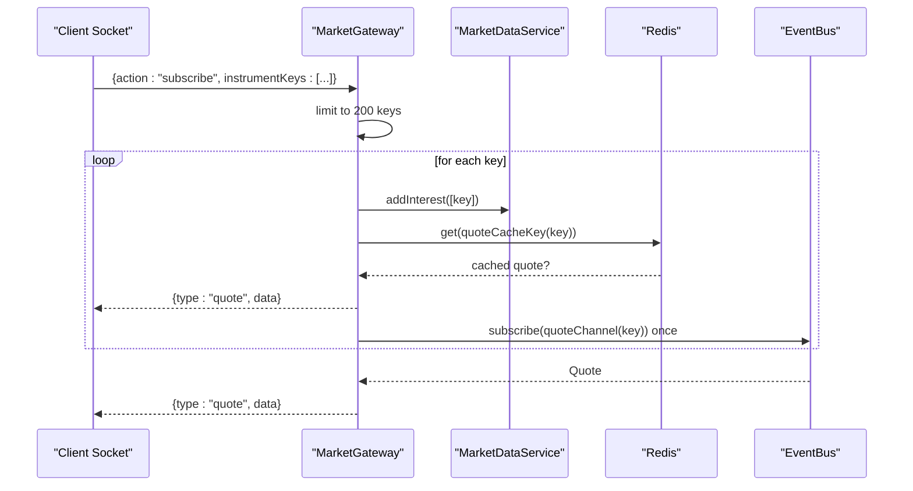
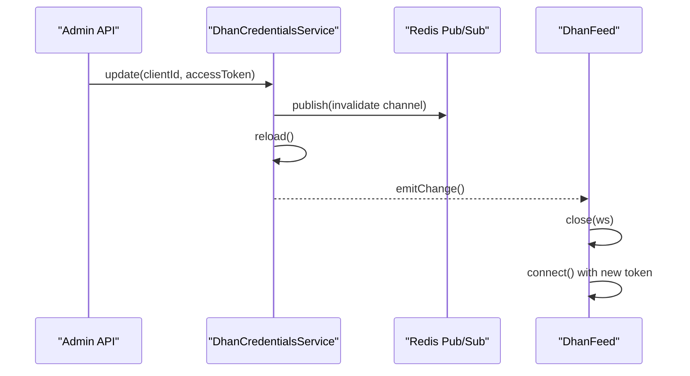
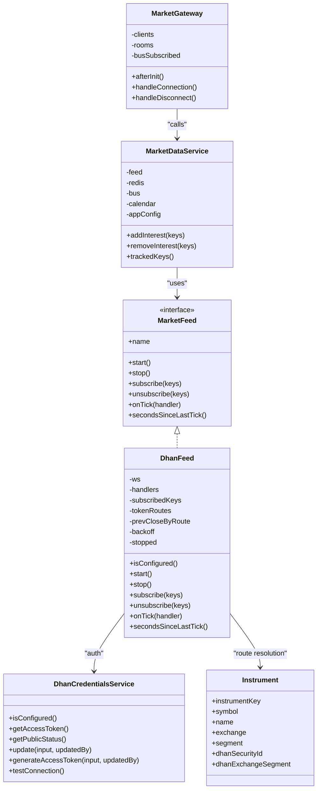

# Instrument Subscription & Connection Management

<cite>
**Referenced Files in This Document**
- [dhan-feed.ts](file://backend/apps/api/src/modules/market/infrastructure/feed/dhan-feed.ts)
- [dhan-decode.ts](file://backend/apps/api/src/modules/market/infrastructure/feed/dhan-decode.ts)
- [market-feed.port.ts](file://backend/apps/api/src/modules/market/infrastructure/feed/market-feed.port.ts)
- [instrument.schema.ts](file://backend/apps/api/src/modules/market/infrastructure/schemas/instrument.schema.ts)
- [market-data.service.ts](file://backend/apps/api/src/modules/market/application/market-data.service.ts)
- [market.gateway.ts](file://backend/apps/api/src/modules/market/presentation/market.gateway.ts)
- [dhan-credentials.service.ts](file://backend/apps/api/src/modules/market/application/dhan-credentials.service.ts)
</cite>

## Table of Contents
1. [Introduction](#introduction)
2. [Project Structure](#project-structure)
3. [Core Components](#core-components)
4. [Architecture Overview](#architecture-overview)
5. [Detailed Component Analysis](#detailed-component-analysis)
6. [Dependency Analysis](#dependency-analysis)
7. [Performance Considerations](#performance-considerations)
8. [Troubleshooting Guide](#troubleshooting-guide)
9. [Conclusion](#conclusion)

## Introduction
This document explains how the system manages Dhan instrument subscriptions and WebSocket connections for live market data. It covers:
- Batch subscription with configurable limits
- Instrument route resolution from database mappings
- Dynamic subscription updates (subscribe/unsubscribe)
- Connection lifecycle with automatic reconnection, exponential backoff, and heartbeat handling
- State restoration after disconnections
- Unsubscribe mechanism, resource cleanup, and memory management for large instrument sets
- Performance strategies for thousands of concurrent subscriptions
- Monitoring connection health metrics

## Project Structure
The relevant components are organized under the market module:
- Feed infrastructure: Dhan-specific WebSocket feed implementation and decoding utilities
- Application layer: Market data pipeline that owns the single feed instance and orchestrates interest-based subscriptions
- Presentation layer: WebSocket gateway that fans out quotes to clients and drives on-demand upstream subscriptions
- Schemas: Instrument master used to resolve exchange segments and security IDs
- Credentials: Secure storage and reload of Dhan access tokens

**Diagram sources**
- [market.gateway.ts:26-134](file://backend/apps/api/src/modules/market/presentation/market.gateway.ts#L26-L134)
- [market-data.service.ts:24-139](file://backend/apps/api/src/modules/market/application/market-data.service.ts#L24-L139)
- [dhan-feed.ts:37-279](file://backend/apps/api/src/modules/market/infrastructure/feed/dhan-feed.ts#L37-L279)
- [instrument.schema.ts:9-76](file://backend/apps/api/src/modules/market/infrastructure/schemas/instrument.schema.ts#L9-L76)

**Section sources**
- [market.gateway.ts:26-134](file://backend/apps/api/src/modules/market/presentation/market.gateway.ts#L26-L134)
- [market-data.service.ts:24-139](file://backend/apps/api/src/modules/market/application/market-data.service.ts#L24-L139)
- [dhan-feed.ts:37-279](file://backend/apps/api/src/modules/market/infrastructure/feed/dhan-feed.ts#L37-L279)
- [instrument.schema.ts:9-76](file://backend/apps/api/src/modules/market/infrastructure/schemas/instrument.schema.ts#L9-L76)

## Core Components
- DhanFeed: Implements the MarketFeed interface for Dhan’s v2 WebSocket feed. Handles connection, batched subscribe/unsubscribe, route resolution, message decoding, reconnect scheduling, and last-tick monitoring.
- MarketDataService: Owns a single MarketFeed instance, tracks per-instrument interest, subscribes/unsubscribes on demand, writes quotes to Redis, publishes via EventBus, aggregates 1m candles, and runs a stale-feed watchdog.
- MarketGateway: Client-facing WebSocket server that authenticates clients, maintains per-instrument rooms, relays quotes, and triggers interest changes in MarketDataService.
- DhanCredentialsService: Loads encrypted credentials from DB or environment, supports token generation, and broadcasts invalidation events to trigger feed reconnection when credentials change.
- Instrument schema: Stores canonical instrument keys plus Dhan-specific fields (security ID and exchange segment) used to build feed routes.

**Section sources**
- [dhan-feed.ts:37-279](file://backend/apps/api/src/modules/market/infrastructure/feed/dhan-feed.ts#L37-L279)
- [market-data.service.ts:24-139](file://backend/apps/api/src/modules/market/application/market-data.service.ts#L24-L139)
- [market.gateway.ts:26-134](file://backend/apps/api/src/modules/market/presentation/market.gateway.ts#L26-L134)
- [dhan-credentials.service.ts:56-282](file://backend/apps/api/src/modules/market/application/dhan-credentials.service.ts#L56-L282)
- [instrument.schema.ts:9-76](file://backend/apps/api/src/modules/market/infrastructure/schemas/instrument.schema.ts#L9-L76)

## Architecture Overview
The system uses an on-demand subscription model to avoid subscribing to the entire instrument catalog. The gateway creates per-instrument rooms; the first client in a room increments interest and triggers upstream subscription through MarketDataService. Quotes flow from Dhan into DhanFeed, get normalized, cached in Redis, published on the event bus, and fanned out to all clients in the corresponding room. A watchdog monitors feed freshness and can resubscribe tracked instruments if ticks stall during market hours.

**Diagram sources**
- [market.gateway.ts:48-134](file://backend/apps/api/src/modules/market/presentation/market.gateway.ts#L48-L134)
- [market-data.service.ts:43-139](file://backend/apps/api/src/modules/market/application/market-data.service.ts#L43-L139)
- [dhan-feed.ts:91-159](file://backend/apps/api/src/modules/market/infrastructure/feed/dhan-feed.ts#L91-L159)
- [dhan-decode.ts:28-71](file://backend/apps/api/src/modules/market/infrastructure/feed/dhan-decode.ts#L28-L71)

## Detailed Component Analysis

### DhanFeed: Batch Subscriptions, Route Resolution, Reconnect, Heartbeat
- Batch subscription: Subscriptions are sent in batches of 100 using RequestCode 17. Each batch contains ExchangeSegment and SecurityId derived from resolved routes.
- Route resolution: For each instrument key, the service queries the instruments collection for dhanSecurityId and dhanExchangeSegment. If missing, it falls back to parsing DHAN|segment|securityId keys. Resolved routes are cached in a Map keyed by “segment:securityId”.
- Dynamic updates: subscribe() adds new keys to an internal Set and sends only fresh ones. unsubscribe() removes keys, deletes route entries, clears prevClose cache, and sends RequestCode 16 unsubscribe messages in batches.
- Reconnection with exponential backoff: On close/error/disconnect packet, the feed schedules reconnect with doubling delay capped at 30 seconds. After reconnect, it rebuilds routes and resubscribes all previously tracked keys.
- Heartbeat monitoring: The ws library auto-pongs ping frames; explicit pong is sent for safety. Last tick timestamp is updated on each decoded message and exposed via secondsSinceLastTick().
- Memory management: subscribedKeys Set, tokenRoutes Map, and prevCloseByRoute Map are cleared before resubscription to prevent leaks.

**Diagram sources**
- [dhan-feed.ts:150-255](file://backend/apps/api/src/modules/market/infrastructure/feed/dhan-feed.ts#L150-L255)
- [dhan-decode.ts:28-71](file://backend/apps/api/src/modules/market/infrastructure/feed/dhan-decode.ts#L28-L71)

**Section sources**
- [dhan-feed.ts:22-31](file://backend/apps/api/src/modules/market/infrastructure/feed/dhan-feed.ts#L22-L31)
- [dhan-feed.ts:91-159](file://backend/apps/api/src/modules/market/infrastructure/feed/dhan-feed.ts#L91-L159)
- [dhan-feed.ts:161-224](file://backend/apps/api/src/modules/market/infrastructure/feed/dhan-feed.ts#L161-L224)
- [dhan-feed.ts:243-269](file://backend/apps/api/src/modules/market/infrastructure/feed/dhan-feed.ts#L243-L269)
- [dhan-decode.ts:28-71](file://backend/apps/api/src/modules/market/infrastructure/feed/dhan-decode.ts#L28-L71)

### MarketDataService: Interest Tracking, Stale Feed Watchdog, Candle Aggregation
- Interest tracking: Maintains a Map of instrumentKey → number of interested consumers. When count transitions from 0→1, it calls feed.subscribe(); when count drops to 0, it calls feed.unsubscribe().
- Tick handling: Normalized quotes are written to Redis with a TTL and published to the event bus per instrument channel. Completed 1m candles are buffered and flushed in batches to MongoDB.
- Stale feed watchdog: Every 5 seconds, checks secondsSinceLastTick against configured threshold during market hours. If stale and there are tracked keys, it resubscribes to refresh the stream.

**Diagram sources**
- [market-data.service.ts:61-139](file://backend/apps/api/src/modules/market/application/market-data.service.ts#L61-L139)

**Section sources**
- [market-data.service.ts:24-139](file://backend/apps/api/src/modules/market/application/market-data.service.ts#L24-L139)

### MarketGateway: Rooms, Auth, Relay, and Backpressure
- Authentication: Verifies JWT from query string on connection; rejects unauthenticated clients.
- Room management: Tracks per-client subscriptions and per-instrument rooms. First client joining a room triggers upstream subscription via MarketDataService; last client leaving triggers unsubscribe.
- Relaying: Subscribes to the EventBus once per instrument and relays quotes to all sockets in the room. Sends cached last quote immediately upon join.
- Backpressure: Limits incoming subscribe requests to 200 keys per message to mitigate abuse.

**Diagram sources**
- [market.gateway.ts:48-134](file://backend/apps/api/src/modules/market/presentation/market.gateway.ts#L48-L134)

**Section sources**
- [market.gateway.ts:26-134](file://backend/apps/api/src/modules/market/presentation/market.gateway.ts#L26-L134)

### DhanCredentialsService: Token Reload and Reconnection Trigger
- Sources: DB (encrypted) takes precedence over environment variables. Supports mixed sources and reports source type.
- Reload and broadcast: Subscribes to a Redis channel for invalidation; on message, reloads credentials and emits change events.
- Change propagation: DhanFeed listens to onChange to close existing connections and reconnect when credentials update.

**Diagram sources**
- [dhan-credentials.service.ts:80-152](file://backend/apps/api/src/modules/market/application/dhan-credentials.service.ts#L80-L152)
- [dhan-credentials.service.ts:234-282](file://backend/apps/api/src/modules/market/application/dhan-credentials.service.ts#L234-L282)
- [dhan-feed.ts:60-77](file://backend/apps/api/src/modules/market/infrastructure/feed/dhan-feed.ts#L60-L77)

**Section sources**
- [dhan-credentials.service.ts:56-282](file://backend/apps/api/src/modules/market/application/dhan-credentials.service.ts#L56-L282)
- [dhan-feed.ts:60-77](file://backend/apps/api/src/modules/market/infrastructure/feed/dhan-feed.ts#L60-L77)

### Instrument Schema: Route Mapping Fields
- Fields used for Dhan routing: dhanSecurityId and dhanExchangeSegment. These are indexed for efficient lookup during route resolution.
- Canonical instrumentKey serves as the stable identifier across systems; Dhan-specific fields enable mapping to broker-specific identifiers.

**Section sources**
- [instrument.schema.ts:9-76](file://backend/apps/api/src/modules/market/infrastructure/schemas/instrument.schema.ts#L9-L76)

## Dependency Analysis
- MarketFeed abstraction decouples the engine from broker specifics. DhanFeed implements this interface, enabling future adapters without changing the pipeline.
- MarketDataService depends on MarketFeed, Redis, EventBus, and ExchangeCalendarService to implement ingestion, caching, fan-out, and health checks.
- MarketGateway depends on MarketDataService and EventBus to manage client rooms and relay quotes.
- DhanFeed depends on DhanCredentialsService for authentication and Instruments collection for route resolution.

**Diagram sources**
- [market-feed.port.ts:1-23](file://backend/apps/api/src/modules/market/infrastructure/feed/market-feed.port.ts#L1-L23)
- [dhan-feed.ts:37-279](file://backend/apps/api/src/modules/market/infrastructure/feed/dhan-feed.ts#L37-L279)
- [market-data.service.ts:24-139](file://backend/apps/api/src/modules/market/application/market-data.service.ts#L24-L139)
- [market.gateway.ts:26-134](file://backend/apps/api/src/modules/market/presentation/market.gateway.ts#L26-L134)
- [dhan-credentials.service.ts:56-282](file://backend/apps/api/src/modules/market/application/dhan-credentials.service.ts#L56-L282)
- [instrument.schema.ts:9-76](file://backend/apps/api/src/modules/market/infrastructure/schemas/instrument.schema.ts#L9-L76)

**Section sources**
- [market-feed.port.ts:1-23](file://backend/apps/api/src/modules/market/infrastructure/feed/market-feed.port.ts#L1-L23)
- [dhan-feed.ts:37-279](file://backend/apps/api/src/modules/market/infrastructure/feed/dhan-feed.ts#L37-L279)
- [market-data.service.ts:24-139](file://backend/apps/api/src/modules/market/application/market-data.service.ts#L24-L139)
- [market.gateway.ts:26-134](file://backend/apps/api/src/modules/market/presentation/market.gateway.ts#L26-L134)
- [dhan-credentials.service.ts:56-282](file://backend/apps/api/src/modules/market/application/dhan-credentials.service.ts#L56-L282)
- [instrument.schema.ts:9-76](file://backend/apps/api/src/modules/market/infrastructure/schemas/instrument.schema.ts#L9-L76)

## Performance Considerations
- Batched subscriptions: DhanFeed sends up to 100 instruments per request, reducing overhead and respecting broker limits.
- On-demand subscriptions: MarketDataService ensures only instruments with active interest are subscribed, avoiding full-catalog subscriptions.
- Redis caching: Quotes are cached with a 24-hour TTL, enabling fast initial delivery to new subscribers and fallback for history-less scenarios.
- Event bus fan-out: Per-instrument channels minimize cross-talk and allow selective subscription at the gateway level.
- Stale feed watchdog: Periodically detects stalls during market hours and resubscribes tracked keys to recover liveness.
- Memory management:
  - Clearing subscribedKeys, tokenRoutes, and prevCloseByRoute before resubscription prevents accumulation.
  - Unsubscribe removes route entries and prevClose caches to free memory.
  - Gateway limits subscribe payloads to 200 keys per message to control backpressure.
- Monitoring:
  - secondsSinceLastTick exposes feed freshness for external monitoring.
  - Logs around reconnect delays and skipped keys help diagnose issues.

[No sources needed since this section provides general guidance]

## Troubleshooting Guide
- No quotes received:
  - Check secondsSinceLastTick; if null or high during market hours, the watchdog should have triggered resubscription. Verify feed.staleAlertSeconds configuration.
  - Ensure instruments have dhanSecurityId and dhanExchangeSegment populated or use DHAN|segment|id format.
- Frequent reconnects:
  - Inspect logs for disconnect packets and error messages. Validate Dhan credentials and network connectivity.
  - Confirm credentials were not rotated without proper reload; DhanCredentialsService broadcasts invalidation to trigger reconnection.
- Missing instruments in subscriptions:
  - Review warnings about skipped keys without security mapping. Populate instrument records or correct DHAN keys.
- High memory usage:
  - Verify unsubscribe flows remove routes and prevClose entries.
  - Ensure clients leave rooms properly; otherwise interest may remain elevated.

**Section sources**
- [dhan-feed.ts:113-148](file://backend/apps/api/src/modules/market/infrastructure/feed/dhan-feed.ts#L113-L148)
- [dhan-feed.ts:161-224](file://backend/apps/api/src/modules/market/infrastructure/feed/dhan-feed.ts#L161-L224)
- [market-data.service.ts:128-139](file://backend/apps/api/src/modules/market/application/market-data.service.ts#L128-L139)
- [dhan-credentials.service.ts:80-152](file://backend/apps/api/src/modules/market/application/dhan-credentials.service.ts#L80-L152)

## Conclusion
The system implements a robust, scalable approach to Dhan instrument subscriptions and WebSocket management:
- Batched, on-demand subscriptions minimize load and respect broker constraints.
- Database-backed route resolution ensures accurate mapping to broker identifiers.
- Automatic reconnection with exponential backoff and credential change handling maintain resilience.
- Health monitoring and stale-feed recovery keep data flowing reliably.
- Careful memory management and backpressure controls support large-scale, concurrent subscriptions.

[No sources needed since this section summarizes without analyzing specific files]