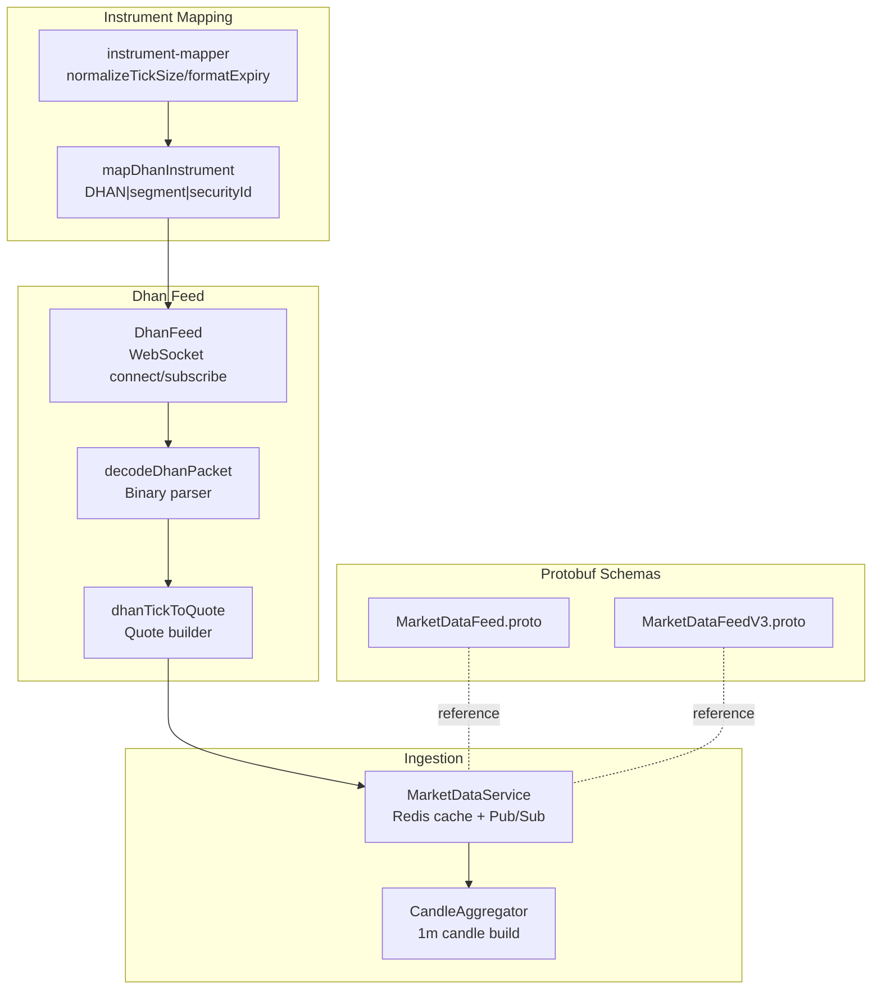
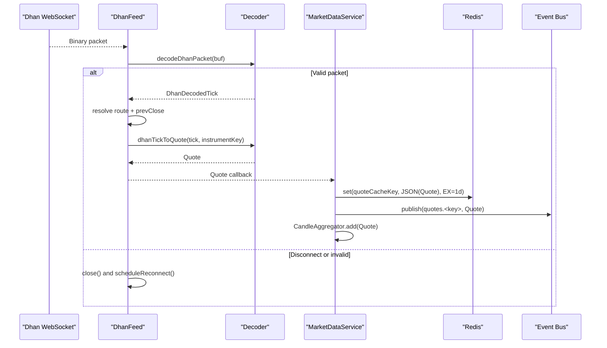
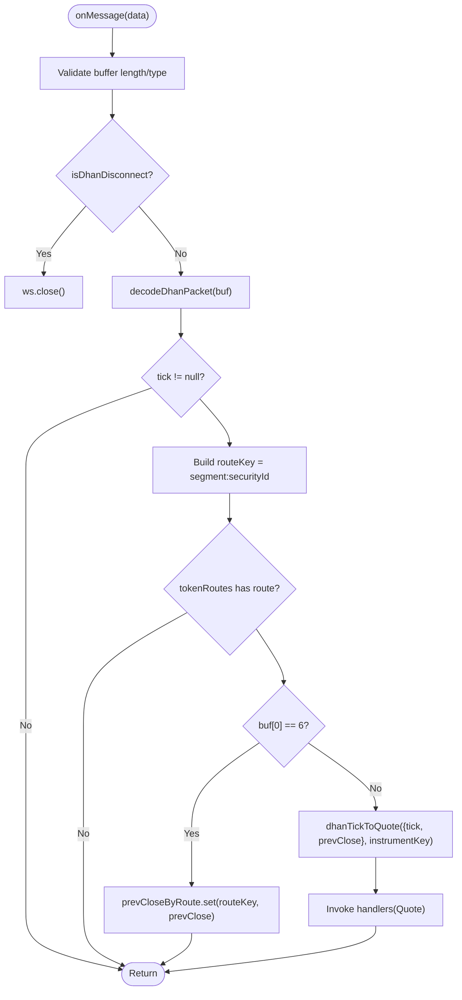
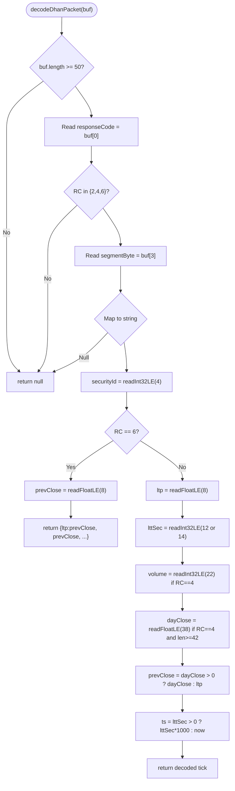
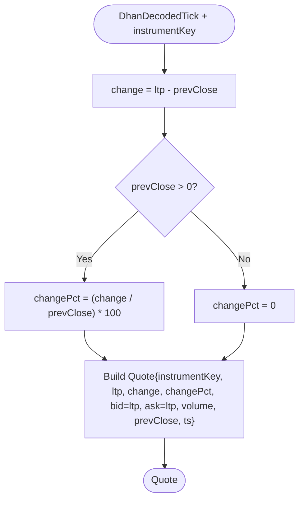
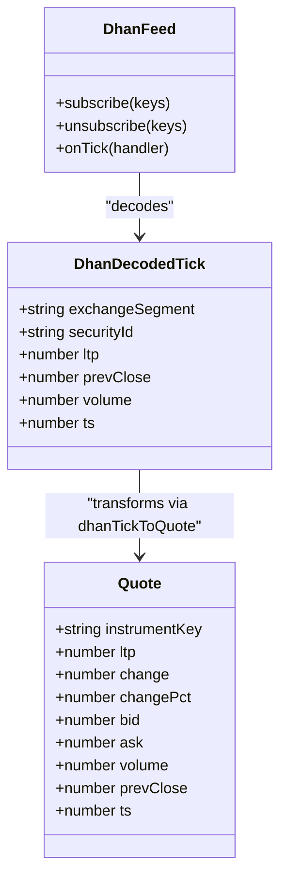
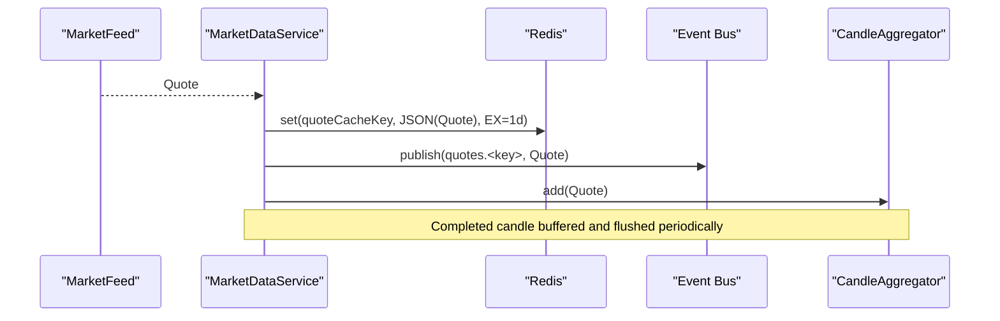
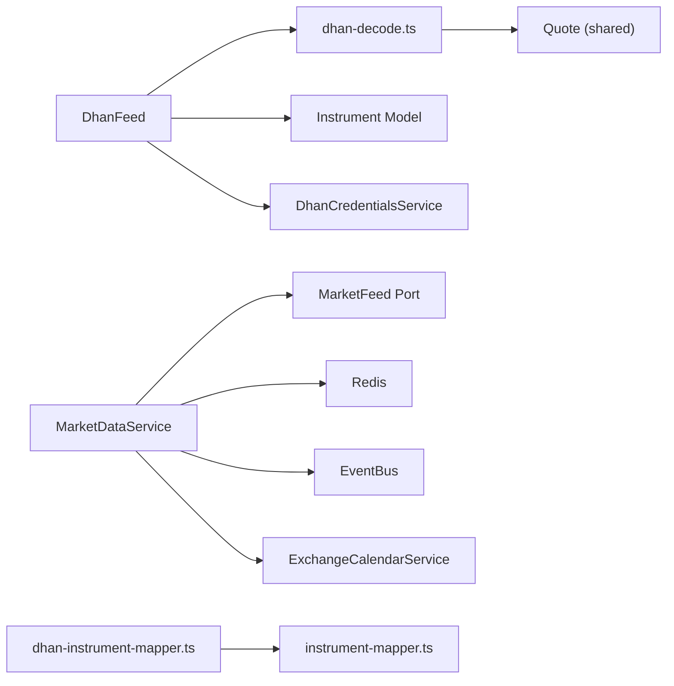

# Protobuf Message Processing & Quote Transformation

<cite>
**Referenced Files in This Document**
- [dhan-feed.ts](file://backend/apps/api/src/modules/market/infrastructure/feed/dhan-feed.ts)
- [dhan-decode.ts](file://backend/apps/api/src/modules/market/infrastructure/feed/dhan-decode.ts)
- [market-data.service.ts](file://backend/apps/api/src/modules/market/application/market-data.service.ts)
- [market-feed.port.ts](file://backend/apps/api/src/modules/market/infrastructure/feed/market-feed.port.ts)
- [MarketDataFeed.proto](file://backend/apps/api/src/modules/market/infrastructure/feed/MarketDataFeed.proto)
- [MarketDataFeedV3.proto](file://backend/apps/api/src/modules/market/infrastructure/feed/MarketDataFeedV3.proto)
- [dhan-instrument-mapper.ts](file://backend/apps/api/src/modules/market/infrastructure/dhan-instrument-mapper.ts)
- [instrument-mapper.ts](file://backend/apps/api/src/modules/market/infrastructure/instrument-mapper.ts)
- [market.types.ts](file://backend/libs/shared/src/market/market.types.ts)
</cite>

## Table of Contents
1. Introduction
2. Project Structure
3. Core Components
4. Architecture Overview
5. Detailed Component Analysis
6. Dependency Analysis
7. Performance Considerations
8. Troubleshooting Guide
9. Conclusion

## Introduction
This document explains Dhan’s protobuf-based message processing and quote transformation pipeline within the platform. It covers binary protocol parsing, packet structure decoding, message validation, and the dhanTickToQuote function that transforms Dhan-specific tick data into the canonical Quote format. It also documents exchange segment mapping, security ID resolution, instrument key conversion, error handling for malformed packets, connection monitoring, and graceful degradation when messages cannot be parsed. Examples of protobuf message structures and debugging techniques are included to help diagnose message processing issues.

## Project Structure
The market data pipeline is implemented as a modular service with clear separation between feed adapters, decoding/transformation logic, and ingestion/publishing:

- Feed adapter: DhanFeed connects to Dhan’s WebSocket, manages subscriptions/unsubscriptions, and routes incoming binary packets to the decoder.
- Decoder: dhan-decode.ts parses Dhan v2 binary packets, maps exchange segments, extracts fields, and converts ticks to the canonical Quote type.
- Ingestion: MarketDataService subscribes to the feed, fans out quotes via Redis pub/sub, caches quotes, aggregates 1-minute candles, and monitors feed health.
- Instrument mapping: dhan-instrument-mapper.ts and instrument-mapper.ts map catalog keys and exchange segments to canonical instrument keys used by the platform.
- Protobuf definitions: MarketDataFeed.proto and MarketDataFeedV3.proto define the Upstox protobuf schema used elsewhere in the system (for reference).

**Diagram sources**
- [dhan-feed.ts:91-140](file://backend/apps/api/src/modules/market/infrastructure/feed/dhan-feed.ts#L91-L140)
- [dhan-decode.ts:28-76](file://backend/apps/api/src/modules/market/infrastructure/feed/dhan-decode.ts#L28-L76)
- [market-data.service.ts:43-108](file://backend/apps/api/src/modules/market/application/market-data.service.ts#L43-L108)
- [dhan-instrument-mapper.ts:56-115](file://backend/apps/api/src/modules/market/infrastructure/dhan-instrument-mapper.ts#L56-L115)
- [instrument-mapper.ts:59-78](file://backend/apps/api/src/modules/market/infrastructure/instrument-mapper.ts#L59-L78)
- [MarketDataFeed.proto:1-119](file://backend/apps/api/src/modules/market/infrastructure/feed/MarketDataFeed.proto#L1-L119)
- [MarketDataFeedV3.proto:1-119](file://backend/apps/api/src/modules/market/infrastructure/feed/MarketDataFeedV3.proto#L1-L119)

**Section sources**
- [dhan-feed.ts:1-279](file://backend/apps/api/src/modules/market/infrastructure/feed/dhan-feed.ts#L1-L279)
- [dhan-decode.ts:1-77](file://backend/apps/api/src/modules/market/infrastructure/feed/dhan-decode.ts#L1-L77)
- [market-data.service.ts:1-139](file://backend/apps/api/src/modules/market/application/market-data.service.ts#L1-L139)
- [market-feed.port.ts:1-23](file://backend/apps/api/src/modules/market/infrastructure/feed/market-feed.port.ts#L1-L23)
- [dhan-instrument-mapper.ts:1-116](file://backend/apps/api/src/modules/market/infrastructure/dhan-instrument-mapper.ts#L1-L116)
- [instrument-mapper.ts:1-135](file://backend/apps/api/src/modules/market/infrastructure/instrument-mapper.ts#L1-L135)
- [MarketDataFeed.proto:1-119](file://backend/apps/api/src/modules/market/infrastructure/feed/MarketDataFeed.proto#L1-L119)
- [MarketDataFeedV3.proto:1-119](file://backend/apps/api/src/modules/market/infrastructure/feed/MarketDataFeedV3.proto#L1-L119)

## Core Components
- DhanFeed: Manages WebSocket lifecycle, credentials-driven URL construction, subscription batching, route resolution from instruments, prevClose caching per route, and reconnect backoff.
- dhan-decode.ts: Binary packet decoder for Dhan v2 responses; maps numeric segment bytes to strings; extracts LTP, volume, timestamps; builds canonical Quote via dhanTickToQuote; detects server disconnect packets.
- MarketDataService: Owns the single MarketFeed instance, tracks consumer interest per instrumentKey, subscribes on demand, publishes quotes to Redis pub/sub, caches quotes with TTL, aggregates 1-minute candles, and runs stale-feed watchdog.
- Instrument mappers: Convert Dhan CSV rows and catalog keys into canonical instrument keys (e.g., DHAN|NSE_EQ|2885), normalize tick sizes, and infer underlying keys for derivatives.

**Section sources**
- [dhan-feed.ts:22-140](file://backend/apps/api/src/modules/market/infrastructure/feed/dhan-feed.ts#L22-L140)
- [dhan-decode.ts:7-76](file://backend/apps/api/src/modules/market/infrastructure/feed/dhan-decode.ts#L7-L76)
- [market-data.service.ts:24-108](file://backend/apps/api/src/modules/market/application/market-data.service.ts#L24-L108)
- [dhan-instrument-mapper.ts:10-115](file://backend/apps/api/src/modules/market/infrastructure/dhan-instrument-mapper.ts#L10-L115)
- [instrument-mapper.ts:44-78](file://backend/apps/api/src/modules/market/infrastructure/instrument-mapper.ts#L44-L78)

## Architecture Overview
The pipeline ingests Dhan’s binary WebSocket stream, decodes it into a normalized Quote, and fans it out through Redis while persisting aggregated candles. Instrument routing ensures only requested instruments are subscribed, minimizing upstream load.

**Diagram sources**
- [dhan-feed.ts:113-140](file://backend/apps/api/src/modules/market/infrastructure/feed/dhan-feed.ts#L113-L140)
- [dhan-decode.ts:28-76](file://backend/apps/api/src/modules/market/infrastructure/feed/dhan-decode.ts#L28-L76)
- [market-data.service.ts:43-108](file://backend/apps/api/src/modules/market/application/market-data.service.ts#L43-L108)

## Detailed Component Analysis

### DhanFeed: Connection, Routing, and Subscription
- Connects to wss://api-feed.dhan.co with token and clientId parameters.
- Subscribes in batches of 100 using RequestCode 17; unsubscribes using RequestCode 16.
- Resolves instrumentKey to exchangeSegment and securityId via DB fields or DHAN|… keys.
- Caches prevClose per route to ensure stable change calculations.
- Handles disconnect packets (response code 50) and implements exponential backoff reconnection.

**Diagram sources**
- [dhan-feed.ts:113-140](file://backend/apps/api/src/modules/market/infrastructure/feed/dhan-feed.ts#L113-L140)
- [dhan-decode.ts:28-76](file://backend/apps/api/src/modules/market/infrastructure/feed/dhan-decode.ts#L28-L76)

**Section sources**
- [dhan-feed.ts:85-148](file://backend/apps/api/src/modules/market/infrastructure/feed/dhan-feed.ts#L85-L148)
- [dhan-decode.ts:7-76](file://backend/apps/api/src/modules/market/infrastructure/feed/dhan-decode.ts#L7-L76)

### Binary Protocol Parsing and Packet Decoding
- Response codes handled: 2 (ticker), 4 (quote), 6 (previous close), 50 (disconnect).
- Segment byte mapped to string via DHAN_SEGMENT_BYTE_TO_STRING.
- SecurityId read as little-endian int32 at offset 4.
- For response code 6: reads previous close float at offset 8.
- For response codes 2/4: reads LTP float at offset 8; timestamp seconds at offset 12 or 14 depending on code; volume at offset 22 if present; day close at offset 38 if available; derives prevClose from day close or LTP.

**Diagram sources**
- [dhan-decode.ts:28-55](file://backend/apps/api/src/modules/market/infrastructure/feed/dhan-decode.ts#L28-L55)

**Section sources**
- [dhan-decode.ts:28-55](file://backend/apps/api/src/modules/market/infrastructure/feed/dhan-decode.ts#L28-L55)

### Quote Transformation: dhanTickToQuote
- Computes absolute change and percentage change relative to prevClose.
- Maps bid/ask to LTP when depth is not available.
- Preserves volume and timestamp.
- Returns canonical Quote with instrumentKey resolved from routing.

**Diagram sources**
- [dhan-decode.ts:57-71](file://backend/apps/api/src/modules/market/infrastructure/feed/dhan-decode.ts#L57-L71)

**Section sources**
- [dhan-decode.ts:57-71](file://backend/apps/api/src/modules/market/infrastructure/feed/dhan-decode.ts#L57-L71)

### Exchange Segment Mapping and Security ID Resolution
- Numeric segment byte mapped to strings like NSE_EQ, NSE_FNO, IDX_I, etc.
- SecurityId extracted from binary header and stored as string.
- InstrumentKey can be derived from catalog entries (DB fields) or parsed from DHAN|segment|securityId keys.
- dhan-instrument-mapper.ts maps Dhan CSV rows to canonical instrument keys and normalizes tick size and expiry formats.

**Diagram sources**
- [dhan-decode.ts:19-71](file://backend/apps/api/src/modules/market/infrastructure/feed/dhan-decode.ts#L19-L71)
- [dhan-feed.ts:113-140](file://backend/apps/api/src/modules/market/infrastructure/feed/dhan-feed.ts#L113-L140)

**Section sources**
- [dhan-decode.ts:7-71](file://backend/apps/api/src/modules/market/infrastructure/feed/dhan-decode.ts#L7-L71)
- [dhan-instrument-mapper.ts:56-115](file://backend/apps/api/src/modules/market/infrastructure/dhan-instrument-mapper.ts#L56-L115)
- [instrument-mapper.ts:59-78](file://backend/apps/api/src/modules/market/infrastructure/instrument-mapper.ts#L59-L78)

### Ingestion Pipeline: MarketDataService
- On module init, registers tick handler, starts feed, sets up periodic candle flush and health checks.
- Tracks interest per instrumentKey; subscribes on first consumer and unsubscribes when last consumer leaves.
- Publishes each Quote to Redis cache (TTL 1 day) and event bus channel quotes.<key>.
- Aggregates 1-minute candles and persists them in bulk.
- Stale feed watchdog resubscribes if no ticks received during market hours beyond threshold.

**Diagram sources**
- [market-data.service.ts:43-108](file://backend/apps/api/src/modules/market/application/market-data.service.ts#L43-L108)

**Section sources**
- [market-data.service.ts:43-139](file://backend/apps/api/src/modules/market/application/market-data.service.ts#L43-L139)

### Protobuf Message Structures (Reference)
While Dhan uses a custom binary protocol, the system also defines Upstox protobuf schemas for other feeds. These structures illustrate the canonical field shapes used across the platform:

- LTPC: last traded price, time, quantity, previous close.
- Quote: bid/ask quantities and prices.
- MarketFullFeed/IndexFullFeed: composite structures including OHLC, option greeks, and additional metrics.
- FeedResponse: envelope containing type, feeds map, current timestamp, and market info.

These definitions provide context for how canonical fields are modeled and reused in other parts of the system.

**Section sources**
- [MarketDataFeed.proto:1-119](file://backend/apps/api/src/modules/market/infrastructure/feed/MarketDataFeed.proto#L1-L119)
- [MarketDataFeedV3.proto:1-119](file://backend/apps/api/src/modules/market/infrastructure/feed/MarketDataFeedV3.proto#L1-L119)

## Dependency Analysis
- DhanFeed depends on DhanCredentialsService for tokens and Instrument model for routing.
- dhan-decode.ts depends on shared Quote type.
- MarketDataService depends on MarketFeed port, Redis, EventBus, and ExchangeCalendarService.
- Instrument mappers depend on shared normalization utilities and catalog helpers.

**Diagram sources**
- [dhan-feed.ts:51-140](file://backend/apps/api/src/modules/market/infrastructure/feed/dhan-feed.ts#L51-L140)
- [dhan-decode.ts:1-76](file://backend/apps/api/src/modules/market/infrastructure/feed/dhan-decode.ts#L1-L76)
- [market-data.service.ts:24-108](file://backend/apps/api/src/modules/market/application/market-data.service.ts#L24-L108)
- [market-feed.port.ts:1-23](file://backend/apps/api/src/modules/market/infrastructure/feed/market-feed.port.ts#L1-L23)
- [dhan-instrument-mapper.ts:1-116](file://backend/apps/api/src/modules/market/infrastructure/dhan-instrument-mapper.ts#L1-L116)
- [instrument-mapper.ts:1-135](file://backend/apps/api/src/modules/market/infrastructure/instrument-mapper.ts#L1-L135)

**Section sources**
- [dhan-feed.ts:51-140](file://backend/apps/api/src/modules/market/infrastructure/feed/dhan-feed.ts#L51-L140)
- [market-data.service.ts:24-108](file://backend/apps/api/src/modules/market/application/market-data.service.ts#L24-L108)
- [market-feed.port.ts:1-23](file://backend/apps/api/src/modules/market/infrastructure/feed/market-feed.port.ts#L1-L23)

## Performance Considerations
- Batched subscriptions: Requests are sent in batches of 100 to reduce overhead.
- On-demand subscribe/unsubscribe: Interest tracking ensures minimal upstream load.
- PrevClose caching: Avoids recomputation and stabilizes change metrics.
- Periodic candle flush: Batches writes to reduce database pressure.
- Backoff reconnection: Exponential backoff prevents thundering herd on reconnect.

[No sources needed since this section provides general guidance]

## Troubleshooting Guide
Common issues and diagnostics:

- Malformed packets:
  - decodeDhanPacket returns null for buffers shorter than expected or unsupported response codes.
  - Validate buffer length and response code before decoding.
  - Log raw buffer details (length, first few bytes) to identify protocol mismatches.

- Missing instrument routes:
  - If tokenRoutes does not contain the routeKey, the tick is ignored.
  - Ensure instruments have dhanSecurityId and dhanExchangeSegment populated or use DHAN|segment|securityId keys.
  - Check parseDhanInstrumentKey behavior for non-DHAN keys.

- Server disconnect:
  - isDhanDisconnect detects response code 50; feed closes and schedules reconnect.
  - Monitor logs for disconnect events and subsequent reconnect attempts.

- Stale feed:
  - MarketDataService watchdog alerts when no ticks arrive during market hours beyond threshold.
  - Triggers resubscribe to refresh state.

- Debugging techniques:
  - Log secondsSinceLastTick to monitor freshness.
  - Inspect Redis cache keys for recent quotes.
  - Verify subscription counts and interest tracking in MarketDataService.
  - Use admin endpoints to test credentials and sync tokens if configuration changes occur.

**Section sources**
- [dhan-decode.ts:28-76](file://backend/apps/api/src/modules/market/infrastructure/feed/dhan-decode.ts#L28-L76)
- [dhan-feed.ts:113-148](file://backend/apps/api/src/modules/market/infrastructure/feed/dhan-feed.ts#L113-L148)
- [market-data.service.ts:128-139](file://backend/apps/api/src/modules/market/application/market-data.service.ts#L128-L139)

## Conclusion
The Dhan integration implements a robust, efficient pipeline that parses binary WebSocket packets, resolves instrument routing, and transforms ticks into canonical Quotes for downstream consumption. The design emphasizes minimal upstream load, resilient connectivity, and clear separation of concerns. With careful attention to instrument mapping, prevClose handling, and feed health monitoring, the system maintains reliable real-time market data flow suitable for trading and analytics workloads.

[No sources needed since this section summarizes without analyzing specific files]