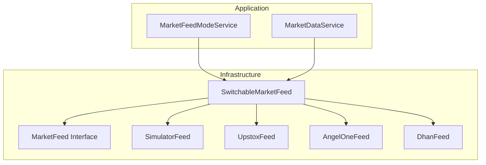
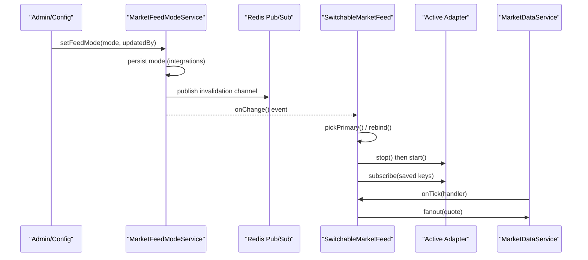
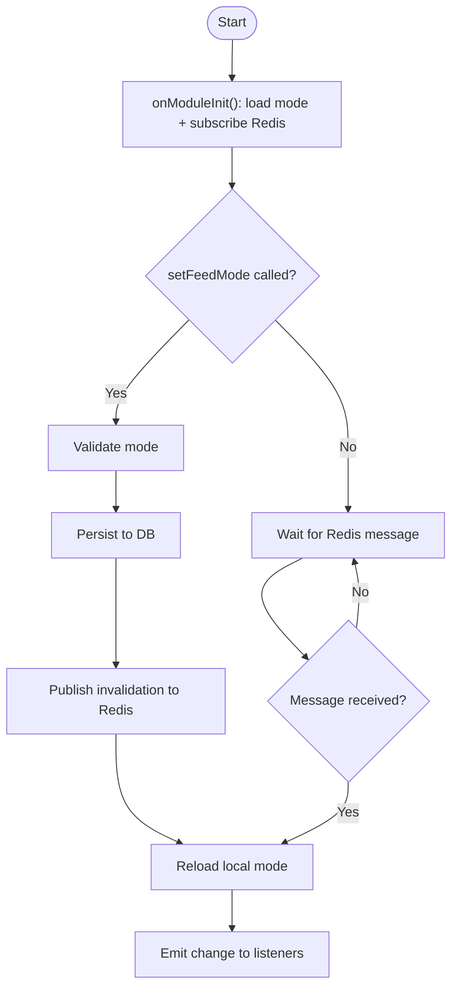
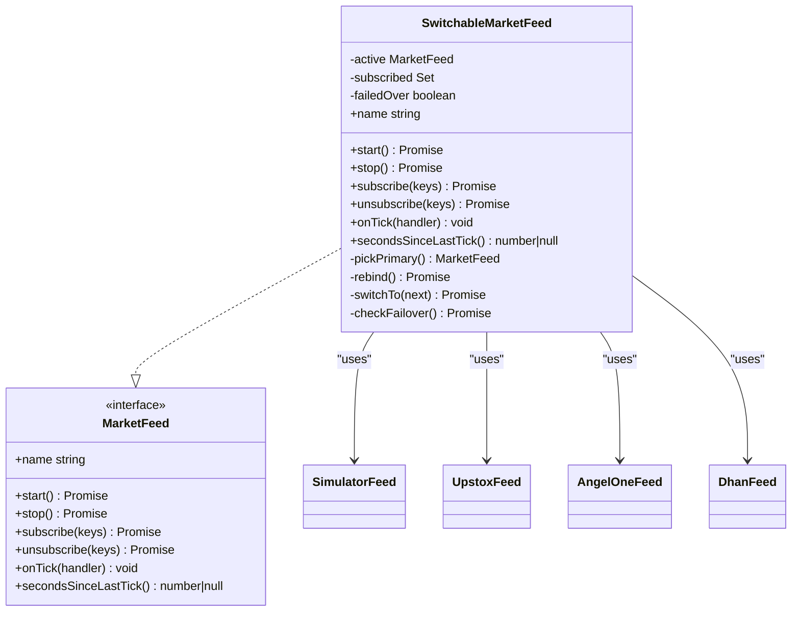
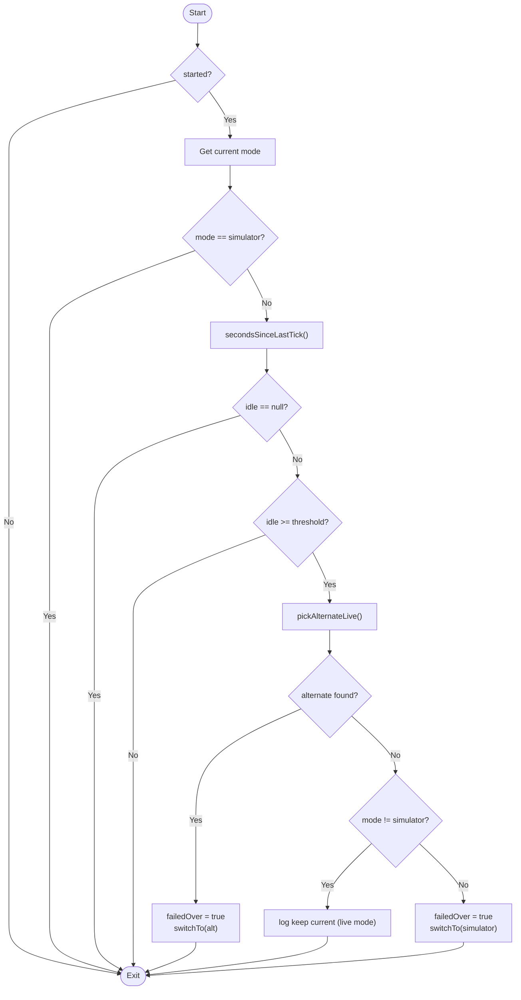
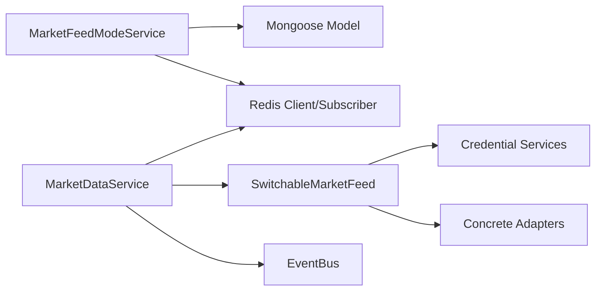

# Feed Switching & Management

<cite>
**Referenced Files in This Document**
- [market-feed-mode.service.ts](file://backend/apps/api/src/modules/market/application/market-feed-mode.service.ts)
- [switchable-market-feed.ts](file://backend/apps/api/src/modules/market/infrastructure/feed/switchable-market-feed.ts)
- [market-feed.port.ts](file://backend/apps/api/src/modules/market/infrastructure/feed/market-feed.port.ts)
- [simulator-feed.ts](file://backend/apps/api/src/modules/market/infrastructure/feed/simulator-feed.ts)
- [upstox-feed.ts](file://backend/apps/api/src/modules/market/infrastructure/feed/upstox-feed.ts)
- [angel-one-feed.ts](file://backend/apps/api/src/modules/market/infrastructure/feed/angel-one-feed.ts)
- [dhan-feed.ts](file://backend/apps/api/src/modules/market/infrastructure/feed/dhan-feed.ts)
- [integration-settings.schema.ts](file://backend/apps/api/src/modules/market/infrastructure/schemas/integration-settings.schema.ts)
- [market-data.service.ts](file://backend/apps/api/src/modules/market/application/market-data.service.ts)
- [simulator-feed.spec.ts](file://backend/apps/api/src/modules/market/__tests__/simulator-feed.spec.ts)
</cite>

## Table of Contents
1. Introduction
2. Project Structure
3. Core Components
4. Architecture Overview
5. Detailed Component Analysis
6. Dependency Analysis
7. Performance Considerations
8. Troubleshooting Guide
9. Conclusion
10. Appendices

## Introduction
This document explains the market feed switching mechanism that enables dynamic selection between broker feeds and simulation modes at runtime. It focuses on:
- MarketFeedModeService: manages the active feed mode from configuration, database, and environment with cross-process synchronization via Redis.
- SwitchableMarketFeed: a wrapper that provides unified access to multiple feed implementations (simulator, Upstox, Angel One, Dhan), handles live switching, state preservation, and graceful degradation when primary feeds are unavailable.
- Configuration options for feed priorities, fallback strategies, and monitoring feed health metrics.
- Testing approaches using mock feeds and simulation environments for development and quality assurance.

## Project Structure
The feed switching logic spans application services and infrastructure adapters under the market module:
- Application layer:
  - MarketFeedModeService stores and broadcasts the active feed mode.
  - MarketDataService consumes the selected feed and runs the ingestion pipeline.
- Infrastructure layer:
  - MarketFeed interface defines the contract for all feed adapters.
  - Concrete adapters: SimulatorFeed, UpstoxFeed, AngelOneFeed, DhanFeed.
  - SwitchableMarketFeed orchestrates selection, switching, failover, and subscription state.

**Diagram sources**
- [market-feed-mode.service.ts:20-98](file://backend/apps/api/src/modules/market/application/market-feed-mode.service.ts#L20-L98)
- [switchable-market-feed.ts:23-186](file://backend/apps/api/src/modules/market/infrastructure/feed/switchable-market-feed.ts#L23-L186)
- [market-feed.port.ts:7-22](file://backend/apps/api/src/modules/market/infrastructure/feed/market-feed.port.ts#L7-L22)
- [simulator-feed.ts:25-145](file://backend/apps/api/src/modules/market/infrastructure/feed/simulator-feed.ts#L25-L145)
- [upstox-feed.ts:12-136](file://backend/apps/api/src/modules/market/infrastructure/feed/upstox-feed.ts#L12-L136)
- [angel-one-feed.ts:22-242](file://backend/apps/api/src/modules/market/infrastructure/feed/angel-one-feed.ts#L22-L242)
- [dhan-feed.ts:37-279](file://backend/apps/api/src/modules/market/infrastructure/feed/dhan-feed.ts#L37-L279)

**Section sources**
- [market-feed-mode.service.ts:20-98](file://backend/apps/api/src/modules/market/application/market-feed-mode.service.ts#L20-L98)
- [switchable-market-feed.ts:23-186](file://backend/apps/api/src/modules/market/infrastructure/feed/switchable-market-feed.ts#L23-L186)
- [market-feed.port.ts:7-22](file://backend/apps/api/src/modules/market/infrastructure/feed/market-feed.port.ts#L7-L22)

## Core Components
- MarketFeedModeService
  - Loads initial mode from environment variable MARKET_FEED if present; otherwise reads persisted mode from the integrations collection or falls back to simulator.
  - Persists mode changes and publishes an invalidation message to Redis so other processes reload their in-memory mode.
  - Emits change events to subscribers (e.g., SwitchableMarketFeed).
- SwitchableMarketFeed
  - Implements MarketFeed and wraps concrete adapters.
  - Selects the active adapter based on current mode and credential availability.
  - Preserves subscribed instrument keys across switches and re-applies them to the new adapter.
  - Runs periodic stale checks to fail over to alternate live feeds or simulator when needed.
- MarketFeed Interface
  - Defines start, stop, subscribe/unsubscribe, onTick, secondsSinceLastTick, and name for all adapters.
- Adapters
  - SimulatorFeed: deterministic synthetic quotes without network or credentials.
  - UpstoxFeed: WebSocket-based live feed with token authorization and reconnect backoff.
  - AngelOneFeed: WebSocket-based live feed with JWT/API key headers and heartbeat.
  - DhanFeed: WebSocket-based live feed with batched subscriptions and disconnect handling.

**Section sources**
- [market-feed-mode.service.ts:20-98](file://backend/apps/api/src/modules/market/application/market-feed-mode.service.ts#L20-L98)
- [switchable-market-feed.ts:23-186](file://backend/apps/api/src/modules/market/infrastructure/feed/switchable-market-feed.ts#L23-L186)
- [market-feed.port.ts:7-22](file://backend/apps/api/src/modules/market/infrastructure/feed/market-feed.port.ts#L7-L22)
- [simulator-feed.ts:25-145](file://backend/apps/api/src/modules/market/infrastructure/feed/simulator-feed.ts#L25-L145)
- [upstox-feed.ts:12-136](file://backend/apps/api/src/modules/market/infrastructure/feed/upstox-feed.ts#L12-L136)
- [angel-one-feed.ts:22-242](file://backend/apps/api/src/modules/market/infrastructure/feed/angel-one-feed.ts#L22-L242)
- [dhan-feed.ts:37-279](file://backend/apps/api/src/modules/market/infrastructure/feed/dhan-feed.ts#L37-L279)

## Architecture Overview
The system uses a layered approach:
- Mode management persists and synchronizes feed mode across processes.
- The switchable wrapper selects and binds the appropriate feed implementation.
- The market data service ingests ticks, caches quotes, aggregates candles, and monitors feed health.

**Diagram sources**
- [market-feed-mode.service.ts:61-74](file://backend/apps/api/src/modules/market/application/market-feed-mode.service.ts#L61-L74)
- [switchable-market-feed.ts:57-71](file://backend/apps/api/src/modules/market/infrastructure/feed/switchable-market-feed.ts#L57-L71)
- [switchable-market-feed.ts:139-156](file://backend/apps/api/src/modules/market/infrastructure/feed/switchable-market-feed.ts#L139-L156)
- [market-data.service.ts:43-52](file://backend/apps/api/src/modules/market/application/market-data.service.ts#L43-L52)

## Detailed Component Analysis

### MarketFeedModeService
Responsibilities:
- Load and validate feed mode from environment, database, or legacy documents.
- Persist mode changes and broadcast updates via Redis pub/sub.
- Notify listeners of mode changes to trigger re-binding.

Key behaviors:
- Initial load order: persisted mode > legacy mode > environment default.
- Cross-process sync: publishing to a dedicated channel triggers reload in other instances.
- Safe listener invocation: errors in listeners do not break mode updates.

Configuration and persistence:
- Environment variable: MARKET_FEED (validated against allowed modes).
- Database: integrations collection with provider-specific settings including feedMode.

**Diagram sources**
- [market-feed-mode.service.ts:37-46](file://backend/apps/api/src/modules/market/application/market-feed-mode.service.ts#L37-L46)
- [market-feed-mode.service.ts:61-74](file://backend/apps/api/src/modules/market/application/market-feed-mode.service.ts#L61-L74)
- [market-feed-mode.service.ts:84-97](file://backend/apps/api/src/modules/market/application/market-feed-mode.service.ts#L84-L97)

**Section sources**
- [market-feed-mode.service.ts:20-98](file://backend/apps/api/src/modules/market/application/market-feed-mode.service.ts#L20-L98)
- [integration-settings.schema.ts:9-37](file://backend/apps/api/src/modules/market/infrastructure/schemas/integration-settings.schema.ts#L9-L37)

### SwitchableMarketFeed
Responsibilities:
- Provide a single MarketFeed facade over multiple adapters.
- Dynamically select the active adapter based on mode and credential readiness.
- Preserve subscription state across switches and reapply it to the new adapter.
- Monitor feed freshness and perform failover to alternate live feeds or simulator.

Selection logic:
- If mode is simulator, use SimulatorFeed.
- Else attempt configured live feed only if credentials/configured flags indicate readiness.
- Otherwise iterate through alternative live feeds in a fixed order until one is available.
- Fallback to simulator if no live feed is ready.

State preservation:
- Tracks subscribed instrument keys and re-subscribes after switching.
- Rebinds automatically when mode changes or credentials become available.

Failover strategy:
- Periodic check (every few seconds) measures seconds since last tick.
- If idle exceeds threshold while in live mode, attempts alternate live feed.
- If none available and mode is not simulator, keeps current feed but logs warning.
- If still stale and mode allows, falls back to simulator.

**Diagram sources**
- [market-feed.port.ts:7-22](file://backend/apps/api/src/modules/market/infrastructure/feed/market-feed.port.ts#L7-L22)
- [switchable-market-feed.ts:23-186](file://backend/apps/api/src/modules/market/infrastructure/feed/switchable-market-feed.ts#L23-L186)
- [simulator-feed.ts:25-145](file://backend/apps/api/src/modules/market/infrastructure/feed/simulator-feed.ts#L25-L145)
- [upstox-feed.ts:12-136](file://backend/apps/api/src/modules/market/infrastructure/feed/upstox-feed.ts#L12-L136)
- [angel-one-feed.ts:22-242](file://backend/apps/api/src/modules/market/infrastructure/feed/angel-one-feed.ts#L22-L242)
- [dhan-feed.ts:37-279](file://backend/apps/api/src/modules/market/infrastructure/feed/dhan-feed.ts#L37-L279)

**Diagram sources**
- [switchable-market-feed.ts:158-184](file://backend/apps/api/src/modules/market/infrastructure/feed/switchable-market-feed.ts#L158-L184)

**Section sources**
- [switchable-market-feed.ts:23-186](file://backend/apps/api/src/modules/market/infrastructure/feed/switchable-market-feed.ts#L23-L186)

### Adapters Overview
- SimulatorFeed
  - Generates deterministic quotes with mean-reverting random walk.
  - Supports pushTick for replay-driven tests.
  - Resolves base prices from reference closes, last candle, or segment-aware synthetic values.
- UpstoxFeed
  - Connects via WebSocket with Bearer token authorization.
  - Reconnects with exponential backoff; warm-up protobuf once.
  - Subscribes/unsubscribes by sending JSON messages.
- AngelOneFeed
  - Connects with JWT, API key, client code, and feed token headers.
  - Sends periodic ping heartbeats; maps tokens to instrument keys via DB.
  - Rebuilds routes and resubscribes on reconnect.
- DhanFeed
  - Connects with token and clientId parameters.
  - Handles disconnect packets and maintains prevClose per route.
  - Batches subscriptions/unsubscriptions for efficiency.

**Section sources**
- [simulator-feed.ts:25-145](file://backend/apps/api/src/modules/market/infrastructure/feed/simulator-feed.ts#L25-L145)
- [upstox-feed.ts:12-136](file://backend/apps/api/src/modules/market/infrastructure/feed/upstox-feed.ts#L12-L136)
- [angel-one-feed.ts:22-242](file://backend/apps/api/src/modules/market/infrastructure/feed/angel-one-feed.ts#L22-L242)
- [dhan-feed.ts:37-279](file://backend/apps/api/src/modules/market/infrastructure/feed/dhan-feed.ts#L37-L279)

## Dependency Analysis
Coupling and cohesion:
- MarketFeedModeService depends on ConfigService, Mongoose model, and Redis for persistence and cross-process sync.
- SwitchableMarketFeed depends on all concrete feed adapters and credential services to determine readiness.
- MarketDataService depends on the selected feed via dependency injection and integrates with Redis and EventBus for caching and distribution.

External dependencies:
- WebSocket clients for live feeds.
- Protobuf decoding for Upstox binary messages.
- Redis for pub/sub and quote caching.

Potential circular dependencies:
- None observed; adapters depend on shared interfaces and services, not on each other.

**Diagram sources**
- [market-feed-mode.service.ts:27-35](file://backend/apps/api/src/modules/market/application/market-feed-mode.service.ts#L27-L35)
- [switchable-market-feed.ts:36-51](file://backend/apps/api/src/modules/market/infrastructure/feed/switchable-market-feed.ts#L36-L51)
- [market-data.service.ts:34-41](file://backend/apps/api/src/modules/market/application/market-data.service.ts#L34-L41)

**Section sources**
- [market-feed-mode.service.ts:27-35](file://backend/apps/api/src/modules/market/application/market-feed-mode.service.ts#L27-L35)
- [switchable-market-feed.ts:36-51](file://backend/apps/api/src/modules/market/infrastructure/feed/switchable-market-feed.ts#L36-L51)
- [market-data.service.ts:34-41](file://backend/apps/api/src/modules/market/application/market-data.service.ts#L34-L41)

## Performance Considerations
- Subscription batching: DhanFeed batches subscriptions to reduce overhead.
- Reconnection backoff: Live feeds implement exponential backoff capped at a maximum delay to avoid thundering herds.
- On-demand subscription: MarketDataService subscribes upstream only when there is consumer interest, minimizing unnecessary traffic.
- Heartbeat and stale detection: AngelOneFeed sends periodic pings; MarketDataService warns on stale ticks during market hours and triggers re-subscription.
- Deterministic simulation: SimulatorFeed uses seeded RNG for reproducible test runs.

[No sources needed since this section provides general guidance]

## Troubleshooting Guide
Common issues and resolutions:
- Invalid feed mode: Ensure mode is one of the allowed values before setting; the service validates and throws on invalid input.
- Missing credentials: Live feeds will log warnings and wait for admin setup; ensure credentials are configured before expecting live data.
- Stale feed during market hours: The engine logs a STALE FEED warning and re-subscribes tracked keys; verify upstream connectivity and credentials.
- Failover behavior: If the active live feed becomes stale, the system attempts alternate live feeds or falls back to simulator; check logs for failover transitions.

Operational tips:
- Use simulator mode for development and QA to avoid external dependencies.
- Monitor feed health via logs and consider exposing metrics around secondsSinceLastTick and failover events.
- Validate instrument mappings for live feeds (e.g., Dhan security IDs, Angel exchange types) to prevent skipped subscriptions.

**Section sources**
- [market-feed-mode.service.ts:61-64](file://backend/apps/api/src/modules/market/application/market-feed-mode.service.ts#L61-L64)
- [upstox-feed.ts:35-39](file://backend/apps/api/src/modules/market/infrastructure/feed/upstox-feed.ts#L35-L39)
- [angel-one-feed.ts:57-61](file://backend/apps/api/src/modules/market/infrastructure/feed/angel-one-feed.ts#L57-L61)
- [dhan-feed.ts:72-76](file://backend/apps/api/src/modules/market/infrastructure/feed/dhan-feed.ts#L72-L76)
- [market-data.service.ts:128-137](file://backend/apps/api/src/modules/market/application/market-data.service.ts#L128-L137)

## Conclusion
The feed switching mechanism provides robust, runtime-selectable market data sources with graceful degradation and cross-process synchronization. MarketFeedModeService centralizes mode management and persistence, while SwitchableMarketFeed abstracts multiple adapters behind a consistent interface, preserving subscriptions and ensuring continuity through failover. Combined with MarketDataService’s ingestion pipeline and health monitoring, the system supports both production reliability and flexible development workflows using simulation.

[No sources needed since this section summarizes without analyzing specific files]

## Appendices

### Configuration Options
- Environment:
  - MARKET_FEED: Default feed mode when no persisted mode exists.
- Database:
  - integrations.feedMode: Persisted feed mode with enum validation.
- Runtime:
  - Credential readiness determines live feed selection (access tokens, API keys, feed tokens).
  - Stale thresholds controlled by app config for alerts and re-subscription.

**Section sources**
- [market-feed-mode.service.ts:33-35](file://backend/apps/api/src/modules/market/application/market-feed-mode.service.ts#L33-L35)
- [integration-settings.schema.ts:14-16](file://backend/apps/api/src/modules/market/infrastructure/schemas/integration-settings.schema.ts#L14-L16)
- [market-data.service.ts:128-130](file://backend/apps/api/src/modules/market/application/market-data.service.ts#L128-L130)

### Testing Approaches
- Unit tests for SimulatorFeed:
  - Verify pushTick propagation to handlers.
  - Confirm secondsSinceLastTick behavior before and after ticks.
  - Validate idempotent subscribe/unsubscribe behavior.
  - Seed known symbols via instrument master to ensure realistic base prices.
- Simulation environment:
  - Use simulator mode for end-to-end scenarios without external dependencies.
  - Drive deterministic sequences via pushTick for replay testing.

**Section sources**
- [simulator-feed.spec.ts:18-62](file://backend/apps/api/src/modules/market/__tests__/simulator-feed.spec.ts#L18-L62)
- [simulator-feed.ts:71-75](file://backend/apps/api/src/modules/market/infrastructure/feed/simulator-feed.ts#L71-L75)