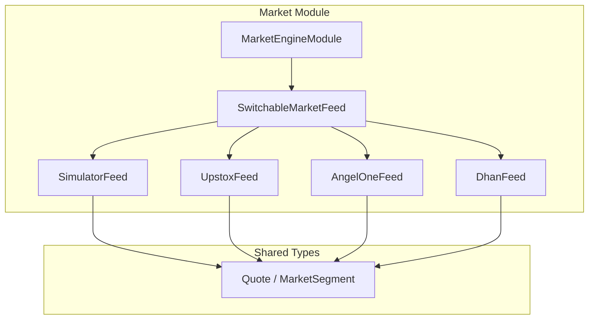
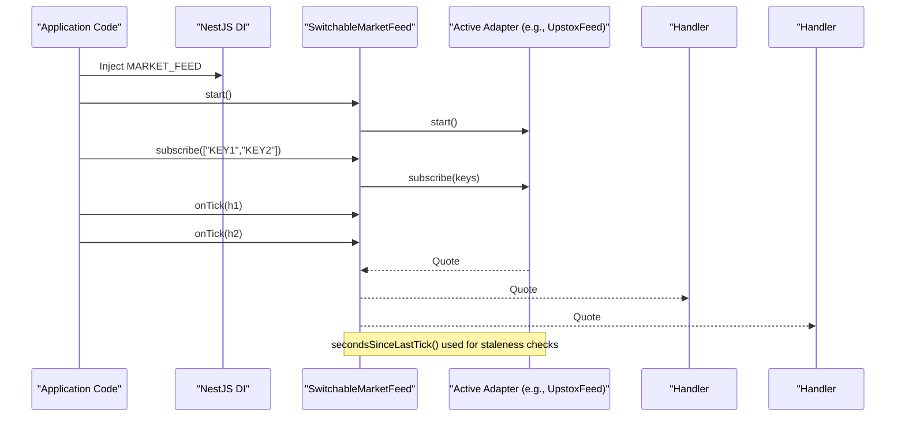
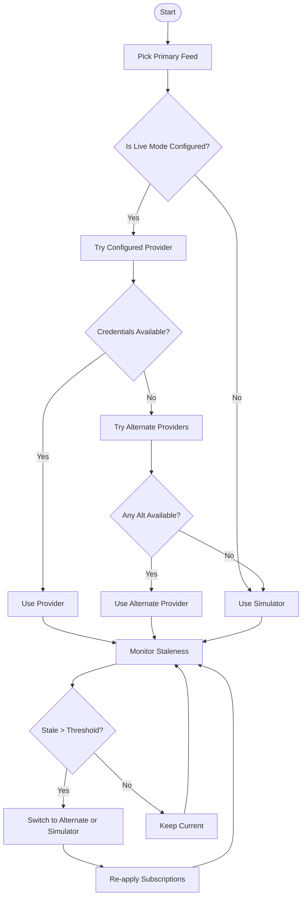
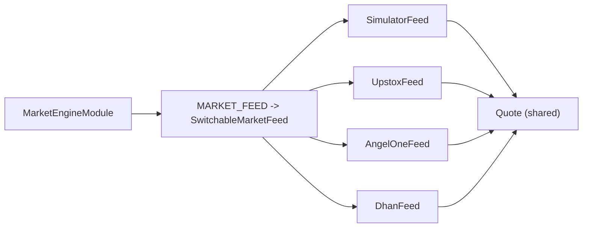

# Market Feed Interface

<cite>
**Referenced Files in This Document**
- [market-feed.port.ts](file://backend/apps/api/src/modules/market/infrastructure/feed/market-feed.port.ts)
- [switchable-market-feed.ts](file://backend/apps/api/src/modules/market/infrastructure/feed/switchable-market-feed.ts)
- [simulator-feed.ts](file://backend/apps/api/src/modules/market/infrastructure/feed/simulator-feed.ts)
- [upstox-feed.ts](file://backend/apps/api/src/modules/market/infrastructure/feed/upstox-feed.ts)
- [market.types.ts](file://backend/libs/shared/src/market/market.types.ts)
- [market-engine.module.ts](file://backend/apps/api/src/modules/market/market-engine.module.ts)
</cite>

## Table of Contents
1. Introduction
2. Project Structure
3. Core Components
4. Architecture Overview
5. Detailed Component Analysis
6. Dependency Analysis
7. Performance Considerations
8. Troubleshooting Guide
9. Conclusion

## Introduction
This document explains the MarketFeed interface abstraction that standardizes real-time market data streaming across multiple broker implementations. It covers the core methods (start, stop, subscribe, unsubscribe, onTick), the TickHandler callback type, and the Quote data structure used for live quotes. It also documents secondsSinceLastTick() for feed health monitoring, shows how to implement custom adapters, outlines error handling patterns, and describes subscription management best practices. Finally, it explains the MARKET_FEED dependency injection symbol that enables pluggable broker integrations.

## Project Structure
The market feed layer is implemented under the market module’s infrastructure/feed directory and shared types are defined in the shared library. The DI container wires a switchable feed that can route traffic to different providers at runtime.

**Diagram sources**
- [market-engine.module.ts:21-44](file://backend/apps/api/src/modules/market/market-engine.module.ts#L21-L44)
- [switchable-market-feed.ts:23-51](file://backend/apps/api/src/modules/market/infrastructure/feed/switchable-market-feed.ts#L23-L51)
- [simulator-feed.ts:25-38](file://backend/apps/api/src/modules/market/infrastructure/feed/simulator-feed.ts#L25-L38)
- [upstox-feed.ts:12-24](file://backend/apps/api/src/modules/market/infrastructure/feed/upstox-feed.ts#L12-L24)
- [market.types.ts:1-16](file://backend/libs/shared/src/market/market.types.ts#L1-L16)

**Section sources**
- [market-engine.module.ts:21-44](file://backend/apps/api/src/modules/market/market-engine.module.ts#L21-L44)
- [market.types.ts:1-16](file://backend/libs/shared/src/market/market.types.ts#L1-L16)

## Core Components
- MarketFeed interface: Defines the contract for all market data adapters with lifecycle and eventing methods.
- TickHandler: Callback signature invoked for each incoming quote.
- Quote: Canonical real-time quote payload containing price, change, bid/ask, volume, previous close, and timestamp.
- SwitchableMarketFeed: Runtime router that selects among simulator and live feeds, handles failover, and re-subscribes after switching.
- Concrete adapters: SimulatorFeed (deterministic synthetic), UpstoxFeed (WebSocket-based), plus other provider adapters.

Key responsibilities:
- start(): Initialize connections or timers.
- stop(): Clean up resources.
- subscribe()/unsubscribe(): Manage instrument subscriptions upstream.
- onTick(): Register handlers to receive Quote events.
- secondsSinceLastTick(): Report liveness by elapsed seconds since last tick.

**Section sources**
- [market-feed.port.ts:1-23](file://backend/apps/api/src/modules/market/infrastructure/feed/market-feed.port.ts#L1-L23)
- [market.types.ts:5-16](file://backend/libs/shared/src/market/market.types.ts#L5-L16)
- [switchable-market-feed.ts:23-102](file://backend/apps/api/src/modules/market/infrastructure/feed/switchable-market-feed.ts#L23-L102)
- [simulator-feed.ts:25-69](file://backend/apps/api/src/modules/market/infrastructure/feed/simulator-feed.ts#L25-L69)
- [upstox-feed.ts:12-134](file://backend/apps/api/src/modules/market/infrastructure/feed/upstox-feed.ts#L12-L134)

## Architecture Overview
The system uses a single injected MarketFeed instance. Consumers call start(), subscribe(), and register onTick handlers. Internally, SwitchableMarketFeed delegates to an active adapter and fans out ticks to registered handlers. It monitors feed freshness via secondsSinceLastTick() and can fail over to another live provider or simulator when stale.

**Diagram sources**
- [market-engine.module.ts:30-44](file://backend/apps/api/src/modules/market/market-engine.module.ts#L30-L44)
- [switchable-market-feed.ts:57-102](file://backend/apps/api/src/modules/market/infrastructure/feed/switchable-market-feed.ts#L57-L102)
- [upstox-feed.ts:26-89](file://backend/apps/api/src/modules/market/infrastructure/feed/upstox-feed.ts#L26-L89)

## Detailed Component Analysis

### MarketFeed Interface and Types
- Methods:
  - name: Identifier for the feed implementation.
  - start(): Async initialization.
  - stop(): Async teardown.
  - subscribe(instrumentKeys): Subscribe to one or more instruments.
  - unsubscribe(instrumentKeys): Unsubscribe from instruments.
  - onTick(handler): Register a TickHandler to receive Quote events.
  - secondsSinceLastTick(): Returns seconds since last received tick or null if none yet.
- TickHandler: Function receiving a Quote.
- Quote: Fields include instrumentKey, ltp, change, changePct, bid, ask, volume, prevClose, ts.

Best practices:
- Always call start() before subscribe().
- Store handler references if you need to remove them later (not required by this interface; keep your own registry if needed).
- Use secondsSinceLastTick() to detect stalls and trigger alerts or retries.

**Section sources**
- [market-feed.port.ts:1-23](file://backend/apps/api/src/modules/market/infrastructure/feed/market-feed.port.ts#L1-L23)
- [market.types.ts:5-16](file://backend/libs/shared/src/market/market.types.ts#L5-L16)

### SwitchableMarketFeed
Responsibilities:
- Selects primary feed based on configured mode and credential availability.
- Subscribes/unsubscribes on the active feed while tracking canonical keys.
- Fans out ticks from any active feed to all registered handlers.
- Monitors staleness and fails over to alternate live feeds or simulator when idle beyond threshold.
- Rebinds on configuration changes (feed mode or credentials).

Key behaviors:
- pickPrimary(): Chooses simulator or a configured live feed; falls back through alternatives.
- checkFailover(): Periodically checks secondsSinceLastTick() and switches if stale.
- switchTo(next): Stops previous feed, starts next, and re-applies subscriptions.

**Diagram sources**
- [switchable-market-feed.ts:104-184](file://backend/apps/api/src/modules/market/infrastructure/feed/switchable-market-feed.ts#L104-L184)

**Section sources**
- [switchable-market-feed.ts:23-184](file://backend/apps/api/src/modules/market/infrastructure/feed/switchable-market-feed.ts#L23-L184)

### SimulatorFeed
- Generates deterministic synthetic quotes for development and testing.
- Maintains per-instrument state (ltp, prevClose, volume) and emits ticks at a fixed interval.
- Supports pushTick() for replay-driven tests.
- Resolves base prices from reference closes, last candle, or segment-aware synthetic values.

Health and timing:
- secondsSinceLastTick() returns elapsed seconds since last generated or pushed tick.

**Section sources**
- [simulator-feed.ts:25-145](file://backend/apps/api/src/modules/market/infrastructure/feed/simulator-feed.ts#L25-L145)

### UpstoxFeed
- Connects to Upstox WebSocket using an access token obtained from credentials service.
- Authorizes feed URL, subscribes/unsubscribes via JSON messages, decodes binary protobuf messages into Quote objects.
- Implements exponential backoff reconnect strategy on connection close or errors.
- Updates lastTickAt on each decoded message for staleness checks.

Error handling highlights:
- Throws descriptive errors when authorization fails or token is missing.
- Logs warnings/errors and schedules reconnects on network issues.

**Section sources**
- [upstox-feed.ts:12-136](file://backend/apps/api/src/modules/market/infrastructure/feed/upstox-feed.ts#L12-L136)

### Quote Data Model
- instrumentKey: Canonical key identifying the instrument.
- ltp: Last traded price.
- change/changePct: Absolute and percentage change vs previous close.
- bid/ask: Best available prices.
- volume: Traded volume.
- prevClose: Previous day’s close.
- ts: Epoch milliseconds of the tick.

Usage:
- Published to consumers via onTick handlers.
- Used by services to cache, aggregate, and broadcast quotes.

**Section sources**
- [market.types.ts:5-16](file://backend/libs/shared/src/market/market.types.ts#L5-L16)

## Dependency Analysis
- MarketEngineModule provides MARKET_FEED bound to SwitchableMarketFeed.
- SwitchableMarketFeed depends on concrete feed implementations and services for mode and credentials.
- All adapters depend on Quote from the shared library.

**Diagram sources**
- [market-engine.module.ts:30-44](file://backend/apps/api/src/modules/market/market-engine.module.ts#L30-L44)
- [switchable-market-feed.ts:36-51](file://backend/apps/api/src/modules/market/infrastructure/feed/switchable-market-feed.ts#L36-L51)
- [market.types.ts:5-16](file://backend/libs/shared/src/market/market.types.ts#L5-L16)

**Section sources**
- [market-engine.module.ts:30-44](file://backend/apps/api/src/modules/market/market-engine.module.ts#L30-L44)

## Performance Considerations
- Subscription batching: Prefer subscribing to multiple instruments in one call to reduce overhead.
- Handler efficiency: Keep onTick handlers lightweight; offload heavy processing to background tasks.
- Staleness detection: Use secondsSinceLastTick() to avoid blocking on slow feeds; consider timeouts in consumers.
- Backpressure: If downstream consumers lag, consider buffering or dropping older ticks.
- Resource cleanup: Always call stop() during shutdown to release sockets and timers.

[No sources needed since this section provides general guidance]

## Troubleshooting Guide
Common issues and resolutions:
- No quotes received:
  - Verify start() was called and credentials are set for live feeds.
  - Check secondsSinceLastTick(); if null or increasing, the feed may be disconnected or misconfigured.
- Frequent reconnects:
  - Inspect logs for network errors; ensure stable connectivity and valid tokens.
  - Confirm rate limits and subscription payloads match provider requirements.
- Stale feed failover:
  - SwitchableMarketFeed will automatically switch if no ticks arrive within the configured threshold.
  - Review logs for failover events and verify alternate provider configuration.
- Missing instruments:
  - Ensure instruments are subscribed after start().
  - Validate instrumentKey format matches provider expectations.

Operational tips:
- Log secondsSinceLastTick() periodically to monitor health.
- On credential updates, allow the switchable feed to rebind automatically.
- For development, use simulator feed to validate pipelines without external dependencies.

**Section sources**
- [switchable-market-feed.ts:158-184](file://backend/apps/api/src/modules/market/infrastructure/feed/switchable-market-feed.ts#L158-L184)
- [upstox-feed.ts:26-97](file://backend/apps/api/src/modules/market/infrastructure/feed/upstox-feed.ts#L26-L97)

## Conclusion
The MarketFeed interface provides a clean, consistent abstraction for real-time market data across multiple brokers. SwitchableMarketFeed adds resilience by selecting and switching between providers and simulator, while secondsSinceLastTick() enables robust health monitoring. By adhering to the documented patterns for lifecycle management, subscription handling, and error strategies, teams can integrate new broker adapters seamlessly and maintain reliable market data pipelines.

[No sources needed since this section summarizes without analyzing specific files]