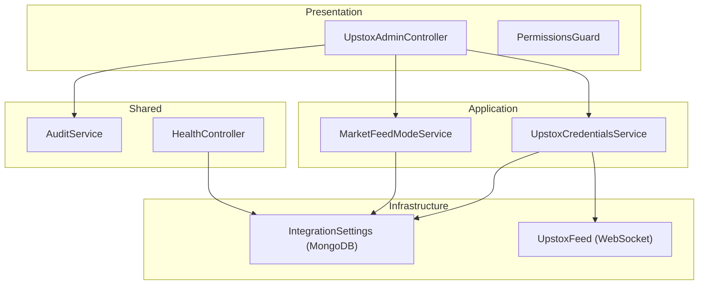
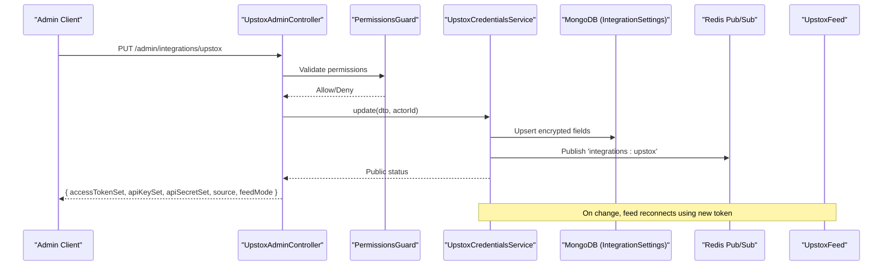
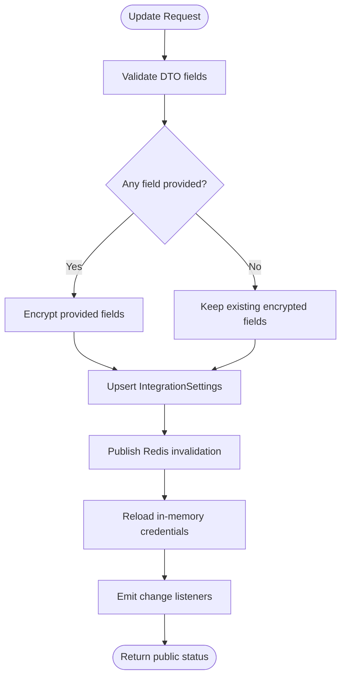
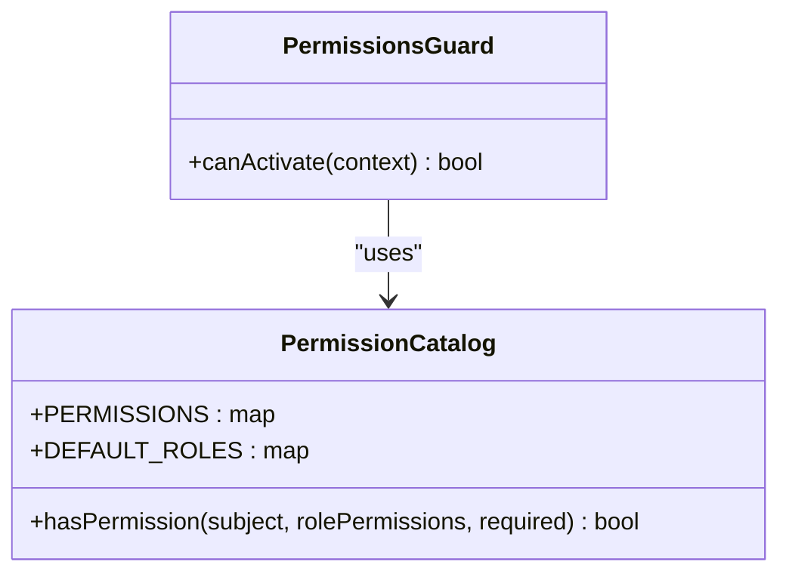
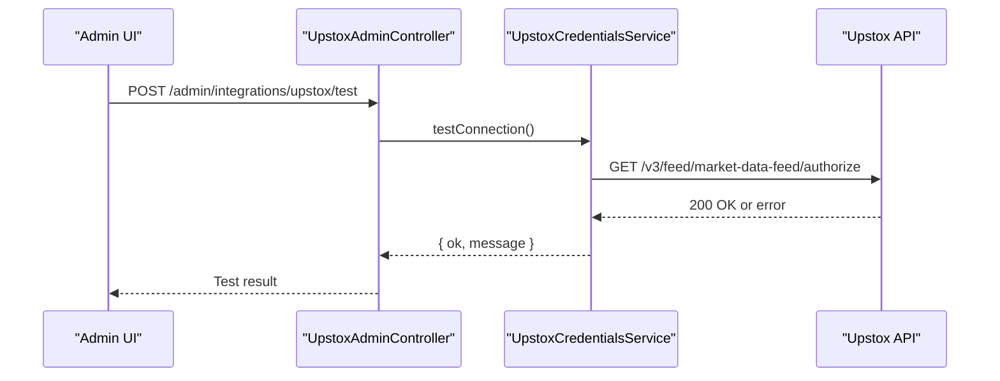
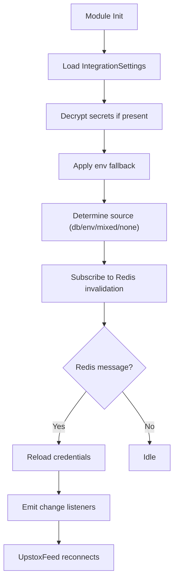
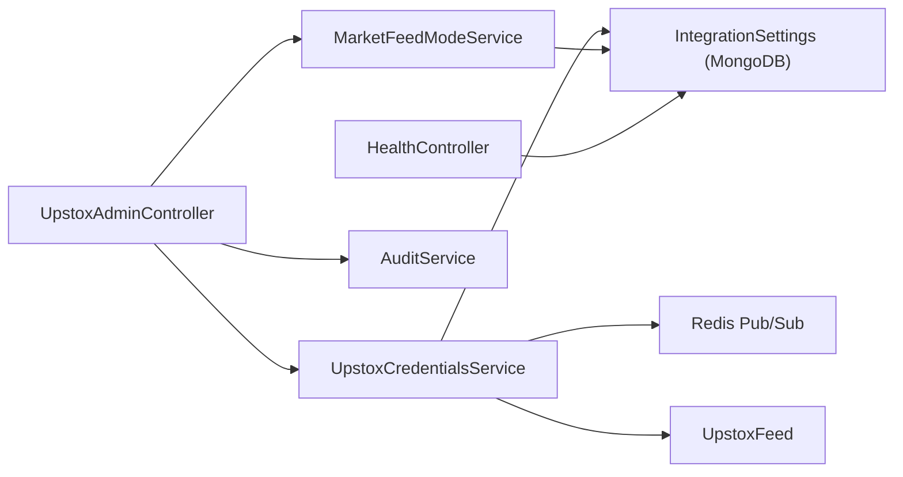

# Admin Configuration & Monitoring

<cite>
**Referenced Files in This Document**
- [upstox-admin.controller.ts](file://backend/apps/api/src/modules/market/presentation/upstox-admin.controller.ts)
- [upstox-credentials.service.ts](file://backend/apps/api/src/modules/market/application/upstox-credentials.service.ts)
- [integration-settings.schema.ts](file://backend/apps/api/src/modules/market/infrastructure/schemas/integration-settings.schema.ts)
- [crypto.util.ts](file://backend/apps/api/src/modules/auth/infrastructure/crypto.util.ts)
- [permissions.guard.ts](file://backend/apps/api/src/modules/admin/presentation/permissions.guard.ts)
- [permissions.ts](file://backend/apps/api/src/modules/admin/domain/permissions.ts)
- [audit.service.ts](file://backend/libs/shared/src/audit/audit.service.ts)
- [audit-log.schema.ts](file://backend/libs/shared/src/audit/audit-log.schema.ts)
- [market-feed-mode.service.ts](file://backend/apps/api/src/modules/market/application/market-feed-mode.service.ts)
- [upstox-feed.ts](file://backend/apps/api/src/modules/market/infrastructure/feed/upstox-feed.ts)
- [health.controller.ts](file://backend/libs/shared/src/health/health.controller.ts)
</cite>

## Table of Contents
1. [Introduction](#introduction)
2. [Project Structure](#project-structure)
3. [Core Components](#core-components)
4. [Architecture Overview](#architecture-overview)
5. [Detailed Component Analysis](#detailed-component-analysis)
6. [Dependency Analysis](#dependency-analysis)
7. [Performance Considerations](#performance-considerations)
8. [Troubleshooting Guide](#troubleshooting-guide)
9. [Conclusion](#conclusion)
10. [Appendices](#appendices)

## Introduction
This document explains the Upstox broker administration and configuration interfaces, focusing on how administrators manage credentials, configure API keys, monitor connection status, and enforce secure access controls. It covers:
- Admin endpoints for Upstox integration management
- Configuration schema validation and credential encryption at rest
- Permission-based access control for administrative operations
- Monitoring capabilities including connection health checks, subscription tracking, and performance metrics
- Programmatic configuration updates, automated credential rotation patterns, and alerting strategies
- Security best practices, audit logging, and disaster recovery procedures

## Project Structure
The Upstox admin functionality is implemented across presentation, application, infrastructure, and shared layers:
- Presentation layer exposes REST endpoints guarded by authentication and permissions
- Application layer encapsulates business logic for credentials and feed mode
- Infrastructure layer stores encrypted settings and implements market data feeds
- Shared services provide auditing, health checks, and common utilities

**Diagram sources**
- [upstox-admin.controller.ts:32-84](file://backend/apps/api/src/modules/market/presentation/upstox-admin.controller.ts#L32-L84)
- [upstox-credentials.service.ts:43-215](file://backend/apps/api/src/modules/market/application/upstox-credentials.service.ts#L43-L215)
- [market-feed-mode.service.ts:20-99](file://backend/apps/api/src/modules/market/application/market-feed-mode.service.ts#L20-L99)
- [integration-settings.schema.ts:9-37](file://backend/apps/api/src/modules/market/infrastructure/schemas/integration-settings.schema.ts#L9-L37)
- [upstox-feed.ts:12-136](file://backend/apps/api/src/modules/market/infrastructure/feed/upstox-feed.ts#L12-L136)
- [audit.service.ts:23-45](file://backend/libs/shared/src/audit/audit.service.ts#L23-L45)
- [health.controller.ts:19-55](file://backend/libs/shared/src/health/health.controller.ts#L19-L55)

**Section sources**
- [upstox-admin.controller.ts:32-84](file://backend/apps/api/src/modules/market/presentation/upstox-admin.controller.ts#L32-L84)
- [upstox-credentials.service.ts:43-215](file://backend/apps/api/src/modules/market/application/upstox-credentials.service.ts#L43-L215)
- [market-feed-mode.service.ts:20-99](file://backend/apps/api/src/modules/market/application/market-feed-mode.service.ts#L20-L99)
- [integration-settings.schema.ts:9-37](file://backend/apps/api/src/modules/market/infrastructure/schemas/integration-settings.schema.ts#L9-L37)
- [upstox-feed.ts:12-136](file://backend/apps/api/src/modules/market/infrastructure/feed/upstox-feed.ts#L12-L136)
- [audit.service.ts:23-45](file://backend/libs/shared/src/audit/audit.service.ts#L23-L45)
- [health.controller.ts:19-55](file://backend/libs/shared/src/health/health.controller.ts#L19-L55)

## Core Components
- UpstoxAdminController: Exposes GET/PUT/POST endpoints to read status, update credentials, and test connectivity. All endpoints require employee authentication and specific permissions.
- UpstoxCredentialsService: Manages runtime credentials with DB-first resolution and environment fallback. Encrypts secrets at rest and broadcasts changes via Redis for hot reload.
- MarketFeedModeService: Tracks active market feed mode (simulator/upstox/angel/dhan), persisted in DB and synchronized across processes via Redis.
- PermissionsGuard and permission catalog: Enforce fine-grained RBAC for admin operations.
- AuditService: Immutable audit trail for configuration changes, capturing actor, action, entity, before/after state, and IP.
- HealthController: Liveness/readiness endpoint verifying MongoDB and Redis availability.

**Section sources**
- [upstox-admin.controller.ts:32-84](file://backend/apps/api/src/modules/market/presentation/upstox-admin.controller.ts#L32-L84)
- [upstox-credentials.service.ts:43-215](file://backend/apps/api/src/modules/market/application/upstox-credentials.service.ts#L43-L215)
- [market-feed-mode.service.ts:20-99](file://backend/apps/api/src/modules/market/application/market-feed-mode.service.ts#L20-L99)
- [permissions.guard.ts:18-42](file://backend/apps/api/src/modules/admin/presentation/permissions.guard.ts#L18-L42)
- [permissions.ts:5-65](file://backend/apps/api/src/modules/admin/domain/permissions.ts#L5-L65)
- [audit.service.ts:23-45](file://backend/libs/shared/src/audit/audit.service.ts#L23-L45)
- [health.controller.ts:19-55](file://backend/libs/shared/src/health/health.controller.ts#L19-L55)

## Architecture Overview
The admin flow enforces authentication and authorization before reaching business logic. Credentials are stored encrypted in MongoDB and loaded into memory with environment fallback. Changes trigger Redis invalidation so both API and engine components can reload without restarts. The Upstox feed uses a WebSocket connection that reconnects automatically when credentials change or network errors occur.

**Diagram sources**
- [upstox-admin.controller.ts:50-77](file://backend/apps/api/src/modules/market/presentation/upstox-admin.controller.ts#L50-L77)
- [permissions.guard.ts:26-42](file://backend/apps/api/src/modules/admin/presentation/permissions.guard.ts#L26-L42)
- [upstox-credentials.service.ts:112-145](file://backend/apps/api/src/modules/market/application/upstox-credentials.service.ts#L112-L145)
- [upstox-feed.ts:31-39](file://backend/apps/api/src/modules/market/infrastructure/feed/upstox-feed.ts#L31-L39)

## Detailed Component Analysis

### Admin Endpoints for Upstox Management
- GET /admin/integrations/upstox: Returns public status (which fields are set, masked previews, source, timestamps) and current feed mode. Requires instruments.manage permission.
- PUT /admin/integrations/upstox: Updates accessToken, apiKey, apiSecret, or clears them via boolean flags. Validates input, encrypts values, persists to DB, publishes Redis invalidation, reloads in-memory state, and records an audit log.
- POST /admin/integrations/upstox/test: Tests connectivity by calling Upstox authorize endpoint with the configured access token.

Validation and security:
- DTO validation ensures optional string fields and boolean clear flags are correctly typed.
- PermissionsGuard enforces required permissions; unauthorized requests are denied.
- AuditService logs actor, action, entity, after-state, and IP for every successful update.

**Section sources**
- [upstox-admin.controller.ts:12-30](file://backend/apps/api/src/modules/market/presentation/upstox-admin.controller.ts#L12-L30)
- [upstox-admin.controller.ts:41-83](file://backend/apps/api/src/modules/market/presentation/upstox-admin.controller.ts#L41-L83)
- [permissions.guard.ts:26-42](file://backend/apps/api/src/modules/admin/presentation/permissions.guard.ts#L26-L42)
- [audit.service.ts:29-35](file://backend/libs/shared/src/audit/audit.service.ts#L29-L35)

### Credential Storage and Encryption
- IntegrationSettings schema stores provider-specific settings, including encrypted accessTokenEnc, apiKeyEnc, and apiSecretEnc.
- Encryption uses AES-256-GCM with a key derived from DATA_ENC_SECRET; payloads are iv.tag.ciphertext base64url.
- Decryption occurs during reload; failures are logged but do not crash the service.
- Source determination indicates whether credentials come from database, environment, mixed, or none.

**Diagram sources**
- [upstox-credentials.service.ts:112-145](file://backend/apps/api/src/modules/market/application/upstox-credentials.service.ts#L112-L145)
- [crypto.util.ts:9-24](file://backend/apps/api/src/modules/auth/infrastructure/crypto.util.ts#L9-L24)
- [integration-settings.schema.ts:9-37](file://backend/apps/api/src/modules/market/infrastructure/schemas/integration-settings.schema.ts#L9-L37)

**Section sources**
- [integration-settings.schema.ts:9-37](file://backend/apps/api/src/modules/market/infrastructure/schemas/integration-settings.schema.ts#L9-L37)
- [crypto.util.ts:9-24](file://backend/apps/api/src/modules/auth/infrastructure/crypto.util.ts#L9-L24)
- [upstox-credentials.service.ts:172-214](file://backend/apps/api/src/modules/market/application/upstox-credentials.service.ts#L172-L214)

### Permission-Based Access Controls
- PermissionsGuard reads required permissions from metadata and validates against the live employee record.
- Permission catalog defines granular permissions; instruments.manage is required for Upstox admin endpoints.
- Deny-wins semantics ensure explicit denies override grants, including wildcard permissions.

**Diagram sources**
- [permissions.guard.ts:18-42](file://backend/apps/api/src/modules/admin/presentation/permissions.guard.ts#L18-L42)
- [permissions.ts:5-65](file://backend/apps/api/src/modules/admin/domain/permissions.ts#L5-L65)

**Section sources**
- [permissions.guard.ts:26-42](file://backend/apps/api/src/modules/admin/presentation/permissions.guard.ts#L26-L42)
- [permissions.ts:5-65](file://backend/apps/api/src/modules/admin/domain/permissions.ts#L5-L65)

### Monitoring Capabilities
- Connection health: HealthController verifies MongoDB and Redis availability; returns 503 if dependencies are down.
- Upstox connection test: POST /admin/integrations/upstox/test calls Upstox authorize endpoint to validate token validity for market feed.
- Subscription tracking: UpstoxFeed tracks subscribed instrument keys and reports seconds since last tick for liveness monitoring.
- Performance metrics: Last tick timestamp enables calculating staleness; backoff and reconnection delays are logged.

**Diagram sources**
- [upstox-admin.controller.ts:79-83](file://backend/apps/api/src/modules/market/presentation/upstox-admin.controller.ts#L79-L83)
- [upstox-credentials.service.ts:147-162](file://backend/apps/api/src/modules/market/application/upstox-credentials.service.ts#L147-L162)

**Section sources**
- [health.controller.ts:19-55](file://backend/libs/shared/src/health/health.controller.ts#L19-L55)
- [upstox-credentials.service.ts:147-162](file://backend/apps/api/src/modules/market/application/upstox-credentials.service.ts#L147-L162)
- [upstox-feed.ts:110-134](file://backend/apps/api/src/modules/market/infrastructure/feed/upstox-feed.ts#L110-L134)

### Data Flows and Processing Logic
- Credentials loading: On module init, UpstoxCredentialsService loads DB row, decrypts secrets, applies environment fallback, determines source, and subscribes to Redis invalidation channel.
- Hot reload: On Redis message, service reloads credentials and emits change events; UpstoxFeed listens and reconnects.
- Feed mode: MarketFeedModeService similarly reloads from DB/environment and broadcasts changes via Redis.

**Diagram sources**
- [upstox-credentials.service.ts:70-79](file://backend/apps/api/src/modules/market/application/upstox-credentials.service.ts#L70-L79)
- [upstox-credentials.service.ts:172-214](file://backend/apps/api/src/modules/market/application/upstox-credentials.service.ts#L172-L214)
- [upstox-feed.ts:31-39](file://backend/apps/api/src/modules/market/infrastructure/feed/upstox-feed.ts#L31-L39)

**Section sources**
- [upstox-credentials.service.ts:70-79](file://backend/apps/api/src/modules/market/application/upstox-credentials.service.ts#L70-L79)
- [upstox-credentials.service.ts:172-214](file://backend/apps/api/src/modules/market/application/upstox-credentials.service.ts#L172-L214)
- [upstox-feed.ts:31-39](file://backend/apps/api/src/modules/market/infrastructure/feed/upstox-feed.ts#L31-L39)

### Security Best Practices
- Encrypt sensitive fields at rest using AES-256-GCM with a strong secret derived from DATA_ENC_SECRET.
- Mask secrets in public status responses to avoid leaking sensitive information.
- Enforce RBAC with PermissionsGuard; require specific permissions for admin operations.
- Record immutable audit logs for all configuration changes, capturing actor, action, entity, before/after state, and IP.
- Use Redis pub/sub to invalidate caches and trigger safe reloads without exposing secrets.

**Section sources**
- [crypto.util.ts:9-24](file://backend/apps/api/src/modules/auth/infrastructure/crypto.util.ts#L9-L24)
- [upstox-credentials.service.ts:98-110](file://backend/apps/api/src/modules/market/application/upstox-credentials.service.ts#L98-L110)
- [permissions.guard.ts:26-42](file://backend/apps/api/src/modules/admin/presentation/permissions.guard.ts#L26-L42)
- [audit.service.ts:29-35](file://backend/libs/shared/src/audit/audit.service.ts#L29-L35)

### Disaster Recovery Procedures
- Backup strategy: Regularly back up MongoDB collections integrations and app_config; ensure DATA_ENC_SECRET is securely managed and backed up separately.
- Restore procedure: Restore encrypted fields from backup; verify decryption succeeds; confirm source determination and feed mode.
- Rotation plan: Rotate DATA_ENC_SECRET by re-encrypting stored secrets with the new secret; update environment variables; validate reload and feed connectivity.
- Fallback: If DB restore fails, rely on environment variables as temporary fallback; ensure they are rotated promptly.

[No sources needed since this section provides general guidance]

## Dependency Analysis
Components interact through well-defined boundaries:
- Controllers depend on services for business logic and guards for authorization
- Services depend on Mongoose models for persistence and Redis for pub/sub
- Feeds depend on credentials services for tokens and reconnect on changes
- Shared services provide cross-cutting concerns like auditing and health checks

**Diagram sources**
- [upstox-admin.controller.ts:32-84](file://backend/apps/api/src/modules/market/presentation/upstox-admin.controller.ts#L32-L84)
- [upstox-credentials.service.ts:43-215](file://backend/apps/api/src/modules/market/application/upstox-credentials.service.ts#L43-L215)
- [market-feed-mode.service.ts:20-99](file://backend/apps/api/src/modules/market/application/market-feed-mode.service.ts#L20-L99)
- [upstox-feed.ts:12-136](file://backend/apps/api/src/modules/market/infrastructure/feed/upstox-feed.ts#L12-L136)
- [health.controller.ts:19-55](file://backend/libs/shared/src/health/health.controller.ts#L19-L55)

**Section sources**
- [upstox-admin.controller.ts:32-84](file://backend/apps/api/src/modules/market/presentation/upstox-admin.controller.ts#L32-L84)
- [upstox-credentials.service.ts:43-215](file://backend/apps/api/src/modules/market/application/upstox-credentials.service.ts#L43-L215)
- [market-feed-mode.service.ts:20-99](file://backend/apps/api/src/modules/market/application/market-feed-mode.service.ts#L20-L99)
- [upstox-feed.ts:12-136](file://backend/apps/api/src/modules/market/infrastructure/feed/upstox-feed.ts#L12-L136)
- [health.controller.ts:19-55](file://backend/libs/shared/src/health/health.controller.ts#L19-L55)

## Performance Considerations
- Avoid unnecessary reconnections: UpstoxFeed uses exponential backoff capped at 30 seconds to prevent storming the broker.
- Minimize DB reads: Credentials are cached in memory; reload only on explicit changes or Redis invalidation.
- Efficient masking: Public status masks secrets efficiently without exposing full values.
- Health checks: HealthController performs parallel pings to reduce latency.

[No sources needed since this section provides general guidance]

## Troubleshooting Guide
Common issues and resolutions:
- No access token configured: Ensure PUT /admin/integrations/upstox sets accessToken; test via POST /admin/integrations/upstox/test.
- Invalid credentials: Check Upstox authorize response; verify DATA_ENC_SECRET and decrypted values.
- Feed not reconnecting: Confirm Redis invalidation channel is working; check logs for reload errors.
- Permission denied: Verify employee has instruments.manage permission; check role assignments.
- Health check failures: Investigate MongoDB and Redis connectivity; review dependency status.

**Section sources**
- [upstox-credentials.service.ts:147-162](file://backend/apps/api/src/modules/market/application/upstox-credentials.service.ts#L147-L162)
- [upstox-feed.ts:35-39](file://backend/apps/api/src/modules/market/infrastructure/feed/upstox-feed.ts#L35-L39)
- [permissions.guard.ts:34-38](file://backend/apps/api/src/modules/admin/presentation/permissions.guard.ts#L34-L38)
- [health.controller.ts:27-35](file://backend/libs/shared/src/health/health.controller.ts#L27-L35)

## Conclusion
The Upstox administration interface provides secure, auditable, and observable management of broker credentials and feed configuration. With encrypted storage, RBAC enforcement, Redis-based hot reload, and robust monitoring, operators can confidently manage integrations while maintaining security and reliability.

[No sources needed since this section summarizes without analyzing specific files]

## Appendices

### API Definitions
- GET /admin/integrations/upstox
  - Purpose: Read Upstox integration status and feed mode
  - Auth: EmployeeAuthGuard + PermissionsGuard (instruments.manage)
  - Response: Provider, field set flags, masked previews, source, timestamps, feedMode

- PUT /admin/integrations/upstox
  - Purpose: Update Upstox credentials or clear fields
  - Auth: EmployeeAuthGuard + PermissionsGuard (instruments.manage)
  - Body: Optional accessToken, apiKey, apiSecret; optional clearAccessToken, clearApiKey, clearApiSecret
  - Response: Updated public status and feedMode

- POST /admin/integrations/upstox/test
  - Purpose: Test Upstox market feed authorization
  - Auth: EmployeeAuthGuard + PermissionsGuard (instruments.manage)
  - Response: ok boolean and message

- GET /health
  - Purpose: Liveness/readiness check
  - Response: Status, uptime, dependency states

**Section sources**
- [upstox-admin.controller.ts:41-83](file://backend/apps/api/src/modules/market/presentation/upstox-admin.controller.ts#L41-L83)
- [health.controller.ts:26-35](file://backend/libs/shared/src/health/health.controller.ts#L26-L35)

### Audit Logging Schema
- Collection: audit_logs
- Fields: actorType, actorId, action, entity, entityId, before, after, ip, at
- Indices: entity+entityId+at, actorId+at, at

**Section sources**
- [audit-log.schema.ts:6-41](file://backend/libs/shared/src/audit/audit-log.schema.ts#L6-L41)

### Configuration Schema
- Collection: integrations
- Fields: provider, feedMode, accessTokenEnc, apiKeyEnc, apiSecretEnc, clientCode, feedTokenEnc, updatedBy
- Constraints: provider unique; feedMode enum; timestamps enabled

**Section sources**
- [integration-settings.schema.ts:9-37](file://backend/apps/api/src/modules/market/infrastructure/schemas/integration-settings.schema.ts#L9-L37)