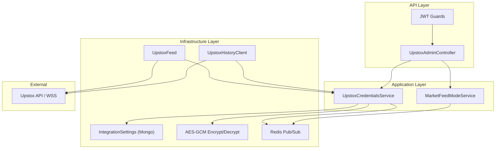
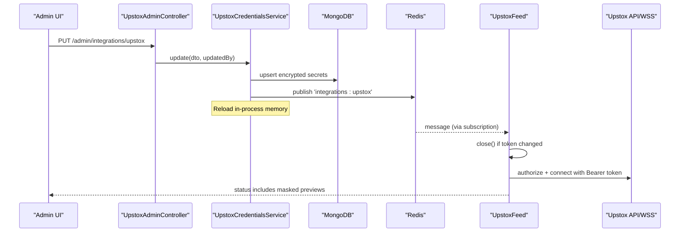
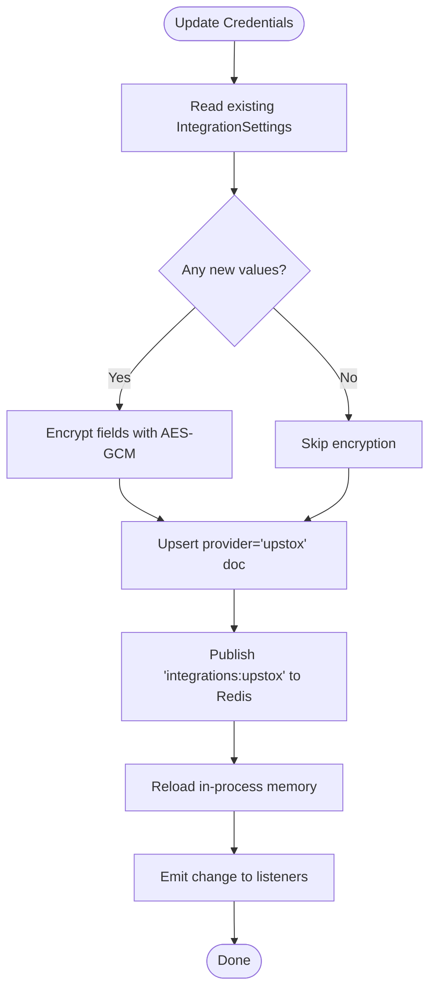
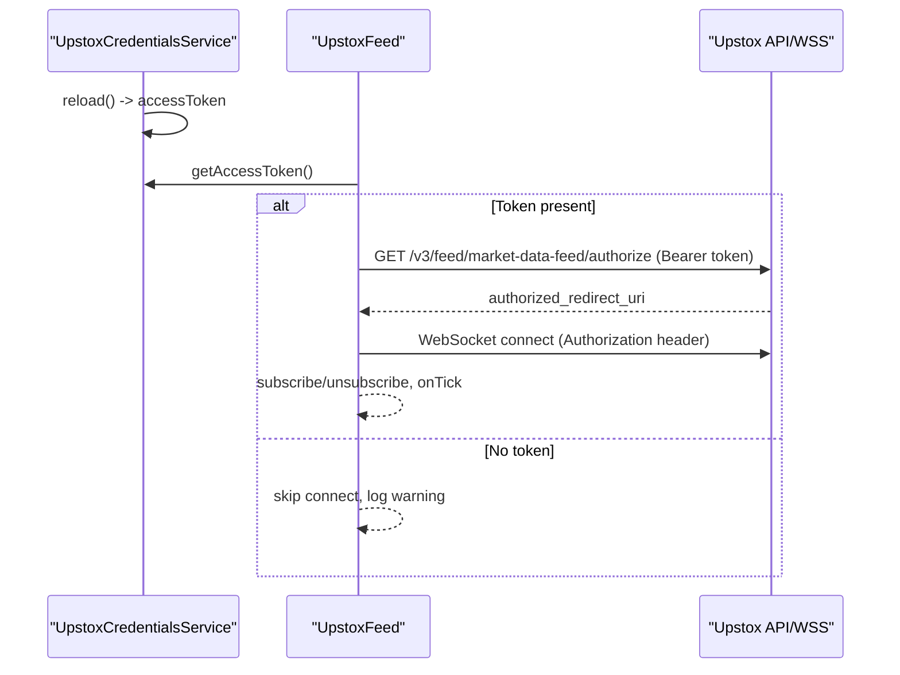
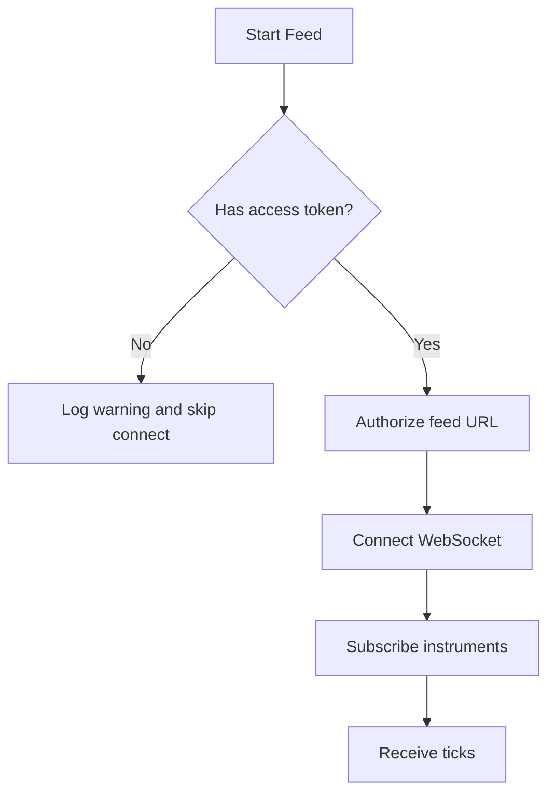
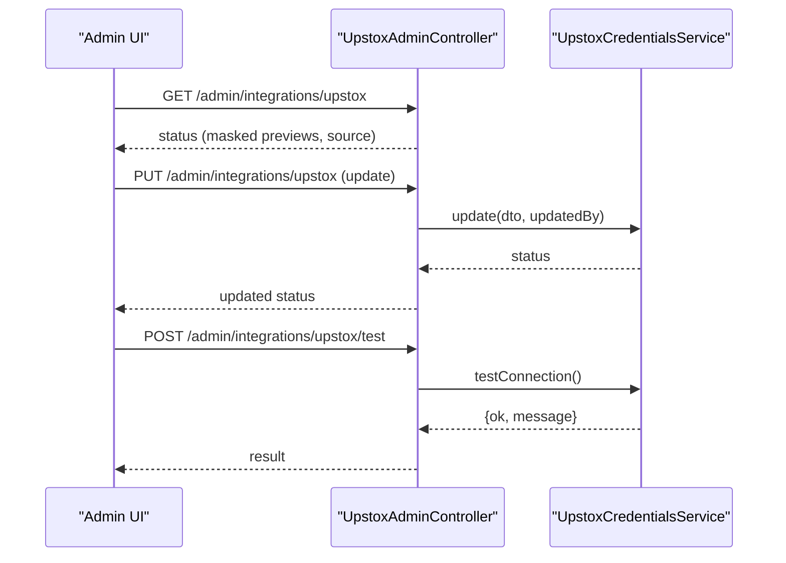
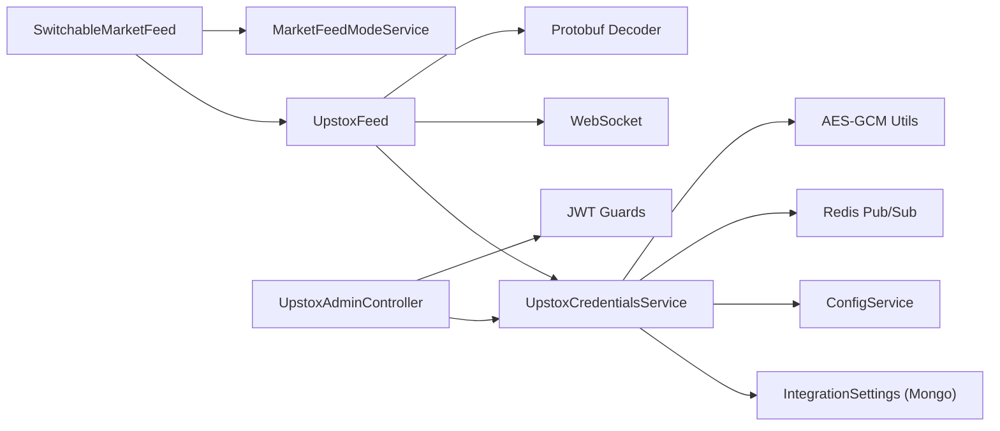

# Upstox Authentication & Authorization

<cite>
**Referenced Files in This Document**
- [upstox-credentials.service.ts](file://backend/apps/api/src/modules/market/application/upstox-credentials.service.ts)
- [upstox-feed.ts](file://backend/apps/api/src/modules/market/infrastructure/feed/upstox-feed.ts)
- [integration-settings.schema.ts](file://backend/apps/api/src/modules/market/infrastructure/schemas/integration-settings.schema.ts)
- [crypto.util.ts](file://backend/apps/api/src/modules/auth/infrastructure/crypto.util.ts)
- [jwt-auth.guard.ts](file://backend/apps/api/src/modules/auth/presentation/jwt-auth.guard.ts)
- [token.service.ts](file://backend/apps/api/src/modules/auth/infrastructure/token.service.ts)
- [auth.service.ts](file://backend/apps/api/src/modules/auth/application/auth.service.ts)
- [upstox-admin.controller.ts](file://backend/apps/api/src/modules/market/presentation/upstox-admin.controller.ts)
- [market-feed-mode.service.ts](file://backend/apps/api/src/modules/market/application/market-feed-mode.service.ts)
- [switchable-market-feed.ts](file://backend/apps/api/src/modules/market/infrastructure/feed/switchable-market-feed.ts)
- [upstox-history.client.ts](file://backend/apps/api/src/modules/market/infrastructure/upstox-history.client.ts)
- [env.schema.ts](file://backend/libs/shared/src/config/env.schema.ts)
- [docker-compose.yml](file://deploy/docker-compose.yml)
- [page.tsx (Admin Upstox UI)](file://frontend/trader/src/app/admin/upstox/page.tsx)
</cite>

## Table of Contents
1. [Introduction](#introduction)
2. [Project Structure](#project-structure)
3. [Core Components](#core-components)
4. [Architecture Overview](#architecture-overview)
5. [Detailed Component Analysis](#detailed-component-analysis)
6. [Dependency Analysis](#dependency-analysis)
7. [Performance Considerations](#performance-considerations)
8. [Troubleshooting Guide](#troubleshooting-guide)
9. [Conclusion](#conclusion)
10. [Appendices](#appendices)

## Introduction
This document explains how the system authenticates and authorizes access to Upstox services, focusing on credential management, token handling, session lifecycle, and operational controls. It covers:
- Where credentials are stored and how they are protected at rest
- How access tokens are loaded and used for market data feeds and historical APIs
- How admin-managed updates propagate live without restarts
- How authentication guards protect administrative endpoints
- Error handling for missing or invalid tokens and fallback behavior
- Security considerations for sensitive configuration

## Project Structure
The Upstox integration spans application, infrastructure, presentation, and shared layers:
- Application layer manages credentials and feed mode
- Infrastructure layer implements feed connections and persistence schemas
- Presentation layer exposes admin endpoints and a frontend UI
- Shared layer defines environment schema and utilities



**Diagram sources**
- [upstox-admin.controller.ts:32-84](file://backend/apps/api/src/modules/market/presentation/upstox-admin.controller.ts#L32-L84)
- [upstox-credentials.service.ts:43-215](file://backend/apps/api/src/modules/market/application/upstox-credentials.service.ts#L43-L215)
- [upstox-feed.ts:12-135](file://backend/apps/api/src/modules/market/infrastructure/feed/upstox-feed.ts#L12-L135)
- [integration-settings.schema.ts:9-39](file://backend/apps/api/src/modules/market/infrastructure/schemas/integration-settings.schema.ts#L9-L39)
- [crypto.util.ts:9-24](file://backend/apps/api/src/modules/auth/infrastructure/crypto.util.ts#L9-L24)
- [market-feed-mode.service.ts:20-98](file://backend/apps/api/src/modules/market/application/market-feed-mode.service.ts#L20-L98)

**Section sources**
- [upstox-admin.controller.ts:32-84](file://backend/apps/api/src/modules/market/presentation/upstox-admin.controller.ts#L32-L84)
- [upstox-credentials.service.ts:43-215](file://backend/apps/api/src/modules/market/application/upstox-credentials.service.ts#L43-L215)
- [upstox-feed.ts:12-135](file://backend/apps/api/src/modules/market/infrastructure/feed/upstox-feed.ts#L12-L135)
- [integration-settings.schema.ts:9-39](file://backend/apps/api/src/modules/market/infrastructure/schemas/integration-settings.schema.ts#L9-L39)
- [crypto.util.ts:9-24](file://backend/apps/api/src/modules/auth/infrastructure/crypto.util.ts#L9-L24)
- [market-feed-mode.service.ts:20-98](file://backend/apps/api/src/modules/market/application/market-feed-mode.service.ts#L20-L98)

## Core Components
- UpstoxCredentialsService: Loads, stores, and serves Upstox secrets; supports DB-first with env fallback; hot-reloads via Redis; exposes status and connection test.
- UpstoxFeed: Connects to Upstox WebSocket using the current access token; reconnects on credential changes; handles subscribe/unsubscribe and tick delivery.
- MarketFeedModeService: Manages active feed mode (simulator/live providers) with runtime reload via Redis.
- SwitchableMarketFeed: Chooses primary feed based on configured mode and availability; can fail over when needed.
- JWT Guards and TokenService: Protect admin endpoints and manage user/employee sessions and tokens.
- IntegrationSettings schema: Stores encrypted Upstox secrets and feed mode in MongoDB.
- AES-GCM encryption utilities: Securely store secrets at rest.

**Section sources**
- [upstox-credentials.service.ts:43-215](file://backend/apps/api/src/modules/market/application/upstox-credentials.service.ts#L43-L215)
- [upstox-feed.ts:12-135](file://backend/apps/api/src/modules/market/infrastructure/feed/upstox-feed.ts#L12-L135)
- [market-feed-mode.service.ts:20-98](file://backend/apps/api/src/modules/market/application/market-feed-mode.service.ts#L20-L98)
- [switchable-market-feed.ts:23-116](file://backend/apps/api/src/modules/market/infrastructure/feed/switchable-market-feed.ts#L23-L116)
- [jwt-auth.guard.ts:10-34](file://backend/apps/api/src/modules/auth/presentation/jwt-auth.guard.ts#L10-L34)
- [token.service.ts:20-89](file://backend/apps/api/src/modules/auth/infrastructure/token.service.ts#L20-L89)
- [integration-settings.schema.ts:9-39](file://backend/apps/api/src/modules/market/infrastructure/schemas/integration-settings.schema.ts#L9-L39)
- [crypto.util.ts:9-24](file://backend/apps/api/src/modules/auth/infrastructure/crypto.util.ts#L9-L24)

## Architecture Overview
The system uses a layered approach:
- Admin UI calls protected endpoints to update credentials and feed mode
- Credentials are encrypted and persisted; live processes reload via Redis pub/sub
- Market feed adapters use the latest credentials to connect to Upstox
- Historical data clients also consume the same credentials



**Diagram sources**
- [upstox-admin.controller.ts:50-84](file://backend/apps/api/src/modules/market/presentation/upstox-admin.controller.ts#L50-L84)
- [upstox-credentials.service.ts:112-162](file://backend/apps/api/src/modules/market/application/upstox-credentials.service.ts#L112-L162)
- [upstox-feed.ts:26-64](file://backend/apps/api/src/modules/market/infrastructure/feed/upstox-feed.ts#L26-L64)

## Detailed Component Analysis

### Credential Management and Storage
- Secrets source priority: database (encrypted) > environment variables
- Encryption: AES-256-GCM with key derived from DATA_ENC_SECRET; stored as iv.tag.ciphertext base64url
- Fields: accessTokenEnc, apiKeyEnc, apiSecretEnc
- Runtime reload: On module init and on Redis invalidation messages; listeners notify dependents
- Public status: masks secrets and reports source type (database/environment/mixed/none)



**Diagram sources**
- [upstox-credentials.service.ts:112-145](file://backend/apps/api/src/modules/market/application/upstox-credentials.service.ts#L112-L145)
- [crypto.util.ts:9-24](file://backend/apps/api/src/modules/auth/infrastructure/crypto.util.ts#L9-L24)

**Section sources**
- [upstox-credentials.service.ts:43-215](file://backend/apps/api/src/modules/market/application/upstox-credentials.service.ts#L43-L215)
- [integration-settings.schema.ts:9-39](file://backend/apps/api/src/modules/market/infrastructure/schemas/integration-settings.schema.ts#L9-L39)
- [crypto.util.ts:9-24](file://backend/apps/api/src/modules/auth/infrastructure/crypto.util.ts#L9-L24)

### Access Token Usage and Lifecycle
- Loading: Service loads token from DB row (decrypted) or env variable UPSTOX_ACCESS_TOKEN
- Usage:
  - UpstoxFeed uses token to authorize and connect to WebSocket feed
  - UpstoxHistoryClient uses token to call historical candle endpoints
- Validation: testConnection calls Upstox authorize endpoint to verify token validity
- Reconnection: On credential changes, feed closes and reconnects with new token



**Diagram sources**
- [upstox-credentials.service.ts:172-215](file://backend/apps/api/src/modules/market/application/upstox-credentials.service.ts#L172-L215)
- [upstox-feed.ts:48-108](file://backend/apps/api/src/modules/market/infrastructure/feed/upstox-feed.ts#L48-L108)
- [upstox-history.client.ts:51-92](file://backend/apps/api/src/modules/market/infrastructure/upstox-history.client.ts#L51-L92)

**Section sources**
- [upstox-credentials.service.ts:172-215](file://backend/apps/api/src/modules/market/application/upstox-credentials.service.ts#L172-L215)
- [upstox-feed.ts:48-108](file://backend/apps/api/src/modules/market/infrastructure/feed/upstox-feed.ts#L48-L108)
- [upstox-history.client.ts:51-92](file://backend/apps/api/src/modules/market/infrastructure/upstox-history.client.ts#L51-L92)

### OAuth Flow Integration and Token Refresh Strategy
- The codebase does not implement an OAuth flow or automatic token refresh for Upstox
- Tokens are expected to be provided externally and managed via:
  - Environment variables (UPSTOX_ACCESS_TOKEN, UPSTOX_API_KEY, UPSTOX_API_SECRET)
  - Admin UI storing encrypted tokens in the database
- Optional fields apiKey and apiSecret are stored for future token-refresh automation but are not currently used by any refresh logic

**Section sources**
- [upstox-credentials.service.ts:64-68](file://backend/apps/api/src/modules/market/application/upstox-credentials.service.ts#L64-L68)
- [upstox-credentials.service.ts:112-145](file://backend/apps/api/src/modules/market/application/upstox-credentials.service.ts#L112-L145)
- [env.schema.ts:44-46](file://backend/libs/shared/src/config/env.schema.ts#L44-L46)
- [docker-compose.yml:50-52](file://deploy/docker-compose.yml#L50-L52)
- [docker-compose.yml:96-98](file://deploy/docker-compose.yml#L96-L98)

### Authentication Validation and Session Handling
- Admin endpoints are protected by JWT-based guards that validate access tokens and enforce actor types (USER vs EMPLOYEE)
- TokenService issues RS256 signed access tokens and purpose-specific tokens; refresh tokens are opaque and hashed before storage
- Session rotation revokes old refresh tokens and issues new pairs; reuse of revoked tokens triggers family-wide revocation

```mermaid
classDiagram
class TokenService {
+signAccess(sub, actor, roles) string
+verifyAccess(token) AccessTokenClaims
+signPurpose(claims, ttlSeconds) string
+verifyPurpose(token, expected) PurposeTokenClaims
+newRefreshToken() { raw, hash, expiresAt }
+hashRefresh(raw) string
+passwordFingerprint(passwordHash) string
}
class JwtAuthGuard {
+canActivate(context) boolean
}
class AuthService {
+login(identifier, password, ctx) Result<TokenPair>
+refresh(rawToken, ctx) Result<TokenPair>
+logout(rawToken) Result<boolean>
+logoutAll(userId) Result<boolean>
}
JwtAuthGuard --> TokenService : "verifies access tokens"
AuthService --> TokenService : "issues/validates tokens"
```

**Diagram sources**
- [token.service.ts:20-89](file://backend/apps/api/src/modules/auth/infrastructure/token.service.ts#L20-L89)
- [jwt-auth.guard.ts:10-34](file://backend/apps/api/src/modules/auth/presentation/jwt-auth.guard.ts#L10-L34)
- [auth.service.ts:145-232](file://backend/apps/api/src/modules/auth/application/auth.service.ts#L145-L232)

**Section sources**
- [jwt-auth.guard.ts:10-34](file://backend/apps/api/src/modules/auth/presentation/jwt-auth.guard.ts#L10-L34)
- [token.service.ts:20-89](file://backend/apps/api/src/modules/auth/infrastructure/token.service.ts#L20-L89)
- [auth.service.ts:145-232](file://backend/apps/api/src/modules/auth/application/auth.service.ts#L145-L232)

### Fallback Mechanisms When Credentials Are Unavailable
- If no access token is configured (neither DB nor env), feed start logs a warning and skips connecting
- Historical client throws an error if token is missing; callers should handle this gracefully
- SwitchableMarketFeed can fall back to simulator or alternate live providers if primary is unavailable



**Diagram sources**
- [upstox-feed.ts:26-64](file://backend/apps/api/src/modules/market/infrastructure/feed/upstox-feed.ts#L26-L64)
- [upstox-history.client.ts:51-92](file://backend/apps/api/src/modules/market/infrastructure/upstox-history.client.ts#L51-L92)
- [switchable-market-feed.ts:104-116](file://backend/apps/api/src/modules/market/infrastructure/feed/switchable-market-feed.ts#L104-L116)

**Section sources**
- [upstox-feed.ts:26-64](file://backend/apps/api/src/modules/market/infrastructure/feed/upstox-feed.ts#L26-L64)
- [upstox-history.client.ts:51-92](file://backend/apps/api/src/modules/market/infrastructure/upstox-history.client.ts#L51-L92)
- [switchable-market-feed.ts:104-116](file://backend/apps/api/src/modules/market/infrastructure/feed/switchable-market-feed.ts#L104-L116)

### Admin Interface Setup and Monitoring
- Admin UI allows setting/clearing access token, API key, and API secret; also toggles feed mode
- Status endpoint returns masked previews and source type; test endpoint validates token against Upstox
- Changes propagate instantly via Redis pub/sub to running processes



**Diagram sources**
- [upstox-admin.controller.ts:41-84](file://backend/apps/api/src/modules/market/presentation/upstox-admin.controller.ts#L41-L84)
- [upstox-credentials.service.ts:147-162](file://backend/apps/api/src/modules/market/application/upstox-credentials.service.ts#L147-L162)
- [page.tsx (Admin Upstox UI):32-118](file://frontend/trader/src/app/admin/upstox/page.tsx#L32-L118)

**Section sources**
- [upstox-admin.controller.ts:41-84](file://backend/apps/api/src/modules/market/presentation/upstox-admin.controller.ts#L41-L84)
- [page.tsx (Admin Upstox UI):32-118](file://frontend/trader/src/app/admin/upstox/page.tsx#L32-L118)

## Dependency Analysis
- UpstoxCredentialsService depends on:
  - IntegrationSettings model (MongoDB)
  - ConfigService (DATA_ENC_SECRET and optional UPSTOX_* env vars)
  - Redis client and subscriber for pub/sub invalidation
  - crypto utilities for encrypt/decrypt
- UpstoxFeed depends on:
  - UpstoxCredentialsService for token
  - Protobuf utilities for decoding feed messages
  - WebSocket library for Upstox WSS
- SwitchableMarketFeed orchestrates multiple feed implementations and mode selection
- Admin endpoints depend on JWT guards and permissions



**Diagram sources**
- [upstox-credentials.service.ts:43-215](file://backend/apps/api/src/modules/market/application/upstox-credentials.service.ts#L43-L215)
- [upstox-feed.ts:12-135](file://backend/apps/api/src/modules/market/infrastructure/feed/upstox-feed.ts#L12-L135)
- [switchable-market-feed.ts:23-116](file://backend/apps/api/src/modules/market/infrastructure/feed/switchable-market-feed.ts#L23-L116)
- [market-feed-mode.service.ts:20-98](file://backend/apps/api/src/modules/market/application/market-feed-mode.service.ts#L20-L98)
- [upstox-admin.controller.ts:32-84](file://backend/apps/api/src/modules/market/presentation/upstox-admin.controller.ts#L32-L84)
- [jwt-auth.guard.ts:10-34](file://backend/apps/api/src/modules/auth/presentation/jwt-auth.guard.ts#L10-L34)

**Section sources**
- [upstox-credentials.service.ts:43-215](file://backend/apps/api/src/modules/market/application/upstox-credentials.service.ts#L43-L215)
- [upstox-feed.ts:12-135](file://backend/apps/api/src/modules/market/infrastructure/feed/upstox-feed.ts#L12-L135)
- [switchable-market-feed.ts:23-116](file://backend/apps/api/src/modules/market/infrastructure/feed/switchable-market-feed.ts#L23-L116)
- [market-feed-mode.service.ts:20-98](file://backend/apps/api/src/modules/market/application/market-feed-mode.service.ts#L20-L98)
- [upstox-admin.controller.ts:32-84](file://backend/apps/api/src/modules/market/presentation/upstox-admin.controller.ts#L32-L84)
- [jwt-auth.guard.ts:10-34](file://backend/apps/api/src/modules/auth/presentation/jwt-auth.guard.ts#L10-L34)

## Performance Considerations
- Hot reload via Redis avoids service restarts when credentials or feed mode change
- Backoff reconnection strategy prevents rapid reconnect storms
- Masked status responses avoid leaking secrets
- Encrypted storage reduces risk of credential exposure at rest

[No sources needed since this section provides general guidance]

## Troubleshooting Guide
Common issues and resolutions:
- Missing access token:
  - Symptom: Feed logs warning and skips connection; historical requests may fail
  - Resolution: Set UPSTOX_ACCESS_TOKEN in environment or save via Admin UI; ensure feed mode is set appropriately
- Invalid or expired token:
  - Symptom: Test connection fails with Upstox authorize error; feed cannot connect
  - Resolution: Obtain a fresh token from Upstox and update via Admin UI; verify with test endpoint
- Decryption errors:
  - Symptom: Logs indicate failed decryption of secrets
  - Resolution: Ensure DATA_ENC_SECRET is correct and consistent across deployments
- Feed mode mismatch:
  - Symptom: Live feed not selected despite credentials being set
  - Resolution: Update feed mode via Admin UI; confirm propagation via status endpoint

**Section sources**
- [upstox-feed.ts:26-64](file://backend/apps/api/src/modules/market/infrastructure/feed/upstox-feed.ts#L26-L64)
- [upstox-credentials.service.ts:147-162](file://backend/apps/api/src/modules/market/application/upstox-credentials.service.ts#L147-L162)
- [upstox-credentials.service.ts:188-194](file://backend/apps/api/src/modules/market/application/upstox-credentials.service.ts#L188-L194)
- [market-feed-mode.service.ts:61-74](file://backend/apps/api/src/modules/market/application/market-feed-mode.service.ts#L61-L74)

## Conclusion
The system provides secure, runtime-configurable Upstox authentication through encrypted storage, environment fallbacks, and live reload mechanisms. Administrative controls allow safe credential management and validation, while feed components handle connection lifecycle and error scenarios robustly. Although OAuth flows and automatic token refresh are not implemented, the architecture supports future enhancements for automated token management.

[No sources needed since this section summarizes without analyzing specific files]

## Appendices

### Security Considerations
- Store secrets in environment variables during deployment and prefer database storage via Admin UI for dynamic updates
- Use strong DATA_ENC_SECRET and rotate it carefully; changing it will invalidate existing encrypted secrets
- Restrict admin endpoints to employees with appropriate permissions
- Monitor token health using the test endpoint and feed status
- Avoid logging sensitive values; status endpoints mask secrets

**Section sources**
- [crypto.util.ts:9-24](file://backend/apps/api/src/modules/auth/infrastructure/crypto.util.ts#L9-L24)
- [upstox-admin.controller.ts:41-84](file://backend/apps/api/src/modules/market/presentation/upstox-admin.controller.ts#L41-L84)
- [jwt-auth.guard.ts:10-34](file://backend/apps/api/src/modules/auth/presentation/jwt-auth.guard.ts#L10-L34)