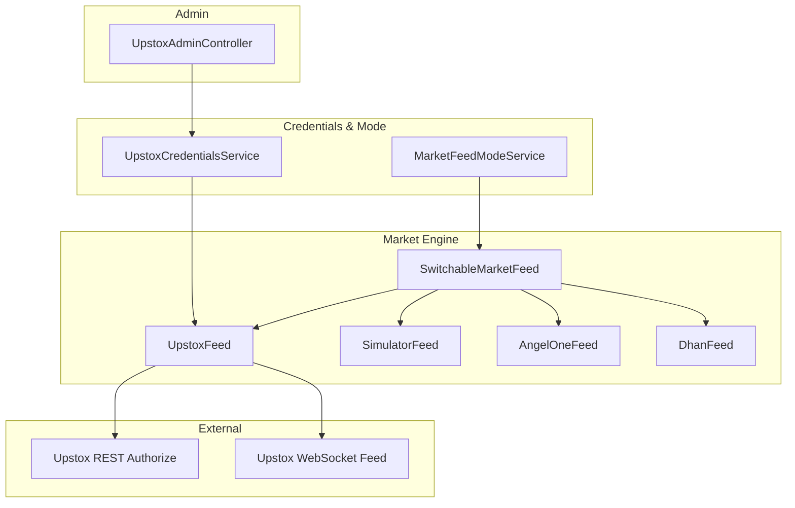
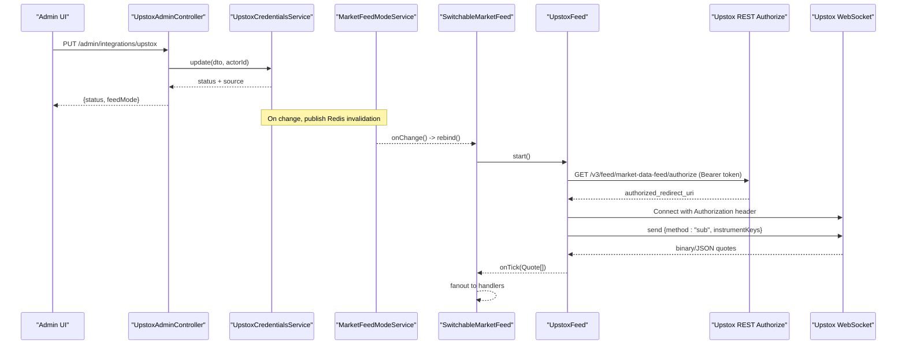
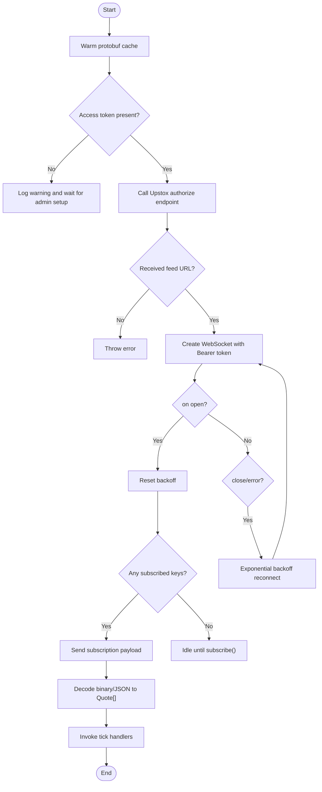
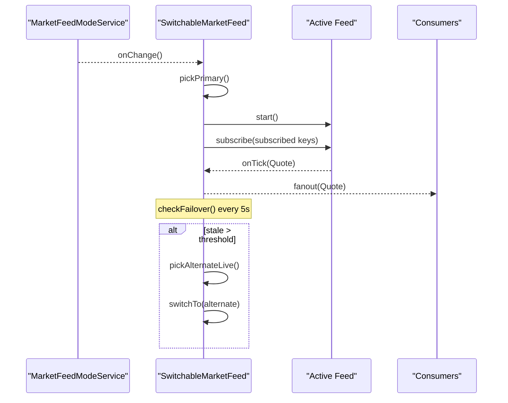
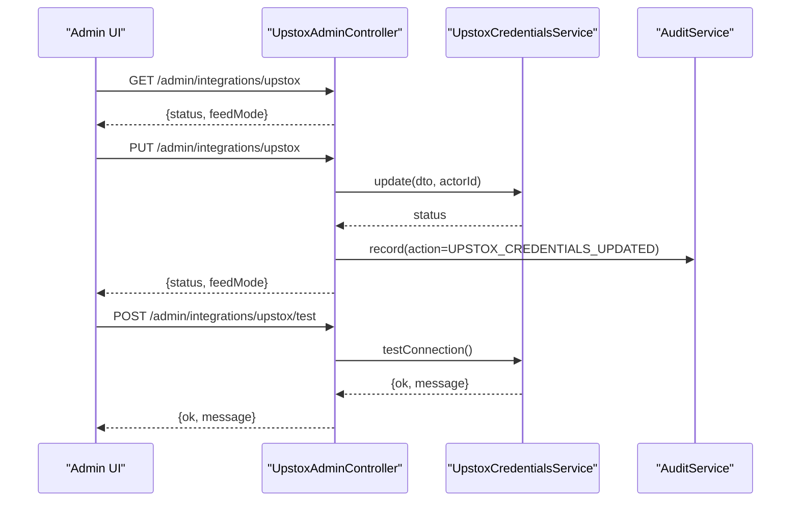
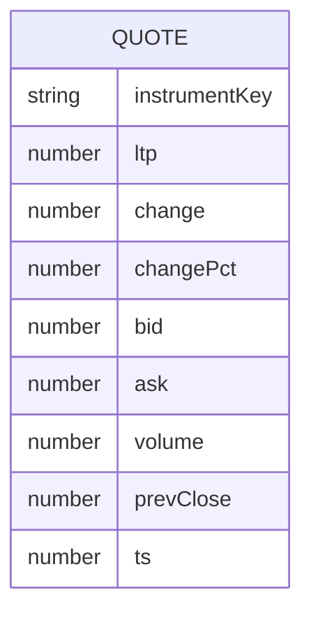
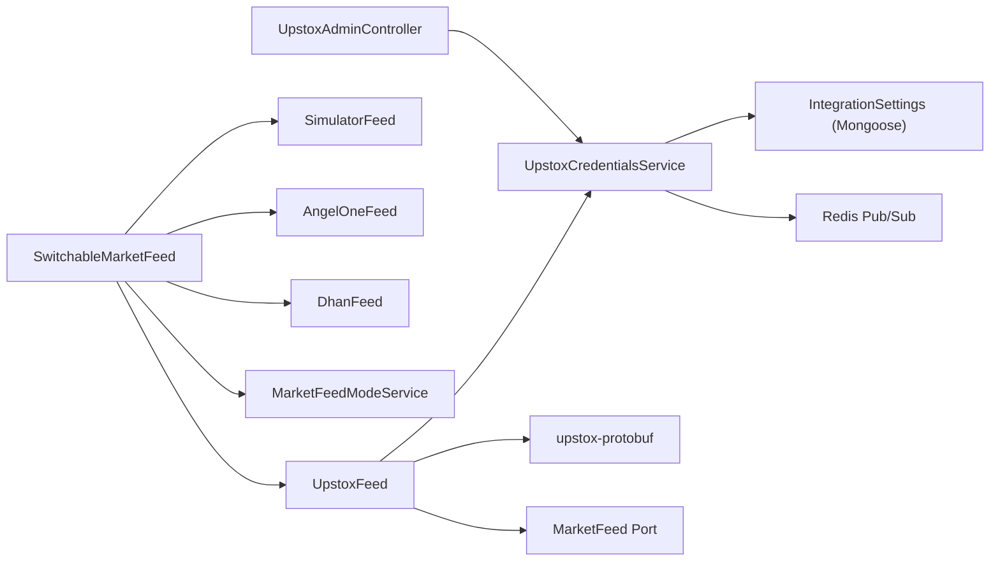

# Upstox Broker Integration

<cite>
**Referenced Files in This Document**
- [upstox-feed.ts](file://backend/apps/api/src/modules/market/infrastructure/feed/upstox-feed.ts)
- [upstox-protobuf.ts](file://backend/apps/api/src/modules/market/infrastructure/feed/upstox-protobuf.ts)
- [market-feed.port.ts](file://backend/apps/api/src/modules/market/infrastructure/feed/market-feed.port.ts)
- [switchable-market-feed.ts](file://backend/apps/api/src/modules/market/infrastructure/feed/switchable-market-feed.ts)
- [upstox-credentials.service.ts](file://backend/apps/api/src/modules/market/application/upstox-credentials.service.ts)
- [market-feed-mode.service.ts](file://backend/apps/api/src/modules/market/application/market-feed-mode.service.ts)
- [integration-settings.schema.ts](file://backend/apps/api/src/modules/market/infrastructure/schemas/integration-settings.schema.ts)
- [upstox-admin.controller.ts](file://backend/apps/api/src/modules/market/presentation/upstox-admin.controller.ts)
- [market-engine.module.ts](file://backend/apps/api/src/modules/market/market-engine.module.ts)
- [market.types.ts](file://backend/libs/shared/src/market/market.types.ts)
</cite>

## Table of Contents
1. [Introduction](#introduction)
2. [Project Structure](#project-structure)
3. [Core Components](#core-components)
4. [Architecture Overview](#architecture-overview)
5. [Detailed Component Analysis](#detailed-component-analysis)
6. [Dependency Analysis](#dependency-analysis)
7. [Performance Considerations](#performance-considerations)
8. [Troubleshooting Guide](#troubleshooting-guide)
9. [Conclusion](#conclusion)
10. [Appendices](#appendices)

## Introduction
This document explains the Upstox broker integration implementation, focusing on the UpstoxFeed class that implements the MarketFeed interface for Upstox WebSocket connections. It covers authentication using API keys and session tokens, WebSocket connection establishment, message decoding from Upstox’s proprietary format, subscription management for instruments, real-time quote handling, reconnection logic with exponential backoff, configuration via admin interfaces, credential storage security, rate limiting considerations, troubleshooting, and testing guidance with the Upstox sandbox environment.

## Project Structure
The Upstox integration is implemented as a modular NestJS feature within the market module:
- Feed adapter: UpstoxFeed (WebSocket client, subscribe/unsubscribe, reconnect)
- Protocol decoder: upstox-protobuf.ts (protobuf JSON/binary decode to shared Quote)
- Credentials service: UpstoxCredentialsService (encrypted DB storage, env fallback, hot reload)
- Mode switching: SwitchableMarketFeed (runtime selection among simulator/live providers)
- Admin endpoints: UpstoxAdminController (CRUD for credentials, test connectivity)
- Module wiring: MarketEngineModule (providers and DI bindings)
- Shared types: Quote and channels used across engine and API



**Diagram sources**
- [switchable-market-feed.ts:1-186](file://backend/apps/api/src/modules/market/infrastructure/feed/switchable-market-feed.ts#L1-L186)
- [upstox-feed.ts:1-136](file://backend/apps/api/src/modules/market/infrastructure/feed/upstox-feed.ts#L1-L136)
- [upstox-credentials.service.ts:1-216](file://backend/apps/api/src/modules/market/application/upstox-credentials.service.ts#L1-L216)
- [market-feed-mode.service.ts:1-99](file://backend/apps/api/src/modules/market/application/market-feed-mode.service.ts#L1-L99)
- [upstox-admin.controller.ts:1-85](file://backend/apps/api/src/modules/market/presentation/upstox-admin.controller.ts#L1-L85)

**Section sources**
- [market-engine.module.ts:1-47](file://backend/apps/api/src/modules/market/market-engine.module.ts#L1-L47)
- [market-feed.port.ts:1-23](file://backend/apps/api/src/modules/market/infrastructure/feed/market-feed.port.ts#L1-L23)

## Core Components
- UpstoxFeed: Implements MarketFeed; manages WebSocket lifecycle, authorization URL retrieval, binary/JSON message decoding, subscription management, and exponential backoff reconnection.
- upstox-protobuf.ts: Inlines Upstox v3 protobuf schema; decodes frames into shared Quote objects; supports both protobuf and JSON payloads.
- UpstoxCredentialsService: Loads encrypted credentials from database with environment fallback; broadcasts changes via Redis; exposes status and test connectivity.
- SwitchableMarketFeed: Runtime feed selector with failover; fans out ticks to consumers; rebinds subscriptions on mode or credential changes.
- MarketFeedModeService: Holds active feed mode (simulator/upstox/angel/dhan), persisted in settings, hot-reloaded via Redis.
- UpstoxAdminController: Admin endpoints to update credentials, view status, and test connectivity; integrates with audit logging.

**Section sources**
- [upstox-feed.ts:1-136](file://backend/apps/api/src/modules/market/infrastructure/feed/upstox-feed.ts#L1-L136)
- [upstox-protobuf.ts:1-227](file://backend/apps/api/src/modules/market/infrastructure/feed/upstox-protobuf.ts#L1-L227)
- [upstox-credentials.service.ts:1-216](file://backend/apps/api/src/modules/market/application/upstox-credentials.service.ts#L1-L216)
- [switchable-market-feed.ts:1-186](file://backend/apps/api/src/modules/market/infrastructure/feed/switchable-market-feed.ts#L1-L186)
- [market-feed-mode.service.ts:1-99](file://backend/apps/api/src/modules/market/application/market-feed-mode.service.ts#L1-L99)
- [upstox-admin.controller.ts:1-85](file://backend/apps/api/src/modules/market/presentation/upstox-admin.controller.ts#L1-L85)

## Architecture Overview
The system uses a pluggable feed architecture. The SwitchableMarketFeed selects the active provider based on configured mode and available credentials. When Upstox is selected, UpstoxFeed authenticates via Upstox’s authorize endpoint to obtain the WebSocket URL, connects with a Bearer token, subscribes to instrument keys, and decodes incoming messages into Quote objects. A failover mechanism monitors tick freshness and can switch to alternate live feeds or simulator if needed.



**Diagram sources**
- [upstox-admin.controller.ts:41-83](file://backend/apps/api/src/modules/market/presentation/upstox-admin.controller.ts#L41-L83)
- [upstox-credentials.service.ts:112-144](file://backend/apps/api/src/modules/market/application/upstox-credentials.service.ts#L112-L144)
- [market-feed-mode.service.ts:61-73](file://backend/apps/api/src/modules/market/application/market-feed-mode.service.ts#L61-L73)
- [switchable-market-feed.ts:57-71](file://backend/apps/api/src/modules/market/infrastructure/feed/switchable-market-feed.ts#L57-L71)
- [upstox-feed.ts:26-79](file://backend/apps/api/src/modules/market/infrastructure/feed/upstox-feed.ts#L26-L79)

## Detailed Component Analysis

### UpstoxFeed: WebSocket Client and Message Decoder
- Authentication flow: Uses an access token from UpstoxCredentialsService to call Upstox’s authorize endpoint and retrieve the WebSocket URL. Connects with an Authorization header containing the bearer token.
- Connection lifecycle: On open, resets backoff and resends subscriptions. On close/error, schedules reconnection with exponential backoff capped at 30 seconds.
- Subscription management: Tracks subscribed instrument keys; sends subscription/unsubscription messages in JSON when the socket is open.
- Message decoding: Accepts both protobuf and JSON frames; decodes into Quote[] using the inlined protobuf schema and normalizer.
- Tick propagation: Invokes registered tick handlers with decoded quotes and tracks last tick timestamp for staleness checks.



**Diagram sources**
- [upstox-feed.ts:26-97](file://backend/apps/api/src/modules/market/infrastructure/feed/upstox-feed.ts#L26-L97)
- [upstox-protobuf.ts:158-183](file://backend/apps/api/src/modules/market/infrastructure/feed/upstox-protobuf.ts#L158-L183)

**Section sources**
- [upstox-feed.ts:1-136](file://backend/apps/api/src/modules/market/infrastructure/feed/upstox-feed.ts#L1-L136)
- [upstox-protobuf.ts:1-227](file://backend/apps/api/src/modules/market/infrastructure/feed/upstox-protobuf.ts#L1-L227)

### UpstoxCredentialsService: Secure Credential Management
- Storage: Encrypted fields stored in the integrations collection; environment variables serve as fallback.
- Hot reload: Subscribes to a Redis channel; on message, reloads credentials and emits change events to subscribers (e.g., UpstoxFeed).
- Public status: Provides masked previews and source classification (database/environment/mixed/none).
- Test connectivity: Calls Upstox authorize endpoint to validate token without establishing a WebSocket.

```mermaid
classDiagram
class UpstoxCredentialsService {
-encSecret : string
-accessToken : string?
-apiKey : string?
-apiSecret : string?
-source : "database|environment|mixed|none"
-updatedAt : Date?
-updatedBy : string?
+getAccessToken() : string?
+hasAccessToken() : boolean
+getPublicStatus() : UpstoxPublicStatus
+update(input, updatedBy) : Promise~UpstoxPublicStatus~
+testConnection() : Promise~{ok,message}~
-reload() : Promise~void~
-emitChange() : void
}
```

**Diagram sources**
- [upstox-credentials.service.ts:44-216](file://backend/apps/api/src/modules/market/application/upstox-credentials.service.ts#L44-L216)

**Section sources**
- [upstox-credentials.service.ts:1-216](file://backend/apps/api/src/modules/market/application/upstox-credentials.service.ts#L1-L216)
- [integration-settings.schema.ts:1-40](file://backend/apps/api/src/modules/market/infrastructure/schemas/integration-settings.schema.ts#L1-L40)

### SwitchableMarketFeed: Runtime Provider Selection and Failover
- Mode-driven selection: Chooses primary feed based on MarketFeedModeService and credential availability.
- Failover: Periodically checks staleness; if no ticks for a threshold, switches to alternate live provider or simulator.
- Subscription persistence: Maintains a set of subscribed instrument keys and reapplies them after switching feeds.
- Fan-out: Aggregates ticks from all feeds and forwards to registered handlers.



**Diagram sources**
- [switchable-market-feed.ts:1-186](file://backend/apps/api/src/modules/market/infrastructure/feed/switchable-market-feed.ts#L1-L186)
- [market-feed-mode.service.ts:1-99](file://backend/apps/api/src/modules/market/application/market-feed-mode.service.ts#L1-L99)

**Section sources**
- [switchable-market-feed.ts:1-186](file://backend/apps/api/src/modules/market/infrastructure/feed/switchable-market-feed.ts#L1-L186)

### Admin Interface: Configuration and Testing
- Status: Returns current Upstox credential status and active feed mode.
- Update: Persists encrypted credentials, publishes Redis invalidation, reloads, and audits changes.
- Test: Validates token by calling Upstox authorize endpoint and returns result.



**Diagram sources**
- [upstox-admin.controller.ts:41-83](file://backend/apps/api/src/modules/market/presentation/upstox-admin.controller.ts#L41-L83)
- [upstox-credentials.service.ts:112-162](file://backend/apps/api/src/modules/market/application/upstox-credentials.service.ts#L112-L162)

**Section sources**
- [upstox-admin.controller.ts:1-85](file://backend/apps/api/src/modules/market/presentation/upstox-admin.controller.ts#L1-L85)

### Data Model: Quote Contract
- Quote fields include instrumentKey, ltp, change, changePct, bid, ask, volume, prevClose, ts.
- Channels and cache keys are defined for event bus and caching layers.



**Diagram sources**
- [market.types.ts:1-39](file://backend/libs/shared/src/market/market.types.ts#L1-L39)

**Section sources**
- [market.types.ts:1-39](file://backend/libs/shared/src/market/market.types.ts#L1-L39)

## Dependency Analysis
- UpstoxFeed depends on:
  - UpstoxCredentialsService for token and change notifications
  - upstox-protobuf for decoding
  - WebSocket library for transport
  - MarketFeed port for interface contract
- SwitchableMarketFeed composes multiple feeds and depends on MarketFeedModeService and credential services to select and manage active provider.
- UpstoxCredentialsService depends on Mongoose model for settings, ConfigService for env vars, and Redis for pub/sub invalidation.
- UpstoxAdminController depends on credentials service and audit service for secure updates and logging.



**Diagram sources**
- [upstox-feed.ts:1-136](file://backend/apps/api/src/modules/market/infrastructure/feed/upstox-feed.ts#L1-L136)
- [switchable-market-feed.ts:1-186](file://backend/apps/api/src/modules/market/infrastructure/feed/switchable-market-feed.ts#L1-L186)
- [upstox-credentials.service.ts:1-216](file://backend/apps/api/src/modules/market/application/upstox-credentials.service.ts#L1-L216)
- [market-feed-mode.service.ts:1-99](file://backend/apps/api/src/modules/market/application/market-feed-mode.service.ts#L1-L99)
- [upstox-admin.controller.ts:1-85](file://backend/apps/api/src/modules/market/presentation/upstox-admin.controller.ts#L1-L85)

**Section sources**
- [market-engine.module.ts:1-47](file://backend/apps/api/src/modules/market/market-engine.module.ts#L1-L47)

## Performance Considerations
- Exponential backoff: Reconnection delays double up to a cap to avoid overwhelming the server during instability.
- Staleness monitoring: SwitchableMarketFeed checks secondsSinceLastTick to detect stale feeds and trigger failover quickly.
- Protobuf warm-up: Pre-parsing protobuf schema reduces first-message latency.
- Subscription batching: Subscriptions are sent only for new keys to minimize network overhead.
- Rate limiting considerations:
  - Upstox WebSocket and REST endpoints may enforce limits; ensure subscription requests are deduplicated and not repeated unnecessarily.
  - Avoid excessive unsubscribe/resubscribe churn; batch operations where possible.
  - Monitor Upstox error responses and adjust retry/backoff strategies accordingly.

[No sources needed since this section provides general guidance]

## Troubleshooting Guide
Common issues and resolutions:
- No access token configured:
  - Symptom: Logs warn about missing token; feed does not connect.
  - Resolution: Set access token via admin interface or environment variable; verify with test endpoint.
- Authorize endpoint failure:
  - Symptom: Non-OK response from Upstox authorize; feed cannot obtain WebSocket URL.
  - Resolution: Validate token permissions; use admin test endpoint to capture detailed error message.
- Frequent disconnects:
  - Symptom: Repeated reconnect logs; potential network or rate limit issues.
  - Resolution: Check network stability; reduce subscription frequency; inspect Upstox rate limit responses.
- Stale feed detected:
  - Symptom: Failover triggered due to no ticks for threshold.
  - Resolution: Verify upstream data; consider switching to alternate live provider or simulator temporarily.
- Decoding errors:
  - Symptom: Empty quotes or parse failures.
  - Resolution: Ensure protobuf schema matches Upstox version; inspect raw messages for debugging.

**Section sources**
- [upstox-feed.ts:26-97](file://backend/apps/api/src/modules/market/infrastructure/feed/upstox-feed.ts#L26-L97)
- [upstox-credentials.service.ts:147-162](file://backend/apps/api/src/modules/market/application/upstox-credentials.service.ts#L147-L162)
- [switchable-market-feed.ts:158-184](file://backend/apps/api/src/modules/market/infrastructure/feed/switchable-market-feed.ts#L158-L184)

## Conclusion
The Upstox integration provides a robust, pluggable market data pipeline with secure credential management, runtime feed selection, and resilient reconnection logic. The design separates concerns across feed adapters, protocol decoding, credentials, and admin configuration, enabling reliable operation in production and flexible testing in development environments.

[No sources needed since this section summarizes without analyzing specific files]

## Appendices

### Configuration Requirements via Admin Interfaces
- Navigate to admin endpoints to update Upstox credentials and view status.
- Use the test endpoint to validate token validity before enabling live feed mode.
- Ensure feed mode is set appropriately (simulator for dev/testing, upstox for production).

**Section sources**
- [upstox-admin.controller.ts:41-83](file://backend/apps/api/src/modules/market/presentation/upstox-admin.controller.ts#L41-L83)
- [market-feed-mode.service.ts:61-73](file://backend/apps/api/src/modules/market/application/market-feed-mode.service.ts#L61-L73)

### Credential Storage Security
- Secrets are AES-GCM encrypted in the integrations collection using DATA_ENC_SECRET.
- Environment variables provide fallback when no DB row exists.
- Source classification indicates whether credentials come from database, environment, mixed, or none.

**Section sources**
- [integration-settings.schema.ts:1-40](file://backend/apps/api/src/modules/market/infrastructure/schemas/integration-settings.schema.ts#L1-L40)
- [upstox-credentials.service.ts:172-214](file://backend/apps/api/src/modules/market/application/upstox-credentials.service.ts#L172-L214)

### Testing with Upstox Sandbox
- Obtain a valid access token for the sandbox environment.
- Configure it via admin interface; use test endpoint to confirm authorization success.
- Set feed mode to upstox; monitor logs for successful connection and subscription.
- Subscribe to known instrument keys and verify quotes arrive in the consumer layer.

**Section sources**
- [upstox-admin.controller.ts:79-83](file://backend/apps/api/src/modules/market/presentation/upstox-admin.controller.ts#L79-L83)
- [upstox-credentials.service.ts:147-162](file://backend/apps/api/src/modules/market/application/upstox-credentials.service.ts#L147-L162)

### Debugging WebSocket Messages
- Inspect logs for connection events, errors, and reconnection attempts.
- Use the test endpoint to capture detailed error messages from Upstox authorize.
- If decoding fails, verify protobuf schema alignment and inspect raw payloads for anomalies.

**Section sources**
- [upstox-feed.ts:66-79](file://backend/apps/api/src/modules/market/infrastructure/feed/upstox-feed.ts#L66-L79)
- [upstox-protobuf.ts:158-183](file://backend/apps/api/src/modules/market/infrastructure/feed/upstox-protobuf.ts#L158-L183)