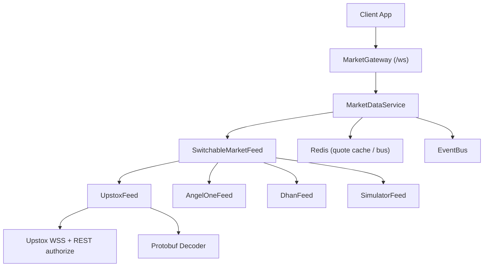
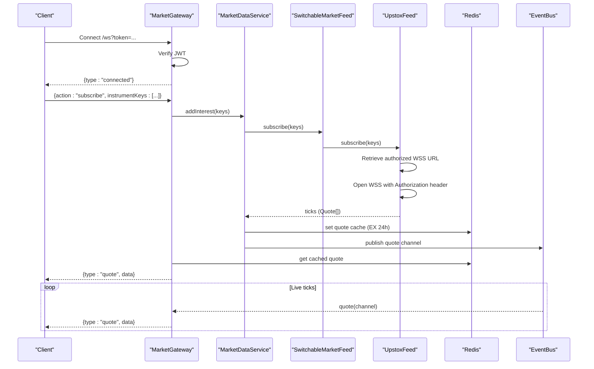
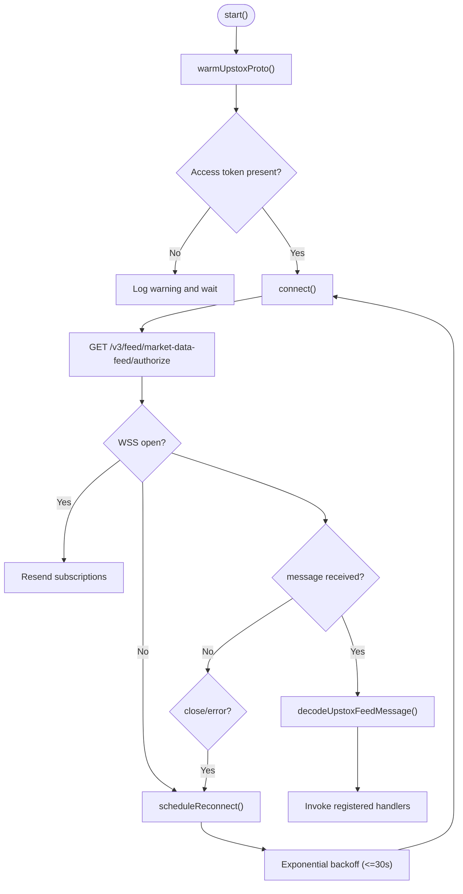
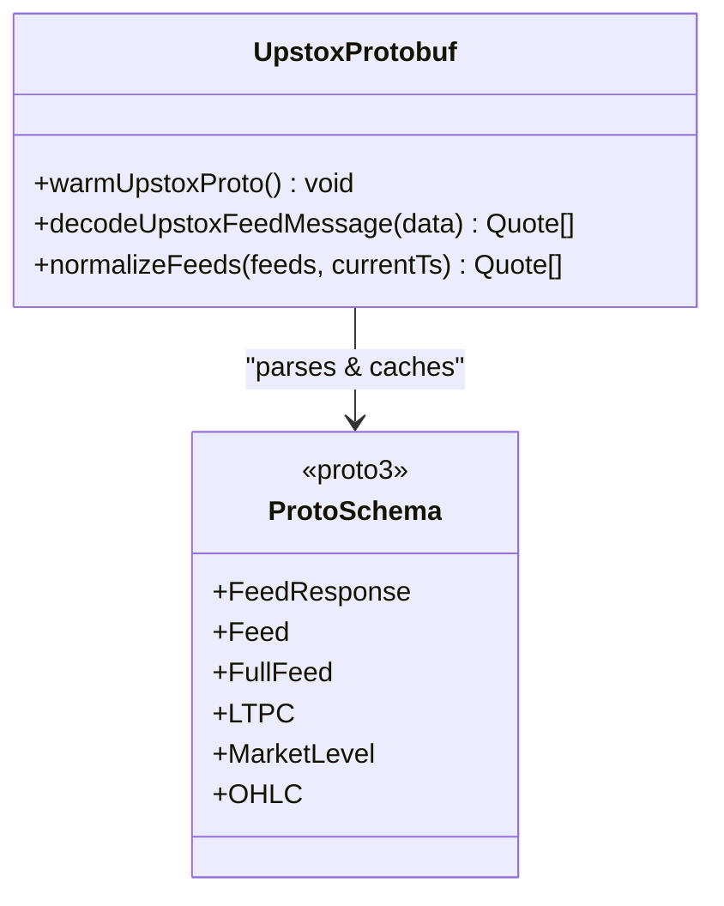
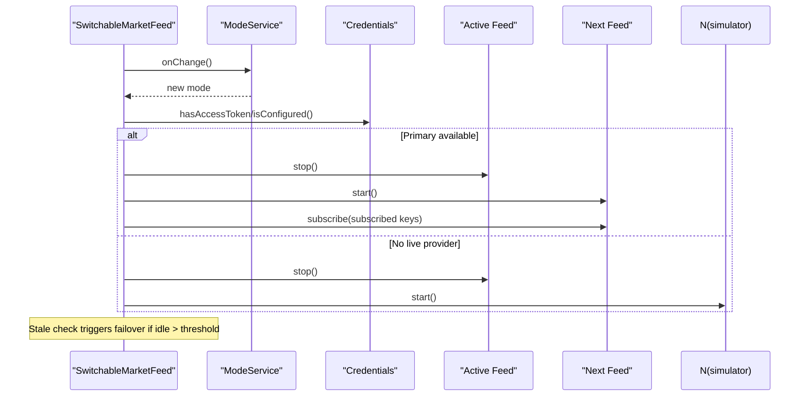
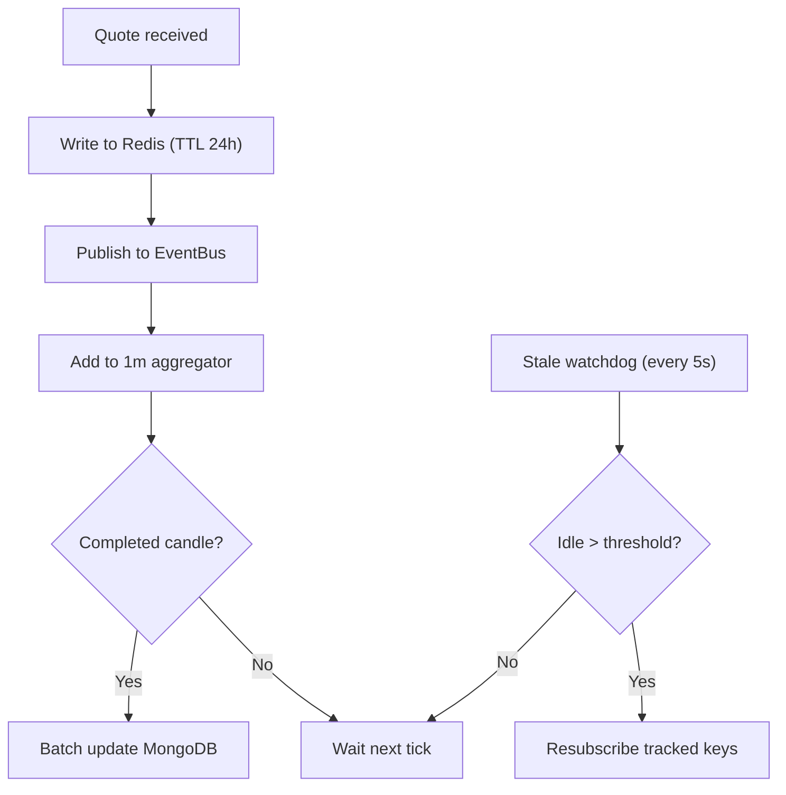
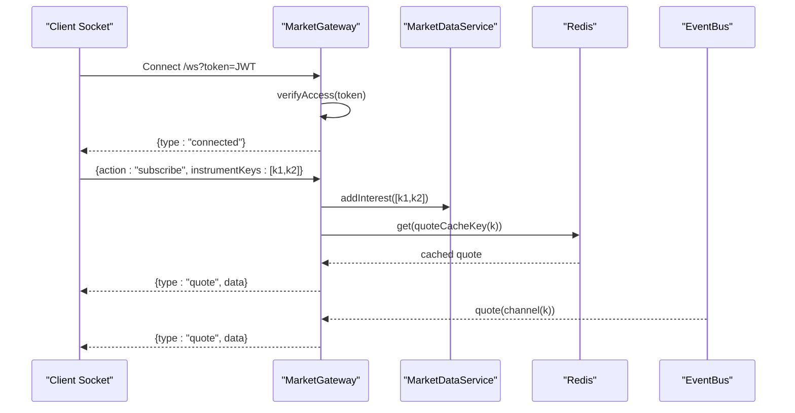
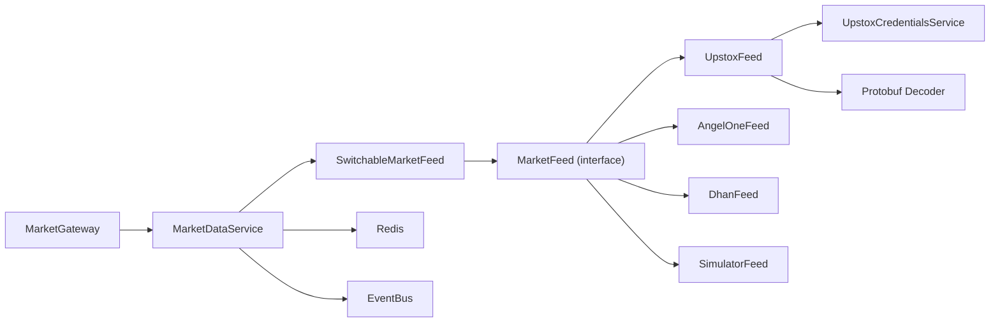

# WebSocket Connection Management

<cite>
**Referenced Files in This Document**
- [upstox-feed.ts](file://backend/apps/api/src/modules/market/infrastructure/feed/upstox-feed.ts)
- [upstox-protobuf.ts](file://backend/apps/api/src/modules/market/infrastructure/feed/upstox-protobuf.ts)
- [MarketDataFeed.proto](file://backend/apps/api/src/modules/market/infrastructure/feed/MarketDataFeed.proto)
- [MarketDataFeedV3.proto](file://backend/apps/api/src/modules/market/infrastructure/feed/MarketDataFeedV3.proto)
- [market-data.service.ts](file://backend/apps/api/src/modules/market/application/market-data.service.ts)
- [market-feed.port.ts](file://backend/apps/api/src/modules/market/infrastructure/feed/market-feed.port.ts)
- [switchable-market-feed.ts](file://backend/apps/api/src/modules/market/infrastructure/feed/switchable-market-feed.ts)
- [market-feed-mode.service.ts](file://backend/apps/api/src/modules/market/application/market-feed-mode.service.ts)
- [upstox-credentials.service.ts](file://backend/apps/api/src/modules/market/application/upstox-credentials.service.ts)
- [market.gateway.ts](file://backend/apps/api/src/modules/market/presentation/market.gateway.ts)
</cite>

## Table of Contents
1. Introduction
2. Project Structure
3. Core Components
4. Architecture Overview
5. Detailed Component Analysis
6. Dependency Analysis
7. Performance Considerations
8. Troubleshooting Guide
9. Conclusion

## Introduction
This document explains how the system manages WebSocket connections to Upstox for real-time market data, including connection lifecycle, authorization URL retrieval, binary message decoding with protobuf, reconnection strategy, subscription management, and graceful degradation when upstream feeds fail. It also covers client-facing WebSocket handling, performance monitoring, debugging techniques, and testing strategies using the simulator feed mode.

## Project Structure
The WebSocket integration spans several layers:
- Client-facing gateway that authenticates clients and fans out quotes per instrument room
- Market data service that owns a single upstream feed instance, tracks interest, persists candles, and monitors feed health
- Feed abstraction and adapters (Upstox, Angel One, Dhan, Simulator) with runtime switching and failover
- Protobuf decoder for Upstox’s v3 market data frames
- Credentials and feed mode services enabling hot-reload without restarts

**Diagram sources**
- [market.gateway.ts:26-134](file://backend/apps/api/src/modules/market/presentation/market.gateway.ts#L26-L134)
- [market-data.service.ts:24-139](file://backend/apps/api/src/modules/market/application/market-data.service.ts#L24-L139)
- [switchable-market-feed.ts:23-186](file://backend/apps/api/src/modules/market/infrastructure/feed/switchable-market-feed.ts#L23-L186)
- [upstox-feed.ts:12-136](file://backend/apps/api/src/modules/market/infrastructure/feed/upstox-feed.ts#L12-L136)
- [upstox-protobuf.ts:1-227](file://backend/apps/api/src/modules/market/infrastructure/feed/upstox-protobuf.ts#L1-L227)

**Section sources**
- [market.gateway.ts:26-134](file://backend/apps/api/src/modules/market/presentation/market.gateway.ts#L26-L134)
- [market-data.service.ts:24-139](file://backend/apps/api/src/modules/market/application/market-data.service.ts#L24-L139)
- [switchable-market-feed.ts:23-186](file://backend/apps/api/src/modules/market/infrastructure/feed/switchable-market-feed.ts#L23-L186)
- [upstox-feed.ts:12-136](file://backend/apps/api/src/modules/market/infrastructure/feed/upstox-feed.ts#L12-L136)
- [upstox-protobuf.ts:1-227](file://backend/apps/api/src/modules/market/infrastructure/feed/upstox-protobuf.ts#L1-L227)

## Core Components
- UpstoxFeed: Implements the MarketFeed interface to connect to Upstox via WebSocket, retrieve an authorized feed URL, send subscribe/unsubscribe messages, decode binary frames, and reconnect with exponential backoff.
- SwitchableMarketFeed: Runtime switches between live providers (Upstox, Angel One, Dhan) and simulator based on configuration and credentials; includes stale-feed failover.
- MarketDataService: Owns the single feed instance, tracks per-instrument interest, writes quotes to Redis, publishes events, aggregates 1m candles, and runs a stale-feed watchdog.
- MarketGateway: Authenticates client WebSocket connections, manages per-instrument rooms, relays cached and live quotes, and drives upstream subscriptions via MarketDataService.
- upstox-protobuf: Parses Upstox v3 protobuf frames into normalized Quote objects with fallback to JSON if needed.
- Credentials and Mode Services: Provide dynamic access tokens and feed mode changes with Redis-based invalidation and hot reload.

**Section sources**
- [upstox-feed.ts:12-136](file://backend/apps/api/src/modules/market/infrastructure/feed/upstox-feed.ts#L12-L136)
- [switchable-market-feed.ts:23-186](file://backend/apps/api/src/modules/market/infrastructure/feed/switchable-market-feed.ts#L23-L186)
- [market-data.service.ts:24-139](file://backend/apps/api/src/modules/market/application/market-data.service.ts#L24-L139)
- [market.gateway.ts:26-134](file://backend/apps/api/src/modules/market/presentation/market.gateway.ts#L26-L134)
- [upstox-protobuf.ts:1-227](file://backend/apps/api/src/modules/market/infrastructure/feed/upstox-protobuf.ts#L1-L227)
- [upstox-credentials.service.ts:43-216](file://backend/apps/api/src/modules/market/application/upstox-credentials.service.ts#L43-L216)
- [market-feed-mode.service.ts:20-99](file://backend/apps/api/src/modules/market/application/market-feed-mode.service.ts#L20-L99)

## Architecture Overview
The system uses a layered architecture:
- Presentation layer: MarketGateway handles client authentication and per-instrument fan-out
- Application layer: MarketDataService orchestrates feed usage, persistence, aggregation, and health checks
- Infrastructure layer: Feed adapters implement protocol-specific logic; SwitchableMarketFeed provides resilience and runtime switching
- Data layer: Redis stores last quotes and acts as an event bus channel; MongoDB stores aggregated candles

**Diagram sources**
- [market.gateway.ts:48-134](file://backend/apps/api/src/modules/market/presentation/market.gateway.ts#L48-L134)
- [market-data.service.ts:43-139](file://backend/apps/api/src/modules/market/application/market-data.service.ts#L43-L139)
- [switchable-market-feed.ts:57-156](file://backend/apps/api/src/modules/market/infrastructure/feed/switchable-market-feed.ts#L57-L156)
- [upstox-feed.ts:54-136](file://backend/apps/api/src/modules/market/infrastructure/feed/upstox-feed.ts#L54-L136)

## Detailed Component Analysis

### UpstoxFeed: Lifecycle, Authorization, Reconnection, and Message Handling
- Initialization and startup:
  - Warms up protobuf types once to avoid parsing overhead
  - Subscribes to credential change events to force reconnect when token updates
  - Validates presence of access token before connecting
- Authorization URL retrieval:
  - Calls Upstox REST endpoint to obtain the authorized WebSocket redirect URI
  - Throws descriptive errors if authorization fails or URL is missing
- WebSocket establishment:
  - Opens WSS with Authorization header containing the bearer token
  - On open, resends any previously tracked subscriptions
- Binary message decoding:
  - Normalizes Buffer/ArrayBuffer inputs
  - Decodes protobuf frames using the inlined v3 schema; falls back to JSON if detected
  - Emits normalized Quote objects to registered handlers
- Reconnection strategy:
  - Exponential backoff capped at 30 seconds
  - Uses unref timers to avoid blocking process shutdown
- Subscription management:
  - Tracks subscribed keys and sends full-mode subscription requests
  - Supports unsubscribe by sending method “unsub” with instrument keys
- Health metrics:
  - Records last tick timestamp to support stale detection

**Diagram sources**
- [upstox-feed.ts:26-136](file://backend/apps/api/src/modules/market/infrastructure/feed/upstox-feed.ts#L26-L136)

**Section sources**
- [upstox-feed.ts:26-136](file://backend/apps/api/src/modules/market/infrastructure/feed/upstox-feed.ts#L26-L136)

### Protobuf Encoding/Decoding and Binary Handling
- Schema:
  - Inlines the official Upstox v3 MarketDataFeed proto to avoid asset copy requirements
  - Defines LTPC, FullFeed structures, depth levels, OHLC, option greeks, and market info
- Decoding pipeline:
  - Attempts UTF-8 text parse first; if JSON, normalizes feeds directly
  - Otherwise decodes binary protobuf using parsed type and converts longs/enums appropriately
  - Normalizes fields into shared Quote shape with instrumentKey, ltp, bid/ask, volume, prevClose, change, and timestamp
- Optimization:
  - Caches parsed protobuf type to avoid repeated parsing
  - Supports warm-up to precompile types on startup

**Diagram sources**
- [upstox-protobuf.ts:1-227](file://backend/apps/api/src/modules/market/infrastructure/feed/upstox-protobuf.ts#L1-L227)
- [MarketDataFeed.proto:1-119](file://backend/apps/api/src/modules/market/infrastructure/feed/MarketDataFeed.proto#L1-L119)
- [MarketDataFeedV3.proto:1-119](file://backend/apps/api/src/modules/market/infrastructure/feed/MarketDataFeedV3.proto#L1-L119)

**Section sources**
- [upstox-protobuf.ts:141-227](file://backend/apps/api/src/modules/market/infrastructure/feed/upstox-protobuf.ts#L141-L227)
- [MarketDataFeed.proto:1-119](file://backend/apps/api/src/modules/market/infrastructure/feed/MarketDataFeed.proto#L1-L119)
- [MarketDataFeedV3.proto:1-119](file://backend/apps/api/src/modules/market/infrastructure/feed/MarketDataFeedV3.proto#L1-L119)

### SwitchableMarketFeed: Runtime Mode and Failover
- Mode selection:
  - Picks primary feed based on configured mode and provider credentials availability
  - Falls back to simulator if no live provider is configured
- Hot reload:
  - Listens to feed mode and credential changes to rebind active feed without restart
- Failover:
  - Periodically checks idle time; if stale beyond threshold, attempts alternate live provider
  - If none available, falls back to simulator while preserving subscribed keys
- Subscription preservation:
  - Maintains canonical subscribed keys and reapplies them after switch

**Diagram sources**
- [switchable-market-feed.ts:57-186](file://backend/apps/api/src/modules/market/infrastructure/feed/switchable-market-feed.ts#L57-L186)
- [market-feed-mode.service.ts:37-99](file://backend/apps/api/src/modules/market/application/market-feed-mode.service.ts#L37-L99)
- [upstox-credentials.service.ts:70-216](file://backend/apps/api/src/modules/market/application/upstox-credentials.service.ts#L70-L216)

**Section sources**
- [switchable-market-feed.ts:57-186](file://backend/apps/api/src/modules/market/infrastructure/feed/switchable-market-feed.ts#L57-L186)
- [market-feed-mode.service.ts:37-99](file://backend/apps/api/src/modules/market/application/market-feed-mode.service.ts#L37-L99)
- [upstox-credentials.service.ts:70-216](file://backend/apps/api/src/modules/market/application/upstox-credentials.service.ts#L70-L216)

### MarketDataService: Interest Tracking, Persistence, Aggregation, and Watchdog
- Interest tracking:
  - Increments/decrements per-instrument interest counts
  - Subscribes upstream only when count transitions from 0→1
- Quote processing:
  - Writes each quote to Redis with TTL
  - Publishes to EventBus on per-instrument channel
- Candle aggregation:
  - Aggregates 1-minute candles and flushes in batches to MongoDB
- Stale feed watchdog:
  - Monitors seconds since last tick during market hours
  - Triggers re-subscription if feed appears stale

**Diagram sources**
- [market-data.service.ts:43-139](file://backend/apps/api/src/modules/market/application/market-data.service.ts#L43-L139)

**Section sources**
- [market-data.service.ts:43-139](file://backend/apps/api/src/modules/market/application/market-data.service.ts#L43-L139)

### MarketGateway: Client Authentication, Rooms, and Fan-Out
- Authentication:
  - Extracts JWT from query string and verifies it
  - Rejects connections without valid token
- Room management:
  - Per-instrument rooms track sockets
  - First client joins triggers upstream subscription via MarketDataService
  - Last client leaves drops upstream subscription
- Quote relay:
  - Subscribes to EventBus channels per instrument
  - Sends cached last quote immediately upon join
  - Relays live quotes to all sockets in the room

**Diagram sources**
- [market.gateway.ts:48-134](file://backend/apps/api/src/modules/market/presentation/market.gateway.ts#L48-L134)
- [market-data.service.ts:61-108](file://backend/apps/api/src/modules/market/application/market-data.service.ts#L61-L108)

**Section sources**
- [market.gateway.ts:48-134](file://backend/apps/api/src/modules/market/presentation/market.gateway.ts#L48-L134)

## Dependency Analysis
- MarketFeed interface defines the contract used by MarketDataService and SwitchableMarketFeed
- UpstoxFeed depends on UpstoxCredentialsService for tokens and on protobuf decoder for message parsing
- SwitchableMarketFeed composes multiple feed implementations and listens to mode and credential changes
- MarketGateway depends on TokenService, Redis, EventBus, and MarketDataService for auth, caching, and fan-out
- MarketDataService depends on Redis for caching and persistence, EventBus for pub/sub, and ExchangeCalendarService for market hours

**Diagram sources**
- [market-feed.port.ts:1-23](file://backend/apps/api/src/modules/market/infrastructure/feed/market-feed.port.ts#L1-L23)
- [switchable-market-feed.ts:23-186](file://backend/apps/api/src/modules/market/infrastructure/feed/switchable-market-feed.ts#L23-L186)
- [market-data.service.ts:24-139](file://backend/apps/api/src/modules/market/application/market-data.service.ts#L24-L139)
- [market.gateway.ts:26-134](file://backend/apps/api/src/modules/market/presentation/market.gateway.ts#L26-L134)
- [upstox-feed.ts:12-136](file://backend/apps/api/src/modules/market/infrastructure/feed/upstox-feed.ts#L12-L136)
- [upstox-protobuf.ts:1-227](file://backend/apps/api/src/modules/market/infrastructure/feed/upstox-protobuf.ts#L1-L227)

**Section sources**
- [market-feed.port.ts:1-23](file://backend/apps/api/src/modules/market/infrastructure/feed/market-feed.port.ts#L1-L23)
- [switchable-market-feed.ts:23-186](file://backend/apps/api/src/modules/market/infrastructure/feed/switchable-market-feed.ts#L23-L186)
- [market-data.service.ts:24-139](file://backend/apps/api/src/modules/market/application/market-data.service.ts#L24-L139)
- [market.gateway.ts:26-134](file://backend/apps/api/src/modules/market/presentation/market.gateway.ts#L26-L134)
- [upstox-feed.ts:12-136](file://backend/apps/api/src/modules/market/infrastructure/feed/upstox-feed.ts#L12-L136)
- [upstox-protobuf.ts:1-227](file://backend/apps/api/src/modules/market/infrastructure/feed/upstox-protobuf.ts#L1-L227)

## Performance Considerations
- Protobuf warm-up: Pre-parsing schema reduces per-message overhead
- Exponential backoff: Prevents thundering herd during reconnect storms
- Interest-based upstream subscription: Avoids subscribing to entire instrument catalog
- Batched candle writes: Reduces database write amplification
- Stale feed watchdog: Proactively re-subscribes during market hours to recover from silent failures
- Redis caching: Provides immediate last-quote delivery to new subscribers

[No sources needed since this section provides general guidance]

## Troubleshooting Guide
Common issues and resolutions:
- Missing access token:
  - Symptom: Logs warn about starting without token; connect skipped
  - Resolution: Configure Upstox access token via Admin or environment variables
- Authorization failure:
  - Symptom: REST authorize returns non-OK status
  - Resolution: Validate token validity and network connectivity to Upstox API
- No feed URL returned:
  - Symptom: Error indicating no authorized_redirect_uri
  - Resolution: Ensure account is enabled for market data feed and permissions are granted
- Frequent disconnects:
  - Symptom: Reconnect logs with increasing delays
  - Resolution: Check network stability, rate limits, and server resources; monitor stale feed alerts
- Stale feed during market hours:
  - Symptom: Warning about no ticks beyond threshold
  - Resolution: System will attempt re-subscription; verify upstream feed health and consider failover
- Client authentication failures:
  - Symptom: Gateway rejects connection with error message
  - Resolution: Ensure JWT is present and valid in query parameter

Debugging techniques:
- Enable logging in UpstoxFeed and MarketDataService to observe connect/reconnect cycles and tick timestamps
- Use MarketGateway logs to trace client subscriptions and room membership
- Inspect Redis for cached quotes and channel activity
- Test connection endpoint provided by credentials service to validate token against Upstox

Testing strategies:
- Set feed mode to simulator for deterministic, offline testing
- Use MarketGateway to simulate client subscriptions and verify quote flow
- Validate protobuf decoding by feeding known fixtures through normalizeFeeds
- Exercise failover by simulating stale conditions and verifying switch to alternate provider or simulator

**Section sources**
- [upstox-feed.ts:26-136](file://backend/apps/api/src/modules/market/infrastructure/feed/upstox-feed.ts#L26-L136)
- [market-data.service.ts:128-139](file://backend/apps/api/src/modules/market/application/market-data.service.ts#L128-L139)
- [market.gateway.ts:48-134](file://backend/apps/api/src/modules/market/presentation/market.gateway.ts#L48-L134)
- [upstox-credentials.service.ts:147-162](file://backend/apps/api/src/modules/market/application/upstox-credentials.service.ts#L147-L162)
- [market-feed-mode.service.ts:61-74](file://backend/apps/api/src/modules/market/application/market-feed-mode.service.ts#L61-L74)

## Conclusion
The Upstox WebSocket integration is built around a robust, resilient design:
- Clear separation of concerns across gateway, service, and adapter layers
- Efficient binary decoding with protobuf and JSON fallback
- Graceful reconnection with exponential backoff and stale-feed recovery
- On-demand upstream subscriptions to minimize resource usage
- Hot-reload capabilities for credentials and feed modes
- Comprehensive monitoring and troubleshooting tools to maintain reliability in production

[No sources needed since this section summarizes without analyzing specific files]