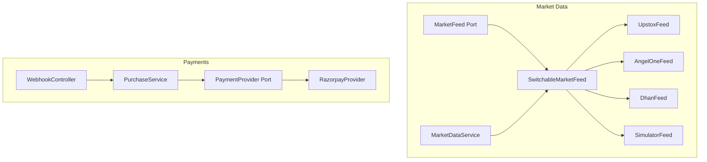
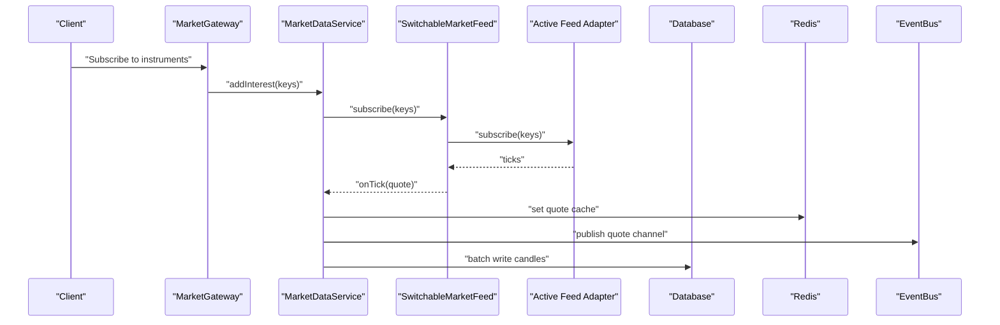
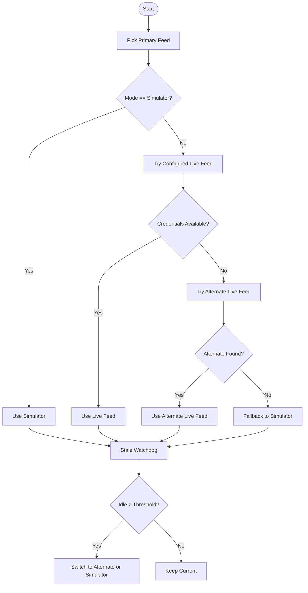
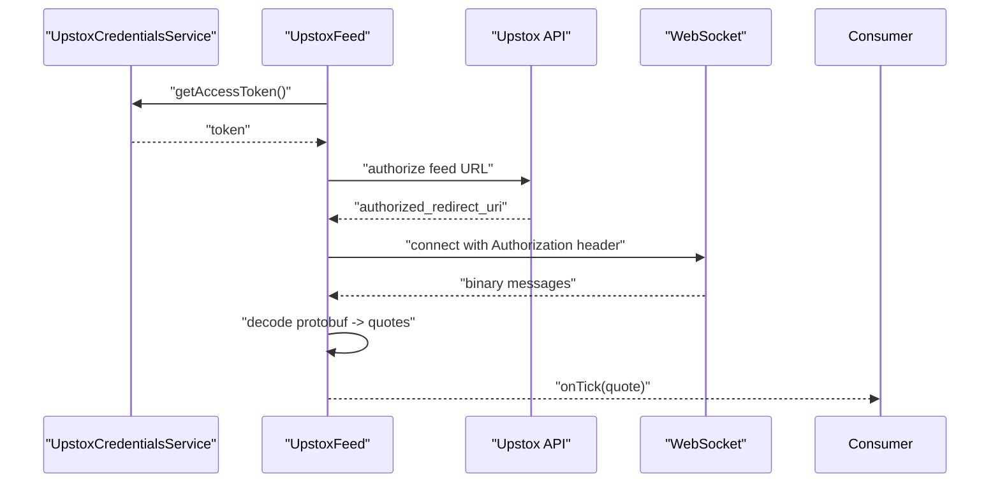
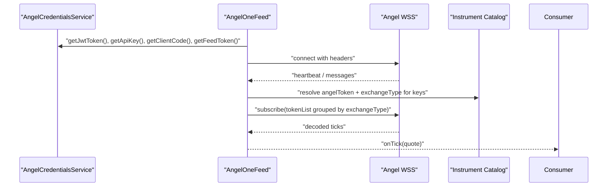
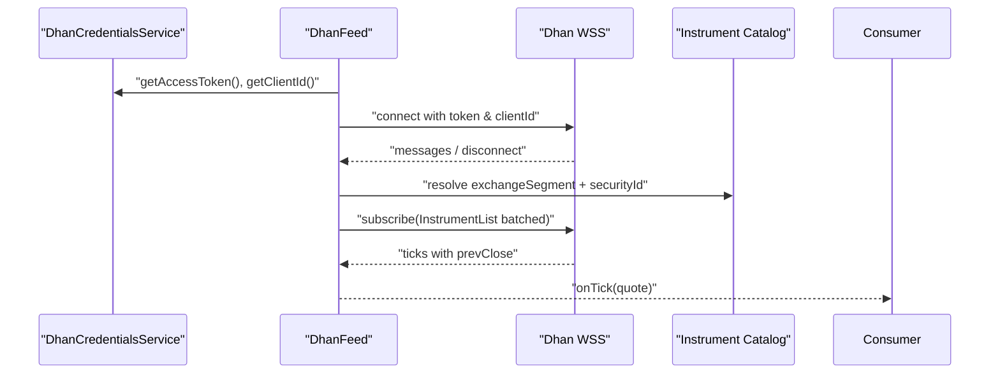
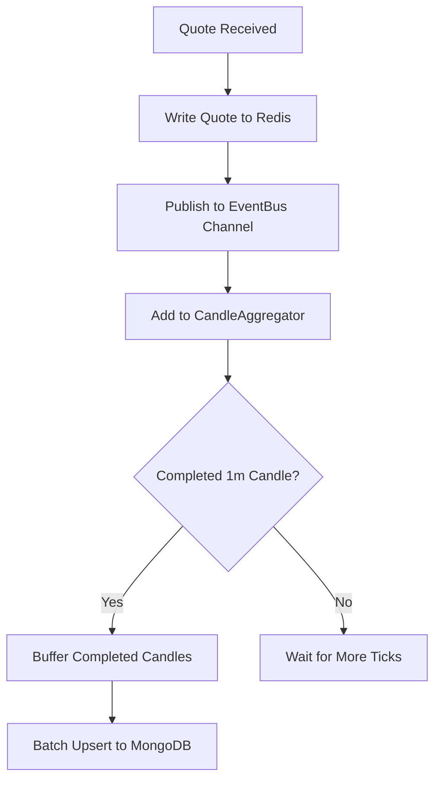
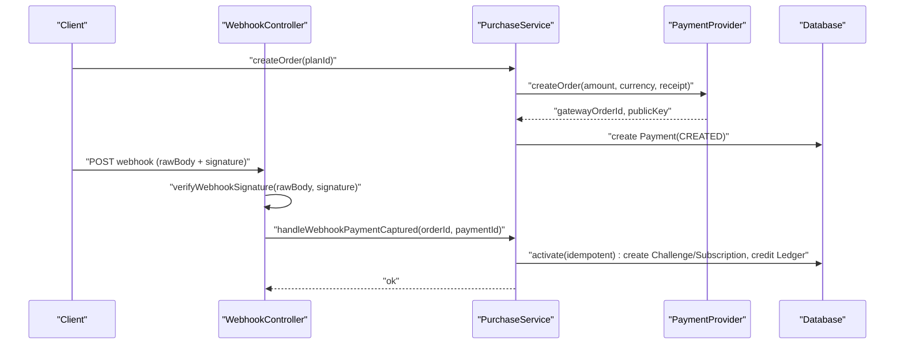
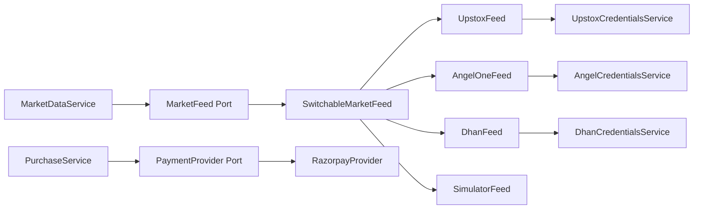

# External Integrations

<cite>
**Referenced Files in This Document**
- [market-feed.port.ts](file://backend/apps/api/src/modules/market/infrastructure/feed/market-feed.port.ts)
- [switchable-market-feed.ts](file://backend/apps/api/src/modules/market/infrastructure/feed/switchable-market-feed.ts)
- [upstox-feed.ts](file://backend/apps/api/src/modules/market/infrastructure/feed/upstox-feed.ts)
- [angel-one-feed.ts](file://backend/apps/api/src/modules/market/infrastructure/feed/angel-one-feed.ts)
- [dhan-feed.ts](file://backend/apps/api/src/modules/market/infrastructure/feed/dhan-feed.ts)
- [market-data.service.ts](file://backend/apps/api/src/modules/market/application/market-data.service.ts)
- [upstox-credentials.service.ts](file://backend/apps/api/src/modules/market/application/upstox-credentials.service.ts)
- [angel-credentials.service.ts](file://backend/apps/api/src/modules/market/application/angel-credentials.service.ts)
- [dhan-credentials.service.ts](file://backend/apps/api/src/modules/market/application/dhan-credentials.service.ts)
- [market-feed-mode.service.ts](file://backend/apps/api/src/modules/market/application/market-feed-mode.service.ts)
- [payment.port.ts](file://backend/apps/api/src/modules/plans/infrastructure/payment/payment.port.ts)
- [razorpay.provider.ts](file://backend/apps/api/src/modules/plans/infrastructure/payment/razorpay.provider.ts)
- [webhook.controller.ts](file://backend/apps/api/src/modules/plans/presentation/webhook.controller.ts)
- [purchase.service.ts](file://backend/apps/api/src/modules/plans/application/purchase.service.ts)
</cite>

## Table of Contents
1. Introduction
2. Project Structure
3. Core Components
4. Architecture Overview
5. Detailed Component Analysis
6. Dependency Analysis
7. Performance Considerations
8. Troubleshooting Guide
9. Conclusion
10. Appendices

## Introduction
This document explains the external integrations for market data brokers (Upstox, Angel One, Dhan) and payment processing (Razorpay). It covers the unified market data interface abstraction, broker-specific implementations, feed switching mechanisms, authentication flows, rate limiting, error handling, retry strategies, payment workflows, webhook handling, subscription management, refund processing, configuration and credentials, testing strategies, and monitoring/logging/alerting for external dependencies.

## Project Structure
The integration surface is organized by domain:
- Market data feeds: a unified port with multiple broker adapters and a switchable router that selects the active feed at runtime.
- Payment processing: a payment provider port with a Razorpay adapter and a webhook controller that validates signatures and triggers purchase activation.
- Application services coordinate subscriptions, Redis caching, event bus publishing, and persistence.

**Diagram sources**
- [market-feed.port.ts:1-23](file://backend/apps/api/src/modules/market/infrastructure/feed/market-feed.port.ts#L1-L23)
- [switchable-market-feed.ts:1-186](file://backend/apps/api/src/modules/market/infrastructure/feed/switchable-market-feed.ts#L1-L186)
- [upstox-feed.ts:1-136](file://backend/apps/api/src/modules/market/infrastructure/feed/upstox-feed.ts#L1-L136)
- [angel-one-feed.ts:1-242](file://backend/apps/api/src/modules/market/infrastructure/feed/angel-one-feed.ts#L1-L242)
- [dhan-feed.ts:1-279](file://backend/apps/api/src/modules/market/infrastructure/feed/dhan-feed.ts#L1-L279)
- [market-data.service.ts:1-139](file://backend/apps/api/src/modules/market/application/market-data.service.ts#L1-L139)
- [payment.port.ts:1-33](file://backend/apps/api/src/modules/plans/infrastructure/payment/payment.port.ts#L1-L33)
- [razorpay.provider.ts:1-53](file://backend/apps/api/src/modules/plans/infrastructure/payment/razorpay.provider.ts#L1-L53)
- [webhook.controller.ts:1-48](file://backend/apps/api/src/modules/plans/presentation/webhook.controller.ts#L1-L48)
- [purchase.service.ts:1-248](file://backend/apps/api/src/modules/plans/application/purchase.service.ts#L1-L248)

**Section sources**
- [market-feed.port.ts:1-23](file://backend/apps/api/src/modules/market/infrastructure/feed/market-feed.port.ts#L1-L23)
- [switchable-market-feed.ts:1-186](file://backend/apps/api/src/modules/market/infrastructure/feed/switchable-market-feed.ts#L1-L186)
- [payment.port.ts:1-33](file://backend/apps/api/src/modules/plans/infrastructure/payment/payment.port.ts#L1-L33)

## Core Components
- Unified Market Feed Port: defines a single interface for starting/stopping, subscribing/unsubscribing, tick callbacks, and staleness reporting.
- Switchable Feed Router: chooses between simulator and live brokers based on configured mode and credential availability; supports failover when stale.
- Broker Adapters: Upstox, Angel One, and Dhan implement the port with their own auth, message decoding, reconnection, and heartbeat handling.
- Market Data Service: owns the feed lifecycle, per-instrument interest tracking, Redis quote cache, event bus fan-out, 1m candle aggregation, and health watchdog.
- Payment Provider Port: abstracts order creation, checkout signature verification, webhook signature verification, and refunds.
- Razorpay Adapter: implements the port using Razorpay SDK and local HMAC verification.
- Webhook Controller: verifies webhook signatures and delegates to PurchaseService for activation.
- Purchase Service: orchestrates idempotent activation, subscription creation, ledger entries, and refunds.

**Section sources**
- [market-feed.port.ts:1-23](file://backend/apps/api/src/modules/market/infrastructure/feed/market-feed.port.ts#L1-L23)
- [switchable-market-feed.ts:1-186](file://backend/apps/api/src/modules/market/infrastructure/feed/switchable-market-feed.ts#L1-L186)
- [market-data.service.ts:1-139](file://backend/apps/api/src/modules/market/application/market-data.service.ts#L1-L139)
- [payment.port.ts:1-33](file://backend/apps/api/src/modules/plans/infrastructure/payment/payment.port.ts#L1-L33)
- [razorpay.provider.ts:1-53](file://backend/apps/api/src/modules/plans/infrastructure/payment/razorpay.provider.ts#L1-L53)
- [webhook.controller.ts:1-48](file://backend/apps/api/src/modules/plans/presentation/webhook.controller.ts#L1-L48)
- [purchase.service.ts:1-248](file://backend/apps/api/src/modules/plans/application/purchase.service.ts#L1-L248)

## Architecture Overview
The system uses ports/adapters to isolate external dependencies. The switchable feed routes ticks from one broker or simulator into a single pipeline that caches quotes, publishes events, aggregates candles, and monitors feed health. Payments are handled via a provider port; Razorpay is the concrete implementation. Webhooks are validated server-side before state changes.

**Diagram sources**
- [market-data.service.ts:1-139](file://backend/apps/api/src/modules/market/application/market-data.service.ts#L1-L139)
- [switchable-market-feed.ts:1-186](file://backend/apps/api/src/modules/market/infrastructure/feed/switchable-market-feed.ts#L1-L186)
- [market-feed.port.ts:1-23](file://backend/apps/api/src/modules/market/infrastructure/feed/market-feed.port.ts#L1-L23)

## Detailed Component Analysis

### Unified Market Feed Abstraction
- Purpose: Provide a consistent contract for any upstream market data source.
- Key methods: start/stop, subscribe/unsubscribe, onTick, secondsSinceLastTick.
- Design benefits: decouples consumers from broker specifics; enables runtime switching and testing with simulator.

**Section sources**
- [market-feed.port.ts:1-23](file://backend/apps/api/src/modules/market/infrastructure/feed/market-feed.port.ts#L1-L23)

### Switchable Market Feed Router
- Behavior: picks primary feed based on configured mode and credential availability; falls back to alternate live providers if the current feed is stale; finally falls back to simulator.
- Failover: periodic check compares seconds since last tick against threshold; switches to alternate live feed or simulator.
- Rebinding: subscribes/unsubscribes are tracked and reapplied after switching.

**Diagram sources**
- [switchable-market-feed.ts:1-186](file://backend/apps/api/src/modules/market/infrastructure/feed/switchable-market-feed.ts#L1-L186)
- [market-feed-mode.service.ts:1-99](file://backend/apps/api/src/modules/market/application/market-feed-mode.service.ts#L1-L99)

**Section sources**
- [switchable-market-feed.ts:1-186](file://backend/apps/api/src/modules/market/infrastructure/feed/switchable-market-feed.ts#L1-L186)
- [market-feed-mode.service.ts:1-99](file://backend/apps/api/src/modules/market/application/market-feed-mode.service.ts#L1-L99)

### Upstox Feed Integration
- Authentication: access token sourced from UpstoxCredentialsService (DB encrypted values override environment variables); feed URL obtained via authorize endpoint.
- Connection: WebSocket with Bearer token; reconnects with exponential backoff up to a cap; handles binary protobuf messages and maps to Quote.
- Subscriptions: sends JSON subscribe/unsubscribe messages; tracks subscribed keys.
- Error handling: logs errors, closes socket on error/close, schedules reconnect.

**Diagram sources**
- [upstox-feed.ts:1-136](file://backend/apps/api/src/modules/market/infrastructure/feed/upstox-feed.ts#L1-L136)
- [upstox-credentials.service.ts:1-216](file://backend/apps/api/src/modules/market/application/upstox-credentials.service.ts#L1-L216)

**Section sources**
- [upstox-feed.ts:1-136](file://backend/apps/api/src/modules/market/infrastructure/feed/upstox-feed.ts#L1-L136)
- [upstox-credentials.service.ts:1-216](file://backend/apps/api/src/modules/market/application/upstox-credentials.service.ts#L1-L216)

### Angel One Feed Integration
- Authentication: requires API key, client code, JWT token, and feed token; all sourced from AngelCredentialsService (DB encrypted overrides env).
- Connection: WebSocket with required headers; heartbeat ping every fixed interval; reconnects with backoff.
- Mapping: resolves canonical instrument keys to exchangeType/token pairs via instrument catalog; decodes packets to Quote.
- Subscriptions: groups tokens by exchange type and sends batched subscribe/unsubscribe requests.

**Diagram sources**
- [angel-one-feed.ts:1-242](file://backend/apps/api/src/modules/market/infrastructure/feed/angel-one-feed.ts#L1-L242)
- [angel-credentials.service.ts:1-305](file://backend/apps/api/src/modules/market/application/angel-credentials.service.ts#L1-L305)

**Section sources**
- [angel-one-feed.ts:1-242](file://backend/apps/api/src/modules/market/infrastructure/feed/angel-one-feed.ts#L1-L242)
- [angel-credentials.service.ts:1-305](file://backend/apps/api/src/modules/market/application/angel-credentials.service.ts#L1-L305)

### Dhan Feed Integration
- Authentication: access token and client ID sourced from DhanCredentialsService (DB encrypted overrides env); URL includes query parameters for version, token, clientId, authType.
- Connection: WebSocket with auto-pong; handles disconnect packets and reconnects with backoff.
- Mapping: resolves canonical instrument keys to exchangeSegment/securityId via catalog or parsing DHAN|… keys; maintains prevClose per route.
- Subscriptions: batches instrument lists to respect provider limits.

**Diagram sources**
- [dhan-feed.ts:1-279](file://backend/apps/api/src/modules/market/infrastructure/feed/dhan-feed.ts#L1-L279)
- [dhan-credentials.service.ts:1-282](file://backend/apps/api/src/modules/market/application/dhan-credentials.service.ts#L1-L282)

**Section sources**
- [dhan-feed.ts:1-279](file://backend/apps/api/src/modules/market/infrastructure/feed/dhan-feed.ts#L1-L279)
- [dhan-credentials.service.ts:1-282](file://backend/apps/api/src/modules/market/application/dhan-credentials.service.ts#L1-L282)

### Market Data Pipeline
- Interest-based subscription: only subscribes to instruments with positive consumer interest; unsubscribes when no longer needed.
- Quote caching: writes normalized quotes to Redis with TTL.
- Event bus: publishes quotes per instrument channel for subscribers.
- Candle aggregation: aggregates 1-minute candles and flushes in batches to MongoDB.
- Health watchdog: during market hours, warns and resubscribes if no ticks received beyond threshold.

**Diagram sources**
- [market-data.service.ts:1-139](file://backend/apps/api/src/modules/market/application/market-data.service.ts#L1-L139)

**Section sources**
- [market-data.service.ts:1-139](file://backend/apps/api/src/modules/market/application/market-data.service.ts#L1-L139)

### Payment Processing Workflow
- Order creation: creates gateway order via PaymentProvider; stores payment intent with status CREATED.
- Checkout confirmation: verifies client-side signature; activates plan if valid.
- Webhook handling: verifies raw body signature; delegates to activation path; returns 200 even for unprocessable verified events to stop retries.
- Activation: idempotent per order using Redis lock; creates challenge and subscription; credits virtual capital via ledger; emits event.
- Refund: locks per payment; calls provider refund; updates payment status; cancels subscription and challenge; audits action.

**Diagram sources**
- [webhook.controller.ts:1-48](file://backend/apps/api/src/modules/plans/presentation/webhook.controller.ts#L1-L48)
- [purchase.service.ts:1-248](file://backend/apps/api/src/modules/plans/application/purchase.service.ts#L1-L248)
- [payment.port.ts:1-33](file://backend/apps/api/src/modules/plans/infrastructure/payment/payment.port.ts#L1-L33)
- [razorpay.provider.ts:1-53](file://backend/apps/api/src/modules/plans/infrastructure/payment/razorpay.provider.ts#L1-L53)

**Section sources**
- [webhook.controller.ts:1-48](file://backend/apps/api/src/modules/plans/presentation/webhook.controller.ts#L1-L48)
- [purchase.service.ts:1-248](file://backend/apps/api/src/modules/plans/application/purchase.service.ts#L1-L248)
- [payment.port.ts:1-33](file://backend/apps/api/src/modules/plans/infrastructure/payment/payment.port.ts#L1-L33)
- [razorpay.provider.ts:1-53](file://backend/apps/api/src/modules/plans/infrastructure/payment/razorpay.provider.ts#L1-L53)

### Authentication Flows
- Upstox: access token loaded from encrypted DB or environment; feed URL authorized via REST; WebSocket authenticated with Bearer token.
- Angel One: API key, client code, JWT, and feed token loaded from encrypted DB or environment; WebSocket authenticated with headers including JWT and feed token; optional login flow to obtain JWT and feed token.
- Dhan: access token and client ID loaded from encrypted DB or environment; WebSocket URL includes token and clientId; profile endpoint available for connectivity tests.

**Section sources**
- [upstox-credentials.service.ts:1-216](file://backend/apps/api/src/modules/market/application/upstox-credentials.service.ts#L1-L216)
- [angel-credentials.service.ts:1-305](file://backend/apps/api/src/modules/market/application/angel-credentials.service.ts#L1-L305)
- [dhan-credentials.service.ts:1-282](file://backend/apps/api/src/modules/market/application/dhan-credentials.service.ts#L1-L282)
- [upstox-feed.ts:1-136](file://backend/apps/api/src/modules/market/infrastructure/feed/upstox-feed.ts#L1-L136)
- [angel-one-feed.ts:1-242](file://backend/apps/api/src/modules/market/infrastructure/feed/angel-one-feed.ts#L1-L242)
- [dhan-feed.ts:1-279](file://backend/apps/api/src/modules/market/infrastructure/feed/dhan-feed.ts#L1-L279)

### Rate Limiting
- Dhan batching: instrument subscriptions are sent in batches to respect provider constraints.
- Angel grouping: tokens grouped by exchange type to minimize messages.
- Note: explicit rate limiters are not implemented in these files; adhere to provider quotas by batching and avoiding excessive reconnections.

**Section sources**
- [dhan-feed.ts:1-279](file://backend/apps/api/src/modules/market/infrastructure/feed/dhan-feed.ts#L1-L279)
- [angel-one-feed.ts:1-242](file://backend/apps/api/src/modules/market/infrastructure/feed/angel-one-feed.ts#L1-L242)

### Error Handling and Retry Strategies
- Broker feeds: exponential backoff with capped delay; close and reconnect on errors/closes; handle provider-specific disconnect signals; log warnings on reconnect attempts.
- Stale feed detection: periodic checks trigger failover to alternate live feed or simulator if idle exceeds threshold during market hours.
- Payment webhooks: reject invalid signatures; return 200 for verified but unprocessable events to prevent retries; idempotent activation prevents duplicate credits.

**Section sources**
- [upstox-feed.ts:1-136](file://backend/apps/api/src/modules/market/infrastructure/feed/upstox-feed.ts#L1-L136)
- [angel-one-feed.ts:1-242](file://backend/apps/api/src/modules/market/infrastructure/feed/angel-one-feed.ts#L1-L242)
- [dhan-feed.ts:1-279](file://backend/apps/api/src/modules/market/infrastructure/feed/dhan-feed.ts#L1-L279)
- [switchable-market-feed.ts:1-186](file://backend/apps/api/src/modules/market/infrastructure/feed/switchable-market-feed.ts#L1-L186)
- [webhook.controller.ts:1-48](file://backend/apps/api/src/modules/plans/presentation/webhook.controller.ts#L1-L48)
- [purchase.service.ts:1-248](file://backend/apps/api/src/modules/plans/application/purchase.service.ts#L1-L248)

### Configuration and Credential Management
- Credentials: stored encrypted in database with environment fallback; hot-reloaded via Redis pub/sub; change listeners trigger feed rebinds.
- Feed mode: configurable via database row and environment; hot-reloaded across processes; defaults to simulator if invalid.
- Payment: Razorpay keys and webhook secret loaded from configuration service; amounts in paise; public key exposed to frontend.

**Section sources**
- [upstox-credentials.service.ts:1-216](file://backend/apps/api/src/modules/market/application/upstox-credentials.service.ts#L1-L216)
- [angel-credentials.service.ts:1-305](file://backend/apps/api/src/modules/market/application/angel-credentials.service.ts#L1-L305)
- [dhan-credentials.service.ts:1-282](file://backend/apps/api/src/modules/market/application/dhan-credentials.service.ts#L1-L282)
- [market-feed-mode.service.ts:1-99](file://backend/apps/api/src/modules/market/application/market-feed-mode.service.ts#L1-L99)
- [razorpay.provider.ts:1-53](file://backend/apps/api/src/modules/plans/infrastructure/payment/razorpay.provider.ts#L1-L53)

### Testing Strategies
- Simulator feed: deterministic feed for development/test/replay; used as fallback when live credentials are missing or feed is stale.
- Mock providers: payment provider port allows swapping Razorpay for other gateways; use manual provider or test doubles in unit/integration tests.
- Integration patterns: use e2e specs and setup scripts to seed configurations and instruments; leverage Redis locks and idempotency keys to validate concurrent activation paths.

**Section sources**
- [switchable-market-feed.ts:1-186](file://backend/apps/api/src/modules/market/infrastructure/feed/switchable-market-feed.ts#L1-L186)
- [payment.port.ts:1-33](file://backend/apps/api/src/modules/plans/infrastructure/payment/payment.port.ts#L1-L33)

### Monitoring, Logging, and Alerting
- Logging: each feed adapter logs connection states, errors, and reconnect attempts; switchable feed logs mode switches; market data service logs pipeline start, stale feed warnings, and candle flush failures.
- Health checks: stale feed watchdog warns and resubscribes; feed mode service reloads on config changes; credential services expose public status for admin UI.
- Alerting hooks: consider integrating with alerting systems on STALE FEED warnings and payment signature invalid events.

**Section sources**
- [upstox-feed.ts:1-136](file://backend/apps/api/src/modules/market/infrastructure/feed/upstox-feed.ts#L1-L136)
- [angel-one-feed.ts:1-242](file://backend/apps/api/src/modules/market/infrastructure/feed/angel-one-feed.ts#L1-L242)
- [dhan-feed.ts:1-279](file://backend/apps/api/src/modules/market/infrastructure/feed/dhan-feed.ts#L1-L279)
- [switchable-market-feed.ts:1-186](file://backend/apps/api/src/modules/market/infrastructure/feed/switchable-market-feed.ts#L1-L186)
- [market-data.service.ts:1-139](file://backend/apps/api/src/modules/market/application/market-data.service.ts#L1-L139)
- [webhook.controller.ts:1-48](file://backend/apps/api/src/modules/plans/presentation/webhook.controller.ts#L1-L48)

## Dependency Analysis
- Coupling: MarketDataService depends on MarketFeed port; SwitchableMarketFeed composes all feed adapters; broker feeds depend on respective credentials services and instrument catalogs.
- Cohesion: Each adapter encapsulates protocol details, mapping, and reconnection logic; payment layer isolates gateway specifics behind a port.
- External dependencies: WebSocket clients, HTTP fetch calls to broker APIs, Razorpay SDK, Redis for caching/pub/sub/locks, MongoDB for persistence.

**Diagram sources**
- [market-data.service.ts:1-139](file://backend/apps/api/src/modules/market/application/market-data.service.ts#L1-L139)
- [switchable-market-feed.ts:1-186](file://backend/apps/api/src/modules/market/infrastructure/feed/switchable-market-feed.ts#L1-L186)
- [upstox-credentials.service.ts:1-216](file://backend/apps/api/src/modules/market/application/upstox-credentials.service.ts#L1-L216)
- [angel-credentials.service.ts:1-305](file://backend/apps/api/src/modules/market/application/angel-credentials.service.ts#L1-L305)
- [dhan-credentials.service.ts:1-282](file://backend/apps/api/src/modules/market/application/dhan-credentials.service.ts#L1-L282)
- [purchase.service.ts:1-248](file://backend/apps/api/src/modules/plans/application/purchase.service.ts#L1-L248)
- [payment.port.ts:1-33](file://backend/apps/api/src/modules/plans/infrastructure/payment/payment.port.ts#L1-L33)
- [razorpay.provider.ts:1-53](file://backend/apps/api/src/modules/plans/infrastructure/payment/razorpay.provider.ts#L1-L53)

**Section sources**
- [market-data.service.ts:1-139](file://backend/apps/api/src/modules/market/application/market-data.service.ts#L1-L139)
- [switchable-market-feed.ts:1-186](file://backend/apps/api/src/modules/market/infrastructure/feed/switchable-market-feed.ts#L1-L186)
- [purchase.service.ts:1-248](file://backend/apps/api/src/modules/plans/application/purchase.service.ts#L1-L248)

## Performance Considerations
- On-demand subscriptions: only instruments with active consumers are subscribed upstream to avoid overhead.
- Batching: candle writes are batched; Dhan subscriptions are batched; Angel subscriptions grouped by exchange type.
- Reconnection backoff: exponential backoff with caps reduces load on broker endpoints during outages.
- Staleness thresholds: configurable thresholds help balance responsiveness vs. resource usage.

[No sources needed since this section provides general guidance]

## Troubleshooting Guide
- No ticks during market hours: check feed mode, credentials configuration, and stale feed alerts; ensure instruments have mappings for Angel/Dhan.
- Signature invalid webhook: verify webhook secret and raw body handling; ensure middleware preserves req.rawBody.
- Payment not activating: inspect idempotency keys and Redis locks; confirm gateway order IDs match; check payment status transitions.
- Feed mode not switching: verify feed mode service reloads and Redis pub/sub channels; ensure credentials services emit change events.

**Section sources**
- [market-data.service.ts:1-139](file://backend/apps/api/src/modules/market/application/market-data.service.ts#L1-L139)
- [webhook.controller.ts:1-48](file://backend/apps/api/src/modules/plans/presentation/webhook.controller.ts#L1-L48)
- [purchase.service.ts:1-248](file://backend/apps/api/src/modules/plans/application/purchase.service.ts#L1-L248)
- [market-feed-mode.service.ts:1-99](file://backend/apps/api/src/modules/market/application/market-feed-mode.service.ts#L1-L99)

## Conclusion
The integration layer cleanly abstracts external broker and payment providers through well-defined ports, enabling flexible routing, robust error handling, and operational resilience. The switchable feed mechanism ensures continuity with automatic failover, while payments are secured with signature verification and idempotent activation. Proper configuration, credential management, and monitoring provide a solid foundation for production operations.

[No sources needed since this section summarizes without analyzing specific files]

## Appendices

### Environment Variables and Configuration Keys
- Market feed mode: MARKET_FEED (defaults to simulator if invalid).
- Upstox: UPSTOX_ACCESS_TOKEN, UPSTOX_API_KEY, UPSTOX_API_SECRET (environment fallback; DB encrypted values take precedence).
- Angel One: ANGEL_API_KEY, ANGEL_CLIENT_CODE, ANGEL_JWT_TOKEN, ANGEL_FEED_TOKEN (environment fallback; DB encrypted values take precedence).
- Dhan: DHAN_CLIENT_ID, DHAN_ACCESS_TOKEN (environment fallback; DB encrypted values take precedence).
- Razorpay: RAZORPAY_KEY_ID, RAZORPAY_KEY_SECRET, RAZORPAY_WEBHOOK_SECRET.
- Encryption: DATA_ENC_SECRET used to encrypt/decrypt stored secrets.

**Section sources**
- [market-feed-mode.service.ts:1-99](file://backend/apps/api/src/modules/market/application/market-feed-mode.service.ts#L1-L99)
- [upstox-credentials.service.ts:1-216](file://backend/apps/api/src/modules/market/application/upstox-credentials.service.ts#L1-L216)
- [angel-credentials.service.ts:1-305](file://backend/apps/api/src/modules/market/application/angel-credentials.service.ts#L1-L305)
- [dhan-credentials.service.ts:1-282](file://backend/apps/api/src/modules/market/application/dhan-credentials.service.ts#L1-L282)
- [razorpay.provider.ts:1-53](file://backend/apps/api/src/modules/plans/infrastructure/payment/razorpay.provider.ts#L1-L53)