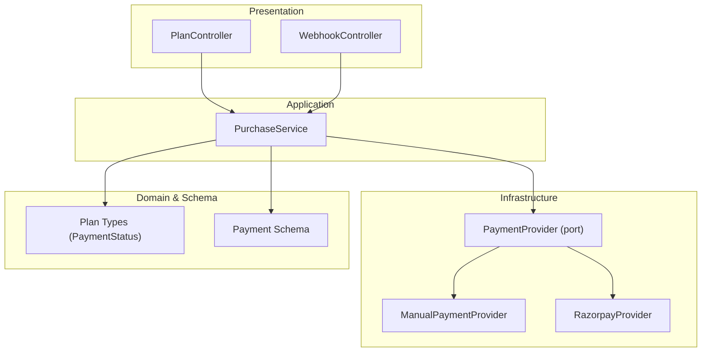
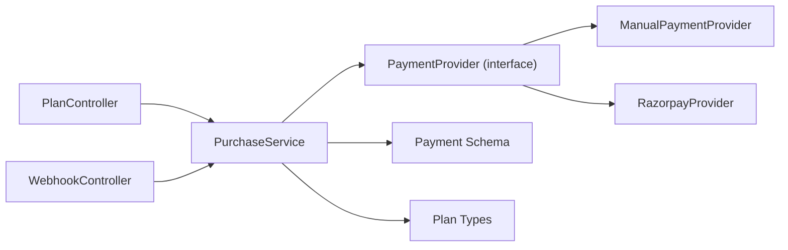
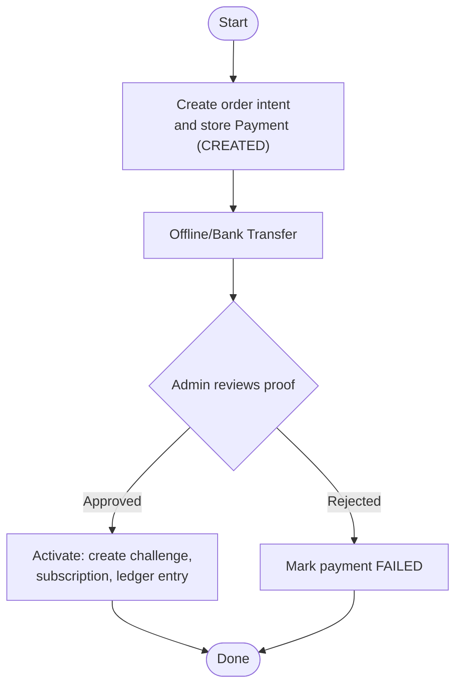

# Manual Payment Workflow

<cite>
**Referenced Files in This Document**
- [manual.provider.ts](file://backend/apps/api/src/modules/plans/infrastructure/payment/manual.provider.ts)
- [payment.port.ts](file://backend/apps/api/src/modules/plans/infrastructure/payment/payment.port.ts)
- [razorpay.provider.ts](file://backend/apps/api/src/modules/plans/infrastructure/payment/razorpay.provider.ts)
- [purchase.service.ts](file://backend/apps/api/src/modules/plans/application/purchase.service.ts)
- [webhook.controller.ts](file://backend/apps/api/src/modules/plans/presentation/webhook.controller.ts)
- [plan.controller.ts](file://backend/apps/api/src/modules/plans/presentation/plan.controller.ts)
- [payment.schema.ts](file://backend/apps/api/src/modules/plans/infrastructure/schemas/payment.schema.ts)
- [plan.types.ts](file://backend/apps/api/src/modules/plans/domain/plan.types.ts)
- [P3-plans-payments.md](file://docs/P3-plans-payments.md)
</cite>

## Table of Contents
1. Introduction
2. Project Structure
3. Core Components
4. Architecture Overview
5. Detailed Component Analysis
6. Dependency Analysis
7. Performance Considerations
8. Troubleshooting Guide
9. Conclusion
10. Appendices

## Introduction
This document explains the manual payment workflow that supports offline or bank transfer payments, focusing on the ManualProvider implementation and its role within a unified payment abstraction layer. It covers the end-to-end process from payment submission to administrative approval, payment status management, approval workflows, audit trails, integration points with automated providers (e.g., Razorpay), reconciliation processes, and reporting capabilities for tracking manual transactions.

## Project Structure
The manual payment flow is implemented as part of the Plans module:
- Presentation layer exposes user/admin endpoints and webhooks.
- Application layer orchestrates purchase creation, activation, refunds, and queries.
- Infrastructure provides the payment provider abstraction and concrete implementations (Manual and Razorpay).
- Domain types define state machines for payments, subscriptions, and challenges.
- Schemas persist payment records and related entities.



**Diagram sources**
- [plan.controller.ts:25-63](file://backend/apps/api/src/modules/plans/presentation/plan.controller.ts#L25-L63)
- [webhook.controller.ts:13-47](file://backend/apps/api/src/modules/plans/presentation/webhook.controller.ts#L13-L47)
- [purchase.service.ts:18-34](file://backend/apps/api/src/modules/plans/application/purchase.service.ts#L18-L34)
- [payment.port.ts:20-32](file://backend/apps/api/src/modules/plans/infrastructure/payment/payment.port.ts#L20-L32)
- [manual.provider.ts:10-31](file://backend/apps/api/src/modules/plans/infrastructure/payment/manual.provider.ts#L10-L31)
- [razorpay.provider.ts:11-52](file://backend/apps/api/src/modules/plans/infrastructure/payment/razorpay.provider.ts#L11-L52)
- [plan.types.ts:27-33](file://backend/apps/api/src/modules/plans/domain/plan.types.ts#L27-L33)
- [payment.schema.ts:5-56](file://backend/apps/api/src/modules/plans/infrastructure/schemas/payment.schema.ts#L5-L56)

**Section sources**
- [plan.controller.ts:25-63](file://backend/apps/api/src/modules/plans/presentation/plan.controller.ts#L25-L63)
- [webhook.controller.ts:13-47](file://backend/apps/api/src/modules/plans/presentation/webhook.controller.ts#L13-L47)
- [purchase.service.ts:18-34](file://backend/apps/api/src/modules/plans/application/purchase.service.ts#L18-L34)
- [payment.port.ts:20-32](file://backend/apps/api/src/modules/plans/infrastructure/payment/payment.port.ts#L20-L32)
- [manual.provider.ts:10-31](file://backend/apps/api/src/modules/plans/infrastructure/payment/manual.provider.ts#L10-L31)
- [razorpay.provider.ts:11-52](file://backend/apps/api/src/modules/plans/infrastructure/payment/razorpay.provider.ts#L11-L52)
- [plan.types.ts:27-33](file://backend/apps/api/src/modules/plans/domain/plan.types.ts#L27-L33)
- [payment.schema.ts:5-56](file://backend/apps/api/src/modules/plans/infrastructure/schemas/payment.schema.ts#L5-L56)

## Core Components
- PaymentProvider port: Defines the contract for all payment providers (create order, verify signatures, refund).
- ManualPaymentProvider: A dev/test provider that simulates payments without external gateways; always verifies signatures and returns synthetic IDs.
- RazorpayProvider: Production-ready provider integrating with an external gateway, including HMAC signature verification and refunds.
- PurchaseService: Orchestrates creating orders, confirming checkout, handling webhooks, idempotent activation, listing payments, and processing refunds.
- WebhookController: Verifies webhook signatures and delegates captured events to PurchaseService.
- PlanController: Exposes user-facing endpoints for ordering and confirmation.
- Payment schema and types: Persist payment records and define state transitions.

Key responsibilities:
- Abstraction over payment gateways via the PaymentProvider interface.
- Idempotent activation ensuring exactly-once capital crediting.
- Audit logging for critical actions.
- Admin APIs for viewing and refunding payments.

**Section sources**
- [payment.port.ts:1-32](file://backend/apps/api/src/modules/plans/infrastructure/payment/payment.port.ts#L1-L32)
- [manual.provider.ts:10-31](file://backend/apps/api/src/modules/plans/infrastructure/payment/manual.provider.ts#L10-L31)
- [razorpay.provider.ts:11-52](file://backend/apps/api/src/modules/plans/infrastructure/payment/razorpay.provider.ts#L11-L52)
- [purchase.service.ts:36-246](file://backend/apps/api/src/modules/plans/application/purchase.service.ts#L36-L246)
- [webhook.controller.ts:13-47](file://backend/apps/api/src/modules/plans/presentation/webhook.controller.ts#L13-L47)
- [plan.controller.ts:25-63](file://backend/apps/api/src/modules/plans/presentation/plan.controller.ts#L25-L63)
- [payment.schema.ts:5-56](file://backend/apps/api/src/modules/plans/infrastructure/schemas/payment.schema.ts#L5-L56)
- [plan.types.ts:27-33](file://backend/apps/api/src/modules/plans/domain/plan.types.ts#L27-L33)

## Architecture Overview
The system uses a provider abstraction so manual and automated flows share the same orchestration logic. For manual payments, the provider fakes gateway interactions; for automated payments, it integrates with a real gateway. Activation is idempotent and guarded by locks and unique keys.

```mermaid
sequenceDiagram
participant Client as "Client App"
participant PC as "PlanController"
participant PS as "PurchaseService"
participant PP as "PaymentProvider"
participant DB as "Payments/Plans/Challenges"
participant WC as "WebhookController"
Client->>PC : POST /plans/order {planId}
PC->>PS : createOrder(userId, planId)
PS->>PP : createOrder(amount, currency, receipt)
PP-->>PS : CreatedOrder
PS->>DB : Create Payment (status=CREATED)
PS-->>PC : {paymentId, gatewayOrderId, amount, currency, publicKey}
Note over Client,WC : For manual : client triggers confirm; for automated : webhook arrives
Client->>PC : POST /plans/confirm {orderId,paymentId,signature}
PC->>PS : confirmCheckout(...)
PS->>PP : verifyCheckoutSignature(...)
PP-->>PS : true/false
PS->>DB : Activate (idempotent) -> CAPTURED/ACTIVATED
WC->>PS : handleWebhookPaymentCaptured(orderId, paymentId, meta)
PS->>DB : Activate (idempotent) -> CAPTURED/ACTIVATED
```

**Diagram sources**
- [plan.controller.ts:39-50](file://backend/apps/api/src/modules/plans/presentation/plan.controller.ts#L39-L50)
- [purchase.service.ts:36-98](file://backend/apps/api/src/modules/plans/application/purchase.service.ts#L36-L98)
- [webhook.controller.ts:22-45](file://backend/apps/api/src/modules/plans/presentation/webhook.controller.ts#L22-L45)
- [payment.port.ts:20-32](file://backend/apps/api/src/modules/plans/infrastructure/payment/payment.port.ts#L20-L32)
- [manual.provider.ts:15-26](file://backend/apps/api/src/modules/plans/infrastructure/payment/manual.provider.ts#L15-L26)
- [razorpay.provider.ts:27-44](file://backend/apps/api/src/modules/plans/infrastructure/payment/razorpay.provider.ts#L27-L44)

## Detailed Component Analysis

### ManualPaymentProvider
Role:
- Implements the PaymentProvider interface for manual/offline payments.
- Generates synthetic gateway order IDs and always passes signature verification to enable end-to-end testing without external services.
- Provides a refund stub returning a synthetic refund ID.

Integration notes:
- Used when PAYMENT_PROVIDER is set to manual.
- Suitable for offline/bank transfer scenarios where manual review precedes activation.

**Section sources**
- [manual.provider.ts:10-31](file://backend/apps/api/src/modules/plans/infrastructure/payment/manual.provider.ts#L10-L31)
- [payment.port.ts:20-32](file://backend/apps/api/src/modules/plans/infrastructure/payment/payment.port.ts#L20-L32)

### PaymentProvider Port
Purpose:
- Defines a stable contract for any payment provider: create order, verify checkout signature, verify webhook signature, and refund.
- Enables swapping between manual and automated providers transparently.

**Section sources**
- [payment.port.ts:1-32](file://backend/apps/api/src/modules/plans/infrastructure/payment/payment.port.ts#L1-L32)

### RazorpayProvider
Purpose:
- Integrates with Razorpay to create orders, verify signatures using HMAC-SHA256, and process refunds.
- Demonstrates how automated providers implement the same interface.

**Section sources**
- [razorpay.provider.ts:11-52](file://backend/apps/api/src/modules/plans/infrastructure/payment/razorpay.provider.ts#L11-L52)

### PurchaseService
Responsibilities:
- Creates purchase intents and gateway orders.
- Confirms checkout via client-provided signatures.
- Handles server-side webhook events for captured payments.
- Performs idempotent activation: creates challenge, subscription, ledger entry, updates payment status, emits domain event, and records audit log.
- Lists payments for admin and processes refunds with locking and audit.

Key behaviors:
- Idempotency via Redis lock and unique idempotency key ensures exactly-once activation.
- Status transitions enforced through checks before activation.
- Refund flow cancels subscription and marks challenge expired if applicable.

**Section sources**
- [purchase.service.ts:36-246](file://backend/apps/api/src/modules/plans/application/purchase.service.ts#L36-L246)

### WebhookController
Responsibilities:
- Validates webhook signatures using the configured provider.
- Parses captured events and delegates to PurchaseService for activation.

Error handling:
- Rejects invalid signatures with 400.
- Returns 200 for verified but unprocessable events to stop retries.

**Section sources**
- [webhook.controller.ts:13-47](file://backend/apps/api/src/modules/plans/presentation/webhook.controller.ts#L13-L47)

### PlanController
Responsibilities:
- Exposes endpoints for users to create orders and confirm checkout.
- Throttles order creation to prevent abuse.

**Section sources**
- [plan.controller.ts:25-63](file://backend/apps/api/src/modules/plans/presentation/plan.controller.ts#L25-L63)

### Payment Schema and Types
- Payment schema persists payment details, provider, gateway IDs, idempotency key, and status.
- PaymentStatus enum defines lifecycle states: CREATED, CAPTURED, ACTIVATED, FAILED, REFUNDED.

**Section sources**
- [payment.schema.ts:5-56](file://backend/apps/api/src/modules/plans/infrastructure/schemas/payment.schema.ts#L5-L56)
- [plan.types.ts:27-33](file://backend/apps/api/src/modules/plans/domain/plan.types.ts#L27-L33)

## Dependency Analysis
The following diagram shows how components depend on each other and on the provider abstraction.



**Diagram sources**
- [plan.controller.ts:25-63](file://backend/apps/api/src/modules/plans/presentation/plan.controller.ts#L25-L63)
- [webhook.controller.ts:13-47](file://backend/apps/api/src/modules/plans/presentation/webhook.controller.ts#L13-L47)
- [purchase.service.ts:18-34](file://backend/apps/api/src/modules/plans/application/purchase.service.ts#L18-L34)
- [payment.port.ts:20-32](file://backend/apps/api/src/modules/plans/infrastructure/payment/payment.port.ts#L20-L32)
- [manual.provider.ts:10-31](file://backend/apps/api/src/modules/plans/infrastructure/payment/manual.provider.ts#L10-L31)
- [razorpay.provider.ts:11-52](file://backend/apps/api/src/modules/plans/infrastructure/payment/razorpay.provider.ts#L11-L52)
- [payment.schema.ts:5-56](file://backend/apps/api/src/modules/plans/infrastructure/schemas/payment.schema.ts#L5-L56)
- [plan.types.ts:27-33](file://backend/apps/api/src/modules/plans/domain/plan.types.ts#L27-L33)

**Section sources**
- [plan.controller.ts:25-63](file://backend/apps/api/src/modules/plans/presentation/plan.controller.ts#L25-L63)
- [webhook.controller.ts:13-47](file://backend/apps/api/src/modules/plans/presentation/webhook.controller.ts#L13-L47)
- [purchase.service.ts:18-34](file://backend/apps/api/src/modules/plans/application/purchase.service.ts#L18-L34)
- [payment.port.ts:20-32](file://backend/apps/api/src/modules/plans/infrastructure/payment/payment.port.ts#L20-L32)

## Performance Considerations
- Idempotent activation is protected by per-order Redis locks to avoid duplicate capital credits under concurrent webhook and client confirm calls.
- Signature verification is local (HMAC) for Razorpay, avoiding network overhead during validation.
- Manual provider avoids external calls, making development and testing fast.
- Use pagination for admin payment listings to handle large datasets efficiently.

[No sources needed since this section provides general guidance]

## Troubleshooting Guide
Common issues and resolutions:
- Invalid webhook signature: Ensure raw body is preserved and webhook secret matches configuration. The controller rejects invalid signatures with 400.
- Duplicate activation attempts: The system is idempotent; repeated activations return success with the existing challenge ID.
- Missing gateway payment ID for refund: Refunds require a captured gateway payment; ensure the payment has a gatewayPaymentId before attempting refund.
- KYC or active challenge constraints: Order creation validates KYC status and optional policy preventing multiple active challenges.

Operational tips:
- Use admin payment listing to filter by status and page through results.
- Log and inspect last webhook metadata stored on the payment record for debugging.

**Section sources**
- [webhook.controller.ts:22-45](file://backend/apps/api/src/modules/plans/presentation/webhook.controller.ts#L22-L45)
- [purchase.service.ts:105-182](file://backend/apps/api/src/modules/plans/application/purchase.service.ts#L105-L182)
- [purchase.service.ts:212-246](file://backend/apps/api/src/modules/plans/application/purchase.service.ts#L212-L246)
- [purchase.service.ts:36-82](file://backend/apps/api/src/modules/plans/application/purchase.service.ts#L36-L82)

## Conclusion
The manual payment workflow leverages a clean provider abstraction to support both offline/manual and automated payments through the same orchestration layer. ManualProvider enables end-to-end testing and offline flows, while RazorpayProvider handles production integrations. PurchaseService ensures robust, idempotent activation, comprehensive auditing, and consistent state transitions. Admin APIs provide visibility and control for reviewing and refunding payments, supporting reconciliation and reporting needs.

[No sources needed since this section summarizes without analyzing specific files]

## Appendices

### End-to-End Manual Payment Flow (Conceptual)


[No sources needed since this diagram shows conceptual workflow, not actual code structure]

### API Reference Summary
- User endpoints:
  - POST /plans/order: Create order intent; returns gatewayOrderId, amount, currency, publicKey.
  - POST /plans/confirm: Confirm checkout with signature; activates payment.
  - GET /plans/me/payments: List user payments.
  - GET /plans/me/subscription: Active subscription summary.
- Webhook:
  - POST /webhooks/payment: Gateway webhook; verifies signature and triggers activation.
- Admin endpoints:
  - GET /admin/payments?status=&page=&pageSize=: Paginated payment list.
  - POST /admin/payments/:id/refund: Process refund with reason.

Configuration:
- PAYMENT_PROVIDER=manual|razorpay (default manual).
- For Razorpay: RAZORPAY_KEY_ID, RAZORPAY_KEY_SECRET, RAZORPAY_WEBHOOK_SECRET required.

**Section sources**
- [P3-plans-payments.md:32-58](file://docs/P3-plans-payments.md#L32-L58)