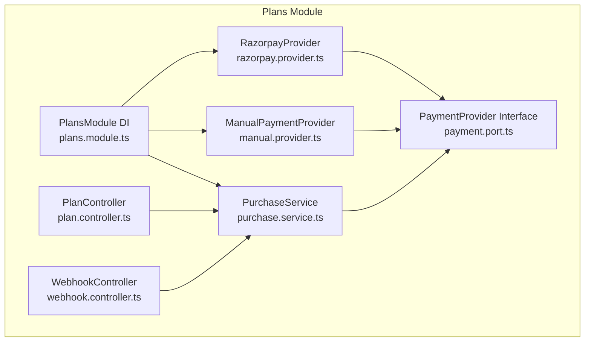
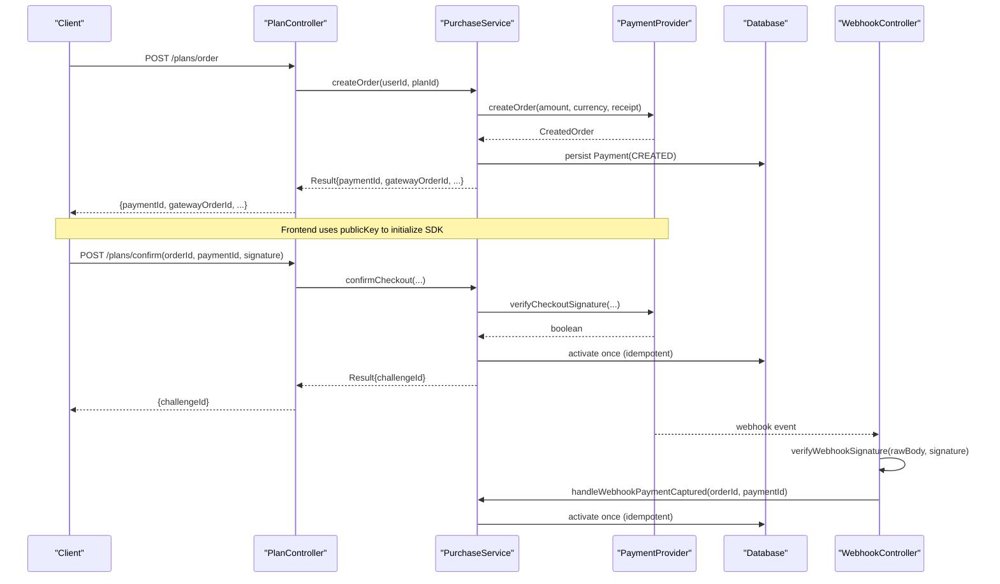
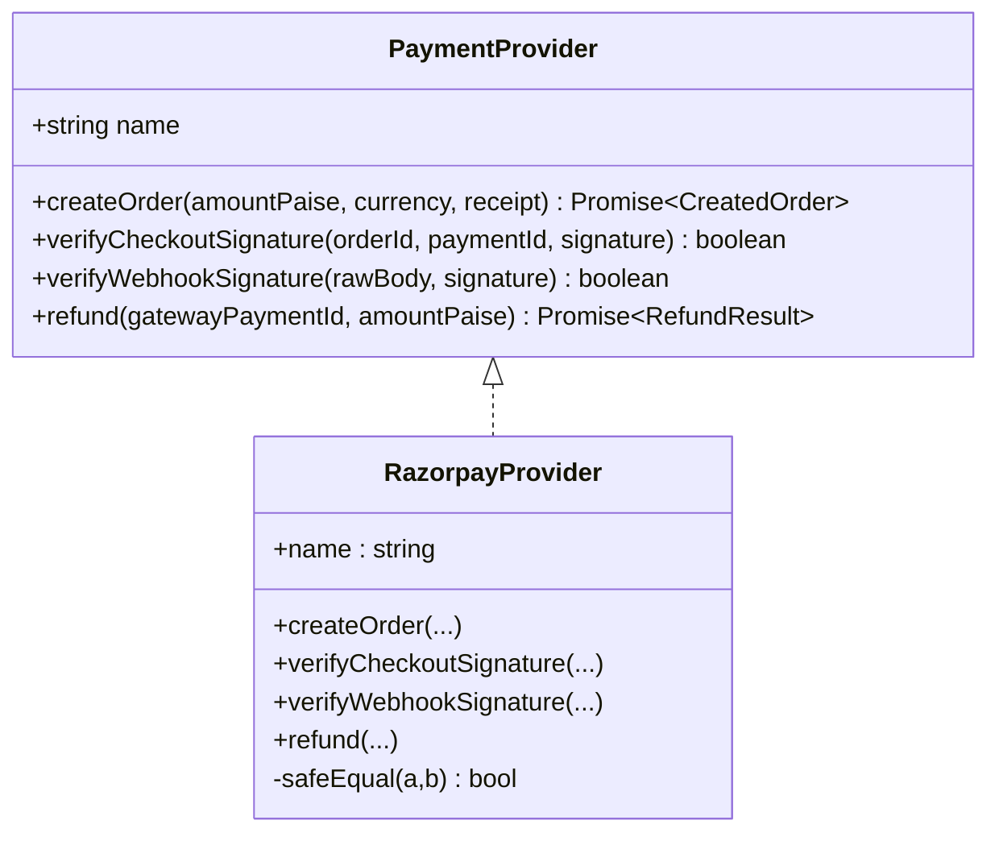
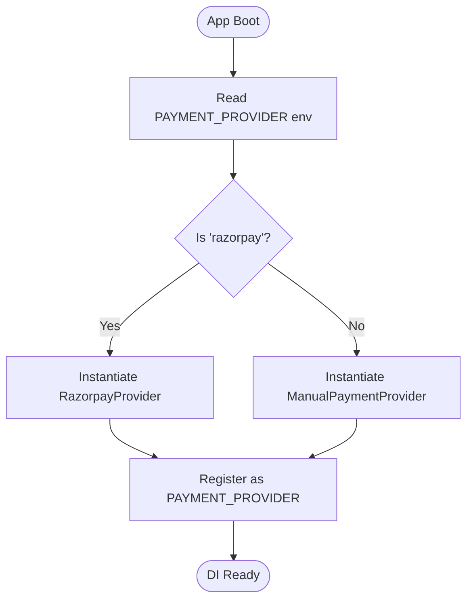
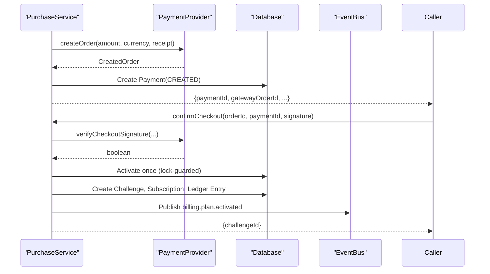
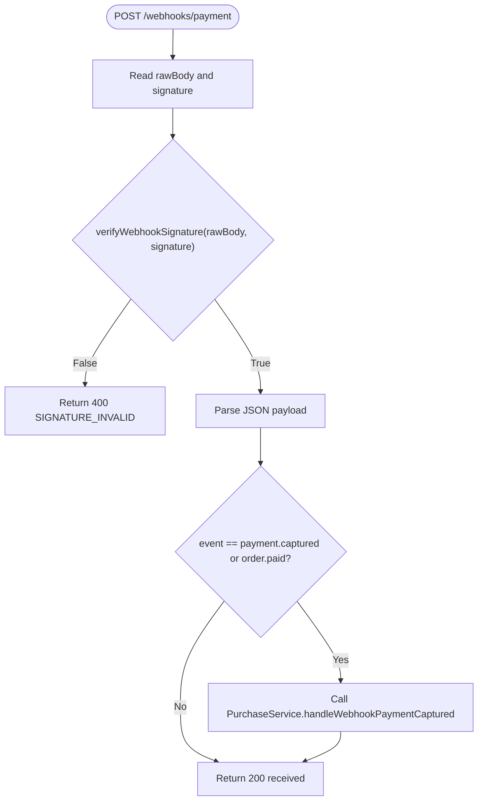
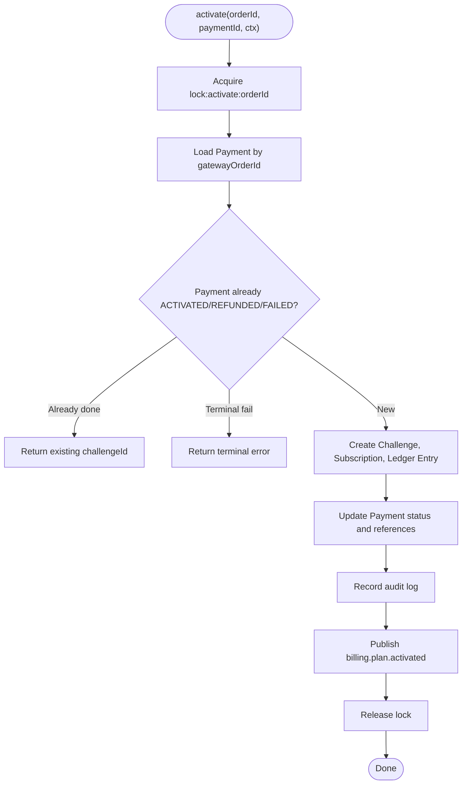
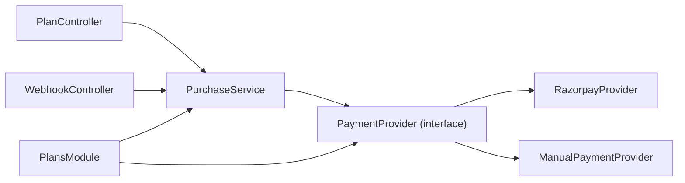

# Payment Abstraction Layer

<cite>
**Referenced Files in This Document**
- [payment.port.ts](file://backend/apps/api/src/modules/plans/infrastructure/payment/payment.port.ts)
- [razorpay.provider.ts](file://backend/apps/api/src/modules/plans/infrastructure/payment/razorpay.provider.ts)
- [manual.provider.ts](file://backend/apps/api/src/modules/plans/infrastructure/payment/manual.provider.ts)
- [plans.module.ts](file://backend/apps/api/src/modules/plans/plans.module.ts)
- [purchase.service.ts](file://backend/apps/api/src/modules/plans/application/purchase.service.ts)
- [webhook.controller.ts](file://backend/apps/api/src/modules/plans/presentation/webhook.controller.ts)
- [plan.controller.ts](file://backend/apps/api/src/modules/plans/presentation/plan.controller.ts)
- [razorpay-signature.spec.ts](file://backend/apps/api/src/modules/plans/__tests__/razorpay-signature.spec.ts)
</cite>

## Table of Contents
1. [Introduction](#introduction)
2. [Project Structure](#project-structure)
3. [Core Components](#core-components)
4. [Architecture Overview](#architecture-overview)
5. [Detailed Component Analysis](#detailed-component-analysis)
6. [Dependency Analysis](#dependency-analysis)
7. [Performance Considerations](#performance-considerations)
8. [Troubleshooting Guide](#troubleshooting-guide)
9. [Conclusion](#conclusion)

## Introduction
This document explains the payment provider abstraction layer that enables multiple payment gateway support through a unified interface. It covers the PaymentProvider interface design, how providers are registered and injected, how to implement custom providers, error handling patterns, transaction management, and consistency guarantees across different payment providers.

## Project Structure
The payment abstraction lives under the Plans module:
- Interface and types define the contract for all payment providers.
- Concrete providers implement the contract (Razorpay and a manual/dev provider).
- The module wires dependency injection to select the active provider at runtime.
- Application services orchestrate purchase flows using the abstracted provider.
- Controllers handle HTTP endpoints and webhooks, delegating to services.

**Diagram sources**
- [payment.port.ts:20-32](file://backend/apps/api/src/modules/plans/infrastructure/payment/payment.port.ts#L20-L32)
- [razorpay.provider.ts:11-52](file://backend/apps/api/src/modules/plans/infrastructure/payment/razorpay.provider.ts#L11-L52)
- [manual.provider.ts:10-31](file://backend/apps/api/src/modules/plans/infrastructure/payment/manual.provider.ts#L10-L31)
- [plans.module.ts:21-47](file://backend/apps/api/src/modules/plans/plans.module.ts#L21-L47)
- [purchase.service.ts:18-34](file://backend/apps/api/src/modules/plans/application/purchase.service.ts#L18-L34)
- [plan.controller.ts:25-63](file://backend/apps/api/src/modules/plans/presentation/plan.controller.ts#L25-L63)
- [webhook.controller.ts:13-47](file://backend/apps/api/src/modules/plans/presentation/webhook.controller.ts#L13-L47)

**Section sources**
- [payment.port.ts:1-33](file://backend/apps/api/src/modules/plans/infrastructure/payment/payment.port.ts#L1-L33)
- [plans.module.ts:21-47](file://backend/apps/api/src/modules/plans/plans.module.ts#L21-L47)

## Core Components
- PaymentProvider interface defines the unified contract for all gateways:
  - createOrder(amountPaise, currency, receipt)
  - verifyCheckoutSignature(orderId, paymentId, signature)
  - verifyWebhookSignature(rawBody, signature)
  - refund(gatewayPaymentId, amountPaise)
- RazorpayProvider implements the interface with real gateway calls and HMAC verification.
- ManualPaymentProvider provides a no-op implementation for development/testing.
- PlansModule configures which provider is used via environment-driven factory.
- PurchaseService orchestrates order creation, checkout confirmation, webhook handling, activation, and refunds using the injected provider.
- WebhookController validates webhook signatures and delegates to PurchaseService.
- PlanController exposes endpoints to create orders and confirm checkout.

Key data models exposed by the interface:
- CreatedOrder: gatewayOrderId, amountPaise, currency, publicKey
- VerifiedPayment: gatewayOrderId, gatewayPaymentId
- RefundResult: gatewayRefundId

**Section sources**
- [payment.port.ts:3-32](file://backend/apps/api/src/modules/plans/infrastructure/payment/payment.port.ts#L3-L32)
- [razorpay.provider.ts:11-52](file://backend/apps/api/src/modules/plans/infrastructure/payment/razorpay.provider.ts#L11-L52)
- [manual.provider.ts:10-31](file://backend/apps/api/src/modules/plans/infrastructure/payment/manual.provider.ts#L10-L31)
- [plans.module.ts:35-43](file://backend/apps/api/src/modules/plans/plans.module.ts#L35-L43)
- [purchase.service.ts:36-98](file://backend/apps/api/src/modules/plans/application/purchase.service.ts#L36-L98)
- [webhook.controller.ts:22-45](file://backend/apps/api/src/modules/plans/presentation/webhook.controller.ts#L22-L45)
- [plan.controller.ts:39-50](file://backend/apps/api/src/modules/plans/presentation/plan.controller.ts#L39-L50)

## Architecture Overview
The system uses a port-and-adapter pattern:
- The port (PaymentProvider) isolates business logic from gateway specifics.
- Providers encapsulate gateway SDK usage and signature verification.
- Dependency injection selects the provider based on configuration.
- Services depend only on the interface, enabling seamless switching between providers without code changes.

**Diagram sources**
- [plan.controller.ts:39-50](file://backend/apps/api/src/modules/plans/presentation/plan.controller.ts#L39-L50)
- [purchase.service.ts:36-98](file://backend/apps/api/src/modules/plans/application/purchase.service.ts#L36-L98)
- [webhook.controller.ts:22-45](file://backend/apps/api/src/modules/plans/presentation/webhook.controller.ts#L22-L45)
- [razorpay.provider.ts:27-44](file://backend/apps/api/src/modules/plans/infrastructure/payment/razorpay.provider.ts#L27-L44)

## Detailed Component Analysis

### PaymentProvider Interface Design
- Purpose: Provide a stable contract for creating orders, verifying signatures, and issuing refunds regardless of the underlying gateway.
- Methods:
  - createOrder: returns gateway-specific identifiers and public key needed by frontend SDKs.
  - verifyCheckoutSignature: verifies client-side callback signatures securely.
  - verifyWebhookSignature: verifies server-to-server webhook payloads against secrets.
  - refund: issues refunds and returns gateway refund identifiers.
- Extensibility: New providers implement this interface; no changes to services or controllers are required.

**Section sources**
- [payment.port.ts:20-32](file://backend/apps/api/src/modules/plans/infrastructure/payment/payment.port.ts#L20-L32)

### RazorpayProvider Implementation
- Integrates with Razorpay SDK to create orders and issue refunds.
- Implements secure HMAC-SHA256 signature verification for both checkout callbacks and webhooks using timing-safe comparisons.
- Exposes a name for auditability and provider selection.

**Diagram sources**
- [payment.port.ts:20-32](file://backend/apps/api/src/modules/plans/infrastructure/payment/payment.port.ts#L20-L32)
- [razorpay.provider.ts:11-52](file://backend/apps/api/src/modules/plans/infrastructure/payment/razorpay.provider.ts#L11-L52)

**Section sources**
- [razorpay.provider.ts:11-52](file://backend/apps/api/src/modules/plans/infrastructure/payment/razorpay.provider.ts#L11-L52)
- [razorpay-signature.spec.ts:13-34](file://backend/apps/api/src/modules/plans/__tests__/razorpay-signature.spec.ts#L13-L34)

### ManualPaymentProvider (Dev/Test)
- Provides a no-op implementation for local development and testing.
- Always passes signature checks and returns synthetic IDs.
- Intended to be excluded from production configurations.

**Section sources**
- [manual.provider.ts:10-31](file://backend/apps/api/src/modules/plans/infrastructure/payment/manual.provider.ts#L10-L31)

### Provider Registration and Dependency Injection
- The PlansModule registers a factory that selects the provider based on an environment variable.
- When PAYMENT_PROVIDER equals 'razorpay', RazorpayProvider is instantiated; otherwise, ManualPaymentProvider is used.
- Consumers inject the provider via the symbol token, decoupling them from concrete implementations.

**Diagram sources**
- [plans.module.ts:35-43](file://backend/apps/api/src/modules/plans/plans.module.ts#L35-L43)

**Section sources**
- [plans.module.ts:35-43](file://backend/apps/api/src/modules/plans/plans.module.ts#L35-L43)

### Purchase Flow Orchestration
- Order Creation: Validates user KYC and plan availability, creates a gateway order via the provider, persists a Payment record, and returns details to the client.
- Checkout Confirmation: Verifies the client-provided signature using the provider, then activates the plan idempotently.
- Webhook Handling: Controller verifies webhook signatures before invoking activation.
- Activation: Creates challenge and subscription records, credits virtual capital via ledger entry, updates payment status, emits events, and audits actions.
- Refunds: Validates state, calls provider refund, updates payment, cancels subscription, and marks challenge expired.

**Diagram sources**
- [purchase.service.ts:36-98](file://backend/apps/api/src/modules/plans/application/purchase.service.ts#L36-L98)
- [purchase.service.ts:105-182](file://backend/apps/api/src/modules/plans/application/purchase.service.ts#L105-L182)

**Section sources**
- [purchase.service.ts:36-98](file://backend/apps/api/src/modules/plans/application/purchase.service.ts#L36-L98)
- [purchase.service.ts:105-182](file://backend/apps/api/src/modules/plans/application/purchase.service.ts#L105-L182)

### Webhook Signature Verification
- The controller reads the raw request body and the signature header.
- It delegates signature verification to the provider.
- On invalid signature, it rejects the request; otherwise, it parses the payload and triggers activation.

**Diagram sources**
- [webhook.controller.ts:22-45](file://backend/apps/api/src/modules/plans/presentation/webhook.controller.ts#L22-L45)

**Section sources**
- [webhook.controller.ts:22-45](file://backend/apps/api/src/modules/plans/presentation/webhook.controller.ts#L22-L45)

### Error Handling Patterns
- Domain errors are wrapped in a Result type and mapped to appropriate HTTP statuses in controllers.
- Signature failures return explicit error codes (e.g., SIGNATURE_INVALID).
- Idempotency ensures repeated activations do not duplicate side effects.
- Refund flow enforces preconditions (status, presence of gateway payment ID) before calling the provider.

Examples of error mapping and handling:
- Mapping domain errors to HTTP status codes in the plan controller.
- Returning structured results from service methods and unwrapping in controllers.

**Section sources**
- [plan.controller.ts:12-23](file://backend/apps/api/src/modules/plans/presentation/plan.controller.ts#L12-L23)
- [purchase.service.ts:84-98](file://backend/apps/api/src/modules/plans/application/purchase.service.ts#L84-L98)
- [purchase.service.ts:212-245](file://backend/apps/api/src/modules/plans/application/purchase.service.ts#L212-L245)

### Transaction Management and Consistency Guarantees
- Idempotent activation is protected by a per-order Redis lock to ensure exactly-once crediting even when both checkout and webhook paths trigger concurrently.
- The activation path performs multiple writes (challenge, subscription, ledger entry, payment update) within a single critical section guarded by the lock.
- Audit logging and event publishing occur after successful persistence to maintain consistent state transitions.
- Refund flow is similarly lock-guarded to prevent race conditions.

**Diagram sources**
- [purchase.service.ts:105-182](file://backend/apps/api/src/modules/plans/application/purchase.service.ts#L105-L182)

**Section sources**
- [purchase.service.ts:105-182](file://backend/apps/api/src/modules/plans/application/purchase.service.ts#L105-L182)

### Implementing a Custom Payment Provider
To add a new provider:
1. Implement the PaymentProvider interface with createOrder, verifyCheckoutSignature, verifyWebhookSignature, and refund.
2. Ensure amounts are handled consistently (the interface uses paise).
3. Implement secure signature verification using your gateway’s algorithm and secrets.
4. Register the provider in PlansModule via the same token, updating the factory to select your provider based on configuration.
5. Add tests to validate signature verification and edge cases similar to existing tests.

Guidance:
- Keep provider-specific concerns isolated (SDK calls, secrets, signature algorithms).
- Return stable identifiers (gatewayOrderId, gatewayPaymentId, gatewayRefundId) to correlate external events with internal records.
- Log appropriately for observability without exposing secrets.

**Section sources**
- [payment.port.ts:20-32](file://backend/apps/api/src/modules/plans/infrastructure/payment/payment.port.ts#L20-L32)
- [plans.module.ts:35-43](file://backend/apps/api/src/modules/plans/plans.module.ts#L35-L43)
- [razorpay-signature.spec.ts:13-34](file://backend/apps/api/src/modules/plans/__tests__/razorpay-signature.spec.ts#L13-L34)

## Dependency Analysis
The following diagram shows how components depend on each other and where the abstraction decouples them.

**Diagram sources**
- [plan.controller.ts:25-63](file://backend/apps/api/src/modules/plans/presentation/plan.controller.ts#L25-L63)
- [webhook.controller.ts:13-47](file://backend/apps/api/src/modules/plans/presentation/webhook.controller.ts#L13-L47)
- [purchase.service.ts:18-34](file://backend/apps/api/src/modules/plans/application/purchase.service.ts#L18-L34)
- [payment.port.ts:20-32](file://backend/apps/api/src/modules/plans/infrastructure/payment/payment.port.ts#L20-L32)
- [razorpay.provider.ts:11-52](file://backend/apps/api/src/modules/plans/infrastructure/payment/razorpay.provider.ts#L11-L52)
- [manual.provider.ts:10-31](file://backend/apps/api/src/modules/plans/infrastructure/payment/manual.provider.ts#L10-L31)
- [plans.module.ts:21-47](file://backend/apps/api/src/modules/plans/plans.module.ts#L21-L47)

**Section sources**
- [plans.module.ts:21-47](file://backend/apps/api/src/modules/plans/plans.module.ts#L21-L47)
- [purchase.service.ts:18-34](file://backend/apps/api/src/modules/plans/application/purchase.service.ts#L18-L34)

## Performance Considerations
- Signature verification is performed locally using HMAC and constant-time comparison to avoid timing attacks and reduce latency.
- Webhook processing avoids unnecessary work by rejecting invalid signatures early.
- Idempotent activation prevents duplicate work under concurrent loads.
- Using a Redis-based lock minimizes contention while ensuring correctness during peak webhook bursts.

[No sources needed since this section provides general guidance]

## Troubleshooting Guide
Common issues and resolutions:
- Invalid webhook signature: Ensure the correct webhook secret is configured and that the raw body is preserved for verification.
- Duplicate activations: Rely on the idempotent activation path; check logs for concurrent requests and verify locks are functioning.
- Failed refunds: Confirm the payment is in a refundable state and has a captured gateway payment ID before attempting refunds.
- Environment misconfiguration: Verify the PAYMENT_PROVIDER setting matches the intended provider; ensure provider-specific secrets are set.

Validation aids:
- Unit tests demonstrate correct signature verification behavior for both valid and tampered inputs.

**Section sources**
- [webhook.controller.ts:22-45](file://backend/apps/api/src/modules/plans/presentation/webhook.controller.ts#L22-L45)
- [purchase.service.ts:212-245](file://backend/apps/api/src/modules/plans/application/purchase.service.ts#L212-L245)
- [razorpay-signature.spec.ts:13-34](file://backend/apps/api/src/modules/plans/__tests__/razorpay-signature.spec.ts#L13-L34)

## Conclusion
The payment abstraction layer cleanly separates business logic from gateway-specific details through a well-defined interface. Providers can be swapped at runtime via configuration without modifying application code. Robust signature verification, idempotent activation, and lock-guarded transactions ensure consistency and reliability across different payment providers. Adding new providers is straightforward and testable, supporting future extensibility and operational flexibility.