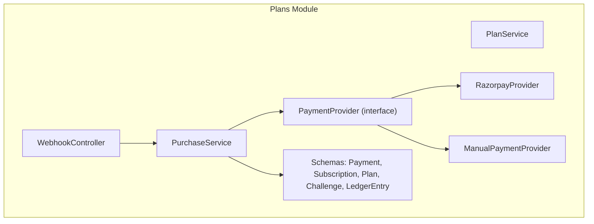
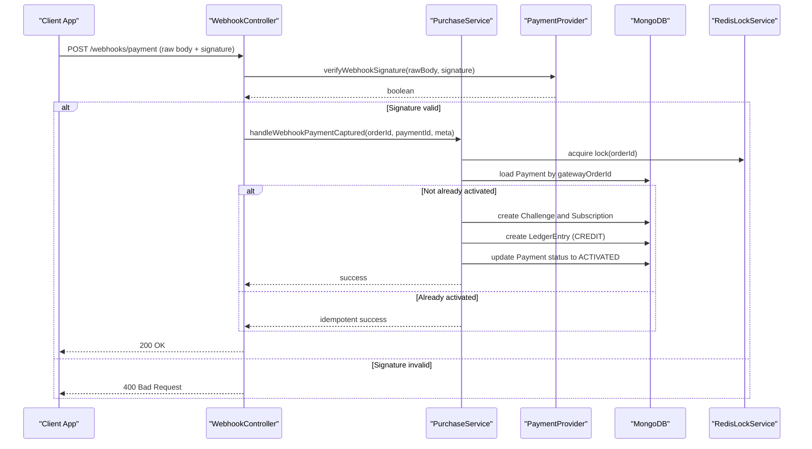
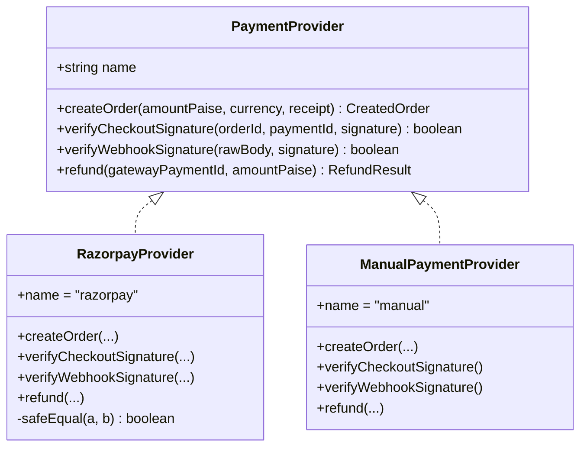
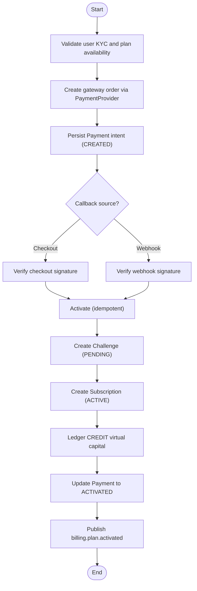
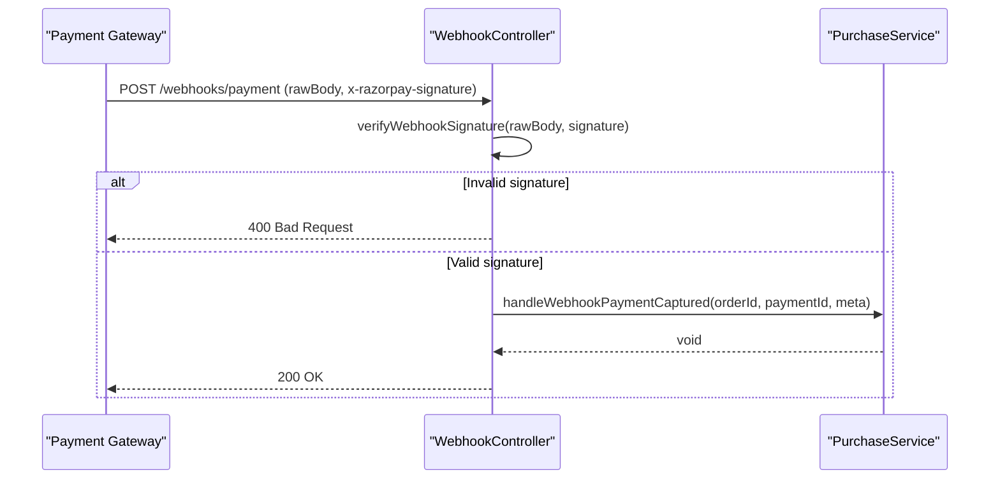
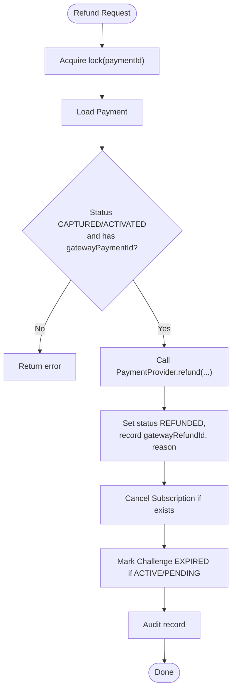
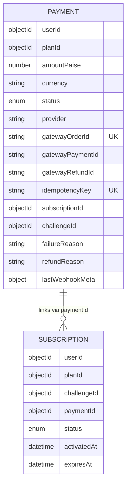
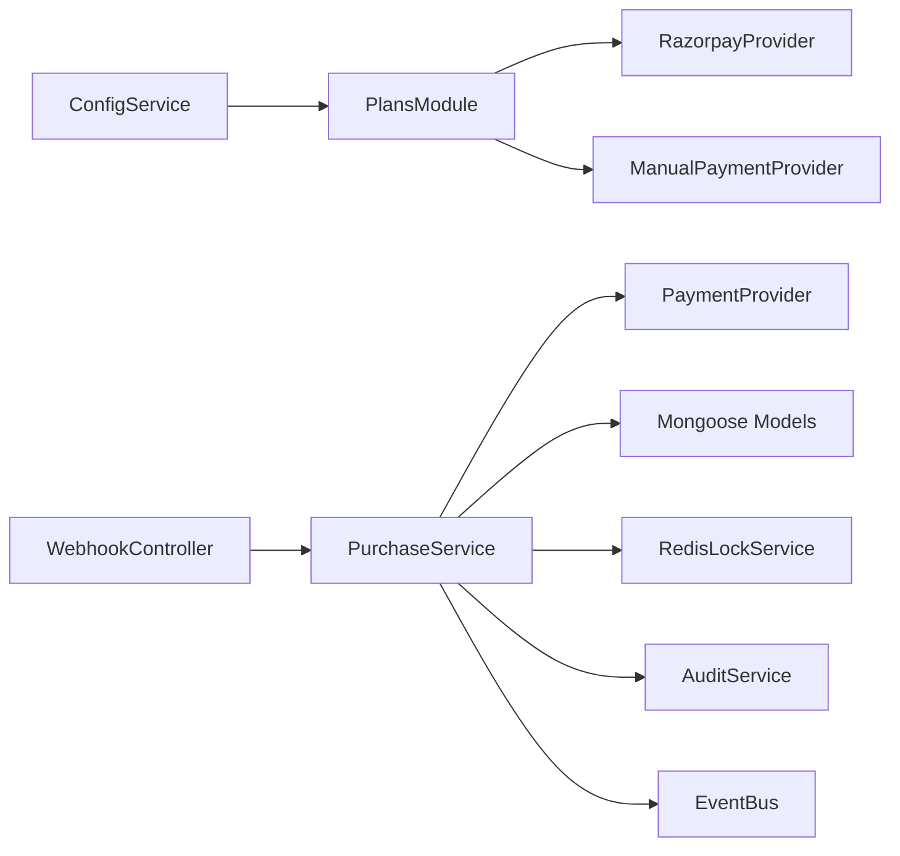

# Payment Processing

<cite>
**Referenced Files in This Document**
- [payment.port.ts](file://backend/apps/api/src/modules/plans/infrastructure/payment/payment.port.ts)
- [razorpay.provider.ts](file://backend/apps/api/src/modules/plans/infrastructure/payment/razorpay.provider.ts)
- [manual.provider.ts](file://backend/apps/api/src/modules/plans/infrastructure/payment/manual.provider.ts)
- [webhook.controller.ts](file://backend/apps/api/src/modules/plans/presentation/webhook.controller.ts)
- [purchase.service.ts](file://backend/apps/api/src/modules/plans/application/purchase.service.ts)
- [plan.service.ts](file://backend/apps/api/src/modules/plans/application/plan.service.ts)
- [plans.module.ts](file://backend/apps/api/src/modules/plans/plans.module.ts)
- [payment.schema.ts](file://backend/apps/api/src/modules/plans/infrastructure/schemas/payment.schema.ts)
- [subscription.schema.ts](file://backend/apps/api/src/modules/plans/infrastructure/schemas/subscription.schema.ts)
- [plan.types.ts](file://backend/apps/api/src/modules/plans/domain/plan.types.ts)
- [env.schema.ts](file://backend/libs/shared/src/config/env.schema.ts)
</cite>

## Table of Contents
1. Introduction
2. Project Structure
3. Core Components
4. Architecture Overview
5. Detailed Component Analysis
6. Dependency Analysis
7. Performance Considerations
8. Troubleshooting Guide
9. Conclusion
10. Appendices

## Introduction
This document explains the payment processing system for plan purchases and subscription activation. It covers:
- A provider abstraction that supports multiple payment gateways (Razorpay and a manual/dev provider).
- End-to-end workflow from order creation to subscription activation, including signature verification and idempotent crediting.
- Webhook handling for payment confirmations and lifecycle events.
- Configuration, environment-specific settings, security considerations, and testing strategies with sandboxes.
- Manual approval workflows and administrative controls for refunds and reconciliation.

## Project Structure
The payment subsystem is implemented under the Plans module with clear separation between domain, application, infrastructure, and presentation layers:
- Domain types define statuses and rules for plans, payments, subscriptions, and challenges.
- Application services orchestrate purchase flows, activation, refunds, and queries.
- Infrastructure provides the payment provider implementations (Razorpay and manual) and Mongoose schemas for persistence.
- Presentation exposes controllers for user/admin endpoints and webhooks.

**Diagram sources**
- [plans.module.ts:21-44](file://backend/apps/api/src/modules/plans/plans.module.ts#L21-L44)
- [purchase.service.ts:18-34](file://backend/apps/api/src/modules/plans/application/purchase.service.ts#L18-L34)
- [webhook.controller.ts:13-20](file://backend/apps/api/src/modules/plans/presentation/webhook.controller.ts#L13-L20)
- [payment.port.ts:20-32](file://backend/apps/api/src/modules/plans/infrastructure/payment/payment.port.ts#L20-L32)
- [razorpay.provider.ts:11-25](file://backend/apps/api/src/modules/plans/infrastructure/payment/razorpay.provider.ts#L11-L25)
- [manual.provider.ts:10-18](file://backend/apps/api/src/modules/plans/infrastructure/payment/manual.provider.ts#L10-L18)

**Section sources**
- [plans.module.ts:21-44](file://backend/apps/api/src/modules/plans/plans.module.ts#L21-L44)
- [env.schema.ts:56-71](file://backend/libs/shared/src/config/env.schema.ts#L56-L71)

## Core Components
- Payment Provider Abstraction: Defines createOrder, verifyCheckoutSignature, verifyWebhookSignature, and refund operations.
- Razorpay Provider: Implements gateway integration using SDK and local HMAC-SHA256 signature checks.
- Manual Provider: Dev/test implementation that bypasses external calls and always verifies signatures.
- Purchase Service: Orchestrates order creation, checkout confirmation, webhook handling, idempotent activation, refunds, and queries.
- Webhook Controller: Validates webhook signatures and delegates to PurchaseService for event processing.
- Schemas and Types: Persist payments, subscriptions, and define state machines for statuses.

Key responsibilities:
- Create gateway orders and persist payment intents.
- Verify signatures for both client-side checkout callbacks and server-side webhooks.
- Idempotently activate subscriptions and credit virtual capital exactly once per order.
- Support refunds and cancel related subscriptions/challenges.

**Section sources**
- [payment.port.ts:20-32](file://backend/apps/api/src/modules/plans/infrastructure/payment/payment.port.ts#L20-L32)
- [razorpay.provider.ts:27-45](file://backend/apps/api/src/modules/plans/infrastructure/payment/razorpay.provider.ts#L27-L45)
- [manual.provider.ts:15-30](file://backend/apps/api/src/modules/plans/infrastructure/payment/manual.provider.ts#L15-L30)
- [purchase.service.ts:36-98](file://backend/apps/api/src/modules/plans/application/purchase.service.ts#L36-L98)
- [webhook.controller.ts:22-46](file://backend/apps/api/src/modules/plans/presentation/webhook.controller.ts#L22-L46)
- [payment.schema.ts:5-62](file://backend/apps/api/src/modules/plans/infrastructure/schemas/payment.schema.ts#L5-L62)
- [subscription.schema.ts:5-33](file://backend/apps/api/src/modules/plans/infrastructure/schemas/subscription.schema.ts#L5-L33)
- [plan.types.ts:22-49](file://backend/apps/api/src/modules/plans/domain/plan.types.ts#L22-L49)

## Architecture Overview
The system uses dependency injection to select the active payment provider at runtime based on configuration. The controller validates incoming webhooks and delegates to the service layer, which performs idempotent activation using Redis locks and unique idempotency keys.

**Diagram sources**
- [webhook.controller.ts:22-46](file://backend/apps/api/src/modules/plans/presentation/webhook.controller.ts#L22-L46)
- [purchase.service.ts:92-183](file://backend/apps/api/src/modules/plans/application/purchase.service.ts#L92-L183)
- [razorpay.provider.ts:37-40](file://backend/apps/api/src/modules/plans/infrastructure/payment/razorpay.provider.ts#L37-L40)

## Detailed Component Analysis

### Payment Provider Abstraction and Implementations
- Interface defines contract for creating orders, verifying signatures, and issuing refunds.
- RazorpayProvider implements gateway calls and secure signature comparisons using timing-safe equality.
- ManualPaymentProvider provides a no-op implementation for development/testing with synthetic IDs and always-valid signatures.

**Diagram sources**
- [payment.port.ts:20-32](file://backend/apps/api/src/modules/plans/infrastructure/payment/payment.port.ts#L20-L32)
- [razorpay.provider.ts:11-51](file://backend/apps/api/src/modules/plans/infrastructure/payment/razorpay.provider.ts#L11-L51)
- [manual.provider.ts:10-31](file://backend/apps/api/src/modules/plans/infrastructure/payment/manual.provider.ts#L10-L31)

**Section sources**
- [payment.port.ts:20-32](file://backend/apps/api/src/modules/plans/infrastructure/payment/payment.port.ts#L20-L32)
- [razorpay.provider.ts:27-51](file://backend/apps/api/src/modules/plans/infrastructure/payment/razorpay.provider.ts#L27-L51)
- [manual.provider.ts:15-31](file://backend/apps/api/src/modules/plans/infrastructure/payment/manual.provider.ts#L15-L31)

### Purchase Flow: Order Creation to Activation
- Order creation validates KYC, plan availability, and optional policy constraints before creating a gateway order and persisting a payment intent.
- Checkout callback verification ensures signature integrity before activation.
- Activation is idempotent via Redis locks and unique idempotency keys; it creates challenge and subscription records, credits virtual capital, and emits domain events.

**Diagram sources**
- [purchase.service.ts:36-98](file://backend/apps/api/src/modules/plans/application/purchase.service.ts#L36-L98)
- [purchase.service.ts:105-183](file://backend/apps/api/src/modules/plans/application/purchase.service.ts#L105-L183)

**Section sources**
- [purchase.service.ts:36-98](file://backend/apps/api/src/modules/plans/application/purchase.service.ts#L36-L98)
- [purchase.service.ts:105-183](file://backend/apps/api/src/modules/plans/application/purchase.service.ts#L105-L183)

### Webhook Processing
- The webhook endpoint requires raw body and signature header for HMAC verification.
- On signature failure, returns 400 to prevent retries.
- For verified payment captured events, delegates to PurchaseService to ensure idempotent activation.

**Diagram sources**
- [webhook.controller.ts:22-46](file://backend/apps/api/src/modules/plans/presentation/webhook.controller.ts#L22-L46)
- [purchase.service.ts:92-98](file://backend/apps/api/src/modules/plans/application/purchase.service.ts#L92-L98)

**Section sources**
- [webhook.controller.ts:22-46](file://backend/apps/api/src/modules/plans/presentation/webhook.controller.ts#L22-L46)

### Refunds and Administrative Controls
- Admin-triggered refunds are guarded by locks and validate payment eligibility.
- Refund updates payment status, records gateway refund ID, cancels subscription, and marks challenge expired if applicable.
- Audit logs capture actor details and IP for compliance.

**Diagram sources**
- [purchase.service.ts:212-246](file://backend/apps/api/src/modules/plans/application/purchase.service.ts#L212-L246)

**Section sources**
- [purchase.service.ts:212-246](file://backend/apps/api/src/modules/plans/application/purchase.service.ts#L212-L246)

### Data Models and State Machines
- Payment tracks intent, provider, gateway identifiers, idempotency key, and lifecycle status transitions.
- Subscription links user, plan, challenge, and payment with activation/expiry dates.
- Status enums enforce allowed states for payments, subscriptions, and challenges.

**Diagram sources**
- [payment.schema.ts:5-62](file://backend/apps/api/src/modules/plans/infrastructure/schemas/payment.schema.ts#L5-L62)
- [subscription.schema.ts:5-33](file://backend/apps/api/src/modules/plans/infrastructure/schemas/subscription.schema.ts#L5-L33)

**Section sources**
- [payment.schema.ts:5-62](file://backend/apps/api/src/modules/plans/infrastructure/schemas/payment.schema.ts#L5-L62)
- [subscription.schema.ts:5-33](file://backend/apps/api/src/modules/plans/infrastructure/schemas/subscription.schema.ts#L5-L33)
- [plan.types.ts:22-49](file://backend/apps/api/src/modules/plans/domain/plan.types.ts#L22-L49)

## Dependency Analysis
- PlansModule wires providers via ConfigService to select Razorpay or Manual provider at runtime.
- PurchaseService depends on Mongoose models, Redis locks, AppConfigService, AuditService, EventBus, and the injected PaymentProvider.
- WebhookController depends on PurchaseService and PaymentProvider for signature validation.

**Diagram sources**
- [plans.module.ts:21-44](file://backend/apps/api/src/modules/plans/plans.module.ts#L21-L44)
- [purchase.service.ts:18-34](file://backend/apps/api/src/modules/plans/application/purchase.service.ts#L18-L34)
- [webhook.controller.ts:13-20](file://backend/apps/api/src/modules/plans/presentation/webhook.controller.ts#L13-L20)

**Section sources**
- [plans.module.ts:21-44](file://backend/apps/api/src/modules/plans/plans.module.ts#L21-L44)
- [purchase.service.ts:18-34](file://backend/apps/api/src/modules/plans/application/purchase.service.ts#L18-L34)

## Performance Considerations
- Idempotency: Redis locks and unique idempotency keys prevent duplicate capital crediting under concurrent webhook/callback/poller scenarios.
- Minimal network calls: Signature verification is local HMAC computation; only order creation and refunds call the gateway.
- Database indexing: Payment and Subscription schemas include indexes for common queries (userId, status, createdAt, expiresAt).
- Event-driven side effects: Publishing domain events decouples downstream processes from the critical path.

[No sources needed since this section provides general guidance]

## Troubleshooting Guide
Common issues and resolutions:
- Invalid webhook signature: Ensure raw body is preserved and signature header matches provider’s expected format. The controller rejects invalid signatures with 400.
- Duplicate activations: Check idempotencyKey uniqueness and Redis lock usage; activation is designed to be safe under concurrency.
- Missing gateway identifiers: Refunds require a captured gatewayPaymentId; ensure activation recorded it before attempting refunds.
- Environment misconfiguration: When PAYMENT_PROVIDER=razorpay, required keys must be set; otherwise startup fails fast.

Operational tips:
- Use ManualPaymentProvider in development to exercise full flows without real payments.
- Log webhook payloads and metadata for debugging; they are stored in lastWebhookMeta for traceability.
- Monitor audit logs for plan activation and refund actions.

**Section sources**
- [webhook.controller.ts:22-46](file://backend/apps/api/src/modules/plans/presentation/webhook.controller.ts#L22-L46)
- [purchase.service.ts:105-183](file://backend/apps/api/src/modules/plans/application/purchase.service.ts#L105-L183)
- [purchase.service.ts:212-246](file://backend/apps/api/src/modules/plans/application/purchase.service.ts#L212-L246)
- [env.schema.ts:56-71](file://backend/libs/shared/src/config/env.schema.ts#L56-L71)

## Conclusion
The payment system provides a robust, extensible foundation for plan purchases and subscription activation:
- A clean provider abstraction enables swapping gateways with minimal changes.
- Secure signature verification protects against tampering.
- Idempotent activation guarantees exactly-once crediting of virtual capital.
- Comprehensive admin controls support refunds and reconciliation with audit trails.
- Environment-aware configuration and dev-friendly manual mode streamline testing and deployment.

[No sources needed since this section summarizes without analyzing specific files]

## Appendices

### Configuration and Environment Settings
- PAYMENT_PROVIDER selects the active provider (manual or razorpay).
- Razorpay credentials: RAZORPAY_KEY_ID, RAZORPAY_KEY_SECRET, RAZORPAY_WEBHOOK_SECRET.
- Validation enforces required keys when Razorpay is selected; process refuses to start on invalid config.

**Section sources**
- [env.schema.ts:56-71](file://backend/libs/shared/src/config/env.schema.ts#L56-L71)

### Testing Strategies with Sandboxes
- Use ManualPaymentProvider locally to simulate end-to-end flows without real transactions.
- For Razorpay sandbox, configure PAYMENT_PROVIDER=razorpay with sandbox credentials and test webhook delivery to /webhooks/payment.
- Exercise both checkout callback and webhook paths to validate idempotency and signature verification.

[No sources needed since this section provides general guidance]

### Manual Approval Workflows and Reconciliation
- While automatic activation occurs on verified payments, administrators can review payments via listPayments and perform refunds where eligible.
- Refund flow includes locking, validation, gateway interaction, state updates, and audit logging for reconciliation.

**Section sources**
- [purchase.service.ts:203-246](file://backend/apps/api/src/modules/plans/application/purchase.service.ts#L203-L246)