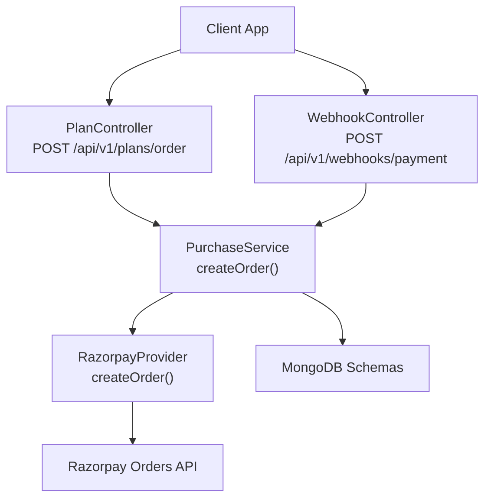
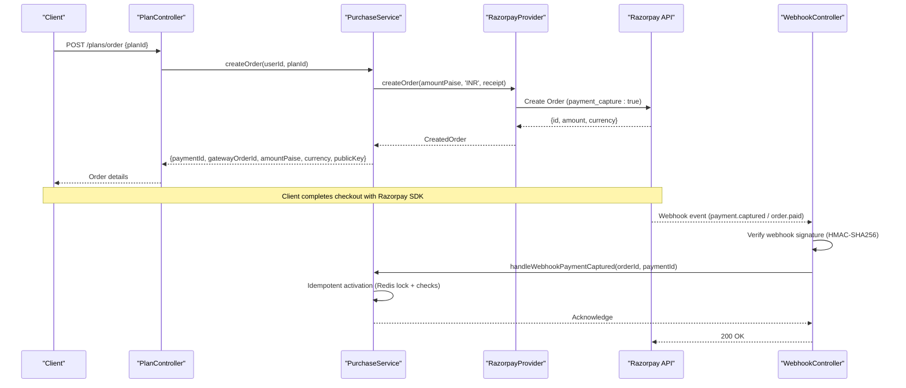
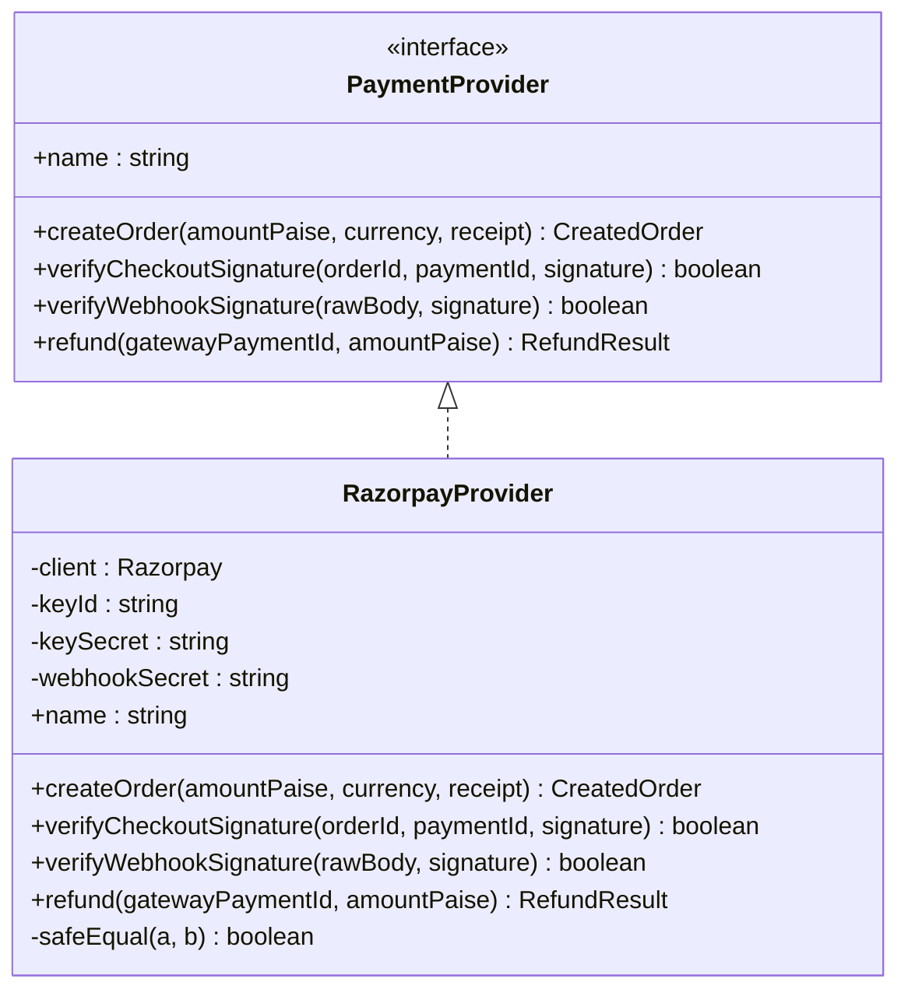
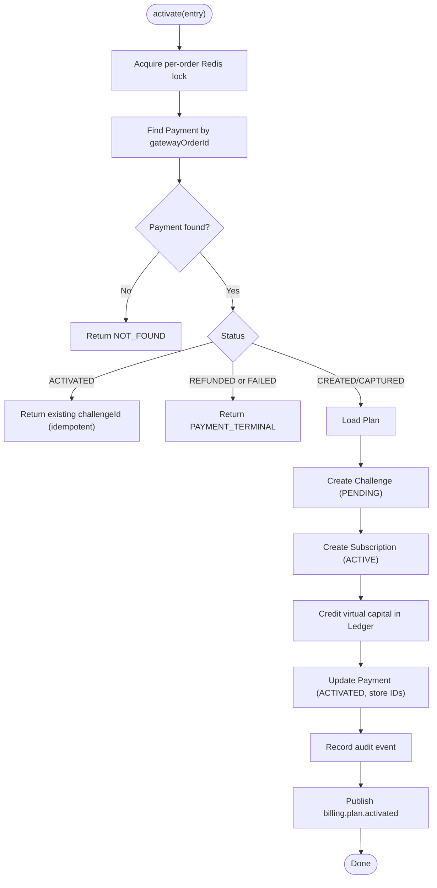
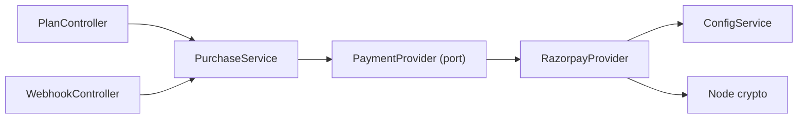

# Razorpay Integration

<cite>
**Referenced Files in This Document**
- [razorpay.provider.ts](file://backend/apps/api/src/modules/plans/infrastructure/payment/razorpay.provider.ts)
- [payment.port.ts](file://backend/apps/api/src/modules/plans/infrastructure/payment/payment.port.ts)
- [webhook.controller.ts](file://backend/apps/api/src/modules/plans/presentation/webhook.controller.ts)
- [purchase.service.ts](file://backend/apps/api/src/modules/plans/application/purchase.service.ts)
- [plan.controller.ts](file://backend/apps/api/src/modules/plans/presentation/plan.controller.ts)
- [env.schema.ts](file://backend/libs/shared/src/config/env.schema.ts)
- [main.ts](file://backend/apps/api/src/main.ts)
- [razorpay-signature.spec.ts](file://backend/apps/api/src/modules/plans/__tests__/razorpay-signature.spec.ts)
</cite>

## Table of Contents
1. Introduction
2. Project Structure
3. Core Components
4. Architecture Overview
5. Detailed Component Analysis
6. Dependency Analysis
7. Performance Considerations
8. Troubleshooting Guide
9. Conclusion
10. Appendices

## Introduction
This document explains the Razorpay payment gateway integration used to sell plans and activate challenges. It covers order creation, signature verification (checkout and webhook), refund processing, amount handling in paise, security measures using HMAC-SHA256 with constant-time comparison, environment configuration, error handling, and logging patterns.

## Project Structure
The integration is implemented as a provider adapter behind a stable port, enabling swapping gateways without changing business logic. The flow spans controllers, services, and the provider:

**Diagram sources**
- [plan.controller.ts:39-50](file://backend/apps/api/src/modules/plans/presentation/plan.controller.ts#L39-L50)
- [purchase.service.ts:36-82](file://backend/apps/api/src/modules/plans/application/purchase.service.ts#L36-L82)
- [razorpay.provider.ts:27-30](file://backend/apps/api/src/modules/plans/infrastructure/payment/razorpay.provider.ts#L27-L30)
- [webhook.controller.ts:22-46](file://backend/apps/api/src/modules/plans/presentation/webhook.controller.ts#L22-L46)

**Section sources**
- [plan.controller.ts:39-50](file://backend/apps/api/src/modules/plans/presentation/plan.controller.ts#L39-L50)
- [purchase.service.ts:36-82](file://backend/apps/api/src/modules/plans/application/purchase.service.ts#L36-L82)
- [razorpay.provider.ts:27-30](file://backend/apps/api/src/modules/plans/infrastructure/payment/razorpay.provider.ts#L27-L30)
- [webhook.controller.ts:22-46](file://backend/apps/api/src/modules/plans/presentation/webhook.controller.ts#L22-L46)

## Core Components
- PaymentProvider interface defines the contract for creating orders, verifying signatures, and issuing refunds.
- RazorpayProvider implements the contract using the official SDK and Node crypto utilities.
- PurchaseService orchestrates plan purchase flows, idempotent activation, and refunds.
- WebhookController validates webhook payloads and triggers activation.
- PlanController exposes endpoints to create orders and confirm checkout.

Key responsibilities:
- Amounts are always in paise (smallest currency unit).
- Checkout signature uses HMAC-SHA256 over "orderId|paymentId".
- Webhook signature uses HMAC-SHA256 over raw request body.
- Constant-time comparison via timingSafeEqual prevents timing attacks.
- Idempotent activation protected by Redis locks and unique keys.

**Section sources**
- [payment.port.ts:1-33](file://backend/apps/api/src/modules/plans/infrastructure/payment/payment.port.ts#L1-L33)
- [razorpay.provider.ts:12-51](file://backend/apps/api/src/modules/plans/infrastructure/payment/razorpay.provider.ts#L12-L51)
- [purchase.service.ts:84-183](file://backend/apps/api/src/modules/plans/application/purchase.service.ts#L84-L183)
- [webhook.controller.ts:22-46](file://backend/apps/api/src/modules/plans/presentation/webhook.controller.ts#L22-L46)
- [plan.controller.ts:39-50](file://backend/apps/api/src/modules/plans/presentation/plan.controller.ts#L39-L50)

## Architecture Overview
End-to-end payment flow from order creation to capture and activation:

**Diagram sources**
- [plan.controller.ts:39-50](file://backend/apps/api/src/modules/plans/presentation/plan.controller.ts#L39-L50)
- [purchase.service.ts:36-82](file://backend/apps/api/src/modules/plans/application/purchase.service.ts#L36-L82)
- [razorpay.provider.ts:27-30](file://backend/apps/api/src/modules/plans/infrastructure/payment/razorpay.provider.ts#L27-L30)
- [webhook.controller.ts:22-46](file://backend/apps/api/src/modules/plans/presentation/webhook.controller.ts#L22-L46)

## Detailed Component Analysis

### RazorpayProvider
Implements the PaymentProvider interface:
- Order creation: calls Razorpay orders.create with payment_capture enabled; returns gatewayOrderId, amountPaise, currency, and publicKey.
- Checkout signature verification: computes HMAC-SHA256 over "orderId|paymentId" using key secret; compares with timingSafeEqual.
- Webhook signature verification: computes HMAC-SHA256 over raw request body using webhook secret; compares with timingSafeEqual.
- Refund: issues a refund against the captured payment ID for the specified amount in paise.

Security notes:
- Uses Node’s crypto.createHmac('sha256', ...) for both checkout and webhook signatures.
- Constant-time comparison via safeEqual wrapper around timingSafeEqual to prevent timing side-channels.

Amount handling:
- All monetary amounts are passed in paise (e.g., INR ₹100 = 10000 paise).

**Section sources**
- [razorpay.provider.ts:12-51](file://backend/apps/api/src/modules/plans/infrastructure/payment/razorpay.provider.ts#L12-L51)
- [payment.port.ts:20-33](file://backend/apps/api/src/modules/plans/infrastructure/payment/payment.port.ts#L20-L33)

#### Class Diagram

**Diagram sources**
- [payment.port.ts:20-33](file://backend/apps/api/src/modules/plans/infrastructure/payment/payment.port.ts#L20-L33)
- [razorpay.provider.ts:12-51](file://backend/apps/api/src/modules/plans/infrastructure/payment/razorpay.provider.ts#L12-L51)

### PurchaseService
Orchestrates purchasing and activation:
- createOrder: Validates user KYC and plan availability, creates a gateway order, persists a Payment record with status CREATED, and returns order details to the client.
- confirmCheckout: Verifies the checkout signature before activating.
- handleWebhookPaymentCaptured: Delegates to activate after controller verifies webhook signature.
- activate: Idempotent activation guarded by a per-order Redis lock; creates Challenge and Subscription, credits virtual capital via ledger, updates Payment status, records audit events, and publishes domain events.
- refund: Issues a refund through the provider, marks payment REFUNDED, cancels subscription, and expires challenge if applicable.

Idempotency and concurrency:
- Uses RedisLockService to ensure activation and refund paths execute exactly once even under concurrent webhook/checkout/poller scenarios.

**Section sources**
- [purchase.service.ts:36-82](file://backend/apps/api/src/modules/plans/application/purchase.service.ts#L36-L82)
- [purchase.service.ts:84-183](file://backend/apps/api/src/modules/plans/application/purchase.service.ts#L84-L183)
- [purchase.service.ts:212-246](file://backend/apps/api/src/modules/plans/application/purchase.service.ts#L212-L246)

#### Activation Flowchart

**Diagram sources**
- [purchase.service.ts:105-183](file://backend/apps/api/src/modules/plans/application/purchase.service.ts#L105-L183)

### WebhookController
Handles Razorpay webhooks:
- Requires raw body and x-razorpay-signature header.
- Verifies signature using provider.verifyWebhookSignature; on failure, throws an application exception with BAD_REQUEST.
- On success, parses event and forwards payment.captured or order.paid to PurchaseService.handleWebhookPaymentCaptured.
- Always returns 200 OK for verified but unprocessable events to stop gateway retries.

**Section sources**
- [webhook.controller.ts:22-46](file://backend/apps/api/src/modules/plans/presentation/webhook.controller.ts#L22-L46)

### PlanController
Exposes REST endpoints:
- POST /plans/order: Creates a purchase intent and gateway order (rate-limited, authenticated).
- POST /plans/confirm: Confirms checkout with signature verification.
- GET /plans/me/subscription and /plans/me/payments: User queries.

Error mapping:
- Maps domain errors to HTTP status codes (e.g., SIGNATURE_INVALID -> 400).

**Section sources**
- [plan.controller.ts:39-50](file://backend/apps/api/src/modules/plans/presentation/plan.controller.ts#L39-L50)

## Dependency Analysis
- Controllers depend on services; services depend on the PaymentProvider abstraction.
- RazorpayProvider depends on ConfigService for credentials and Node crypto for signatures.
- WebhookController requires raw body parsing enabled at app bootstrap.

**Diagram sources**
- [plan.controller.ts:39-50](file://backend/apps/api/src/modules/plans/presentation/plan.controller.ts#L39-L50)
- [webhook.controller.ts:22-46](file://backend/apps/api/src/modules/plans/presentation/webhook.controller.ts#L22-L46)
- [purchase.service.ts:18-34](file://backend/apps/api/src/modules/plans/application/purchase.service.ts#L18-L34)
- [razorpay.provider.ts:20-25](file://backend/apps/api/src/modules/plans/infrastructure/payment/razorpay.provider.ts#L20-L25)

**Section sources**
- [main.ts:7-18](file://backend/apps/api/src/main.ts#L7-L18)
- [env.schema.ts:56-71](file://backend/libs/shared/src/config/env.schema.ts#L56-L71)

## Performance Considerations
- Signature verification is local and constant-time, avoiding network overhead and minimizing timing side-channels.
- Idempotent activation with Redis locks prevents duplicate crediting under concurrency.
- Rate limiting on order creation endpoint reduces abuse risk.
- Using paise avoids floating-point precision issues across the stack.

[No sources needed since this section provides general guidance]

## Troubleshooting Guide
Common issues and resolutions:
- Invalid webhook signature: Ensure raw body is preserved and x-razorpay-signature matches HMAC-SHA256 over the exact bytes received. Check RAZORPAY_WEBHOOK_SECRET.
- Signature mismatch on checkout: Verify that orderId and paymentId match the original order and that the same key secret is used.
- Duplicate activations: Confirm Redis locks are functioning; check logs for ALREADY_ACTIVATED responses indicating idempotent handling.
- Missing environment variables: Boot fails if PAYMENT_PROVIDER=razorpay and required secrets are absent.

Logging and errors:
- Provider and service classes use NestJS Logger for operational insights.
- WebhookController throws a structured AppException on signature failure; controllers map domain errors to appropriate HTTP statuses.

**Section sources**
- [webhook.controller.ts:22-46](file://backend/apps/api/src/modules/plans/presentation/webhook.controller.ts#L22-L46)
- [plan.controller.ts:12-23](file://backend/apps/api/src/modules/plans/presentation/plan.controller.ts#L12-L23)
- [purchase.service.ts:92-98](file://backend/apps/api/src/modules/plans/application/purchase.service.ts#L92-L98)
- [env.schema.ts:69-71](file://backend/libs/shared/src/config/env.schema.ts#L69-L71)

## Conclusion
The integration cleanly separates gateway-specific logic behind a stable port, enforces strong security with HMAC-SHA256 and constant-time comparisons, handles amounts in paise to avoid precision issues, and ensures idempotent activation and refunds. Configuration is validated at boot, and the webhook pipeline guarantees reliable payment capture handling.

[No sources needed since this section summarizes without analyzing specific files]

## Appendices

### Environment Configuration
Required when PAYMENT_PROVIDER=razorpay:
- RAZORPAY_KEY_ID
- RAZORPAY_KEY_SECRET
- RAZORPAY_WEBHOOK_SECRET

Validation enforces presence at startup; missing values cause boot failure.

**Section sources**
- [env.schema.ts:56-71](file://backend/libs/shared/src/config/env.schema.ts#L56-L71)

### API Endpoints Summary
- POST /api/v1/plans/order: Create order (authenticated, rate-limited).
- POST /api/v1/plans/confirm: Confirm checkout with signature.
- POST /api/v1/webhooks/payment: Receive and verify Razorpay webhooks.

**Section sources**
- [plan.controller.ts:39-50](file://backend/apps/api/src/modules/plans/presentation/plan.controller.ts#L39-L50)
- [webhook.controller.ts:22-46](file://backend/apps/api/src/modules/plans/presentation/webhook.controller.ts#L22-L46)
- [main.ts:11-18](file://backend/apps/api/src/main.ts#L11-L18)

### Security Notes
- Checkout signature: HMAC-SHA256("orderId|paymentId", key_secret).
- Webhook signature: HMAC-SHA256(raw_body, webhook_secret).
- Comparison: timingSafeEqual-based safeEqual to prevent timing attacks.

**Section sources**
- [razorpay.provider.ts:32-51](file://backend/apps/api/src/modules/plans/infrastructure/payment/razorpay.provider.ts#L32-L51)
- [razorpay-signature.spec.ts:16-33](file://backend/apps/api/src/modules/plans/__tests__/razorpay-signature.spec.ts#L16-L33)

### Examples Reference
- Creating orders: See controller/service/provider chain for order creation and response shape.
- Verifying checkout signatures: Use provider.verifyCheckoutSignature with orderId, paymentId, and signature.
- Handling refunds: Call provider.refund with gatewayPaymentId and amountPaise; service updates state and cancels related entities.

**Section sources**
- [plan.controller.ts:39-50](file://backend/apps/api/src/modules/plans/presentation/plan.controller.ts#L39-L50)
- [purchase.service.ts:212-246](file://backend/apps/api/src/modules/plans/application/purchase.service.ts#L212-L246)
- [razorpay.provider.ts:27-45](file://backend/apps/api/src/modules/plans/infrastructure/payment/razorpay.provider.ts#L27-L45)