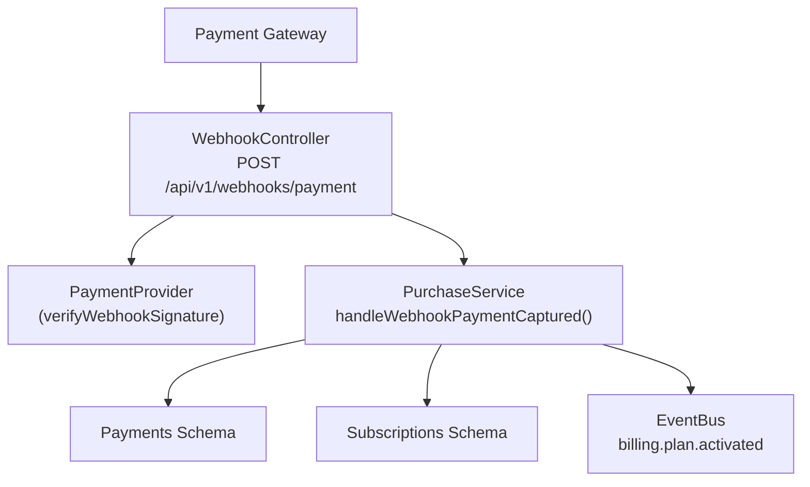
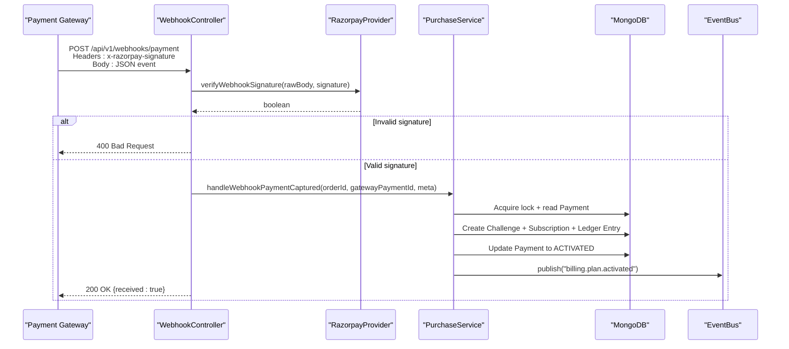
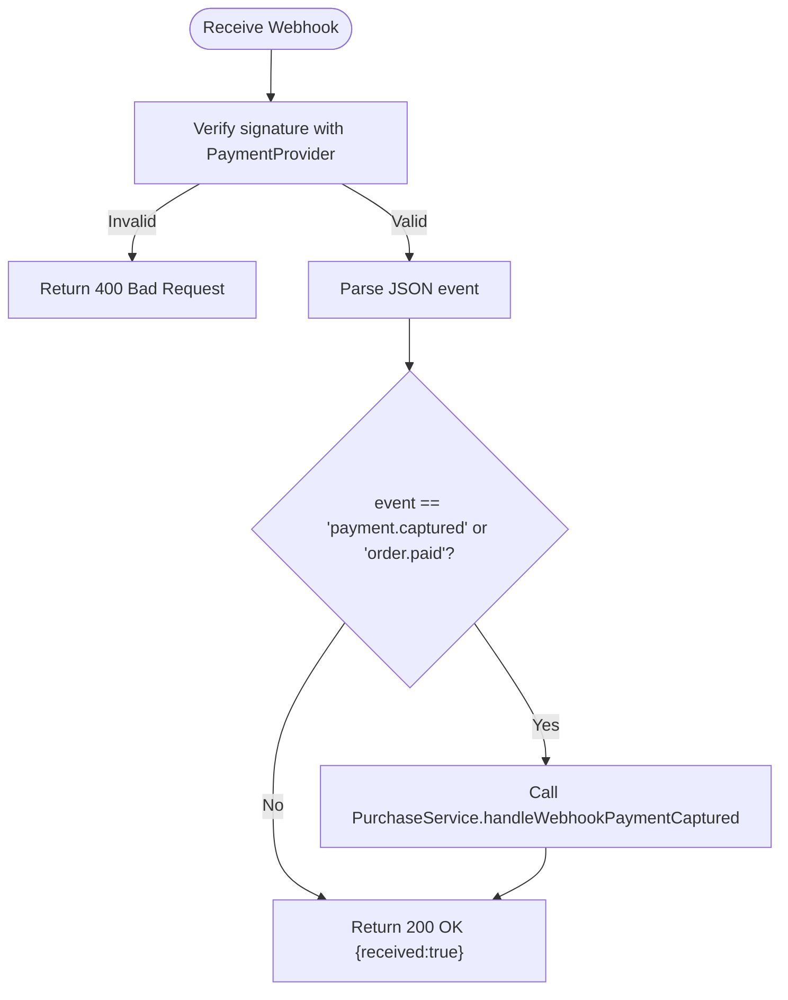
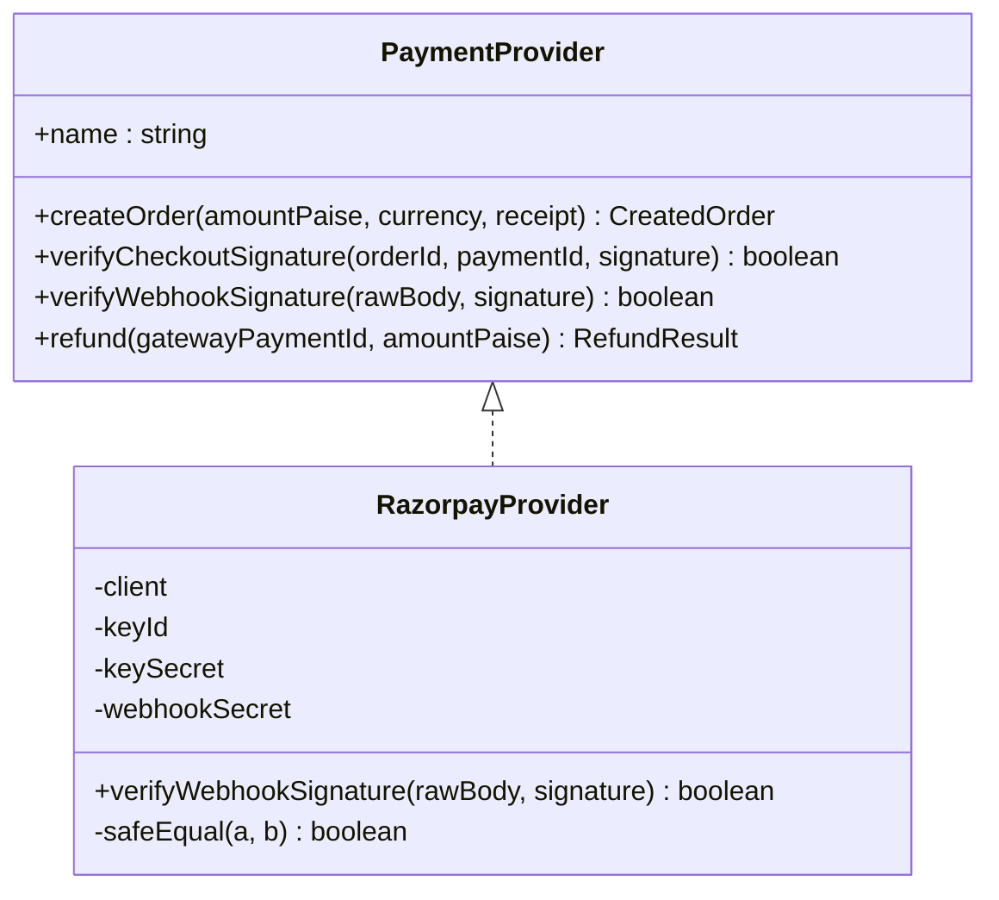
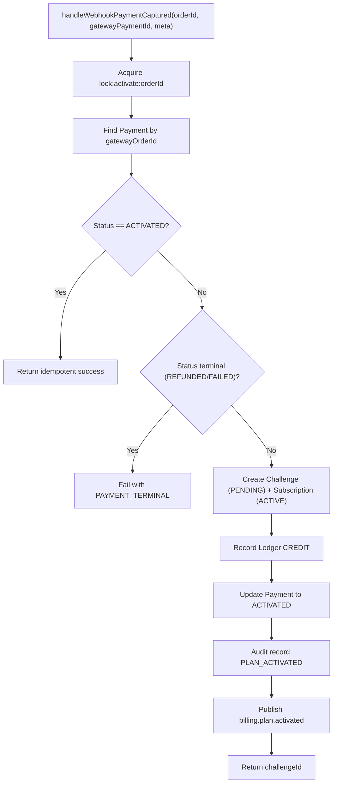
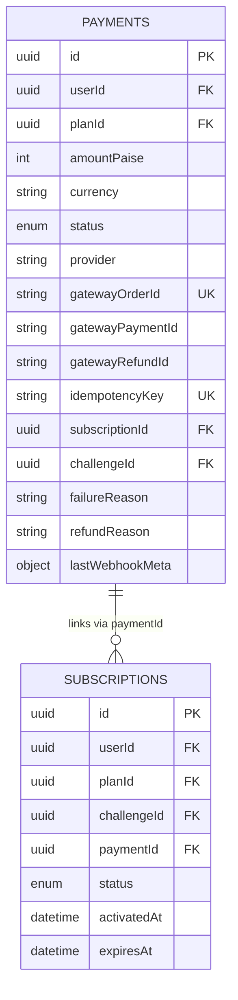
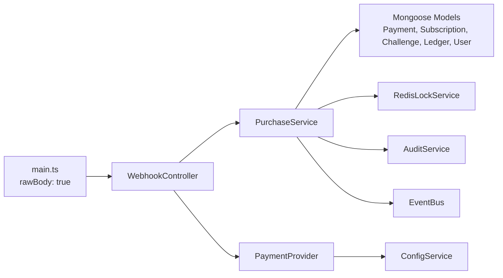

# Webhook Handling

<cite>
**Referenced Files in This Document**
- [webhook.controller.ts](file://backend/apps/api/src/modules/plans/presentation/webhook.controller.ts)
- [razorpay.provider.ts](file://backend/apps/api/src/modules/plans/infrastructure/payment/razorpay.provider.ts)
- [payment.port.ts](file://backend/apps/api/src/modules/plans/infrastructure/payment/payment.port.ts)
- [purchase.service.ts](file://backend/apps/api/src/modules/plans/application/purchase.service.ts)
- [plan.types.ts](file://backend/apps/api/src/modules/plans/domain/plan.types.ts)
- [payment.schema.ts](file://backend/apps/api/src/modules/plans/infrastructure/schemas/payment.schema.ts)
- [subscription.schema.ts](file://backend/apps/api/src/modules/plans/infrastructure/schemas/subscription.schema.ts)
- [main.ts](file://backend/apps/api/src/main.ts)
- [app-exception.ts](file://backend/libs/shared/src/http/app-exception.ts)
- [razorpay-signature.spec.ts](file://backend/apps/api/src/modules/plans/__tests__/razorpay-signature.spec.ts)
</cite>

## Table of Contents
1. Introduction
2. Project Structure
3. Core Components
4. Architecture Overview
5. Detailed Component Analysis
6. Dependency Analysis
7. Performance Considerations
8. Troubleshooting Guide
9. Conclusion

## Introduction
This document explains the webhook processing system that handles payment events from an external payment gateway (Razorpay). It covers the webhook controller endpoints, request validation, signature verification, and how payment confirmations are processed to activate plans and subscriptions. It also documents security considerations, payload structures, error handling, retry behavior, logging, and testing strategies using unit tests and sandboxed flows.

## Project Structure
The webhook feature is implemented under the Plans module with a clear separation between presentation (controller), application (business logic), infrastructure (gateway adapter), domain types, and persistence schemas:
- Presentation: HTTP endpoint for receiving webhooks
- Application: Idempotent activation flow and side effects
- Infrastructure: Payment provider abstraction and Razorpay implementation
- Domain: Status enums and business rules
- Persistence: Mongoose schemas for payments and subscriptions
- Bootstrapping: Raw body parsing enabled for HMAC verification

**Diagram sources**
- [webhook.controller.ts:13-46](file://backend/apps/api/src/modules/plans/presentation/webhook.controller.ts#L13-L46)
- [razorpay.provider.ts:37-40](file://backend/apps/api/src/modules/plans/infrastructure/payment/razorpay.provider.ts#L37-L40)
- [purchase.service.ts:92-182](file://backend/apps/api/src/modules/plans/application/purchase.service.ts#L92-L182)
- [payment.schema.ts:5-56](file://backend/apps/api/src/modules/plans/infrastructure/schemas/payment.schema.ts#L5-L56)
- [subscription.schema.ts:5-27](file://backend/apps/api/src/modules/plans/infrastructure/schemas/subscription.schema.ts#L5-L27)

**Section sources**
- [main.ts:7-22](file://backend/apps/api/src/main.ts#L7-L22)
- [webhook.controller.ts:13-46](file://backend/apps/api/src/modules/plans/presentation/webhook.controller.ts#L13-L46)

## Core Components
- WebhookController: Receives raw webhook payloads, validates signatures, parses event type, and delegates to PurchaseService for activation.
- PaymentProvider (interface): Defines createOrder, verifyCheckoutSignature, verifyWebhookSignature, refund.
- RazorpayProvider: Implements HMAC-SHA256 signature verification against configured webhook secret; uses timing-safe comparison.
- PurchaseService: Orchestrates idempotent plan activation on successful payment events, creates challenge and subscription, records ledger entries, emits domain events, and logs audit trails.
- Schemas and Types: Payments and Subscriptions store lifecycle state; Plan types define status enums used across flows.

Key behaviors:
- Signature verification must pass before any processing occurs.
- Activation is idempotent per order via Redis lock and unique idempotency key.
- Successful activation transitions payment to ACTIVATED, creates a PENDING challenge, and an ACTIVE subscription.
- Events are published for downstream consumers.

**Section sources**
- [webhook.controller.ts:13-46](file://backend/apps/api/src/modules/plans/presentation/webhook.controller.ts#L13-L46)
- [payment.port.ts:20-32](file://backend/apps/api/src/modules/plans/infrastructure/payment/payment.port.ts#L20-L32)
- [razorpay.provider.ts:11-51](file://backend/apps/api/src/modules/plans/infrastructure/payment/razorpay.provider.ts#L11-L51)
- [purchase.service.ts:92-182](file://backend/apps/api/src/modules/plans/application/purchase.service.ts#L92-L182)
- [plan.types.ts:22-48](file://backend/apps/api/src/modules/plans/domain/plan.types.ts#L22-L48)

## Architecture Overview
End-to-end webhook flow:
1. Gateway sends POST to /api/v1/webhooks/payment with raw body and signature header.
2. Controller verifies signature using PaymentProvider.verifyWebhookSignature.
3. On success, controller parses event and dispatches to PurchaseService.handleWebhookPaymentCaptured.
4. PurchaseService acquires a per-order lock, checks idempotency, activates plan, creates subscription, records ledger, updates payment, audits, and publishes event.

**Diagram sources**
- [webhook.controller.ts:22-46](file://backend/apps/api/src/modules/plans/presentation/webhook.controller.ts#L22-L46)
- [razorpay.provider.ts:37-40](file://backend/apps/api/src/modules/plans/infrastructure/payment/razorpay.provider.ts#L37-L40)
- [purchase.service.ts:92-182](file://backend/apps/api/src/modules/plans/application/purchase.service.ts#L92-L182)

## Detailed Component Analysis

### Webhook Controller
- Endpoint: POST /api/v1/webhooks/payment
- Security: Requires x-razorpay-signature header; rejects invalid signatures with 400.
- Processing: Parses event.event to detect payment.captured or order.paid; extracts entity identifiers and calls PurchaseService.
- Response: Always returns 200 for verified but unprocessable events to stop retries; only 400 on signature failure.

**Diagram sources**
- [webhook.controller.ts:22-46](file://backend/apps/api/src/modules/plans/presentation/webhook.controller.ts#L22-L46)

**Section sources**
- [webhook.controller.ts:7-46](file://backend/apps/api/src/modules/plans/presentation/webhook.controller.ts#L7-L46)

### Payment Provider Abstraction and Razorpay Implementation
- Interface defines methods for order creation, checkout signature verification, webhook signature verification, and refunds.
- RazorpayProvider implements HMAC-SHA256 verification using configured webhook secret and safe string comparison to prevent timing attacks.

**Diagram sources**
- [payment.port.ts:20-32](file://backend/apps/api/src/modules/plans/infrastructure/payment/payment.port.ts#L20-L32)
- [razorpay.provider.ts:11-51](file://backend/apps/api/src/modules/plans/infrastructure/payment/razorpay.provider.ts#L11-L51)

**Section sources**
- [payment.port.ts:1-33](file://backend/apps/api/src/modules/plans/infrastructure/payment/payment.port.ts#L1-L33)
- [razorpay.provider.ts:1-53](file://backend/apps/api/src/modules/plans/infrastructure/payment/razorpay.provider.ts#L1-L53)

### Purchase Service: Idempotent Activation Flow
- Accepts webhook events and ensures exactly-once activation per order using Redis locks and unique idempotency keys.
- Creates a Challenge (PENDING) and Subscription (ACTIVE), records virtual capital credit in ledger, updates Payment to ACTIVATED, audits the action, and publishes billing.plan.activated event.
- Logs warnings for non-terminal failures other than ALREADY_ACTIVATED.

**Diagram sources**
- [purchase.service.ts:92-182](file://backend/apps/api/src/modules/plans/application/purchase.service.ts#L92-L182)

**Section sources**
- [purchase.service.ts:92-182](file://backend/apps/api/src/modules/plans/application/purchase.service.ts#L92-L182)
- [plan.types.ts:22-48](file://backend/apps/api/src/modules/plans/domain/plan.types.ts#L22-L48)

### Data Models and State Transitions
- Payment stores intent, gateway references, idempotency key, and lifecycle status.
- Subscription tracks active period and links to payment and challenge.
- Status enums enforce valid transitions during activation and refunds.

**Diagram sources**
- [payment.schema.ts:5-56](file://backend/apps/api/src/modules/plans/infrastructure/schemas/payment.schema.ts#L5-L56)
- [subscription.schema.ts:5-27](file://backend/apps/api/src/modules/plans/infrastructure/schemas/subscription.schema.ts#L5-L27)

**Section sources**
- [payment.schema.ts:1-62](file://backend/apps/api/src/modules/plans/infrastructure/schemas/payment.schema.ts#L1-L62)
- [subscription.schema.ts:1-33](file://backend/apps/api/src/modules/plans/infrastructure/schemas/subscription.schema.ts#L1-L33)
- [plan.types.ts:22-48](file://backend/apps/api/src/modules/plans/domain/plan.types.ts#L22-L48)

## Dependency Analysis
- WebhookController depends on PurchaseService and PaymentProvider.
- PurchaseService depends on multiple Mongoose models, RedisLockService, AppConfigService, AuditService, EventBus, and PaymentProvider.
- RazorpayProvider depends on ConfigService and crypto utilities.
- main.ts enables raw body parsing required for HMAC verification.

**Diagram sources**
- [webhook.controller.ts:13-46](file://backend/apps/api/src/modules/plans/presentation/webhook.controller.ts#L13-L46)
- [purchase.service.ts:18-34](file://backend/apps/api/src/modules/plans/application/purchase.service.ts#L18-L34)
- [razorpay.provider.ts:20-25](file://backend/apps/api/src/modules/plans/infrastructure/payment/razorpay.provider.ts#L20-L25)
- [main.ts:7-18](file://backend/apps/api/src/main.ts#L7-L18)

**Section sources**
- [webhook.controller.ts:13-46](file://backend/apps/api/src/modules/plans/presentation/webhook.controller.ts#L13-L46)
- [purchase.service.ts:18-34](file://backend/apps/api/src/modules/plans/application/purchase.service.ts#L18-L34)
- [razorpay.provider.ts:20-25](file://backend/apps/api/src/modules/plans/infrastructure/payment/razorpay.provider.ts#L20-L25)
- [main.ts:7-18](file://backend/apps/api/src/main.ts#L7-L18)

## Performance Considerations
- Signature verification is local HMAC-SHA256 with constant-time comparison; no network overhead.
- Idempotency enforced via Redis lock per order prevents duplicate activations under concurrency.
- Database writes are grouped within the locked scope to minimize contention.
- Returning 200 for verified-but-unprocessable events reduces gateway retry storms.

[No sources needed since this section provides general guidance]

## Troubleshooting Guide
Common issues and resolutions:
- Invalid signature: Ensure x-razorpay-signature matches HMAC computed over raw body using configured webhook secret. The controller throws AppException with code SIGNATURE_INVALID and returns 400.
- Duplicate activation: Already handled; activation is idempotent and will return success without reprocessing.
- Missing fields: If event.payload.payment.entity lacks required identifiers, activation is skipped; ensure gateway payload includes order_id and payment id.
- Logging and auditing: Activation attempts and outcomes are audited; check audit records and service logs for context.

Error response example:
- Code: SIGNATURE_INVALID
- Message: Invalid webhook signature
- Status: 400 Bad Request

Retry behavior:
- Gateways typically retry on non-2xx responses. Since verified events return 200 even if unprocessable, retries cease after signature passes. For signature failures, gateways may retry; ensure secrets are correct to avoid loops.

**Section sources**
- [webhook.controller.ts:22-46](file://backend/apps/api/src/modules/plans/presentation/webhook.controller.ts#L22-L46)
- [app-exception.ts:4-18](file://backend/libs/shared/src/http/app-exception.ts#L4-L18)
- [purchase.service.ts:92-98](file://backend/apps/api/src/modules/plans/application/purchase.service.ts#L92-L98)

## Conclusion
The webhook system securely processes payment events using HMAC signature verification and idempotent activation logic. It integrates cleanly with the broader platform through domain events and audit trails, ensuring reliable plan activation and subscription lifecycle management while minimizing risks of duplication and tampering.

[No sources needed since this section summarizes without analyzing specific files]

## Appendices

### Webhook Payload Examples and Event Types
- Supported events: payment.captured, order.paid
- Expected payload shape:
  - event: string
  - payload.payment.entity.id: string (payment id)
  - payload.payment.entity.order_id: string (order id)
- The controller extracts these fields to call activation.

**Section sources**
- [webhook.controller.ts:34-44](file://backend/apps/api/src/modules/plans/presentation/webhook.controller.ts#L34-L44)

### Testing Strategies
- Unit tests validate signature verification for both checkout and webhook flows, including rejection of tampered signatures and wrong secrets.
- Use gateway sandboxes to simulate real webhook deliveries with test keys and secrets.
- Mock PaymentProvider in integration tests to isolate business logic from external services.

**Section sources**
- [razorpay-signature.spec.ts:13-34](file://backend/apps/api/src/modules/plans/__tests__/razorpay-signature.spec.ts#L13-L34)