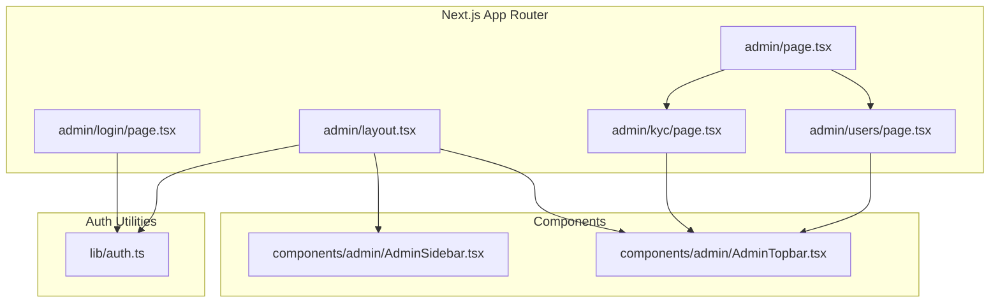
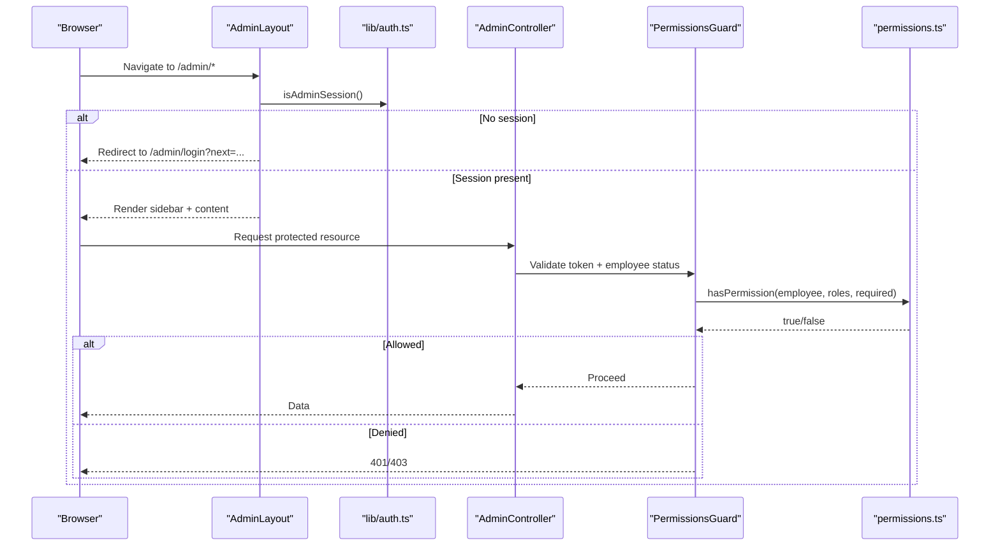
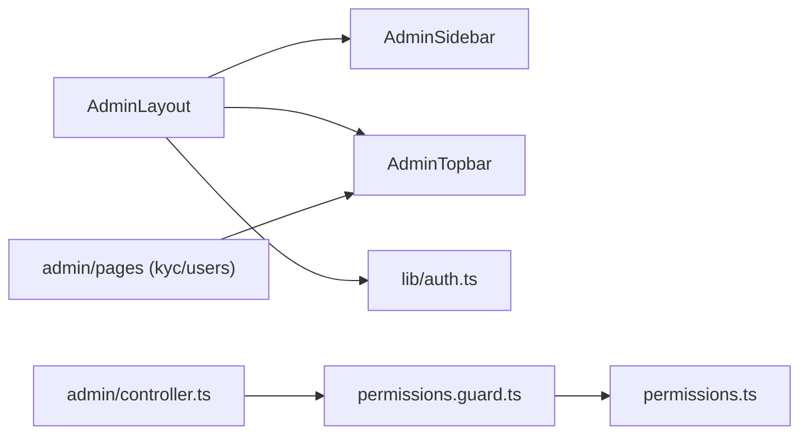

# Admin Layout & Navigation

<cite>
**Referenced Files in This Document**
- [layout.tsx](file://frontend/trader/src/app/admin/layout.tsx)
- [AdminSidebar.tsx](file://frontend/trader/src/components/admin/AdminSidebar.tsx)
- [AdminTopbar.tsx](file://frontend/trader/src/components/admin/AdminTopbar.tsx)
- [page.tsx (admin index)](file://frontend/trader/src/app/admin/page.tsx)
- [login page.tsx](file://frontend/trader/src/app/admin/login/page.tsx)
- [auth.ts](file://frontend/trader/src/lib/auth.ts)
- [kyc page.tsx](file://frontend/trader/src/app/admin/kyc/page.tsx)
- [users page.tsx](file://frontend/trader/src/app/admin/users/page.tsx)
- [permissions.guard.ts](file://backend/apps/api/src/modules/admin/presentation/permissions.guard.ts)
- [permissions.ts](file://backend/apps/api/src/modules/admin/domain/permissions.ts)
- [admin.controller.ts](file://backend/apps/api/src/modules/admin/presentation/admin.controller.ts)
</cite>

## Table of Contents
1. Introduction
2. Project Structure
3. Core Components
4. Architecture Overview
5. Detailed Component Analysis
6. Dependency Analysis
7. Performance Considerations
8. Troubleshooting Guide
9. Conclusion
10. Appendices

## Introduction
This document explains the admin dashboard layout and navigation system built with Next.js App Router. It covers:
- The responsive sidebar component with grouped menu items
- The topbar that displays user session information and actions
- The main content area layout
- Authentication guards and permission checks for accessing admin sections
- Routing structure and how to add new admin routes
- Mobile-responsive design patterns and accessibility features
- Integration points with backend authorization

## Project Structure
The admin interface is organized under the Next.js App Router directory `src/app/admin`. A shared layout wraps all admin pages, enforcing authentication and providing chrome (sidebar and main area). Each feature has its own route folder with a page component.

**Diagram sources**
- [layout.tsx:1-46](file://frontend/trader/src/app/admin/layout.tsx#L1-L46)
- [AdminSidebar.tsx:1-113](file://frontend/trader/src/components/admin/AdminSidebar.tsx#L1-L113)
- [AdminTopbar.tsx:1-47](file://frontend/trader/src/components/admin/AdminTopbar.tsx#L1-L47)
- [page.tsx (admin index):1-3](file://frontend/trader/src/app/admin/page.tsx#L1-L3)
- [login page.tsx:1-194](file://frontend/trader/src/app/admin/login/page.tsx#L1-L194)
- [auth.ts:1-266](file://frontend/trader/src/lib/auth.ts#L1-L266)

**Section sources**
- [layout.tsx:1-46](file://frontend/trader/src/app/admin/layout.tsx#L1-L46)
- [page.tsx (admin index):1-3](file://frontend/trader/src/app/admin/page.tsx#L1-L3)

## Core Components
- AdminLayout: Guards unauthenticated access by checking the employee session and redirects to login when needed. Renders the sidebar and main content area.
- AdminSidebar: Displays grouped navigation links and sign-out action. Highlights active routes and provides accessibility attributes.
- AdminTopbar: Shows page title/subtitle, optional actions, theme toggle, notifications placeholder, and current employee info from session.
- Admin Login Page: Handles email/password and optional TOTP flow, stores employee session tokens, and navigates to the intended destination.

Key behaviors:
- Session check happens client-side in the layout before rendering chrome.
- Sidebar uses Next.js Link for client-side navigation and marks active state based on pathname.
- Topbar reads session data to display initials, name, and role/email.

**Section sources**
- [layout.tsx:1-46](file://frontend/trader/src/app/admin/layout.tsx#L1-L46)
- [AdminSidebar.tsx:1-113](file://frontend/trader/src/components/admin/AdminSidebar.tsx#L1-L113)
- [AdminTopbar.tsx:1-47](file://frontend/trader/src/components/admin/AdminTopbar.tsx#L1-L47)
- [login page.tsx:1-194](file://frontend/trader/src/app/admin/login/page.tsx#L1-L194)
- [auth.ts:1-266](file://frontend/trader/src/lib/auth.ts#L1-L266)

## Architecture Overview
The admin UI integrates with backend authorization via JWT-based employee sessions. The frontend validates presence of an employee session; the backend enforces fine-grained permissions per endpoint using guards and decorators.

**Diagram sources**
- [layout.tsx:1-46](file://frontend/trader/src/app/admin/layout.tsx#L1-L46)
- [auth.ts:1-266](file://frontend/trader/src/lib/auth.ts#L1-L266)
- [admin.controller.ts:1-171](file://backend/apps/api/src/modules/admin/presentation/admin.controller.ts#L1-L171)
- [permissions.guard.ts:1-42](file://backend/apps/api/src/modules/admin/presentation/permissions.guard.ts#L1-L42)
- [permissions.ts:1-65](file://backend/apps/api/src/modules/admin/domain/permissions.ts#L1-L65)

## Detailed Component Analysis

### AdminLayout
Responsibilities:
- Detects bare login path and bypasses guard for it.
- Checks employee session; if missing, redirects to login with next parameter.
- Renders a shell with sidebar and main content area.

Behavior highlights:
- Uses Next.js navigation hooks to read current path and perform redirects.
- Provides global CSS classes for layout structure.

**Section sources**
- [layout.tsx:1-46](file://frontend/trader/src/app/admin/layout.tsx#L1-L46)

### AdminSidebar
Responsibilities:
- Renders grouped navigation sections with icons and labels.
- Marks active link based on current pathname.
- Provides sign-out and return-to-trader actions.

Accessibility:
- Uses aria-label for the nav container.
- Sets aria-current="page" on active links.
- Icons are marked aria-hidden where appropriate.

Mobile responsiveness:
- Styled with CSS variables and flex/grid; adapts to viewport via existing styles.

**Section sources**
- [AdminSidebar.tsx:1-113](file://frontend/trader/src/components/admin/AdminSidebar.tsx#L1-L113)

### AdminTopbar
Responsibilities:
- Displays page title and optional subtitle.
- Shows theme toggle, notification button, and current employee avatar/name/role.
- Accepts custom actions slot for page-specific controls.

Session integration:
- Reads employee session to compute initials and display name/role.

**Section sources**
- [AdminTopbar.tsx:1-47](file://frontend/trader/src/components/admin/AdminTopbar.tsx#L1-L47)
- [auth.ts:1-266](file://frontend/trader/src/lib/auth.ts#L1-L266)

### Admin Login Flow
Responsibilities:
- Collects email, password, and optional TOTP code.
- Calls backend admin login endpoint and stores employee session tokens.
- Redirects to intended destination or default admin page.

Error handling:
- Distinguishes TOTP-required vs invalid credentials and shows contextual messages.

**Section sources**
- [login page.tsx:1-194](file://frontend/trader/src/app/admin/login/page.tsx#L1-L194)
- [auth.ts:1-266](file://frontend/trader/src/lib/auth.ts#L1-L266)

### Example Pages Using the Layout
- KYC review page demonstrates topbar usage, tabs, list/detail split view, and actions.
- Users page demonstrates search, pagination, approve/reject flows, and error banners.

These pages illustrate consistent use of AdminTopbar and the shared layout’s content area.

**Section sources**
- [kyc page.tsx:1-161](file://frontend/trader/src/app/admin/kyc/page.tsx#L1-L161)
- [users page.tsx:1-291](file://frontend/trader/src/app/admin/users/page.tsx#L1-L291)

## Dependency Analysis
Frontend dependencies:
- AdminLayout depends on AdminSidebar and auth utilities.
- AdminSidebar depends on Next.js Link/router and icon components.
- AdminTopbar depends on theme toggle and session retrieval.

Backend dependencies:
- AdminController applies EmployeeAuthGuard and PermissionsGuard globally.
- PermissionsGuard reads metadata set by RequirePermissions decorator to enforce per-endpoint permissions.
- permissions.ts defines the permission catalog, default roles, and effective permission logic with deny-wins semantics.

**Diagram sources**
- [layout.tsx:1-46](file://frontend/trader/src/app/admin/layout.tsx#L1-L46)
- [AdminSidebar.tsx:1-113](file://frontend/trader/src/components/admin/AdminSidebar.tsx#L1-L113)
- [AdminTopbar.tsx:1-47](file://frontend/trader/src/components/admin/AdminTopbar.tsx#L1-L47)
- [auth.ts:1-266](file://frontend/trader/src/lib/auth.ts#L1-L266)
- [admin.controller.ts:1-171](file://backend/apps/api/src/modules/admin/presentation/admin.controller.ts#L1-L171)
- [permissions.guard.ts:1-42](file://backend/apps/api/src/modules/admin/presentation/permissions.guard.ts#L1-L42)
- [permissions.ts:1-65](file://backend/apps/api/src/modules/admin/domain/permissions.ts#L1-L65)

**Section sources**
- [admin.controller.ts:1-171](file://backend/apps/api/src/modules/admin/presentation/admin.controller.ts#L1-L171)
- [permissions.guard.ts:1-42](file://backend/apps/api/src/modules/admin/presentation/permissions.guard.ts#L1-L42)
- [permissions.ts:1-65](file://backend/apps/api/src/modules/admin/domain/permissions.ts#L1-L65)

## Performance Considerations
- Client-side session checks avoid unnecessary network calls during layout render.
- Sidebar active-state computation is O(n) over menu items; acceptable given small menu size.
- Prefer server-side data fetching in pages to minimize client work; keep UI components lightweight.
- Use memoization for expensive computations in pages (e.g., filtered lists) if datasets grow.

[No sources needed since this section provides general guidance]

## Troubleshooting Guide
Common issues and resolutions:
- Redirect loop at /admin/*: Ensure employee session exists; verify isAdminSession returns true after login. Check that login sets employee session keys and redirects correctly.
- Access denied to endpoints: Verify backend requires specific permissions and that the employee’s roles/overrides include them. Confirm PermissionsGuard runs and has correct metadata.
- TOTP prompts unexpectedly: Backend may require TOTP; handle TOTP_REQUIRED and TOTP_INVALID codes in the login form.
- Active link not highlighted: Ensure href values match actual routes and isActive logic compares against current pathname.

**Section sources**
- [layout.tsx:1-46](file://frontend/trader/src/app/admin/layout.tsx#L1-L46)
- [login page.tsx:1-194](file://frontend/trader/src/app/admin/login/page.tsx#L1-L194)
- [permissions.guard.ts:1-42](file://backend/apps/api/src/modules/admin/presentation/permissions.guard.ts#L1-L42)
- [permissions.ts:1-65](file://backend/apps/api/src/modules/admin/domain/permissions.ts#L1-L65)

## Conclusion
The admin dashboard uses a clean separation between layout, navigation, and content. Authentication is enforced at the layout level, while fine-grained permissions are enforced on the backend per endpoint. The design supports mobile responsiveness and accessibility, and the routing structure makes it straightforward to add new admin sections with consistent UX and security.

[No sources needed since this section summarizes without analyzing specific files]

## Appendices

### Adding a New Admin Route
Steps:
1. Create a new folder under src/app/admin/<feature>/ with a page.tsx.
2. Use AdminTopbar to provide title/subtitle/actions.
3. If the route needs backend data, call the corresponding admin API endpoints.
4. Add a menu item in AdminSidebar under the appropriate group.
5. On the backend, ensure the controller method is decorated with RequirePermissions for the necessary permission key.

Example references:
- New page pattern: see [kyc page.tsx:1-161](file://frontend/trader/src/app/admin/kyc/page.tsx#L1-L161) and [users page.tsx:1-291](file://frontend/trader/src/app/admin/users/page.tsx#L1-L291)
- Menu registration: see [AdminSidebar.tsx:1-113](file://frontend/trader/src/components/admin/AdminSidebar.tsx#L1-L113)
- Backend permission enforcement: see [admin.controller.ts:1-171](file://backend/apps/api/src/modules/admin/presentation/admin.controller.ts#L1-L171)

### Managing Navigation Permissions
- Frontend: Conditionally render menu items based on available permissions if you expose a permission catalog to the client. Currently, the sidebar is static; consider gating items dynamically if needed.
- Backend: Use RequirePermissions on each endpoint to enforce least privilege. Update DEFAULT_ROLES and role overrides as your organization evolves.

References:
- Permission catalog and defaults: [permissions.ts:1-65](file://backend/apps/api/src/modules/admin/domain/permissions.ts#L1-L65)
- Guard evaluation: [permissions.guard.ts:1-42](file://backend/apps/api/src/modules/admin/presentation/permissions.guard.ts#L1-L42)

### Mobile-Responsive Design Patterns
- Flexbox and grid layouts adapt to smaller screens; side panels collapse into single-column views on narrow widths.
- Touch-friendly targets for buttons and links.
- Avoid horizontal overflow; use wrapping and truncation where appropriate.

References:
- Styles embedded in components demonstrate responsive behavior.

[No sources needed since this section provides general guidance]

### Accessibility Features
- Semantic landmarks: aside for sidebar, nav for navigation.
- aria-current for active page indication.
- aria-hidden for decorative icons.
- Keyboard-accessible inputs and buttons with proper labels.

References:
- [AdminSidebar.tsx:1-113](file://frontend/trader/src/components/admin/AdminSidebar.tsx#L1-L113)
- [AdminTopbar.tsx:1-47](file://frontend/trader/src/components/admin/AdminTopbar.tsx#L1-L47)

### Integration with Next.js App Router
- Routes are file-system based under src/app/admin.
- Layout.tsx acts as a route segment layout for all /admin/* paths.
- Redirects use Next.js router primitives for client-side navigation.

References:
- [layout.tsx:1-46](file://frontend/trader/src/app/admin/layout.tsx#L1-L46)
- [page.tsx (admin index):1-3](file://frontend/trader/src/app/admin/page.tsx#L1-L3)