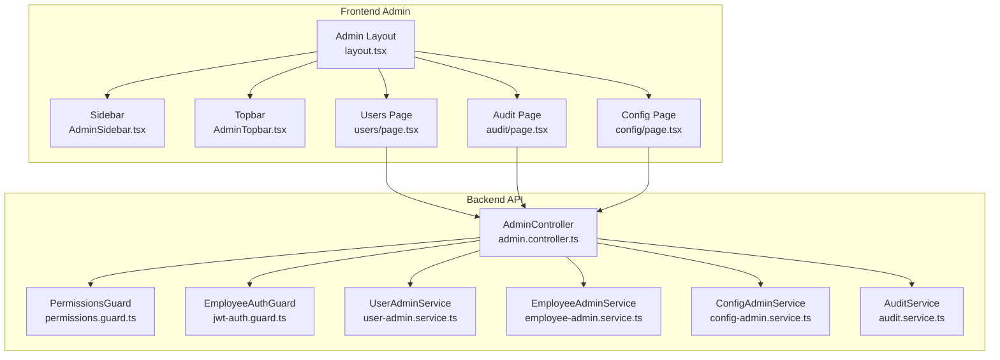
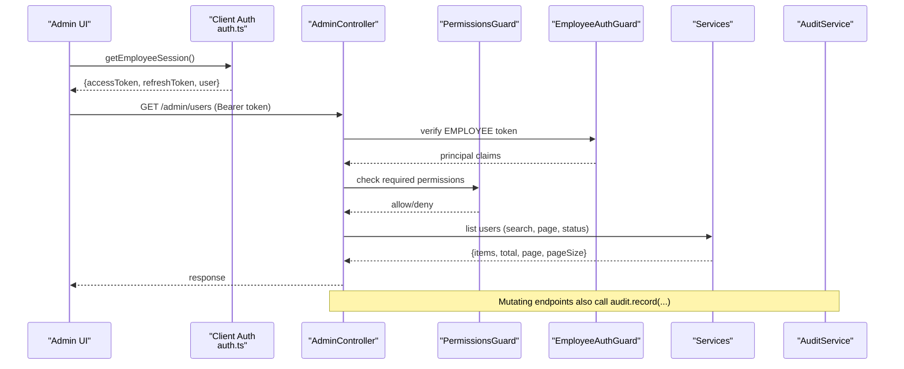
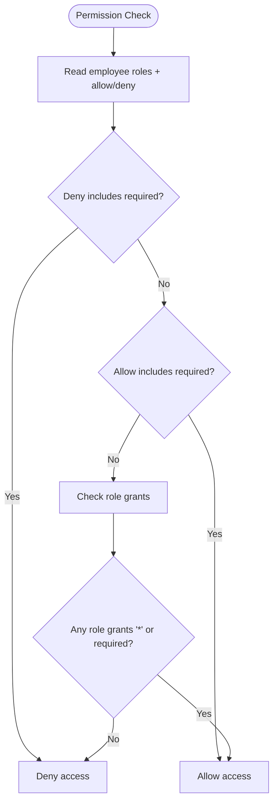
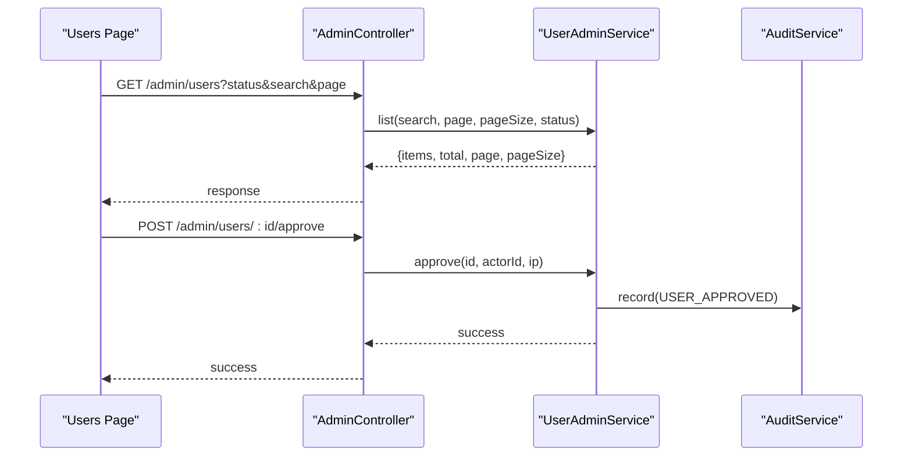
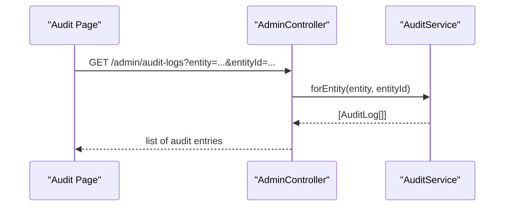
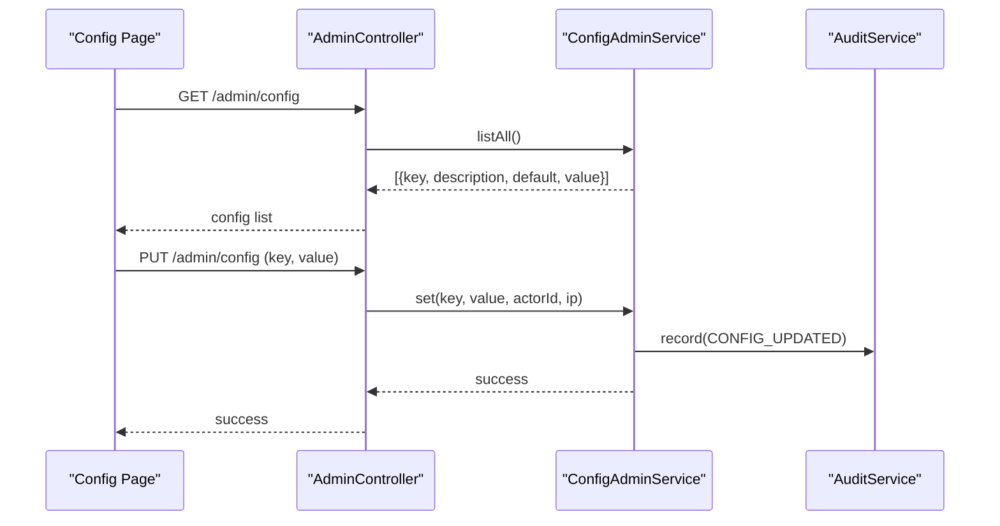
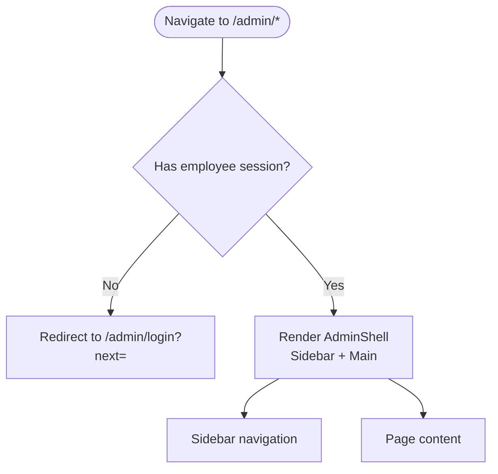
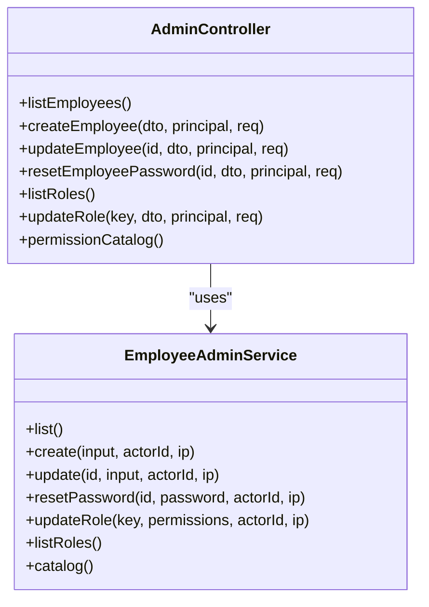
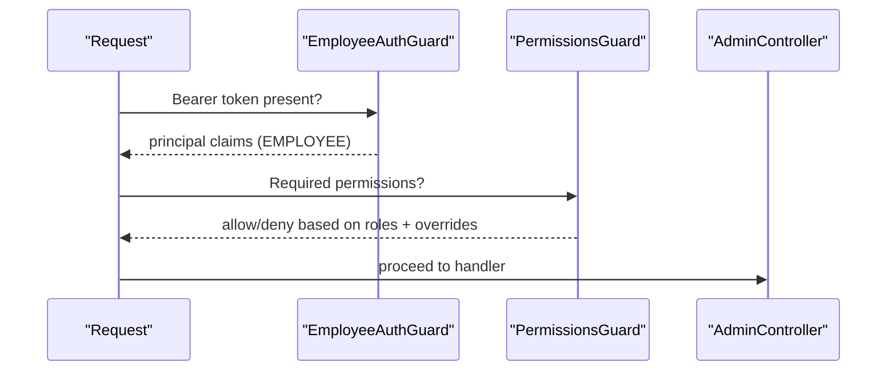
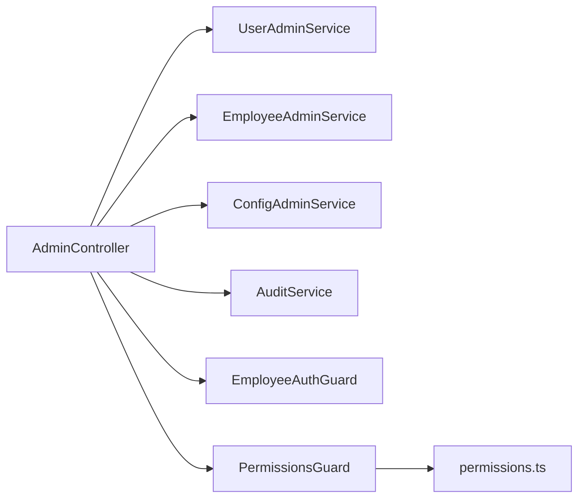

# Administrative Dashboard

<cite>
**Referenced Files in This Document**
- [layout.tsx](file://frontend/trader/src/app/admin/layout.tsx)
- [AdminSidebar.tsx](file://frontend/trader/src/components/admin/AdminSidebar.tsx)
- [AdminTopbar.tsx](file://frontend/trader/src/components/admin/AdminTopbar.tsx)
- [users page.tsx](file://frontend/trader/src/app/admin/users/page.tsx)
- [audit page.tsx](file://frontend/trader/src/app/admin/audit/page.tsx)
- [config page.tsx](file://frontend/trader/src/app/admin/config/page.tsx)
- [auth.ts](file://frontend/trader/src/lib/auth.ts)
- [admin.controller.ts](file://backend/apps/api/src/modules/admin/presentation/admin.controller.ts)
- [permissions.guard.ts](file://backend/apps/api/src/modules/admin/presentation/permissions.guard.ts)
- [permissions.ts](file://backend/apps/api/src/modules/admin/domain/permissions.ts)
- [jwt-auth.guard.ts](file://backend/apps/api/src/modules/auth/presentation/jwt-auth.guard.ts)
- [user-admin.service.ts](file://backend/apps/api/src/modules/admin/application/user-admin.service.ts)
- [employee-admin.service.ts](file://backend/apps/api/src/modules/admin/application/employee-admin.service.ts)
- [config-admin.service.ts](file://backend/apps/api/src/modules/admin/application/config-admin.service.ts)
- [audit.service.ts](file://backend/libs/shared/src/audit/audit.service.ts)
</cite>

## Table of Contents
1. Introduction
2. Project Structure
3. Core Components
4. Architecture Overview
5. Detailed Component Analysis
6. Dependency Analysis
7. Performance Considerations
8. Troubleshooting Guide
9. Conclusion

## Introduction
This document describes the administrative dashboard interface and its backend integrations. It covers role-based access control, user management, audit log viewing, system configuration panels, sidebar navigation, data tables with CRUD operations, real-time monitoring considerations, security measures, permission checks, admin-specific API endpoints, audit trail functionality, user activity tracking, system health monitoring interfaces, responsive design for mobile administration, and accessibility compliance.

## Project Structure
The admin console is a Next.js client application under the frontend that renders an authenticated shell, a sidebar navigation, and feature pages (Users, Audit Log, Configuration). The backend exposes NestJS controllers and services to enforce authentication, authorization, and business logic, including RBAC guards and audit logging.

**Diagram sources**
- [layout.tsx:1-46](file://frontend/trader/src/app/admin/layout.tsx#L1-L46)
- [AdminSidebar.tsx:1-113](file://frontend/trader/src/components/admin/AdminSidebar.tsx#L1-L113)
- [AdminTopbar.tsx:1-47](file://frontend/trader/src/components/admin/AdminTopbar.tsx#L1-L47)
- [users page.tsx:1-291](file://frontend/trader/src/app/admin/users/page.tsx#L1-L291)
- [audit page.tsx:1-40](file://frontend/trader/src/app/admin/audit/page.tsx#L1-L40)
- [config page.tsx:1-55](file://frontend/trader/src/app/admin/config/page.tsx#L1-L55)
- [admin.controller.ts:1-171](file://backend/apps/api/src/modules/admin/presentation/admin.controller.ts#L1-L171)
- [permissions.guard.ts:1-42](file://backend/apps/api/src/modules/admin/presentation/permissions.guard.ts#L1-L42)
- [jwt-auth.guard.ts:1-34](file://backend/apps/api/src/modules/auth/presentation/jwt-auth.guard.ts#L1-L34)
- [user-admin.service.ts:1-153](file://backend/apps/api/src/modules/admin/application/user-admin.service.ts#L1-L153)
- [employee-admin.service.ts:1-125](file://backend/apps/api/src/modules/admin/application/employee-admin.service.ts#L1-L125)
- [config-admin.service.ts:1-38](file://backend/apps/api/src/modules/admin/application/config-admin.service.ts#L1-L38)
- [audit.service.ts:1-45](file://backend/libs/shared/src/audit/audit.service.ts#L1-L45)

**Section sources**
- [layout.tsx:1-46](file://frontend/trader/src/app/admin/layout.tsx#L1-L46)
- [AdminSidebar.tsx:1-113](file://frontend/trader/src/components/admin/AdminSidebar.tsx#L1-L113)
- [AdminTopbar.tsx:1-47](file://frontend/trader/src/components/admin/AdminTopbar.tsx#L1-L47)
- [admin.controller.ts:1-171](file://backend/apps/api/src/modules/admin/presentation/admin.controller.ts#L1-L171)

## Core Components
- Admin layout enforces employee session presence before rendering the console; otherwise redirects to login with a next parameter.
- Sidebar groups navigation into Trading, Product, Data API, and System sections with icons and active state detection.
- Topbar displays title, subtitle, actions, theme toggle, notifications placeholder, and current employee identity.
- Users page provides search, tabs by status, a data table, and detail panel with approve/reject/suspend/unsuspend actions.
- Audit page shows immutable records of admin actions.
- Config page lists runtime configuration keys grouped by domain with edit actions.

Security and permissions:
- Backend routes are protected by JWT guard for employees and a permissions guard enforcing fine-grained RBAC.
- Permission catalog defines granular permissions and default roles; deny overrides take precedence.

Data flows:
- Frontend calls admin APIs using stored employee tokens.
- Services perform business operations and record audit entries.

**Section sources**
- [layout.tsx:1-46](file://frontend/trader/src/app/admin/layout.tsx#L1-L46)
- [AdminSidebar.tsx:1-113](file://frontend/trader/src/components/admin/AdminSidebar.tsx#L1-L113)
- [AdminTopbar.tsx:1-47](file://frontend/trader/src/components/admin/AdminTopbar.tsx#L1-L47)
- [users page.tsx:1-291](file://frontend/trader/src/app/admin/users/page.tsx#L1-L291)
- [audit page.tsx:1-40](file://frontend/trader/src/app/admin/audit/page.tsx#L1-L40)
- [config page.tsx:1-55](file://frontend/trader/src/app/admin/config/page.tsx#L1-L55)
- [permissions.guard.ts:1-42](file://backend/apps/api/src/modules/admin/presentation/permissions.guard.ts#L1-L42)
- [permissions.ts:1-65](file://backend/apps/api/src/modules/admin/domain/permissions.ts#L1-L65)
- [jwt-auth.guard.ts:1-34](file://backend/apps/api/src/modules/auth/presentation/jwt-auth.guard.ts#L1-L34)

## Architecture Overview
The admin dashboard follows a layered architecture:
- Presentation layer (Next.js pages) handles UI, routing, and local state.
- API layer (NestJS controller) validates requests, applies guards, and delegates to services.
- Application layer (services) implements business rules, persists changes, and emits audit events.
- Shared infrastructure (audit service) ensures write-once audit trails.

**Diagram sources**
- [auth.ts:54-142](file://frontend/trader/src/lib/auth.ts#L54-L142)
- [admin.controller.ts:30-171](file://backend/apps/api/src/modules/admin/presentation/admin.controller.ts#L30-L171)
- [jwt-auth.guard.ts:10-34](file://backend/apps/api/src/modules/auth/presentation/jwt-auth.guard.ts#L10-L34)
- [permissions.guard.ts:13-42](file://backend/apps/api/src/modules/admin/presentation/permissions.guard.ts#L13-L42)
- [user-admin.service.ts:22-51](file://backend/apps/api/src/modules/admin/application/user-admin.service.ts#L22-L51)
- [audit.service.ts:23-45](file://backend/libs/shared/src/audit/audit.service.ts#L23-L45)

## Detailed Component Analysis

### Role-Based Access Control (RBAC)
- Permission catalog defines granular permissions across modules (users, employees, config, audit, etc.).
- Default roles include Super Admin, Admin, Finance, KYC Officer, Support, Operations with predefined permission sets.
- Effective permission evaluation uses per-user allow/deny overrides with deny-wins semantics.
- PermissionsGuard reads live employee records and cached role permissions to enforce access at request time.

**Diagram sources**
- [permissions.ts:1-65](file://backend/apps/api/src/modules/admin/domain/permissions.ts#L1-L65)
- [permissions.guard.ts:13-42](file://backend/apps/api/src/modules/admin/presentation/permissions.guard.ts#L13-L42)

**Section sources**
- [permissions.ts:1-65](file://backend/apps/api/src/modules/admin/domain/permissions.ts#L1-L65)
- [permissions.guard.ts:1-42](file://backend/apps/api/src/modules/admin/presentation/permissions.guard.ts#L1-L42)

### User Management Interface
- Users page supports filtering by status via tabs and searching by name/email/mobile/username.
- Detail panel shows registration details, KYC status, joined date, and actions for pending approvals.
- Approve and reject actions call dedicated endpoints; suspend/unsuspend endpoints are exposed on the backend.
- Backend service returns paginated results and aggregates recent login history and active sessions for a 360-degree view.

**Diagram sources**
- [users page.tsx:61-126](file://frontend/trader/src/app/admin/users/page.tsx#L61-L126)
- [admin.controller.ts:99-145](file://backend/apps/api/src/modules/admin/presentation/admin.controller.ts#L99-L145)
- [user-admin.service.ts:22-81](file://backend/apps/api/src/modules/admin/application/user-admin.service.ts#L22-L81)
- [audit.service.ts:23-45](file://backend/libs/shared/src/audit/audit.service.ts#L23-L45)

**Section sources**
- [users page.tsx:1-291](file://frontend/trader/src/app/admin/users/page.tsx#L1-L291)
- [admin.controller.ts:99-145](file://backend/apps/api/src/modules/admin/presentation/admin.controller.ts#L99-L145)
- [user-admin.service.ts:22-147](file://backend/apps/api/src/modules/admin/application/user-admin.service.ts#L22-L147)

### Audit Log Viewer
- Audit page presents immutable records of admin actions with actor, timestamp, action, target, and change delta.
- Backend provides query endpoints to retrieve logs by entity+entityId or by actorId.
- AuditService ensures write-once behavior and never throws during writes to avoid disrupting business operations.

**Diagram sources**
- [audit page.tsx:1-40](file://frontend/trader/src/app/admin/audit/page.tsx#L1-L40)
- [admin.controller.ts:161-170](file://backend/apps/api/src/modules/admin/presentation/admin.controller.ts#L161-L170)
- [audit.service.ts:23-45](file://backend/libs/shared/src/audit/audit.service.ts#L23-L45)

**Section sources**
- [audit page.tsx:1-40](file://frontend/trader/src/app/admin/audit/page.tsx#L1-L40)
- [admin.controller.ts:161-170](file://backend/apps/api/src/modules/admin/presentation/admin.controller.ts#L161-L170)
- [audit.service.ts:1-45](file://backend/libs/shared/src/audit/audit.service.ts#L1-L45)

### System Configuration Panels
- Config page enumerates runtime configuration keys grouped by domain with descriptions and current values.
- Backend exposes endpoints to list all registered config keys and set values with validation and audit recording.
- Changes are persisted through the app configuration service and recorded in the audit trail.

**Diagram sources**
- [config page.tsx:1-55](file://frontend/trader/src/app/admin/config/page.tsx#L1-L55)
- [admin.controller.ts:147-159](file://backend/apps/api/src/modules/admin/presentation/admin.controller.ts#L147-L159)
- [config-admin.service.ts:1-38](file://backend/apps/api/src/modules/admin/application/config-admin.service.ts#L1-L38)
- [audit.service.ts:23-45](file://backend/libs/shared/src/audit/audit.service.ts#L23-L45)

**Section sources**
- [config page.tsx:1-55](file://frontend/trader/src/app/admin/config/page.tsx#L1-L55)
- [admin.controller.ts:147-159](file://backend/apps/api/src/modules/admin/presentation/admin.controller.ts#L147-L159)
- [config-admin.service.ts:1-38](file://backend/apps/api/src/modules/admin/application/config-admin.service.ts#L1-L38)

### Sidebar Navigation and Shell
- Admin layout checks for an employee session and redirects to login if missing; otherwise renders sidebar and main content area.
- Sidebar organizes navigation into logical groups and highlights the active route; includes sign-out and return-to-trader links.
- Topbar shows current employee identity and quick actions.

**Diagram sources**
- [layout.tsx:1-46](file://frontend/trader/src/app/admin/layout.tsx#L1-L46)
- [AdminSidebar.tsx:1-113](file://frontend/trader/src/components/admin/AdminSidebar.tsx#L1-L113)
- [AdminTopbar.tsx:1-47](file://frontend/trader/src/components/admin/AdminTopbar.tsx#L1-L47)
- [auth.ts:54-142](file://frontend/trader/src/lib/auth.ts#L54-L142)

**Section sources**
- [layout.tsx:1-46](file://frontend/trader/src/app/admin/layout.tsx#L1-L46)
- [AdminSidebar.tsx:1-113](file://frontend/trader/src/components/admin/AdminSidebar.tsx#L1-L113)
- [AdminTopbar.tsx:1-47](file://frontend/trader/src/components/admin/AdminTopbar.tsx#L1-L47)
- [auth.ts:54-142](file://frontend/trader/src/lib/auth.ts#L54-L142)

### Employee and Role Management
- Backend exposes endpoints to list/create/update employees, reset passwords, list roles, update role permissions, and expose the permission catalog.
- EmployeeAdminService validates roles and permissions, prevents self-lockout, updates role cache, and records audit entries.

**Diagram sources**
- [admin.controller.ts:40-97](file://backend/apps/api/src/modules/admin/presentation/admin.controller.ts#L40-L97)
- [employee-admin.service.ts:1-125](file://backend/apps/api/src/modules/admin/application/employee-admin.service.ts#L1-L125)

**Section sources**
- [admin.controller.ts:40-97](file://backend/apps/api/src/modules/admin/presentation/admin.controller.ts#L40-L97)
- [employee-admin.service.ts:1-125](file://backend/apps/api/src/modules/admin/application/employee-admin.service.ts#L1-L125)

### Security Measures and Permission Checks
- EmployeeAuthGuard validates bearer tokens and ensures the actor kind is EMPLOYEE.
- PermissionsGuard enforces fine-grained permissions against live employee records and cached role permissions.
- All mutating admin operations pass actor identity and IP to services for audit recording.

**Diagram sources**
- [jwt-auth.guard.ts:10-34](file://backend/apps/api/src/modules/auth/presentation/jwt-auth.guard.ts#L10-L34)
- [permissions.guard.ts:13-42](file://backend/apps/api/src/modules/admin/presentation/permissions.guard.ts#L13-L42)
- [admin.controller.ts:30-171](file://backend/apps/api/src/modules/admin/presentation/admin.controller.ts#L30-L171)

**Section sources**
- [jwt-auth.guard.ts:1-34](file://backend/apps/api/src/modules/auth/presentation/jwt-auth.guard.ts#L1-L34)
- [permissions.guard.ts:1-42](file://backend/apps/api/src/modules/admin/presentation/permissions.guard.ts#L1-L42)
- [admin.controller.ts:30-171](file://backend/apps/api/src/modules/admin/presentation/admin.controller.ts#L30-L171)

### Real-Time Monitoring Capabilities
- The current admin pages do not implement real-time streaming; they use REST endpoints for listing and mutations.
- For future real-time features (e.g., live user counts, alerts), consider adding server-sent events or WebSocket channels from the market gateway or a dedicated monitoring endpoint.

[No sources needed since this section provides general guidance]

### Responsive Design and Accessibility
- The users page adapts layout on smaller screens using CSS media queries to stack columns.
- Sidebar and topbar use semantic HTML attributes such as aria-label and aria-current for accessibility.
- Theme toggle and keyboard-friendly controls support usability across devices.

**Section sources**
- [users page.tsx:270-287](file://frontend/trader/src/app/admin/users/page.tsx#L270-L287)
- [AdminSidebar.tsx:54-110](file://frontend/trader/src/components/admin/AdminSidebar.tsx#L54-L110)
- [AdminTopbar.tsx:12-46](file://frontend/trader/src/components/admin/AdminTopbar.tsx#L12-L46)

## Dependency Analysis
The admin module depends on shared services for configuration and auditing, and on auth infrastructure for token verification.

**Diagram sources**
- [admin.controller.ts:1-171](file://backend/apps/api/src/modules/admin/presentation/admin.controller.ts#L1-L171)
- [user-admin.service.ts:1-153](file://backend/apps/api/src/modules/admin/application/user-admin.service.ts#L1-L153)
- [employee-admin.service.ts:1-125](file://backend/apps/api/src/modules/admin/application/employee-admin.service.ts#L1-L125)
- [config-admin.service.ts:1-38](file://backend/apps/api/src/modules/admin/application/config-admin.service.ts#L1-L38)
- [audit.service.ts:1-45](file://backend/libs/shared/src/audit/audit.service.ts#L1-L45)
- [jwt-auth.guard.ts:1-34](file://backend/apps/api/src/modules/auth/presentation/jwt-auth.guard.ts#L1-L34)
- [permissions.guard.ts:1-42](file://backend/apps/api/src/modules/admin/presentation/permissions.guard.ts#L1-L42)
- [permissions.ts:1-65](file://backend/apps/api/src/modules/admin/domain/permissions.ts#L1-L65)

**Section sources**
- [admin.controller.ts:1-171](file://backend/apps/api/src/modules/admin/presentation/admin.controller.ts#L1-L171)
- [permissions.ts:1-65](file://backend/apps/api/src/modules/admin/domain/permissions.ts#L1-L65)

## Performance Considerations
- Pagination and search reduce payload sizes for large user lists.
- Aggregations like counting documents run concurrently with queries to minimize latency.
- Audit writes are isolated and non-blocking to avoid impacting business operations.
- Consider caching frequently read configurations and role permissions where appropriate.

[No sources needed since this section provides general guidance]

## Troubleshooting Guide
Common issues and resolutions:
- Unauthorized or expired token: Ensure employee session exists and token is valid; re-login if necessary.
- Insufficient permissions: Verify employee roles and overrides; confirm required permission is granted.
- Invalid config key: Only known keys can be updated; check the registry and documentation.
- Audit write failures: Non-fatal; check logs for database connectivity or storage issues.

Operational tips:
- Use the audit log to trace who changed what and when.
- Validate inputs on the frontend to provide immediate feedback before calling APIs.
- For user suspension, note that active sessions are revoked automatically.

**Section sources**
- [jwt-auth.guard.ts:10-34](file://backend/apps/api/src/modules/auth/presentation/jwt-auth.guard.ts#L10-L34)
- [permissions.guard.ts:13-42](file://backend/apps/api/src/modules/admin/presentation/permissions.guard.ts#L13-L42)
- [config-admin.service.ts:21-35](file://backend/apps/api/src/modules/admin/application/config-admin.service.ts#L21-L35)
- [audit.service.ts:23-45](file://backend/libs/shared/src/audit/audit.service.ts#L23-L45)

## Conclusion
The administrative dashboard provides a secure, role-based interface for managing users, reviewing KYC, configuring system settings, and auditing actions. It leverages robust guards and services to enforce permissions and maintain an immutable audit trail. The UI is responsive and accessible, with clear navigation and actionable data tables. Future enhancements can introduce real-time monitoring and richer analytics while preserving the strong security and audit foundations already in place.