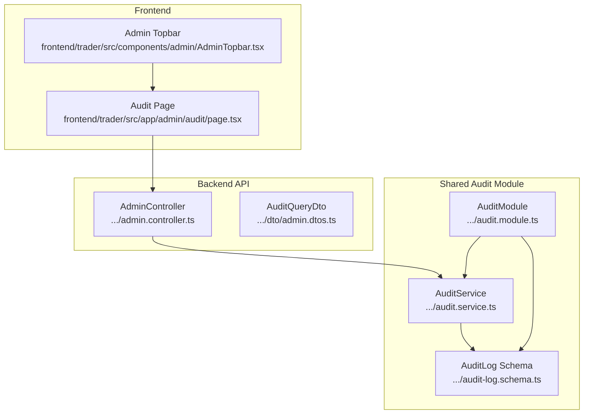
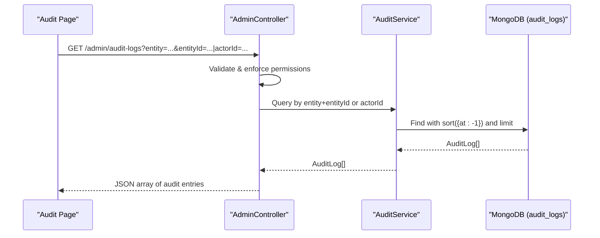
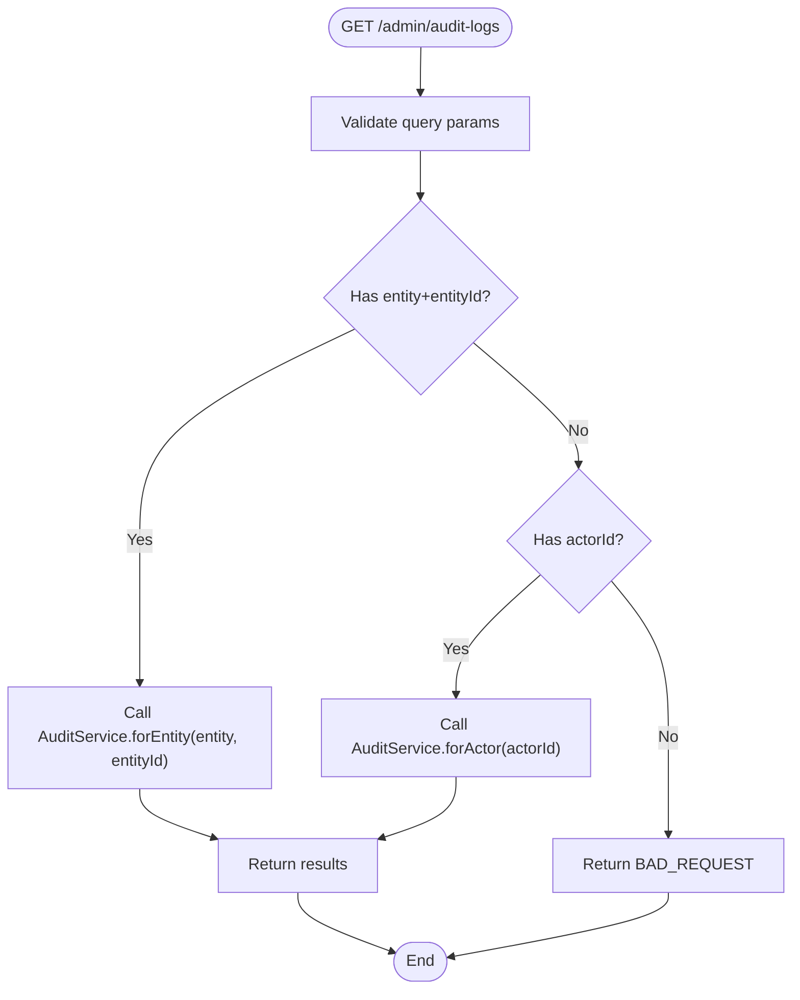
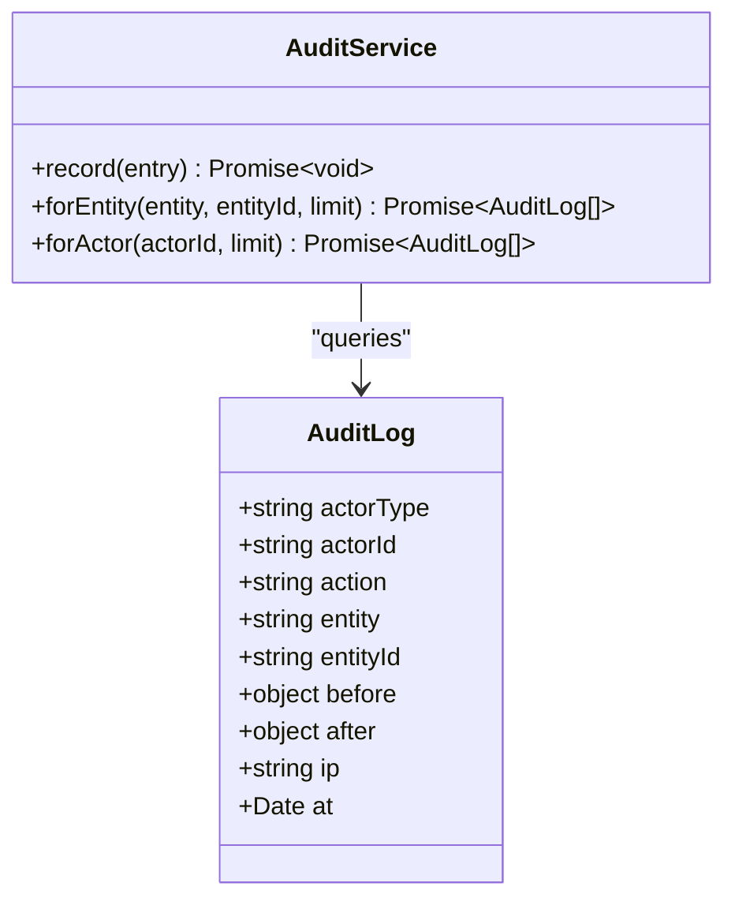
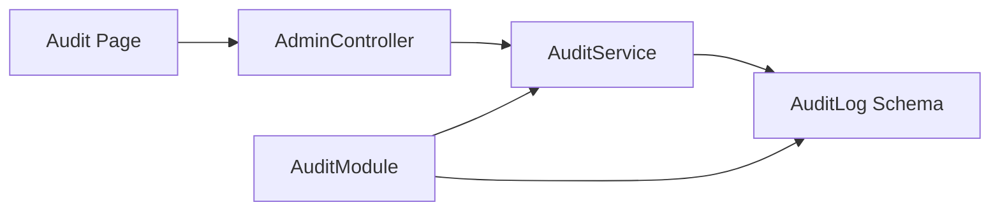

# Audit Log Viewer

<cite>
**Referenced Files in This Document**
- [page.tsx](file://frontend/trader/src/app/admin/audit/page.tsx)
- [AdminTopbar.tsx](file://frontend/trader/src/components/admin/AdminTopbar.tsx)
- [admin.controller.ts](file://backend/apps/api/src/modules/admin/presentation/admin.controller.ts)
- [admin.dtos.ts](file://backend/apps/api/src/modules/admin/presentation/dto/admin.dtos.ts)
- [audit.service.ts](file://backend/libs/shared/src/audit/audit.service.ts)
- [audit-log.schema.ts](file://backend/libs/shared/src/audit/audit-log.schema.ts)
- [audit.module.ts](file://backend/libs/shared/src/audit/audit.module.ts)
</cite>

## Table of Contents
1. [Introduction](#introduction)
2. [Project Structure](#project-structure)
3. [Core Components](#core-components)
4. [Architecture Overview](#architecture-overview)
5. [Detailed Component Analysis](#detailed-component-analysis)
6. [Dependency Analysis](#dependency-analysis)
7. [Performance Considerations](#performance-considerations)
8. [Troubleshooting Guide](#troubleshooting-guide)
9. [Conclusion](#conclusion)
10. [Appendices](#appendices)

## Introduction
This document describes the audit log viewer interface and its backend integration. It explains how audit entries are modeled, stored, queried, and displayed to administrators. It also covers current capabilities and recommended enhancements for filtering by date range, user, action type, and severity; real-time streaming; export functionality; performance optimization for large datasets; retention policies; and security considerations for sensitive data masking.

## Project Structure
The audit feature spans a frontend admin page and a backend shared module:
- Frontend: an admin page that renders a table of audit entries with an export button placeholder.
- Backend: a shared audit module providing an immutable audit service, Mongoose schema, and an admin controller endpoint to query logs by entity or actor.

**Diagram sources**
- [page.tsx:13-39](file://frontend/trader/src/app/admin/audit/page.tsx#L13-L39)
- [AdminTopbar.tsx:6-46](file://frontend/trader/src/components/admin/AdminTopbar.tsx#L6-L46)
- [admin.controller.ts:30-169](file://backend/apps/api/src/modules/admin/presentation/admin.controller.ts#L30-L169)
- [admin.dtos.ts:83-92](file://backend/apps/api/src/modules/admin/presentation/dto/admin.dtos.ts#L83-L92)
- [audit.service.ts:23-44](file://backend/libs/shared/src/audit/audit.service.ts#L23-L44)
- [audit-log.schema.ts:7-40](file://backend/libs/shared/src/audit/audit-log.schema.ts#L7-L40)
- [audit.module.ts:6-12](file://backend/libs/shared/src/audit/audit.module.ts#L6-L12)

**Section sources**
- [page.tsx:13-39](file://frontend/trader/src/app/admin/audit/page.tsx#L13-L39)
- [admin.controller.ts:30-169](file://backend/apps/api/src/modules/admin/presentation/admin.controller.ts#L30-L169)
- [audit.service.ts:23-44](file://backend/libs/shared/src/audit/audit.service.ts#L23-L44)
- [audit-log.schema.ts:7-40](file://backend/libs/shared/src/audit/audit-log.schema.ts#L7-L40)
- [audit.module.ts:6-12](file://backend/libs/shared/src/audit/audit.module.ts#L6-L12)

## Core Components
- AuditPage (frontend): Renders the audit log table with columns for ID, timestamp, actor, action, target, and change delta. Includes an Export button placeholder.
- AdminTopbar (frontend): Provides consistent header UI for admin pages, including title, subtitle, actions, and user context.
- AdminController (backend): Exposes GET /admin/audit-logs guarded by authentication and permissions. Accepts query parameters to filter by entity+entityId or actorId.
- AuditService (backend): Immutable write-once service with record() and read methods for querying by entity or actor.
- AuditLog schema (backend): Defines immutable fields including actorType, actorId, action, entity, entityId, before/after snapshots, ip, and at timestamp. Includes indexes for efficient queries.
- AuditModule (backend): Global NestJS module wiring Mongoose model and exporting AuditService.

Key responsibilities:
- Frontend displays structured audit entries and provides an export action placeholder.
- Backend enforces immutability, secure access via guards, and efficient retrieval using indexes.

**Section sources**
- [page.tsx:13-39](file://frontend/trader/src/app/admin/audit/page.tsx#L13-L39)
- [AdminTopbar.tsx:6-46](file://frontend/trader/src/components/admin/AdminTopbar.tsx#L6-L46)
- [admin.controller.ts:161-169](file://backend/apps/api/src/modules/admin/presentation/admin.controller.ts#L161-L169)
- [audit.service.ts:23-44](file://backend/libs/shared/src/audit/audit.service.ts#L23-L44)
- [audit-log.schema.ts:7-40](file://backend/libs/shared/src/audit/audit-log.schema.ts#L7-L40)
- [audit.module.ts:6-12](file://backend/libs/shared/src/audit/audit.module.ts#L6-L12)

## Architecture Overview
The audit log viewer follows a simple client-server pattern:
- The admin page requests audit logs from the backend.
- The controller validates input and delegates to the shared AuditService.
- The service queries the Mongoose model backed by MongoDB, leveraging indexes for performance.
- Results are returned to the frontend for rendering.

**Diagram sources**
- [admin.controller.ts:161-169](file://backend/apps/api/src/modules/admin/presentation/admin.controller.ts#L161-L169)
- [audit.service.ts:37-43](file://backend/libs/shared/src/audit/audit.service.ts#L37-L43)
- [audit-log.schema.ts:38-40](file://backend/libs/shared/src/audit/audit-log.schema.ts#L38-L40)

## Detailed Component Analysis

### Frontend: Audit Page
- Displays a static list of audit entries with key fields: ID, timestamp, actor, action, target, and change delta.
- Uses AdminTopbar for consistent header and includes an Export button placeholder.
- Current state: no live data fetching or filters implemented in this file.

Recommended enhancements:
- Add filters for date range, user (actor), action type, and severity (if added to schema).
- Implement pagination and server-side sorting.
- Wire Export to call the backend and download CSV/JSON.

**Section sources**
- [page.tsx:13-39](file://frontend/trader/src/app/admin/audit/page.tsx#L13-L39)
- [AdminTopbar.tsx:6-46](file://frontend/trader/src/components/admin/AdminTopbar.tsx#L6-L46)

### Backend: Admin Controller and DTOs
- Endpoint: GET /admin/audit-logs
- Guards: Requires employee authentication and specific permission (audit.view).
- Query parameters:
  - entity + entityId: returns logs for a specific entity.
  - actorId: returns logs for a specific actor.
- Validation: Enforced via class-validator decorators on AuditQueryDto.

**Diagram sources**
- [admin.controller.ts:161-169](file://backend/apps/api/src/modules/admin/presentation/admin.controller.ts#L161-L169)
- [admin.dtos.ts:83-92](file://backend/apps/api/src/modules/admin/presentation/dto/admin.dtos.ts#L83-L92)

**Section sources**
- [admin.controller.ts:161-169](file://backend/apps/api/src/modules/admin/presentation/admin.controller.ts#L161-L169)
- [admin.dtos.ts:83-92](file://backend/apps/api/src/modules/admin/presentation/dto/admin.dtos.ts#L83-L92)

### Backend: Audit Service and Schema
- AuditService:
  - record(entry): writes an immutable audit entry; failures are logged but do not abort business operations.
  - forEntity(entity, entityId, limit): returns recent entries for an entity.
  - forActor(actorId, limit): returns recent entries for an actor.
- AuditLog schema:
  - Fields include actorType, actorId, action, entity, entityId, before/after snapshots, ip, and at timestamp.
  - Indexes optimize queries by entity+entityId+at, actorId+at, and at.

**Diagram sources**
- [audit.service.ts:23-44](file://backend/libs/shared/src/audit/audit.service.ts#L23-L44)
- [audit-log.schema.ts:7-40](file://backend/libs/shared/src/audit/audit-log.schema.ts#L7-L40)

**Section sources**
- [audit.service.ts:23-44](file://backend/libs/shared/src/audit/audit.service.ts#L23-L44)
- [audit-log.schema.ts:7-40](file://backend/libs/shared/src/audit/audit-log.schema.ts#L7-L40)

### Data Model and Indexing
- Collection: audit_logs
- Key indexes:
  - { entity: 1, entityId: 1, at: -1 }
  - { actorId: 1, at: -1 }
  - { at: -1 }
These support efficient time-sorted queries for entity-scoped and actor-scoped views.

**Section sources**
- [audit-log.schema.ts:38-40](file://backend/libs/shared/src/audit/audit-log.schema.ts#L38-L40)

## Dependency Analysis
- Frontend depends on AdminTopbar for consistent UI chrome.
- AdminController depends on AuditService for data retrieval.
- AuditService depends on Mongoose model defined by AuditLog schema.
- AuditModule wires Mongoose features and exports AuditService globally.

**Diagram sources**
- [page.tsx:13-39](file://frontend/trader/src/app/admin/audit/page.tsx#L13-L39)
- [admin.controller.ts:30-169](file://backend/apps/api/src/modules/admin/presentation/admin.controller.ts#L30-L169)
- [audit.service.ts:23-44](file://backend/libs/shared/src/audit/audit.service.ts#L23-L44)
- [audit-log.schema.ts:7-40](file://backend/libs/shared/src/audit/audit-log.schema.ts#L7-L40)
- [audit.module.ts:6-12](file://backend/libs/shared/src/audit/audit.module.ts#L6-L12)

**Section sources**
- [admin.controller.ts:30-169](file://backend/apps/api/src/modules/admin/presentation/admin.controller.ts#L30-L169)
- [audit.module.ts:6-12](file://backend/libs/shared/src/audit/audit.module.ts#L6-L12)

## Performance Considerations
- Use existing indexes to keep queries fast:
  - Entity-scoped queries benefit from { entity, entityId, at }.
  - Actor-scoped queries benefit from { actorId, at }.
- Limit result sets:
  - Default limits are applied in service methods; consider exposing a pageSize parameter in the API for client control.
- Pagination:
  - Introduce cursor-based or offset pagination to handle large histories efficiently.
- Time-bounded queries:
  - Add date range filters to reduce payload size and improve index utilization when supported.
- Avoid heavy transformations on the client; prefer server-side filtering and projection.

[No sources needed since this section provides general guidance]

## Troubleshooting Guide
Common issues and resolutions:
- Bad request when querying audit logs:
  - Ensure either entity+entityId or actorId is provided. The controller returns a bad request otherwise.
- Permission denied:
  - The endpoint requires employee authentication and the audit.view permission. Verify role assignments and token claims.
- Missing or stale data:
  - Confirm that audit events are being recorded by services that call AuditService.record().
  - Check application logs for “AUDIT WRITE FAILED” messages indicating database write errors.

Operational checks:
- Verify MongoDB connectivity and indexes exist for audit_logs.
- Review error logs around AuditService.record() for write failures.

**Section sources**
- [admin.controller.ts:161-169](file://backend/apps/api/src/modules/admin/presentation/admin.controller.ts#L161-L169)
- [audit.service.ts:29-35](file://backend/libs/shared/src/audit/audit.service.ts#L29-L35)

## Conclusion
The audit log viewer currently provides a basic admin-facing table with an export placeholder and a backend endpoint to retrieve immutable audit records by entity or actor. The shared audit module ensures write-once semantics, robust indexing, and safe failure handling. To meet advanced requirements such as date-range filtering, real-time streaming, export automation, and retention policies, extend both the frontend UI and backend API while preserving immutability and security principles.

[No sources needed since this section summarizes without analyzing specific files]

## Appendices

### Filtering System Design (Proposed)
- Date range:
  - Add startAt and endAt query parameters to the controller and service, applying them to the MongoDB query with index usage on at.
- User (actor):
  - Already supported via actorId.
- Action type:
  - Add action filter to narrow down logs by action string.
- Severity level:
  - Introduce a severity field in the schema if required by your use case; add corresponding index and filter support.

[No sources needed since this section proposes enhancements]

### Real-Time Streaming (Proposed)
- Options:
  - Server-Sent Events (SSE) for push updates to the admin page.
  - WebSocket channel for bidirectional interactions (e.g., live filters).
- Security:
  - Reuse existing authentication and authorization guards to restrict access to authorized employees.

[No sources needed since this section proposes enhancements]

### Export Functionality (Proposed)
- Implement a new endpoint (e.g., GET /admin/audit-logs/export?format=csv|json) that streams results based on current filters.
- Respect rate limiting and quotas to prevent abuse.

[No sources needed since this section proposes enhancements]

### Retention Policies (Proposed)
- Define retention rules (e.g., archive after N months, delete after M years).
- Implement background jobs to move old records to cold storage or purge them according to policy.
- Ensure compliance with legal and organizational requirements.

[No sources needed since this section proposes enhancements]

### Security Considerations
- Access control:
  - Guard the audit endpoints with authentication and explicit permissions (audit.view).
- Sensitive data masking:
  - Before recording or returning audit entries, sanitize sensitive fields in before/after snapshots (e.g., PII, tokens).
  - Apply masking at the service layer to ensure consistency.
- Immutability:
  - Do not expose update/delete endpoints for audit logs.
- IP logging:
  - Capture and store the originating IP for traceability where appropriate.

[No sources needed since this section provides general guidance]