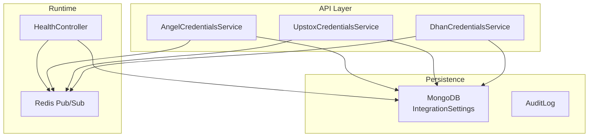
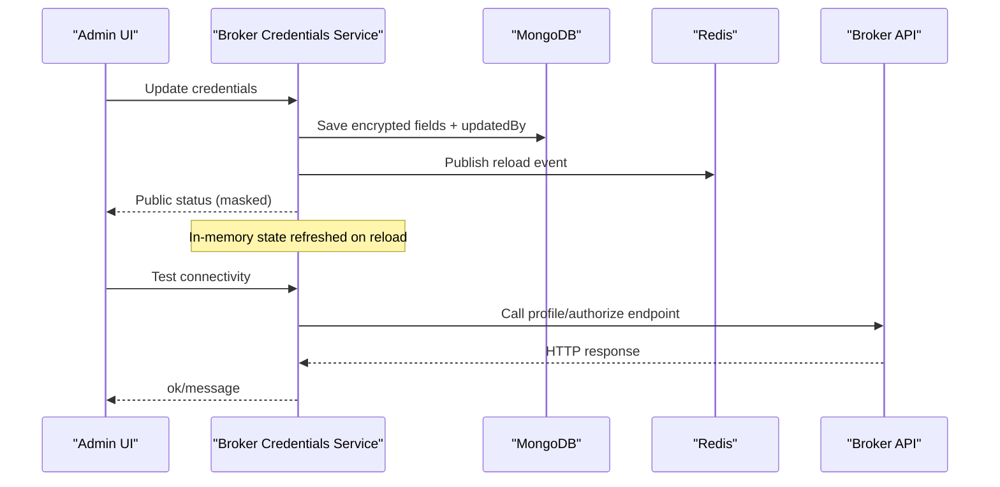
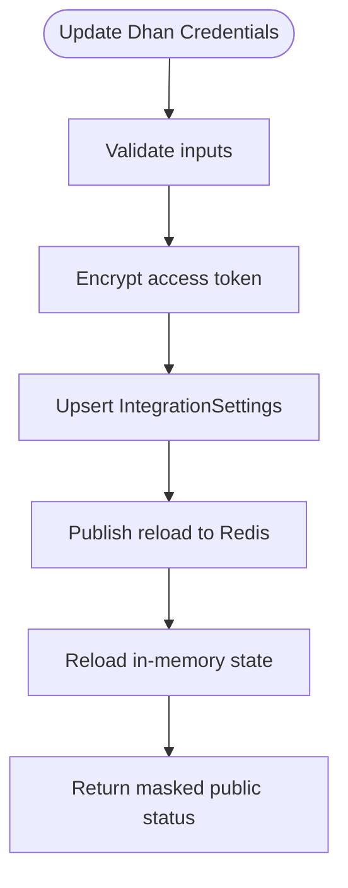
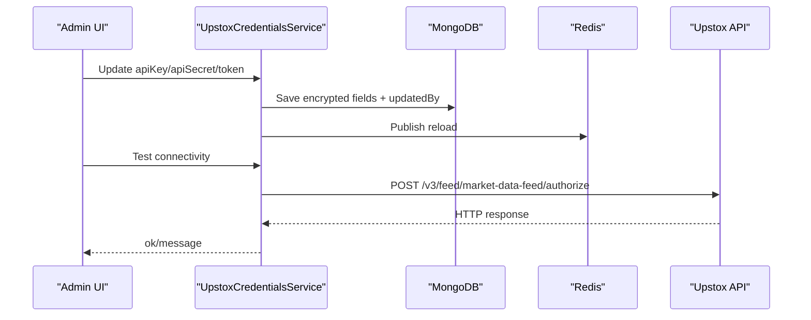
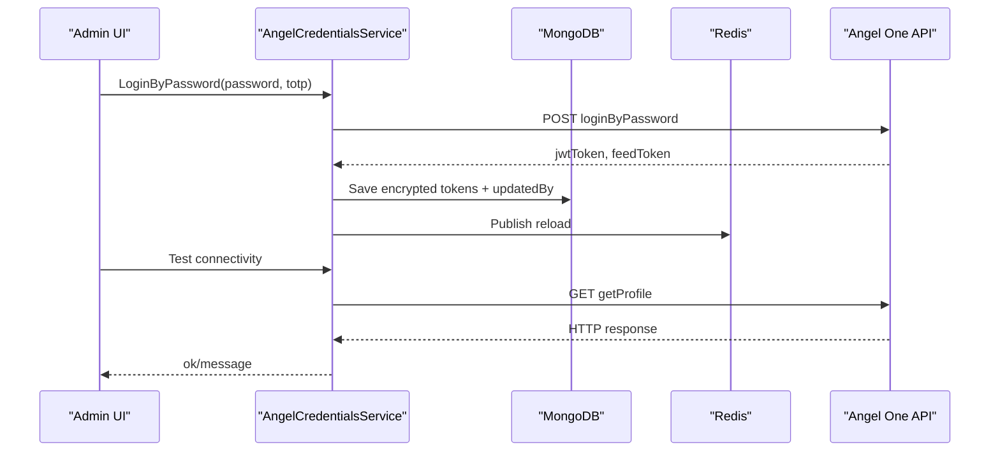
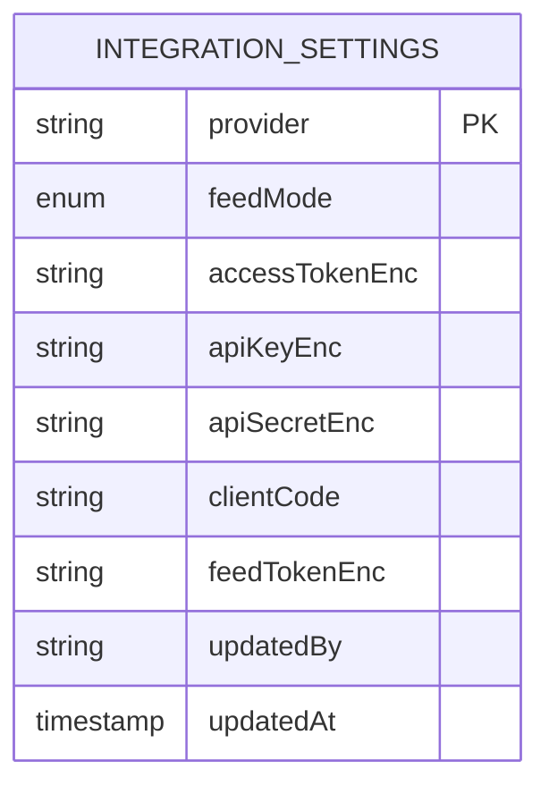
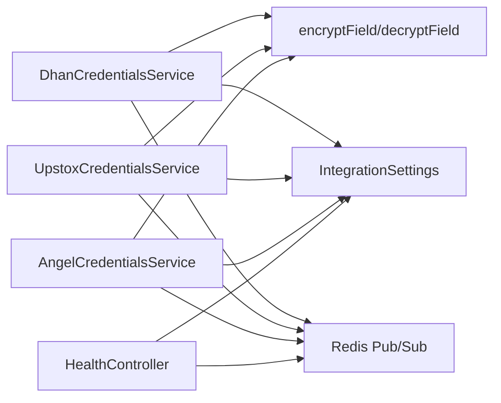

# Broker Integration Management

<cite>
**Referenced Files in This Document**
- [dhan-credentials.service.ts](file://backend/apps/api/src/modules/market/application/dhan-credentials.service.ts)
- [upstox-credentials.service.ts](file://backend/apps/api/src/modules/market/application/upstox-credentials.service.ts)
- [angel-credentials.service.ts](file://backend/apps/api/src/modules/market/application/angel-credentials.service.ts)
- [integration-settings.schema.ts](file://backend/apps/api/src/modules/market/infrastructure/schemas/integration-settings.schema.ts)
- [crypto.util.ts](file://backend/apps/api/src/modules/auth/infrastructure/crypto.util.ts)
- [health.controller.ts](file://backend/libs/shared/src/health/health.controller.ts)
- [audit.service.ts](file://backend/libs/shared/src/audit/audit.service.ts)
- [audit-log.schema.ts](file://backend/libs/shared/src/audit/audit-log.schema.ts)
- [redis-throttler.storage.ts](file://backend/libs/shared/src/rate-limit/redis-throttler.storage.ts)
</cite>

## Table of Contents
1. Introduction
2. Project Structure
3. Core Components
4. Architecture Overview
5. Detailed Component Analysis
6. Dependency Analysis
7. Performance Considerations
8. Troubleshooting Guide
9. Conclusion

## Introduction
This document explains the broker integration management interfaces for Dhan, Upstox, and Angel One. It covers credential storage and retrieval, token refresh flows, connection testing, rate limiting configuration points, failover behavior, health monitoring, error reporting, debugging aids, security measures for sensitive credentials, and audit trails for configuration changes.

## Project Structure
The broker integrations are implemented as per-broker services that:
- Load credentials from an encrypted database record with environment variable fallbacks
- Expose update, test connectivity, and status endpoints
- Broadcast runtime reload events via Redis so API and engine processes can refresh without restarts
- Persist updates with updatedBy metadata for auditing

**Diagram sources**
- [dhan-credentials.service.ts:56-89](file://backend/apps/api/src/modules/market/application/dhan-credentials.service.ts#L56-L89)
- [upstox-credentials.service.ts:43-79](file://backend/apps/api/src/modules/market/application/upstox-credentials.service.ts#L43-L79)
- [angel-credentials.service.ts:53-92](file://backend/apps/api/src/modules/market/application/angel-credentials.service.ts#L53-L92)
- [integration-settings.schema.ts:9-37](file://backend/apps/api/src/modules/market/infrastructure/schemas/integration-settings.schema.ts#L9-L37)
- [health.controller.ts:19-35](file://backend/libs/shared/src/health/health.controller.ts#L19-L35)

**Section sources**
- [dhan-credentials.service.ts:56-89](file://backend/apps/api/src/modules/market/application/dhan-credentials.service.ts#L56-L89)
- [upstox-credentials.service.ts:43-79](file://backend/apps/api/src/modules/market/application/upstox-credentials.service.ts#L43-L79)
- [angel-credentials.service.ts:53-92](file://backend/apps/api/src/modules/market/application/angel-credentials.service.ts#L53-L92)
- [integration-settings.schema.ts:9-37](file://backend/apps/api/src/modules/market/infrastructure/schemas/integration-settings.schema.ts#L9-L37)
- [health.controller.ts:19-35](file://backend/libs/shared/src/health/health.controller.ts#L19-L35)

## Core Components
- DhanCredentialsService: Manages Dhan client ID and access token, supports token generation, profile-based connectivity test, and live reload via Redis.
- UpstoxCredentialsService: Manages Upstox access token, API key, and secret; provides a feed authorization connectivity test and live reload.
- AngelCredentialsService: Manages Angel One API key, client code, JWT token, and feed token; supports password-based login to obtain tokens and profile-based connectivity test.
- IntegrationSettings schema: Single collection storing provider-specific secrets (encrypted) and feed mode selection.
- HealthController: Liveness/readiness endpoint checking MongoDB and Redis availability.
- AuditService and AuditLog schema: Immutable audit trail for tracking who changed what and when.
- Rate limiting: Shared Redis-backed throttling storage available for broker calls if needed.

**Section sources**
- [dhan-credentials.service.ts:10-44](file://backend/apps/api/src/modules/market/application/dhan-credentials.service.ts#L10-L44)
- [upstox-credentials.service.ts:10-31](file://backend/apps/api/src/modules/market/application/upstox-credentials.service.ts#L10-L31)
- [angel-credentials.service.ts:10-41](file://backend/apps/api/src/modules/market/application/angel-credentials.service.ts#L10-L41)
- [integration-settings.schema.ts:9-37](file://backend/apps/api/src/modules/market/infrastructure/schemas/integration-settings.schema.ts#L9-L37)
- [health.controller.ts:19-35](file://backend/libs/shared/src/health/health.controller.ts#L19-L35)
- [audit.service.ts:1-45](file://backend/libs/shared/src/audit/audit.service.ts#L1-L45)
- [audit-log.schema.ts:1-41](file://backend/libs/shared/src/audit/audit-log.schema.ts#L1-L41)
- [redis-throttler.storage.ts:1-2](file://backend/libs/shared/src/rate-limit/redis-throttler.storage.ts#L1-L2)

## Architecture Overview
Each broker service follows a consistent pattern:
- On startup, load credentials from the database and subscribe to a Redis channel for invalidation events.
- On update, encrypt secrets, persist them, publish a reload event, and refresh in-memory state.
- Provide a public status view that masks secrets and indicates source (database, environment, mixed).
- Offer a test connectivity method that calls the broker’s profile or authorize endpoint.

**Diagram sources**
- [dhan-credentials.service.ts:124-151](file://backend/apps/api/src/modules/market/application/dhan-credentials.service.ts#L124-L151)
- [upstox-credentials.service.ts:112-144](file://backend/apps/api/src/modules/market/application/upstox-credentials.service.ts#L112-L144)
- [angel-credentials.service.ts:139-176](file://backend/apps/api/src/modules/market/application/angel-credentials.service.ts#L139-L176)
- [dhan-credentials.service.ts:213-232](file://backend/apps/api/src/modules/market/application/dhan-credentials.service.ts#L213-L232)
- [upstox-credentials.service.ts:147-162](file://backend/apps/api/src/modules/market/application/upstox-credentials.service.ts#L147-L162)
- [angel-credentials.service.ts:221-247](file://backend/apps/api/src/modules/market/application/angel-credentials.service.ts#L221-L247)

## Detailed Component Analysis

### Dhan Integration
- Credential model: Client ID and access token stored encrypted; environment variables serve as fallback.
- Token refresh: Generate access token using client ID, PIN, and TOTP; on success, persist and reload.
- Connectivity test: Fetch profile endpoint to validate access token.
- Live reload: Subscribes to a dedicated Redis channel and reloads on message.

**Diagram sources**
- [dhan-credentials.service.ts:124-151](file://backend/apps/api/src/modules/market/application/dhan-credentials.service.ts#L124-L151)
- [dhan-credentials.service.ts:154-211](file://backend/apps/api/src/modules/market/application/dhan-credentials.service.ts#L154-L211)
- [dhan-credentials.service.ts:213-232](file://backend/apps/api/src/modules/market/application/dhan-credentials.service.ts#L213-L232)

**Section sources**
- [dhan-credentials.service.ts:56-89](file://backend/apps/api/src/modules/market/application/dhan-credentials.service.ts#L56-L89)
- [dhan-credentials.service.ts:124-151](file://backend/apps/api/src/modules/market/application/dhan-credentials.service.ts#L124-L151)
- [dhan-credentials.service.ts:154-211](file://backend/apps/api/src/modules/market/application/dhan-credentials.service.ts#L154-L211)
- [dhan-credentials.service.ts:213-232](file://backend/apps/api/src/modules/market/application/dhan-credentials.service.ts#L213-L232)

### Upstox Integration
- Credential model: Access token, API key, and API secret stored encrypted; environment variables serve as fallback.
- Connectivity test: Authorize market data feed endpoint to validate token.
- Live reload: Subscribes to a dedicated Redis channel and reloads on message.

**Diagram sources**
- [upstox-credentials.service.ts:112-144](file://backend/apps/api/src/modules/market/application/upstox-credentials.service.ts#L112-L144)
- [upstox-credentials.service.ts:147-162](file://backend/apps/api/src/modules/market/application/upstox-credentials.service.ts#L147-L162)

**Section sources**
- [upstox-credentials.service.ts:43-79](file://backend/apps/api/src/modules/market/application/upstox-credentials.service.ts#L43-L79)
- [upstox-credentials.service.ts:112-144](file://backend/apps/api/src/modules/market/application/upstox-credentials.service.ts#L112-L144)
- [upstox-credentials.service.ts:147-162](file://backend/apps/api/src/modules/market/application/upstox-credentials.service.ts#L147-L162)

### Angel One Integration
- Credential model: API key, client code, JWT token, and feed token stored encrypted; environment variables serve as fallback.
- Token refresh: Login by password with TOTP to obtain JWT and feed tokens; persists and reloads.
- Connectivity test: Fetch profile endpoint to validate JWT.
- Live reload: Subscribes to a dedicated Redis channel and reloads on message.

**Diagram sources**
- [angel-credentials.service.ts:179-218](file://backend/apps/api/src/modules/market/application/angel-credentials.service.ts#L179-L218)
- [angel-credentials.service.ts:221-247](file://backend/apps/api/src/modules/market/application/angel-credentials.service.ts#L221-L247)

**Section sources**
- [angel-credentials.service.ts:53-92](file://backend/apps/api/src/modules/market/application/angel-credentials.service.ts#L53-L92)
- [angel-credentials.service.ts:139-176](file://backend/apps/api/src/modules/market/application/angel-credentials.service.ts#L139-L176)
- [angel-credentials.service.ts:179-218](file://backend/apps/api/src/modules/market/application/angel-credentials.service.ts#L179-L218)
- [angel-credentials.service.ts:221-247](file://backend/apps/api/src/modules/market/application/angel-credentials.service.ts#L221-L247)

### Data Model: Integration Settings
- A single collection stores per-provider settings with encrypted secret fields and feed mode selection.
- Secrets are AES-GCM encrypted using a shared secret derived from an application-level configuration value.

**Diagram sources**
- [integration-settings.schema.ts:9-37](file://backend/apps/api/src/modules/market/infrastructure/schemas/integration-settings.schema.ts#L9-L37)

**Section sources**
- [integration-settings.schema.ts:9-37](file://backend/apps/api/src/modules/market/infrastructure/schemas/integration-settings.schema.ts#L9-L37)

## Dependency Analysis
- Each broker service depends on:
  - ConfigService for encryption secret and environment fallbacks
  - Mongoose model for IntegrationSettings
  - Redis client and subscriber for pub/sub invalidation
  - Crypto utilities for encrypting/decrypting secrets
- Health controller depends on MongoDB and Redis to report system readiness.
- Audit service writes immutable records for change tracking.

**Diagram sources**
- [dhan-credentials.service.ts:56-89](file://backend/apps/api/src/modules/market/application/dhan-credentials.service.ts#L56-L89)
- [upstox-credentials.service.ts:43-79](file://backend/apps/api/src/modules/market/application/upstox-credentials.service.ts#L43-L79)
- [angel-credentials.service.ts:53-92](file://backend/apps/api/src/modules/market/application/angel-credentials.service.ts#L53-L92)
- [crypto.util.ts:1-44](file://backend/apps/api/src/modules/auth/infrastructure/crypto.util.ts#L1-L44)
- [health.controller.ts:19-35](file://backend/libs/shared/src/health/health.controller.ts#L19-L35)

**Section sources**
- [crypto.util.ts:1-44](file://backend/apps/api/src/modules/auth/infrastructure/crypto.util.ts#L1-L44)
- [health.controller.ts:19-35](file://backend/libs/shared/src/health/health.controller.ts#L19-L35)

## Performance Considerations
- Bulk operations: Instrument sync utilities use batched writes to reduce database overhead during master data synchronization.
- In-memory caching: Services keep credentials in memory and reload only on explicit updates or Redis invalidation events, minimizing repeated decryption and DB reads.
- Network calls: Connectivity tests and token generation call external APIs; ensure timeouts and retries are configured at the HTTP layer to avoid blocking.

[No sources needed since this section provides general guidance]

## Troubleshooting Guide
- Connection failures:
  - Dhan: Profile fetch returns non-200; inspect status and truncated response body.
  - Upstox: Feed authorize returns non-200; inspect status and truncated response body.
  - Angel One: Profile fetch returns non-200; inspect status and truncated response body.
- Token issues:
  - Dhan: Token generation requires valid client ID, PIN, and TOTP; errors include broker messages or HTTP status.
  - Angel One: Login requires API key and client code to be configured before attempting password login.
- Decryption errors:
  - If the encryption secret is incorrect or rotated, decrypt operations will log errors; verify DATA_ENC_SECRET and re-encrypt secrets.
- Health checks:
  - Use the health endpoint to confirm both MongoDB and Redis are reachable; a 503 indicates one or both dependencies are down.
- Audit trail:
  - Use the audit service to retrieve recent changes for a given entity or actor to investigate configuration drift.

**Section sources**
- [dhan-credentials.service.ts:154-211](file://backend/apps/api/src/modules/market/application/dhan-credentials.service.ts#L154-L211)
- [dhan-credentials.service.ts:213-232](file://backend/apps/api/src/modules/market/application/dhan-credentials.service.ts#L213-L232)
- [upstox-credentials.service.ts:147-162](file://backend/apps/api/src/modules/market/application/upstox-credentials.service.ts#L147-L162)
- [angel-credentials.service.ts:179-218](file://backend/apps/api/src/modules/market/application/angel-credentials.service.ts#L179-L218)
- [angel-credentials.service.ts:221-247](file://backend/apps/api/src/modules/market/application/angel-credentials.service.ts#L221-L247)
- [health.controller.ts:19-35](file://backend/libs/shared/src/health/health.controller.ts#L19-L35)
- [audit.service.ts:29-43](file://backend/libs/shared/src/audit/audit.service.ts#L29-L43)

## Security Measures
- Encryption at rest: All sensitive fields (access tokens, API keys/secrets, feed tokens) are encrypted using AES-256-GCM with a key derived from an application-level secret. The payload format includes iv, tag, and ciphertext encoded in base64url.
- Secret masking: Public status responses mask secrets to prevent accidental exposure.
- Source attribution: Public status indicates whether credentials originate from the database, environment variables, or a mix, aiding operational visibility.
- Immutable audit trail: Configuration changes are recorded with actor type, action, entity, IDs, and timestamps; audit writes are fire-and-forget to avoid impacting business operations.

**Section sources**
- [crypto.util.ts:1-44](file://backend/apps/api/src/modules/auth/infrastructure/crypto.util.ts#L1-L44)
- [dhan-credentials.service.ts:112-122](file://backend/apps/api/src/modules/market/application/dhan-credentials.service.ts#L112-L122)
- [upstox-credentials.service.ts:98-110](file://backend/apps/api/src/modules/market/application/upstox-credentials.service.ts#L98-L110)
- [angel-credentials.service.ts:123-137](file://backend/apps/api/src/modules/market/application/angel-credentials.service.ts#L123-L137)
- [audit.service.ts:1-45](file://backend/libs/shared/src/audit/audit.service.ts#L1-L45)
- [audit-log.schema.ts:1-41](file://backend/libs/shared/src/audit/audit-log.schema.ts#L1-L41)

## Rate Limiting Configuration
- The shared library exposes a Redis-backed throttler storage suitable for implementing broker API rate limits. Integrate it around outbound broker calls to enforce per-key quotas and backpressure.

**Section sources**
- [redis-throttler.storage.ts:1-2](file://backend/libs/shared/src/rate-limit/redis-throttler.storage.ts#L1-L2)

## Failover Mechanisms
- Environment fallback: If no database row exists for a provider, services fall back to environment variables for credentials.
- Mixed mode: When both database and environment values exist, services prioritize database values and mark the source as mixed for observability.
- Live reload: Changes published to Redis channels trigger immediate reloads across running instances without restarts.

**Section sources**
- [dhan-credentials.service.ts:242-280](file://backend/apps/api/src/modules/market/application/dhan-credentials.service.ts#L242-L280)
- [upstox-credentials.service.ts:172-214](file://backend/apps/api/src/modules/market/application/upstox-credentials.service.ts#L172-L214)
- [angel-credentials.service.ts:257-303](file://backend/apps/api/src/modules/market/application/angel-credentials.service.ts#L257-L303)

## Conclusion
The broker integration management provides secure, auditable, and observable credential handling for Dhan, Upstox, and Angel One. It supports token refresh, connectivity testing, live reload via Redis, and robust health monitoring. Secrets are encrypted at rest and masked in public views, while an immutable audit trail ensures accountability for all configuration changes. Rate limiting primitives are available to protect against broker API constraints.