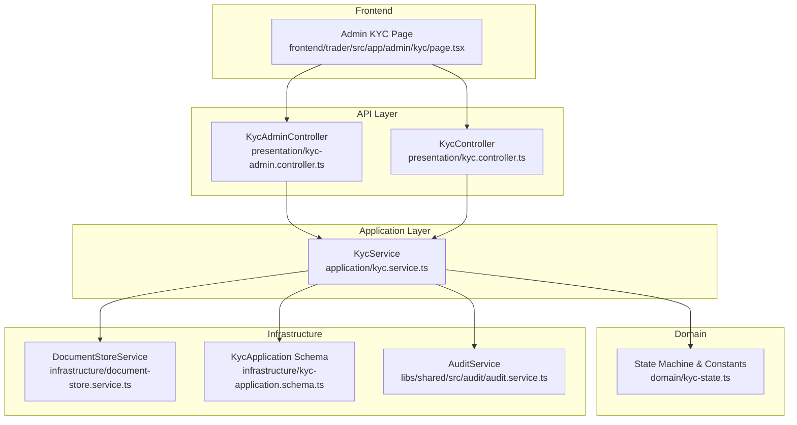
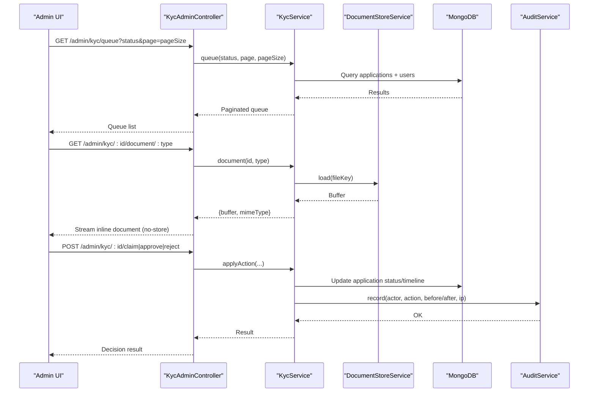
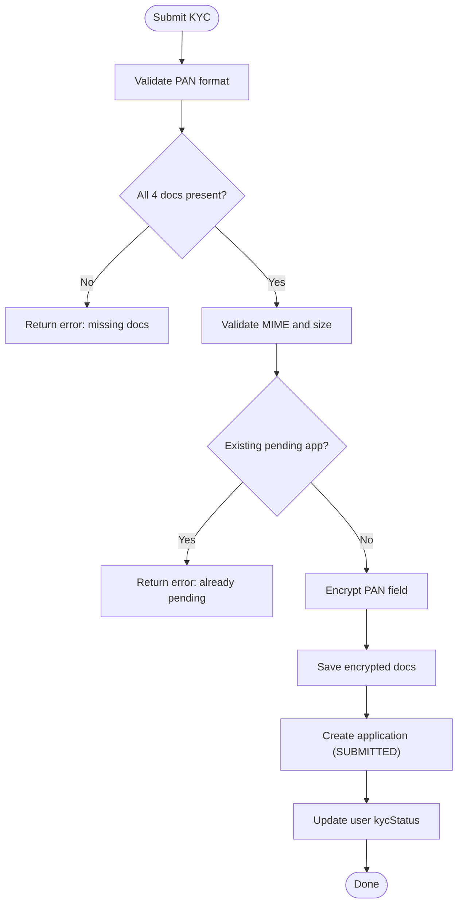
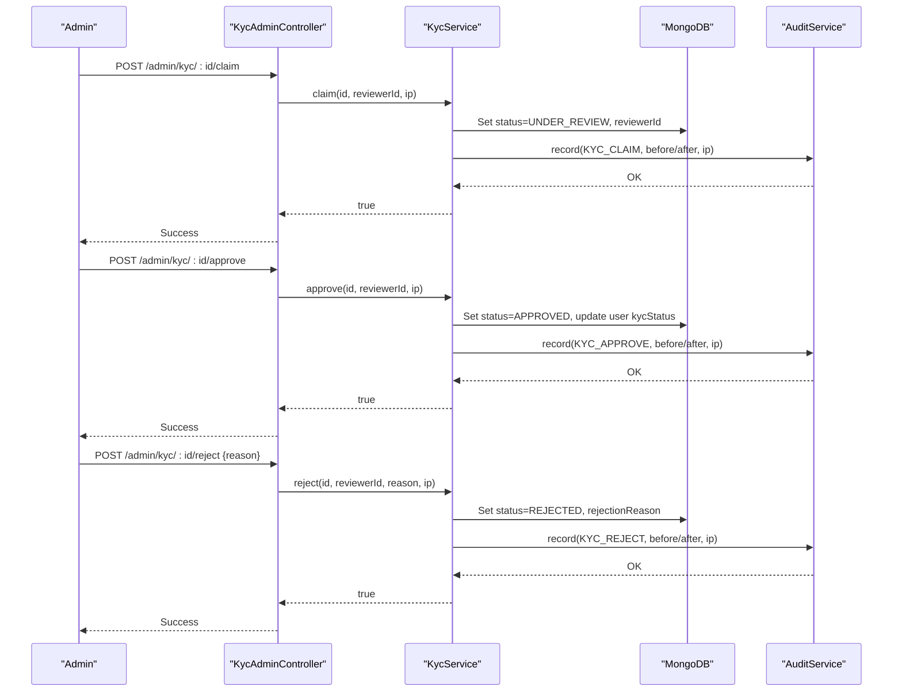
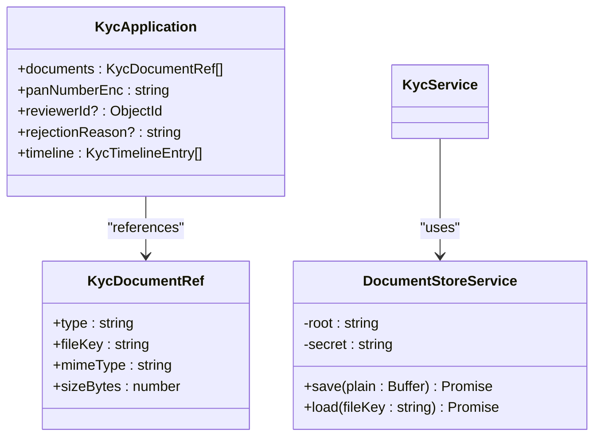
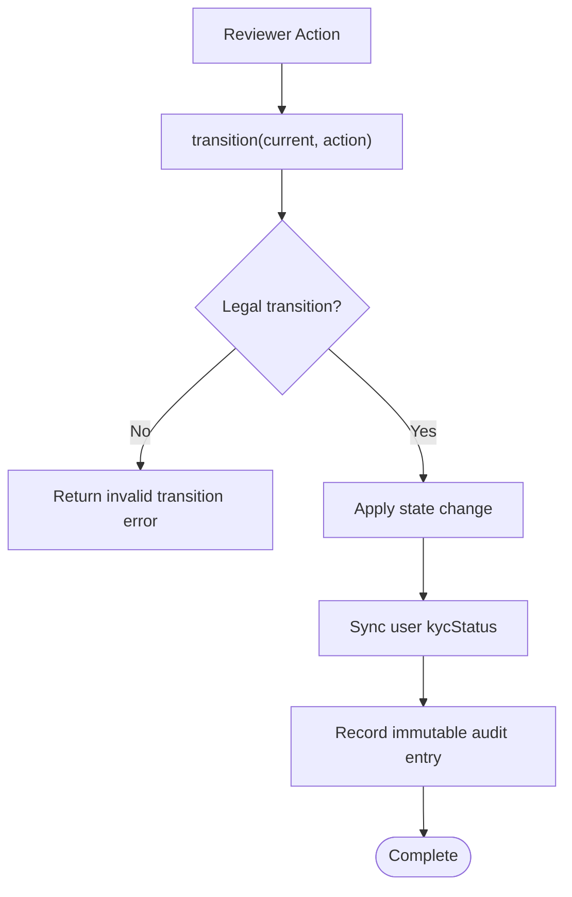
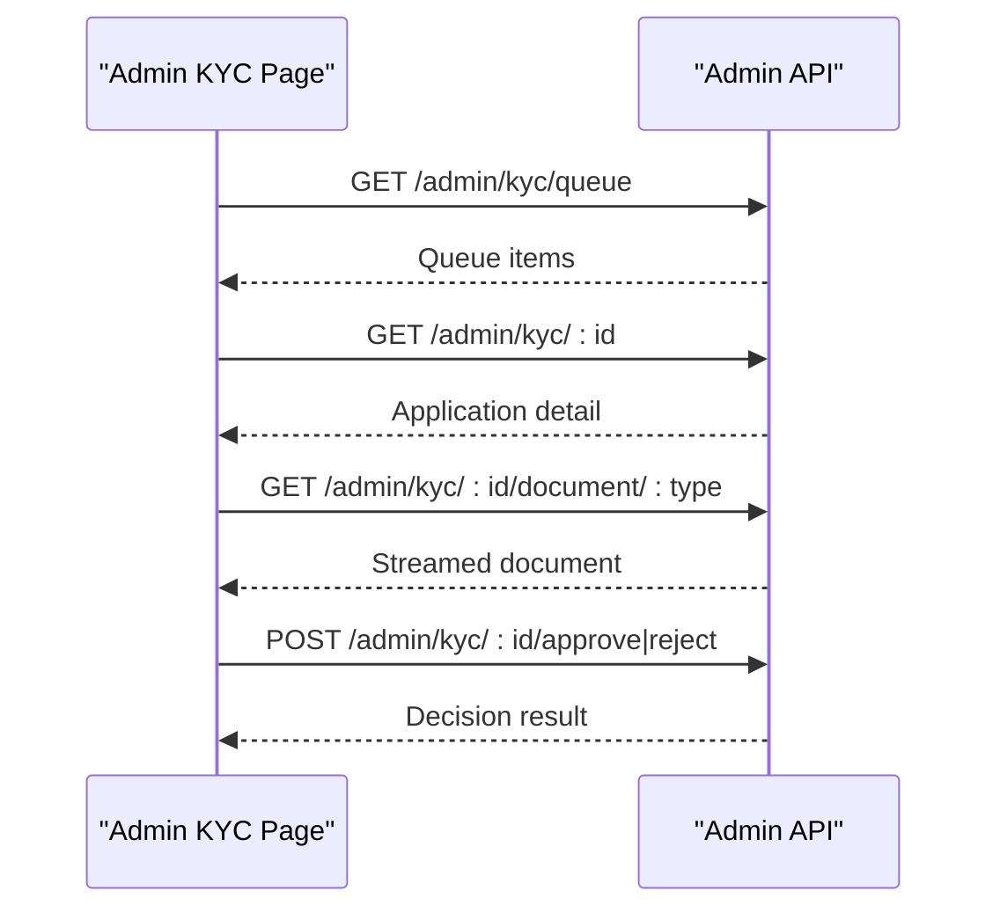
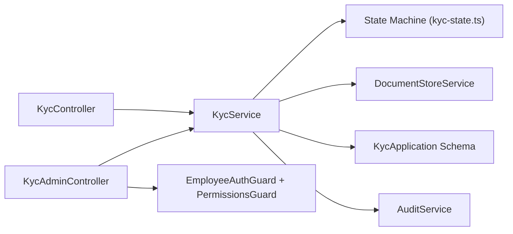

# KYC Administration

<cite>
**Referenced Files in This Document**
- [kyc.module.ts](file://backend/apps/api/src/modules/kyc/kyc.module.ts)
- [kyc-admin.controller.ts](file://backend/apps/api/src/modules/kyc/presentation/kyc-admin.controller.ts)
- [kyc.service.ts](file://backend/apps/api/src/modules/kyc/application/kyc.service.ts)
- [kyc-state.ts](file://backend/apps/api/src/modules/kyc/domain/kyc-state.ts)
- [document-store.service.ts](file://backend/apps/api/src/modules/kyc/infrastructure/document-store.service.ts)
- [kyc-application.schema.ts](file://backend/apps/api/src/modules/kyc/infrastructure/kyc-application.schema.ts)
- [kyc.dtos.ts](file://backend/apps/api/src/modules/kyc/presentation/dto/kyc.dtos.ts)
- [audit.service.ts](file://backend/libs/shared/src/audit/audit.service.ts)
- [audit-log.schema.ts](file://backend/libs/shared/src/audit/audit-log.schema.ts)
- [page.tsx](file://frontend/trader/src/app/admin/kyc/page.tsx)
- [P2-kyc-admin.md](file://docs/P2-kyc-admin.md)
</cite>

## Table of Contents
1. [Introduction](#introduction)
2. [Project Structure](#project-structure)
3. [Core Components](#core-components)
4. [Architecture Overview](#architecture-overview)
5. [Detailed Component Analysis](#detailed-component-analysis)
6. [Dependency Analysis](#dependency-analysis)
7. [Performance Considerations](#performance-considerations)
8. [Troubleshooting Guide](#troubleshooting-guide)
9. [Conclusion](#conclusion)
10. [Appendices](#appendices)

## Introduction
This document describes the KYC administration interface and backend workflows for verifying user identity documents, managing approvals and rejections, tracking status, and maintaining compliance through audit logging. It covers:
- User verification workflow from submission to review and decision
- Document storage management with encrypted at-rest storage and secure streaming previews
- Compliance checking via state machine transitions and validation rules
- Admin queue, claim, approve/reject operations, and status synchronization
- Audit logging for all reviewer actions
- Frontend admin UI for reviewing applications
- Notes on bulk processing, notifications, external integrations, and regulatory reporting based on available code

## Project Structure
The KYC feature is implemented as a NestJS module following Clean Architecture principles:
- Domain: state machine and constants
- Application: business logic (submission, review, status updates)
- Infrastructure: Mongoose schemas and encrypted document store
- Presentation: REST controllers for user and admin endpoints
- Shared: audit service for immutable audit logs
- Frontend: Next.js admin page for KYC queue and detail view

**Diagram sources**
- [kyc-admin.controller.ts:27-79](file://backend/apps/api/src/modules/kyc/presentation/kyc-admin.controller.ts#L27-L79)
- [kyc.service.ts:29-189](file://backend/apps/api/src/modules/kyc/application/kyc.service.ts#L29-L189)
- [kyc-state.ts:3-34](file://backend/apps/api/src/modules/kyc/domain/kyc-state.ts#L3-L34)
- [document-store.service.ts:13-36](file://backend/apps/api/src/modules/kyc/infrastructure/document-store.service.ts#L13-L36)
- [kyc-application.schema.ts:38-70](file://backend/apps/api/src/modules/kyc/infrastructure/kyc-application.schema.ts#L38-L70)
- [audit.service.ts:23-44](file://backend/libs/shared/src/audit/audit.service.ts#L23-L44)

**Section sources**
- [kyc.module.ts:1-25](file://backend/apps/api/src/modules/kyc/kyc.module.ts#L1-L25)
- [P2-kyc-admin.md:17-22](file://docs/P2-kyc-admin.md#L17-L22)

## Core Components
- KycService: Central business logic for submission, queue retrieval, detail retrieval, document streaming, and reviewer actions (claim, approve, reject). Enforces validation, state transitions, and audit recording.
- KycAdminController: Exposes admin endpoints for queue, detail, document streaming, and reviewer actions with RBAC guards.
- KycController: Exposes user-facing endpoints for status and submission.
- DocumentStoreService: Encrypted-at-rest file storage using AES-256-GCM; safe read/write with path traversal protection.
- State Machine (kyc-state.ts): Pure function enforcing legal transitions SUBMITTED → UNDER_REVIEW → APPROVED | REJECTED.
- AuditService: Immutable audit log writer with read helpers; failures do not block business operations.
- Schemas: KycApplication stores application data, documents, timeline, and reviewer binding.

Key responsibilities:
- Validation: PAN format, required documents, MIME types, size limits
- Security: Field encryption for PAN, encrypted document blobs, no-cache headers for document streaming
- Concurrency control: Claiming binds a reviewer; prevents concurrent conflicting actions
- Status sync: Updates user-level KYC status on decisions
- Audit: Records before/after states and actor details

**Section sources**
- [kyc.service.ts:29-189](file://backend/apps/api/src/modules/kyc/application/kyc.service.ts#L29-L189)
- [kyc-admin.controller.ts:27-79](file://backend/apps/api/src/modules/kyc/presentation/kyc-admin.controller.ts#L27-L79)
- [kyc-state.ts:3-34](file://backend/apps/api/src/modules/kyc/domain/kyc-state.ts#L3-L34)
- [document-store.service.ts:13-36](file://backend/apps/api/src/modules/kyc/infrastructure/document-store.service.ts#L13-L36)
- [audit.service.ts:23-44](file://backend/libs/shared/src/audit/audit.service.ts#L23-L44)
- [kyc-application.schema.ts:38-70](file://backend/apps/api/src/modules/kyc/infrastructure/kyc-application.schema.ts#L38-L70)

## Architecture Overview
The KYC admin flow uses a layered architecture with strict separation of concerns:
- Controllers handle HTTP requests, enforce authentication and permissions
- Service layer implements domain rules and orchestrates infrastructure
- Domain defines pure state transitions and constants
- Infrastructure provides persistence and secure storage
- Audit subsystem records immutable logs for compliance

**Diagram sources**
- [kyc-admin.controller.ts:32-78](file://backend/apps/api/src/modules/kyc/presentation/kyc-admin.controller.ts#L32-L78)
- [kyc.service.ts:113-189](file://backend/apps/api/src/modules/kyc/application/kyc.service.ts#L113-L189)
- [document-store.service.ts:23-36](file://backend/apps/api/src/modules/kyc/infrastructure/document-store.service.ts#L23-L36)
- [audit.service.ts:29-44](file://backend/libs/shared/src/audit/audit.service.ts#L29-L44)

## Detailed Component Analysis

### User Verification Workflow
- Submission requires PAN and four documents (PAN, ID proof, address proof, selfie), each validated for MIME type and size limit.
- On success, an application is created with status SUBMITTED and user kycStatus updated accordingly.
- A partial unique index ensures only one live application per user.

**Diagram sources**
- [kyc.service.ts:55-109](file://backend/apps/api/src/modules/kyc/application/kyc.service.ts#L55-L109)
- [kyc-state.ts:30-34](file://backend/apps/api/src/modules/kyc/domain/kyc-state.ts#L30-L34)
- [kyc-application.schema.ts:67-70](file://backend/apps/api/src/modules/kyc/infrastructure/kyc-application.schema.ts#L67-L70)

**Section sources**
- [kyc.service.ts:55-109](file://backend/apps/api/src/modules/kyc/application/kyc.service.ts#L55-L109)
- [kyc-state.ts:30-34](file://backend/apps/api/src/modules/kyc/domain/kyc-state.ts#L30-L34)
- [kyc-application.schema.ts:67-70](file://backend/apps/api/src/modules/kyc/infrastructure/kyc-application.schema.ts#L67-L70)

### Reviewer Actions: Claim, Approve, Reject
- Claim: Moves application to UNDER_REVIEW and binds reviewerId to prevent conflicts.
- Approve: Moves to APPROVED and sets user kycStatus to APPROVED.
- Reject: Moves to REJECTED, stores rejection reason, and sets user kycStatus to REJECTED.
- Each action writes an immutable audit entry with before/after states and IP.

**Diagram sources**
- [kyc-admin.controller.ts:57-78](file://backend/apps/api/src/modules/kyc/presentation/kyc-admin.controller.ts#L57-L78)
- [kyc.service.ts:140-189](file://backend/apps/api/src/modules/kyc/application/kyc.service.ts#L140-L189)
- [audit.service.ts:29-44](file://backend/libs/shared/src/audit/audit.service.ts#L29-L44)

**Section sources**
- [kyc-admin.controller.ts:57-78](file://backend/apps/api/src/modules/kyc/presentation/kyc-admin.controller.ts#L57-L78)
- [kyc.service.ts:140-189](file://backend/apps/api/src/modules/kyc/application/kyc.service.ts#L140-L189)

### Document Storage Management and Image Preview
- Documents are stored as AES-256-GCM encrypted blobs under STORAGE_DIR/kyc with opaque UUID paths.
- Reading enforces path normalization and blocks traversal attacks.
- Admin endpoint streams decrypted content inline with no-store cache headers to protect sensitive identity documents.

**Diagram sources**
- [document-store.service.ts:13-36](file://backend/apps/api/src/modules/kyc/infrastructure/document-store.service.ts#L13-L36)
- [kyc-application.schema.ts:5-19](file://backend/apps/api/src/modules/kyc/infrastructure/kyc-application.schema.ts#L5-L19)
- [kyc.service.ts:88-96](file://backend/apps/api/src/modules/kyc/application/kyc.service.ts#L88-L96)

**Section sources**
- [document-store.service.ts:13-36](file://backend/apps/api/src/modules/kyc/infrastructure/document-store.service.ts#L13-L36)
- [kyc-admin.controller.ts:44-55](file://backend/apps/api/src/modules/kyc/presentation/kyc-admin.controller.ts#L44-L55)
- [kyc-application.schema.ts:5-19](file://backend/apps/api/src/modules/kyc/infrastructure/kyc-application.schema.ts#L5-L19)

### Compliance Checking Tools
- State machine enforces legal transitions; illegal actions return errors.
- Input validation includes PAN regex, required documents, MIME allowlist, and size limits.
- Partial unique index prevents multiple live applications per user.
- Audit entries capture before/after states for every reviewer action.

**Diagram sources**
- [kyc-state.ts:12-28](file://backend/apps/api/src/modules/kyc/domain/kyc-state.ts#L12-L28)
- [kyc.service.ts:152-189](file://backend/apps/api/src/modules/kyc/application/kyc.service.ts#L152-L189)
- [audit.service.ts:29-44](file://backend/libs/shared/src/audit/audit.service.ts#L29-L44)

**Section sources**
- [kyc-state.ts:12-28](file://backend/apps/api/src/modules/kyc/domain/kyc-state.ts#L12-L28)
- [kyc.service.ts:152-189](file://backend/apps/api/src/modules/kyc/application/kyc.service.ts#L152-L189)

### Frontend Admin Interface
- The admin KYC page displays tabs for pending, review, approved, and rejected statuses.
- Selecting an applicant opens a side panel with user details and document links.
- Approve and Reject buttons trigger corresponding admin actions.

**Diagram sources**
- [page.tsx:19-127](file://frontend/trader/src/app/admin/kyc/page.tsx#L19-L127)
- [kyc-admin.controller.ts:32-78](file://backend/apps/api/src/modules/kyc/presentation/kyc-admin.controller.ts#L32-L78)

**Section sources**
- [page.tsx:19-127](file://frontend/trader/src/app/admin/kyc/page.tsx#L19-L127)

### Bulk Processing Features
- No explicit bulk endpoints or batch operations were found in the KYC module.
- The queue supports pagination and filtering by status, enabling efficient manual review workflows.

[No sources needed since this section summarizes availability without analyzing specific files]

### Notification Systems
- No KYC-specific notification logic was found in the KYC module.
- SMS and mail sender interfaces exist in the auth module but are not wired into KYC decisions in the analyzed code.

[No sources needed since this section summarizes availability without analyzing specific files]

### Integration with External KYC Services
- No external KYC service integration was found in the KYC module.
- The current implementation focuses on internal document review and state management.

[No sources needed since this section summarizes availability without analyzing specific files]

### Manual Review Workflows
- Reviewers can claim applications to take ownership, then approve or reject with reasons.
- Claiming prevents other reviewers from acting on the same application until it reaches a terminal state.

**Section sources**
- [kyc.service.ts:140-189](file://backend/apps/api/src/modules/kyc/application/kyc.service.ts#L140-L189)

### Regulatory Compliance Reporting
- AuditService provides immutable logs with actor, action, entity, before/after snapshots, and IP.
- These logs support compliance reporting and auditing of reviewer decisions.

**Section sources**
- [audit.service.ts:29-44](file://backend/libs/shared/src/audit/audit.service.ts#L29-L44)
- [audit-log.schema.ts:6-41](file://backend/libs/shared/src/audit/audit-log.schema.ts#L6-L41)

## Dependency Analysis

**Diagram sources**
- [kyc-admin.controller.ts:27-79](file://backend/apps/api/src/modules/kyc/presentation/kyc-admin.controller.ts#L27-L79)
- [kyc.service.ts:29-189](file://backend/apps/api/src/modules/kyc/application/kyc.service.ts#L29-L189)
- [kyc-state.ts:3-34](file://backend/apps/api/src/modules/kyc/domain/kyc-state.ts#L3-L34)
- [document-store.service.ts:13-36](file://backend/apps/api/src/modules/kyc/infrastructure/document-store.service.ts#L13-L36)
- [kyc-application.schema.ts:38-70](file://backend/apps/api/src/modules/kyc/infrastructure/kyc-application.schema.ts#L38-L70)
- [audit.service.ts:23-44](file://backend/libs/shared/src/audit/audit.service.ts#L23-L44)

**Section sources**
- [kyc.module.ts:12-23](file://backend/apps/api/src/modules/kyc/kyc.module.ts#L12-L23)

## Performance Considerations
- Pagination and filtering on queue reduce payload sizes and improve responsiveness.
- Streaming document responses avoid loading entire files into memory on the client.
- Encrypted storage adds CPU overhead for encryption/decryption; ensure adequate resources.
- Audit writes are fire-and-forget to avoid blocking business operations; monitor audit write failures.

[No sources needed since this section provides general guidance]

## Troubleshooting Guide
Common issues and resolutions:
- Invalid PAN format: Ensure PAN matches required pattern during submission.
- Missing documents: All four document types must be provided; check upload fields.
- File too large or unsupported MIME: Enforce size limit and allowed MIME types.
- Already pending application: Only one live application per user; resolve existing submissions first.
- Claim conflict: Another reviewer has claimed the application; wait or coordinate within team.
- Invalid state transition: Attempting illegal action on current state; follow correct workflow.
- Audit write failure: Business operation continues; investigate audit subsystem health.

**Section sources**
- [kyc.service.ts:55-109](file://backend/apps/api/src/modules/kyc/application/kyc.service.ts#L55-L109)
- [kyc.service.ts:152-189](file://backend/apps/api/src/modules/kyc/application/kyc.service.ts#L152-L189)
- [audit.service.ts:29-44](file://backend/libs/shared/src/audit/audit.service.ts#L29-L44)

## Conclusion
The KYC administration system provides a robust, compliant workflow for verifying user identities with strong security controls, clear state transitions, and comprehensive audit logging. Administrators can efficiently review applications, manage document access securely, and make decisions that propagate to user status. While bulk processing and notifications are not implemented in the analyzed code, the modular design allows future extensions for those capabilities.

[No sources needed since this section summarizes without analyzing specific files]

## Appendices

### Admin API Reference
- GET /admin/kyc/queue?status=&page=&pageSize= — List applications with optional status filter and pagination
- GET /admin/kyc/:id — Full application detail including user info
- GET /admin/kyc/:id/document/:type — Stream decrypted document inline (no-store)
- POST /admin/kyc/:id/claim — Claim application for review
- POST /admin/kyc/:id/approve — Approve application
- POST /admin/kyc/:id/reject {reason} — Reject application with reason

**Section sources**
- [kyc-admin.controller.ts:32-78](file://backend/apps/api/src/modules/kyc/presentation/kyc-admin.controller.ts#L32-L78)
- [P2-kyc-admin.md:32-40](file://docs/P2-kyc-admin.md#L32-L40)

### Environment Variables
- DATA_ENC_SECRET — Encryption key for at-rest data (KYC docs, PAN)
- STORAGE_DIR — Root directory for encrypted document storage

**Section sources**
- [P2-kyc-admin.md:52-55](file://docs/P2-kyc-admin.md#L52-L55)