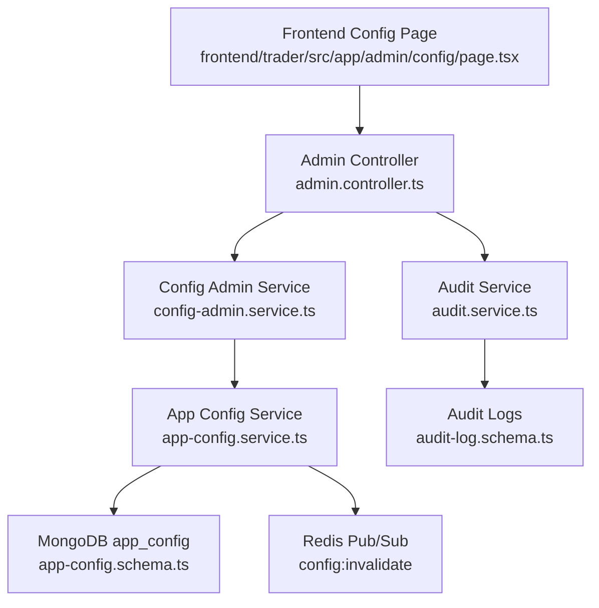
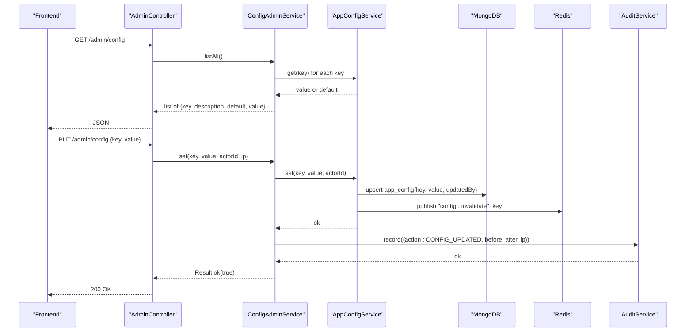
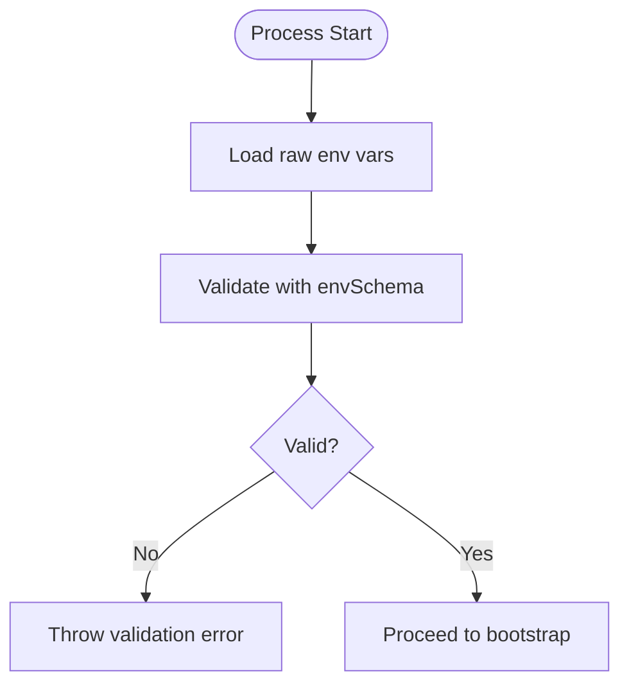
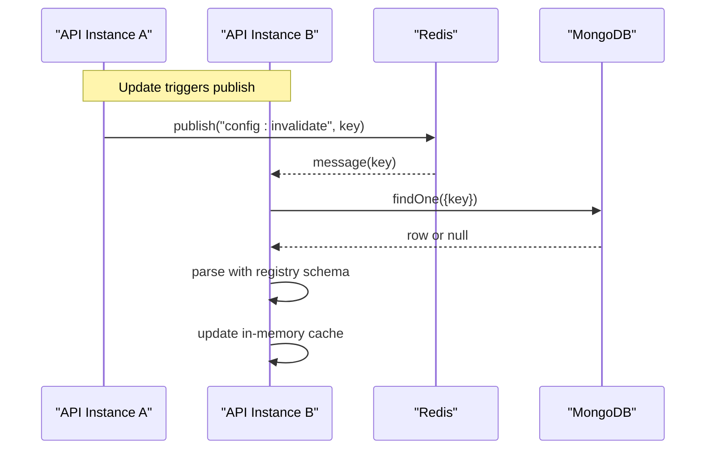
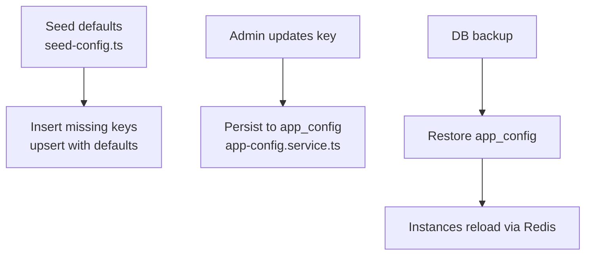
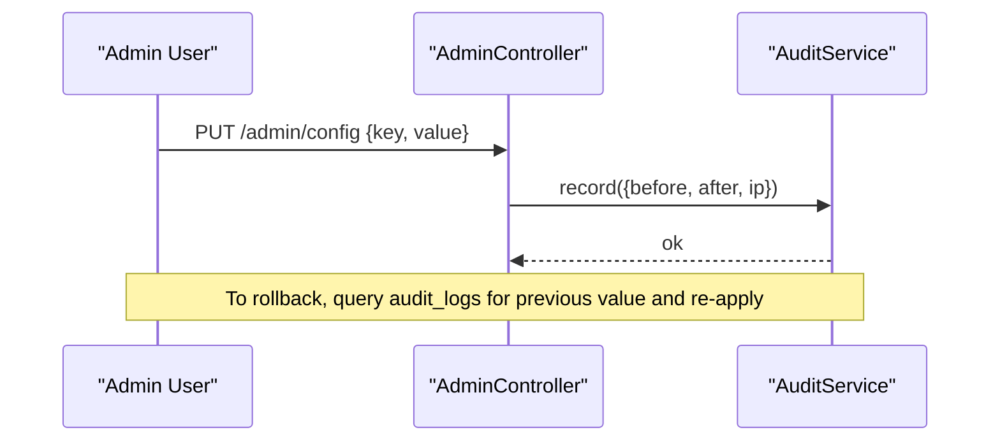
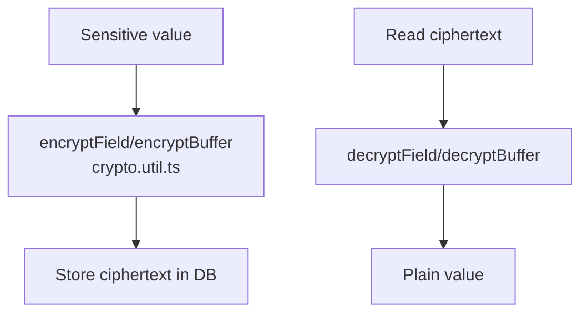
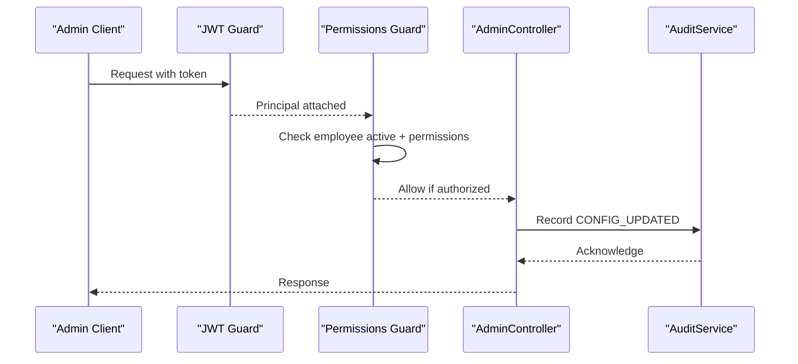
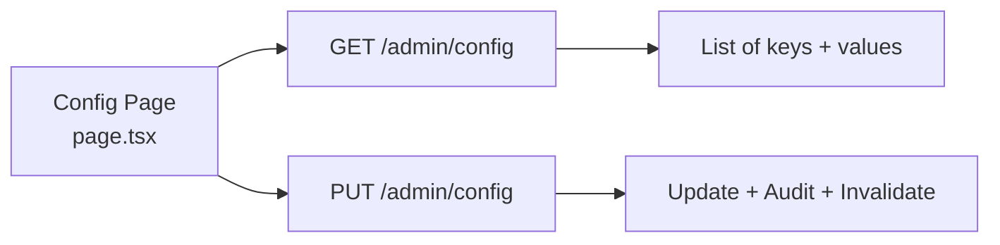
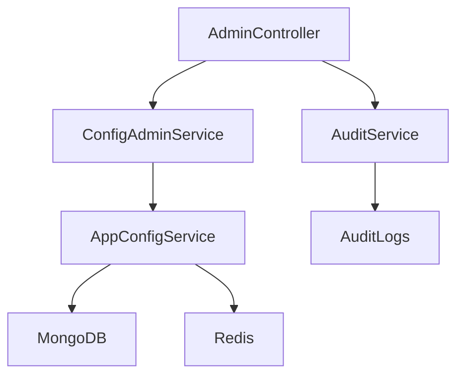

# System Configuration Panel

<cite>
**Referenced Files in This Document**
- [app-config.service.ts](file://backend/libs/shared/src/config/app-config.service.ts)
- [app-config.schema.ts](file://backend/libs/shared/src/config/app-config.schema.ts)
- [config-keys.ts](file://backend/libs/shared/src/config/config-keys.ts)
- [env.schema.ts](file://backend/libs/shared/src/config/env.schema.ts)
- [config-admin.service.ts](file://backend/apps/api/src/modules/admin/application/config-admin.service.ts)
- [admin.controller.ts](file://backend/apps/api/src/modules/admin/presentation/admin.controller.ts)
- [permissions.guard.ts](file://backend/apps/api/src/modules/admin/presentation/permissions.guard.ts)
- [audit.service.ts](file://backend/libs/shared/src/audit/audit.service.ts)
- [audit-log.schema.ts](file://backend/libs/shared/src/audit/audit-log.schema.ts)
- [crypto.util.ts](file://backend/apps/api/src/modules/auth/infrastructure/crypto.util.ts)
- [seed-config.ts](file://backend/scripts/seed-config.ts)
- [page.tsx](file://frontend/trader/src/app/admin/config/page.tsx)
</cite>

## Table of Contents
1. Introduction
2. Project Structure
3. Core Components
4. Architecture Overview
5. Detailed Component Analysis
6. Dependency Analysis
7. Performance Considerations
8. Troubleshooting Guide
9. Conclusion

## Introduction
This document explains the system configuration panel and its backend services that manage runtime configuration for application settings, broker integrations, payment providers, and feature flags. It covers schema validation, environment variable management, hot-reloading across instances, backup/restore via database persistence, versioning through audit logs, rollback strategies, security for sensitive values, access controls, and auditing of all changes.

## Project Structure
The configuration system spans shared libraries (configuration schemas, registry, service), API admin endpoints (controllers and services), and a frontend admin page. The key pieces are:
- Environment configuration validated at boot
- Business configuration registry with per-key schemas and defaults
- A DB-backed, cache-first configuration service with Redis pub/sub for hot reload
- Admin API to list and update configuration with permission checks and audit logging
- Frontend admin UI for viewing grouped configuration keys



**Diagram sources**
- [page.tsx:1-55](file://frontend/trader/src/app/admin/config/page.tsx#L1-L55)
- [admin.controller.ts:147-159](file://backend/apps/api/src/modules/admin/presentation/admin.controller.ts#L147-L159)
- [config-admin.service.ts:1-37](file://backend/apps/api/src/modules/admin/application/config-admin.service.ts#L1-L37)
- [app-config.service.ts:1-87](file://backend/libs/shared/src/config/app-config.service.ts#L1-L87)
- [app-config.schema.ts:1-19](file://backend/libs/shared/src/config/app-config.schema.ts#L1-L19)
- [audit.service.ts:1-45](file://backend/libs/shared/src/audit/audit.service.ts#L1-L45)
- [audit-log.schema.ts:1-41](file://backend/libs/shared/src/audit/audit-log.schema.ts#L1-L41)

**Section sources**
- [page.tsx:1-55](file://frontend/trader/src/app/admin/config/page.tsx#L1-L55)
- [admin.controller.ts:147-159](file://backend/apps/api/src/modules/admin/presentation/admin.controller.ts#L147-L159)
- [config-admin.service.ts:1-37](file://backend/apps/api/src/modules/admin/application/config-admin.service.ts#L1-L37)
- [app-config.service.ts:1-87](file://backend/libs/shared/src/config/app-config.service.ts#L1-L87)
- [app-config.schema.ts:1-19](file://backend/libs/shared/src/config/app-config.schema.ts#L1-L19)
- [audit.service.ts:1-45](file://backend/libs/shared/src/audit/audit.service.ts#L1-L45)
- [audit-log.schema.ts:1-41](file://backend/libs/shared/src/audit/audit-log.schema.ts#L1-L41)

## Core Components
- Environment configuration: Validated at startup using a strict schema; process refuses to start on invalid values. Covers ports, databases, secrets, provider toggles, and integration credentials.
- Business configuration registry: Centralized list of configurable keys with per-key Zod schemas, defaults, and descriptions. Includes market windows, trading parameters, challenge rules, statement ranges, feed thresholds, and authentication token lifetimes.
- App config service: In-memory cache with DB persistence and Redis-based hot reload. Reads are synchronous after boot; writes validate against the key’s schema, persist, and broadcast invalidation.
- Admin API: Endpoints to list and set configuration, guarded by permissions and authenticated requests. Updates are audited with before/after snapshots.
- Audit subsystem: Immutable audit log entries capturing actor, action, entity, before/after values, and IP.
- Security utilities: AES-256-GCM encryption for sensitive fields and buffers, used for secrets and documents.

**Section sources**
- [env.schema.ts:1-84](file://backend/libs/shared/src/config/env.schema.ts#L1-L84)
- [config-keys.ts:1-107](file://backend/libs/shared/src/config/config-keys.ts#L1-L107)
- [app-config.service.ts:1-87](file://backend/libs/shared/src/config/app-config.service.ts#L1-L87)
- [config-admin.service.ts:1-37](file://backend/apps/api/src/modules/admin/application/config-admin.service.ts#L1-L37)
- [audit.service.ts:1-45](file://backend/libs/shared/src/audit/audit.service.ts#L1-L45)
- [crypto.util.ts:1-43](file://backend/apps/api/src/modules/auth/infrastructure/crypto.util.ts#L1-L43)

## Architecture Overview
The configuration panel follows a layered architecture:
- Presentation: Admin controller exposes REST endpoints under /admin/config.
- Application: ConfigAdminService orchestrates listing and updating configuration, enforcing allowed keys and auditing changes.
- Domain/Shared: AppConfigService provides a typed, validated, cached view of configuration with hot reload via Redis pub/sub.
- Infrastructure: MongoDB stores persisted overrides; Redis handles cross-instance invalidation; AuditService persists immutable change logs.



**Diagram sources**
- [admin.controller.ts:147-159](file://backend/apps/api/src/modules/admin/presentation/admin.controller.ts#L147-L159)
- [config-admin.service.ts:12-36](file://backend/apps/api/src/modules/admin/application/config-admin.service.ts#L12-L36)
- [app-config.service.ts:40-60](file://backend/libs/shared/src/config/app-config.service.ts#L40-L60)
- [audit.service.ts:29-35](file://backend/libs/shared/src/audit/audit.service.ts#L29-L35)

## Detailed Component Analysis

### Environment Configuration Management
- Boot-time validation: A strict schema validates required and optional environment variables, including ports, database URIs, JWT keys, encryption secret, storage directory, OTP pepper, SMS/mail providers, market feed provider, and payment provider credentials. Conditional logic enforces provider-specific requirements.
- Fail-fast behavior: Invalid environment configuration throws an error during validation, preventing the process from starting.
- Scope: This layer is for infrastructure-level settings only; business numbers belong to the business configuration registry.



**Diagram sources**
- [env.schema.ts:1-84](file://backend/libs/shared/src/config/env.schema.ts#L1-L84)

**Section sources**
- [env.schema.ts:1-84](file://backend/libs/shared/src/config/env.schema.ts#L1-L84)

### Business Configuration Registry and Schema Validation
- Central registry: All business configuration keys are declared with their Zod schema, default value, and human-readable description. Examples include market trading windows, auto square-off times, slippage, charges model, watchlist limits, challenge rules, statement ranges, stale feed alerts, and authentication token TTLs.
- Type safety: Consumers use typed keys and values inferred from the registry, ensuring compile-time correctness.
- Validation on write: Every update is validated against the key’s schema before persistence.

```mermaid
classDiagram
class ConfigRegistry {
+map<string, {schema, default, description}>
}
class AppConfigService {
-cache Map<string, unknown>
+get(key) ConfigValue
+set(key, value, updatedBy) Promise<void>
-reloadAll() Promise<void>
-reloadKey(key) Promise<void>
}
ConfigRegistry <.. AppConfigService : "uses for validation & defaults"
```

**Diagram sources**
- [config-keys.ts:1-107](file://backend/libs/shared/src/config/config-keys.ts#L1-L107)
- [app-config.service.ts:1-87](file://backend/libs/shared/src/config/app-config.service.ts#L1-L87)

**Section sources**
- [config-keys.ts:1-107](file://backend/libs/shared/src/config/config-keys.ts#L1-L107)
- [app-config.service.ts:40-60](file://backend/libs/shared/src/config/app-config.service.ts#L40-L60)

### Hot-Reloading Across Instances
- Cache-first reads: After module initialization, all configured keys are loaded into memory for fast reads.
- Redis pub/sub invalidation: On update, the service publishes the changed key to a dedicated channel. Subscribers reload the specific key from the database and refresh their caches.
- Graceful fallback: Unknown keys are ignored safely; invalid stored values fall back to defaults with warnings.



**Diagram sources**
- [app-config.service.ts:29-38](file://backend/libs/shared/src/config/app-config.service.ts#L29-L38)
- [app-config.service.ts:47-60](file://backend/libs/shared/src/config/app-config.service.ts#L47-L60)
- [app-config.service.ts:62-86](file://backend/libs/shared/src/config/app-config.service.ts#L62-L86)

**Section sources**
- [app-config.service.ts:29-38](file://backend/libs/shared/src/config/app-config.service.ts#L29-L38)
- [app-config.service.ts:47-60](file://backend/libs/shared/src/config/app-config.service.ts#L47-L60)
- [app-config.service.ts:62-86](file://backend/libs/shared/src/config/app-config.service.ts#L62-L86)

### Backup and Restore Functionality
- Persistence: All business configuration overrides are stored in the app_config collection with timestamps and updatedBy metadata.
- Seeding: A script inserts registry defaults without overwriting existing admin-tuned values, making it safe to re-run.
- Backup strategy: Since configuration is DB-backed, standard database backups capture current state. Restore involves restoring the app_config collection from backups.



**Diagram sources**
- [seed-config.ts:1-28](file://backend/scripts/seed-config.ts#L1-L28)
- [app-config.service.ts:47-60](file://backend/libs/shared/src/config/app-config.service.ts#L47-L60)

**Section sources**
- [seed-config.ts:1-28](file://backend/scripts/seed-config.ts#L1-L28)
- [app-config.service.ts:47-60](file://backend/libs/shared/src/config/app-config.service.ts#L47-L60)

### Configuration Versioning and Rollback Mechanisms
- Versioning via audit logs: Each configuration change records actor, action, entity, entityId, before/after values, and IP timestamped in audit_logs.
- Rollback approach: To revert a change, read the previous value from audit logs and reapply it via the same update flow. Because updates are validated against schemas, this ensures consistency.



**Diagram sources**
- [admin.controller.ts:147-159](file://backend/apps/api/src/modules/admin/presentation/admin.controller.ts#L147-L159)
- [audit.service.ts:29-35](file://backend/libs/shared/src/audit/audit.service.ts#L29-L35)
- [audit-log.schema.ts:1-41](file://backend/libs/shared/src/audit/audit-log.schema.ts#L1-L41)

**Section sources**
- [audit.service.ts:29-35](file://backend/libs/shared/src/audit/audit.service.ts#L29-L35)
- [audit-log.schema.ts:1-41](file://backend/libs/shared/src/audit/audit-log.schema.ts#L1-L41)

### Security Measures for Sensitive Configuration Values
- Encryption at rest: Sensitive values can be encrypted using AES-256-GCM field encryption utilities. Keys are derived from a secret pepper/context to ensure unique ciphertexts and tamper detection via auth tags.
- Environment secrets: Required secrets (JWT keys, data encryption secret, OTP pepper) are enforced at boot via environment schema validation.
- Access control: Admin endpoints require employee authentication and explicit permissions (e.g., config.manage).



**Diagram sources**
- [crypto.util.ts:1-43](file://backend/apps/api/src/modules/auth/infrastructure/crypto.util.ts#L1-L43)

**Section sources**
- [crypto.util.ts:1-43](file://backend/apps/api/src/modules/auth/infrastructure/crypto.util.ts#L1-L43)
- [env.schema.ts:21-32](file://backend/libs/shared/src/config/env.schema.ts#L21-L32)
- [permissions.guard.ts:13-41](file://backend/apps/api/src/modules/admin/presentation/permissions.guard.ts#L13-L41)

### Access Controls and Audit Logging
- Authentication and authorization: Admin routes are protected by JWT guard and a permissions guard that checks live employee status and role permissions.
- Audit trail: All configuration updates are recorded with before/after snapshots and IP addresses. Audit writes are non-blocking to avoid impacting business operations.



**Diagram sources**
- [admin.controller.ts:1-10](file://backend/apps/api/src/modules/admin/presentation/admin.controller.ts#L1-L10)
- [permissions.guard.ts:13-41](file://backend/apps/api/src/modules/admin/presentation/permissions.guard.ts#L13-L41)
- [audit.service.ts:29-35](file://backend/libs/shared/src/audit/audit.service.ts#L29-L35)

**Section sources**
- [permissions.guard.ts:13-41](file://backend/apps/api/src/modules/admin/presentation/permissions.guard.ts#L13-L41)
- [audit.service.ts:29-35](file://backend/libs/shared/src/audit/audit.service.ts#L29-L35)

### Frontend Configuration Panel
- Display: Groups configuration keys by category (Market, Trading, Challenge, Watchlist, Statements, Feed) and shows key, description, current value, and edit actions.
- Interaction: Edits trigger API calls to update configuration, which are then audited and hot-reloaded across instances.



**Diagram sources**
- [page.tsx:1-55](file://frontend/trader/src/app/admin/config/page.tsx#L1-L55)
- [admin.controller.ts:147-159](file://backend/apps/api/src/modules/admin/presentation/admin.controller.ts#L147-L159)

**Section sources**
- [page.tsx:1-55](file://frontend/trader/src/app/admin/config/page.tsx#L1-L55)
- [admin.controller.ts:147-159](file://backend/apps/api/src/modules/admin/presentation/admin.controller.ts#L147-L159)

## Dependency Analysis
- ConfigAdminService depends on AppConfigService for typed, validated configuration access and on AuditService for change logging.
- AppConfigService depends on MongoDB for persistence and Redis for cross-instance invalidation.
- AdminController enforces authentication and permissions before delegating to ConfigAdminService.
- Environment schema is independent and validated at boot to ensure infrastructure readiness.



**Diagram sources**
- [admin.controller.ts:147-159](file://backend/apps/api/src/modules/admin/presentation/admin.controller.ts#L147-L159)
- [config-admin.service.ts:1-37](file://backend/apps/api/src/modules/admin/application/config-admin.service.ts#L1-L37)
- [app-config.service.ts:1-87](file://backend/libs/shared/src/config/app-config.service.ts#L1-L87)
- [audit.service.ts:1-45](file://backend/libs/shared/src/audit/audit.service.ts#L1-L45)

**Section sources**
- [admin.controller.ts:147-159](file://backend/apps/api/src/modules/admin/presentation/admin.controller.ts#L147-L159)
- [config-admin.service.ts:1-37](file://backend/apps/api/src/modules/admin/application/config-admin.service.ts#L1-L37)
- [app-config.service.ts:1-87](file://backend/libs/shared/src/config/app-config.service.ts#L1-L87)
- [audit.service.ts:1-45](file://backend/libs/shared/src/audit/audit.service.ts#L1-L45)

## Performance Considerations
- Read path optimization: In-memory cache eliminates DB reads on the hot path after boot.
- Write path efficiency: Single upsert per key change; Redis publish triggers targeted reloads rather than full cache resets.
- Schema validation: Zod-based validation is lightweight and prevents invalid writes early.
- Audit writes: Non-blocking to avoid impacting user-facing operations.

[No sources needed since this section provides general guidance]

## Troubleshooting Guide
- Invalid environment configuration: If the process fails to start, check environment variables against the schema requirements and provider-specific conditions.
- Unknown config key errors: Ensure the key exists in the registry; unknown keys are rejected by design.
- Invalid value errors: Review the key’s schema constraints and correct the submitted value.
- Hot reload not applied: Verify Redis connectivity and subscription to the invalidation channel; confirm that the instance received the message and reloaded the key.
- Permission denied: Confirm the employee account is active and has the required permissions for configuration management.
- Audit log gaps: Audit writes are resilient; failures are logged but do not abort operations. Investigate storage issues if audit entries are missing.

**Section sources**
- [env.schema.ts:60-72](file://backend/libs/shared/src/config/env.schema.ts#L60-L72)
- [config-admin.service.ts:21-30](file://backend/apps/api/src/modules/admin/application/config-admin.service.ts#L21-L30)
- [app-config.service.ts:47-60](file://backend/libs/shared/src/config/app-config.service.ts#L47-L60)
- [permissions.guard.ts:26-41](file://backend/apps/api/src/modules/admin/presentation/permissions.guard.ts#L26-L41)
- [audit.service.ts:29-35](file://backend/libs/shared/src/audit/audit.service.ts#L29-L35)

## Conclusion
The system configuration panel provides a secure, validated, and auditable way to manage both infrastructure and business configuration. Environment variables are strictly validated at boot, while business configuration is centrally registered, persisted, and hot-reloaded across instances. Changes are protected by strong access controls and fully audited, enabling reliable versioning and rollback. Sensitive values are encrypted at rest, and the DB-backed design supports straightforward backup and restore workflows.

[No sources needed since this section summarizes without analyzing specific files]