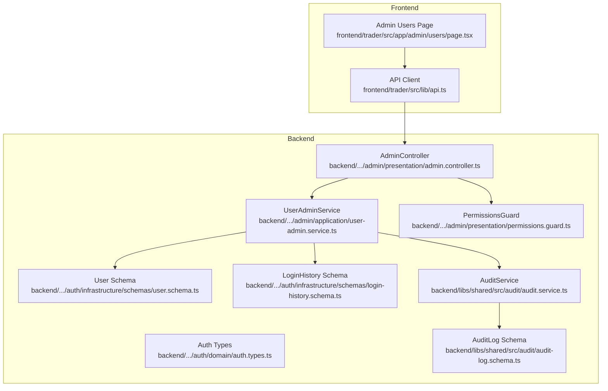
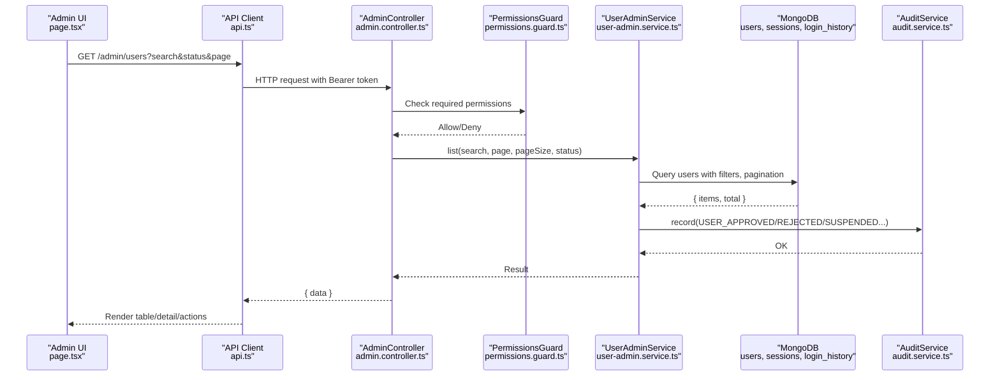
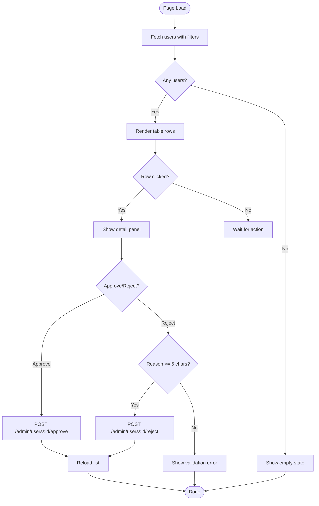
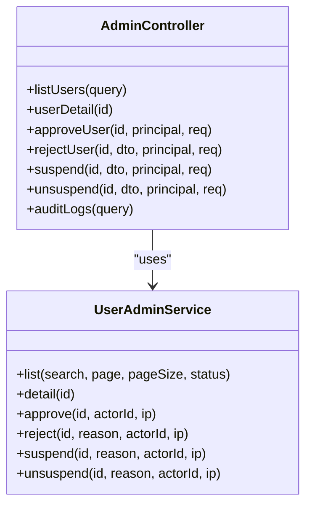
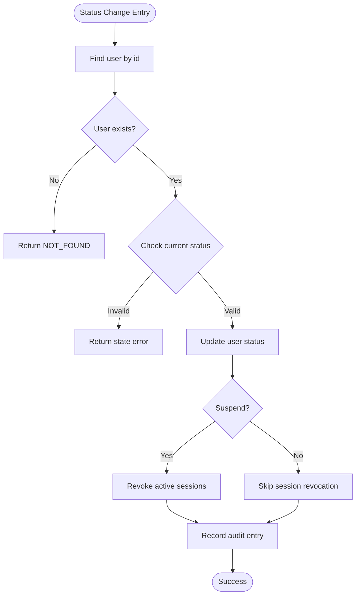
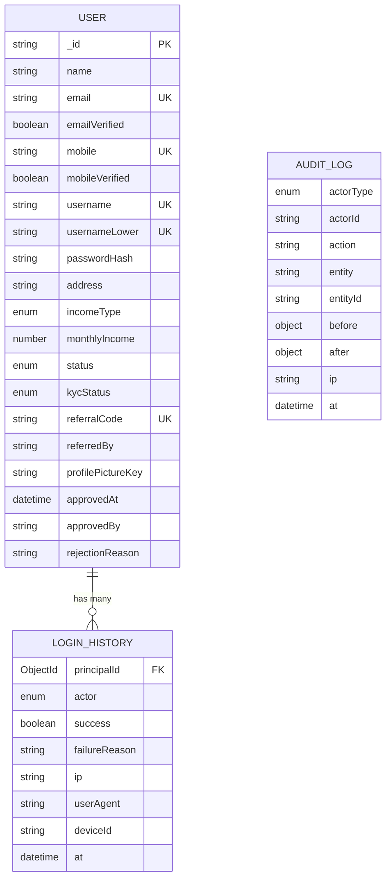
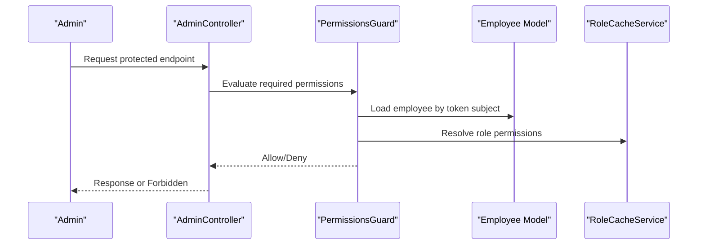
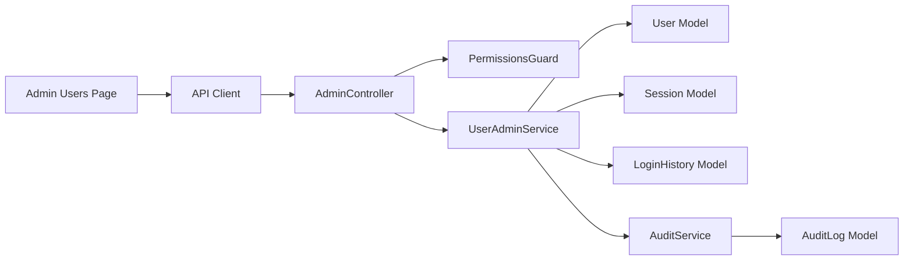

# User Management Interface

<cite>
**Referenced Files in This Document**
- [page.tsx](file://frontend/trader/src/app/admin/users/page.tsx)
- [api.ts](file://frontend/trader/src/lib/api.ts)
- [admin.controller.ts](file://backend/apps/api/src/modules/admin/presentation/admin.controller.ts)
- [user-admin.service.ts](file://backend/apps/api/src/modules/admin/application/user-admin.service.ts)
- [admin.dtos.ts](file://backend/apps/api/src/modules/admin/presentation/dto/admin.dtos.ts)
- [permissions.guard.ts](file://backend/apps/api/src/modules/admin/presentation/permissions.guard.ts)
- [auth.types.ts](file://backend/apps/api/src/modules/auth/domain/auth.types.ts)
- [user.schema.ts](file://backend/apps/api/src/modules/auth/infrastructure/schemas/user.schema.ts)
- [login-history.schema.ts](file://backend/apps/api/src/modules/auth/infrastructure/schemas/login-history.schema.ts)
- [audit.service.ts](file://backend/libs/shared/src/audit/audit.service.ts)
- [audit-log.schema.ts](file://backend/libs/shared/src/audit/audit-log.schema.ts)
</cite>

## Table of Contents
1. [Introduction](#introduction)
2. [Project Structure](#project-structure)
3. [Core Components](#core-components)
4. [Architecture Overview](#architecture-overview)
5. [Detailed Component Analysis](#detailed-component-analysis)
6. [Dependency Analysis](#dependency-analysis)
7. [Performance Considerations](#performance-considerations)
8. [Troubleshooting Guide](#troubleshooting-guide)
9. [Conclusion](#conclusion)
10. [Appendices](#appendices)

## Introduction
This document describes the user management interface within the admin dashboard. It covers the user listing table with search, filtering, and pagination; CRUD operations for user accounts including approval, rejection, suspension, and unsuspension; user activity monitoring via login history; role and permission management for administrators; and integration with backend APIs, data validation, error handling, and audit trail generation.

## Project Structure
The user management feature spans frontend pages and backend modules:
- Frontend: Admin users page renders a searchable, filterable, paginated table and actions to approve or reject pending registrations.
- Backend: Admin controller exposes endpoints for listing users, approving/rejecting/suspending users, and querying audit logs. Services implement business logic and interact with MongoDB schemas for users, sessions, and login history. Permissions are enforced via guards.

**Diagram sources**
- [page.tsx:1-291](file://frontend/trader/src/app/admin/users/page.tsx#L1-L291)
- [api.ts:1-148](file://frontend/trader/src/lib/api.ts#L1-L148)
- [admin.controller.ts:1-171](file://backend/apps/api/src/modules/admin/presentation/admin.controller.ts#L1-L171)
- [user-admin.service.ts:1-153](file://backend/apps/api/src/modules/admin/application/user-admin.service.ts#L1-L153)
- [permissions.guard.ts:1-42](file://backend/apps/api/src/modules/admin/presentation/permissions.guard.ts#L1-L42)
- [auth.types.ts:1-45](file://backend/apps/api/src/modules/auth/domain/auth.types.ts#L1-L45)
- [user.schema.ts:1-71](file://backend/apps/api/src/modules/auth/infrastructure/schemas/user.schema.ts#L1-L71)
- [login-history.schema.ts:1-33](file://backend/apps/api/src/modules/auth/infrastructure/schemas/login-history.schema.ts#L1-L33)
- [audit.service.ts:1-45](file://backend/libs/shared/src/audit/audit.service.ts#L1-L45)
- [audit-log.schema.ts:1-41](file://backend/libs/shared/src/audit/audit-log.schema.ts#L1-L41)

**Section sources**
- [page.tsx:1-291](file://frontend/trader/src/app/admin/users/page.tsx#L1-L291)
- [admin.controller.ts:1-171](file://backend/apps/api/src/modules/admin/presentation/admin.controller.ts#L1-L171)

## Core Components
- Admin Users Page (Frontend): Renders tabs for Pending Approval, Active, Rejected, All; supports search by name/email/mobile; displays user list with status badges; shows detail panel with approve/reject actions for pending users.
- Admin Controller (Backend): Exposes GET /admin/users (list), POST /admin/users/:id/approve, POST /admin/users/:id/reject, POST /admin/users/:id/suspend, POST /admin/users/:id/unsuspend, GET /admin/audit-logs.
- User Admin Service (Backend): Implements list with search/filter/pagination, user detail with active sessions and recent logins, approve/reject/suspend/unsuspend with audit logging.
- Permissions Guard (Backend): Enforces required permissions on admin endpoints using employee roles and deny-wins semantics.
- Schemas and Types: User model includes status, KYC, income fields; LoginHistory tracks login attempts; AuditLog records immutable audit trails.

**Section sources**
- [page.tsx:61-166](file://frontend/trader/src/app/admin/users/page.tsx#L61-L166)
- [admin.controller.ts:99-169](file://backend/apps/api/src/modules/admin/presentation/admin.controller.ts#L99-L169)
- [user-admin.service.ts:22-147](file://backend/apps/api/src/modules/admin/application/user-admin.service.ts#L22-L147)
- [permissions.guard.ts:13-41](file://backend/apps/api/src/modules/admin/presentation/permissions.guard.ts#L13-L41)
- [user.schema.ts:5-67](file://backend/apps/api/src/modules/auth/infrastructure/schemas/user.schema.ts#L5-L67)
- [login-history.schema.ts:4-33](file://backend/apps/api/src/modules/auth/infrastructure/schemas/login-history.schema.ts#L4-L33)
- [audit-log.schema.ts:6-41](file://backend/libs/shared/src/audit/audit-log.schema.ts#L6-L41)

## Architecture Overview
The admin user management flow is secured by JWT authentication and permission checks, then routed to services that perform database operations and emit audit events. The frontend uses a typed API client that attaches bearer tokens and handles errors uniformly.

**Diagram sources**
- [page.tsx:73-91](file://frontend/trader/src/app/admin/users/page.tsx#L73-L91)
- [api.ts:91-145](file://frontend/trader/src/lib/api.ts#L91-L145)
- [admin.controller.ts:101-145](file://backend/apps/api/src/modules/admin/presentation/admin.controller.ts#L101-L145)
- [permissions.guard.ts:26-41](file://backend/apps/api/src/modules/admin/presentation/permissions.guard.ts#L26-L41)
- [user-admin.service.ts:22-51](file://backend/apps/api/src/modules/admin/application/user-admin.service.ts#L22-L51)
- [audit.service.ts:29-43](file://backend/libs/shared/src/audit/audit.service.ts#L29-L43)

## Detailed Component Analysis

### Admin Users Page (Frontend)
- Tabs: Pending approval, Active, Rejected, All. Switching tabs resets selection and reloads data.
- Search: Debounced-like behavior via controlled input; submits query parameters to backend.
- List: Displays name, username, email, mobile, income, status badge, joined date. Click row to select and show details.
- Detail Panel: Shows full profile info, KYC status, join date, rejection reason if present. For pending approvals, provides Approve and Reject buttons with reason validation.
- Error Handling: Displays error banner from API errors; disables action buttons during processing.

**Diagram sources**
- [page.tsx:61-166](file://frontend/trader/src/app/admin/users/page.tsx#L61-L166)
- [page.tsx:93-126](file://frontend/trader/src/app/admin/users/page.tsx#L93-L126)
- [page.tsx:170-267](file://frontend/trader/src/app/admin/users/page.tsx#L170-L267)

**Section sources**
- [page.tsx:61-166](file://frontend/trader/src/app/admin/users/page.tsx#L61-L166)
- [page.tsx:93-126](file://frontend/trader/src/app/admin/users/page.tsx#L93-L126)
- [page.tsx:170-267](file://frontend/trader/src/app/admin/users/page.tsx#L170-L267)

### Backend Admin Controller
- Endpoints:
  - GET /admin/users: Lists users with search, status filter, pagination.
  - GET /admin/users/:id: Returns detailed user info plus active sessions and recent logins.
  - POST /admin/users/:id/approve: Approves pending user.
  - POST /admin/users/:id/reject: Rejects pending user with reason.
  - POST /admin/users/:id/suspend: Suspends user and revokes active sessions.
  - POST /admin/users/:id/unsuspend: Restores user to appropriate pre-suspension status.
  - GET /admin/audit-logs: Queries audit logs by entity+entityId or actorId.
- Security: All endpoints protected by EmployeeAuthGuard and PermissionsGuard with RequirePermissions decorators.
- Validation: DTOs validate inputs (e.g., search length, status enum, page/pageSize ranges).

**Diagram sources**
- [admin.controller.ts:101-169](file://backend/apps/api/src/modules/admin/presentation/admin.controller.ts#L101-L169)
- [user-admin.service.ts:22-147](file://backend/apps/api/src/modules/admin/application/user-admin.service.ts#L22-L147)

**Section sources**
- [admin.controller.ts:101-169](file://backend/apps/api/src/modules/admin/presentation/admin.controller.ts#L101-L169)
- [admin.dtos.ts:50-73](file://backend/apps/api/src/modules/admin/presentation/dto/admin.dtos.ts#L50-L73)

### User Admin Service
- List: Builds filter object based on status and search terms; performs $or regex search across email, usernameLower, mobile, name; returns items with pagination metadata.
- Detail: Retrieves user and counts active sessions; fetches recent login history entries.
- Approve/Reject: Validates current status; updates user status and timestamps; clears or sets rejection reason; records audit entry.
- Suspend/Unsuspend: Updates status; on suspend, revokes all active sessions; on unsuspend, restores to correct prior status based on verification flags and approval timestamp; records audit entry.

**Diagram sources**
- [user-admin.service.ts:53-147](file://backend/apps/api/src/modules/admin/application/user-admin.service.ts#L53-L147)

**Section sources**
- [user-admin.service.ts:22-147](file://backend/apps/api/src/modules/admin/application/user-admin.service.ts#L22-L147)

### Data Models and Types
- User Model: Includes identity fields (name, email, mobile, username), verification flags, income details, status, KYC status, referral info, approval metadata, and rejection reason.
- Login History: Tracks login attempts per principal with success/failure, IP, user agent, device ID, and timestamp.
- Audit Log: Immutable record of administrative actions with before/after snapshots and actor context.
- Auth Types: Enumerates user statuses, KYC states, and access token claims used throughout the system.

**Diagram sources**
- [user.schema.ts:5-67](file://backend/apps/api/src/modules/auth/infrastructure/schemas/user.schema.ts#L5-L67)
- [login-history.schema.ts:4-33](file://backend/apps/api/src/modules/auth/infrastructure/schemas/login-history.schema.ts#L4-L33)
- [audit-log.schema.ts:6-41](file://backend/libs/shared/src/audit/audit-log.schema.ts#L6-L41)

**Section sources**
- [user.schema.ts:5-67](file://backend/apps/api/src/modules/auth/infrastructure/schemas/user.schema.ts#L5-L67)
- [login-history.schema.ts:4-33](file://backend/apps/api/src/modules/auth/infrastructure/schemas/login-history.schema.ts#L4-L33)
- [audit-log.schema.ts:6-41](file://backend/libs/shared/src/audit/audit-log.schema.ts#L6-L41)
- [auth.types.ts:1-45](file://backend/apps/api/src/modules/auth/domain/auth.types.ts#L1-L45)

### Role and Permission Management
- Permissions Guard: Ensures each admin endpoint requires specific permissions declared via RequirePermissions decorator; denies access if insufficient.
- Role Cache and Employee Model: Guards resolve live employee records to check status and permissions; deny-wins semantics ensure safety.
- Role Endpoints: Admin can list roles, update role permissions, and view permission catalog.

**Diagram sources**
- [permissions.guard.ts:13-41](file://backend/apps/api/src/modules/admin/presentation/permissions.guard.ts#L13-L41)
- [admin.controller.ts:40-97](file://backend/apps/api/src/modules/admin/presentation/admin.controller.ts#L40-L97)

**Section sources**
- [permissions.guard.ts:13-41](file://backend/apps/api/src/modules/admin/presentation/permissions.guard.ts#L13-L41)
- [admin.controller.ts:40-97](file://backend/apps/api/src/modules/admin/presentation/admin.controller.ts#L40-L97)

### User Activity Monitoring and Login History
- Detail View: When viewing a user, the service returns active session count and recent login history entries sorted by time.
- Login History Schema: Captures actor type, success flag, failure reason, IP, user agent, device ID, and timestamp.
- Use Cases: Detect suspicious logins, verify recent activity, support account recovery workflows.

**Section sources**
- [user-admin.service.ts:41-51](file://backend/apps/api/src/modules/admin/application/user-admin.service.ts#L41-L51)
- [login-history.schema.ts:4-33](file://backend/apps/api/src/modules/auth/infrastructure/schemas/login-history.schema.ts#L4-L33)

### Bulk Operations
- Current Implementation: No bulk/batch endpoints are exposed for users in the admin module. Operations such as approve, reject, suspend, and unsuspend are performed per user via dedicated endpoints.
- Recommendation: If bulk operations are needed, introduce batch endpoints with transactional guarantees and comprehensive audit logging.

[No sources needed since this section summarizes current capabilities]

### Integration with Backend APIs and Error Handling
- Frontend API Client: Attaches Bearer token, enforces timeouts, normalizes responses, and throws typed ApiError with code, message, status, and optional details. Handles 401 by clearing session and redirecting to login.
- Backend Error Mapping: Domain errors are mapped to HTTP status codes; AppException wraps domain errors for consistent error envelopes.
- Validation: DTOs enforce constraints on inputs like search strings, status enums, pagination bounds, and reasons.

**Section sources**
- [api.ts:91-145](file://frontend/trader/src/lib/api.ts#L91-L145)
- [admin.controller.ts:17-28](file://backend/apps/api/src/modules/admin/presentation/admin.controller.ts#L17-L28)
- [admin.dtos.ts:50-73](file://backend/apps/api/src/modules/admin/presentation/dto/admin.dtos.ts#L50-L73)

### Examples: Role Management, Permission Assignment, Audit Trail
- Role Management: List roles, update role permissions, and view permission catalog through admin endpoints.
- Permission Assignment: Use RequirePermissions to protect endpoints; guard resolves permissions against employee roles and cache.
- Audit Trail: Every approve/reject/suspend/unsuspend operation records an immutable audit entry with before/after states, actor, IP, and timestamp. Audit logs can be queried by entity+entityId or actorId.

**Section sources**
- [admin.controller.ts:40-97](file://backend/apps/api/src/modules/admin/presentation/admin.controller.ts#L40-L97)
- [permissions.guard.ts:13-41](file://backend/apps/api/src/modules/admin/presentation/permissions.guard.ts#L13-L41)
- [user-admin.service.ts:53-147](file://backend/apps/api/src/modules/admin/application/user-admin.service.ts#L53-L147)
- [audit.service.ts:29-43](file://backend/libs/shared/src/audit/audit.service.ts#L29-L43)

## Dependency Analysis
- Frontend depends on API client for authenticated requests and error handling.
- Backend controller depends on services and guards; services depend on Mongoose models and audit service.
- Permissions guard depends on employee model and role cache to evaluate access control.
- Audit service writes immutable logs and provides read queries for auditing.

**Diagram sources**
- [page.tsx:1-291](file://frontend/trader/src/app/admin/users/page.tsx#L1-L291)
- [api.ts:1-148](file://frontend/trader/src/lib/api.ts#L1-L148)
- [admin.controller.ts:1-171](file://backend/apps/api/src/modules/admin/presentation/admin.controller.ts#L1-L171)
- [user-admin.service.ts:1-153](file://backend/apps/api/src/modules/admin/application/user-admin.service.ts#L1-L153)
- [permissions.guard.ts:1-42](file://backend/apps/api/src/modules/admin/presentation/permissions.guard.ts#L1-L42)
- [audit.service.ts:1-45](file://backend/libs/shared/src/audit/audit.service.ts#L1-L45)

**Section sources**
- [admin.controller.ts:1-171](file://backend/apps/api/src/modules/admin/presentation/admin.controller.ts#L1-L171)
- [user-admin.service.ts:1-153](file://backend/apps/api/src/modules/admin/application/user-admin.service.ts#L1-L153)

## Performance Considerations
- Pagination: Backend list endpoint supports page and pageSize parameters to limit result sets and reduce payload size.
- Search Efficiency: Regex search across multiple fields may be expensive; consider indexing frequently searched fields (email, usernameLower, mobile, name) if performance degrades.
- Session Revocation: Suspending users revokes active sessions; ensure efficient queries on sessions collection.
- Audit Logging: Audit writes are fire-and-forget with error logging; avoid blocking critical paths.

[No sources needed since this section provides general guidance]

## Troubleshooting Guide
- Authentication Errors: If receiving 401, ensure admin session is valid; the API client clears session and redirects to login automatically.
- Permission Denied: Verify the admin employee has required permissions; check role assignments and deny-wins semantics.
- Validation Errors: Ensure search strings, status values, pagination bounds, and reasons meet DTO constraints.
- Audit Failures: Audit write failures are logged but do not abort operations; investigate storage issues if audit logs are missing.

**Section sources**
- [api.ts:25-48](file://frontend/trader/src/lib/api.ts#L25-L48)
- [api.ts:118-127](file://frontend/trader/src/lib/api.ts#L118-L127)
- [permissions.guard.ts:26-41](file://backend/apps/api/src/modules/admin/presentation/permissions.guard.ts#L26-L41)
- [admin.dtos.ts:50-73](file://backend/apps/api/src/modules/admin/presentation/dto/admin.dtos.ts#L50-L73)
- [audit.service.ts:29-35](file://backend/libs/shared/src/audit/audit.service.ts#L29-L35)

## Conclusion
The admin user management interface provides a robust workflow for reviewing and managing user accounts with strong security, validation, and auditability. It supports searching, filtering, pagination, and detailed user views with activity monitoring. Administrative actions are protected by role-based permissions and generate immutable audit trails. While bulk operations are not currently implemented, the modular design allows for future enhancements.

[No sources needed since this section summarizes without analyzing specific files]

## Appendices

### API Endpoints Summary
- GET /admin/users: List users with search, status, pagination.
- GET /admin/users/:id: Get user detail with active sessions and recent logins.
- POST /admin/users/:id/approve: Approve pending user.
- POST /admin/users/:id/reject: Reject pending user with reason.
- POST /admin/users/:id/suspend: Suspend user and revoke sessions.
- POST /admin/users/:id/unsuspend: Unsuspend user and restore status.
- GET /admin/audit-logs: Query audit logs by entity+entityId or actorId.

**Section sources**
- [admin.controller.ts:101-169](file://backend/apps/api/src/modules/admin/presentation/admin.controller.ts#L101-L169)