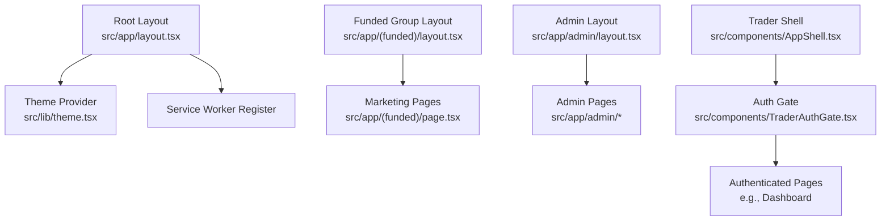
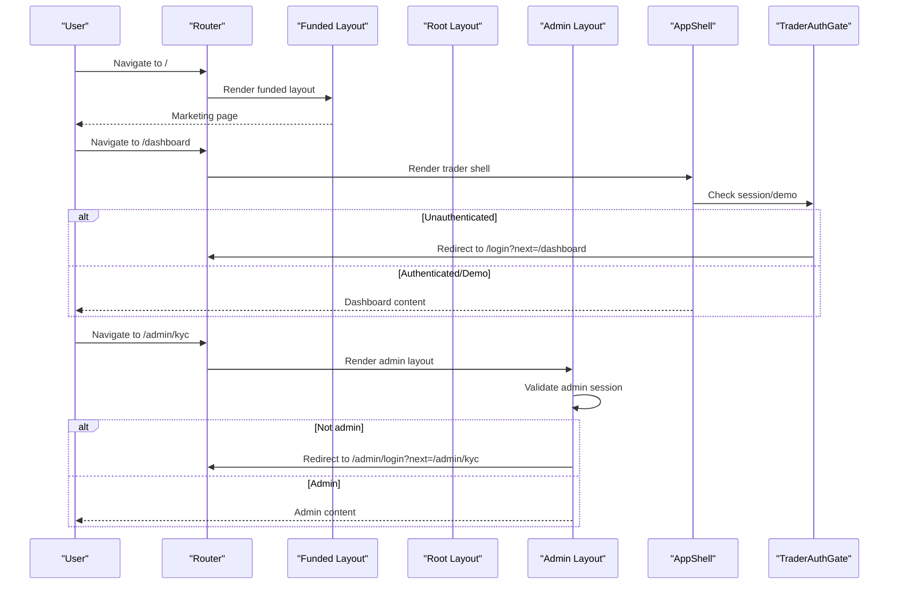
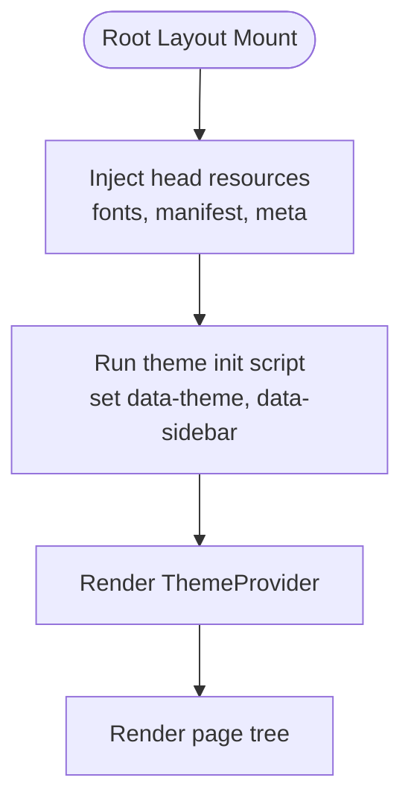
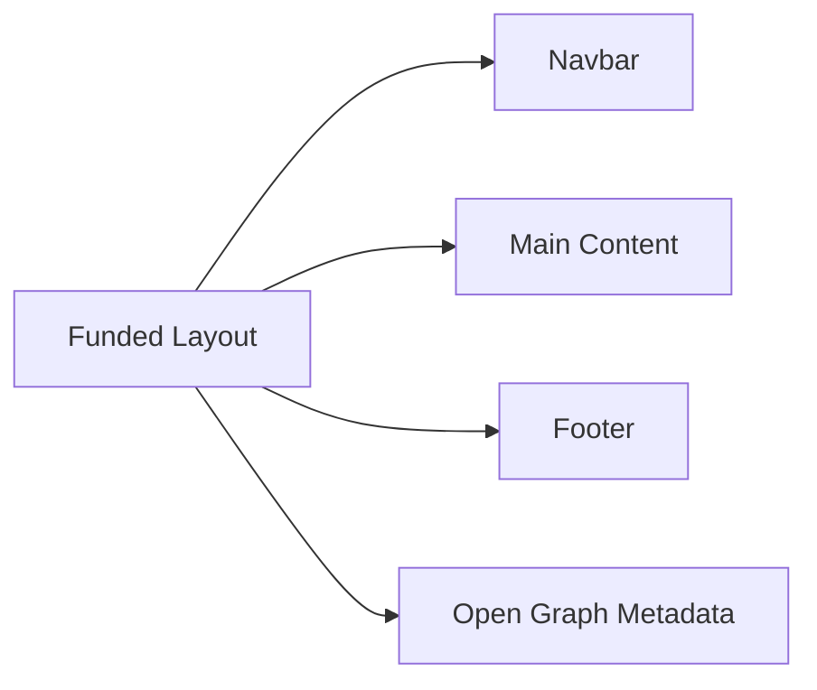
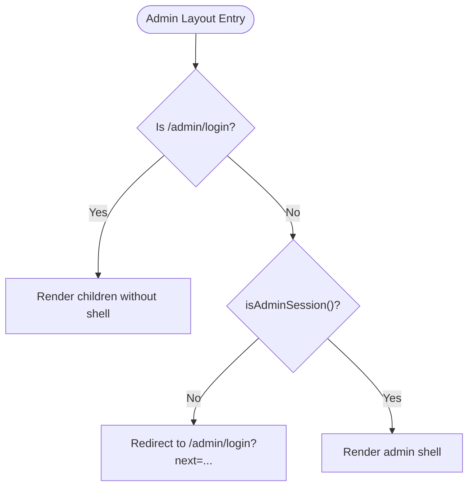
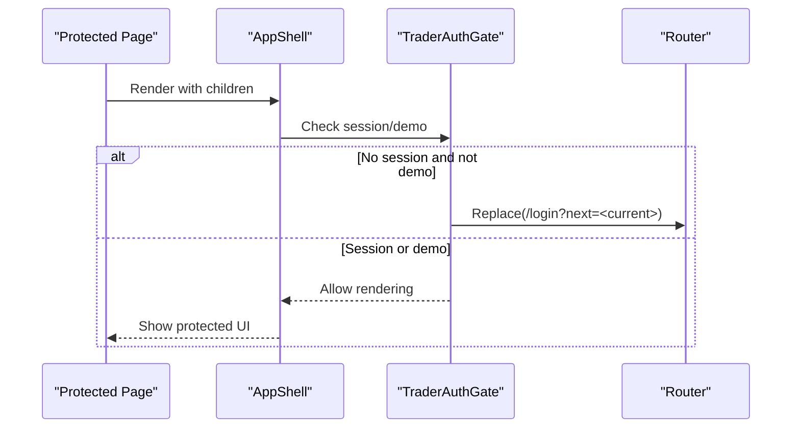
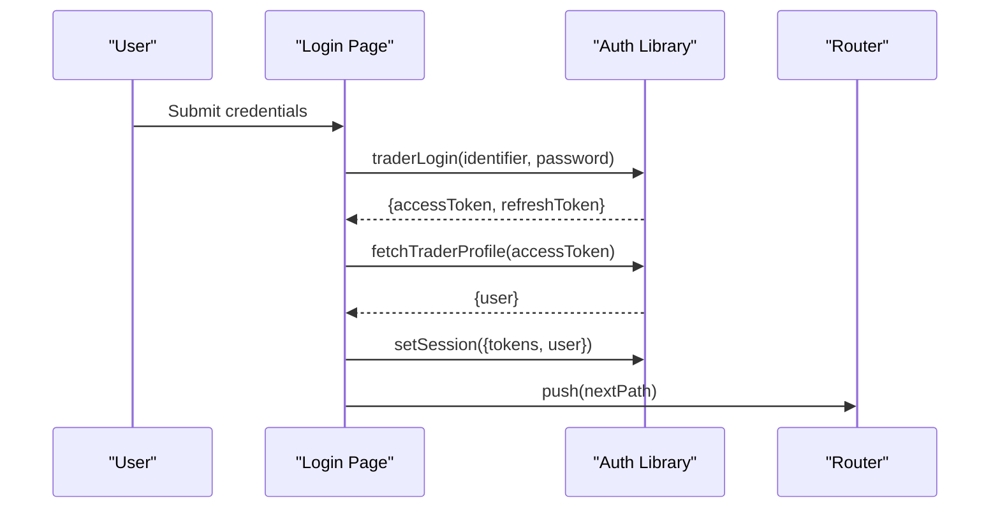
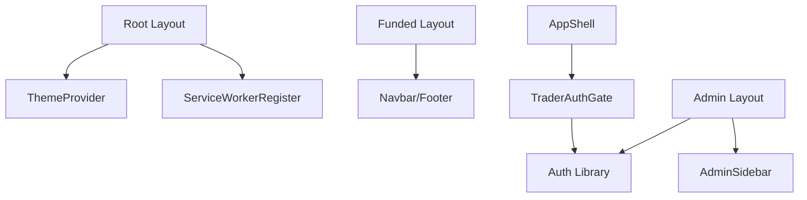

# App Router & Layout Architecture

<cite>
**Referenced Files in This Document**
- [layout.tsx](file://frontend/trader/src/app/layout.tsx)
- [theme.tsx](file://frontend/trader/src/lib/theme.tsx)
- [AppShell.tsx](file://frontend/trader/src/components/AppShell.tsx)
- [TraderAuthGate.tsx](file://frontend/trader/src/components/TraderAuthGate.tsx)
- [auth.ts](file://frontend/trader/src/lib/auth.ts)
- [page.tsx](file://frontend/trader/src/app/(funded)/page.tsx)
- [layout.tsx](file://frontend/trader/src/app/(funded)/layout.tsx)
- [layout.tsx](file://frontend/trader/src/app/admin/layout.tsx)
- [page.tsx](file://frontend/trader/src/app/admin/page.tsx)
- [page.tsx](file://frontend/trader/src/app/login/page.tsx)
</cite>

## Table of Contents
1. [Introduction](#introduction)
2. [Project Structure](#project-structure)
3. [Core Components](#core-components)
4. [Architecture Overview](#architecture-overview)
5. [Detailed Component Analysis](#detailed-component-analysis)
6. [Dependency Analysis](#dependency-analysis)
7. [Performance Considerations](#performance-considerations)
8. [Troubleshooting Guide](#troubleshooting-guide)
9. [Conclusion](#conclusion)

## Introduction
This document explains the Next.js 14 App Router structure and layout architecture for the trading platform. It covers:
- Nested routing with route groups for public marketing pages, authenticated trader routes, and administrative sections.
- Layout composition patterns that provide global theming, SEO metadata, authentication gates, and role-based access control.
- Routing strategy between public, authenticated, and administrative areas.
- Metadata management and performance considerations for layout components.

## Project Structure
The application uses Next.js App Router conventions:
- Root layout at src/app/layout.tsx provides global HTML shell, theme provider, service worker registration, and site-wide metadata.
- Route group (funded) under src/app/(funded) hosts marketing pages with a dedicated layout and fonts.
- Admin section under src/app/admin has its own layout enforcing admin session checks and an admin shell.
- Authenticated trader routes are protected via a client-side gate component used inside the app shell.

**Diagram sources**
- [layout.tsx:31-55](file://frontend/trader/src/app/layout.tsx#L31-L55)
- [theme.tsx:11-34](file://frontend/trader/src/lib/theme.tsx#L11-L34)
- [layout.tsx:20-28](file://frontend/trader/src/app/(funded)/layout.tsx#L20-L28)
- [page.tsx:10-149](file://frontend/trader/src/app/(funded)/page.tsx#L10-L149)
- [layout.tsx:7-45](file://frontend/trader/src/app/admin/layout.tsx#L7-L45)
- [AppShell.tsx:12-59](file://frontend/trader/src/components/AppShell.tsx#L12-L59)
- [TraderAuthGate.tsx:8-24](file://frontend/trader/src/components/TraderAuthGate.tsx#L8-L24)

**Section sources**
- [layout.tsx:1-56](file://frontend/trader/src/app/layout.tsx#L1-L56)
- [layout.tsx:1-29](file://frontend/trader/src/app/(funded)/layout.tsx#L1-L29)
- [layout.tsx:1-46](file://frontend/trader/src/app/admin/layout.tsx#L1-L46)
- [AppShell.tsx:1-60](file://frontend/trader/src/components/AppShell.tsx#L1-L60)

## Core Components
- Root layout: Sets global metadata, viewport, fonts, PWA manifest, and injects a theme initialization script before hydration to avoid theme flash. Wraps children with ThemeProvider and ServiceWorkerRegister.
- Funded layout: Provides marketing-specific fonts, Open Graph metadata, and composes Navbar, main content area, and Footer.
- Admin layout: Client-side guard that redirects unauthenticated users to /admin/login while preserving the intended destination. Renders an admin shell with sidebar and main area when authorized.
- Trader shell: Wraps authenticated pages with a collapsible sidebar, topbar, bottom navigation, and PWA install prompt. Enforces trader authentication via TraderAuthGate.
- Auth utilities: Centralized session handling for both trader and admin roles, including login flows, profile fetching, demo mode toggling, and admin session checks.

**Section sources**
- [layout.tsx:6-55](file://frontend/trader/src/app/layout.tsx#L6-L55)
- [theme.tsx:8-54](file://frontend/trader/src/lib/theme.tsx#L8-L54)
- [layout.tsx:12-28](file://frontend/trader/src/app/(funded)/layout.tsx#L12-L28)
- [layout.tsx:7-45](file://frontend/trader/src/app/admin/layout.tsx#L7-L45)
- [AppShell.tsx:12-59](file://frontend/trader/src/components/AppShell.tsx#L12-L59)
- [auth.ts:32-142](file://frontend/trader/src/lib/auth.ts#L32-L142)

## Architecture Overview
The routing strategy separates three zones:
- Public marketing zone: Route group (funded) with its own layout and metadata. No auth required.
- Authenticated trader zone: Protected by TraderAuthGate inside AppShell. Redirects to /login if no valid session or demo mode is not active.
- Administrative zone: Protected by AdminLayout. Requires a separate employee/admin session stored under distinct keys.

**Diagram sources**
- [layout.tsx:20-28](file://frontend/trader/src/app/(funded)/layout.tsx#L20-L28)
- [layout.tsx:7-45](file://frontend/trader/src/app/admin/layout.tsx#L7-L45)
- [AppShell.tsx:12-59](file://frontend/trader/src/components/AppShell.tsx#L12-L59)
- [TraderAuthGate.tsx:8-24](file://frontend/trader/src/components/TraderAuthGate.tsx#L8-L24)

## Detailed Component Analysis

### Root Layout and Global Theme
- Metadata and viewport define title, description, PWA manifest, Apple web app settings, and icons.
- Fonts are preconnected and loaded in <head>.
- A small inline script runs before React hydrates to set data-theme and sidebar state from localStorage or system preference, preventing flash and layout shifts.
- ThemeProvider persists theme selection and exposes toggle/set methods via context.

**Diagram sources**
- [layout.tsx:6-55](file://frontend/trader/src/app/layout.tsx#L6-L55)
- [theme.tsx:8-54](file://frontend/trader/src/lib/theme.tsx#L8-L54)

**Section sources**
- [layout.tsx:6-55](file://frontend/trader/src/app/layout.tsx#L6-L55)
- [theme.tsx:11-54](file://frontend/trader/src/lib/theme.tsx#L11-L54)

### Funded Experience Layout (Marketing)
- Dedicated layout sets Google fonts variables and applies a root class for styling.
- Metadata includes dynamic title templates, description, metadata base URL, and Open Graph fields sourced from site configuration.
- Composes Navbar, main content, and Footer for consistent marketing UX.

**Diagram sources**
- [layout.tsx:12-28](file://frontend/trader/src/app/(funded)/layout.tsx#L12-L28)

**Section sources**
- [layout.tsx:1-29](file://frontend/trader/src/app/(funded)/layout.tsx#L1-L29)
- [page.tsx:10-149](file://frontend/trader/src/app/(funded)/page.tsx#L10-L149)

### Admin Layout with Role-Based Access Control
- Uses client-side hooks to read current pathname and determine if the route is the bare login page.
- If not the login page and no admin session exists, redirects to /admin/login with encoded next parameter.
- Renders an admin shell with sidebar and main area once ready.

**Diagram sources**
- [layout.tsx:7-45](file://frontend/trader/src/app/admin/layout.tsx#L7-L45)
- [auth.ts:138-142](file://frontend/trader/src/lib/auth.ts#L138-L142)

**Section sources**
- [layout.tsx:1-46](file://frontend/trader/src/app/admin/layout.tsx#L1-L46)
- [auth.ts:138-142](file://frontend/trader/src/lib/auth.ts#L138-L142)
- [page.tsx:1-3](file://frontend/trader/src/app/admin/page.tsx#L1-L3)

### Protected Routes for Authenticated Users
- AppShell wraps all authenticated pages and integrates a collapsible sidebar, topbar, bottom nav, and PWA install prompt.
- TraderAuthGate ensures only authenticated traders or explicit demo mode can render protected content; otherwise, it redirects to /login with the intended destination preserved.

**Diagram sources**
- [AppShell.tsx:12-59](file://frontend/trader/src/components/AppShell.tsx#L12-L59)
- [TraderAuthGate.tsx:8-24](file://frontend/trader/src/components/TraderAuthGate.tsx#L8-L24)

**Section sources**
- [AppShell.tsx:1-60](file://frontend/trader/src/components/AppShell.tsx#L1-L60)
- [TraderAuthGate.tsx:1-25](file://frontend/trader/src/components/TraderAuthGate.tsx#L1-L25)

### Authentication Flows and Session Management
- Trader login: Authenticates via API, fetches profile, clears demo mode, stores session tokens and user info, then navigates to the intended route.
- Admin login: Separate flow using admin endpoints and storing employee session under distinct keys.
- Demo mode: Allows browsing protected UI without a JWT by setting a flag and clearing trader session.

**Diagram sources**
- [page.tsx:23-41](file://frontend/trader/src/app/login/page.tsx#L23-L41)
- [auth.ts:205-237](file://frontend/trader/src/lib/auth.ts#L205-L237)

**Section sources**
- [page.tsx:1-130](file://frontend/trader/src/app/login/page.tsx#L1-L130)
- [auth.ts:32-142](file://frontend/trader/src/lib/auth.ts#L32-L142)
- [auth.ts:205-266](file://frontend/trader/src/lib/auth.ts#L205-L266)

## Dependency Analysis
- Root layout depends on ThemeProvider and ServiceWorkerRegister to bootstrap theme and offline capabilities.
- Funded layout depends on marketing components and site metadata configuration.
- Admin layout depends on admin session checks and admin shell components.
- AppShell depends on TraderAuthGate and various UI components for the trader experience.
- Auth library centralizes session logic used across login, admin, and protected routes.

**Diagram sources**
- [layout.tsx:31-55](file://frontend/trader/src/app/layout.tsx#L31-L55)
- [layout.tsx:20-28](file://frontend/trader/src/app/(funded)/layout.tsx#L20-L28)
- [layout.tsx:7-45](file://frontend/trader/src/app/admin/layout.tsx#L7-L45)
- [AppShell.tsx:12-59](file://frontend/trader/src/components/AppShell.tsx#L12-L59)
- [auth.ts:32-142](file://frontend/trader/src/lib/auth.ts#L32-L142)

**Section sources**
- [layout.tsx:31-55](file://frontend/trader/src/app/layout.tsx#L31-L55)
- [layout.tsx:20-28](file://frontend/trader/src/app/(funded)/layout.tsx#L20-L28)
- [layout.tsx:7-45](file://frontend/trader/src/app/admin/layout.tsx#L7-L45)
- [AppShell.tsx:12-59](file://frontend/trader/src/components/AppShell.tsx#L12-L59)
- [auth.ts:32-142](file://frontend/trader/src/lib/auth.ts#L32-L142)

## Performance Considerations
- Avoid theme flash: The root layout injects a minimal script before hydration to set data-theme based on localStorage or system preference.
- Font loading: Use font display swap and preconnect to reduce blocking and improve perceived load time.
- Early state synchronization: AppShell reads data attributes set by the boot script to match sidebar state on first paint, preventing layout jumps.
- Minimal client work in layouts: Keep layouts focused on composition and guards; defer heavy computations to page-level components.
- PWA readiness: Register service workers early to enable caching and offline capabilities where appropriate.

[No sources needed since this section provides general guidance]

## Troubleshooting Guide
- Unexpected redirect to login: Ensure a valid trader session exists or enable demo mode. Verify that the next parameter is correctly encoded and safe.
- Admin routes not accessible: Confirm an admin session is present. If missing, navigate to /admin/login and ensure the next parameter preserves the intended destination.
- Theme flicker on reload: Verify the theme init script runs before React hydration and that localStorage contains a valid theme value.
- Login errors: Handle specific error codes returned by the backend (e.g., invalid credentials, account suspended, approval pending) and surface clear messages to users.

**Section sources**
- [TraderAuthGate.tsx:8-24](file://frontend/trader/src/components/TraderAuthGate.tsx#L8-L24)
- [layout.tsx:7-45](file://frontend/trader/src/app/admin/layout.tsx#L7-L45)
- [page.tsx:23-61](file://frontend/trader/src/app/login/page.tsx#L23-L61)
- [theme.tsx:8-54](file://frontend/trader/src/lib/theme.tsx#L8-L54)

## Conclusion
The application leverages Next.js App Router features to organize public, authenticated, and administrative sections cleanly:
- Route groups isolate marketing content with dedicated layouts and metadata.
- Client-side guards enforce authentication and role-based access without server-rendered complexity.
- Global theming and PWA setup are centralized in the root layout for consistency and performance.
- Clear separation of concerns between layouts, shells, and pages improves maintainability and scalability.

[No sources needed since this section summarizes without analyzing specific files]